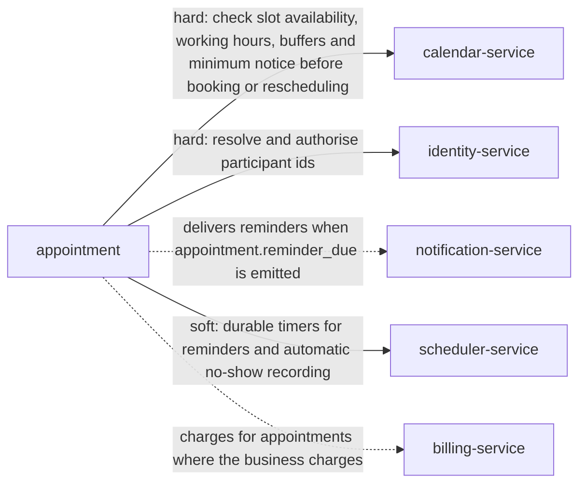

> Snapshot of core/appointment version 0.12.3, saved 2026-10-09. The current version is at https://knowledge-graph-ecru.vercel.app/docs/core/appointment.md.

# Appointment (/docs/core/appointment)

## Module identity

- module: appointment
- layer: core
- extended by: Clinical appointments (healthcare, /docs/healthcare/appointment); Appointments (ehr, /docs/healthcare/ehr/appointment)
- version: 0.12.3
- status: stable

## How to read this spec

- This is the complete spec for this page, with every inherited item already merged in.
- If a behaviour is not listed here, it is unspecified. Do not assume or invent it. Ask, or record it as an open question.
- Ids such as BR-1, FR-2 and AC-3 are stable. Cite them in code, tests and commit messages.
- Items that start with "US only:" or "EU only:" apply only in that jurisdiction. Skip the ones for a jurisdiction your project doesn't operate in, or add ?jurisdiction=us or ?jurisdiction=eu to this URL to leave them out. Unmarked items apply everywhere.
- This is the core appointment specification: nothing is inherited, and industry and domain pages build on it.

## Purpose & scope

Own the lifecycle of a reserved time slot between participants, independent of what the appointment is for.

**In scope**

- Book, confirm, reschedule, update, cancel and close out an appointment
- Group appointments with a seat limit, and appointments that belong to a series
- Own the status lifecycle and its legal transitions
- Prevent overlapping appointments for the same participant
- Keep times correct across time zones and daylight saving changes, and show them in each participant's own time zone
- Schedule reminders relative to the start time
- Record attendance per participant
- Emit lifecycle events other modules react to

**Out of scope**

- Owning participant identity, which belongs to the Identity module
- Owning payment or billing, which belongs to the Billing module
- Owning what happens during the appointment, such as notes or outcomes
- Computing availability, working hours, buffers or minimum booking notice. Appointment asks Calendar.
- Defining appointment types (default length, booking limits). They belong to an Appointment type module.
- Defining recurrence patterns. A Recurrence module expands a pattern into individual appointments that share a series.
- Booking rooms, chairs or devices. Industry and domain layers add resources where they need them.
- Delivering notifications. Appointment emits reminder_due and Notification delivers it.
- Prescribing storage, transport or code. This specification states what must happen, not how it is built.

## Overview

### Product perspective

Solid arrows are services this module calls; dotted arrows are services it notifies.



### Actors

| Actor | Description |
| --- | --- |
| Requester | Party who initiates a booking. May be a participant or someone acting on their behalf. |
| Participant | Party expected to attend. Every appointment has at least two. |
| Scheduler | Operator with elevated rights to book, move, cancel or close out appointments on behalf of others. |
| System | Automated actor that dispatches reminders and, where enabled, records no-shows after a grace period. |

### Assumptions and dependencies

**AS-1** Calendar is the authority on availability, including working hours, buffers, minimum notice and how far ahead bookings are allowed.
  - Why: Appointment asks Calendar instead of computing availability (ADR-4). If Calendar answers wrongly, Appointment books what it was told is free.
**AS-2** Identity ids stay resolvable for the life of an appointment, including after a participant's account is deactivated.
  - Why: Appointments are kept forever (BR-2) and keep referring to their participants. Identity owns what happens to the person behind the id.
**AS-3** Notification delivers reminders and formats times for each participant. Appointment only decides when a reminder is due.
  - Why: Channels, templates and languages vary by deployment and don't belong in the booking lifecycle.
**AS-4** Server clocks are synchronised to UTC, for example with NTP.
  - Why: Whether a start time is in the future, and when a reminder fires, are decided by server time. A drifting clock accepts bookings in the past and sends reminders late.
**AS-5** Identity can hold a person's preferred time zone and locale.
  - Why: People move and travel. Reading the current preference keeps times and reminders right without editing every appointment (BR-9).
**AS-6** When a calendar closes, its active appointments are cancelled through Cancel in bulk, each with a reason.
  - Why: Every appointment belongs to one calendar. How and when a calendar closes is Calendar's concern; this module only provides the way to cancel what is on it.
**AS-7** This module tells Calendar the status of every appointment through its events. How Calendar shows that time is Calendar's concern.
  - Why: Keeps the boundary clean. For pending appointments, iCalendar's BUSY-TENTATIVE free/busy type is the natural fit.

## Functions

### Business rules

**BR-1** An appointment must have at least two distinct participants.
  - Why: A single-party slot is a calendar block, not an appointment. Keeping them distinct stops this module absorbing calendar concerns.
**BR-2** Cancelling never deletes the record. It sets status = cancelled and records who cancelled, when and why.
  - Why: Billing, audit and analytics hold references to the appointment id and break on hard delete. Cancellation reasons are also the main input for reducing late cancellations.
**BR-3** Rescheduling keeps the appointment id and records the previous times in the appointment's history. It never creates a new appointment.
  - Why: Attendance and no-show statistics must follow one appointment across time changes. Cancel-and-rebook would count every reschedule as a cancellation.
**BR-4** A participant cannot have two active appointments whose slots overlap. Slots are half-open, so an appointment ending at 10:00 and one starting at 10:00 do not overlap.
  - Why: Double booking is a data-integrity failure, not a user preference, so it must hold under concurrent requests. Treating the end as inclusive would reject every back-to-back schedule.
**BR-5** Completed and cancelled are terminal: the appointment never changes again. A no-show can change only to completed, to correct a wrong record (BR-19).
  - Why: Terminal states let consumers treat records as final. A no-show is the one exception, because a mistaken no-show can trigger fees and must be correctable.
**BR-6** Every appointment has one reference time zone. Its times are stored as wall-clock time in that zone, and absolute instants are derived from them and recomputed for future appointments when time zone rules change.
  - Why: People agree to a time in a particular place, such as 09:00 in New York. Governments change daylight saving rules with little notice, and an instant computed before the change would move the appointment.
**BR-7** A reminder whose dispatch time has already passed when the appointment is booked or rescheduled is skipped. It never causes the booking to fail.
  - Why: With a 24-hour default, rejecting such bookings would block every same-day appointment. The remaining reminders still fire.
**BR-8** A no-show can be recorded only after the appointment's start time. By default a Scheduler records it; automatic recording after a grace period is a per-deployment setting.
  - Why: Leading scheduling products record no-shows manually, because only staff know whether someone is running late, attended remotely or was seen elsewhere. A wrongly recorded no-show is terminal and can trigger fees.
**BR-9** Every participant sees the appointment, and receives its reminders, in their own time zone and language: the ones set on the appointment, otherwise their preferences in Identity, otherwise the appointment's time zone and default_locale. Times shown always include the zone or offset.
  - Why: Participants in different countries share one moment, not one clock reading. The gap between two zones also changes during the year because countries switch daylight saving time on different dates, so a fixed offset per participant would be wrong for weeks at a time.
**BR-10** A wall-clock time that doesn't exist in the reference time zone, because clocks went forward, is rejected. A wall-clock time that occurs twice, because clocks went back, must come with a UTC offset to say which one is meant; without one it's rejected.
  - Why: Guessing silently books the wrong hour. A time sent with its UTC offset removes the doubt.
**BR-11** When a participant's personal data must be erased, notes, location and cancelled_reason are cleared, identity ids are replaced with an anonymous placeholder, and anonymised_at is set. The appointment, its status and its times are kept. Data needed for a legal obligation or legal claims is kept until that need ends.
  - Why: GDPR Article 17 gives people a right to erasure, but Article 17(3) allows keeping data needed for a legal obligation or legal claims. Clearing personal fields instead of deleting the row keeps billing and audit references intact (BR-2).
**BR-12** A reminder is never sent after the appointment has started.
  - Why: After an outage, a scheduler can fire a backlog of overdue reminders at once. A reminder for an appointment that has already started is noise, and for a past one it's wrong.
**BR-13** A group appointment never holds more participants than its capacity.
  - Why: Group sessions have a physical or practical limit. Cal.com calls these seats per time slot, and Calendly allows 2 to 9,999 invitees per group event.
**BR-14** Every change to an appointment, including cancellation, must name the revision it was based on, and increases the revision by 1. A change based on an older revision is rejected.
  - Why: Without it, someone can cancel an appointment that was just moved without ever seeing the new time.
**BR-15** Reminder offsets are exact durations before start_at. Across a clock change, a 24-hour reminder lands an hour earlier or later on the clock.
  - Why: This matches how Google Calendar defines reminders (minutes before the start). For 09:00 on 8 March 2026 in New York, the 24-hour reminder fires at 08:00 the day before.
**BR-16** An appointment can be rescheduled, updated, given new participants or cancelled only while it is active and before its end. After the end, only close-out is allowed.
  - Why: Once an appointment is over, what's left is to record what happened. Moving or cancelling it afterwards would rewrite history.
**BR-17** When requires_confirmation is on, a booking starts as pending and gets no reminders. While pending_holds_slot is on, it holds its slot. It becomes booked when confirmed, and is cancelled with the reason "not confirmed" if confirm_by passes first.
  - Why: Cal.com holds bookings that need confirmation as pending, and iCalendar has a TENTATIVE status. Holding the slot means a confirmation never fails because someone else took it; turning it off keeps the slot open to others, at the cost that confirming can fail.
**BR-18** A cancellation made within late_cancellation_window before the start is marked as a late cancellation.
  - Why: Late cancellations cost a booked slot that can rarely be refilled. Industry layers use the mark, for example to charge a fee or record a code.
**BR-19** A Scheduler can correct a no-show to completed. The correction is kept in the history.
  - Why: Cal.com lets hosts change attendance after the fact. A wrong no-show can count against someone and trigger fees.
**BR-20** Participants who are not Schedulers cannot cancel or reschedule within self_service_cutoff before the start.
  - Why: A business needs time to refill a slot. Acuity Scheduling lets businesses set this limit and suggests 12 hours by default.
**BR-21** Attendance is recorded per participant at close-out. Completing marks participants as attended unless stated otherwise; recording a no-show names at least one absent participant.
  - Why: In a group, some people come and some don't. Cal.com records absence separately for the host and each attendee.
**BR-22** Each appointment in a series is independent. Rescheduling, cancelling or closing out one never changes the others.
  - Why: Cal.com creates a separate booking for each occurrence, linked by a recurring id. Independent occurrences keep this lifecycle the same for every appointment.
**BR-23** A participant can be removed only if at least two participants remain.
  - Why: BR-1 must keep holding after every change, not only at booking.
**BR-24** If an appointment has a participant with the role host, the last host cannot be removed.
  - Why: A host confirms, updates and changes participants (permission matrix). Without one, a group appointment has nobody to run it.
**BR-25** Fields the service sets, such as status, start_at, end_at, history, rebooked_from_id and the cancellation and completion fields, cannot be written by clients. Status changes only through its operations.
  - Why: A client that writes status directly skips the state machine, its guards and its events. One that writes start_at bypasses the time zone rules.
**BR-26** Each participant has a response: needs_action until they answer, then accepted, declined or tentative; the participant who books is accepted. Only the participant, or a Scheduler for them, records it. A participant who declines gets no reminders. When a required participant declines, the appointment is not cancelled automatically; appointment.participant_responded tells the host or a Scheduler, who decides.
  - Why: iCalendar gives every attendee a participation status (PARTSTAT) and a role saying whether they are required (RFC 5545), and calendar products show who accepted or declined. Without it, an appointment whose other party already said no looks confirmed. Cancelling automatically would remove an appointment the host may want to keep with someone else.
**BR-27** A cancelled appointment can be rebooked at a new time. The new appointment copies its participants and details, records rebooked_from_id, and is checked like any booking. The cancelled appointment never changes.
  - Why: Cancelled is terminal (BR-5), so a cancellation made by mistake, or one the participants want to undo, is reversed by rebooking. The link keeps the history that a fresh booking would lose, and the original slot may already be taken, so the new one is checked again.

### State machine

Initial state: `booked`. States: `pending`, `booked`, `cancelled`, `completed`, `no_show`.
Any transition not listed below is invalid.

| From | To | Trigger | Guard |
| --- | --- | --- | --- |
| pending | booked | confirm | confirm_by has not passed, revision matches, and the slot is still free when pending_holds_slot is off |
| pending | pending | reschedule or update | before the end, revision matches |
| pending | cancelled | cancel | cancelled_reason provided, revision matches |
| pending | cancelled | expire | confirm_by has passed |
| booked | booked | reschedule or update | before the end, new slot is free and in the future, revision matches |
| booked | cancelled | cancel | before the end, cancelled_reason provided, revision matches |
| booked | completed | complete | start_at has passed |
| booked | no_show | record_no_show | start_at has passed, at least one absent participant named |
| no_show | completed | correct_attendance | actor is a Scheduler |

### Workflows

#### Book an appointment
Actor: Requester
Trigger: Requester submits a booking request

1. Validate the time range, duration, time zone, participants and capacity
2. Ask Calendar whether the slot is free for every participant
3. Check for overlapping active appointments and save the appointment in one step, as pending if requires_confirmation is on, otherwise as booked, at revision 0
4. If booked, schedule one reminder per offset whose dispatch time is still in the future
5. Emit appointment.booked

Outcome: The appointment holds its slot, as pending or booked.

#### Reschedule an appointment
Actor: Scheduler
Trigger: Requester or Scheduler proposes a new time

1. Verify the appointment is active, before its end, and that the supplied revision matches
2. Validate the new slot and check availability with Calendar
3. Check for overlaps, update the times, increase revision and record the previous times in history, in one step
4. Withdraw pending reminders and schedule new ones from the new start
5. Emit appointment.rescheduled

Outcome: The same appointment id now holds the new slot, with a higher revision.

#### Cancel an appointment
Actor: Requester
Trigger: Requester, Scheduler or an upstream policy cancels

1. Verify the appointment is booked
2. Record cancelled_reason, cancelled_by and cancelled_at, and set status = cancelled
3. Withdraw pending reminders
4. Emit appointment.cancelled

Outcome: The appointment is retained as cancelled, its slot is released and no reminders fire.

#### Close out an appointment
Actor: Scheduler
Trigger: The start time has passed

1. If the appointment took place, complete it, record completed_at, and record attendance per participant
2. If a participant did not attend, record a no-show naming the absent participants
3. Emit appointment.completed or appointment.no_show

Outcome: The appointment reaches a terminal state that reflects what happened.

#### Dispatch a reminder
Actor: System
Trigger: A scheduled reminder's dispatch time is reached

1. Confirm the appointment is still booked and the reminder belongs to its current revision
2. Emit appointment.reminder_due
3. Notification delivers it to the participants

Outcome: Participants are reminded ahead of the appointment, and never about a superseded time.

#### Confirm a pending appointment
Actor: Scheduler
Trigger: A Scheduler or the host confirms

1. Verify the appointment is pending, confirm_by has not passed and the revision matches
2. Set status to booked and increase revision
3. Schedule its reminders
4. Emit appointment.confirmed

Outcome: The appointment is booked and its reminders are scheduled.

#### Expire an unconfirmed appointment
Actor: System
Trigger: confirm_by passes while the appointment is pending

1. Cancel the appointment with the reason "not confirmed"
2. Release its slot
3. Emit appointment.cancelled

Outcome: The slot is free again.

#### Update details
Actor: Scheduler
Trigger: A participant or Scheduler changes the location, notes, reminders or capacity

1. Verify the appointment is active, before its end, and the revision matches
2. Apply the change and increase revision
3. Re-derive pending reminders
4. Emit appointment.updated

Outcome: The appointment shows the new details at a new revision.

#### Add or remove a participant
Actor: Scheduler
Trigger: A Scheduler or the host changes who attends

1. Verify the appointment is active, before its end, and the revision matches
2. For an addition, check capacity and that the new participant has no overlapping active appointment
3. For a removal, check that at least two participants remain
4. Apply the change and increase revision
5. Emit appointment.participant_added or appointment.participant_removed

Outcome: The participant list changes, and the overlap and capacity rules still hold.

#### Cancel in bulk
Actor: Scheduler
Trigger: A Scheduler cancels many appointments at once: one participant in a time window (for example when a provider is ill), or the remaining appointments of a series

1. Find the active appointments that match: the participant within the window, or the series from a given time onwards
2. Cancel each one separately with the given reason, as in Cancel an appointment
3. Return the result for each appointment, including any that could not be cancelled

Outcome: Each appointment is cancelled on its own, with its own events and reminders withdrawn.

#### Correct a no-show
Actor: Scheduler
Trigger: A Scheduler finds a no-show was recorded by mistake

1. Verify the appointment is a no-show
2. Change it to completed and record attendance
3. Keep the correction in the history
4. Emit appointment.attendance_corrected

Outcome: The appointment is completed and the mistake is traceable.

#### Signal the end
Actor: System
Trigger: end_at passes while the appointment is still booked

1. Emit appointment.ended so a Scheduler knows it needs closing out

Outcome: Appointments are not forgotten in booked after they finish.

#### Record a no-show automatically
Actor: System
Trigger: automatic_no_show is on and no_show_grace_period has passed after start_at with no completion

1. Record a no-show with every participant marked absent, and no_show_recorded_by = system
2. Increase revision and add the change to history
3. Emit appointment.no_show

Outcome: Forgotten appointments are closed out. A Scheduler can still correct the record (BR-19).

#### Erase personal data
Actor: System
Trigger: A request to erase a person's data, or personal_data_retention passing after an appointment's end

1. Find the person's appointments, skipping data that must be kept for a legal obligation or claim
2. Clear notes, location and cancelled_reason, and replace the identity ids in participants and history with an anonymous placeholder
3. Set anonymised_at, increase revision and add the change to history
4. Emit appointment.anonymised for each appointment changed

Outcome: The person is no longer identifiable from their appointments, and the records still add up.

#### Reschedule in bulk
Actor: Scheduler
Trigger: A Scheduler moves many appointments at once, for example when a provider changes the day they work

1. Find the active appointments that match the selection
2. Work out each new slot: the new time and weekday, or the shift applied to its wall-clock times
3. Reschedule each one separately, as in Reschedule an appointment, with its own checks and events
4. Return the result for each appointment, including any that could not be moved

Outcome: Each appointment keeps its id, calendar and history, and none moves into a conflict.

### Validations

| Field | Rule | Error |
| --- | --- | --- |
| start_time | must be strictly before end_time | APPOINTMENT_INVALID_TIME_RANGE |
| start_time | start_at must be in the future when booking or rescheduling | APPOINTMENT_START_IN_PAST |
| start_time | must exist in time_zone; a wall-clock time skipped by a daylight saving change is rejected | APPOINTMENT_INVALID_LOCAL_TIME |
| start_time | a wall-clock time that occurs twice in time_zone must come with a UTC offset | APPOINTMENT_AMBIGUOUS_LOCAL_TIME |
| time_zone | must be a valid IANA time zone name | APPOINTMENT_INVALID_TIME_ZONE |
| participants | each participant time_zone, when given, must be a valid IANA time zone name | APPOINTMENT_INVALID_TIME_ZONE |
| participants | each participant locale, when given, must be a valid BCP 47 language tag | APPOINTMENT_INVALID_LOCALE |
| participants | at least 2 entries, all resolvable identity ids, no duplicates | APPOINTMENT_INVALID_PARTICIPANTS |
| reminder_offsets | every offset must be positive | APPOINTMENT_INVALID_REMINDER_OFFSET |
| cancelled_reason | required when cancelling | APPOINTMENT_CANCEL_REASON_REQUIRED |
| revision | every change must supply the current revision | APPOINTMENT_REVISION_CONFLICT |
| end_time | end_at minus start_at must be within min_duration and max_duration when those are set | APPOINTMENT_INVALID_DURATION |
| capacity | must be at least 2, and at least the current number of participants | APPOINTMENT_INVALID_CAPACITY |
| page_size | must be between 1 and max_page_size | APPOINTMENT_INVALID_PAGE_SIZE |
| bulk filter | exactly one of: a participant with a time window, or a series | APPOINTMENT_INVALID_BULK_FILTER |
| bulk change | exactly one of: a new time and weekday, or a shift | APPOINTMENT_INVALID_BULK_CHANGE |
| id, start_at, end_at, tz_version, status, confirm_by, late_cancellation, history, created_at, updated_at, cancelled_by, cancelled_at, completed_at, no_show_recorded_by, anonymised_at | never sent by clients (BR-25) | APPOINTMENT_READ_ONLY_FIELD |
| location | plain text or an https URL, at most max_text_length characters | APPOINTMENT_INVALID_TEXT |
| notes | plain text, at most max_text_length characters | APPOINTMENT_INVALID_TEXT |
| series_id, appointment_type_id | refer to an existing series or appointment type | APPOINTMENT_INVALID_REFERENCE |
| participants response | needs_action, accepted, declined or tentative, recorded by the participant or a Scheduler | APPOINTMENT_INVALID_RESPONSE |

### Edge cases

**EC-1** Two requests book overlapping slots for the same participant at the same moment.
  - Required behaviour: Exactly one succeeds. The other fails with APPOINTMENT_SLOT_TAKEN.
  - Covered by: BR-4, FR-2, CON-2, AC-4
**EC-2** A client times out and retries a booking that actually succeeded.
  - Required behaviour: With the same Idempotency-Key, the retry returns the original appointment and nothing new is booked.
  - Covered by: FR-8, AC-9
**EC-3** One appointment ends at 10:00 and another for the same participant starts at 10:00.
  - Required behaviour: Both are allowed. Slots exclude their end, so back-to-back isn't an overlap.
  - Covered by: BR-4, AC-3
**EC-4** An appointment is booked 3 hours ahead, with a 24-hour reminder.
  - Required behaviour: The booking succeeds and the 24-hour reminder is skipped. Later reminders still fire.
  - Covered by: BR-7, AC-6
**EC-5** A booking asks for 02:30 in New York on 8 March 2026, a time skipped when clocks go forward.
  - Required behaviour: Rejected with APPOINTMENT_INVALID_LOCAL_TIME.
  - Covered by: BR-10, AC-17
**EC-6** A booking asks for 01:30 in New York on 1 November 2026, which happens twice when clocks go back.
  - Required behaviour: Rejected with APPOINTMENT_AMBIGUOUS_LOCAL_TIME unless it carries a UTC offset that picks one.
  - Covered by: BR-10, AC-15, AC-16
**EC-7** An appointment from 00:30 to 02:30 in New York on 1 November 2026 spans the clock change.
  - Required behaviour: It lasts 3 hours, not 2. Overlap checks, reminders and length are all computed from start_at and end_at.
  - Covered by: BR-6
**EC-8** Participants are in New York and Zurich in the weeks when only the United States has switched to daylight saving time.
  - Required behaviour: A 09:00 New York appointment on 10 March 2026 shows as 14:00 in Zurich, not 15:00.
  - Covered by: BR-9, AC-14
**EC-9** A government changes its time zone rules after appointments have been booked.
  - Required behaviour: start_time stays as agreed. start_at, end_at and pending reminders are recomputed with the new time zone database release.
  - Covered by: BR-6, FR-7, CON-4, AC-11
**EC-10** Two people reschedule the same appointment at the same time.
  - Required behaviour: The first succeeds. The second sends a revision that is now out of date and fails with APPOINTMENT_REVISION_CONFLICT.
  - Covered by: FR-9, AC-8
**EC-11** A reminder fires for a time the appointment was moved away from.
  - Required behaviour: The reminder belongs to an older revision, so it's dropped and the reminder for the current time is sent instead.
  - Covered by: FR-4
**EC-12** An appointment is cancelled while one of its reminders is being dispatched.
  - Required behaviour: Dispatch checks the status first, so no reminder is sent for a cancelled appointment.
  - Covered by: FR-4, AC-12
**EC-13** Calendar is down when someone books.
  - Required behaviour: The booking fails with APPOINTMENT_AVAILABILITY_UNAVAILABLE and nothing is saved.
  - Covered by: FR-13, AC-18
**EC-14** Notification is down when a reminder is due.
  - Required behaviour: appointment.reminder_due is still emitted. Bookings and other changes carry on unaffected.
  - Covered by: AS-3
**EC-15** Someone tries to change a completed, cancelled or no-show appointment.
  - Required behaviour: Rejected with APPOINTMENT_TERMINAL_STATE, and the record is unchanged.
  - Covered by: BR-5, AC-5
**EC-16** A Scheduler records a no-show before the appointment has started.
  - Required behaviour: Rejected with APPOINTMENT_NOT_YET_STARTED.
  - Covered by: BR-8, AC-10
**EC-17** A participant's account is deactivated after the appointment was booked.
  - Required behaviour: The appointment keeps the participant's id, which Identity keeps resolvable.
  - Covered by: AS-2
**EC-18** The same identity is listed twice as a participant.
  - Required behaviour: Rejected with APPOINTMENT_INVALID_PARTICIPANTS.
  - Covered by: BR-1
**EC-19** The scheduler is down for hours and recovers with a backlog of overdue reminders.
  - Required behaviour: Reminders for appointments that haven't started are sent. Reminders for appointments that have already started are dropped.
  - Covered by: BR-12, AC-26
**EC-20** A participant asks for their data to be erased while a legal claim about the appointment is open.
  - Required behaviour: Fields needed for the claim are kept until it's resolved, then erased under BR-11.
  - Covered by: BR-11
**EC-21** The service publishes an event and then fails before recording that it did.
  - Required behaviour: The event is published again with the same id, and consumers discard the duplicate.
  - Covered by: DG-1, FR-15
**EC-22** A consumer receives appointment.rescheduled at revision 3 after it already applied revision 4.
  - Required behaviour: The consumer ignores the older event.
  - Covered by: DG-2
**EC-23** An appointment at 09:00 on 8 March 2026 in New York has a 24-hour reminder.
  - Required behaviour: The reminder fires at 08:00 on 7 March, exactly 24 hours before, because clocks go forward in between.
  - Covered by: BR-15, AC-29
**EC-24** Someone cancels an appointment that was rescheduled after they last looked at it.
  - Required behaviour: The cancellation names the old revision and is rejected with APPOINTMENT_REVISION_CONFLICT.
  - Covered by: BR-14, AC-30
**EC-25** A participant moves to another country after booking.
  - Required behaviour: Their times and reminders follow their new time zone in Identity, unless the appointment sets one for them.
  - Covered by: BR-9, AS-5
**EC-26** A calendar is closed while it still has active appointments.
  - Required behaviour: They are cancelled through Cancel in bulk, each with a reason and its own events. How the calendar closes is Calendar's concern.
  - Covered by: AS-6, FR-19
**EC-27** A guest tries to join a group appointment that is full.
  - Required behaviour: Rejected with APPOINTMENT_FULL.
  - Covered by: BR-13, AC-31
**EC-28** Nobody confirms a pending appointment before confirm_by.
  - Required behaviour: It is cancelled with the reason "not confirmed" and its slot is released.
  - Covered by: BR-17, AC-32
**EC-29** Someone tries to cancel or reschedule an appointment after its end.
  - Required behaviour: Rejected with APPOINTMENT_ENDED. It can only be completed or recorded as a no-show.
  - Covered by: BR-16, AC-33
**EC-30** A participant tries to cancel 2 hours before the start with a 12-hour self_service_cutoff.
  - Required behaviour: Rejected with APPOINTMENT_CUTOFF_PASSED. A Scheduler can still cancel.
  - Covered by: BR-20, AC-34
**EC-31** One appointment in a weekly series is moved to another day.
  - Required behaviour: Only that appointment moves. The rest of the series is unchanged.
  - Covered by: BR-22, AC-35
**EC-32** A bulk cancellation hits an appointment that already ended.
  - Required behaviour: That appointment is reported as not cancelled with APPOINTMENT_ENDED; the others are cancelled.
  - Covered by: FR-19, AC-36
**EC-33** Removing a participant would leave only one.
  - Required behaviour: Rejected with APPOINTMENT_INVALID_PARTICIPANTS.
  - Covered by: BR-23
**EC-34** A booking is longer than max_duration.
  - Required behaviour: Rejected with APPOINTMENT_INVALID_DURATION.
  - Covered by: AC-37
**EC-35** A weekly class is discontinued after its fourth session.
  - Required behaviour: A Scheduler cancels the series from the fifth session onwards in one request. Earlier sessions are untouched.
  - Covered by: FR-19, AC-46
**EC-36** The host tries to leave their own group appointment while guests remain.
  - Required behaviour: Rejected with APPOINTMENT_HOST_REQUIRED until another host is added.
  - Covered by: BR-24, AC-47
**EC-37** A person asks for their data to be erased, but they have no appointments.
  - Required behaviour: The request succeeds and changes nothing.
  - Covered by: FR-14
**EC-38** A provider's Tuesday clinic moves to Thursday, and one of the moved appointments would clash with the patient's other appointment.
  - Required behaviour: All the others move. The clashing one stays where it is and is reported with APPOINTMENT_SLOT_TAKEN.
  - Covered by: FR-24, AC-49
**EC-39** pending_holds_slot is off, and someone books the slot of a pending appointment before it is confirmed.
  - Required behaviour: The new booking succeeds. Confirming the pending one then fails with APPOINTMENT_SLOT_TAKEN.
  - Covered by: BR-17, AC-50
**EC-40** The guest declines an appointment the host still expects them at.
  - Required behaviour: The appointment stays booked; the host sees the decline and decides whether to cancel or reschedule.
  - Covered by: BR-26, AC-66
**EC-41** A Scheduler cancels the wrong appointment, and someone else has since booked its slot.
  - Required behaviour: Rebooking at the same time fails with APPOINTMENT_SLOT_TAKEN; the Scheduler rebooks at another free time, linked to the cancelled one.
  - Covered by: BR-27, AC-67

## Data

### Data model

| Field | Type | Required | Description | Constraints |
| --- | --- | --- | --- | --- |
| id | string | yes | Stable identifier, immutable for the life of the appointment. | - |
| participants | array<{ identity_id, role, required, response, time_zone?, locale?, attendance? }> | yes | The parties involved. role is a label such as host or guest; industry layers define their own roles. time_zone and locale override the person's preferences in Identity for this appointment. attendance is attended or absent, recorded at close-out. | at least 2 entries and no more than capacity; identity_id values are distinct and resolvable; each time_zone is a valid IANA name; each locale is a valid BCP 47 tag; required defaults to true; response is needs_action, accepted, declined or tentative, accepted for the participant who booked; codes: iCalendar ROLE (RFC 5545): required REQ-PARTICIPANT, optional OPT-PARTICIPANT; iCalendar PARTSTAT: NEEDS-ACTION, ACCEPTED, DECLINED, TENTATIVE |
| start_time | local datetime | yes | Wall-clock start in time_zone. | before end_time |
| end_time | local datetime | yes | Wall-clock end in time_zone. It is exclusive, so the slot ends immediately before this time. | after start_time |
| time_zone | string | yes | The reference time zone. start_time and end_time are read in this IANA zone, for example America/New_York. | a valid IANA tz database name, not a UTC offset |
| start_at | instant | yes | Absolute start, derived from start_time and time_zone. Used for overlap checks, reminders and ordering. | derived, never written by clients; recomputed when tz database rules change |
| end_at | instant | yes | Absolute end, derived from end_time and time_zone. | derived, never written by clients |
| tz_version | string | yes | The time zone rules release used to derive start_at and end_at, so the instants can be recomputed after a rules change. | derived, never written by clients |
| status | enum | yes | Current lifecycle state. | pending \| booked \| cancelled \| completed \| no_show; changed only through operations; codes: iCalendar STATUS (RFC 5545): pending TENTATIVE, booked CONFIRMED, cancelled CANCELLED |
| revision | integer | yes | Starts at 0 and increases by 1 on every change. Every change must name the revision it was based on. | - |
| capacity | integer | no | Most participants allowed, for a group appointment. Unset means no limit beyond BR-1. | at least 2 |
| series_id | string | no | Shared by the appointments of one series. | - |
| rebooked_from_id | string | no | The cancelled appointment this one replaces, when it was rebooked (BR-27). | set by the service; an appointment that was cancelled |
| appointment_type_id | string | no | The appointment type this booking was made from, owned by the Appointment type module. | - |
| confirm_by | instant | no | When a pending appointment expires if nobody confirms it: the booking time plus confirmation_timeout. | derived, never written by clients; set when status = pending |
| late_cancellation | boolean | no | Whether the appointment was cancelled within late_cancellation_window before the start. | set when status = cancelled |
| location | string | no | Physical address or virtual meeting reference. | - |
| reminder_offsets | duration[] | no | When reminders fire, each measured back from start_at. | each offset positive; when unset, default_reminder_offsets applies |
| notes | string | no | - | - |
| history | array<{ revision, change, actor, at, previous_start_at?, previous_end_at? }> | yes | Every change to the appointment, oldest first: booked, confirmed, rescheduled, updated, participant_added, participant_removed, participant_responded, rebooked, cancelled, completed, no_show, attendance_corrected or anonymised. | append-only; entries are never changed or removed, except that erasure replaces actor identity ids (BR-11) |
| created_at | instant | yes | - | - |
| updated_at | instant | yes | - | - |
| cancelled_reason | string | no | - | required when status = cancelled |
| cancelled_by | string | no | Identity id of the actor who cancelled. | set when status = cancelled |
| cancelled_at | instant | no | - | set when status = cancelled |
| completed_at | instant | no | - | set when status = completed |
| no_show_recorded_by | string | no | Identity id of the Scheduler who recorded the no-show, or system. | set when status = no_show |
| anonymised_at | instant | no | When personal fields were erased (BR-11). The appointment, its status and its times remain. | - |

### Relationships

| Edge | Target | Note |
| --- | --- | --- |
| belongs_to | calendar | every appointment sits on exactly one calendar |
| has_many | reminder | one per entry in reminder_offsets |
| requires | identity | every participant identity_id must resolve to an identity |
| can_trigger | event:appointment.reminder_due | - |
| requires_permission | appointment.write | - |
| belongs_to | appointment-type | optional; the type a booking was made from |
| belongs_to | series | optional; set by the Recurrence module |

## External interfaces

### API

#### Book an appointment: `POST /appointments`
Book a slot for two or more participants. Accepts a retry key.
- Success: 201
- Actor: Requester
- Input: participants (identity, role, optional time zone and locale), start and end time, time zone, and optional location, notes, reminder offsets, capacity, series and appointment type
- Result: the appointment, pending or booked
- Errors: APPOINTMENT_INVALID_TIME_RANGE, APPOINTMENT_START_IN_PAST, APPOINTMENT_INVALID_LOCAL_TIME, APPOINTMENT_AMBIGUOUS_LOCAL_TIME, APPOINTMENT_INVALID_TIME_ZONE, APPOINTMENT_INVALID_DURATION, APPOINTMENT_INVALID_PARTICIPANTS, APPOINTMENT_INVALID_LOCALE, APPOINTMENT_INVALID_CAPACITY, APPOINTMENT_INVALID_REMINDER_OFFSET, APPOINTMENT_SLOT_TAKEN, APPOINTMENT_AVAILABILITY_UNAVAILABLE, APPOINTMENT_IDEMPOTENCY_KEY_REUSED, APPOINTMENT_READ_ONLY_FIELD, APPOINTMENT_INVALID_TEXT, APPOINTMENT_INVALID_REFERENCE

#### Get an appointment: `GET /appointments/{id}`
Read one appointment, including its status, attendance and revision.
- Success: 200
- Input: appointment id
- Result: the appointment
- Errors: APPOINTMENT_NOT_FOUND

#### List appointments: `GET /appointments`
List appointments by participant, status and time window, in pages (FR-20).
- Success: 200
- Input: optional participant, status, window start and end, page size and page cursor
- Result: a page of appointments and a cursor for the next page
- Errors: APPOINTMENT_INVALID_TIME_RANGE, APPOINTMENT_INVALID_PAGE_SIZE

#### Confirm an appointment: `POST /appointments/{id}/confirm`
Confirm a pending appointment.
- Success: 200
- Actor: Scheduler
- Input: appointment id, revision
- Result: the booked appointment
- Errors: APPOINTMENT_NOT_FOUND, APPOINTMENT_NOT_PENDING, APPOINTMENT_REVISION_CONFLICT, APPOINTMENT_SLOT_TAKEN

#### Reschedule an appointment: `POST /appointments/{id}/reschedule`
Move the appointment to a new slot, keeping its id. Accepts a retry key.
- Success: 200
- Actor: Requester
- Input: appointment id, revision, new start and end time, optional time zone
- Result: the updated appointment
- Errors: APPOINTMENT_NOT_FOUND, APPOINTMENT_TERMINAL_STATE, APPOINTMENT_ENDED, APPOINTMENT_CUTOFF_PASSED, APPOINTMENT_REVISION_CONFLICT, APPOINTMENT_SLOT_TAKEN, APPOINTMENT_INVALID_TIME_RANGE, APPOINTMENT_START_IN_PAST, APPOINTMENT_INVALID_LOCAL_TIME, APPOINTMENT_AMBIGUOUS_LOCAL_TIME, APPOINTMENT_INVALID_DURATION, APPOINTMENT_AVAILABILITY_UNAVAILABLE, APPOINTMENT_READ_ONLY_FIELD

#### Update details: `PATCH /appointments/{id}`
Change the location, notes, reminder offsets or capacity.
- Success: 200
- Actor: Requester
- Input: appointment id, revision, the fields to change
- Result: the updated appointment
- Errors: APPOINTMENT_NOT_FOUND, APPOINTMENT_TERMINAL_STATE, APPOINTMENT_ENDED, APPOINTMENT_REVISION_CONFLICT, APPOINTMENT_INVALID_REMINDER_OFFSET, APPOINTMENT_INVALID_CAPACITY, APPOINTMENT_READ_ONLY_FIELD, APPOINTMENT_INVALID_TEXT

#### Add a participant: `POST /appointments/{id}/participants`
Add a participant, for example a guest joining a group appointment.
- Success: 200
- Actor: Scheduler
- Input: appointment id, revision, identity, role, optional time zone and locale
- Result: the updated appointment
- Errors: APPOINTMENT_NOT_FOUND, APPOINTMENT_TERMINAL_STATE, APPOINTMENT_ENDED, APPOINTMENT_REVISION_CONFLICT, APPOINTMENT_FULL, APPOINTMENT_SLOT_TAKEN, APPOINTMENT_INVALID_PARTICIPANTS

#### Remove a participant: `DELETE /appointments/{id}/participants/{identity_id}`
Remove a participant, keeping at least two.
- Success: 200
- Actor: Scheduler
- Input: appointment id, revision, identity
- Result: the updated appointment
- Errors: APPOINTMENT_NOT_FOUND, APPOINTMENT_TERMINAL_STATE, APPOINTMENT_ENDED, APPOINTMENT_REVISION_CONFLICT, APPOINTMENT_PARTICIPANT_NOT_FOUND, APPOINTMENT_INVALID_PARTICIPANTS, APPOINTMENT_HOST_REQUIRED

#### Respond to an appointment: `POST /appointments/{id}/participants/{identity_id}/response`
Accept, decline or tentatively accept an appointment.
- Success: 200
- Actor: Participant
- Input: appointment id, identity, revision, response
- Result: the updated appointment
- Errors: APPOINTMENT_NOT_FOUND, APPOINTMENT_PARTICIPANT_NOT_FOUND, APPOINTMENT_TERMINAL_STATE, APPOINTMENT_ENDED, APPOINTMENT_INVALID_RESPONSE, APPOINTMENT_REVISION_CONFLICT

#### Cancel an appointment: `POST /appointments/{id}/cancel`
Cancel the appointment without deleting it. Accepts a retry key.
- Success: 200
- Actor: Requester
- Input: appointment id, revision, reason
- Result: the cancelled appointment, marked late if within late_cancellation_window
- Errors: APPOINTMENT_NOT_FOUND, APPOINTMENT_TERMINAL_STATE, APPOINTMENT_ENDED, APPOINTMENT_CUTOFF_PASSED, APPOINTMENT_REVISION_CONFLICT, APPOINTMENT_CANCEL_REASON_REQUIRED

#### Cancel in bulk: `POST /appointments/bulk-cancel`
Cancel every active appointment of one participant that overlaps a time window.
- Success: 200
- Actor: Scheduler
- Input: a reason, and either a participant with a window start and end, or a series with a start time
- Result: for each appointment: cancelled, or the error that stopped it
- Errors: APPOINTMENT_CANCEL_REASON_REQUIRED, APPOINTMENT_INVALID_TIME_RANGE, APPOINTMENT_INVALID_BULK_FILTER

#### Rebook a cancelled appointment: `POST /appointments/{id}/rebook`
Book a new appointment that replaces a cancelled one, with the same participants and details.
- Success: 201
- Actor: Scheduler
- Input: cancelled appointment id, new start and end time, optional time zone
- Result: the new appointment
- Errors: APPOINTMENT_NOT_FOUND, APPOINTMENT_NOT_CANCELLED, APPOINTMENT_INVALID_TIME_RANGE, APPOINTMENT_START_IN_PAST, APPOINTMENT_INVALID_LOCAL_TIME, APPOINTMENT_AMBIGUOUS_LOCAL_TIME, APPOINTMENT_SLOT_TAKEN, APPOINTMENT_AVAILABILITY_UNAVAILABLE, APPOINTMENT_IDEMPOTENCY_KEY_REUSED

#### Reschedule in bulk: `POST /appointments/bulk-reschedule`
Move many appointments at once. Each one is checked and moved separately, keeping its id and calendar.
- Success: 200
- Actor: Scheduler
- Input: the selection (a participant with a time window, or a series from a given time), and either a new time and weekday or a shift such as +2 days or -30 minutes
- Result: for each appointment: its new revision, or the error that stopped it
- Errors: APPOINTMENT_INVALID_BULK_FILTER, APPOINTMENT_INVALID_TIME_RANGE, APPOINTMENT_INVALID_BULK_CHANGE

#### Complete an appointment: `POST /appointments/{id}/complete`
Mark the appointment completed after it started, with attendance per participant.
- Success: 200
- Actor: Scheduler
- Input: appointment id, revision, optional attendance per participant
- Result: the completed appointment
- Errors: APPOINTMENT_NOT_FOUND, APPOINTMENT_TERMINAL_STATE, APPOINTMENT_NOT_YET_STARTED, APPOINTMENT_REVISION_CONFLICT

#### Record a no-show: `POST /appointments/{id}/no-show`
Record that one or more participants did not attend.
- Success: 200
- Actor: Scheduler
- Input: appointment id, revision, absent participants
- Result: the appointment, now a no-show
- Errors: APPOINTMENT_NOT_FOUND, APPOINTMENT_TERMINAL_STATE, APPOINTMENT_NOT_YET_STARTED, APPOINTMENT_REVISION_CONFLICT, APPOINTMENT_PARTICIPANT_NOT_FOUND

#### Correct a no-show: `POST /appointments/{id}/correct-attendance`
Change a wrongly recorded no-show to completed.
- Success: 200
- Actor: Scheduler
- Input: appointment id, revision, attendance per participant
- Result: the completed appointment
- Errors: APPOINTMENT_NOT_FOUND, APPOINTMENT_NOT_A_NO_SHOW, APPOINTMENT_REVISION_CONFLICT

#### Erase a participant's personal data: `POST /appointment-erasures`
Erase personal fields as BR-11 describes, keeping the appointment.
- Success: 202
- Actor: Scheduler
- Input: identity
- Result: accepted; the appointments changed are reported when the erasure finishes. An identity with no appointments, or already erased, changes nothing.

### API conventions

| Topic | Convention | Reference |
| --- | --- | --- |
| Authentication | Every request carries the caller's identity from the deployment's identity provider. Permissions are checked against that identity (Permission matrix). | - |
| Errors | Errors use problem details with the media type application/problem+json. status is the HTTP status, detail says how to fix the request, and a code member carries the error code, such as APPOINTMENT_SLOT_TAKEN. | RFC 9457 |
| Pagination | Lists are cursor-based. A request sends limit (default_page_size, at most max_page_size) and an optional cursor; the response returns next_cursor until there are no more results. Results are ordered by start_at, then id (FR-20). | - |
| Concurrency | Every change sends the revision it read. A stale revision fails with APPOINTMENT_REVISION_CONFLICT (BR-14). | - |
| Retries | Every change accepts an Idempotency-Key header. A retry with the same key returns the original result (FR-8). | IETF draft-ietf-httpapi-idempotency-key-header |
| Rate limits | A caller over its limit gets 429 Too Many Requests with a Retry-After header saying when to try again. | RFC 6585, RFC 9110 |
| Times | Instants are RFC 3339 timestamps in UTC, zoned times are RFC 9557 timestamps, and time zones are IANA names (CON-1, FR-11). | RFC 3339, RFC 9557 |
| Versioning | Additive changes, such as a new optional field, don't change the version. A breaking change ships as a new major version. The old one sends a Deprecation header, and a Sunset header with the date it will stop working. | RFC 9745, RFC 8594 |

### Events

| Event | Description | Payload |
| --- | --- | --- |
| appointment.booked | A new appointment was created, as pending or booked. | appointment_id, participants, start_at, end_at, time_zone, status, rebooked_from_id, revision |
| appointment.rescheduled | An appointment moved to a new slot. | appointment_id, previous_start_at, previous_end_at, start_at, end_at, time_zone, revision |
| appointment.cancelled | An appointment was cancelled. | appointment_id, cancelled_reason, cancelled_by, cancelled_at, late_cancellation, revision |
| appointment.completed | An appointment took place and was closed out. | appointment_id, completed_at, attendance, revision |
| appointment.no_show | A no-show was recorded. | appointment_id, no_show_recorded_by, absent_participants, revision |
| appointment.reminder_due | A scheduled reminder reached its dispatch time. | appointment_id, participants, start_at, time_zone, offset, revision |
| appointment.confirmed | A pending appointment was confirmed and is now booked. | appointment_id, revision |
| appointment.updated | The location, notes, reminders or capacity changed. | appointment_id, changed_fields, revision |
| appointment.participant_added | A participant joined. | appointment_id, identity_id, role, revision |
| appointment.participant_removed | A participant left. | appointment_id, identity_id, revision |
| appointment.participant_responded | A participant accepted, declined or tentatively accepted. | appointment_id, identity_id, response, required, revision |
| appointment.ended | A booked appointment reached its end without being closed out. | appointment_id, end_at, revision |
| appointment.attendance_corrected | A no-show was corrected to completed. | appointment_id, corrected_by, revision |
| appointment.anonymised | A participant's personal data was erased, so consumers erase their copies too. | appointment_id, revision |

### Event delivery

**DG-1** Events are published at least once. Consumers must treat an event with a source and id they have already seen as a duplicate.
  - Why: The outbox relay can publish an event twice if it crashes after publishing and before recording it. CloudEvents defines source plus id as the duplicate check.
**DG-2** Events for one appointment can arrive out of order. Each payload carries the appointment's revision, and consumers ignore an event whose revision is lower than one they've already applied.
  - Why: Brokers and retries don't guarantee order. The revision gives every change to an appointment a sequence.
**DG-4** Adding an optional field to a payload is not a breaking change. Removing or renaming one is, and ships as a new event type, such as appointment.booked.v2.
  - Why: Consumers ignore fields they don't know, but break when a field they use disappears.
**DG-5** Every event carries a unique id, its type, the appointment it is about, when the change happened, and the revision.
  - Why: The id lets consumers drop duplicates (DG-1), and the revision lets them order events (DG-2). The CloudEvents specification requires the same id, type and source on every event.

### Errors

| Code | HTTP | Meaning |
| --- | --- | --- |
| APPOINTMENT_NOT_FOUND | 404 | No appointment exists with the given id. |
| APPOINTMENT_INVALID_TIME_RANGE | 422 | start_time must be strictly before end_time. |
| APPOINTMENT_START_IN_PAST | 422 | The appointment must start in the future. |
| APPOINTMENT_INVALID_LOCAL_TIME | 422 | The requested time doesn't exist in this time zone because of a daylight saving change. |
| APPOINTMENT_AMBIGUOUS_LOCAL_TIME | 422 | The requested time occurs twice in this time zone. Send it with a UTC offset to choose one. |
| APPOINTMENT_AVAILABILITY_UNAVAILABLE | 503 | Availability couldn't be checked because Calendar is unavailable. Retry later. |
| APPOINTMENT_INVALID_TIME_ZONE | 422 | time_zone must be a valid IANA time zone name. |
| APPOINTMENT_INVALID_LOCALE | 422 | Each participant locale must be a valid BCP 47 language tag, such as en-GB. |
| APPOINTMENT_INVALID_PARTICIPANTS | 422 | At least two distinct, resolvable participants are required. |
| APPOINTMENT_INVALID_REMINDER_OFFSET | 422 | Every reminder offset must be positive. |
| APPOINTMENT_SLOT_TAKEN | 409 | The requested slot overlaps an active appointment for a participant. |
| APPOINTMENT_TERMINAL_STATE | 409 | The appointment is completed or cancelled and can no longer change. |
| APPOINTMENT_REVISION_CONFLICT | 409 | The appointment changed since you read it. Fetch it again and retry. |
| APPOINTMENT_CANCEL_REASON_REQUIRED | 422 | cancelled_reason is required when cancelling. |
| APPOINTMENT_NOT_YET_STARTED | 409 | The appointment can't be completed or marked as a no-show before its start time. |
| APPOINTMENT_IDEMPOTENCY_KEY_REUSED | 422 | This retry key was already used with a different request. |
| APPOINTMENT_FULL | 409 | The group appointment has reached its capacity. |
| APPOINTMENT_INVALID_CAPACITY | 422 | Capacity must be at least 2 and at least the current number of participants. |
| APPOINTMENT_INVALID_DURATION | 422 | The appointment is shorter than min_duration or longer than max_duration. |
| APPOINTMENT_ENDED | 409 | The appointment has ended. It can only be completed or recorded as a no-show. |
| APPOINTMENT_CUTOFF_PASSED | 403 | It's too close to the start to cancel or reschedule yourself. Ask a Scheduler. |
| APPOINTMENT_NOT_PENDING | 409 | Only a pending appointment can be confirmed. |
| APPOINTMENT_NOT_A_NO_SHOW | 409 | Only a no-show can be corrected. |
| APPOINTMENT_PARTICIPANT_NOT_FOUND | 404 | That person isn't a participant of this appointment. |
| APPOINTMENT_INVALID_PAGE_SIZE | 422 | The page size must be between 1 and max_page_size. |
| APPOINTMENT_INVALID_BULK_FILTER | 422 | Give either a participant and a time window, or a series. Not both, and not neither. |
| APPOINTMENT_HOST_REQUIRED | 409 | The appointment's last host can't be removed. Add another host first. |
| APPOINTMENT_INVALID_BULK_CHANGE | 422 | Give either a new time and weekday, or a shift. Not both, and not neither. |
| APPOINTMENT_READ_ONLY_FIELD | 422 | That field is set by the service and can't be written. |
| APPOINTMENT_INVALID_TEXT | 422 | The text is too long, or the location is neither text nor an https URL. |
| APPOINTMENT_INVALID_REFERENCE | 422 | The series or appointment type doesn't exist. |
| APPOINTMENT_INVALID_RESPONSE | 422 | A response is needs_action, accepted, declined or tentative, and only the participant or a Scheduler can record it. |
| APPOINTMENT_NOT_CANCELLED | 409 | Only a cancelled appointment can be rebooked. |

### Dependencies

Each dependency lists its contract: only what this module needs from it (upstream) or gives it (downstream). How the other module works is out of scope.

| Service | Direction | Criticality | Reason | Contract |
| --- | --- | --- | --- | --- |
| calendar-service | upstream | hard | check slot availability, working hours, buffers and minimum notice before booking or rescheduling | Asks: is this slot free for these participants?; Gives: appointment.booked, appointment.confirmed, appointment.rescheduled, appointment.cancelled, appointment.updated, appointment.participant_added and appointment.participant_removed, so Calendar keeps free and busy time current; Gives: appointment.anonymised, so Calendar erases its copy of the personal data |
| identity-service | upstream | hard | resolve and authorise participant ids | Asks: does this identity exist, and is it active?; Asks: the person's preferred time zone and locale, if they have one; Asks: does the caller hold this permission? |
| notification-service | downstream | soft | delivers reminders when appointment.reminder_due is emitted | Gives: appointment.reminder_due, with each participant's time zone and locale; Gives: appointment.ended, so the host is asked to close the appointment out; Gives: appointment.anonymised, so Notification erases its copy of the personal data; Delivery, channels and message templates are Notification's concern; Gives: appointment.participant_responded, so the host or a Scheduler hears when someone declines |
| scheduler-service | upstream | soft | durable timers for reminders and automatic no-show recording | Asks: run this job at this instant, keyed by appointment, revision and offset; Relies on: jobs that survive restarts |
| billing-service | downstream | soft | charges for appointments where the business charges | Gives: appointment.completed, appointment.no_show and appointment.attendance_corrected, and the late cancellation flag on appointment.cancelled; What to charge, and whether to charge at all, is Billing's concern |

## Security

### Permission matrix

| Action | Requester | Participant | Scheduler | System | Permission |
| --- | --- | --- | --- | --- | --- |
| View | own | own | any | any | appointment.read |
| Book | own | own | any | none | appointment.write |
| Confirm | none | If host | any | none | appointment.write |
| Reschedule | own | own | any | none | appointment.write |
| Update details | own | If host | any | none | appointment.write |
| Add or remove participants | none | If host | any | none | appointment.write |
| Respond to an appointment | none | own | any | none | appointment.write |
| Cancel | own | own | any | By policy | appointment.write |
| Cancel in bulk | none | none | any | none | appointment.manage |
| Rebook a cancelled appointment | own | own | any | none | appointment.write |
| Reschedule in bulk | none | none | any | none | appointment.manage |
| Complete | none | none | any | none | appointment.manage |
| Record no-show | none | none | any | If enabled | appointment.manage |
| Correct no-show | none | none | any | none | appointment.manage |
| Erase personal data | none | none | If permitted | By policy | appointment.erase |
| Dispatch reminders | none | none | none | any | - |

any: every appointment. own: appointments the actor takes part in. none: not allowed.

- Book: A Requester who books for others without taking part needs appointment.manage, which makes them a Scheduler.

- Confirm: The host of a pending appointment can confirm it, as can any Scheduler.

- Reschedule: Own appointments only until self_service_cutoff before the start (BR-20).

- Respond to an appointment: A participant records only their own response.

- Cancel: Own appointments only until self_service_cutoff. System cancels when an upstream policy requires it or a pending appointment expires.

- Rebook a cancelled appointment: Own appointments, checked like any booking, including self_service_cutoff.

- Record no-show: System records no-shows only when the deployment turns on automatic_no_show (FR-10).

- Erase personal data: Only actors holding appointment.erase. System erases when personal_data_retention passes.

- Dispatch reminders: An internal System action; no caller permission grants it.

### Permissions

| Permission | Grants |
| --- | --- |
| appointment.read | View appointments the caller takes part in. |
| appointment.write | Book, reschedule, update and cancel appointments the caller takes part in, until self_service_cutoff. A host can also confirm and change participants. |
| appointment.manage | Act on any appointment: everything appointment.write allows, plus confirm, bulk cancel and reschedule, complete, and record or correct no-shows (Scheduler role). |
| appointment.erase | Erase a person's personal data from their appointments. Separate from appointment.manage because erasure can't be undone. |

### Privacy and retention

| Field | Category | Purpose | Retention |
| --- | --- | --- | --- |
| participants.identity_id | pseudonymous | Who the appointment is with | Life of the appointment, then replaced with a placeholder under BR-11 |
| participants.time_zone, participants.locale | personal | Showing times and reminders in the participant's zone and language | Same as identity_id |
| participants.attendance | personal | Who attended. In a healthcare or similar setting this can reveal sensitive information, so treat it as the deployment's most sensitive category. | Same as identity_id |
| cancelled_by, no_show_recorded_by, history actors | pseudonymous | Who changed the appointment, for accountability | Same as identity_id; erasure replaces these identity ids too (BR-11) |
| location | personal | Where to meet, which can be a home address or a private meeting link | Until personal_data_retention has passed after end_at |
| notes | free text | Anything the requester adds. Can contain sensitive data, so treat it as the most sensitive category the deployment handles | Until personal_data_retention has passed after end_at |
| cancelled_reason | free text | Why the appointment was cancelled | Until personal_data_retention has passed after end_at |

### Compliance

**CMP-1** GDPR (EU) 2016/679, Article 5(1)(c): EU only: Personal data is limited to what the purpose needs.
  - How it's met: Events carry ids and the revision, not participants' details; free text is limited by max_text_length.
  - Status: met
  - Covered by: DG-5, BR-25
**CMP-2** GDPR (EU) 2016/679, Article 5(1)(e): EU only: Personal data is kept no longer than needed.
  - How it's met: personal_data_retention decides how long; when it ends, personal fields are erased and the appointment kept.
  - Status: met
  - Covered by: BR-11
**CMP-3** GDPR (EU) 2016/679, Article 16: EU only: A person can have inaccurate data corrected.
  - How it's met: Participants' details are changed through the update operations, under revision control.
  - Status: met
  - Covered by: BR-14
**CMP-4** GDPR (EU) 2016/679, Article 17 and 17(3): EU only: A person can have their data erased, except where it is needed for a legal obligation or legal claims.
  - How it's met: Erasure clears personal fields and keeps what a legal obligation or claim needs.
  - Status: met
  - Covered by: BR-11, FR-14
**CMP-5** GDPR (EU) 2016/679, Article 19: EU only: Recipients are told of an erasure.
  - How it's met: appointment.anonymised tells Calendar and Notification to erase their copies.
  - Status: met
  - Covered by: FR-14
**CMP-6** GDPR (EU) 2016/679, Article 25: EU only: Data protection by design and by default.
  - How it's met: Participants see only their own appointments; fields the service sets are read-only.
  - Status: met
  - Covered by: BR-25
**CMP-7** GDPR (EU) 2016/679, Article 32: EU only: Security appropriate to the risk.
  - How it's met: Rate limits and access checks are specified here; encryption and other measures are set by the industry layer or the deployment.
  - Status: partly met
**CMP-8** GDPR (EU) 2016/679, Articles 30, 33 to 35: EU only: Records of processing, breach notification within 72 hours, and impact assessments.
  - How it's met: Organisational duties of the deployment, not of this module.
  - Status: deployment
**CMP-9** GDPR (EU) 2016/679, Article 6(1): EU only: Every processing of personal data has a lawful basis.
  - How it's met: The deployment records its basis, usually performance of a contract (6(1)(b)) for bookings a person makes, and states it in its privacy notice.
  - Status: deployment
**CMP-10** GDPR (EU) 2016/679, Articles 44 to 49: EU only: Transfers of personal data outside the EU need an adequacy decision or appropriate safeguards.
  - How it's met: Where data is stored and who processes it is a deployment choice.
  - Status: deployment

## Requirements

### Functional requirements

| ID | Requirement | Priority | Verified by |
| --- | --- | --- | --- |
| FR-1 | The service must let an authorised actor book an appointment for two or more participants. | must | test |
| FR-2 | The service must reject a booking or reschedule whose slot overlaps an active appointment for any participant, and the check must hold when requests arrive concurrently. | must | test |
| FR-3 | The service must allow only the transitions declared in the state machine and reject all others. | must | test |
| FR-4 | The service must schedule one reminder per offset, skip offsets already in the past, reschedule reminders when the time changes, and withdraw them when the appointment leaves booked. | must | test |
| FR-5 | The service must retain cancelled appointments and expose them to reads. | must | test |
| FR-6 | The service must emit a lifecycle event for every status change and every reschedule. | must | test |
| FR-7 | The service must store wall-clock times with an IANA reference time zone, and recompute derived instants for future appointments when the time zone database changes. | must | test |
| FR-8 | The service must accept a retry key on every change, and return the original result when a request is retried with the same key. | must | test |
| FR-9 | The service must reject any change whose revision doesn't match the stored revision. | must | test |
| FR-10 | The service should let a deployment record no-shows automatically once a configurable grace period after start_at has passed with no completion. | should | test |
| FR-11 | The service must return each time both as an absolute instant and as wall-clock time with its UTC offset and time zone, so any client can show it in its own zone. | must | test |
| FR-12 | The service must give Notification each participant's time zone and locale with every reminder, so the reminder shows the time in the participant's zone and language. | must | test |
| FR-13 | The service must fail a booking or reschedule when Calendar can't be reached, instead of booking without an availability check. | must | test |
| FR-14 | The service must erase a participant's personal data on request, as BR-11 describes, and record when it did. | must | test |
| FR-15 | The service must announce a change only after the change is saved, and must not lose the announcement if it fails right after saving. | must | test |
| FR-16 | The service must let an authorised actor update the location, notes, reminder offsets and capacity of an active appointment. | must | test |
| FR-17 | The service must let an authorised actor add and remove participants of an active appointment. | must | test |
| FR-18 | The service must let an authorised actor confirm a pending appointment, and must expire it when confirm_by passes. | must | test |
| FR-19 | The service must let a Scheduler cancel many active appointments at once, either one participant's appointments in a time window or a series' appointments from a given time onwards, and report the result for each. | must | test |
| FR-20 | The service must list appointments by participant, status and time window, where the window matches appointments that overlap it, in pages with a stable order by start_at then id. | must | test |
| FR-21 | The service must emit appointment.ended when a booked appointment reaches its end without being closed out. | must | test |
| FR-22 | The service must let a Scheduler correct a no-show to completed, keeping the correction in the history. | must | test |
| FR-23 | The service must record attendance for each participant when an appointment is closed out. | must | test |
| FR-24 | The service must let a Scheduler reschedule many active appointments at once, selected like a bulk cancel, either to a new time and weekday or by shifting each one by a fixed amount, checking each appointment separately and reporting the result for each. | must | test |
| FR-25 | The service must record each participant's response and whether they are required, and stop reminders to participants who declined. | must | test |
| FR-26 | The service must rebook a cancelled appointment as a new appointment linked to it. | should | test |

### Performance requirements

| Id | Indicator | Target | Measured as |
| --- | --- | --- | --- |
| PERF-1 | Double bookings | 0 | Count of pairs of active appointments that overlap for the same participant. Any non-zero value is a defect. |
| PERF-2 | Lost bookings | 0 | Bookings confirmed to the caller but missing afterwards, or never announced. |
| PERF-3 | Booking latency | Set by each deployment as an SLO | Time to complete a booking, at the 95th and 99th percentile, excluding the Calendar availability check. |
| PERF-4 | Reminder delay | Set by each deployment as an SLO | 99th percentile time between a reminder's due time and appointment.reminder_due being published. |
| PERF-5 | Event publishing delay | Set by each deployment as an SLO | 99th percentile time between a change being saved and its event being published. |
| PERF-6 | Read availability | Set by each deployment as an SLO | Share of read requests that succeed, over a rolling 30 days. |

### Quality attributes

| Category | Requirement |
| --- | --- |
| availability | Read paths stay available when downstream consumers are unavailable, and downstream outages never block a booking. |
| scalability | Reminder scheduling handles appointments booked months ahead without holding in-process timers. |
| observability | Every status change and reschedule writes a structured audit entry with the actor, the previous value and the new value. |
| security | A participant can read only appointments they take part in, unless they hold appointment.manage. |
| maintainability | The service keeps its IANA time zone database current, because time zone rules change several times a year. |
| maintainability | Industry-specific behaviour is additive. Core stays deployable with no industry layer present. |
| reliability | A booking is acknowledged only after it's committed together with its events, so no confirmed booking or event is lost. |
| compatibility | Appointments map onto iCalendar (RFC 5545), so calendar clients can show them. booked maps to CONFIRMED, cancelled to CANCELLED, and revision to SEQUENCE. |
| usability | Every error tells the caller what was wrong and how to fix it. |
| portability | No requirement depends on a particular database, transport, language or framework. |
| security | Each caller is limited in how many requests it can make in a period, so one caller cannot exhaust the service. A caller over its limit is told when to try again. |
| compatibility | Changes to operations and events are backward compatible. A breaking change is announced in advance, with the date after which the old form stops working. |

### Design constraints

**CON-1** Time zones are identified by IANA names, and every time exchanged with another system carries its UTC offset, and its time zone when it has one.
  - Why: An offset alone loses the daylight saving rules, and a zone alone is ambiguous for repeated times. Together they lose nothing.
**CON-2** The overlap rule holds for every way an appointment can be written, including concurrent requests and bulk imports, not only in one code path.
  - Why: A check that runs before a separate save lets two concurrent requests both succeed, and imports that skip the check create double bookings.
**CON-3** Reminders and timed transitions (expiry, automatic no-shows, end signals) still happen after the service restarts.
  - Why: Appointments are booked months ahead, and a restart can't be allowed to lose what's scheduled (ADR-3).
**CON-4** Each appointment records the time zone rules release its instants were derived with.
  - Why: When new rules are published, this identifies exactly which future appointments need their instants recomputed.

### Configuration

| Setting | Type | Default | Description |
| --- | --- | --- | --- |
| default_reminder_offsets | duration[] | [24h] | Reminder offsets used when a booking doesn't set its own. |
| automatic_no_show | boolean | false | Whether System records a no-show once no_show_grace_period has passed after start_at with no completion. |
| no_show_grace_period | duration | none | How long after start_at System waits before recording a no-show. Required when automatic_no_show is true. |
| default_locale | BCP 47 tag | en | Locale used for reminders when a participant has none. |
| personal_data_retention | duration | none | How long personal fields are kept after an appointment ends, before they're erased under BR-11. Set by each deployment to meet its legal obligations. |
| idempotency_key_retention | duration | 24h | How long a retry key and its result are kept. At least 24 hours, so retries after a network failure still match. |
| requires_confirmation | boolean | false | Whether new bookings start as pending until confirmed (BR-17). |
| confirmation_timeout | duration | none | How long a pending appointment waits for confirmation. Required when requires_confirmation is true. |
| late_cancellation_window | duration | none | Cancellations this close to the start are marked late (BR-18). Unset means none are. |
| self_service_cutoff | duration | none | How close to the start participants who are not Schedulers can still cancel or reschedule (BR-20). Unset means any time before the start. Acuity Scheduling suggests 12 hours. |
| min_duration | duration | none | Shortest allowed appointment. Unset means any positive length. |
| max_duration | duration | none | Longest allowed appointment. Unset means appointments can span several days. |
| default_page_size | integer | 10 | Results per page when a list request does not say. |
| max_page_size | integer | 100 | Most results one page can hold. Stripe uses the same 1 to 100 range for its lists. |
| pending_holds_slot | boolean | true | Whether a pending appointment holds its slot (BR-17). Cal.com has the same switch, on by default. |
| max_text_length | integer | none | The longest location, notes or other free text the service accepts. Set by each deployment; text over it is rejected, never cut short. Required. |

## Verification

### Acceptance criteria

**AC-1**
- Given a requester with appointment.write and two valid participants
- When they book a free future slot
- Then an appointment is created with status booked and revision 0, and appointment.booked is emitted
- Verifies: BR-1, FR-1

**AC-2**
- Given an active appointment from 09:00 to 10:00 for a participant
- When another booking from 09:30 to 10:30 is requested for the same participant
- Then the request fails with APPOINTMENT_SLOT_TAKEN and HTTP 409 and nothing is persisted
- Verifies: BR-4, FR-2

**AC-3**
- Given an active appointment from 09:00 to 10:00 for a participant
- When another booking from 10:00 to 11:00 is requested for the same participant
- Then the booking succeeds, because the slots are back-to-back, not overlapping
- Verifies: BR-4

**AC-4**
- Given two concurrent requests for overlapping slots for the same participant
- When both are processed
- Then exactly one succeeds and the other fails with APPOINTMENT_SLOT_TAKEN and HTTP 409
- Verifies: FR-2, CON-2

**AC-5**
- Given an appointment in status completed
- When a cancel is attempted
- Then the request fails with APPOINTMENT_TERMINAL_STATE and HTTP 409 and the record is unchanged
- Verifies: BR-5, FR-3

**AC-6**
- Given a booking request 3 hours before start_at with reminder_offsets [24h, 2h]
- When it is booked
- Then the booking succeeds, only the 2-hour reminder is scheduled, and no error is raised
- Verifies: BR-7, FR-4

**AC-7**
- Given a booked appointment at revision 2 with a pending reminder
- When it is rescheduled with revision 2
- Then the id is unchanged, revision becomes 3, the old reminder is withdrawn, a new one is scheduled and appointment.rescheduled is emitted
- Verifies: BR-3, FR-4, FR-6

**AC-8**
- Given a booked appointment at revision 3
- When a reschedule is submitted with revision 2
- Then the request fails with APPOINTMENT_REVISION_CONFLICT and HTTP 409 and the appointment is unchanged
- Verifies: FR-9

**AC-9**
- Given a booking request that succeeded
- When it is retried with the same Idempotency-Key and the same body
- Then the original appointment is returned and no second appointment is created
- Verifies: FR-8

**AC-10**
- Given a booked appointment whose start_at is in the future
- When a Scheduler records a no-show
- Then the request fails with APPOINTMENT_NOT_YET_STARTED and HTTP 409
- Verifies: BR-8

**AC-11**
- Given an appointment at 09:00 Europe/Zurich, booked before a change to the zone's daylight saving rules
- When the time zone database is updated
- Then start_time stays 09:00 and start_at is recomputed under the new rules
- Verifies: BR-6, FR-7

**AC-12**
- Given an appointment with a pending reminder
- When it is cancelled
- Then the reminder is withdrawn and no appointment.reminder_due is emitted
- Verifies: FR-4

**AC-13**
- Given an appointment at 09:00 America/New_York on 3 March 2026, with participants in Europe/Zurich and Asia/Tokyo
- When each participant views it
- Then the Zurich participant sees 15:00 and the Tokyo participant sees 23:00, and start_at is 14:00 UTC for everyone
- Verifies: BR-9, FR-11

**AC-14**
- Given an appointment at 09:00 America/New_York on 10 March 2026, after the United States has switched to daylight saving time but before Europe has
- When the Europe/Zurich participant views it
- Then they see 14:00, not 15:00
- Verifies: BR-9

**AC-15**
- Given a booking request for 01:30 America/New_York on 1 November 2026, with no UTC offset
- When it is submitted
- Then the request fails with APPOINTMENT_AMBIGUOUS_LOCAL_TIME and HTTP 422, because 01:30 occurs twice that night
- Verifies: BR-10

**AC-16**
- Given a booking request for 2026-11-01T01:30:00-05:00[America/New_York]
- When it is submitted
- Then the booking succeeds at the second 01:30, and start_at is 06:30 UTC
- Verifies: BR-10, FR-11

**AC-17**
- Given a booking request for 02:30 America/New_York on 8 March 2026
- When it is submitted
- Then the request fails with APPOINTMENT_INVALID_LOCAL_TIME and HTTP 422, because clocks skip from 02:00 to 03:00 that night
- Verifies: BR-10

**AC-18**
- Given Calendar can't be reached
- When a booking is requested
- Then the request fails with APPOINTMENT_AVAILABILITY_UNAVAILABLE and HTTP 503 and nothing is persisted
- Verifies: FR-13

**AC-19**
- Given a booked appointment
- When it is cancelled with a reason
- Then the record still exists with status cancelled, cancelled_reason, cancelled_by and cancelled_at set, and GET /appointments/{id} returns it
- Verifies: BR-2, FR-5

**AC-20**
- Given a deployment with automatic_no_show on and a 15-minute no_show_grace_period
- When 15 minutes pass after start_at with no completion
- Then System records a no-show with every participant marked absent, and appointment.no_show is emitted with no_show_recorded_by = system
- Verifies: FR-10

**AC-21**
- Given an appointment at 09:00 America/New_York on 3 March 2026 with a participant in Asia/Tokyo
- When its reminder becomes due
- Then Notification receives the Tokyo participant's time zone, so their reminder shows 23:00
- Verifies: FR-12

**AC-22**
- Given an appointment at 09:00 America/New_York on 3 March 2026
- When it is fetched
- Then its start is returned as the instant 2026-03-03 14:00 UTC and as 09:00 with offset -05:00 in America/New_York
- Verifies: CON-1, FR-11

**AC-23**
- Given a booked appointment with a pending reminder
- When the service restarts before the reminder is due
- Then the reminder still fires at its due time
- Verifies: CON-3

**AC-24**
- Given the service runs with time zone database release 2026e
- When an appointment is booked
- Then its tz_version is 2026e
- Verifies: CON-4

**AC-25**
- Given a participant with locale de-CH
- When their reminder becomes due
- Then Notification receives de-CH with the reminder
- Verifies: FR-12

**AC-26**
- Given a booked appointment that started 10 minutes ago, with a reminder still pending after a scheduler outage
- When the scheduler recovers
- Then the reminder is dropped and no appointment.reminder_due is published
- Verifies: BR-12

**AC-27**
- Given a completed appointment with notes and a location
- When the participant's personal data is erased
- Then notes, location and cancelled_reason are empty, identity ids are replaced in participants and history, anonymised_at is set, appointment.anonymised is emitted, and the status and times are unchanged
- Verifies: BR-11, FR-14

**AC-28**
- Given a booking that fails before it is saved
- When the failure happens
- Then no appointment.booked event is ever published
- Verifies: FR-15

**AC-29**
- Given an appointment at 09:00 America/New_York on 8 March 2026 with a 24-hour reminder
- When the reminder is scheduled
- Then it fires at 08:00 on 7 March, 24 hours before start_at
- Verifies: BR-15

**AC-30**
- Given a booked appointment at revision 4
- When it is cancelled with revision 3
- Then the request fails with APPOINTMENT_REVISION_CONFLICT and HTTP 409 and the appointment is unchanged
- Verifies: BR-14, FR-9

**AC-31**
- Given a group appointment with capacity 3 and 3 participants
- When another participant is added
- Then the request fails with APPOINTMENT_FULL and HTTP 409
- Verifies: BR-13, FR-17

**AC-32**
- Given requires_confirmation on and a pending appointment whose confirm_by has passed
- When expiry runs
- Then the appointment is cancelled with the reason "not confirmed", its slot is released, and no reminder was ever scheduled
- Verifies: BR-17, FR-18

**AC-33**
- Given a booked appointment whose end has passed
- When a reschedule or cancel is attempted
- Then the request fails with APPOINTMENT_ENDED and HTTP 409
- Verifies: BR-16

**AC-34**
- Given a 12-hour self_service_cutoff and an appointment starting in 2 hours
- When a participant who is not a Scheduler cancels it
- Then the request fails with APPOINTMENT_CUTOFF_PASSED and HTTP 403, and a Scheduler can still cancel it
- Verifies: BR-20

**AC-35**
- Given a weekly series of 4 appointments
- When the second one is rescheduled
- Then only the second appointment changes
- Verifies: BR-22

**AC-36**
- Given a participant with 3 active appointments in a window, one of which has already ended
- When a Scheduler cancels in bulk for that window
- Then two are cancelled, each with its own appointment.cancelled event, and the third is reported with APPOINTMENT_ENDED and HTTP 409
- Verifies: FR-19

**AC-37**
- Given a max_duration of 4 hours
- When a 5-hour appointment is booked
- Then the request fails with APPOINTMENT_INVALID_DURATION and HTTP 422
- Verifies: FR-1

**AC-38**
- Given a late_cancellation_window of 24 hours
- When an appointment is cancelled 3 hours before it starts
- Then it is cancelled and marked as a late cancellation
- Verifies: BR-18

**AC-39**
- Given a no-show recorded by mistake
- When a Scheduler corrects it
- Then the appointment is completed, the correction is in the history, and appointment.attendance_corrected is emitted
- Verifies: BR-19, FR-22, BR-5

**AC-40**
- Given a group appointment with three guests, one of whom did not come
- When it is completed with that guest marked absent
- Then attendance shows two attended and one absent, and the appointment is completed
- Verifies: BR-21, FR-23

**AC-41**
- Given a booked appointment
- When its location and reminder offsets are updated with the current revision
- Then the details change, the revision increases, reminders are re-derived, and appointment.updated is emitted
- Verifies: FR-16, BR-14

**AC-42**
- Given a booked appointment with two participants
- When one of them is removed
- Then the request fails with APPOINTMENT_INVALID_PARTICIPANTS and HTTP 422
- Verifies: BR-23, FR-17

**AC-43**
- Given a booked appointment that reaches its end without being closed out
- When end_at passes
- Then appointment.ended is emitted
- Verifies: FR-21

**AC-44**
- Given appointments from 09:00 to 10:00 and 11:00 to 12:00
- When appointments are listed for the window 09:30 to 11:00
- Then only the 09:00 appointment is returned, because the 11:00 one starts at the end of the window
- Verifies: FR-20

**AC-45**
- Given requires_confirmation on
- When a booking succeeds and is then confirmed
- Then it is pending until confirmed, then booked, with its reminders scheduled only after confirmation
- Verifies: FR-18, BR-17

**AC-46**
- Given a weekly series of 8 appointments
- When a Scheduler cancels the series from the fifth appointment onwards
- Then appointments 5 to 8 are cancelled, each with its own event, and 1 to 4 are unchanged
- Verifies: FR-19

**AC-47**
- Given a group appointment with one host and two guests
- When the host is removed
- Then the request fails with APPOINTMENT_HOST_REQUIRED and HTTP 409
- Verifies: BR-24

**AC-48**
- Given a late_cancellation_window of 24 hours
- When an appointment is cancelled 3 hours before it starts
- Then appointment.cancelled carries late_cancellation = true
- Verifies: BR-18

**AC-49**
- Given four appointments a participant has on Tuesdays, one of which would clash on Thursday
- When a Scheduler reschedules them in bulk with a shift of +2 days
- Then three move to Thursday, each with its own appointment.rescheduled event, and the fourth is reported with APPOINTMENT_SLOT_TAKEN and HTTP 409 and unchanged
- Verifies: FR-24

**AC-50**
- Given pending_holds_slot off and a pending appointment
- When another booking takes the same slot and then the pending one is confirmed
- Then the other booking succeeds and the confirmation fails with APPOINTMENT_SLOT_TAKEN and HTTP 409
- Verifies: BR-17

**AC-51**
- Given no appointment with id A-404
- When it is read
- Then the request fails with APPOINTMENT_NOT_FOUND and HTTP 404
- Verifies: FR-1

**AC-52**
- Given a booking whose start_time is after its end_time, and one that starts in the past
- When each is sent
- Then they fail with APPOINTMENT_INVALID_TIME_RANGE and HTTP 422 and APPOINTMENT_START_IN_PAST, both HTTP 422
- Verifies: FR-1

**AC-53**
- Given a booking with time_zone "+02:00", and one with a participant locale "english"
- When each is sent
- Then they fail with APPOINTMENT_INVALID_TIME_ZONE and HTTP 422 and APPOINTMENT_INVALID_LOCALE, both HTTP 422
- Verifies: CON-1

**AC-54**
- Given a booking with a reminder offset of zero
- When it is sent
- Then it fails with APPOINTMENT_INVALID_REMINDER_OFFSET and HTTP 422
- Verifies: FR-1

**AC-55**
- Given a booked appointment
- When it is cancelled without a reason
- Then the request fails with APPOINTMENT_CANCEL_REASON_REQUIRED and HTTP 422
- Verifies: BR-2

**AC-56**
- Given a booking that succeeded with an Idempotency-Key
- When the same key is sent with a different start time
- Then the request fails with APPOINTMENT_IDEMPOTENCY_KEY_REUSED and HTTP 422
- Verifies: FR-8

**AC-57**
- Given a group appointment with 3 participants
- When its capacity is set to 2
- Then the request fails with APPOINTMENT_INVALID_CAPACITY and HTTP 422
- Verifies: BR-15

**AC-58**
- Given a booked appointment, and one recorded as completed
- When the first is confirmed, and the second is corrected as a no-show
- Then they fail with APPOINTMENT_NOT_PENDING and HTTP 409 and APPOINTMENT_NOT_A_NO_SHOW, both HTTP 409
- Verifies: BR-17

**AC-59**
- Given an appointment
- When a person who is not a participant is removed
- Then the request fails with APPOINTMENT_PARTICIPANT_NOT_FOUND and HTTP 404
- Verifies: FR-1

**AC-60**
- Given max_page_size 100
- When a list asks for 500
- Then the request fails with APPOINTMENT_INVALID_PAGE_SIZE and HTTP 422
- Verifies: FR-1

**AC-61**
- Given a bulk cancel with both a participant window and a series, and a bulk reschedule with both a new time and a shift
- When each is sent
- Then they fail with APPOINTMENT_INVALID_BULK_FILTER and HTTP 422 and APPOINTMENT_INVALID_BULK_CHANGE, both HTTP 422
- Verifies: FR-1

**AC-62**
- Given an appointment
- When an update sends status completed, or notes longer than max_text_length, or a booking names a series that does not exist
- Then they fail with APPOINTMENT_READ_ONLY_FIELD and HTTP 422, APPOINTMENT_INVALID_TEXT and HTTP 422 and APPOINTMENT_INVALID_REFERENCE, all HTTP 422
- Verifies: BR-25

**AC-63**
- Given a pending appointment
- When a host confirms it
- Then it becomes booked and appointment.confirmed is emitted
- Verifies: BR-17

**AC-64**
- Given a booked appointment that has ended
- When the host records it as completed
- Then appointment.completed is emitted with completed_at
- Verifies: FR-1

**AC-65**
- Given a group appointment with room for one more
- When a guest is added, then removed
- Then appointment.participant_added and appointment.participant_removed are emitted in turn
- Verifies: BR-15

**AC-66**
- Given a booked appointment between a host who booked it and a required guest
- When it is read, the guest declines, the host records a response for the guest, and the guest sends maybe
- Then the host is accepted and the guest needs_action; the decline emits appointment.participant_responded with required true and the guest gets no reminders; the host's attempt fails with APPOINTMENT_INVALID_RESPONSE (422); maybe fails with APPOINTMENT_INVALID_RESPONSE (422)
- Verifies: BR-26, FR-25

**AC-67**
- Given an appointment cancelled by mistake, and a booked one
- When the first is rebooked at a free time, and the second is rebooked
- Then a new appointment is booked with rebooked_from_id set and the cancelled one is unchanged; the second fails with APPOINTMENT_NOT_CANCELLED (409)
- Verifies: BR-27, FR-26

### Traceability matrix

| Id | Verified by |
| --- | --- |
| BR-1 | AC-1 |
| BR-2 | AC-19, AC-55 |
| BR-3 | AC-7 |
| BR-4 | AC-2, AC-3 |
| BR-5 | AC-5, AC-39 |
| BR-6 | AC-11 |
| BR-7 | AC-6 |
| BR-8 | AC-10 |
| BR-9 | AC-13, AC-14 |
| BR-10 | AC-15, AC-16, AC-17 |
| BR-11 | AC-27 |
| BR-12 | AC-26 |
| BR-13 | AC-31 |
| BR-14 | AC-30, AC-41 |
| BR-15 | AC-29, AC-57, AC-65 |
| BR-16 | AC-33 |
| BR-17 | AC-32, AC-45, AC-50, AC-58, AC-63 |
| BR-18 | AC-38, AC-48 |
| BR-19 | AC-39 |
| BR-20 | AC-34 |
| BR-21 | AC-40 |
| BR-22 | AC-35 |
| BR-23 | AC-42 |
| BR-24 | AC-47 |
| BR-25 | AC-62 |
| BR-26 | AC-66 |
| BR-27 | AC-67 |
| FR-1 | AC-1, AC-37, AC-51, AC-52, AC-54, AC-59, AC-60, AC-61, AC-64 |
| FR-2 | AC-2, AC-4 |
| FR-3 | AC-5 |
| FR-4 | AC-6, AC-7, AC-12 |
| FR-5 | AC-19 |
| FR-6 | AC-7 |
| FR-7 | AC-11 |
| FR-8 | AC-9, AC-56 |
| FR-9 | AC-8, AC-30 |
| FR-10 | AC-20 |
| FR-11 | AC-13, AC-16, AC-22 |
| FR-12 | AC-21, AC-25 |
| FR-13 | AC-18 |
| FR-14 | AC-27 |
| FR-15 | AC-28 |
| FR-16 | AC-41 |
| FR-17 | AC-31, AC-42 |
| FR-18 | AC-32, AC-45 |
| FR-19 | AC-36, AC-46 |
| FR-20 | AC-44 |
| FR-21 | AC-43 |
| FR-22 | AC-39 |
| FR-23 | AC-40 |
| FR-24 | AC-49 |
| FR-25 | AC-66 |
| FR-26 | AC-67 |
| CON-1 | AC-22, AC-53 |
| CON-2 | AC-4 |
| CON-3 | AC-23 |
| CON-4 | AC-24 |

## Reference implementation

### Storage design

Non-normative: one way to build what the requirements describe. Nothing in the requirements depends on it.

#### `appointments`

One row per appointment. Times are stored as agreed (wall-clock time and zone) and as derived instants.

| Column | Type | Null | Default | Notes |
| --- | --- | --- | --- | --- |
| id | uuid | no | gen_random_uuid() | - |
| calendar_id | uuid | no | - | - |
| status | text | no | 'booked' | - |
| time_zone | text | no | - | IANA name of the reference time zone. |
| start_local | timestamp | no | - | Wall-clock start (start_time), without a time zone. |
| end_local | timestamp | no | - | Wall-clock end (end_time), exclusive. |
| start_at | timestamptz | no | - | Derived from start_local and time_zone. |
| end_at | timestamptz | no | - | Derived from end_local and time_zone. |
| tz_version | text | no | - | IANA release used to derive start_at and end_at, such as 2026e. |
| revision | integer | no | 0 | - |
| reminder_offsets | interval[] | no | '{24 hours}' | - |
| capacity | integer | yes | - | - |
| series_id | uuid | yes | - | - |
| rebooked_from_id | uuid | yes | - | - |
| appointment_type_id | uuid | yes | - | - |
| confirm_by | timestamptz | yes | - | Set while pending. |
| late_cancellation | boolean | yes | - | - |
| location | text | yes | - | - |
| notes | text | yes | - | - |
| cancelled_reason | text | yes | - | - |
| cancelled_by | uuid | yes | - | - |
| cancelled_at | timestamptz | yes | - | - |
| completed_at | timestamptz | yes | - | - |
| no_show_recorded_by | text | yes | - | An identity id, or system. |
| anonymised_at | timestamptz | yes | - | - |
| created_at | timestamptz | no | now() | - |
| updated_at | timestamptz | no | now() | - |

Indexes:
- `CREATE INDEX ON appointments (calendar_id, start_at)` Lists a calendar's appointments in time order.
- `CREATE INDEX ON appointments (start_at) WHERE status IN ('pending', 'booked')` Finds appointments to confirm, expire, signal or close out.
- `CREATE INDEX ON appointments (tz_version) WHERE status = 'booked'` Finds future appointments to recompute after a time zone database release.
- `CREATE INDEX ON appointments (series_id) WHERE series_id IS NOT NULL`

Constraints:
- `PRIMARY KEY (id)`
- `CHECK (status IN ('pending', 'booked', 'cancelled', 'completed', 'no_show'))`
- `CHECK (end_local > start_local)`
- `CHECK (status <> 'cancelled' OR cancelled_reason IS NOT NULL)`
- `CHECK (capacity IS NULL OR capacity >= 2)`

#### `appointment_participants`

One row per participant. Holds a copy of the slot so the overlap rule can be enforced per participant.

| Column | Type | Null | Default | Notes |
| --- | --- | --- | --- | --- |
| appointment_id | uuid | no | - | - |
| identity_id | uuid | no | - | - |
| role | text | no | - | - |
| required | boolean | no | true | - |
| response | text | no | 'needs_action' | - |
| time_zone | text | yes | - | Display zone. Null means the appointment's time_zone. |
| locale | text | yes | - | BCP 47 language tag for reminders. Null means default_locale. |
| attendance | text | yes | - | attended or absent, set at close-out. |
| slot | tstzrange | no | - | Copy of [start_at, end_at), updated in the same transaction. |
| active | boolean | no | true | True while the appointment is pending or booked. |

Constraints:
- `PRIMARY KEY (appointment_id, identity_id)`
- `FOREIGN KEY (appointment_id) REFERENCES appointments (id)`
- `EXCLUDE USING gist (identity_id WITH =, slot WITH &&) WHERE (active)` Enforces BR-4. Needs the btree_gist extension.

#### `appointment_reminders`

One row per scheduled reminder, tied to the revision it was scheduled for.

| Column | Type | Null | Default | Notes |
| --- | --- | --- | --- | --- |
| id | uuid | no | gen_random_uuid() | - |
| appointment_id | uuid | no | - | - |
| revision | integer | no | - | - |
| reminder_offset | interval | no | - | - |
| due_at | timestamptz | no | - | - |
| status | text | no | 'pending' | pending, sent, skipped or withdrawn. |

Indexes:
- `CREATE INDEX ON appointment_reminders (due_at) WHERE status = 'pending'`

Constraints:
- `UNIQUE (appointment_id, revision, reminder_offset)`

#### `appointment_history`

Append-only record of every change, including the previous times of each reschedule.

| Column | Type | Null | Default | Notes |
| --- | --- | --- | --- | --- |
| id | bigint | no | generated always as identity | - |
| appointment_id | uuid | no | - | - |
| revision | integer | no | - | - |
| change | text | no | - | booked, confirmed, rescheduled, updated, participant_added, participant_removed, cancelled, completed, no_show, attendance_corrected or anonymised. |
| actor | text | no | - | - |
| previous_start_at | timestamptz | yes | - | - |
| previous_end_at | timestamptz | yes | - | - |
| at | timestamptz | no | now() | - |

Indexes:
- `CREATE INDEX ON appointment_history (appointment_id, at)`

#### `idempotency_keys`

Results of write requests, so a retry with the same key returns the same result.

| Column | Type | Null | Default | Notes |
| --- | --- | --- | --- | --- |
| caller_id | text | no | - | - |
| key | text | no | - | - |
| request_hash | text | no | - | - |
| status_code | integer | no | - | - |
| response | jsonb | no | - | - |
| created_at | timestamptz | no | now() | - |

Indexes:
- `CREATE INDEX ON idempotency_keys (created_at)` Prunes keys older than the retention period.

Constraints:
- `PRIMARY KEY (caller_id, key)`

#### `outbox`

Events waiting to be published, written in the same transaction as the change that caused them (transactional outbox).

| Column | Type | Null | Default | Notes |
| --- | --- | --- | --- | --- |
| id | uuid | no | - | The event's CloudEvents id. |
| type | text | no | - | Such as appointment.booked. |
| subject | uuid | no | - | The appointment id. |
| payload | jsonb | no | - | - |
| created_at | timestamptz | no | now() | - |
| published_at | timestamptz | yes | - | - |

Indexes:
- `CREATE INDEX ON outbox (created_at) WHERE published_at IS NULL` The relay reads unpublished events in order.

Constraints:
- `PRIMARY KEY (id)`

### Implementation notes

Non-normative: one way to build what the requirements describe. Nothing in the requirements depends on it.

#### TN-1: Prevent overlaps in the database

Store each participant's slot as a tstzrange and add an exclusion constraint. Ranges exclude their upper bound by default, so back-to-back slots don't conflict. A conflicting insert fails with SQLSTATE 23P01 (exclusion_violation); map it to APPOINTMENT_SLOT_TAKEN.

```
CREATE EXTENSION IF NOT EXISTS btree_gist;

ALTER TABLE appointment_participants
  ADD CONSTRAINT no_overlapping_appointments
  EXCLUDE USING gist (identity_id WITH =, slot WITH &&)
  WHERE (active);

```

#### TN-2: Derive instants from the agreed time

Convert start_time and end_time with a time zone aware library and reject skipped or repeated times instead of guessing. Record the time zone database release in tz_version. When a new release ships, recompute booked appointments whose tz_version is older and whose start_at is still in the future.

```
// JavaScript Temporal: throws a RangeError for a skipped or repeated time
Temporal.ZonedDateTime.from(
  { timeZone: 'America/New_York', year: 2026, month: 11, day: 1, hour: 1, minute: 30 },
  { disambiguation: 'reject' },
);

```

#### TN-3: Store idempotent results in the same transaction

Save the caller, key, a hash of the request and the response in the same transaction as the change. A retry with the same key and hash returns the saved response. A retry with the same key and a different hash fails with APPOINTMENT_IDEMPOTENCY_KEY_REUSED. Prune keys older than idempotency_key_retention.

#### TN-4: Key reminders by revision

Schedule each reminder on a durable scheduler, keyed by appointment id, revision and offset. When it fires, load the appointment and drop the reminder if the status isn't booked or the revision has moved on.

#### TN-5: Detect concurrent changes with the revision

Update with the revision the client sent in the WHERE clause, for every change including cancellation. If no row changes, someone else changed the appointment first, so return APPOINTMENT_REVISION_CONFLICT.

```
UPDATE appointments
   SET start_local = $3, end_local = $4, revision = revision + 1, updated_at = now()
 WHERE id = $1 AND revision = $2 AND status IN ('pending', 'booked');

```

#### TN-6: Publish events through a transactional outbox

Insert each event into the outbox table in the same transaction as the change. A separate relay publishes unpublished rows and then sets published_at. The relay can publish an event twice if it crashes in between, so consumers must ignore an event whose source and id they have already seen.

```
BEGIN;
  UPDATE appointments SET status = 'cancelled', ... WHERE id = $1 AND status = 'booked';
  INSERT INTO outbox (id, type, subject, payload)
    VALUES (gen_random_uuid(), 'appointment.cancelled', $1, $2);
COMMIT;

```

## Supporting information

### Concepts

| Concept | Meaning |
| --- | --- |
| Appointment | A reserved time slot between two or more participants, with a status lifecycle. |
| Participant | An identity taking part in the appointment, with a role such as host or guest, and the time zone they see times in. Industry layers define their own roles. |
| Reminder | A scheduled notification derived from the appointment. Not independently bookable. |
| Reschedule | A time change that keeps the appointment's id and history and increases its revision, rather than creating a new appointment. |
| Attendance | Whether each participant attended or was absent, recorded at close-out. |
| Series | A group of appointments made from one recurrence pattern. Changing one never changes the others. |

### Glossary

| Term | Definition |
| --- | --- |
| Slot | A half-open time range [start, end) that an appointment reserves. The end instant is not part of the slot. |
| Active appointment | An appointment that holds its slot: booked, or pending while pending_holds_slot is on. |
| No-show | An appointment that a participant did not attend, recorded after its start time. |
| Reminder offset | Duration before the start time at which a reminder is dispatched. |
| Revision | A counter that increases with every change to an appointment. Like SEQUENCE in iCalendar (RFC 5545), it tells others which version they have. |
| Wall-clock time | A local date and time, such as 09:00 on 3 March, read in a named time zone. |
| Reference time zone | The IANA time zone the appointment's time was agreed in. Usually where it takes place, or the host's zone for a remote appointment. |
| Participant time zone | The IANA time zone a participant sees times in. It can differ from the reference time zone. |
| Group appointment | One appointment with a host and several guests who share the same slot, up to its capacity. |
| Capacity | The most participants a group appointment can hold. |
| Series | Appointments created from one recurrence pattern. Each is a separate appointment that shares a series_id. |
| Late cancellation | A cancellation made within late_cancellation_window before the start. |
| Close-out | Recording what happened after an appointment started: completed, or a no-show, with attendance per participant. |

### Acronyms

| Acronym | Meaning |
| --- | --- |
| API | Application programming interface |
| BCP | Best Current Practice, an IETF document series (BCP 47 defines language tags) |
| GDPR | General Data Protection Regulation (EU) 2016/679 |
| IANA | Internet Assigned Numbers Authority, which publishes the time zone database |
| NTP | Network Time Protocol |
| RFC | Request for Comments, the IETF's standards series |
| SLI | Service level indicator, a measured quantity such as latency |
| SLO | Service level objective, a target for an SLI |
| SRS | Software requirements specification |
| UTC | Coordinated Universal Time |

### Decisions

**ADR-1 (2026-01-15)** Cancellation is a status change, never a delete.
  - Why: Downstream modules keep references to appointment ids, and hard delete breaks billing and audit trails.
  - Considered: Hard delete with a tombstone table. Rejected because it duplicates state and complicates reads.
**ADR-2 (2026-01-15)** Rescheduling changes the existing appointment and increases its revision instead of creating a successor.
  - Why: Attendance history and no-show statistics must follow one appointment across time changes, and the revision gives clients the same signal as iCalendar's SEQUENCE.
  - Considered: Cancel the original and book a linked replacement, as Cal.com and Calendly do. Rejected because every reschedule then counts as a cancellation and history is split across records. Integrations with those systems map each revision to a new linked booking.
**ADR-3 (2026-01-20)** Reminders are delegated to a durable scheduler rather than in-process timers.
  - Why: Appointments are booked months ahead, and in-process timers don't survive deploys or restarts.
  - Considered: A periodic sweep over the table. Viable, but adds polling latency and load at scale.
**ADR-4 (2026-02-02)** Availability, including working hours, buffers and minimum notice, is asked of Calendar rather than computed inside Appointment.
  - Why: Those rules legitimately differ per deployment and per resource. Keeping them out keeps the booking lifecycle identical everywhere.
**ADR-5 (2026-10-05)** Rescheduled is an event and a revision, not a status.
  - Why: A rescheduled appointment is still booked. A separate status forced a confirm step back to booked, and left completion and no-shows undefined for rescheduled appointments. iCalendar and Google Calendar have no rescheduled status either.
  - Considered: Keep rescheduled as a status. Rejected for the reasons above.
**ADR-6 (2026-10-05)** Each appointment stores wall-clock time in one reference time zone, with instants derived, and each participant has their own display time zone.
  - Why: For future events, an instant computed today can be wrong by the time the event happens if time zone rules change. One reference zone keeps a single source of truth, and converting from the instant gives every participant the correct local time. Google Calendar and RFC 5545 attach a zone to the event, and Cal.com stores the host's and each attendee's zone separately.
  - Considered: Store only UTC instants. Rejected because a rule change silently moves future appointments. Store a fixed UTC offset. Rejected because offsets carry no daylight saving rules. Store each participant's local time. Rejected because the copies disagree after a rule change.
**ADR-7 (2026-10-05)** No-shows are recorded by a Scheduler by default, with automatic recording after a grace period as an opt-in setting.
  - Why: Acuity Scheduling and Cal.com both record no-shows manually. Automatic expiry mislabels late arrivals and remote attendance, and a no-show is terminal and can carry fees.
  - Considered: Always record no-shows automatically when end_at passes. Rejected for the reasons above.
**ADR-8 (2026-10-05)** A series is a set of independent appointments that share a series_id. The recurrence pattern belongs to a Recurrence module.
  - Why: Cal.com creates one booking per occurrence, linked by a recurring id. Independent occurrences keep one lifecycle for every appointment, and moving one never surprises the others.
  - Considered: One appointment with a recurrence rule, as iCalendar does with RRULE. Rejected because changing or cancelling one occurrence then needs exceptions throughout this lifecycle.
**ADR-9 (2026-10-05)** A pending appointment holds its slot by default, and a deployment can turn that off (pending_holds_slot).
  - Why: If it holds nothing, confirmation can fail because someone booked the slot meanwhile. Some businesses prefer to keep slots open until they accept, so Cal.com makes this a switch, and so does this module.
  - Considered: Always hold, or never hold. Rejected because practice differs between businesses.
**ADR-10 (2026-10-05)** Attendance is recorded per participant; the appointment status still says how it ended.
  - Why: Group appointments need to know who came. The status keeps a single answer for reporting.
**ADR-11 (2026-10-05)** Core checks overlaps per participant only. Resources such as rooms or chairs are added by the layers that need them.
  - Why: Which resources matter differs by industry. The EHR layer adds examination rooms in its own rules.
**ADR-12 (2026-10-05)** Appointment types (default length, booking limits) are a separate module that this one references.
  - Why: Cal.com, Calendly and Acuity all model the type separately from the booking. Keeping it out keeps this lifecycle the same however types are defined.

### Risks

**RISK-1** The time zone database falls behind a government's rule change.
  - Impact: Future appointments in that zone show and remind at the wrong hour.
  - Mitigation: Keep the database current and recompute affected appointments using tz_version (CON-4, EC-9).
**RISK-2** A bulk import or admin script writes appointments without the overlap check.
  - Impact: Double bookings that the application would have rejected.
  - Mitigation: Enforce the overlap rule for every way an appointment can be written, not only in one code path (CON-2).
**RISK-3** A scheduler outage builds a backlog of reminders.
  - Impact: Late or pointless reminders sent all at once when it recovers.
  - Mitigation: Drop reminders for appointments that have started (BR-12), and alert on reminder delay (PERF-4).
**RISK-4** Erasure requests conflict with retention needed for billing, audit or legal claims.
  - Impact: Either unlawful retention or broken records.
  - Mitigation: Erase personal fields but keep the record (BR-11), and set personal_data_retention with legal advice.
**RISK-5** Free-text notes collect sensitive data the deployment didn't plan for.
  - Impact: Data protection obligations the deployment isn't meeting.
  - Mitigation: Classify notes as the most sensitive category the deployment handles (Privacy and retention), and erase them with other personal fields.

### References

| ID | Source | Note |
| --- | --- | --- |
| REF-1 | [ISO/IEC/IEEE 29148:2018, Requirements engineering](https://standards.ieee.org/standard/29148-2018.html) | Structure of this specification, the verification methods, and the requirement characteristics (including implementation free). |
| REF-2 | [RFC 5545, iCalendar](https://www.rfc-editor.org/rfc/rfc5545) | Event status values, exclusive end time and SEQUENCE. |
| REF-3 | [RFC 3339, Date and Time on the Internet](https://www.rfc-editor.org/rfc/rfc3339) | - |
| REF-4 | [RFC 9557, Date and Time with Additional Information](https://www.rfc-editor.org/rfc/rfc9557) | Timestamps that carry both a UTC offset and a time zone name. |
| REF-5 | [IANA Time Zone Database](https://www.iana.org/time-zones) | - |
| REF-6 | [Temporal.ZonedDateTime, MDN](https://developer.mozilla.org/en-US/docs/Web/JavaScript/Reference/Global_Objects/Temporal/ZonedDateTime) | How skipped and repeated local times are resolved. |
| REF-7 | [Google Calendar API, Events](https://developers.google.com/workspace/calendar/api/v3/reference/events) | - |
| REF-8 | [Cal.com API, Bookings](https://cal.com/docs/api-reference/v2/bookings/get-a-booking) | - |
| REF-9 | [Calendly, webhook payloads for rescheduled events](https://developer.calendly.com/see-how-webhook-payloads-change-when-invitees-reschedule-events) | - |
| REF-10 | [Acuity Scheduling, marking appointments as no-shows](https://help.acuityscheduling.com/hc/en-us/articles/36176963261325-Marking-appointments-as-no-shows) | - |
| REF-11 | [Stripe API, Idempotent requests](https://docs.stripe.com/api/idempotent_requests) | - |
| REF-12 | [PostgreSQL, Exclusion constraints](https://www.postgresql.org/docs/current/ddl-constraints.html) | - |
| REF-13 | [Optimizing number and timing of appointment reminders, a randomized trial](https://www.ajmc.com/view/optimizing-number-and-timing-of-appointment-reminders-a-randomized-trial) | - |
| REF-14 | [Storing UTC is not a silver bullet, Jon Skeet](https://codeblog.jonskeet.uk/2019/03/27/storing-utc-is-not-a-silver-bullet/) | Practitioner analysis of storing future times. |
| REF-15 | [ISO/IEC 25010, Product quality model](https://iso25000.com/index.php/en/iso-25000-standards/iso-25010) | - |
| REF-16 | [GDPR Article 17, Right to erasure](https://gdpr-info.eu/art-17-gdpr/) | - |
| REF-17 | [CloudEvents specification](https://github.com/cloudevents/spec/blob/main/cloudevents/spec.md) | - |
| REF-18 | [Transactional outbox pattern](https://microservices.io/patterns/data/transactional-outbox.html) | - |
| REF-19 | [RFC 9457, Problem Details for HTTP APIs](https://www.rfc-editor.org/rfc/rfc9457) | - |
| REF-20 | [RFC 6585, Additional HTTP Status Codes (429)](https://www.rfc-editor.org/rfc/rfc6585) | - |
| REF-21 | [RFC 9110, HTTP Semantics (Retry-After)](https://www.rfc-editor.org/rfc/rfc9110) | - |
| REF-22 | [RFC 9745, The Deprecation HTTP Response Header Field](https://www.rfc-editor.org/rfc/rfc9745) | - |
| REF-23 | [RFC 8594, The Sunset HTTP Header Field](https://www.rfc-editor.org/rfc/rfc8594) | - |
| REF-24 | [BCP 47, Tags for Identifying Languages](https://www.rfc-editor.org/info/bcp47) | - |
| REF-25 | [Service Level Objectives, Google SRE book](https://sre.google/sre-book/service-level-objectives/) | - |
| REF-26 | [Acuity Scheduling, limit when clients can book, edit or cancel](https://help.acuityscheduling.com/hc/en-us/articles/27141282369037-Limit-when-clients-can-book-edit-or-cancel-their-appointments) | - |
| REF-27 | [Calendly, group event type overview](https://calendly.com/help/group-event-type-overview) | - |
| REF-28 | [Cal.com, recurring events](https://cal.com/help/event-types/recurring-events) | - |
| REF-29 | [Google Calendar API, reminders and notifications](https://developers.google.com/calendar/api/concepts/reminders) | - |
| REF-30 | [Stripe API, pagination](https://docs.stripe.com/api/pagination) | - |
| REF-31 | [ISO/IEC/IEEE 29148:2018, characteristics of individual requirements](https://www.iso.org/standard/72089.html) | Necessary, implementation free, unambiguous, singular, feasible, verifiable and more. |
| REF-32 | [Cal.com, require confirmation for bookings](https://cal.com/help/event-types/how-to-requires) | - |
| REF-33 | [Acuity Scheduling, booking appointments for clients (bulk reschedule)](https://help.acuityscheduling.com/hc/en-us/articles/16676870828685-Booking-appointments-for-clients) | - |
| REF-34 | [RFC 5545, participation status (PARTSTAT) and role (ROLE)](https://www.rfc-editor.org/rfc/rfc5545#section-3.2.12) | - |
| REF-35 | [GDPR (EU) 2016/679 on EUR-Lex (Articles 6 and 44 to 49)](https://eur-lex.europa.eu/eli/reg/2016/679/oj) | - |

### Version history

**v0.12.3 (2026-10-09)**
- Acceptance criteria name the HTTP status with each error code.

**v0.12.2 (2026-10-09)**
- Privacy and retention covers the identity ids of who cancelled, recorded a no-show or changed the appointment.

**v0.12.1 (2026-10-09)**
- Items that apply in one jurisdiction are tagged and labelled "US only" or "EU only", and the spec can be filtered by jurisdiction.

**v0.12.0 (2026-10-08)**
- Participants accept, decline or tentatively accept, and are required or optional (BR-26, iCalendar PARTSTAT and ROLE).
- A cancelled appointment can be rebooked, linked to the original (BR-27).
- GDPR lawful basis (Article 6) and international transfers (Articles 44 to 49) as deployment duties; REF-31 now points to ISO.

**v0.11.0 (2026-10-08)**
- A Compliance section maps GDPR obligations to the rules that meet them.

**v0.10.0 (2026-10-07)**
- Fields the service sets are read-only (BR-25); location and notes are validated, and series and appointment type references checked.
- status names its iCalendar STATUS mapping.
- Every error code and event has an acceptance criterion, and every event a consumer in the contracts, including a new Billing contract.

**v0.9.1 (2026-10-05)**
- Every dependency states its contract: only what this module asks of it or gives it.
- AS-6 and AS-7 now describe the contract with Calendar instead of how Calendar behaves.

**v0.9.0 (2026-10-05)**
- Resolved both open questions. A pending appointment holds its slot unless pending_holds_slot is off (ADR-9), and Calendar shows it as tentatively busy (AS-7).
- Added Reschedule in bulk: by a new time and weekday, or by a shift, each appointment checked separately (FR-24).

**v0.8.0 (2026-10-05)**
- reminder_offsets now points to default_reminder_offsets instead of repeating the default, and confirm_by says it is the booking time plus confirmation_timeout.
- Added history to the data model, and the appointment.erase permission. Every permission matrix row names the permission that grants it.
- Added workflows for automatic no-shows and for erasing personal data.
- Events carry the status (booked), late cancellation flag (cancelled), absent participants (no_show) and attendance (completed).
- Bulk cancel can target the rest of a series (FR-19). The last host of an appointment cannot be removed (BR-24).
- Listed attendance as personal data, and added the missing errors for bulk cancel, paging and erasure.

**v0.7.0 (2026-10-05)** (breaking)
- Every operation now states its HTTP endpoint and success status in one place, and every error its HTTP status. Storage design and implementation notes moved to a non-normative Reference implementation group, so no requirement depends on a database or code.
- Added a pending status with confirmation and expiry (BR-17), group appointments with a capacity (BR-13), series (BR-22) and attendance per participant (BR-21).
- Every change now needs the current revision, including cancellation (BR-14).
- Added updating details, adding and removing participants, bulk cancel, no-show correction and an end signal (FR-16 to FR-23).
- Defined reminders across clock changes (BR-15), when changes stop being allowed (BR-16), late cancellations (BR-18) and the self-service cutoff (BR-20).
- Removed DG-3, which is now stated once, in FR-15.

**v0.6.0 (2026-10-05)**
- Added privacy and retention, with GDPR-compatible erasure that keeps the record (BR-11, FR-14).
- Added the CloudEvents envelope, delivery guarantees and a transactional outbox (FR-15, DG-1 to DG-4).
- Added API conventions, measurable performance requirements, a product perspective diagram, acronyms and risks.
- Added quality attributes for reliability, compatibility, usability and portability (ISO/IEC 25010).
- Added a locale per participant for reminders, and a rule that reminders are never sent after the start (BR-12).

**v0.5.0 (2026-10-05)**
- Added a permission matrix, a reference database schema (PostgreSQL), edge cases, configuration settings and technical notes.
- Added acceptance criteria so every business rule, functional requirement and design constraint is verified (AC-19 to AC-24).

**v0.4.0 (2026-10-05)**
- Added assumptions, constraints and references, following ISO/IEC/IEEE 29148.
- Every functional requirement names its verification method, and every acceptance criterion lists the rules and requirements it verifies.
- Times that occur twice when clocks go back must carry a UTC offset (BR-10, AC-15, AC-16).
- A booking fails with APPOINTMENT_AVAILABILITY_UNAVAILABLE when Calendar can't be reached (FR-13, AC-18).
- Added tz_version so appointments can be recomputed after a time zone database release (CON-4).

**v0.3.0 (2026-10-05)**
- Added a time zone per participant, defaulting to the appointment's reference time zone (BR-9).
- Every participant sees the appointment and its reminders in their own time zone (BR-9, FR-12).
- Responses carry start_at and end_at in UTC (RFC 3339) and start and end with offset and zone (RFC 9557) (FR-11).
- Added cross-zone acceptance criteria, including weeks when daylight saving dates differ (AC-13, AC-14).

**v0.2.0 (2026-10-05)** (breaking)
- Removed the rescheduled status. A reschedule now keeps status booked and increases revision (ADR-5).
- Added time_zone and derived start_at and end_at. Times are stored as wall-clock time plus an IANA zone (BR-6, ADR-6).
- Defined slots as half-open, so back-to-back appointments don't overlap (BR-4).
- Replaced reminder_offset with reminder_offsets. Reminders already in the past are skipped instead of failing the booking (BR-7).
- No-shows are recorded by a Scheduler, with automatic recording as an opt-in setting. no_show is now explicitly terminal (BR-5, BR-8, ADR-7).
- Added idempotency keys, revision-based conflict detection, and cancellation and completion timestamps.
- Changed reschedule from PATCH to POST and added POST /appointments/{id}/no-show.

**v0.1.0 (2026-02-10)**
- Initial core specification extracted from healthcare, fintech and productivity implementations.


An appointment reserves a time slot between two or more participants. Booking,
rescheduling, cancelling, reminding and closing it out work the same way
whether it's a customer meeting a consultant, a candidate meeting an
interviewer, or two colleagues meeting each other.

What changes between industries is what must be true before a slot can be held
and what happens after it closes. Those obligations live in the industry
layers.

## Appointment holds the slot; Calendar decides if it's free [#appointment-holds-the-slot-calendar-decides-if-its-free]

Appointment owns when people meet. It doesn't own who they are, whether they
can pay, what was discussed, or when they're available.

Availability is the boundary that matters most. Working hours, holidays,
buffers between appointments and minimum booking notice all differ between
deployments and between resources. Appointment asks Calendar whether a slot is
free instead of deciding for itself, so the booking lifecycle stays the same
everywhere and those rules live in one place.

## Ten o'clock to eleven doesn't clash with eleven to noon [#ten-oclock-to-eleven-doesnt-clash-with-eleven-to-noon]

A slot includes its start and excludes its end, the convention iCalendar and
Google Calendar both use. Back-to-back appointments are allowed; overlapping
ones aren't ([BR-4](/docs/core/appointment/functions/business-rules#br-4)).

The overlap check has to hold when two requests arrive at the same moment. A
check in application code followed by a separate insert lets both requests
succeed. The rule has to hold for every way an appointment can be written,
including bulk imports, not only in one code path ([CON-2](/docs/core/appointment/requirements/constraints#con-2), [AC-4](/docs/core/appointment/verification/acceptance#ac-4)). The
[storage design](/docs/core/appointment/reference-implementation/tables) shows one way
to do that.

## One moment, shown in every participant's own time zone [#one-moment-shown-in-every-participants-own-time-zone]

Participants are often in different countries. An appointment at 09:00 in New
York on 3 March 2026 is 15:00 in Zurich and 23:00 in Tokyo. It's one moment,
and each participant sees it, and is reminded about it, in their own time zone
([BR-9](/docs/core/appointment/functions/business-rules#br-9), [AC-13](/docs/core/appointment/verification/acceptance#ac-13)).

The gap between two zones isn't fixed. The United States switched to daylight
saving time on 8 March 2026 and Europe on 29 March, so for those three weeks
the same New York appointment is 14:00 in Zurich, not 15:00 ([AC-14](/docs/core/appointment/verification/acceptance#ac-14)). Converting
from the absolute instant with the time zone database gets this right. A fixed
offset per participant doesn't.

## The agreed time is stored, not just the instant [#the-agreed-time-is-stored-not-just-the-instant]

Each appointment keeps the time it was agreed in, such as 09:00 plus
`America/New_York`, and derives the absolute instant from it ([BR-6](/docs/core/appointment/functions/business-rules#br-6)). The agreed
zone is usually where the appointment happens, or the host's zone when it's
remote.

Storing only UTC looks simpler, but it fails for future events. When a
government changes its daylight saving rules, an instant computed before the
change points to the wrong local time, and the appointment silently moves by an
hour. Keeping the agreed time means the instant can be recomputed when the time
zone database updates ([AC-11](/docs/core/appointment/verification/acceptance#ac-11)).

APIs return both forms: `start_at` in UTC, and `start` in the RFC 9557 format
that carries the offset and the zone, such as
`2026-03-03T09:00:00-05:00[America/New_York]` ([FR-11](/docs/core/appointment/requirements/requirements#fr-11)).

Twice a year a local time is unclear. In New York, 02:30 on 8 March 2026 never
happens, because clocks jump from 02:00 to 03:00. 01:30 on 1 November 2026
happens twice, because clocks go back an hour. The first is rejected, and the
second needs a UTC offset to say which 01:30 is meant ([BR-10](/docs/core/appointment/functions/business-rules#br-10)). Guessing would
quietly book the wrong hour.

## A reschedule changes the time, not the appointment [#a-reschedule-changes-the-time-not-the-appointment]

Moving an appointment keeps its id, records the previous time and increases its
revision ([BR-3](/docs/core/appointment/functions/business-rules#br-3)). Its attendance history stays on one record, and the revision
tells clients and calendar integrations that the time changed, the same signal
iCalendar carries in `SEQUENCE`.

Cal.com and Calendly take the other approach: they cancel the original
and book a linked replacement. Every reschedule then also counts as a
cancellation. Integrations with those systems can map each revision to a new
linked booking ([ADR-2](/docs/core/appointment/supporting/decisions#adr-2)).

Rescheduling also isn't a status. A moved appointment is still booked, so it
can still be completed, cancelled or recorded as a no-show ([ADR-5](/docs/core/appointment/supporting/decisions#adr-5)).

## A reminder that's already due is skipped, not refused [#a-reminder-thats-already-due-is-skipped-not-refused]

Each appointment can have several reminders. In a randomised trial, people
reminded both 3 days and 1 day ahead missed fewer appointments than people
reminded once.

When an appointment is booked closer to its start than a reminder's offset,
that reminder is skipped ([BR-7](/docs/core/appointment/functions/business-rules#br-7)). Rejecting the booking instead would make the
default 24-hour reminder block every same-day appointment.

## A no-show is recorded by a person, not inferred by a timer [#a-no-show-is-recorded-by-a-person-not-inferred-by-a-timer]

Only someone at the appointment knows whether a participant is running late,
joined remotely or was seen elsewhere. Acuity Scheduling and Cal.com both
record no-shows manually, and so does this module by default ([BR-8](/docs/core/appointment/functions/business-rules#br-8)). A
deployment can opt in to recording them automatically after a grace period.

A no-show can't be recorded before the start time, and once recorded it's
final, like completion and cancellation ([BR-5](/docs/core/appointment/functions/business-rules#br-5)).

## Every change names the version it was based on [#every-change-names-the-version-it-was-based-on]

Each change, including a cancellation, names the revision it read, and a
change based on an older revision is rejected ([BR-14](/docs/core/appointment/functions/business-rules#br-14)). Without that, someone
can cancel an appointment that was just moved without ever seeing the new
time.

## A booking can wait for confirmation [#a-booking-can-wait-for-confirmation]

Some businesses review requests before accepting them. With
`requires_confirmation` on, a booking starts as pending: it holds its slot, so
confirming never fails because someone else took it, but it gets no reminders.
If nobody confirms it in time, it's cancelled and the slot is released ([BR-17](/docs/core/appointment/functions/business-rules#br-17)).

## One slot, many guests [#one-slot-many-guests]

A group appointment has a host and several guests in the same slot, up to its
capacity ([BR-13](/docs/core/appointment/functions/business-rules#br-13)). Attendance is recorded for each person, because in a group
some come and some don't ([BR-21](/docs/core/appointment/functions/business-rules#br-21)). An appointment in a weekly series is still
its own appointment: moving one never moves the others ([BR-22](/docs/core/appointment/functions/business-rules#br-22)).

## Finished appointments never change [#finished-appointments-never-change]

Completed and cancelled appointments are terminal. Consumers can cache them
without invalidation. Cancelling sets a status rather than deleting the
record, because billing, audit and analytics all reference the appointment id
([BR-2](/docs/core/appointment/functions/business-rules#br-2)). A no-show is the one exception: a Scheduler can correct a mistaken
no-show to completed, and the correction stays in the history ([BR-19](/docs/core/appointment/functions/business-rules#br-19)).

## Industry layers [#industry-layers]

Each industry layer adds only what its industry requires and inherits
everything else unchanged.

* [Clinical appointments](/docs/healthcare/appointment): healthcare
* [Appointments](/docs/healthcare/ehr/appointment): healthcare, EHR domain, with [outpatient](/docs/healthcare/ehr/appointment/outpatient) and [inpatient](/docs/healthcare/ehr/appointment/inpatient) variants


License: "Appointment" by Knowledge Graph contributors, https://knowledge-graph-ecru.vercel.app/docs/core/appointment, licensed under CC BY-SA 4.0 (https://creativecommons.org/licenses/by-sa/4.0/).
