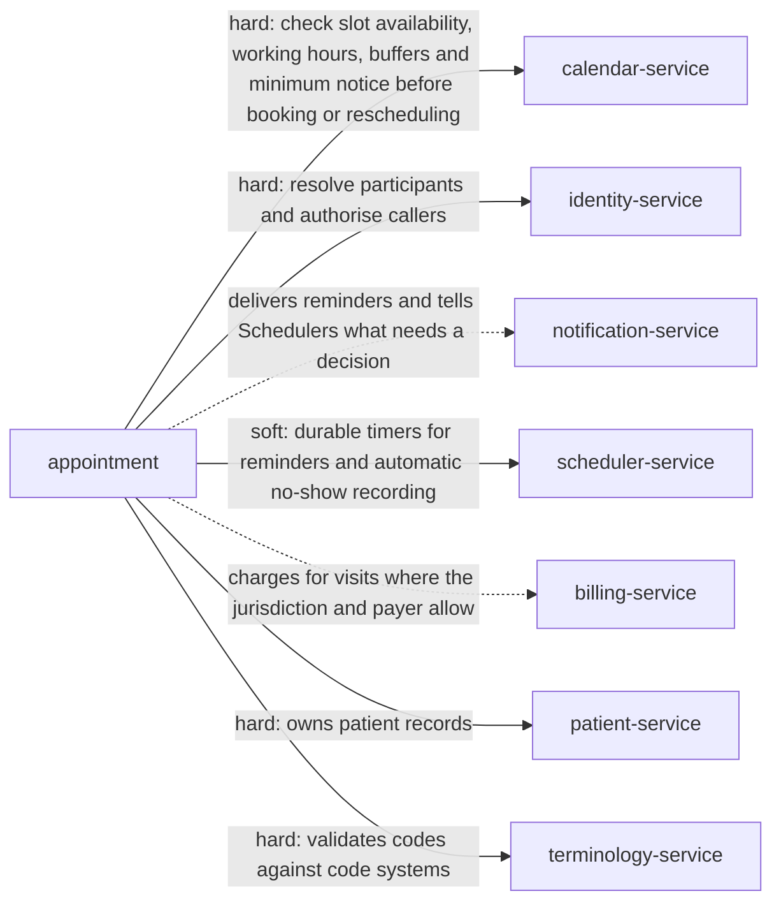

> Snapshot of healthcare/appointment version 0.6.0, saved 2026-10-07. The current version is at https://knowledge-graph-ecru.vercel.app/docs/healthcare/appointment.md.

# Clinical appointments (/docs/healthcare/appointment)

## Module identity

- module: appointment
- layer: core > healthcare
- based on: Appointment (core, /docs/core/appointment)
- extended by: Appointments (ehr, /docs/healthcare/ehr/appointment)
- version: 0.6.0
- status: draft

## How to read this spec

- This is the complete spec for this page, with every inherited item already merged in.
- If a behaviour is not listed here, it is unspecified. Do not assume or invent it. Ask, or record it as an open question.
- Ids such as BR-1, FR-2 and AC-3 are stable. Cite them in code, tests and commit messages.
- Tags such as [core] or [healthcare] show which layer an item comes from. "overrides X" means it replaces the item with the same id from layer X.

## Purpose & scope

Add what every healthcare application needs on top of the core Appointment specification: patients and practitioners, check-in with identity verification, protected health data, communication patients can rely on, and the medical record an appointment becomes part of. Works in the United States and the European Union.

**In scope**

- Patients, practitioners and personal representatives as participants
- Check-in with patient identity verification
- Reminders and messages that protect health information
- Access logging, record retention and the limits of erasure
- Language assistance and virtual appointments
- Exchange with other systems as HL7 FHIR Appointment
- Jurisdiction settings for the United States and the European Union
- Disability accommodations
- A patient's right to a copy of their appointment data
- Automated reminder texts and calls in the United States
- Where a virtual appointment may be held

**Out of scope**

- The clinical record of the visit itself. That belongs to the Encounter module.
- Insurance eligibility and billing, which differ by country and payer.
- Patient registration, identifiers, contact details and representatives. The Patients module owns them; this layer only asks for them.
- Charging fees for missed or late-cancelled appointments. Billing decides, using appointment.no_show and the late cancellation flag on appointment.cancelled.
- Detecting and reporting data breaches, which belongs to the Security module.
- Maintaining code sets. This layer only stores codes and checks them against the configured code system.

## Overview

### Product perspective

Solid arrows are services this module calls; dotted arrows are services it notifies.



### Actors

| Actor | Description | Layer |
| --- | --- | --- |
| Requester | Party who initiates a booking. May be a participant or someone acting on their behalf. | core |
| Participant | Party expected to attend. Every appointment has at least two. | core |
| Scheduler | Operator with elevated rights to book, move, cancel or close out appointments on behalf of others. | core |
| System | Automated actor that dispatches reminders and, where enabled, records no-shows after a grace period. | core |
| Patient | The person receiving care. A participant with the role patient. | healthcare |
| Practitioner | A clinician providing care. A participant with the role practitioner. | healthcare |
| Personal representative | A person allowed to act for the patient, such as the parent of a minor or a legal guardian. | healthcare |
| Front desk | Staff who check patients in. A Scheduler with the check-in permission. | healthcare |
| Privacy officer | Reviews who accessed appointment data. | healthcare |

### Assumptions and dependencies

**AS-1** Calendar is the authority on availability, including working hours, buffers, minimum notice and how far ahead bookings are allowed. _[core]_
  - Why: Appointment asks Calendar instead of computing availability (ADR-4). If Calendar answers wrongly, Appointment books what it was told is free.
**AS-2** Identity ids stay resolvable for the life of an appointment, including after a participant's account is deactivated. _[core]_
  - Why: Appointments are kept forever (BR-2) and keep referring to their participants. Identity owns what happens to the person behind the id.
**AS-3** Notification delivers reminders and formats times for each participant. Appointment only decides when a reminder is due. _[core]_
  - Why: Channels, templates and languages vary by deployment and don't belong in the booking lifecycle.
**AS-4** Server clocks are synchronised to UTC, for example with NTP. _[core]_
  - Why: Whether a start time is in the future, and when a reminder fires, are decided by server time. A drifting clock accepts bookings in the past and sends reminders late.
**AS-5** Identity can hold a person's preferred time zone and locale. _[core]_
  - Why: People move and travel. Reading the current preference keeps times and reminders right without editing every appointment (BR-9).
**AS-6** When a calendar closes, its active appointments are cancelled through Cancel in bulk, each with a reason. _[core]_
  - Why: Every appointment belongs to one calendar. How and when a calendar closes is Calendar's concern; this module only provides the way to cancel what is on it.
**AS-7** This module tells Calendar the status of every appointment through its events. How Calendar shows that time is Calendar's concern. _[core]_
  - Why: Keeps the boundary clean. For pending appointments, iCalendar's BUSY-TENTATIVE free/busy type is the natural fit.
**AS-H1** The Patients module holds each patient's identifiers, such as name and date of birth, where to contact them, and who may act for them. _[healthcare]_
  - Why: Check-in verifies against these identifiers (BR-H2), reminders follow the communication preference (BR-H4), and representatives act within what Patients allows (BR-H5).
**AS-H2** The deployment has a lawful basis to process health data for care: treatment under HIPAA in the United States, and GDPR Article 9(2)(h) in the European Union. _[healthcare]_
  - Why: Without it, no appointment data could be held at all. The legal basis is the deployment's responsibility, not this module's.
**AS-H3** The jurisdiction setting is set with legal advice before go-live. Record retention is the Patients module's setting. _[healthcare]_
  - Why: Retention and erasure rules differ by US state and EU member state. Guessing them risks both unlawful deletion and unlawful retention.

## Functions

### Business rules

**BR-1** An appointment must have at least two distinct participants. _[core]_
  - Why: A single-party slot is a calendar block, not an appointment. Keeping them distinct stops this module absorbing calendar concerns.
**BR-2** Cancelling never deletes the record. It sets status = cancelled and records who cancelled, when and why. _[core]_
  - Why: Billing, audit and analytics hold references to the appointment id and break on hard delete. Cancellation reasons are also the main input for reducing late cancellations.
**BR-3** Rescheduling keeps the appointment id and records the previous times in the appointment's history. It never creates a new appointment. _[core]_
  - Why: Attendance and no-show statistics must follow one appointment across time changes. Cancel-and-rebook would count every reschedule as a cancellation.
**BR-4** A participant cannot have two active appointments whose slots overlap. Slots are half-open, so an appointment ending at 10:00 and one starting at 10:00 do not overlap. _[core]_
  - Why: Double booking is a data-integrity failure, not a user preference, so it must hold under concurrent requests. Treating the end as inclusive would reject every back-to-back schedule.
**BR-5** Completed and cancelled are terminal: the appointment never changes again. A no-show can change only to completed, to correct a wrong record (BR-19). _[core]_
  - Why: Terminal states let consumers treat records as final. A no-show is the one exception, because a mistaken no-show can trigger fees and must be correctable.
**BR-6** Every appointment has one reference time zone. Its times are stored as wall-clock time in that zone, and absolute instants are derived from them and recomputed for future appointments when time zone rules change. _[core]_
  - Why: People agree to a time in a particular place, such as 09:00 in New York. Governments change daylight saving rules with little notice, and an instant computed before the change would move the appointment.
**BR-7** A reminder whose dispatch time has already passed when the appointment is booked or rescheduled is skipped. It never causes the booking to fail. _[core]_
  - Why: With a 24-hour default, rejecting such bookings would block every same-day appointment. The remaining reminders still fire.
**BR-8** A no-show can be recorded only after the appointment's start time. By default a Scheduler records it; automatic recording after a grace period is a per-deployment setting. _[core]_
  - Why: Leading scheduling products record no-shows manually, because only staff know whether someone is running late, attended remotely or was seen elsewhere. A wrongly recorded no-show is terminal and can trigger fees.
**BR-9** Every participant sees the appointment, and receives its reminders, in their own time zone and language: the ones set on the appointment, otherwise their preferences in Identity, otherwise the appointment's time zone and default_locale. Times shown always include the zone or offset. _[core]_
  - Why: Participants in different countries share one moment, not one clock reading. The gap between two zones also changes during the year because countries switch daylight saving time on different dates, so a fixed offset per participant would be wrong for weeks at a time.
**BR-10** A wall-clock time that doesn't exist in the reference time zone, because clocks went forward, is rejected. A wall-clock time that occurs twice, because clocks went back, must come with a UTC offset to say which one is meant; without one it's rejected. _[core]_
  - Why: Guessing silently books the wrong hour. A time sent with its UTC offset removes the doubt.
**BR-11** A request to erase a patient's appointment data is refused while the Patients module's record retention for the patient applies, because the appointment and its history are part of the medical record. When retention ends, personal fields are erased as the core Appointment specification describes. _[healthcare (overrides core)]_
  - Why: HIPAA gives no right to erasure, and US hospitals must keep records for at least 5 years (42 CFR 482.24(b)(1)), longer in many states. In the EU, GDPR Article 17(3)(c) lets health data be kept for care under Article 9(2)(h). Erasing on request would break the record.
**BR-12** A reminder is never sent after the appointment has started. _[core]_
  - Why: After an outage, a scheduler can fire a backlog of overdue reminders at once. A reminder for an appointment that has already started is noise, and for a past one it's wrong.
**BR-13** A group appointment never holds more participants than its capacity. _[core]_
  - Why: Group sessions have a physical or practical limit. Cal.com calls these seats per time slot, and Calendly allows 2 to 9,999 invitees per group event.
**BR-14** Every change to an appointment, including cancellation, must name the revision it was based on, and increases the revision by 1. A change based on an older revision is rejected. _[core]_
  - Why: Without it, someone can cancel an appointment that was just moved without ever seeing the new time.
**BR-15** Reminder offsets are exact durations before start_at. Across a clock change, a 24-hour reminder lands an hour earlier or later on the clock. _[core]_
  - Why: This matches how Google Calendar defines reminders (minutes before the start). For 09:00 on 8 March 2026 in New York, the 24-hour reminder fires at 08:00 the day before.
**BR-16** An appointment can be rescheduled, updated, given new participants or cancelled only while it is active and before its end. After the end, only close-out is allowed. _[core]_
  - Why: Once an appointment is over, what's left is to record what happened. Moving or cancelling it afterwards would rewrite history.
**BR-17** When requires_confirmation is on, a booking starts as pending and gets no reminders. While pending_holds_slot is on, it holds its slot. It becomes booked when confirmed, and is cancelled with the reason "not confirmed" if confirm_by passes first. _[core]_
  - Why: Cal.com holds bookings that need confirmation as pending, and iCalendar has a TENTATIVE status. Holding the slot means a confirmation never fails because someone else took it; turning it off keeps the slot open to others, at the cost that confirming can fail.
**BR-18** A cancellation made within late_cancellation_window before the start is marked as a late cancellation. _[core]_
  - Why: Late cancellations cost a booked slot that can rarely be refilled. Industry layers use the mark, for example to charge a fee or record a code.
**BR-19** A Scheduler can correct a no-show to completed. The correction is kept in the history. _[core]_
  - Why: Cal.com lets hosts change attendance after the fact. A wrong no-show can count against someone and trigger fees.
**BR-20** Participants who are not Schedulers cannot cancel or reschedule within self_service_cutoff before the start. _[core]_
  - Why: A business needs time to refill a slot. Acuity Scheduling lets businesses set this limit and suggests 12 hours by default.
**BR-21** Attendance is recorded per participant at close-out. Completing marks participants as attended unless stated otherwise; recording a no-show names at least one absent participant. _[core]_
  - Why: In a group, some people come and some don't. Cal.com records absence separately for the host and each attendee.
**BR-22** Each appointment in a series is independent. Rescheduling, cancelling or closing out one never changes the others. _[core]_
  - Why: Cal.com creates a separate booking for each occurrence, linked by a recurring id. Independent occurrences keep this lifecycle the same for every appointment.
**BR-23** A participant can be removed only if at least two participants remain. _[core]_
  - Why: BR-1 must keep holding after every change, not only at booking.
**BR-24** If an appointment has a participant with the role host, the last host cannot be removed. _[core]_
  - Why: A host confirms, updates and changes participants (permission matrix). Without one, a group appointment has nobody to run it.
**BR-25** Fields the service sets, such as status, start_at, end_at, history and the cancellation and completion fields, cannot be written by clients. Status changes only through its operations. _[core]_
  - Why: A client that writes status directly skips the state machine, its guards and its events. One that writes start_at bypasses the time zone rules.
**BR-H1** Every appointment has at least one participant with the role patient, and at least one with the role practitioner. _[healthcare]_
  - Why: A clinical appointment is care given to a patient by a practitioner. FHIR models both as participants of an Appointment.
**BR-H2** At check-in, the patient's identity is verified with at least two identifiers, such as name and date of birth. A room or location is never one of them. _[healthcare]_
  - Why: The Joint Commission requires at least two identifiers when providing care, treatment and services, and never the room number (NPG.01.01.01 for hospitals from 2026, NPSG.01.01.01 for its other programs). WHO Patient Safety Solution 2 recommends the same before care is given. Verifying at check-in matches the visit, and everything later recorded on it, to the right person.
**BR-H3** Reminders and other messages to patients contain only what's needed to attend: the patient's name, the date, time and place, and the provider's name and number. Never the reason, diagnosis or a service that reveals a condition. _[healthcare]_
  - Why: HHS guidance permits reminders but says providers "should take care to limit the amount of information disclosed", for example only "name and number and other information necessary to confirm an appointment" (FAQ 198). GDPR requires data to be "limited to what is necessary" (Article 5(1)(c)). Messages reach shared phones, postcards and lock screens.
**BR-H4** If a patient asked to be contacted by another means or at another address, every appointment message uses it. _[healthcare]_
  - Why: In the United States, providers must accommodate reasonable requests to communicate by alternative means or at alternative locations, without asking why (45 CFR 164.522(b)). In the EU, GDPR requires appropriate security and confidentiality of personal data (Article 5(1)(f)). For some patients an ordinary reminder could be unsafe.
**BR-H5** A personal representative can book and manage appointments for the patient they represent, when the Patients module confirms they may act for the patient for this appointment. Every action they take records them as acting_representative. _[healthcare]_
  - Why: HIPAA treats a personal representative as the patient (45 CFR 164.502(g)), but not for a minor's care the minor could consent to themselves or that a parent agreed to keep confidential (164.502(g)(3)), and state and member state law add their own rules. That is a judgment about the person, so Identity makes it and this module applies the answer.
**BR-H6** When a patient needs an interpreter, the appointment records the language so a qualified interpreter can be arranged at no cost to the patient. _[healthcare]_
  - Why: In the United States, covered entities must offer qualified interpreters free of charge (45 CFR 92.201). In the EU, language assistance depends on member state law. Recording the need at booking is what makes it possible on the day, everywhere.
**BR-H7** Every view and every change of an appointment is logged with who, when and what. _[healthcare]_
  - Why: HIPAA requires audit controls that record activity in systems holding electronic health information (45 CFR 164.312(b)), and GDPR Article 32 requires security appropriate to the risk. Core history covers changes, not views.
**BR-H8** An appointment recorded by mistake is marked entered in error. It is kept, hidden from schedules, and excluded from statistics. _[healthcare]_
  - Why: Records are never deleted in a medical record. FHIR has the same entered-in-error status.
**BR-H9** Connection details for a virtual appointment are shared only with its participants. _[healthcare]_
  - Why: The link gives access to a session where health information is discussed.
**BR-H10** Check-in is allowed from check_in_window before the start until the end. _[healthcare]_
  - Why: Checking in much earlier would mark someone as present who has not arrived for this appointment.
**BR-H11** When a patient needs a disability accommodation, such as a sign-language interpreter or an accessible room, the appointment records it so it can be arranged at no cost to the patient. _[healthcare]_
  - Why: In the United States, covered entities must provide auxiliary aids and services at no cost so communication with people with disabilities is as effective as with others (45 CFR 92.202). In the EU this depends on member state law.
**BR-H12** A patient, or their personal representative, can obtain a copy of their appointment data. The request is answered within access_request_deadline: 30 days in the United States, extendable once by 30 days with written notice; one month in the EU, extendable by two months. In the EU the first copy is free. _[healthcare]_
  - Why: HIPAA gives individuals the right to inspect and obtain a copy of their health information (45 CFR 164.524). GDPR gives a right of access and a free first copy (Article 15) within one month (Article 12(3)).
**BR-H13** In the United States, automated reminder texts and calls go only to the number the patient provided, name the provider and how to contact them, are limited to one a day and three a week per patient, keep texts to 160 characters and calls to one minute, and offer an opt-out in every message, honoured immediately. _[healthcare]_
  - Why: These are the conditions under which healthcare messages to mobile phones are exempt from prior consent (47 CFR 64.1200(a)(9)(iv)). Breaking any of them turns a reminder into an unlawful call or text.
**BR-H14** A virtual appointment records where the patient will be. In the United States, the practitioner must be licensed or legally permitted to practise in the state where the patient is located. _[healthcare]_
  - Why: HHS: providers "must ... be licensed or legally permitted to practice in the state where the patient is located". In the EU, telemedicine is considered provided in the member state where the provider is established (Directive 2011/24/EU, Article 3(d)), so the patient's location is recorded but not checked against a licence.
**BR-H15** reason and service_type are coded with the configured code systems, and a code must be valid in the release in effect on the appointment date. _[healthcare]_
  - Why: HIPAA adopts ICD-10-CM for diagnoses and HCPCS with CPT-4 for services (45 CFR 162.1002). In Europe, coding is set nationally: WHO's ICD-11 has been the global standard since 1 January 2022, but countries are still moving from ICD-10. Codes are revised over time, so a code is checked against the release in force on the day.
**BR-H16** When the Patients module merges two patient records, every appointment of the retired record is moved to the record that remains: the patient participant changes, the appointment keeps its id, and the change is recorded in its history. The overlap rule (BR-4) is not applied to the move: appointments that now overlap are kept, and appointment.patient_review_needed is emitted for each so a Scheduler decides. _[healthcare]_
  - Why: After a merge, the retired record is never used again. An appointment left on it would disappear from the patient's schedule and from check-in. Duplicate records often hold the same visit booked twice; refusing the merge would keep the duplicate, and silently cancelling one would lose a real booking.
**BR-H17** When a patient dies, their appointments that have not started are cancelled with the reason patient_deceased, and no message about them is sent to the patient. If the death is retracted, the cancelled appointments are listed for a Scheduler to rebook. _[healthcare]_
  - Why: Reminders and appointment letters to a person who has died distress their family. A death recorded in error is corrected by a person, so rebooking is a person's decision too.
**BR-H18** When a merge is undone, appointments moved by it return to the restored record. Appointments booked on the remaining record since the merge stay there, and appointment.patient_review_needed is emitted for each so a Scheduler checks whose they are. _[healthcare]_
  - Why: Only the appointments the merge moved are known to belong to the restored record. Those booked since could belong to either person, so a person checks.
**BR-H19** When the Patients module marks a patient entered in error, their appointments that have not started are cancelled with the reason patient_entered_in_error, and no message is sent. _[healthcare]_
  - Why: The record was created by mistake, so there is nobody to remind. Keeping the bookings holds slots other patients need.
**BR-H20** A checked-in appointment can return to booked, by undoing the check-in, until care has started. Undoing it emits appointment.check_in_undone. _[healthcare]_
  - Why: Checking a patient in to the wrong appointment is a common front-desk mistake. Without a way back, the right appointment can't be checked in and the wrong visit stays on record.
**BR-H21** In the United States, when an appointment is booked or rescheduled at least 3 business days ahead, Billing is told the booking time and the scheduled date, so a good faith estimate can be given to an uninsured or self-pay patient in time. _[healthcare]_
  - Why: The No Surprises Act requires a good faith estimate for uninsured or self-pay patients within 1 business day of scheduling when the service is 3 to 9 business days away, and within 3 business days when it is 10 or more (45 CFR 149.610). Scheduling starts the clock, so Billing must learn of it at once.

### State machine

Initial state: `booked`. States: `pending`, `booked`, `checked_in`, `cancelled`, `completed`, `no_show`, `entered_in_error`. _[healthcare]_
Any transition not listed below is invalid.

| From | To | Trigger | Guard |
| --- | --- | --- | --- |
| pending | booked | confirm | confirm_by has not passed, revision matches, and the slot is still free when pending_holds_slot is off |
| pending | pending | reschedule or update | before the end, revision matches |
| pending | cancelled | cancel | cancelled_reason provided, revision matches |
| pending | cancelled | expire | confirm_by has passed |
| booked | booked | reschedule or update | before the end, new slot is free and in the future, revision matches |
| booked | checked_in | check_in | within check_in_window before the start and before the end, identity verified with two identifiers |
| booked | cancelled | cancel | before the end, cancelled_reason provided, revision matches |
| booked | completed | complete | start_at has passed |
| booked | no_show | record_no_show | start_at has passed, at least one absent participant named |
| checked_in | completed | complete | the patient was seen |
| checked_in | cancelled | cancel | the patient left without being seen, with that as the reason |
| pending | entered_in_error | mark_entered_in_error | actor is a Scheduler |
| booked | entered_in_error | mark_entered_in_error | actor is a Scheduler |
| no_show | completed | correct_attendance | actor is a Scheduler |
| checked_in | booked | undo check-in | care has not started, revision matches |

### Workflows

#### Book an appointment _[core]_
Actor: Requester
Trigger: Requester submits a booking request

1. Validate the time range, duration, time zone, participants and capacity
2. Ask Calendar whether the slot is free for every participant
3. Check for overlapping active appointments and save the appointment in one step, as pending if requires_confirmation is on, otherwise as booked, at revision 0
4. If booked, schedule one reminder per offset whose dispatch time is still in the future
5. Emit appointment.booked

Outcome: The appointment holds its slot, as pending or booked.

#### Reschedule an appointment _[core]_
Actor: Scheduler
Trigger: Requester or Scheduler proposes a new time

1. Verify the appointment is active, before its end, and that the supplied revision matches
2. Validate the new slot and check availability with Calendar
3. Check for overlaps, update the times, increase revision and record the previous times in history, in one step
4. Withdraw pending reminders and schedule new ones from the new start
5. Emit appointment.rescheduled

Outcome: The same appointment id now holds the new slot, with a higher revision.

#### Cancel an appointment _[core]_
Actor: Requester
Trigger: Requester, Scheduler or an upstream policy cancels

1. Verify the appointment is booked
2. Record cancelled_reason, cancelled_by and cancelled_at, and set status = cancelled
3. Withdraw pending reminders
4. Emit appointment.cancelled

Outcome: The appointment is retained as cancelled, its slot is released and no reminders fire.

#### Close out an appointment _[core]_
Actor: Scheduler
Trigger: The start time has passed

1. If the appointment took place, complete it, record completed_at, and record attendance per participant
2. If a participant did not attend, record a no-show naming the absent participants
3. Emit appointment.completed or appointment.no_show

Outcome: The appointment reaches a terminal state that reflects what happened.

#### Dispatch a reminder _[core]_
Actor: System
Trigger: A scheduled reminder's dispatch time is reached

1. Confirm the appointment is still booked and the reminder belongs to its current revision
2. Emit appointment.reminder_due
3. Notification delivers it to the participants

Outcome: Participants are reminded ahead of the appointment, and never about a superseded time.

#### Confirm a pending appointment _[core]_
Actor: Scheduler
Trigger: A Scheduler or the host confirms

1. Verify the appointment is pending, confirm_by has not passed and the revision matches
2. Set status to booked and increase revision
3. Schedule its reminders
4. Emit appointment.confirmed

Outcome: The appointment is booked and its reminders are scheduled.

#### Expire an unconfirmed appointment _[core]_
Actor: System
Trigger: confirm_by passes while the appointment is pending

1. Cancel the appointment with the reason "not confirmed"
2. Release its slot
3. Emit appointment.cancelled

Outcome: The slot is free again.

#### Update details _[core]_
Actor: Scheduler
Trigger: A participant or Scheduler changes the location, notes, reminders or capacity

1. Verify the appointment is active, before its end, and the revision matches
2. Apply the change and increase revision
3. Re-derive pending reminders
4. Emit appointment.updated

Outcome: The appointment shows the new details at a new revision.

#### Add or remove a participant _[core]_
Actor: Scheduler
Trigger: A Scheduler or the host changes who attends

1. Verify the appointment is active, before its end, and the revision matches
2. For an addition, check capacity and that the new participant has no overlapping active appointment
3. For a removal, check that at least two participants remain
4. Apply the change and increase revision
5. Emit appointment.participant_added or appointment.participant_removed

Outcome: The participant list changes, and the overlap and capacity rules still hold.

#### Cancel in bulk _[core]_
Actor: Scheduler
Trigger: A Scheduler cancels many appointments at once: one participant in a time window (for example when a provider is ill), or the remaining appointments of a series

1. Find the active appointments that match: the participant within the window, or the series from a given time onwards
2. Cancel each one separately with the given reason, as in Cancel an appointment
3. Return the result for each appointment, including any that could not be cancelled

Outcome: Each appointment is cancelled on its own, with its own events and reminders withdrawn.

#### Correct a no-show _[core]_
Actor: Scheduler
Trigger: A Scheduler finds a no-show was recorded by mistake

1. Verify the appointment is a no-show
2. Change it to completed and record attendance
3. Keep the correction in the history
4. Emit appointment.attendance_corrected

Outcome: The appointment is completed and the mistake is traceable.

#### Signal the end _[core]_
Actor: System
Trigger: end_at passes while the appointment is still booked

1. Emit appointment.ended so a Scheduler knows it needs closing out

Outcome: Appointments are not forgotten in booked after they finish.

#### Record a no-show automatically _[core]_
Actor: System
Trigger: automatic_no_show is on and no_show_grace_period has passed after start_at with no completion

1. Record a no-show with every participant marked absent, and no_show_recorded_by = system
2. Increase revision and add the change to history
3. Emit appointment.no_show

Outcome: Forgotten appointments are closed out. A Scheduler can still correct the record (BR-19).

#### Erase personal data _[core]_
Actor: System
Trigger: A request to erase a person's data, or personal_data_retention passing after an appointment's end

1. Find the person's appointments, skipping data that must be kept for a legal obligation or claim
2. Clear notes, location and cancelled_reason, and replace the identity ids in participants and history with an anonymous placeholder
3. Set anonymised_at, increase revision and add the change to history
4. Emit appointment.anonymised for each appointment changed

Outcome: The person is no longer identifiable from their appointments, and the records still add up.

#### Reschedule in bulk _[core]_
Actor: Scheduler
Trigger: A Scheduler moves many appointments at once, for example when a provider changes the day they work

1. Find the active appointments that match the selection
2. Work out each new slot: the new time and weekday, or the shift applied to its wall-clock times
3. Reschedule each one separately, as in Reschedule an appointment, with its own checks and events
4. Return the result for each appointment, including any that could not be moved

Outcome: Each appointment keeps its id, calendar and history, and none moves into a conflict.

#### Check in _[healthcare]_
Actor: Front desk
Trigger: The patient arrives

1. Find the appointment
2. Verify the patient with two identifiers, such as name and date of birth
3. Ask the patient to confirm their details, and record it in the Patients module
4. Record checked_in_at and identity_verified_with, set status to checked_in and increase revision
5. Emit appointment.checked_in
6. Report care to the Patients module

Outcome: The patient is recorded as present and verified, ready to be seen.

#### Mark entered in error _[healthcare]_
Actor: Scheduler
Trigger: An appointment was created by mistake, for example for the wrong patient

1. Set status to entered_in_error with a reason, and increase revision
2. Withdraw pending reminders and release the slot
3. Emit appointment.entered_in_error

Outcome: The mistake is kept for the record but no longer affects schedules or statistics.

#### Follow a patient merge _[healthcare]_
Actor: System
Trigger: Patients emits patient.merged

1. Find the appointments whose patient participant is the retired record
2. Change the participant to the remaining record, record it in history, and increase revision
3. Emit appointment.updated for each

Outcome: Every appointment shows on the one record in use.

#### Follow a death _[healthcare]_
Actor: System
Trigger: Patients emits patient.deceased

1. Find the patient's appointments that have not started
2. Cancel each with the reason patient_deceased, without messaging the patient
3. Emit appointment.cancelled for each

Outcome: No one is booked or reminded after their death.

#### Follow a patient entered in error _[healthcare]_
Actor: System
Trigger: Patients emits patient.entered_in_error

1. Find the patient's appointments that have not started
2. Cancel each with the reason patient_entered_in_error, without messaging anyone
3. Emit appointment.cancelled for each

Outcome: No slot is held for a record that never existed.

### Validations

| Field | Rule | Error | Layer |
| --- | --- | --- | --- |
| start_time | must be strictly before end_time | APPOINTMENT_INVALID_TIME_RANGE | core |
| start_time | start_at must be in the future when booking or rescheduling | APPOINTMENT_START_IN_PAST | core |
| start_time | must exist in time_zone; a wall-clock time skipped by a daylight saving change is rejected | APPOINTMENT_INVALID_LOCAL_TIME | core |
| start_time | a wall-clock time that occurs twice in time_zone must come with a UTC offset | APPOINTMENT_AMBIGUOUS_LOCAL_TIME | core |
| time_zone | must be a valid IANA time zone name | APPOINTMENT_INVALID_TIME_ZONE | core |
| participants | each participant time_zone, when given, must be a valid IANA time zone name | APPOINTMENT_INVALID_TIME_ZONE | core |
| participants | each participant locale, when given, must be a valid BCP 47 language tag | APPOINTMENT_INVALID_LOCALE | core |
| participants | at least 2 entries, all resolvable identity ids, no duplicates | APPOINTMENT_INVALID_PARTICIPANTS | core |
| reminder_offsets | every offset must be positive | APPOINTMENT_INVALID_REMINDER_OFFSET | core |
| cancelled_reason | required when cancelling | APPOINTMENT_CANCEL_REASON_REQUIRED | core |
| revision | every change must supply the current revision | APPOINTMENT_REVISION_CONFLICT | core |
| end_time | end_at minus start_at must be within min_duration and max_duration when those are set | APPOINTMENT_INVALID_DURATION | core |
| capacity | must be at least 2, and at least the current number of participants | APPOINTMENT_INVALID_CAPACITY | core |
| page_size | must be between 1 and max_page_size | APPOINTMENT_INVALID_PAGE_SIZE | core |
| bulk filter | exactly one of: a participant with a time window, or a series | APPOINTMENT_INVALID_BULK_FILTER | core |
| bulk change | exactly one of: a new time and weekday, or a shift | APPOINTMENT_INVALID_BULK_CHANGE | core |
| id, start_at, end_at, tz_version, status, confirm_by, late_cancellation, history, created_at, updated_at, cancelled_by, cancelled_at, completed_at, no_show_recorded_by, anonymised_at | never sent by clients (BR-25) | APPOINTMENT_READ_ONLY_FIELD | core |
| location | plain text or an https URL, at most max_text_length characters | APPOINTMENT_INVALID_TEXT | core |
| notes | plain text, at most max_text_length characters | APPOINTMENT_INVALID_TEXT | core |
| series_id, appointment_type_id | refer to an existing series or appointment type | APPOINTMENT_INVALID_REFERENCE | core |
| participants | at least one participant with the role patient and one with the role practitioner | APPOINTMENT_PATIENT_AND_PRACTITIONER_REQUIRED | healthcare |
| identity_verified_with | at least two identifier types at check-in, none of them a room or location | APPOINTMENT_IDENTITY_NOT_VERIFIED | healthcare |
| priority | an integer from 1 to 9 | APPOINTMENT_INVALID_PRIORITY | healthcare |
| reason | a code valid in diagnosis_code_system on the appointment date | APPOINTMENT_INVALID_CODE | healthcare |
| service_type | a code valid in service_code_system on the appointment date | APPOINTMENT_INVALID_CODE | healthcare |
| patient_location | in the United States, the practitioner is licensed or permitted to practise there | APPOINTMENT_PRACTITIONER_NOT_LICENSED | healthcare |
| patient_instruction | plain text, at most max_text_length characters | APPOINTMENT_INVALID_TEXT | healthcare |
| virtual_service | an https URL, with optional dial-in details | APPOINTMENT_INVALID_VIRTUAL_SERVICE | healthcare |
| interpreter_language | a well-formed BCP 47 tag | APPOINTMENT_INVALID_LOCALE | healthcare |
| accommodation_needs | each a non-empty text item, at most max_text_length characters | APPOINTMENT_INVALID_TEXT | healthcare |
| acting_representative, checked_in_at | set by the service from the caller and the check-in, never sent by clients | APPOINTMENT_READ_ONLY_FIELD | healthcare |

### Edge cases

**EC-1** Two requests book overlapping slots for the same participant at the same moment. _[core]_
  - Required behaviour: Exactly one succeeds. The other fails with APPOINTMENT_SLOT_TAKEN.
  - Covered by: BR-4, FR-2, CON-2, AC-4
**EC-2** A client times out and retries a booking that actually succeeded. _[core]_
  - Required behaviour: With the same Idempotency-Key, the retry returns the original appointment and nothing new is booked.
  - Covered by: FR-8, AC-9
**EC-3** One appointment ends at 10:00 and another for the same participant starts at 10:00. _[core]_
  - Required behaviour: Both are allowed. Slots exclude their end, so back-to-back isn't an overlap.
  - Covered by: BR-4, AC-3
**EC-4** An appointment is booked 3 hours ahead, with a 24-hour reminder. _[core]_
  - Required behaviour: The booking succeeds and the 24-hour reminder is skipped. Later reminders still fire.
  - Covered by: BR-7, AC-6
**EC-5** A booking asks for 02:30 in New York on 8 March 2026, a time skipped when clocks go forward. _[core]_
  - Required behaviour: Rejected with APPOINTMENT_INVALID_LOCAL_TIME.
  - Covered by: BR-10, AC-17
**EC-6** A booking asks for 01:30 in New York on 1 November 2026, which happens twice when clocks go back. _[core]_
  - Required behaviour: Rejected with APPOINTMENT_AMBIGUOUS_LOCAL_TIME unless it carries a UTC offset that picks one.
  - Covered by: BR-10, AC-15, AC-16
**EC-7** An appointment from 00:30 to 02:30 in New York on 1 November 2026 spans the clock change. _[core]_
  - Required behaviour: It lasts 3 hours, not 2. Overlap checks, reminders and length are all computed from start_at and end_at.
  - Covered by: BR-6
**EC-8** Participants are in New York and Zurich in the weeks when only the United States has switched to daylight saving time. _[core]_
  - Required behaviour: A 09:00 New York appointment on 10 March 2026 shows as 14:00 in Zurich, not 15:00.
  - Covered by: BR-9, AC-14
**EC-9** A government changes its time zone rules after appointments have been booked. _[core]_
  - Required behaviour: start_time stays as agreed. start_at, end_at and pending reminders are recomputed with the new time zone database release.
  - Covered by: BR-6, FR-7, CON-4, AC-11
**EC-10** Two people reschedule the same appointment at the same time. _[core]_
  - Required behaviour: The first succeeds. The second sends a revision that is now out of date and fails with APPOINTMENT_REVISION_CONFLICT.
  - Covered by: FR-9, AC-8
**EC-11** A reminder fires for a time the appointment was moved away from. _[core]_
  - Required behaviour: The reminder belongs to an older revision, so it's dropped and the reminder for the current time is sent instead.
  - Covered by: FR-4
**EC-12** An appointment is cancelled while one of its reminders is being dispatched. _[core]_
  - Required behaviour: Dispatch checks the status first, so no reminder is sent for a cancelled appointment.
  - Covered by: FR-4, AC-12
**EC-13** Calendar is down when someone books. _[core]_
  - Required behaviour: The booking fails with APPOINTMENT_AVAILABILITY_UNAVAILABLE and nothing is saved.
  - Covered by: FR-13, AC-18
**EC-14** Notification is down when a reminder is due. _[core]_
  - Required behaviour: appointment.reminder_due is still emitted. Bookings and other changes carry on unaffected.
  - Covered by: AS-3
**EC-15** Someone tries to change a completed, cancelled or no-show appointment. _[core]_
  - Required behaviour: Rejected with APPOINTMENT_TERMINAL_STATE, and the record is unchanged.
  - Covered by: BR-5, AC-5
**EC-16** A Scheduler records a no-show before the appointment has started. _[core]_
  - Required behaviour: Rejected with APPOINTMENT_NOT_YET_STARTED.
  - Covered by: BR-8, AC-10
**EC-17** A participant's account is deactivated after the appointment was booked. _[core]_
  - Required behaviour: The appointment keeps the participant's id, which Identity keeps resolvable.
  - Covered by: AS-2
**EC-18** The same identity is listed twice as a participant. _[core]_
  - Required behaviour: Rejected with APPOINTMENT_INVALID_PARTICIPANTS.
  - Covered by: BR-1
**EC-19** The scheduler is down for hours and recovers with a backlog of overdue reminders. _[core]_
  - Required behaviour: Reminders for appointments that haven't started are sent. Reminders for appointments that have already started are dropped.
  - Covered by: BR-12, AC-26
**EC-20** A participant asks for their data to be erased while a legal claim about the appointment is open. _[core]_
  - Required behaviour: Fields needed for the claim are kept until it's resolved, then erased under BR-11.
  - Covered by: BR-11
**EC-21** The service publishes an event and then fails before recording that it did. _[core]_
  - Required behaviour: The event is published again with the same id, and consumers discard the duplicate.
  - Covered by: DG-1, FR-15
**EC-22** A consumer receives appointment.rescheduled at revision 3 after it already applied revision 4. _[core]_
  - Required behaviour: The consumer ignores the older event.
  - Covered by: DG-2
**EC-23** An appointment at 09:00 on 8 March 2026 in New York has a 24-hour reminder. _[core]_
  - Required behaviour: The reminder fires at 08:00 on 7 March, exactly 24 hours before, because clocks go forward in between.
  - Covered by: BR-15, AC-29
**EC-24** Someone cancels an appointment that was rescheduled after they last looked at it. _[core]_
  - Required behaviour: The cancellation names the old revision and is rejected with APPOINTMENT_REVISION_CONFLICT.
  - Covered by: BR-14, AC-30
**EC-25** A participant moves to another country after booking. _[core]_
  - Required behaviour: Their times and reminders follow their new time zone in Identity, unless the appointment sets one for them.
  - Covered by: BR-9, AS-5
**EC-26** A calendar is closed while it still has active appointments. _[core]_
  - Required behaviour: They are cancelled through Cancel in bulk, each with a reason and its own events. How the calendar closes is Calendar's concern.
  - Covered by: AS-6, FR-19
**EC-27** A guest tries to join a group appointment that is full. _[core]_
  - Required behaviour: Rejected with APPOINTMENT_FULL.
  - Covered by: BR-13, AC-31
**EC-28** Nobody confirms a pending appointment before confirm_by. _[core]_
  - Required behaviour: It is cancelled with the reason "not confirmed" and its slot is released.
  - Covered by: BR-17, AC-32
**EC-29** Someone tries to cancel or reschedule an appointment after its end. _[core]_
  - Required behaviour: Rejected with APPOINTMENT_ENDED. It can only be completed or recorded as a no-show.
  - Covered by: BR-16, AC-33
**EC-30** A participant tries to cancel 2 hours before the start with a 12-hour self_service_cutoff. _[core]_
  - Required behaviour: Rejected with APPOINTMENT_CUTOFF_PASSED. A Scheduler can still cancel.
  - Covered by: BR-20, AC-34
**EC-31** One appointment in a weekly series is moved to another day. _[core]_
  - Required behaviour: Only that appointment moves. The rest of the series is unchanged.
  - Covered by: BR-22, AC-35
**EC-32** A bulk cancellation hits an appointment that already ended. _[core]_
  - Required behaviour: That appointment is reported as not cancelled with APPOINTMENT_ENDED; the others are cancelled.
  - Covered by: FR-19, AC-36
**EC-33** Removing a participant would leave only one. _[core]_
  - Required behaviour: Rejected with APPOINTMENT_INVALID_PARTICIPANTS.
  - Covered by: BR-23
**EC-34** A booking is longer than max_duration. _[core]_
  - Required behaviour: Rejected with APPOINTMENT_INVALID_DURATION.
  - Covered by: AC-37
**EC-35** A weekly class is discontinued after its fourth session. _[core]_
  - Required behaviour: A Scheduler cancels the series from the fifth session onwards in one request. Earlier sessions are untouched.
  - Covered by: FR-19, AC-46
**EC-36** The host tries to leave their own group appointment while guests remain. _[core]_
  - Required behaviour: Rejected with APPOINTMENT_HOST_REQUIRED until another host is added.
  - Covered by: BR-24, AC-47
**EC-37** A person asks for their data to be erased, but they have no appointments. _[core]_
  - Required behaviour: The request succeeds and changes nothing.
  - Covered by: FR-14
**EC-38** A provider's Tuesday clinic moves to Thursday, and one of the moved appointments would clash with the patient's other appointment. _[core]_
  - Required behaviour: All the others move. The clashing one stays where it is and is reported with APPOINTMENT_SLOT_TAKEN.
  - Covered by: FR-24, AC-49
**EC-39** pending_holds_slot is off, and someone books the slot of a pending appointment before it is confirmed. _[core]_
  - Required behaviour: The new booking succeeds. Confirming the pending one then fails with APPOINTMENT_SLOT_TAKEN.
  - Covered by: BR-17, AC-50
**EC-H1** Two patients with the same name arrive for appointments at the same time. _[healthcare]_
  - Required behaviour: Check-in needs a second identifier, such as date of birth, so the wrong appointment is not checked in.
  - Covered by: BR-H2, AC-H2
**EC-H2** A reminder is sent to a phone shared by the patient's family. _[healthcare]_
  - Required behaviour: It says only the name, date, time, place and provider number, never the reason or service.
  - Covered by: BR-H3, AC-H3
**EC-H3** A patient asked to be contacted only at a work address. _[healthcare]_
  - Required behaviour: All appointment messages go to the work address.
  - Covered by: BR-H4, AC-H4
**EC-H4** A patient asks for their appointment history to be erased two years after a visit to a US hospital. _[healthcare]_
  - Required behaviour: Refused with APPOINTMENT_RETENTION_REQUIRED, because the Patients module's record retention has not ended.
  - Covered by: BR-11, AC-H5
**EC-H5** An appointment was booked for the wrong patient. _[healthcare]_
  - Required behaviour: It is marked entered in error, not deleted, and disappears from schedules and statistics.
  - Covered by: BR-H8, AC-H6
**EC-H6** A checked-in patient leaves before being seen. _[healthcare]_
  - Required behaviour: The appointment is cancelled with the reason "left without being seen".
  - Covered by: FR-H1
**EC-H7** A parent books an appointment for their child. _[healthcare]_
  - Required behaviour: The appointment records the parent as acting_representative.
  - Covered by: BR-H5, AC-H7
**EC-H8** A patient tries to check in two hours early with a 30-minute check_in_window. _[healthcare]_
  - Required behaviour: Rejected with APPOINTMENT_CHECK_IN_TOO_EARLY.
  - Covered by: BR-H10, AC-H8
**EC-H9** A deaf patient books an appointment. _[healthcare]_
  - Required behaviour: The appointment records a sign-language interpreter in accommodation_needs, and appointment.booked carries it.
  - Covered by: BR-H11, AC-H14
**EC-H10** In the United States, a patient has three appointments this week, each with reminders. _[healthcare]_
  - Required behaviour: At most one reminder text or call is sent a day and three a week; the rest are skipped.
  - Covered by: BR-H13, AC-H16
**EC-H11** A patient replies STOP to a reminder text. _[healthcare]_
  - Required behaviour: No further automated texts are sent to that number.
  - Covered by: BR-H13, AC-H17
**EC-H12** A practitioner licensed only in New York is booked for a video visit with a patient in New Jersey. _[healthcare]_
  - Required behaviour: Rejected with APPOINTMENT_PRACTITIONER_NOT_LICENSED, unless the practitioner is permitted there.
  - Covered by: BR-H14, AC-H18
**EC-H13** A booking uses a diagnosis code that was retired before the appointment date. _[healthcare]_
  - Required behaviour: Rejected with APPOINTMENT_INVALID_CODE.
  - Covered by: BR-H15, AC-H19
**EC-H14** A parent tries to view a teenager's appointment for care the teenager consented to on their own. _[healthcare]_
  - Required behaviour: Patients answers that the parent may not act for this appointment, so the parent cannot see or change it.
  - Covered by: BR-H5, AC-H20
**EC-H15** A patient with an appointment next week is found to be a duplicate and merged. _[healthcare]_
  - Required behaviour: The appointment moves to the remaining record, keeps its id, and still checks in.
  - Covered by: BR-H16, AC-H21
**EC-H16** A patient dies with a follow-up booked for tomorrow and a reminder due tonight. _[healthcare]_
  - Required behaviour: The follow-up is cancelled with reason patient_deceased and no reminder or cancellation message is sent.
  - Covered by: BR-H17, AC-H22
**EC-H17** A merge is undone after a new appointment was booked on the remaining record. _[healthcare]_
  - Required behaviour: Appointments the merge moved return; the new one stays, with appointment.patient_review_needed for a Scheduler.
  - Covered by: BR-H18, AC-H23
**EC-H18** The front desk checks Ana into her 10:00 appointment, then sees it was Ana Lopes, not Ana Lopez. _[healthcare]_
  - Required behaviour: The check-in is undone before care starts; the appointment is booked again and appointment.check_in_undone is emitted.
  - Covered by: BR-H20, AC-H27
**EC-H19** Two duplicate records each hold a 10:00 cardiology appointment, and they are merged. _[healthcare]_
  - Required behaviour: Both appointments move to the remaining record and appointment.patient_review_needed is emitted for each.
  - Covered by: BR-H16, AC-H28
**EC-H20** A patient record created by mistake has an appointment next week. _[healthcare]_
  - Required behaviour: When Patients marks it entered in error, the appointment is cancelled with reason patient_entered_in_error and no message is sent.
  - Covered by: BR-H19, AC-H29
**EC-H21** A self-pay patient books an MRI 12 business days ahead. _[healthcare]_
  - Required behaviour: Billing receives the booking at once and has 3 business days to give the estimate.
  - Covered by: BR-H21, AC-H31

## Data

### Data model

| Field | Type | Required | Description | Constraints | Layer |
| --- | --- | --- | --- | --- | --- |
| id | string | yes | Stable identifier, immutable for the life of the appointment. | - | core |
| participants | array<{ identity_id, role, time_zone?, locale?, attendance? }> | yes | The parties involved. role is a label such as host or guest; industry layers define their own roles. time_zone and locale override the person's preferences in Identity for this appointment. attendance is attended or absent, recorded at close-out. | at least 2 entries and no more than capacity; identity_id values are distinct and resolvable; each time_zone is a valid IANA name; each locale is a valid BCP 47 tag | core |
| start_time | local datetime | yes | Wall-clock start in time_zone. | before end_time | core |
| end_time | local datetime | yes | Wall-clock end in time_zone. It is exclusive, so the slot ends immediately before this time. | after start_time | core |
| time_zone | string | yes | The reference time zone. start_time and end_time are read in this IANA zone, for example America/New_York. | a valid IANA tz database name, not a UTC offset | core |
| start_at | instant | yes | Absolute start, derived from start_time and time_zone. Used for overlap checks, reminders and ordering. | derived, never written by clients; recomputed when tz database rules change | core |
| end_at | instant | yes | Absolute end, derived from end_time and time_zone. | derived, never written by clients | core |
| tz_version | string | yes | The time zone rules release used to derive start_at and end_at, so the instants can be recomputed after a rules change. | derived, never written by clients | core |
| status | enum | yes | Current lifecycle state, with the healthcare states. | pending \| booked \| checked_in \| completed \| no_show \| cancelled \| entered_in_error; changed only through operations; codes: FHIR R5 AppointmentStatus: pending, booked, checked-in, fulfilled, noshow, cancelled, entered-in-error | healthcare (overrides core) |
| revision | integer | yes | Starts at 0 and increases by 1 on every change. Every change must name the revision it was based on. | - | core |
| capacity | integer | no | Most participants allowed, for a group appointment. Unset means no limit beyond BR-1. | at least 2 | core |
| series_id | string | no | Shared by the appointments of one series. | - | core |
| appointment_type_id | string | no | The appointment type this booking was made from, owned by the Appointment type module. | - | core |
| confirm_by | instant | no | When a pending appointment expires if nobody confirms it: the booking time plus confirmation_timeout. | derived, never written by clients; set when status = pending | core |
| late_cancellation | boolean | no | Whether the appointment was cancelled within late_cancellation_window before the start. | set when status = cancelled | core |
| location | string | no | Physical address or virtual meeting reference. | - | core |
| reminder_offsets | duration[] | no | When reminders fire, each measured back from start_at. | each offset positive; when unset, default_reminder_offsets applies | core |
| notes | string | no | - | - | core |
| history | array<{ revision, change, actor, at, previous_start_at?, previous_end_at? }> | yes | Every change to the appointment, oldest first: booked, confirmed, rescheduled, updated, participant_added, participant_removed, cancelled, completed, no_show, attendance_corrected or anonymised. | append-only; entries are never changed or removed, except that erasure replaces actor identity ids (BR-11) | core |
| created_at | instant | yes | - | - | core |
| updated_at | instant | yes | - | - | core |
| cancelled_reason | string | no | - | required when status = cancelled | core |
| cancelled_by | string | no | Identity id of the actor who cancelled. | set when status = cancelled | core |
| cancelled_at | instant | no | - | set when status = cancelled | core |
| completed_at | instant | no | - | set when status = completed | core |
| no_show_recorded_by | string | no | Identity id of the Scheduler who recorded the no-show, or system. | set when status = no_show | core |
| anonymised_at | instant | no | When personal fields were erased (BR-11). The appointment, its status and its times remain. | - | core |
| service_type | code | no | The service to be performed, coded with service_code_system, such as a cardiology consultation (FHIR Appointment.serviceType). | codes: service_code_system, such as HCPCS with CPT-4 in the United States | healthcare |
| reason | code or text | no | Why the appointment was booked, coded with diagnosis_code_system. Clinical, so it is health information (FHIR Appointment.reason). | - | healthcare |
| priority | integer | no | From 1 (highest) to 9 (lowest), as in FHIR and iCalendar. | 1 to 9 | healthcare |
| patient_instruction | text | no | What the patient needs to know or do, such as fasting from 8 pm the night before. | - | healthcare |
| virtual_service | connection details | no | How to join a virtual appointment (FHIR Appointment.virtualService). | - | healthcare |
| interpreter_language | BCP 47 tag | no | The language the patient needs an interpreter for at this appointment. Defaults to the language and interpreter need the Patients module holds; set here only when this visit differs. | - | healthcare |
| acting_representative | string | no | The personal representative who booked or changed the appointment, if one did, as the Patients module records them. | - | healthcare |
| checked_in_at | instant | no | - | set when status = checked_in | healthcare |
| identity_verified_with | string[] | no | The identifier types used at check-in, such as name and date_of_birth. | at least 2 when checked in | healthcare |
| accommodation_needs | string[] | no | Disability accommodations the patient needs, such as a sign-language interpreter or an accessible room. Recorded per appointment, because needs differ by visit and place. | - | healthcare |
| patient_location | string | no | Where the patient will be during a virtual appointment: a US state or an EU member state. | required for virtual appointments | healthcare |

### Relationships

| Edge | Target | Note | Layer |
| --- | --- | --- | --- |
| belongs_to | calendar | every appointment sits on exactly one calendar | core |
| has_many | reminder | one per entry in reminder_offsets | core |
| requires | identity | every participant identity_id must resolve to an identity | core |
| can_trigger | event:appointment.reminder_due | - | core |
| requires_permission | appointment.write | - | core |
| belongs_to | appointment-type | optional; the type a booking was made from | core |
| belongs_to | series | optional; set by the Recurrence module | core |

## External interfaces

### API

#### Book an appointment: `POST /appointments` _[healthcare (overrides core)]_
Book a slot for two or more participants. Accepts a retry key.
- Success: 201
- Actor: Requester
- Input: participants (identity, role, optional time zone and locale), start and end time, time zone, and optional location, notes, reminder offsets, capacity, series and appointment type, and optional service type, reason, priority, patient instruction, virtual service, interpreter language, accommodation needs, patient location and acting representative
- Result: the appointment, pending or booked
- Errors: APPOINTMENT_INVALID_TIME_RANGE, APPOINTMENT_START_IN_PAST, APPOINTMENT_INVALID_LOCAL_TIME, APPOINTMENT_AMBIGUOUS_LOCAL_TIME, APPOINTMENT_INVALID_TIME_ZONE, APPOINTMENT_INVALID_DURATION, APPOINTMENT_INVALID_PARTICIPANTS, APPOINTMENT_INVALID_LOCALE, APPOINTMENT_INVALID_CAPACITY, APPOINTMENT_INVALID_REMINDER_OFFSET, APPOINTMENT_SLOT_TAKEN, APPOINTMENT_AVAILABILITY_UNAVAILABLE, APPOINTMENT_IDEMPOTENCY_KEY_REUSED, APPOINTMENT_PATIENT_AND_PRACTITIONER_REQUIRED, APPOINTMENT_INVALID_PRIORITY, APPOINTMENT_INVALID_CODE, APPOINTMENT_PRACTITIONER_NOT_LICENSED, APPOINTMENT_INVALID_VIRTUAL_SERVICE, APPOINTMENT_READ_ONLY_FIELD, APPOINTMENT_INVALID_TEXT, APPOINTMENT_INVALID_REFERENCE

#### Get an appointment: `GET /appointments/{id}` _[core]_
Read one appointment, including its status, attendance and revision.
- Success: 200
- Input: appointment id
- Result: the appointment
- Errors: APPOINTMENT_NOT_FOUND

#### List appointments: `GET /appointments` _[core]_
List appointments by participant, status and time window, in pages (FR-20).
- Success: 200
- Input: optional participant, status, window start and end, page size and page cursor
- Result: a page of appointments and a cursor for the next page
- Errors: APPOINTMENT_INVALID_TIME_RANGE, APPOINTMENT_INVALID_PAGE_SIZE

#### Confirm an appointment: `POST /appointments/{id}/confirm` _[core]_
Confirm a pending appointment.
- Success: 200
- Actor: Scheduler
- Input: appointment id, revision
- Result: the booked appointment
- Errors: APPOINTMENT_NOT_FOUND, APPOINTMENT_NOT_PENDING, APPOINTMENT_REVISION_CONFLICT, APPOINTMENT_SLOT_TAKEN

#### Reschedule an appointment: `POST /appointments/{id}/reschedule` _[core]_
Move the appointment to a new slot, keeping its id. Accepts a retry key.
- Success: 200
- Actor: Requester
- Input: appointment id, revision, new start and end time, optional time zone
- Result: the updated appointment
- Errors: APPOINTMENT_NOT_FOUND, APPOINTMENT_TERMINAL_STATE, APPOINTMENT_ENDED, APPOINTMENT_CUTOFF_PASSED, APPOINTMENT_REVISION_CONFLICT, APPOINTMENT_SLOT_TAKEN, APPOINTMENT_INVALID_TIME_RANGE, APPOINTMENT_START_IN_PAST, APPOINTMENT_INVALID_LOCAL_TIME, APPOINTMENT_AMBIGUOUS_LOCAL_TIME, APPOINTMENT_INVALID_DURATION, APPOINTMENT_AVAILABILITY_UNAVAILABLE, APPOINTMENT_READ_ONLY_FIELD

#### Update details: `PATCH /appointments/{id}` _[core]_
Change the location, notes, reminder offsets or capacity.
- Success: 200
- Actor: Requester
- Input: appointment id, revision, the fields to change
- Result: the updated appointment
- Errors: APPOINTMENT_NOT_FOUND, APPOINTMENT_TERMINAL_STATE, APPOINTMENT_ENDED, APPOINTMENT_REVISION_CONFLICT, APPOINTMENT_INVALID_REMINDER_OFFSET, APPOINTMENT_INVALID_CAPACITY, APPOINTMENT_READ_ONLY_FIELD, APPOINTMENT_INVALID_TEXT

#### Add a participant: `POST /appointments/{id}/participants` _[core]_
Add a participant, for example a guest joining a group appointment.
- Success: 200
- Actor: Scheduler
- Input: appointment id, revision, identity, role, optional time zone and locale
- Result: the updated appointment
- Errors: APPOINTMENT_NOT_FOUND, APPOINTMENT_TERMINAL_STATE, APPOINTMENT_ENDED, APPOINTMENT_REVISION_CONFLICT, APPOINTMENT_FULL, APPOINTMENT_SLOT_TAKEN, APPOINTMENT_INVALID_PARTICIPANTS

#### Remove a participant: `DELETE /appointments/{id}/participants/{identity_id}` _[core]_
Remove a participant, keeping at least two.
- Success: 200
- Actor: Scheduler
- Input: appointment id, revision, identity
- Result: the updated appointment
- Errors: APPOINTMENT_NOT_FOUND, APPOINTMENT_TERMINAL_STATE, APPOINTMENT_ENDED, APPOINTMENT_REVISION_CONFLICT, APPOINTMENT_PARTICIPANT_NOT_FOUND, APPOINTMENT_INVALID_PARTICIPANTS, APPOINTMENT_HOST_REQUIRED

#### Cancel an appointment: `POST /appointments/{id}/cancel` _[core]_
Cancel the appointment without deleting it. Accepts a retry key.
- Success: 200
- Actor: Requester
- Input: appointment id, revision, reason
- Result: the cancelled appointment, marked late if within late_cancellation_window
- Errors: APPOINTMENT_NOT_FOUND, APPOINTMENT_TERMINAL_STATE, APPOINTMENT_ENDED, APPOINTMENT_CUTOFF_PASSED, APPOINTMENT_REVISION_CONFLICT, APPOINTMENT_CANCEL_REASON_REQUIRED

#### Cancel in bulk: `POST /appointments/bulk-cancel` _[core]_
Cancel every active appointment of one participant that overlaps a time window.
- Success: 200
- Actor: Scheduler
- Input: a reason, and either a participant with a window start and end, or a series with a start time
- Result: for each appointment: cancelled, or the error that stopped it
- Errors: APPOINTMENT_CANCEL_REASON_REQUIRED, APPOINTMENT_INVALID_TIME_RANGE, APPOINTMENT_INVALID_BULK_FILTER

#### Reschedule in bulk: `POST /appointments/bulk-reschedule` _[core]_
Move many appointments at once. Each one is checked and moved separately, keeping its id and calendar.
- Success: 200
- Actor: Scheduler
- Input: the selection (a participant with a time window, or a series from a given time), and either a new time and weekday or a shift such as +2 days or -30 minutes
- Result: for each appointment: its new revision, or the error that stopped it
- Errors: APPOINTMENT_INVALID_BULK_FILTER, APPOINTMENT_INVALID_TIME_RANGE, APPOINTMENT_INVALID_BULK_CHANGE

#### Complete an appointment: `POST /appointments/{id}/complete` _[core]_
Mark the appointment completed after it started, with attendance per participant.
- Success: 200
- Actor: Scheduler
- Input: appointment id, revision, optional attendance per participant
- Result: the completed appointment
- Errors: APPOINTMENT_NOT_FOUND, APPOINTMENT_TERMINAL_STATE, APPOINTMENT_NOT_YET_STARTED, APPOINTMENT_REVISION_CONFLICT

#### Record a no-show: `POST /appointments/{id}/no-show` _[core]_
Record that one or more participants did not attend.
- Success: 200
- Actor: Scheduler
- Input: appointment id, revision, absent participants
- Result: the appointment, now a no-show
- Errors: APPOINTMENT_NOT_FOUND, APPOINTMENT_TERMINAL_STATE, APPOINTMENT_NOT_YET_STARTED, APPOINTMENT_REVISION_CONFLICT, APPOINTMENT_PARTICIPANT_NOT_FOUND

#### Correct a no-show: `POST /appointments/{id}/correct-attendance` _[core]_
Change a wrongly recorded no-show to completed.
- Success: 200
- Actor: Scheduler
- Input: appointment id, revision, attendance per participant
- Result: the completed appointment
- Errors: APPOINTMENT_NOT_FOUND, APPOINTMENT_NOT_A_NO_SHOW, APPOINTMENT_REVISION_CONFLICT

#### Erase a participant's personal data: `POST /appointment-erasures` _[healthcare (overrides core)]_
Erase personal fields as BR-11 describes. Refused while the Patients module's record retention for the patient applies.
- Success: 202
- Actor: Scheduler
- Input: identity
- Result: accepted; the appointments changed are reported when the erasure finishes. An identity with no appointments, or already erased, changes nothing.
- Errors: APPOINTMENT_RETENTION_REQUIRED

#### Check in: `POST /appointments/{id}/check-in` _[healthcare]_
Record that the patient arrived, verifying their identity.
- Success: 200
- Actor: Front desk
- Input: appointment id, revision, the identifiers verified
- Result: the checked-in appointment
- Errors: APPOINTMENT_NOT_FOUND, APPOINTMENT_TERMINAL_STATE, APPOINTMENT_ENDED, APPOINTMENT_REVISION_CONFLICT, APPOINTMENT_IDENTITY_NOT_VERIFIED, APPOINTMENT_CHECK_IN_TOO_EARLY

#### Mark entered in error: `POST /appointments/{id}/entered-in-error` _[healthcare]_
Mark an appointment that was recorded by mistake.
- Success: 200
- Actor: Scheduler
- Input: appointment id, revision, reason
- Result: the appointment, marked entered in error
- Errors: APPOINTMENT_NOT_FOUND, APPOINTMENT_TERMINAL_STATE, APPOINTMENT_REVISION_CONFLICT

#### Export as FHIR: `GET /appointments/{id}/fhir` _[healthcare]_
Return the appointment as an HL7 FHIR R5 Appointment resource.
- Success: 200
- Input: appointment id
- Result: a FHIR Appointment
- Errors: APPOINTMENT_NOT_FOUND

#### Read the access log: `GET /appointments/{id}/access-log` _[healthcare]_
List who viewed or changed an appointment, and when.
- Success: 200
- Actor: Privacy officer
- Input: appointment id, page
- Result: access log entries
- Errors: APPOINTMENT_NOT_FOUND

#### Request a copy of appointment data: `POST /appointment-access-requests` _[healthcare]_
A patient or their representative asks for a copy of their appointment data. Answered within access_request_deadline.
- Success: 202
- Actor: Patient
- Input: the patient, and who is asking
- Result: accepted; the copy is delivered when ready
- Errors: APPOINTMENT_NOT_AUTHORISED_FOR_PATIENT

#### Undo check-in: `POST /appointments/{id}/undo-check-in` _[healthcare]_
Return a checked-in appointment to booked, before care starts.
- Success: 200
- Actor: Front desk
- Input: appointment id, revision, reason
- Result: the appointment, booked
- Errors: APPOINTMENT_NOT_FOUND, APPOINTMENT_NOT_CHECKED_IN, APPOINTMENT_CARE_STARTED, APPOINTMENT_REVISION_CONFLICT

### API conventions

| Topic | Convention | Reference | Layer |
| --- | --- | --- | --- |
| Authentication | Every request carries the caller's identity from the deployment's identity provider. Permissions are checked against that identity (Permission matrix). | - | core |
| Errors | Errors use problem details with the media type application/problem+json. status is the HTTP status, detail says how to fix the request, and a code member carries the error code, such as APPOINTMENT_SLOT_TAKEN. | RFC 9457 | core |
| Pagination | Lists are cursor-based. A request sends limit (default_page_size, at most max_page_size) and an optional cursor; the response returns next_cursor until there are no more results. Results are ordered by start_at, then id (FR-20). | - | core |
| Concurrency | Every change sends the revision it read. A stale revision fails with APPOINTMENT_REVISION_CONFLICT (BR-14). | - | core |
| Retries | Every change accepts an Idempotency-Key header. A retry with the same key returns the original result (FR-8). | IETF draft-ietf-httpapi-idempotency-key-header | core |
| Rate limits | A caller over its limit gets 429 Too Many Requests with a Retry-After header saying when to try again. | RFC 6585, RFC 9110 | core |
| Times | Instants are RFC 3339 timestamps in UTC, zoned times are RFC 9557 timestamps, and time zones are IANA names (CON-1, FR-11). | RFC 3339, RFC 9557 | core |
| Versioning | Additive changes, such as a new optional field, don't change the version. A breaking change ships as a new major version. The old one sends a Deprecation header, and a Sunset header with the date it will stop working. | RFC 9745, RFC 8594 | core |

### Events

| Event | Description | Payload | Layer |
| --- | --- | --- | --- |
| appointment.booked | A new appointment was created, as pending or booked. | appointment_id, participants, start_at, end_at, time_zone, status, revision | core |
| appointment.rescheduled | An appointment moved to a new slot. | appointment_id, previous_start_at, previous_end_at, start_at, end_at, time_zone, revision | core |
| appointment.cancelled | An appointment was cancelled. | appointment_id, cancelled_reason, cancelled_by, cancelled_at, late_cancellation, revision | core |
| appointment.completed | An appointment took place and was closed out. | appointment_id, completed_at, attendance, revision | core |
| appointment.no_show | A no-show was recorded. | appointment_id, no_show_recorded_by, absent_participants, revision | core |
| appointment.reminder_due | A scheduled reminder reached its dispatch time. | appointment_id, participants, start_at, time_zone, offset, revision | core |
| appointment.confirmed | A pending appointment was confirmed and is now booked. | appointment_id, revision | core |
| appointment.updated | The location, notes, reminders or capacity changed. | appointment_id, changed_fields, revision | core |
| appointment.participant_added | A participant joined. | appointment_id, identity_id, role, revision | core |
| appointment.participant_removed | A participant left. | appointment_id, identity_id, revision | core |
| appointment.ended | A booked appointment reached its end without being closed out. | appointment_id, end_at, revision | core |
| appointment.attendance_corrected | A no-show was corrected to completed. | appointment_id, corrected_by, revision | core |
| appointment.anonymised | A participant's personal data was erased, so consumers erase their copies too. | appointment_id, revision | core |
| appointment.checked_in | The patient arrived and was verified. | appointment_id, checked_in_at, revision | healthcare |
| appointment.entered_in_error | The appointment was recorded by mistake. | appointment_id, reason, revision | healthcare |
| appointment.patient_review_needed | After a merge was undone, a Scheduler must check which patient this appointment belongs to. | appointment_id, revision | healthcare |
| appointment.check_in_undone | A check-in was undone; anything opened for it should be cancelled. | appointment_id, revision | healthcare |

### Event delivery

**DG-1** Events are published at least once. Consumers must treat an event with a source and id they have already seen as a duplicate. _[core]_
  - Why: The outbox relay can publish an event twice if it crashes after publishing and before recording it. CloudEvents defines source plus id as the duplicate check.
**DG-2** Events for one appointment can arrive out of order. Each payload carries the appointment's revision, and consumers ignore an event whose revision is lower than one they've already applied. _[core]_
  - Why: Brokers and retries don't guarantee order. The revision gives every change to an appointment a sequence.
**DG-4** Adding an optional field to a payload is not a breaking change. Removing or renaming one is, and ships as a new event type, such as appointment.booked.v2. _[core]_
  - Why: Consumers ignore fields they don't know, but break when a field they use disappears.
**DG-5** Every event carries a unique id, its type, the appointment it is about, when the change happened, and the revision. _[core]_
  - Why: The id lets consumers drop duplicates (DG-1), and the revision lets them order events (DG-2). The CloudEvents specification requires the same id, type and source on every event.

### Errors

| Code | HTTP | Meaning | Layer |
| --- | --- | --- | --- |
| APPOINTMENT_NOT_FOUND | 404 | No appointment exists with the given id. | core |
| APPOINTMENT_INVALID_TIME_RANGE | 422 | start_time must be strictly before end_time. | core |
| APPOINTMENT_START_IN_PAST | 422 | The appointment must start in the future. | core |
| APPOINTMENT_INVALID_LOCAL_TIME | 422 | The requested time doesn't exist in this time zone because of a daylight saving change. | core |
| APPOINTMENT_AMBIGUOUS_LOCAL_TIME | 422 | The requested time occurs twice in this time zone. Send it with a UTC offset to choose one. | core |
| APPOINTMENT_AVAILABILITY_UNAVAILABLE | 503 | Availability couldn't be checked because Calendar is unavailable. Retry later. | core |
| APPOINTMENT_INVALID_TIME_ZONE | 422 | time_zone must be a valid IANA time zone name. | core |
| APPOINTMENT_INVALID_LOCALE | 422 | Each participant locale must be a valid BCP 47 language tag, such as en-GB. | core |
| APPOINTMENT_INVALID_PARTICIPANTS | 422 | At least two distinct, resolvable participants are required. | core |
| APPOINTMENT_INVALID_REMINDER_OFFSET | 422 | Every reminder offset must be positive. | core |
| APPOINTMENT_SLOT_TAKEN | 409 | The requested slot overlaps an active appointment for a participant. | core |
| APPOINTMENT_TERMINAL_STATE | 409 | The appointment is completed or cancelled and can no longer change. | core |
| APPOINTMENT_REVISION_CONFLICT | 409 | The appointment changed since you read it. Fetch it again and retry. | core |
| APPOINTMENT_CANCEL_REASON_REQUIRED | 422 | cancelled_reason is required when cancelling. | core |
| APPOINTMENT_NOT_YET_STARTED | 409 | The appointment can't be completed or marked as a no-show before its start time. | core |
| APPOINTMENT_IDEMPOTENCY_KEY_REUSED | 422 | This retry key was already used with a different request. | core |
| APPOINTMENT_FULL | 409 | The group appointment has reached its capacity. | core |
| APPOINTMENT_INVALID_CAPACITY | 422 | Capacity must be at least 2 and at least the current number of participants. | core |
| APPOINTMENT_INVALID_DURATION | 422 | The appointment is shorter than min_duration or longer than max_duration. | core |
| APPOINTMENT_ENDED | 409 | The appointment has ended. It can only be completed or recorded as a no-show. | core |
| APPOINTMENT_CUTOFF_PASSED | 403 | It's too close to the start to cancel or reschedule yourself. Ask a Scheduler. | core |
| APPOINTMENT_NOT_PENDING | 409 | Only a pending appointment can be confirmed. | core |
| APPOINTMENT_NOT_A_NO_SHOW | 409 | Only a no-show can be corrected. | core |
| APPOINTMENT_PARTICIPANT_NOT_FOUND | 404 | That person isn't a participant of this appointment. | core |
| APPOINTMENT_INVALID_PAGE_SIZE | 422 | The page size must be between 1 and max_page_size. | core |
| APPOINTMENT_INVALID_BULK_FILTER | 422 | Give either a participant and a time window, or a series. Not both, and not neither. | core |
| APPOINTMENT_HOST_REQUIRED | 409 | The appointment's last host can't be removed. Add another host first. | core |
| APPOINTMENT_INVALID_BULK_CHANGE | 422 | Give either a new time and weekday, or a shift. Not both, and not neither. | core |
| APPOINTMENT_READ_ONLY_FIELD | 422 | That field is set by the service and can't be written. | core |
| APPOINTMENT_INVALID_TEXT | 422 | The text is too long, or the location is neither text nor an https URL. | core |
| APPOINTMENT_INVALID_REFERENCE | 422 | The series or appointment type doesn't exist. | core |
| APPOINTMENT_PATIENT_AND_PRACTITIONER_REQUIRED | 422 | A clinical appointment needs at least one patient and one practitioner. | healthcare |
| APPOINTMENT_IDENTITY_NOT_VERIFIED | 422 | Verify the patient with at least two identifiers, such as name and date of birth. | healthcare |
| APPOINTMENT_CHECK_IN_TOO_EARLY | 409 | It's too early to check in for this appointment. | healthcare |
| APPOINTMENT_INVALID_PRIORITY | 422 | Priority must be from 1 to 9. | healthcare |
| APPOINTMENT_RETENTION_REQUIRED | 409 | This data is part of the medical record and must be kept while the patient's record retention applies. | healthcare |
| APPOINTMENT_INVALID_CODE | 422 | The code is not valid in the configured code system on the appointment date. | healthcare |
| APPOINTMENT_PRACTITIONER_NOT_LICENSED | 422 | The practitioner isn't licensed or permitted to practise where the patient will be. | healthcare |
| APPOINTMENT_NOT_AUTHORISED_FOR_PATIENT | 403 | Only the patient or their personal representative can request this. | healthcare |
| APPOINTMENT_INVALID_VIRTUAL_SERVICE | 422 | Connection details need an https URL. | healthcare |
| APPOINTMENT_NOT_CHECKED_IN | 409 | Only a checked-in appointment's check-in can be undone. | healthcare |
| APPOINTMENT_CARE_STARTED | 409 | Care has started, so the check-in can't be undone. | healthcare |

### Dependencies

Each dependency lists its contract: only what this module needs from it (upstream) or gives it (downstream). How the other module works is out of scope.

| Service | Direction | Criticality | Reason | Contract | Layer |
| --- | --- | --- | --- | --- | --- |
| calendar-service | upstream | hard | check slot availability, working hours, buffers and minimum notice before booking or rescheduling | Asks: is this slot free for these participants?; Gives: appointment.booked, appointment.confirmed, appointment.rescheduled, appointment.cancelled, appointment.updated, appointment.participant_added and appointment.participant_removed, so Calendar keeps free and busy time current; Gives: appointment.anonymised, so Calendar erases its copy of the personal data | core |
| identity-service | upstream | hard | resolve participants and authorise callers | Asks: does this identity exist, and is it active?; Asks: the person's preferred time zone and locale, if they have one; Asks: does the caller hold this permission?; Asks: whether a person is a practitioner; Asks: is this practitioner licensed or permitted to practise in this US state? | healthcare (overrides core) |
| notification-service | downstream | soft | delivers reminders and tells Schedulers what needs a decision | Gives: appointment.reminder_due, with each participant's time zone and locale; Gives: appointment.ended, so the host is asked to close the appointment out; Gives: appointment.anonymised, so Notification erases its copy of the personal data; Gives: appointment.patient_review_needed, so a Scheduler checks which patient the appointment belongs to; Delivery, channels and message templates are Notification's concern | healthcare (overrides core) |
| scheduler-service | upstream | soft | durable timers for reminders and automatic no-show recording | Asks: run this job at this instant, keyed by appointment, revision and offset; Relies on: jobs that survive restarts | core |
| billing-service | downstream | soft | charges for visits where the jurisdiction and payer allow | Gives: appointment.completed, appointment.no_show and appointment.attendance_corrected, and the late cancellation flag on appointment.cancelled; Gives: appointment.entered_in_error, so nothing is charged for an appointment recorded by mistake; Gives: appointment.booked and appointment.rescheduled with the booking time and scheduled date, for good faith estimates in the United States (45 CFR 149.610); What to charge, and whether to charge at all, is Billing's concern | healthcare (overrides core) |
| patient-service | upstream | hard | owns patient records | Asks: does this patient exist and is the record in use? A merged record answers with the record that replaced it; Asks: the patient's identifiers to verify at check-in, such as name and date of birth; Asks: where to contact the patient, honouring confidential communications; Asks: the patient's preferred language and whether they need an interpreter; Asks: may this person act for this patient on this appointment? (Covers minors, guardians, proxies and confidential care.); Receives: patient.merged, patient.unmerged, patient.deceased, patient.death_retracted and patient.entered_in_error; Gives: care reported at check-in; Asks: does record retention or a legal hold still apply to this patient?; Gives: details confirmed at check-in, recorded with the Patients module's Confirm details; Registering patients and deciding who may act for them is the Patients module's concern | healthcare |
| terminology-service | upstream | hard | validates codes against code systems | Asks: is this code valid in this code system on this date? | healthcare |

## Security

### Permission matrix

| Action | Requester | Participant | Scheduler | System | Patient | Practitioner | Front desk | Privacy officer | Permission | Layer |
| --- | --- | --- | --- | --- | --- | --- | --- | --- | --- | --- |
| View | own | own | any | any | none | none | none | none | appointment.read | core |
| Book | own | own | any | none | none | none | none | none | appointment.write | core |
| Confirm | none | If host | any | none | none | none | none | none | appointment.write | core |
| Reschedule | own | own | any | none | none | none | none | none | appointment.write | core |
| Update details | own | If host | any | none | none | none | none | none | appointment.write | core |
| Add or remove participants | none | If host | any | none | none | none | none | none | appointment.write | core |
| Cancel | own | own | any | By policy | none | none | none | none | appointment.write | core |
| Cancel in bulk | none | none | any | none | none | none | none | none | appointment.manage | core |
| Reschedule in bulk | none | none | any | none | none | none | none | none | appointment.manage | core |
| Complete | none | none | any | none | none | none | none | none | appointment.manage | core |
| Record no-show | none | none | any | If enabled | none | none | none | none | appointment.manage | core |
| Correct no-show | none | none | any | none | none | none | none | none | appointment.manage | core |
| Erase personal data | none | none | If permitted | By policy | none | none | none | none | appointment.erase | core |
| Dispatch reminders | none | none | none | any | none | none | none | none | - | core |
| Check in | none | none | none | none | none | none | any | none | appointment.check_in | healthcare |
| Mark entered in error | none | none | none | none | none | none | any | none | appointment.manage | healthcare |
| Read the access log | none | none | none | none | none | none | none | any | appointment.audit | healthcare |
| Request a copy of appointment data | none | none | none | none | own | none | none | none | appointment.read | healthcare |
| Undo check-in | none | none | none | none | none | none | any | none | appointment.check_in | healthcare |

any: every appointment. own: appointments the actor takes part in. none: not allowed.

- Book: A Requester who books for others without taking part needs appointment.manage, which makes them a Scheduler.

- Confirm: The host of a pending appointment can confirm it, as can any Scheduler.

- Reschedule: Own appointments only until self_service_cutoff before the start (BR-20).

- Cancel: Own appointments only until self_service_cutoff. System cancels when an upstream policy requires it or a pending appointment expires.

- Record no-show: System records no-shows only when the deployment turns on automatic_no_show (FR-10).

- Erase personal data: Only actors holding appointment.erase. System erases when personal_data_retention passes.

- Dispatch reminders: An internal System action; no caller permission grants it.

- Request a copy of appointment data: A personal representative can request for the patient they represent (BR-H5).

### Permissions

| Permission | Grants | Layer |
| --- | --- | --- |
| appointment.read | View appointments the caller takes part in. | core |
| appointment.write | Book, reschedule, update and cancel appointments the caller takes part in, until self_service_cutoff. A host can also confirm and change participants. | core |
| appointment.manage | Act on any appointment: everything appointment.write allows, plus confirm, bulk cancel and reschedule, complete, and record or correct no-shows (Scheduler role). | core |
| appointment.erase | Erase a person's personal data from their appointments. Separate from appointment.manage because erasure can't be undone. | core |
| appointment.check_in | Check patients in. | healthcare |
| appointment.audit | Read the access log of any appointment. | healthcare |

### Privacy and retention

| Field | Category | Purpose | Retention | Layer |
| --- | --- | --- | --- | --- |
| participants.identity_id | pseudonymous | Who the appointment is with | Life of the appointment, then replaced with a placeholder under BR-11 | core |
| participants.time_zone, participants.locale | personal | Showing times and reminders in the participant's zone and language | Same as identity_id | core |
| participants.attendance | personal | Who attended. In a healthcare or similar setting this can reveal sensitive information, so treat it as the deployment's most sensitive category. | Same as identity_id | core |
| location | personal | Where to meet, which can be a home address or a private meeting link | Until personal_data_retention has passed after end_at | core |
| notes | free text | Anything the requester adds. Can contain sensitive data, so treat it as the most sensitive category the deployment handles | Until personal_data_retention has passed after end_at | core |
| cancelled_reason | free text | Why the appointment was cancelled | Until personal_data_retention has passed after end_at | core |
| reason | health data | Why the patient is being seen | the Patients module's record retention for the patient | healthcare |
| service_type | health data | The service to be performed, which can reveal a condition | the Patients module's record retention for the patient | healthcare |
| patient_instruction | health data | What the patient must do before the visit | the Patients module's record retention for the patient | healthcare |
| interpreter_language | personal | Arranging an interpreter | the Patients module's record retention for the patient | healthcare |
| virtual_service | personal | Joining a virtual appointment | Until the appointment ends | healthcare |
| access log | personal | Showing who accessed health data | the Patients module's record retention for the patient | healthcare |
| accommodation_needs | health data | Arranging accommodations; can reveal a disability | the Patients module's record retention for the patient | healthcare |
| patient_location | personal | Checking where a virtual appointment may lawfully be held | the Patients module's record retention for the patient | healthcare |

## Requirements

### Functional requirements

| ID | Requirement | Priority | Verified by | Layer |
| --- | --- | --- | --- | --- |
| FR-1 | The service must let an authorised actor book an appointment for two or more participants. | must | test | core |
| FR-2 | The service must reject a booking or reschedule whose slot overlaps an active appointment for any participant, and the check must hold when requests arrive concurrently. | must | test | core |
| FR-3 | The service must allow only the transitions declared in the state machine and reject all others. | must | test | core |
| FR-4 | The service must schedule one reminder per offset, skip offsets already in the past, reschedule reminders when the time changes, and withdraw them when the appointment leaves booked. | must | test | core |
| FR-5 | The service must retain cancelled appointments and expose them to reads. | must | test | core |
| FR-6 | The service must emit a lifecycle event for every status change and every reschedule. | must | test | core |
| FR-7 | The service must store wall-clock times with an IANA reference time zone, and recompute derived instants for future appointments when the time zone database changes. | must | test | core |
| FR-8 | The service must accept a retry key on every change, and return the original result when a request is retried with the same key. | must | test | core |
| FR-9 | The service must reject any change whose revision doesn't match the stored revision. | must | test | core |
| FR-10 | The service should let a deployment record no-shows automatically once a configurable grace period after start_at has passed with no completion. | should | test | core |
| FR-11 | The service must return each time both as an absolute instant and as wall-clock time with its UTC offset and time zone, so any client can show it in its own zone. | must | test | core |
| FR-12 | The service must give Notification each participant's time zone and locale with every reminder, so the reminder shows the time in the participant's zone and language. | must | test | core |
| FR-13 | The service must fail a booking or reschedule when Calendar can't be reached, instead of booking without an availability check. | must | test | core |
| FR-14 | The service must erase a participant's personal data on request, as BR-11 describes, and record when it did. | must | test | core |
| FR-15 | The service must announce a change only after the change is saved, and must not lose the announcement if it fails right after saving. | must | test | core |
| FR-16 | The service must let an authorised actor update the location, notes, reminder offsets and capacity of an active appointment. | must | test | core |
| FR-17 | The service must let an authorised actor add and remove participants of an active appointment. | must | test | core |
| FR-18 | The service must let an authorised actor confirm a pending appointment, and must expire it when confirm_by passes. | must | test | core |
| FR-19 | The service must let a Scheduler cancel many active appointments at once, either one participant's appointments in a time window or a series' appointments from a given time onwards, and report the result for each. | must | test | core |
| FR-20 | The service must list appointments by participant, status and time window, where the window matches appointments that overlap it, in pages with a stable order by start_at then id. | must | test | core |
| FR-21 | The service must emit appointment.ended when a booked appointment reaches its end without being closed out. | must | test | core |
| FR-22 | The service must let a Scheduler correct a no-show to completed, keeping the correction in the history. | must | test | core |
| FR-23 | The service must record attendance for each participant when an appointment is closed out. | must | test | core |
| FR-24 | The service must let a Scheduler reschedule many active appointments at once, selected like a bulk cancel, either to a new time and weekday or by shifting each one by a fixed amount, checking each appointment separately and reporting the result for each. | must | test | core |
| FR-H1 | The service must let the front desk check a patient in, recording when and which identifiers were verified. | must | test | healthcare |
| FR-H2 | The service must let a Scheduler mark an appointment entered in error. | must | test | healthcare |
| FR-H3 | The service must log every view and change of an appointment, and let a privacy officer read that log. | must | test | healthcare |
| FR-H4 | The service must send every appointment message through the patient's confidential communication preference when they have one. | must | test | healthcare |
| FR-H5 | The service must record the personal representative who acted, for every action a representative takes. | must | test | healthcare |
| FR-H6 | The service must record the interpreter language a patient needs, and include it in appointment.booked. | must | test | healthcare |
| FR-H7 | The service must export any appointment as an HL7 FHIR R5 Appointment resource. | must | test | healthcare |
| FR-H8 | The service must record disability accommodations and include them in appointment.booked. | must | test | healthcare |
| FR-H9 | The service must accept requests for a copy of a patient's appointment data and track them against access_request_deadline. | must | test | healthcare |
| FR-H10 | In the United States, the service must apply the automated message conditions of BR-H13 to every reminder text and call. | must | test | healthcare |
| FR-H11 | The service must check a virtual appointment's practitioner against the patient's location where the jurisdiction requires it. | must | test | healthcare |
| FR-H12 | The service must validate coded reason and service_type against the configured code systems. | must | test | healthcare |
| FR-H13 | The service must follow patient merges, unmerges, deaths and retracted deaths reported by the Patients module. | must | test | healthcare |

### Performance requirements

| Id | Indicator | Target | Measured as | Layer |
| --- | --- | --- | --- | --- |
| PERF-1 | Double bookings | 0 | Count of pairs of active appointments that overlap for the same participant. Any non-zero value is a defect. | core |
| PERF-2 | Lost bookings | 0 | Bookings confirmed to the caller but missing afterwards, or never announced. | core |
| PERF-3 | Booking latency | Set by each deployment as an SLO | Time to complete a booking, at the 95th and 99th percentile, excluding the Calendar availability check. | core |
| PERF-4 | Reminder delay | Set by each deployment as an SLO | 99th percentile time between a reminder's due time and appointment.reminder_due being published. | core |
| PERF-5 | Event publishing delay | Set by each deployment as an SLO | 99th percentile time between a change being saved and its event being published. | core |
| PERF-6 | Read availability | Set by each deployment as an SLO | Share of read requests that succeed, over a rolling 30 days. | core |

### Quality attributes

| Category | Requirement | Layer |
| --- | --- | --- |
| availability | Read paths stay available when downstream consumers are unavailable, and downstream outages never block a booking. | core |
| scalability | Reminder scheduling handles appointments booked months ahead without holding in-process timers. | core |
| observability | Every status change and reschedule writes a structured audit entry with the actor, the previous value and the new value. | core |
| security | A participant can read only appointments they take part in, unless they hold appointment.manage. | core |
| maintainability | The service keeps its IANA time zone database current, because time zone rules change several times a year. | core |
| maintainability | Industry-specific behaviour is additive. Core stays deployable with no industry layer present. | core |
| reliability | A booking is acknowledged only after it's committed together with its events, so no confirmed booking or event is lost. | core |
| compatibility | Appointments map onto iCalendar (RFC 5545), so calendar clients can show them. booked maps to CONFIRMED, cancelled to CANCELLED, and revision to SEQUENCE. | core |
| usability | Every error tells the caller what was wrong and how to fix it. | core |
| portability | No requirement depends on a particular database, transport, language or framework. | core |
| security | Each caller is limited in how many requests it can make in a period, so one caller cannot exhaust the service. A caller over its limit is told when to try again. | core |
| compatibility | Changes to operations and events are backward compatible. A breaking change is announced in advance, with the date after which the old form stops working. | core |
| security | Only people involved in the patient's care, or with a role that needs it, can see clinical fields such as reason and service type. | healthcare |
| compliance | The jurisdiction setting decides which retention and communication rules apply. United States and European Union are supported. | healthcare |
| compatibility | Statuses map to FHIR R5: pending to pending, booked to booked, checked_in to checked-in, completed to fulfilled, no_show to noshow, cancelled to cancelled, entered_in_error to entered-in-error. | healthcare |

### Design constraints

**CON-1** Time zones are identified by IANA names, and every time exchanged with another system carries its UTC offset, and its time zone when it has one. _[core]_
  - Why: An offset alone loses the daylight saving rules, and a zone alone is ambiguous for repeated times. Together they lose nothing.
**CON-2** The overlap rule holds for every way an appointment can be written, including concurrent requests and bulk imports, not only in one code path. _[core]_
  - Why: A check that runs before a separate save lets two concurrent requests both succeed, and imports that skip the check create double bookings.
**CON-3** Reminders and timed transitions (expiry, automatic no-shows, end signals) still happen after the service restarts. _[core]_
  - Why: Appointments are booked months ahead, and a restart can't be allowed to lose what's scheduled (ADR-3).
**CON-4** Each appointment records the time zone rules release its instants were derived with. _[core]_
  - Why: When new rules are published, this identifies exactly which future appointments need their instants recomputed.
**CON-H1** Appointment data is encrypted in transit and at rest. _[healthcare]_
  - Why: GDPR Article 32 lists encryption as a security measure, and appointment data is health data.
**CON-H2** The access log cannot be changed or deleted by the people it records. _[healthcare]_
  - Why: A log its subjects can edit cannot show who accessed what.

### Configuration

| Setting | Type | Default | Description | Layer |
| --- | --- | --- | --- | --- |
| default_reminder_offsets | duration[] | [24h] | Reminder offsets used when a booking doesn't set its own. | core |
| automatic_no_show | boolean | false | Whether System records a no-show once no_show_grace_period has passed after start_at with no completion. | core |
| no_show_grace_period | duration | none | How long after start_at System waits before recording a no-show. Required when automatic_no_show is true. | core |
| default_locale | BCP 47 tag | en | Locale used for reminders when a participant has none. | core |
| personal_data_retention | duration | none | How long personal fields are kept after an appointment ends, before they're erased under BR-11. Set by each deployment to meet its legal obligations. | core |
| idempotency_key_retention | duration | 24h | How long a retry key and its result are kept. At least 24 hours, so retries after a network failure still match. | core |
| requires_confirmation | boolean | false | Whether new bookings start as pending until confirmed (BR-17). | core |
| confirmation_timeout | duration | none | How long a pending appointment waits for confirmation. Required when requires_confirmation is true. | core |
| late_cancellation_window | duration | none | Cancellations this close to the start are marked late (BR-18). Unset means none are. | core |
| self_service_cutoff | duration | none | How close to the start participants who are not Schedulers can still cancel or reschedule (BR-20). Unset means any time before the start. Acuity Scheduling suggests 12 hours. | core |
| min_duration | duration | none | Shortest allowed appointment. Unset means any positive length. | core |
| max_duration | duration | none | Longest allowed appointment. Unset means appointments can span several days. | core |
| default_page_size | integer | 10 | Results per page when a list request does not say. | core |
| max_page_size | integer | 100 | Most results one page can hold. Stripe uses the same 1 to 100 range for its lists. | core |
| pending_holds_slot | boolean | true | Whether a pending appointment holds its slot (BR-17). Cal.com has the same switch, on by default. | core |
| max_text_length | integer | none | The longest location, notes or other free text the service accepts. Set by each deployment; text over it is rejected, never cut short. Required. | core |
| jurisdiction | us \| eu | none | Which legal regime applies. Decides defaults for retention and communication rules. Required. | healthcare |
| check_in_window | duration | none | How long before the start a patient can check in. No standard sets this, so each department chooses it. Required. | healthcare |
| access_request_deadline | duration | none | How long to answer a request for a copy of appointment data. Defaults by jurisdiction: 30 days in the US (45 CFR 164.524), one month in the EU (GDPR Article 12(3)). | healthcare |
| diagnosis_code_system | code system | none | The code system for reason. ICD-10-CM in the United States (45 CFR 162.1002); set per member state in the EU, such as ICD-10 or ICD-11. | healthcare |
| service_code_system | code system | none | The code system for service_type. HCPCS with CPT-4 in the United States (45 CFR 162.1002); set per member state in the EU. | healthcare |

## Verification

### Acceptance criteria

**AC-1** _[core]_
- Given a requester with appointment.write and two valid participants
- When they book a free future slot
- Then an appointment is created with status booked and revision 0, and appointment.booked is emitted
- Verifies: BR-1, FR-1

**AC-2** _[core]_
- Given an active appointment from 09:00 to 10:00 for a participant
- When another booking from 09:30 to 10:30 is requested for the same participant
- Then the request fails with APPOINTMENT_SLOT_TAKEN and nothing is persisted
- Verifies: BR-4, FR-2

**AC-3** _[core]_
- Given an active appointment from 09:00 to 10:00 for a participant
- When another booking from 10:00 to 11:00 is requested for the same participant
- Then the booking succeeds, because the slots are back-to-back, not overlapping
- Verifies: BR-4

**AC-4** _[core]_
- Given two concurrent requests for overlapping slots for the same participant
- When both are processed
- Then exactly one succeeds and the other fails with APPOINTMENT_SLOT_TAKEN
- Verifies: FR-2, CON-2

**AC-5** _[core]_
- Given an appointment in status completed
- When a cancel is attempted
- Then the request fails with APPOINTMENT_TERMINAL_STATE and the record is unchanged
- Verifies: BR-5, FR-3

**AC-6** _[core]_
- Given a booking request 3 hours before start_at with reminder_offsets [24h, 2h]
- When it is booked
- Then the booking succeeds, only the 2-hour reminder is scheduled, and no error is raised
- Verifies: BR-7, FR-4

**AC-7** _[core]_
- Given a booked appointment at revision 2 with a pending reminder
- When it is rescheduled with revision 2
- Then the id is unchanged, revision becomes 3, the old reminder is withdrawn, a new one is scheduled and appointment.rescheduled is emitted
- Verifies: BR-3, FR-4, FR-6

**AC-8** _[core]_
- Given a booked appointment at revision 3
- When a reschedule is submitted with revision 2
- Then the request fails with APPOINTMENT_REVISION_CONFLICT and the appointment is unchanged
- Verifies: FR-9

**AC-9** _[core]_
- Given a booking request that succeeded
- When it is retried with the same Idempotency-Key and the same body
- Then the original appointment is returned and no second appointment is created
- Verifies: FR-8

**AC-10** _[core]_
- Given a booked appointment whose start_at is in the future
- When a Scheduler records a no-show
- Then the request fails with APPOINTMENT_NOT_YET_STARTED
- Verifies: BR-8

**AC-11** _[core]_
- Given an appointment at 09:00 Europe/Zurich, booked before a change to the zone's daylight saving rules
- When the time zone database is updated
- Then start_time stays 09:00 and start_at is recomputed under the new rules
- Verifies: BR-6, FR-7

**AC-12** _[core]_
- Given an appointment with a pending reminder
- When it is cancelled
- Then the reminder is withdrawn and no appointment.reminder_due is emitted
- Verifies: FR-4

**AC-13** _[core]_
- Given an appointment at 09:00 America/New_York on 3 March 2026, with participants in Europe/Zurich and Asia/Tokyo
- When each participant views it
- Then the Zurich participant sees 15:00 and the Tokyo participant sees 23:00, and start_at is 14:00 UTC for everyone
- Verifies: BR-9, FR-11

**AC-14** _[core]_
- Given an appointment at 09:00 America/New_York on 10 March 2026, after the United States has switched to daylight saving time but before Europe has
- When the Europe/Zurich participant views it
- Then they see 14:00, not 15:00
- Verifies: BR-9

**AC-15** _[core]_
- Given a booking request for 01:30 America/New_York on 1 November 2026, with no UTC offset
- When it is submitted
- Then the request fails with APPOINTMENT_AMBIGUOUS_LOCAL_TIME, because 01:30 occurs twice that night
- Verifies: BR-10

**AC-16** _[core]_
- Given a booking request for 2026-11-01T01:30:00-05:00[America/New_York]
- When it is submitted
- Then the booking succeeds at the second 01:30, and start_at is 06:30 UTC
- Verifies: BR-10, FR-11

**AC-17** _[core]_
- Given a booking request for 02:30 America/New_York on 8 March 2026
- When it is submitted
- Then the request fails with APPOINTMENT_INVALID_LOCAL_TIME, because clocks skip from 02:00 to 03:00 that night
- Verifies: BR-10

**AC-18** _[core]_
- Given Calendar can't be reached
- When a booking is requested
- Then the request fails with APPOINTMENT_AVAILABILITY_UNAVAILABLE and nothing is persisted
- Verifies: FR-13

**AC-19** _[core]_
- Given a booked appointment
- When it is cancelled with a reason
- Then the record still exists with status cancelled, cancelled_reason, cancelled_by and cancelled_at set, and GET /appointments/{id} returns it
- Verifies: BR-2, FR-5

**AC-20** _[core]_
- Given a deployment with automatic_no_show on and a 15-minute no_show_grace_period
- When 15 minutes pass after start_at with no completion
- Then System records a no-show with every participant marked absent, and appointment.no_show is emitted with no_show_recorded_by = system
- Verifies: FR-10

**AC-21** _[core]_
- Given an appointment at 09:00 America/New_York on 3 March 2026 with a participant in Asia/Tokyo
- When its reminder becomes due
- Then Notification receives the Tokyo participant's time zone, so their reminder shows 23:00
- Verifies: FR-12

**AC-22** _[core]_
- Given an appointment at 09:00 America/New_York on 3 March 2026
- When it is fetched
- Then its start is returned as the instant 2026-03-03 14:00 UTC and as 09:00 with offset -05:00 in America/New_York
- Verifies: CON-1, FR-11

**AC-23** _[core]_
- Given a booked appointment with a pending reminder
- When the service restarts before the reminder is due
- Then the reminder still fires at its due time
- Verifies: CON-3

**AC-24** _[core]_
- Given the service runs with time zone database release 2026e
- When an appointment is booked
- Then its tz_version is 2026e
- Verifies: CON-4

**AC-25** _[core]_
- Given a participant with locale de-CH
- When their reminder becomes due
- Then Notification receives de-CH with the reminder
- Verifies: FR-12

**AC-26** _[core]_
- Given a booked appointment that started 10 minutes ago, with a reminder still pending after a scheduler outage
- When the scheduler recovers
- Then the reminder is dropped and no appointment.reminder_due is published
- Verifies: BR-12

**AC-27** _[core]_
- Given a completed appointment with notes and a location
- When the participant's personal data is erased
- Then notes, location and cancelled_reason are empty, identity ids are replaced in participants and history, anonymised_at is set, appointment.anonymised is emitted, and the status and times are unchanged
- Verifies: BR-11, FR-14

**AC-28** _[core]_
- Given a booking that fails before it is saved
- When the failure happens
- Then no appointment.booked event is ever published
- Verifies: FR-15

**AC-29** _[core]_
- Given an appointment at 09:00 America/New_York on 8 March 2026 with a 24-hour reminder
- When the reminder is scheduled
- Then it fires at 08:00 on 7 March, 24 hours before start_at
- Verifies: BR-15

**AC-30** _[core]_
- Given a booked appointment at revision 4
- When it is cancelled with revision 3
- Then the request fails with APPOINTMENT_REVISION_CONFLICT and the appointment is unchanged
- Verifies: BR-14, FR-9

**AC-31** _[core]_
- Given a group appointment with capacity 3 and 3 participants
- When another participant is added
- Then the request fails with APPOINTMENT_FULL
- Verifies: BR-13, FR-17

**AC-32** _[core]_
- Given requires_confirmation on and a pending appointment whose confirm_by has passed
- When expiry runs
- Then the appointment is cancelled with the reason "not confirmed", its slot is released, and no reminder was ever scheduled
- Verifies: BR-17, FR-18

**AC-33** _[core]_
- Given a booked appointment whose end has passed
- When a reschedule or cancel is attempted
- Then the request fails with APPOINTMENT_ENDED
- Verifies: BR-16

**AC-34** _[core]_
- Given a 12-hour self_service_cutoff and an appointment starting in 2 hours
- When a participant who is not a Scheduler cancels it
- Then the request fails with APPOINTMENT_CUTOFF_PASSED, and a Scheduler can still cancel it
- Verifies: BR-20

**AC-35** _[core]_
- Given a weekly series of 4 appointments
- When the second one is rescheduled
- Then only the second appointment changes
- Verifies: BR-22

**AC-36** _[core]_
- Given a participant with 3 active appointments in a window, one of which has already ended
- When a Scheduler cancels in bulk for that window
- Then two are cancelled, each with its own appointment.cancelled event, and the third is reported with APPOINTMENT_ENDED
- Verifies: FR-19

**AC-37** _[core]_
- Given a max_duration of 4 hours
- When a 5-hour appointment is booked
- Then the request fails with APPOINTMENT_INVALID_DURATION
- Verifies: FR-1

**AC-38** _[core]_
- Given a late_cancellation_window of 24 hours
- When an appointment is cancelled 3 hours before it starts
- Then it is cancelled and marked as a late cancellation
- Verifies: BR-18

**AC-39** _[core]_
- Given a no-show recorded by mistake
- When a Scheduler corrects it
- Then the appointment is completed, the correction is in the history, and appointment.attendance_corrected is emitted
- Verifies: BR-19, FR-22, BR-5

**AC-40** _[core]_
- Given a group appointment with three guests, one of whom did not come
- When it is completed with that guest marked absent
- Then attendance shows two attended and one absent, and the appointment is completed
- Verifies: BR-21, FR-23

**AC-41** _[core]_
- Given a booked appointment
- When its location and reminder offsets are updated with the current revision
- Then the details change, the revision increases, reminders are re-derived, and appointment.updated is emitted
- Verifies: FR-16, BR-14

**AC-42** _[core]_
- Given a booked appointment with two participants
- When one of them is removed
- Then the request fails with APPOINTMENT_INVALID_PARTICIPANTS
- Verifies: BR-23, FR-17

**AC-43** _[core]_
- Given a booked appointment that reaches its end without being closed out
- When end_at passes
- Then appointment.ended is emitted
- Verifies: FR-21

**AC-44** _[core]_
- Given appointments from 09:00 to 10:00 and 11:00 to 12:00
- When appointments are listed for the window 09:30 to 11:00
- Then only the 09:00 appointment is returned, because the 11:00 one starts at the end of the window
- Verifies: FR-20

**AC-45** _[core]_
- Given requires_confirmation on
- When a booking succeeds and is then confirmed
- Then it is pending until confirmed, then booked, with its reminders scheduled only after confirmation
- Verifies: FR-18, BR-17

**AC-46** _[core]_
- Given a weekly series of 8 appointments
- When a Scheduler cancels the series from the fifth appointment onwards
- Then appointments 5 to 8 are cancelled, each with its own event, and 1 to 4 are unchanged
- Verifies: FR-19

**AC-47** _[core]_
- Given a group appointment with one host and two guests
- When the host is removed
- Then the request fails with APPOINTMENT_HOST_REQUIRED
- Verifies: BR-24

**AC-48** _[core]_
- Given a late_cancellation_window of 24 hours
- When an appointment is cancelled 3 hours before it starts
- Then appointment.cancelled carries late_cancellation = true
- Verifies: BR-18

**AC-49** _[core]_
- Given four appointments a participant has on Tuesdays, one of which would clash on Thursday
- When a Scheduler reschedules them in bulk with a shift of +2 days
- Then three move to Thursday, each with its own appointment.rescheduled event, and the fourth is reported with APPOINTMENT_SLOT_TAKEN and unchanged
- Verifies: FR-24

**AC-50** _[core]_
- Given pending_holds_slot off and a pending appointment
- When another booking takes the same slot and then the pending one is confirmed
- Then the other booking succeeds and the confirmation fails with APPOINTMENT_SLOT_TAKEN
- Verifies: BR-17

**AC-51** _[core]_
- Given no appointment with id A-404
- When it is read
- Then the request fails with APPOINTMENT_NOT_FOUND and HTTP 404
- Verifies: FR-1

**AC-52** _[core]_
- Given a booking whose start_time is after its end_time, and one that starts in the past
- When each is sent
- Then they fail with APPOINTMENT_INVALID_TIME_RANGE and APPOINTMENT_START_IN_PAST, both HTTP 422
- Verifies: FR-1

**AC-53** _[core]_
- Given a booking with time_zone "+02:00", and one with a participant locale "english"
- When each is sent
- Then they fail with APPOINTMENT_INVALID_TIME_ZONE and APPOINTMENT_INVALID_LOCALE, both HTTP 422
- Verifies: CON-1

**AC-54** _[core]_
- Given a booking with a reminder offset of zero
- When it is sent
- Then it fails with APPOINTMENT_INVALID_REMINDER_OFFSET and HTTP 422
- Verifies: FR-1

**AC-55** _[core]_
- Given a booked appointment
- When it is cancelled without a reason
- Then the request fails with APPOINTMENT_CANCEL_REASON_REQUIRED and HTTP 422
- Verifies: BR-2

**AC-56** _[core]_
- Given a booking that succeeded with an Idempotency-Key
- When the same key is sent with a different start time
- Then the request fails with APPOINTMENT_IDEMPOTENCY_KEY_REUSED and HTTP 422
- Verifies: FR-8

**AC-57** _[core]_
- Given a group appointment with 3 participants
- When its capacity is set to 2
- Then the request fails with APPOINTMENT_INVALID_CAPACITY and HTTP 422
- Verifies: BR-15

**AC-58** _[core]_
- Given a booked appointment, and one recorded as completed
- When the first is confirmed, and the second is corrected as a no-show
- Then they fail with APPOINTMENT_NOT_PENDING and APPOINTMENT_NOT_A_NO_SHOW, both HTTP 409
- Verifies: BR-17

**AC-59** _[core]_
- Given an appointment
- When a person who is not a participant is removed
- Then the request fails with APPOINTMENT_PARTICIPANT_NOT_FOUND and HTTP 404
- Verifies: FR-1

**AC-60** _[core]_
- Given max_page_size 100
- When a list asks for 500
- Then the request fails with APPOINTMENT_INVALID_PAGE_SIZE and HTTP 422
- Verifies: FR-1

**AC-61** _[core]_
- Given a bulk cancel with both a participant window and a series, and a bulk reschedule with both a new time and a shift
- When each is sent
- Then they fail with APPOINTMENT_INVALID_BULK_FILTER and APPOINTMENT_INVALID_BULK_CHANGE, both HTTP 422
- Verifies: FR-1

**AC-62** _[core]_
- Given an appointment
- When an update sends status completed, or notes longer than max_text_length, or a booking names a series that does not exist
- Then they fail with APPOINTMENT_READ_ONLY_FIELD, APPOINTMENT_INVALID_TEXT and APPOINTMENT_INVALID_REFERENCE, all HTTP 422
- Verifies: BR-25

**AC-63** _[core]_
- Given a pending appointment
- When a host confirms it
- Then it becomes booked and appointment.confirmed is emitted
- Verifies: BR-17

**AC-64** _[core]_
- Given a booked appointment that has ended
- When the host records it as completed
- Then appointment.completed is emitted with completed_at
- Verifies: FR-1

**AC-65** _[core]_
- Given a group appointment with room for one more
- When a guest is added, then removed
- Then appointment.participant_added and appointment.participant_removed are emitted in turn
- Verifies: BR-15

**AC-H1** _[healthcare]_
- Given a booking with two practitioners and no patient
- When it is submitted
- Then the request fails with APPOINTMENT_PATIENT_AND_PRACTITIONER_REQUIRED
- Verifies: BR-H1

**AC-H2** _[healthcare]_
- Given a booked appointment
- When the front desk checks the patient in with only their name
- Then the request fails with APPOINTMENT_IDENTITY_NOT_VERIFIED; with name and date of birth it succeeds and appointment.checked_in is emitted
- Verifies: BR-H2, FR-H1

**AC-H3** _[healthcare]_
- Given an appointment whose reason is a mental health assessment
- When its reminder is sent
- Then the message contains the name, date, time, place and provider number, and neither the reason nor the service type
- Verifies: BR-H3

**AC-H4** _[healthcare]_
- Given a patient who asked to be contacted only at a work address
- When any appointment message is sent
- Then it is sent to the work address
- Verifies: BR-H4, FR-H4

**AC-H5** _[healthcare]_
- Given jurisdiction us, a patient whose record retention in the Patients module is 5 years, and an appointment that ended 2 years ago
- When the patient's appointment data is asked to be erased
- Then the request fails with APPOINTMENT_RETENTION_REQUIRED and nothing changes
- Verifies: BR-11

**AC-H6** _[healthcare]_
- Given a booked appointment created for the wrong patient
- When a Scheduler marks it entered in error
- Then it keeps its record, its slot is released, its reminders are withdrawn, and it is excluded from schedules and statistics
- Verifies: BR-H8, FR-H2

**AC-H7** _[healthcare]_
- Given a parent who is the personal representative of a child
- When they book an appointment for the child
- Then the appointment is booked and records the parent as acting_representative
- Verifies: BR-H5, FR-H5

**AC-H8** _[healthcare]_
- Given a 30-minute check_in_window
- When a patient checks in two hours before the start
- Then the request fails with APPOINTMENT_CHECK_IN_TOO_EARLY
- Verifies: BR-H10

**AC-H9** _[healthcare]_
- Given any appointment
- When a practitioner views it and a Scheduler changes it
- Then the access log has one entry for each, with who, when and what, and the people logged cannot change it
- Verifies: BR-H7, FR-H3, CON-H2

**AC-H10** _[healthcare]_
- Given a patient who needs a Spanish interpreter
- When the appointment is booked with interpreter_language es
- Then appointment.booked carries interpreter_language es
- Verifies: BR-H6, FR-H6

**AC-H11** _[healthcare]_
- Given a checked-in appointment
- When it is exported
- Then the result is a valid FHIR R5 Appointment with status checked-in
- Verifies: FR-H7

**AC-H12** _[healthcare]_
- Given a virtual appointment
- When someone who is not a participant views it
- Then the connection details are not included
- Verifies: BR-H9

**AC-H13** _[healthcare]_
- Given any stored appointment
- When its storage and traffic are inspected
- Then appointment data is encrypted at rest and in transit
- Verifies: CON-H1

**AC-H14** _[healthcare]_
- Given a patient who needs a sign-language interpreter
- When the appointment is booked with that in accommodation_needs
- Then appointment.booked carries the accommodation
- Verifies: BR-H11, FR-H8

**AC-H15** _[healthcare]_
- Given jurisdiction us
- When a patient requests a copy of their appointment data
- Then the request is accepted with a due date 30 days later, and a request from someone who is neither the patient nor their representative fails with APPOINTMENT_NOT_AUTHORISED_FOR_PATIENT
- Verifies: BR-H12, FR-H9

**AC-H16** _[healthcare]_
- Given jurisdiction us and a patient who already received one automated reminder today
- When another reminder becomes due today
- Then it is not sent as a text or call
- Verifies: BR-H13, FR-H10

**AC-H17** _[healthcare]_
- Given a patient who opted out of automated texts
- When their next reminder becomes due
- Then no text is sent
- Verifies: BR-H13

**AC-H18** _[healthcare]_
- Given jurisdiction us, a practitioner licensed only in New York, and a virtual appointment with patient_location New Jersey
- When it is booked
- Then the request fails with APPOINTMENT_PRACTITIONER_NOT_LICENSED
- Verifies: BR-H14, FR-H11

**AC-H19** _[healthcare]_
- Given a diagnosis code not valid on the appointment date
- When it is used as reason
- Then the request fails with APPOINTMENT_INVALID_CODE
- Verifies: BR-H15, FR-H12

**AC-H20** _[healthcare]_
- Given Patients answers that a parent may not act for their child on a given appointment
- When the parent tries to view or change it
- Then the request is refused and nothing is shown or changed
- Verifies: BR-H5

**AC-H21** _[healthcare]_
- Given patient S with a booked appointment
- When Patients merges S into T
- Then the appointment has T as its patient, the same id, a history entry and a higher revision, and appointment.updated is emitted
- Verifies: BR-H16, FR-H13

**AC-H22** _[healthcare]_
- Given a patient with an appointment tomorrow and a pending reminder
- When Patients reports their death, and later retracts it
- Then the appointment is cancelled with reason patient_deceased, the reminder is withdrawn and no message is sent; after the retraction it is listed for rebooking
- Verifies: BR-H17, FR-H13

**AC-H23** _[healthcare]_
- Given S merged into T, moving appointment 1, then appointment 2 booked on T
- When the merge is undone
- Then appointment 1 returns to S; appointment 2 stays on T and appointment.patient_review_needed is emitted for it
- Verifies: BR-H18, FR-H13

**AC-H24** _[healthcare]_
- Given a booking with priority 12
- When it is sent
- Then it fails with APPOINTMENT_INVALID_PRIORITY and HTTP 422
- Verifies: FR-H1

**AC-H25** _[healthcare]_
- Given a booked appointment
- When a Scheduler marks it entered in error
- Then appointment.entered_in_error is emitted with the reason, and the appointment leaves schedules
- Verifies: BR-H8

**AC-H26** _[healthcare]_
- Given a virtual appointment
- When it is booked with virtual_service "zoom 123", or with interpreter_language "spanish"
- Then they fail with APPOINTMENT_INVALID_VIRTUAL_SERVICE and APPOINTMENT_INVALID_LOCALE, both HTTP 422
- Verifies: BR-H9, BR-H6

**AC-H27** _[healthcare]_
- Given a checked-in appointment where care has not started, and one where it has
- When Undo check-in is sent for each
- Then the first returns to booked and appointment.check_in_undone is emitted; the second fails with APPOINTMENT_CARE_STARTED (409); a booked appointment fails with APPOINTMENT_NOT_CHECKED_IN (409)
- Verifies: BR-H20

**AC-H28** _[healthcare]_
- Given duplicate records S and T each with an appointment at 10:00
- When S is merged into T
- Then both appointments are on T and appointment.patient_review_needed is emitted for each
- Verifies: BR-H16

**AC-H29** _[healthcare]_
- Given a patient with an appointment next week
- When Patients marks the patient entered in error
- Then the appointment is cancelled with reason patient_entered_in_error and no message is sent
- Verifies: BR-H19

**AC-H30** _[healthcare]_
- Given a returning patient at check-in
- When they confirm their details
- Then the confirmation is recorded in the Patients module before appointment.checked_in is emitted
- Verifies: BR-H2

**AC-H31** _[healthcare]_
- Given jurisdiction us and an appointment booked 5 business days ahead
- When it is booked
- Then Billing receives appointment.booked with the booking time and scheduled date at once
- Verifies: BR-H21

### Traceability matrix

| Id | Verified by |
| --- | --- |
| BR-1 | AC-1 |
| BR-2 | AC-19, AC-55 |
| BR-3 | AC-7 |
| BR-4 | AC-2, AC-3 |
| BR-5 | AC-5, AC-39 |
| BR-6 | AC-11 |
| BR-7 | AC-6 |
| BR-8 | AC-10 |
| BR-9 | AC-13, AC-14 |
| BR-10 | AC-15, AC-16, AC-17 |
| BR-11 | AC-27, AC-H5 |
| BR-12 | AC-26 |
| BR-13 | AC-31 |
| BR-14 | AC-30, AC-41 |
| BR-15 | AC-29, AC-57, AC-65 |
| BR-16 | AC-33 |
| BR-17 | AC-32, AC-45, AC-50, AC-58, AC-63 |
| BR-18 | AC-38, AC-48 |
| BR-19 | AC-39 |
| BR-20 | AC-34 |
| BR-21 | AC-40 |
| BR-22 | AC-35 |
| BR-23 | AC-42 |
| BR-24 | AC-47 |
| BR-25 | AC-62 |
| BR-H1 | AC-H1 |
| BR-H2 | AC-H2, AC-H30 |
| BR-H3 | AC-H3 |
| BR-H4 | AC-H4 |
| BR-H5 | AC-H7, AC-H20 |
| BR-H6 | AC-H10, AC-H26 |
| BR-H7 | AC-H9 |
| BR-H8 | AC-H6, AC-H25 |
| BR-H9 | AC-H12, AC-H26 |
| BR-H10 | AC-H8 |
| BR-H11 | AC-H14 |
| BR-H12 | AC-H15 |
| BR-H13 | AC-H16, AC-H17 |
| BR-H14 | AC-H18 |
| BR-H15 | AC-H19 |
| BR-H16 | AC-H21, AC-H28 |
| BR-H17 | AC-H22 |
| BR-H18 | AC-H23 |
| BR-H19 | AC-H29 |
| BR-H20 | AC-H27 |
| BR-H21 | AC-H31 |
| FR-1 | AC-1, AC-37, AC-51, AC-52, AC-54, AC-59, AC-60, AC-61, AC-64 |
| FR-2 | AC-2, AC-4 |
| FR-3 | AC-5 |
| FR-4 | AC-6, AC-7, AC-12 |
| FR-5 | AC-19 |
| FR-6 | AC-7 |
| FR-7 | AC-11 |
| FR-8 | AC-9, AC-56 |
| FR-9 | AC-8, AC-30 |
| FR-10 | AC-20 |
| FR-11 | AC-13, AC-16, AC-22 |
| FR-12 | AC-21, AC-25 |
| FR-13 | AC-18 |
| FR-14 | AC-27 |
| FR-15 | AC-28 |
| FR-16 | AC-41 |
| FR-17 | AC-31, AC-42 |
| FR-18 | AC-32, AC-45 |
| FR-19 | AC-36, AC-46 |
| FR-20 | AC-44 |
| FR-21 | AC-43 |
| FR-22 | AC-39 |
| FR-23 | AC-40 |
| FR-24 | AC-49 |
| FR-H1 | AC-H2, AC-H24 |
| FR-H2 | AC-H6 |
| FR-H3 | AC-H9 |
| FR-H4 | AC-H4 |
| FR-H5 | AC-H7 |
| FR-H6 | AC-H10 |
| FR-H7 | AC-H11 |
| FR-H8 | AC-H14 |
| FR-H9 | AC-H15 |
| FR-H10 | AC-H16 |
| FR-H11 | AC-H18 |
| FR-H12 | AC-H19 |
| FR-H13 | AC-H21, AC-H22, AC-H23 |
| CON-1 | AC-22, AC-53 |
| CON-2 | AC-4 |
| CON-3 | AC-23 |
| CON-4 | AC-24 |
| CON-H1 | AC-H13 |
| CON-H2 | AC-H9 |

## Reference implementation

### Storage design

Non-normative: one way to build what the requirements describe. Nothing in the requirements depends on it.

#### `appointments` _[core]_

One row per appointment. Times are stored as agreed (wall-clock time and zone) and as derived instants.

| Column | Type | Null | Default | Notes |
| --- | --- | --- | --- | --- |
| id | uuid | no | gen_random_uuid() | - |
| calendar_id | uuid | no | - | - |
| status | text | no | 'booked' | - |
| time_zone | text | no | - | IANA name of the reference time zone. |
| start_local | timestamp | no | - | Wall-clock start (start_time), without a time zone. |
| end_local | timestamp | no | - | Wall-clock end (end_time), exclusive. |
| start_at | timestamptz | no | - | Derived from start_local and time_zone. |
| end_at | timestamptz | no | - | Derived from end_local and time_zone. |
| tz_version | text | no | - | IANA release used to derive start_at and end_at, such as 2026e. |
| revision | integer | no | 0 | - |
| reminder_offsets | interval[] | no | '{24 hours}' | - |
| capacity | integer | yes | - | - |
| series_id | uuid | yes | - | - |
| appointment_type_id | uuid | yes | - | - |
| confirm_by | timestamptz | yes | - | Set while pending. |
| late_cancellation | boolean | yes | - | - |
| location | text | yes | - | - |
| notes | text | yes | - | - |
| cancelled_reason | text | yes | - | - |
| cancelled_by | uuid | yes | - | - |
| cancelled_at | timestamptz | yes | - | - |
| completed_at | timestamptz | yes | - | - |
| no_show_recorded_by | text | yes | - | An identity id, or system. |
| anonymised_at | timestamptz | yes | - | - |
| created_at | timestamptz | no | now() | - |
| updated_at | timestamptz | no | now() | - |

Indexes:
- `CREATE INDEX ON appointments (calendar_id, start_at)` Lists a calendar's appointments in time order.
- `CREATE INDEX ON appointments (start_at) WHERE status IN ('pending', 'booked')` Finds appointments to confirm, expire, signal or close out.
- `CREATE INDEX ON appointments (tz_version) WHERE status = 'booked'` Finds future appointments to recompute after a time zone database release.
- `CREATE INDEX ON appointments (series_id) WHERE series_id IS NOT NULL`

Constraints:
- `PRIMARY KEY (id)`
- `CHECK (status IN ('pending', 'booked', 'cancelled', 'completed', 'no_show'))`
- `CHECK (end_local > start_local)`
- `CHECK (status <> 'cancelled' OR cancelled_reason IS NOT NULL)`
- `CHECK (capacity IS NULL OR capacity >= 2)`

#### `appointment_participants` _[core]_

One row per participant. Holds a copy of the slot so the overlap rule can be enforced per participant.

| Column | Type | Null | Default | Notes |
| --- | --- | --- | --- | --- |
| appointment_id | uuid | no | - | - |
| identity_id | uuid | no | - | - |
| role | text | no | - | - |
| time_zone | text | yes | - | Display zone. Null means the appointment's time_zone. |
| locale | text | yes | - | BCP 47 language tag for reminders. Null means default_locale. |
| attendance | text | yes | - | attended or absent, set at close-out. |
| slot | tstzrange | no | - | Copy of [start_at, end_at), updated in the same transaction. |
| active | boolean | no | true | True while the appointment is pending or booked. |

Constraints:
- `PRIMARY KEY (appointment_id, identity_id)`
- `FOREIGN KEY (appointment_id) REFERENCES appointments (id)`
- `EXCLUDE USING gist (identity_id WITH =, slot WITH &&) WHERE (active)` Enforces BR-4. Needs the btree_gist extension.

#### `appointment_reminders` _[core]_

One row per scheduled reminder, tied to the revision it was scheduled for.

| Column | Type | Null | Default | Notes |
| --- | --- | --- | --- | --- |
| id | uuid | no | gen_random_uuid() | - |
| appointment_id | uuid | no | - | - |
| revision | integer | no | - | - |
| reminder_offset | interval | no | - | - |
| due_at | timestamptz | no | - | - |
| status | text | no | 'pending' | pending, sent, skipped or withdrawn. |

Indexes:
- `CREATE INDEX ON appointment_reminders (due_at) WHERE status = 'pending'`

Constraints:
- `UNIQUE (appointment_id, revision, reminder_offset)`

#### `appointment_history` _[core]_

Append-only record of every change, including the previous times of each reschedule.

| Column | Type | Null | Default | Notes |
| --- | --- | --- | --- | --- |
| id | bigint | no | generated always as identity | - |
| appointment_id | uuid | no | - | - |
| revision | integer | no | - | - |
| change | text | no | - | booked, confirmed, rescheduled, updated, participant_added, participant_removed, cancelled, completed, no_show, attendance_corrected or anonymised. |
| actor | text | no | - | - |
| previous_start_at | timestamptz | yes | - | - |
| previous_end_at | timestamptz | yes | - | - |
| at | timestamptz | no | now() | - |

Indexes:
- `CREATE INDEX ON appointment_history (appointment_id, at)`

#### `idempotency_keys` _[core]_

Results of write requests, so a retry with the same key returns the same result.

| Column | Type | Null | Default | Notes |
| --- | --- | --- | --- | --- |
| caller_id | text | no | - | - |
| key | text | no | - | - |
| request_hash | text | no | - | - |
| status_code | integer | no | - | - |
| response | jsonb | no | - | - |
| created_at | timestamptz | no | now() | - |

Indexes:
- `CREATE INDEX ON idempotency_keys (created_at)` Prunes keys older than the retention period.

Constraints:
- `PRIMARY KEY (caller_id, key)`

#### `outbox` _[core]_

Events waiting to be published, written in the same transaction as the change that caused them (transactional outbox).

| Column | Type | Null | Default | Notes |
| --- | --- | --- | --- | --- |
| id | uuid | no | - | The event's CloudEvents id. |
| type | text | no | - | Such as appointment.booked. |
| subject | uuid | no | - | The appointment id. |
| payload | jsonb | no | - | - |
| created_at | timestamptz | no | now() | - |
| published_at | timestamptz | yes | - | - |

Indexes:
- `CREATE INDEX ON outbox (created_at) WHERE published_at IS NULL` The relay reads unpublished events in order.

Constraints:
- `PRIMARY KEY (id)`

### Implementation notes

Non-normative: one way to build what the requirements describe. Nothing in the requirements depends on it.

#### TN-1: Prevent overlaps in the database _[core]_

Store each participant's slot as a tstzrange and add an exclusion constraint. Ranges exclude their upper bound by default, so back-to-back slots don't conflict. A conflicting insert fails with SQLSTATE 23P01 (exclusion_violation); map it to APPOINTMENT_SLOT_TAKEN.

```
CREATE EXTENSION IF NOT EXISTS btree_gist;

ALTER TABLE appointment_participants
  ADD CONSTRAINT no_overlapping_appointments
  EXCLUDE USING gist (identity_id WITH =, slot WITH &&)
  WHERE (active);

```

#### TN-2: Derive instants from the agreed time _[core]_

Convert start_time and end_time with a time zone aware library and reject skipped or repeated times instead of guessing. Record the time zone database release in tz_version. When a new release ships, recompute booked appointments whose tz_version is older and whose start_at is still in the future.

```
// JavaScript Temporal: throws a RangeError for a skipped or repeated time
Temporal.ZonedDateTime.from(
  { timeZone: 'America/New_York', year: 2026, month: 11, day: 1, hour: 1, minute: 30 },
  { disambiguation: 'reject' },
);

```

#### TN-3: Store idempotent results in the same transaction _[core]_

Save the caller, key, a hash of the request and the response in the same transaction as the change. A retry with the same key and hash returns the saved response. A retry with the same key and a different hash fails with APPOINTMENT_IDEMPOTENCY_KEY_REUSED. Prune keys older than idempotency_key_retention.

#### TN-4: Key reminders by revision _[core]_

Schedule each reminder on a durable scheduler, keyed by appointment id, revision and offset. When it fires, load the appointment and drop the reminder if the status isn't booked or the revision has moved on.

#### TN-5: Detect concurrent changes with the revision _[core]_

Update with the revision the client sent in the WHERE clause, for every change including cancellation. If no row changes, someone else changed the appointment first, so return APPOINTMENT_REVISION_CONFLICT.

```
UPDATE appointments
   SET start_local = $3, end_local = $4, revision = revision + 1, updated_at = now()
 WHERE id = $1 AND revision = $2 AND status IN ('pending', 'booked');

```

#### TN-6: Publish events through a transactional outbox _[core]_

Insert each event into the outbox table in the same transaction as the change. A separate relay publishes unpublished rows and then sets published_at. The relay can publish an event twice if it crashes in between, so consumers must ignore an event whose source and id they have already seen.

```
BEGIN;
  UPDATE appointments SET status = 'cancelled', ... WHERE id = $1 AND status = 'booked';
  INSERT INTO outbox (id, type, subject, payload)
    VALUES (gen_random_uuid(), 'appointment.cancelled', $1, $2);
COMMIT;

```

## Supporting information

### Concepts

| Concept | Meaning | Layer |
| --- | --- | --- |
| Appointment | A reserved time slot between two or more participants, with a status lifecycle. | core |
| Participant | An identity taking part in the appointment, with a role such as host or guest, and the time zone they see times in. Industry layers define their own roles. | core |
| Reminder | A scheduled notification derived from the appointment. Not independently bookable. | core |
| Reschedule | A time change that keeps the appointment's id and history and increases its revision, rather than creating a new appointment. | core |
| Attendance | Whether each participant attended or was absent, recorded at close-out. | core |
| Series | A group of appointments made from one recurrence pattern. Changing one never changes the others. | core |
| Medical record | The appointment and its history are part of the patient's record, which is kept for a legal minimum period. | healthcare |

### Glossary

| Term | Definition | Layer |
| --- | --- | --- |
| Slot | A half-open time range [start, end) that an appointment reserves. The end instant is not part of the slot. | core |
| Active appointment | An appointment that holds its slot: booked, checked in, or pending while pending_holds_slot is on. | healthcare (overrides core) |
| No-show | An appointment that a participant did not attend, recorded after its start time. | core |
| Reminder offset | Duration before the start time at which a reminder is dispatched. | core |
| Revision | A counter that increases with every change to an appointment. Like SEQUENCE in iCalendar (RFC 5545), it tells others which version they have. | core |
| Wall-clock time | A local date and time, such as 09:00 on 3 March, read in a named time zone. | core |
| Reference time zone | The IANA time zone the appointment's time was agreed in. Usually where it takes place, or the host's zone for a remote appointment. | core |
| Participant time zone | The IANA time zone a participant sees times in. It can differ from the reference time zone. | core |
| Group appointment | One appointment with a host and several guests who share the same slot, up to its capacity. | core |
| Capacity | The most participants a group appointment can hold. | core |
| Series | Appointments created from one recurrence pattern. Each is a separate appointment that shares a series_id. | core |
| Late cancellation | A cancellation made within late_cancellation_window before the start. | core |
| Close-out | Recording what happened after an appointment started: completed, or a no-show, with attendance per participant. | core |
| Protected health information | Health information that identifies a person (HIPAA, 45 CFR 160.103). In the EU, data concerning health is a special category of personal data (GDPR Article 9). | healthcare |
| Personal representative | Someone the law treats as the patient for privacy purposes, such as a parent or guardian (45 CFR 164.502(g)). | healthcare |
| Check-in | Recording that the patient has arrived and their identity is verified. | healthcare |
| Entered in error | An appointment recorded by mistake. It is kept, but never counted as a real appointment. | healthcare |

### Acronyms

| Acronym | Meaning | Layer |
| --- | --- | --- |
| API | Application programming interface | core |
| BCP | Best Current Practice, an IETF document series (BCP 47 defines language tags) | core |
| GDPR | General Data Protection Regulation (EU) 2016/679 | core |
| IANA | Internet Assigned Numbers Authority, which publishes the time zone database | core |
| NTP | Network Time Protocol | core |
| RFC | Request for Comments, the IETF's standards series | core |
| SLI | Service level indicator, a measured quantity such as latency | core |
| SLO | Service level objective, a target for an SLI | core |
| SRS | Software requirements specification | core |
| UTC | Coordinated Universal Time | core |

### Decisions

**ADR-1 (2026-01-15)** Cancellation is a status change, never a delete. _[core]_
  - Why: Downstream modules keep references to appointment ids, and hard delete breaks billing and audit trails.
  - Considered: Hard delete with a tombstone table. Rejected because it duplicates state and complicates reads.
**ADR-2 (2026-01-15)** Rescheduling changes the existing appointment and increases its revision instead of creating a successor. _[core]_
  - Why: Attendance history and no-show statistics must follow one appointment across time changes, and the revision gives clients the same signal as iCalendar's SEQUENCE.
  - Considered: Cancel the original and book a linked replacement, as Cal.com and Calendly do. Rejected because every reschedule then counts as a cancellation and history is split across records. Integrations with those systems map each revision to a new linked booking.
**ADR-3 (2026-01-20)** Reminders are delegated to a durable scheduler rather than in-process timers. _[core]_
  - Why: Appointments are booked months ahead, and in-process timers don't survive deploys or restarts.
  - Considered: A periodic sweep over the table. Viable, but adds polling latency and load at scale.
**ADR-4 (2026-02-02)** Availability, including working hours, buffers and minimum notice, is asked of Calendar rather than computed inside Appointment. _[core]_
  - Why: Those rules legitimately differ per deployment and per resource. Keeping them out keeps the booking lifecycle identical everywhere.
**ADR-5 (2026-10-05)** Rescheduled is an event and a revision, not a status. _[core]_
  - Why: A rescheduled appointment is still booked. A separate status forced a confirm step back to booked, and left completion and no-shows undefined for rescheduled appointments. iCalendar and Google Calendar have no rescheduled status either.
  - Considered: Keep rescheduled as a status. Rejected for the reasons above.
**ADR-6 (2026-10-05)** Each appointment stores wall-clock time in one reference time zone, with instants derived, and each participant has their own display time zone. _[core]_
  - Why: For future events, an instant computed today can be wrong by the time the event happens if time zone rules change. One reference zone keeps a single source of truth, and converting from the instant gives every participant the correct local time. Google Calendar and RFC 5545 attach a zone to the event, and Cal.com stores the host's and each attendee's zone separately.
  - Considered: Store only UTC instants. Rejected because a rule change silently moves future appointments. Store a fixed UTC offset. Rejected because offsets carry no daylight saving rules. Store each participant's local time. Rejected because the copies disagree after a rule change.
**ADR-7 (2026-10-05)** No-shows are recorded by a Scheduler by default, with automatic recording after a grace period as an opt-in setting. _[core]_
  - Why: Acuity Scheduling and Cal.com both record no-shows manually. Automatic expiry mislabels late arrivals and remote attendance, and a no-show is terminal and can carry fees.
  - Considered: Always record no-shows automatically when end_at passes. Rejected for the reasons above.
**ADR-8 (2026-10-05)** A series is a set of independent appointments that share a series_id. The recurrence pattern belongs to a Recurrence module. _[core]_
  - Why: Cal.com creates one booking per occurrence, linked by a recurring id. Independent occurrences keep one lifecycle for every appointment, and moving one never surprises the others.
  - Considered: One appointment with a recurrence rule, as iCalendar does with RRULE. Rejected because changing or cancelling one occurrence then needs exceptions throughout this lifecycle.
**ADR-9 (2026-10-05)** A pending appointment holds its slot by default, and a deployment can turn that off (pending_holds_slot). _[core]_
  - Why: If it holds nothing, confirmation can fail because someone booked the slot meanwhile. Some businesses prefer to keep slots open until they accept, so Cal.com makes this a switch, and so does this module.
  - Considered: Always hold, or never hold. Rejected because practice differs between businesses.
**ADR-10 (2026-10-05)** Attendance is recorded per participant; the appointment status still says how it ended. _[core]_
  - Why: Group appointments need to know who came. The status keeps a single answer for reporting.
**ADR-11 (2026-10-05)** Core checks overlaps per participant only. Resources such as rooms or chairs are added by the layers that need them. _[core]_
  - Why: Which resources matter differs by industry. The EHR layer adds examination rooms in its own rules.
**ADR-12 (2026-10-05)** Appointment types (default length, booking limits) are a separate module that this one references. _[core]_
  - Why: Cal.com, Calendly and Acuity all model the type separately from the booking. Keeping it out keeps this lifecycle the same however types are defined.
**ADR-H1 (2026-10-05)** Check-in is a status between booked and completed. _[healthcare]_
  - Why: FHIR has checked-in and arrived statuses, and front desks work from the list of who is here.
  - Considered: Record arrival only on the encounter. Rejected because scheduling needs to know who has arrived before an encounter starts.
**ADR-H2 (2026-10-05)** Retention overrides erasure (BR-11) while the medical record must be kept. _[healthcare]_
  - Why: Both US and EU law protect the medical record from erasure on request.
**ADR-H3 (2026-10-05)** One jurisdiction setting, with explicit settings for anything that varies inside a jurisdiction. _[healthcare]_
  - Why: Retention differs by US state and EU member state, so the jurisdiction alone cannot decide it.
**ADR-H4 (2026-10-06)** Whether someone may act for a patient, including for minors, is the Patients module's decision; this module asks for each appointment. _[healthcare]_
  - Why: The rules depend on the patient's age, the kind of care and US state or EU member state law. Deciding them here would copy another module's job.

### Risks

**RISK-1** The time zone database falls behind a government's rule change. _[core]_
  - Impact: Future appointments in that zone show and remind at the wrong hour.
  - Mitigation: Keep the database current and recompute affected appointments using tz_version (CON-4, EC-9).
**RISK-2** A bulk import or admin script writes appointments without the overlap check. _[core]_
  - Impact: Double bookings that the application would have rejected.
  - Mitigation: Enforce the overlap rule for every way an appointment can be written, not only in one code path (CON-2).
**RISK-3** A scheduler outage builds a backlog of reminders. _[core]_
  - Impact: Late or pointless reminders sent all at once when it recovers.
  - Mitigation: Drop reminders for appointments that have started (BR-12), and alert on reminder delay (PERF-4).
**RISK-4** Erasure requests conflict with retention needed for billing, audit or legal claims. _[core]_
  - Impact: Either unlawful retention or broken records.
  - Mitigation: Erase personal fields but keep the record (BR-11), and set personal_data_retention with legal advice.
**RISK-5** Free-text notes collect sensitive data the deployment didn't plan for. _[core]_
  - Impact: Data protection obligations the deployment isn't meeting.
  - Mitigation: Classify notes as the most sensitive category the deployment handles (Privacy and retention), and erase them with other personal fields.
**RISK-H1** A reminder reveals a sensitive condition to someone else. _[healthcare]_
  - Impact: A privacy breach that can harm the patient.
  - Mitigation: Reminders carry no clinical detail (BR-H3) and follow confidential preferences (BR-H4).
**RISK-H2** The wrong patient is checked in. _[healthcare]_
  - Impact: Care, results and billing attached to the wrong person.
  - Mitigation: Two identifiers at check-in (BR-H2).

### References

| ID | Source | Note | Layer |
| --- | --- | --- | --- |
| REF-1 | [ISO/IEC/IEEE 29148:2018, Requirements engineering](https://standards.ieee.org/standard/29148-2018.html) | Structure of this specification, the verification methods, and the requirement characteristics (including implementation free). | core |
| REF-2 | [RFC 5545, iCalendar](https://www.rfc-editor.org/rfc/rfc5545) | Event status values, exclusive end time and SEQUENCE. | core |
| REF-3 | [RFC 3339, Date and Time on the Internet](https://www.rfc-editor.org/rfc/rfc3339) | - | core |
| REF-4 | [RFC 9557, Date and Time with Additional Information](https://www.rfc-editor.org/rfc/rfc9557) | Timestamps that carry both a UTC offset and a time zone name. | core |
| REF-5 | [IANA Time Zone Database](https://www.iana.org/time-zones) | - | core |
| REF-6 | [Temporal.ZonedDateTime, MDN](https://developer.mozilla.org/en-US/docs/Web/JavaScript/Reference/Global_Objects/Temporal/ZonedDateTime) | How skipped and repeated local times are resolved. | core |
| REF-7 | [Google Calendar API, Events](https://developers.google.com/workspace/calendar/api/v3/reference/events) | - | core |
| REF-8 | [Cal.com API, Bookings](https://cal.com/docs/api-reference/v2/bookings/get-a-booking) | - | core |
| REF-9 | [Calendly, webhook payloads for rescheduled events](https://developer.calendly.com/see-how-webhook-payloads-change-when-invitees-reschedule-events) | - | core |
| REF-10 | [Acuity Scheduling, marking appointments as no-shows](https://help.acuityscheduling.com/hc/en-us/articles/36176963261325-Marking-appointments-as-no-shows) | - | core |
| REF-11 | [Stripe API, Idempotent requests](https://docs.stripe.com/api/idempotent_requests) | - | core |
| REF-12 | [PostgreSQL, Exclusion constraints](https://www.postgresql.org/docs/current/ddl-constraints.html) | - | core |
| REF-13 | [Optimizing number and timing of appointment reminders, a randomized trial](https://www.ajmc.com/view/optimizing-number-and-timing-of-appointment-reminders-a-randomized-trial) | - | core |
| REF-14 | [Storing UTC is not a silver bullet, Jon Skeet](https://codeblog.jonskeet.uk/2019/03/27/storing-utc-is-not-a-silver-bullet/) | Practitioner analysis of storing future times. | core |
| REF-15 | [ISO/IEC 25010, Product quality model](https://iso25000.com/index.php/en/iso-25000-standards/iso-25010) | - | core |
| REF-16 | [GDPR Article 17, Right to erasure](https://gdpr-info.eu/art-17-gdpr/) | - | core |
| REF-17 | [CloudEvents specification](https://github.com/cloudevents/spec/blob/main/cloudevents/spec.md) | - | core |
| REF-18 | [Transactional outbox pattern](https://microservices.io/patterns/data/transactional-outbox.html) | - | core |
| REF-19 | [RFC 9457, Problem Details for HTTP APIs](https://www.rfc-editor.org/rfc/rfc9457) | - | core |
| REF-20 | [RFC 6585, Additional HTTP Status Codes (429)](https://www.rfc-editor.org/rfc/rfc6585) | - | core |
| REF-21 | [RFC 9110, HTTP Semantics (Retry-After)](https://www.rfc-editor.org/rfc/rfc9110) | - | core |
| REF-22 | [RFC 9745, The Deprecation HTTP Response Header Field](https://www.rfc-editor.org/rfc/rfc9745) | - | core |
| REF-23 | [RFC 8594, The Sunset HTTP Header Field](https://www.rfc-editor.org/rfc/rfc8594) | - | core |
| REF-24 | [BCP 47, Tags for Identifying Languages](https://www.rfc-editor.org/info/bcp47) | - | core |
| REF-25 | [Service Level Objectives, Google SRE book](https://sre.google/sre-book/service-level-objectives/) | - | core |
| REF-26 | [Acuity Scheduling, limit when clients can book, edit or cancel](https://help.acuityscheduling.com/hc/en-us/articles/27141282369037-Limit-when-clients-can-book-edit-or-cancel-their-appointments) | - | core |
| REF-27 | [Calendly, group event type overview](https://calendly.com/help/group-event-type-overview) | - | core |
| REF-28 | [Cal.com, recurring events](https://cal.com/help/event-types/recurring-events) | - | core |
| REF-29 | [Google Calendar API, reminders and notifications](https://developers.google.com/calendar/api/concepts/reminders) | - | core |
| REF-30 | [Stripe API, pagination](https://docs.stripe.com/api/pagination) | - | core |
| REF-31 | [ISO/IEC/IEEE 29148, characteristics of individual requirements](https://www.modernrequirements.com/blogs/iso-29148-explained/) | Necessary, implementation free, unambiguous, singular, feasible, verifiable and more. | core |
| REF-32 | [Cal.com, require confirmation for bookings](https://cal.com/help/event-types/how-to-requires) | - | core |
| REF-33 | [Acuity Scheduling, booking appointments for clients (bulk reschedule)](https://help.acuityscheduling.com/hc/en-us/articles/16676870828685-Booking-appointments-for-clients) | - | core |
| REF-H1 | [45 CFR 160.103, HIPAA definitions](https://www.law.cornell.edu/cfr/text/45/160.103) | - | healthcare |
| REF-H2 | [45 CFR 164.502, uses and disclosures (minimum necessary, personal representatives)](https://www.law.cornell.edu/cfr/text/45/164.502) | - | healthcare |
| REF-H3 | [45 CFR 164.522, confidential communications](https://www.law.cornell.edu/cfr/text/45/164.522) | - | healthcare |
| REF-H4 | [45 CFR 164.312, technical safeguards (audit controls)](https://www.law.cornell.edu/cfr/text/45/164.312) | - | healthcare |
| REF-H5 | [42 CFR 482.24, hospital medical record services (retention)](https://www.law.cornell.edu/cfr/text/42/482.24) | - | healthcare |
| REF-H6 | [45 CFR 92.201, language assistance services](https://www.law.cornell.edu/cfr/text/45/92.201) | - | healthcare |
| REF-H7 | [HHS FAQ 198, leaving messages and appointment reminders](https://web.archive.org/web/2025/https://www.hhs.gov/hipaa/for-professionals/faq/198/may-health-care-providers-leave-messages/index.html) | Read from the Internet Archive; hhs.gov blocks automated access. | healthcare |
| REF-H8 | [GDPR Article 9, special categories of personal data](https://gdpr-info.eu/art-9-gdpr/) | - | healthcare |
| REF-H9 | [GDPR Article 17, right to erasure](https://gdpr-info.eu/art-17-gdpr/) | - | healthcare |
| REF-H10 | [GDPR Article 32, security of processing](https://gdpr-info.eu/art-32-gdpr/) | - | healthcare |
| REF-H11 | [The Joint Commission, National Performance Goals effective January 2026 for the Hospital Program (NPG.01.01.01)](https://digitalassets.jointcommission.org/api/public/content/9ca80055182b4274842a5780a94f2c82) | Other accreditation programs keep the same requirement as NPSG.01.01.01. | healthcare |
| REF-H12 | [HL7 FHIR R5, Appointment](https://hl7.org/fhir/R5/appointment.html) | - | healthcare |
| REF-H13 | [HL7 FHIR R5, Encounter](https://hl7.org/fhir/R5/encounter.html) | - | healthcare |
| REF-H14 | [WHO Patient Safety Solution 2, Patient identification](https://cdn.who.int/media/docs/default-source/patient-safety/patient-safety-solutions/ps-solution2-patient-identification.pdf) | - | healthcare |
| REF-H15 | [45 CFR 92.202, effective communication for individuals with disabilities](https://www.law.cornell.edu/cfr/text/45/92.202) | - | healthcare |
| REF-H16 | [45 CFR 164.524, access of individuals to protected health information](https://www.law.cornell.edu/cfr/text/45/164.524) | - | healthcare |
| REF-H17 | [GDPR Article 15, right of access](https://gdpr-info.eu/art-15-gdpr/) | - | healthcare |
| REF-H18 | [GDPR Article 12, transparent information and response deadlines](https://gdpr-info.eu/art-12-gdpr/) | - | healthcare |
| REF-H19 | [GDPR Article 5, principles (minimisation, confidentiality)](https://gdpr-info.eu/art-5-gdpr/) | - | healthcare |
| REF-H20 | [47 CFR 64.1200, delivery restrictions (healthcare message exemption)](https://www.law.cornell.edu/cfr/text/47/64.1200) | - | healthcare |
| REF-H21 | [HHS telehealth, getting started with licensure](https://telehealth.hhs.gov/licensure/getting-started-licensure) | - | healthcare |
| REF-H22 | [Directive 2011/24/EU, patients' rights in cross-border healthcare](https://eur-lex.europa.eu/legal-content/EN/TXT/?uri=CELEX:32011L0024) | - | healthcare |
| REF-H23 | [45 CFR 162.1002, medical data code sets](https://www.law.cornell.edu/cfr/text/45/162.1002) | - | healthcare |
| REF-H24 | [WHO, International Classification of Diseases (ICD-11)](https://www.who.int/standards/classifications/classification-of-diseases) | - | healthcare |
| REF-H25 | [CMS MLN Matters MM5613, charges for missed appointments (Medicare)](https://www.cms.gov/Outreach-and-Education/Medicare-Learning-Network-MLN/MLNMattersArticles/Downloads/MM5613.pdf) | For the Billing module: Medicare allows the charge only if non-Medicare patients are charged too. | healthcare |
| REF-H26 | [NC Medicaid, provider billing of Medicaid beneficiaries](https://medicaid.ncdhhs.gov/providers-billing-beneficiaries/open) | For the Billing module: quotes the CMS policy that Medicaid beneficiaries may not be billed for missed appointments. | healthcare |
| REF-H27 | [45 CFR 149.610, good faith estimates for uninsured or self-pay individuals](https://www.ecfr.gov/current/title-45/section-149.610) | - | healthcare |

### Version history

**v0.6.0 (2026-10-08)**
- Billing learns of every US booking at once for good faith estimates (BR-H21).

**v0.5.0 (2026-10-08)**
- Undo a check-in before care starts (BR-H20), and cancel appointments of a patient entered in error (BR-H19).
- Merged appointments that overlap are kept and flagged for review (BR-H16).
- Retention follows the Patients module's record retention; the record_retention setting is removed.
- Check-in asks the patient to confirm their details and records it in the Patients module.

**v0.4.0 (2026-10-07)**
- status names its FHIR AppointmentStatus codes, and service_type its code system.
- Validations for instructions, connection details, interpreter language and accommodations; acting_representative and checked_in_at are read-only.
- Acceptance criteria for APPOINTMENT_INVALID_PRIORITY and appointment.entered_in_error; Notification and Billing contracts name the events they receive.

**v0.3.1 (2026-10-06)**
- interpreter_language now defaults to the language and interpreter need held by the Patients module, so the fact has one source.

**v0.3.0 (2026-10-06)**
- The Joint Commission identification goal is cited as NPG.01.01.01, its 2026 hospital numbering.
- Patient facts now come from the Patients module (patient-service) instead of Identity: existence, identifiers, contact details and representatives.
- Appointments follow patient merges (BR-H16), deaths (BR-H17) and undone merges (BR-H18).

**v0.2.0 (2026-10-06)**
- Re-verified the HHS reminder guidance and the Joint Commission identification goal from their primary documents, and added WHO Patient Safety Solution 2 and GDPR Article 5 for the EU.
- Removed claims without a source: the 2-hour check-in default, patient self check-in, and patients reading the access log.
- Added disability accommodations (BR-H11), the right to a copy of appointment data (BR-H12), US rules for automated reminders (BR-H13), where virtual appointments may be held (BR-H14), and coded reason and service type (BR-H15).
- Named missed-appointment fees and breach reporting as other modules' concerns.

**v0.1.0 (2026-10-05)**
- First healthcare layer, for the United States and the European Union.


A clinical appointment is still an appointment: everything in the
[core Appointment specification](/docs/core/appointment) applies. This layer adds what
changes when the participants are a patient and a practitioner and the data is
health information.

## The patient is verified at the desk, not assumed [#the-patient-is-verified-at-the-desk-not-assumed]

Check-in uses two identifiers, such as name and date of birth, never a room
number ([BR-H2](/docs/healthcare/appointment/functions/business-rules#br-h2)). Two patients with the same name in the same waiting room is an
ordinary day in a hospital, and checking in the wrong one attaches care and
results to the wrong person.

## A reminder says when, never why [#a-reminder-says-when-never-why]

A reminder lands on a shared phone, a postcard, a lock screen. So it carries
only what the patient needs to turn up: name, date, time, place and a number to
call ([BR-H3](/docs/healthcare/appointment/functions/business-rules#br-h3)). If a patient asked to be contacted somewhere else, every message
goes there ([BR-H4](/docs/healthcare/appointment/functions/business-rules#br-h4)).

## The appointment is part of the medical record [#the-appointment-is-part-of-the-medical-record]

Appointments are not erased on request while the record must be kept ([BR-11](/docs/healthcare/appointment/functions/business-rules#br-11)).
US hospitals keep records for at least 5 years, and GDPR lets health data be
kept for care. Mistakes are marked entered in error, never deleted ([BR-H8](/docs/healthcare/appointment/functions/business-rules#br-h8)), and
every view and change is logged ([BR-H7](/docs/healthcare/appointment/functions/business-rules#br-h7)).

## The United States and Europe, from one setting [#the-united-states-and-europe-from-one-setting]

The `jurisdiction` setting chooses the legal regime, and the Patients module's record retention is
set per state or member state, with legal advice ([AS-H3](/docs/healthcare/appointment#as-h3)).


License: "Clinical appointments" by Knowledge Graph contributors, https://knowledge-graph-ecru.vercel.app/docs/healthcare/appointment, licensed under CC BY-SA 4.0 (https://creativecommons.org/licenses/by-sa/4.0/).
