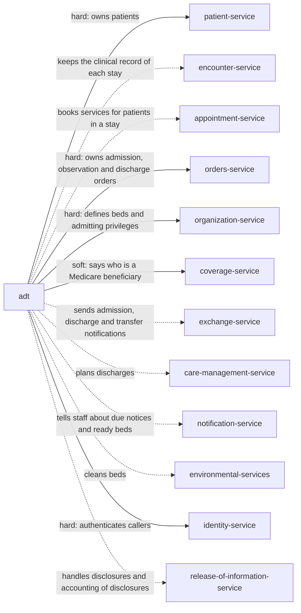

> Snapshot of healthcare/ehr/adt version 0.2.0, saved 2026-10-07. The current version is at https://knowledge-graph-ecru.vercel.app/docs/healthcare/ehr/adt.md.

# Admission, discharge and transfer (/docs/healthcare/ehr/adt)

## Module identity

- module: adt
- layer: ehr
- version: 0.2.0
- status: draft

## How to read this spec

- This is the complete spec for this page, with every inherited item already merged in.
- If a behaviour is not listed here, it is unspecified. Do not assume or invent it. Ask, or record it as an open question.
- Ids such as BR-1, FR-2 and AC-3 are stable. Cite them in code, tests and commit messages.
- This is the core adt specification: nothing is inherited, and industry and domain pages build on it.

## Purpose & scope

Manage each hospital stay from the decision to admit to the moment the patient leaves: admission requests and orders, beds and the bed board, transfers, leave, changes between observation and inpatient, discharge, and the notices and notifications the law ties to each step. Every step is reported to Encounters, which keeps the clinical record of the stay.

**In scope**

- Pending admissions, admissions and cancelled admissions
- Admission orders and the practitioners allowed to give them
- The bed board: bed status, occupancy and reservations
- Bed assignment, including patients admitted and waiting for a bed
- Pending and actual transfers inside the hospital, and cancelled transfers
- Leave of absence
- Changes between observation and inpatient
- Pending discharge, discharge, and cancelled discharge
- The Medicare discharge-rights notice and the observation notice
- Admission, discharge and transfer notifications to the patient's practitioners
- The census of patients in beds

**Out of scope**

- The clinical record of the stay. Encounters owns it; this module reports each step to it.
- Emergency department arrival, triage and emergency transfers to other hospitals under EMTALA. The Emergency department module owns them.
- Bed and room definitions: which beds exist, where, and what they can be used for. The Organization module owns them.
- Discharge planning content, care coordination and the discharge summary. Care management and Clinical documentation own them.
- Infection control decisions, such as who needs isolation. Clinical modules decide; this module only places patients accordingly.
- Visitation rights and visitor policies. A Visitors module owns them.
- Admission and discharge orders themselves. Orders owns them; this module checks one exists.
- Insurance, utilization review decisions and billing. Coverage and Billing own them.

## Overview

### Product perspective

Solid arrows are services this module calls; dotted arrows are services it notifies.

### Actors

| Actor | Description |
| --- | --- |
| Bed manager | Assigns beds, approves transfers and keeps the bed board current. |
| Registrar | Records admissions and discharges, and delivers notices. |
| Clinician | Requests admissions, transfers and discharges for patients in their care. |
| Environmental services | Cleans beds and marks them ready. |
| Privacy officer | Reviews who accessed stays. |
| System | Another module, such as Orders or the Emergency department, reporting an event. |
| Patient | The person the stay is about, or their personal representative within the authority the Patients module records. |

### Assumptions and dependencies

**AS-E1** Orders holds admission, observation and discharge orders, with who gave them and when.
  - Why: Medicare requires an inpatient admission order from a qualified practitioner (42 CFR 412.3); this module needs only to know it exists.
**AS-E2** Organization defines beds, their unit and features, and which practitioners have admitting privileges.
  - Why: Admitting privileges are granted by the hospital to a practitioner, not by this module.
**AS-E3** Coverage says whether a patient is a Medicare beneficiary.
  - Why: The discharge-rights and observation notices apply to Medicare beneficiaries.
**AS-E4** The jurisdiction and notice settings are set with legal advice before go-live.
  - Why: Notices and notification duties differ by country and US state.

## Functions

### Business rules

**BR-E1** A patient is admitted only with an admission order, or an observation order for observation, from a practitioner with admitting privileges. The order and practitioner are recorded on the stay.
  - Why: Medicare treats a patient as an inpatient only if formally admitted under an order from a qualified practitioner with admitting privileges (42 CFR 412.3(a) and (b)).
**BR-E2** A patient has at most one stay that is pending or admitted. A newborn's stay is its own, linked to the mother's through the Patients module.
  - Why: A patient is in one hospital bed at a time; two stays send orders and charges to the wrong one.
**BR-E3** A pending admission opens a planned encounter through Encounters. Admission starts it. Cancelling the pending admission cancels it.
  - Why: IHE pending admit (A14) and its cancel (A27) let beds and staff be prepared; Encounters keeps one record from the start.
**BR-E4** A patient can be admitted before a bed is ready. Until one is assigned, the stay records where they wait, such as the emergency department, and is listed as boarding.
  - Why: Admitted patients often wait for beds. Recording them as admitted, with their real location, keeps orders, staff and the census correct.
**BR-E5** A bed takes a patient only if it is unoccupied, not reserved for another stay, and on a unit that provides the stay's level of care. One bed holds one patient, except a newborn rooming in with their mother. An isolated bed takes only a patient needing the same isolation; closed and contaminated beds take nobody. Where room_sharing_policy restricts who may share a room, it is applied too.
  - Why: HL7 bed status (Table 0116) tells the bed board what each bed can take. Putting a patient in a dirty or closed bed, or two in one, is a safety failure. The level of care decides staffing and monitoring, so an intensive care patient in a ward bed is a safety failure.
**BR-E6** When a patient leaves a bed, by transfer, discharge or death, the bed becomes housekeeping until environmental services marks it unoccupied.
  - Why: A bed must be cleaned before the next patient. The housekeeping status is what stops the next assignment until it is.
**BR-E7** A transfer is requested first, which reserves the target bed for this stay. The transfer moves the patient and frees the old bed; cancelling the request releases the reservation. A transfer recorded by mistake can be cancelled, returning the patient to the previous bed if it is still free.
  - Why: IHE defines pending transfer (A15), transfer (A02) and their cancels (A26, A12). Reserving the target stops another patient being placed there in the meantime.
**BR-E8** During a leave of absence the stay keeps its bed, reserved, and Encounters puts the encounter on hold. The leave ends when the patient returns.
  - Why: IHE leave of absence (A21) and return (A22). The bed is still the patient's, so nobody else may be placed in it.
**BR-E9** A patient is discharged with a discharge order, except when they leave against medical advice or die. The discharge records the disposition and destination, frees the bed, and is reported to Encounters, Appointments and Exchange.
  - Why: A discharge is a clinical decision recorded as an order. A patient who leaves against advice, or dies, is discharged without one, with that disposition.
**BR-E10** A discharge recorded by mistake can be cancelled while the patient's bed is still free or reserved; the stay returns to admitted.
  - Why: IHE cancel discharge (A13). If the bed has been given away, a new bed must be assigned first.
**BR-E11** A change from observation to inpatient needs an inpatient admission order and takes effect at the order's time. A change from inpatient to observation is allowed only before discharge, with who approved it and why recorded.
  - Why: Medicare counts inpatient status from the admission order (42 CFR 412.3); observation time before it stays outpatient. Changing an inpatient back needs a recorded decision because it changes what the patient pays.
**BR-E12** For a Medicare beneficiary admitted as an inpatient, the Important Message from Medicare is due no later than 2 calendar days after admission, and a follow-up copy no more than 2 calendar days before discharge, unless the first was given within 2 days of discharge. Due notices are listed until recorded as given.
  - Why: Hospitals must give Medicare inpatients a standardized notice of their rights, including discharge appeal rights, at these times (42 CFR 405.1205(b) and (c)).
**BR-E13** For a Medicare beneficiary in observation, the MOON is due no later than 36 hours after observation starts, or sooner on transfer, discharge or admission. It is listed until recorded as given.
  - Why: Hospitals must give the notice to Medicare patients receiving observation as outpatients for more than 24 hours (42 CFR 489.20(y)).
**BR-E14** Admissions, discharges and transfers out of the hospital are announced so the Exchange module can notify the patient's established practitioners and post-acute providers, unless the patient's privacy preferences or the law prevent it. notification_preferences_default decides whether notifications go unless the patient objects, or only after asking.
  - Why: Hospitals with electronic records must send notifications at inpatient admission and at or just before discharge or transfer, consistent with the patient's expressed privacy preferences (42 CFR 482.24(d)).
**BR-E15** Admission is announced to Care management, so patients likely to need discharge planning are identified early, and discharge is announced with its destination so necessary information goes with the patient.
  - Why: Hospitals must identify patients needing discharge planning at an early stage and send necessary medical information at discharge to the providers responsible for follow-up (42 CFR 482.43(a) and (b)).
**BR-E16** When a patient dies during a stay, the discharge records disposition expired, and the Patients module is told the time and that the death was pronounced in the hospital.
  - Why: The death must be recorded once, by the module that owns it, and the stay must close so the bed and record follow.
**BR-E17** At admission, the patient is asked about the facility directory, and Encounters records the answer.
  - Why: HIPAA lets a hospital list a patient in its directory only after telling them and giving them a chance to object (45 CFR 164.510(a)). Admission is the first chance.
**BR-E18** A patient in a sensitive department, or with a restricted record, is placed and shown on the bed board only to staff who need it, with name masking where the Patients module requires.
  - Why: The bed board is visible across the hospital. It must not reveal what Part 2 or a privacy alias protects.
**BR-E19** Every view and change of a stay is logged with who, when and what.
  - Why: HIPAA requires audit controls (45 CFR 164.312(b)).
**BR-E20** Fields the service sets, such as status, admitted_at, discharged_at, observation_started_at, notices, bed_reserved_for and revision, cannot be written by clients, and every change sends the revision it read.
  - Why: Status and times drive notices, billing and census; a client writing them skips the rules. Concurrent bed moves must not overwrite each other.
**BR-E21** When the Patients module records a death, the patient's pending admissions are cancelled, and an admitted stay not already discharged as expired is discharged with disposition expired at the recorded time.
  - Why: A death recorded elsewhere, such as by a registrar or from an outside report, must still close the stay, free the bed and stop the notices.
**BR-E22** After a patient merge, if the remaining patient has two stays pending or admitted, both are kept and listed for a bed manager to resolve; the one-stay rule (BR-E2) is not applied to the move. When a merge is undone, stays recorded since the merge are listed for review.
  - Why: Duplicate records can each hold an open stay for the same admission. Refusing the merge keeps the duplicate; closing one silently could discharge a real patient.
**BR-E23** When the Patients module marks a patient entered in error, their pending admissions are cancelled.
  - Why: The record was created by mistake, so the planned stay will never happen.
**BR-E24** A patient, or their representative within the authority the Patients module records, can read their own stays electronically as soon as they are recorded, with no review delay. They can ask for part of a stay record to be corrected; an HIM specialist decides within the Patients module's correction_deadline, and accuracy_contested marks the disputed part meanwhile if they ask.
  - Why: HIPAA gives rights of access and amendment (45 CFR 164.524 and 164.526), a delay in access is likely information blocking (45 CFR 171.103), and GDPR gives access, rectification and restriction (Articles 15, 16 and 18).
**BR-E25** Where rooming_in is on, a newborn rooms in with their mother: the newborn's stay shares the mother's bed location without a bed of its own, and moves with her.
  - Why: WHO recommends mothers and infants stay together 24 hours a day (Ten Steps to Successful Breastfeeding, Step 7). Requiring a separate bed would separate them on paper and block recording the baby's stay.

### State machine

Initial state: `pending_admission`. States: `pending_admission`, `admitted`, `discharged`, `cancelled`.
Any transition not listed below is invalid.

| From | To | Trigger | Guard |
| --- | --- | --- | --- |
| pending_admission | admitted | admit | an admission or observation order (BR-E1), and no other open stay (BR-E2) |
| pending_admission | cancelled | cancel pending admission | - |
| admitted | cancelled | cancel admission recorded in error | Encounters reports no clinical data on the stay |
| admitted | admitted | assign bed, transfer, leave, return or class change | - |
| admitted | discharged | discharge | a discharge order, unless against medical advice or death (BR-E9) |
| discharged | admitted | cancel discharge | the bed is still free or reserved (BR-E10) |

### Workflows

#### Admit from the emergency department
Actor: Bed manager
Trigger: An emergency physician decides to admit

1. Record a pending admission with the admission order
2. Admit the patient; with no bed ready, record the emergency department as where they wait
3. Assign a bed when one is unoccupied and suitable
4. Ask about the facility directory, and start notice due dates
5. Announce the admission to Encounters, Exchange and Care management

Outcome: The patient is admitted at once, boarding is visible, and the notices and notifications start.

#### Admit an elective patient
Actor: Registrar
Trigger: A planned admission, such as surgery next week

1. Record the pending admission with the expected time; Encounters opens a planned encounter
2. On the day, admit with the order and assign the reserved or available bed

Outcome: Pre-admission work attaches to the stay before it starts.

#### Transfer a patient
Actor: Bed manager
Trigger: A clinician or bed manager requests a move

1. Request the transfer, reserving the target bed
2. Move the patient; the old bed becomes housekeeping
3. Announce the transfer to Encounters

Outcome: No one else is placed in the target bed, and the old bed is cleaned before reuse.

#### Discharge a patient
Actor: Registrar
Trigger: A discharge order is given

1. Record the expected discharge time when known, and the Medicare follow-up notice due date
2. Discharge with disposition and destination
3. Free the bed for housekeeping
4. Announce the discharge to Encounters, Appointments, Exchange and Care management

Outcome: The stay closes, follow-up providers are notified, and the bed is cleaned.

#### Clean a bed
Actor: Environmental services
Trigger: A bed becomes housekeeping

1. Clean the bed
2. Mark it unoccupied

Outcome: The bed is ready for the next patient.

### Validations

| Field | Rule | Error |
| --- | --- | --- |
| patient_id | Patients confirms a record in use, not deceased | STAY_INVALID_PATIENT |
| status, patient_class, admission_type, admit_source, discharge_disposition, readmission, bed_status, isolation_required | values from their code lists | STAY_INVALID_CODE |
| admission_order_id, discharge_order_id | Orders confirms an open order of the right kind for this patient | STAY_ORDER_REQUIRED |
| attending_practitioner_id | Organization confirms admitting privileges on the date | STAY_INVALID_PRACTITIONER |
| bed_id, waiting_location_id, discharge_destination_id | Organization confirms the bed or location; a bed must be able to take the patient (BR-E5) | STAY_BED_UNAVAILABLE |
| pending_transfer | a target bed that can take the patient, and a reason | STAY_BED_UNAVAILABLE |
| expected_admission_at, expected_discharge_at, leave | RFC 3339 instants; expected discharge not before admission; leave return not before its start | STAY_INVALID_PERIOD |
| id, encounter_id, admitted_at, discharged_at, observation_started_at, notices, bed_reserved_for, revision, accuracy_contested, shares_mother_location | never sent by clients (BR-E20) | STAY_READ_ONLY_FIELD |
| level_of_care | from levels_of_care; the assigned bed's unit provides it | STAY_BED_UNAVAILABLE |

### Edge cases

**EC-E1** An emergency patient is admitted at 02:00 and no bed is ready until 09:00.
  - Required behaviour: The stay is admitted at 02:00 with the emergency department as where they wait, listed as boarding, and assigned a bed at 09:00.
  - Covered by: BR-E4, AC-E2
**EC-E2** Two bed managers assign the same bed at once.
  - Required behaviour: One succeeds; the other fails with STAY_BED_UNAVAILABLE or STAY_REVISION_CONFLICT.
  - Covered by: BR-E5, AC-E3
**EC-E3** A patient is discharged and the next admission is placed in the bed before it is cleaned.
  - Required behaviour: Rejected with STAY_BED_UNAVAILABLE: the bed is housekeeping until marked unoccupied.
  - Covered by: BR-E6, AC-E5
**EC-E4** A patient leaves against medical advice with no discharge order.
  - Required behaviour: Discharged with disposition aadvice; no order is needed.
  - Covered by: BR-E9, AC-E7
**EC-E5** A patient dies overnight.
  - Required behaviour: Discharged with disposition expired; Patients records the death; the bed becomes housekeeping.
  - Covered by: BR-E16, AC-E14
**EC-E6** A Medicare patient admitted on Friday is discharged the following Thursday.
  - Required behaviour: The initial notice was due by Sunday; a follow-up is due no earlier than Tuesday and before discharge.
  - Covered by: BR-E12, AC-E11
**EC-E7** A Medicare patient goes into observation at 20:00 and is admitted at 14:00 the next day.
  - Required behaviour: The MOON was due by 08:00 two days later, but admission makes it due at once if not yet given.
  - Covered by: BR-E13, AC-E12
**EC-E8** A patient who asked that their stay not be shared is discharged.
  - Required behaviour: Exchange is told the patient's preference applies, and no notification is sent to their practitioners.
  - Covered by: BR-E14, AC-E13
**EC-E9** A patient on contact isolation needs a bed.
  - Required behaviour: Only an unoccupied bed, or an isolated one for the same isolation, can take them.
  - Covered by: BR-E5, AC-E4
**EC-E10** A discharge was recorded for the wrong patient, and their bed is still free.
  - Required behaviour: The discharge is cancelled and the stay returns to admitted in the same bed.
  - Covered by: BR-E10, AC-E8
**EC-E11** Orders is down when an admission is recorded.
  - Required behaviour: Rejected with STAY_DEPENDENCY_UNAVAILABLE; the patient is cared for and the admission recorded when Orders returns.
  - Covered by: FR-E12, AC-E19
**EC-E12** A family member tells the registrar a patient admitted yesterday died at home on leave.
  - Required behaviour: The death is recorded in Patients, and ADT discharges the stay with disposition expired.
  - Covered by: BR-E21, AC-E29
**EC-E13** A newborn rooms in with their mother on the postnatal ward.
  - Required behaviour: The baby's stay has no bed of its own and moves with the mother.
  - Covered by: BR-E25, AC-E33
**EC-E14** An intensive care patient is the only patient waiting when a ward bed frees up.
  - Required behaviour: The ward bed can't take them; they wait for an intensive care bed.
  - Covered by: BR-E5, AC-E34

## Data

### Data model

| Field | Type | Required | Description | Constraints |
| --- | --- | --- | --- | --- |
| id | string | yes | The stay id. | set by the service |
| patient_id | string | yes | The patient, owned by the Patients module. | a record in use |
| encounter_id | string | no | The encounter Encounters opened for the stay. | set from Encounters |
| status | enum | yes | Where the stay is. | pending_admission \| admitted \| discharged \| cancelled; changed only through operations; codes: none standard; reported to Encounters as FHIR EncounterStatus planned, in-progress and discharged |
| patient_class | enum | yes | Inpatient or observation. | inpatient \| observation; codes: HL7 v3 ActCode IMP, OBSENC |
| admission_type | code | no | Why and how urgently the patient is admitted. | codes: HL7 v2 Table 0007 (A accident, C elective, E emergency, L labor and delivery, N newborn, R routine, U urgent) |
| admit_source | code | no | Where the patient came from. | codes: HL7 admit-source (such as emd, outp, hosp-trans, born, gp) |
| admission_order_id | string | no | The admission or observation order, owned by Orders. | required to admit (BR-E1) |
| level_of_care | code | no | The level of care the order asks for, such as intensive care or general ward. | set from the admission or transfer order; codes: deployment list levels_of_care, mapped to the units Organization says provide them |
| attending_practitioner_id | string | no | The practitioner responsible for the stay, owned by Organization. | - |
| expected_admission_at | instant | no | When a pending admission is expected. | - |
| admitted_at | instant | no | When the patient was admitted. | set by the service |
| bed_id | string | no | The bed the patient occupies, owned by Organization. Unset while boarding. | - |
| waiting_location_id | string | no | Where an admitted patient waits for a bed, such as the emergency department. | - |
| pending_transfer | transfer request | no | A requested transfer: the target bed, the reason and who asked. | - |
| leave | leave | no | A leave of absence in progress: when it started and when the patient is expected back. | - |
| expected_discharge_at | instant | no | When discharge is expected. | - |
| discharge_order_id | string | no | The discharge order, owned by Orders. | required to discharge, except against medical advice or death (BR-E9) |
| discharged_at | instant | no | When the patient left. | set by the service |
| discharge_disposition | code | no | Where the patient went, or why they left. | codes: HL7 discharge-disposition (such as home, snf, other-hcf, aadvice, exp) |
| discharge_destination_id | string | no | The facility the patient went to, owned by Organization or Exchange. | - |
| readmission | code | no | Set when this admission is a re-admission. | codes: HL7 v2 Table 0092 (R) |
| observation_started_at | instant | no | When observation began. | set by the service |
| notices | notice[] | no | Notices owed and given: the Important Message from Medicare (initial and follow-up) and the MOON, each with due and given times. | set by the service; given times recorded through the notice operation |
| isolation_required | code[] | no | Isolation the patient needs, reported by clinical modules, for bed placement. | codes: deployment list isolation_types, such as contact, droplet, airborne |
| revision | integer | yes | Increases with every change. | set by the service |
| bed_status | enum | yes | On each bed in the bed board: whether it can take a patient. | unoccupied \| occupied \| housekeeping \| closed \| contaminated \| isolated; codes: HL7 v2 Table 0116 (U, O, H, C, K, I), as FHIR Location.operationalStatus |
| bed_reserved_for | string | no | On a bed: the stay it is held for, by a pending transfer or a leave. | set by the service |
| accuracy_contested | boolean | no | Set while the patient contests part of the stay record and asked for it to be restricted. | set by the service through correction requests |
| shares_mother_location | boolean | no | Set when a newborn rooms in with their mother and has no bed of their own. | set by the service when rooming_in is on |

### Relationships

| Edge | Target | Note |
| --- | --- | --- |
| belongs_to | patient | every stay has one patient |
| has_one | encounter | the clinical record of the stay, owned by Encounters |
| belongs_to | order | the admission and discharge orders |
| belongs_to | bed | the bed occupied, owned by Organization |
| can_trigger | event:stay.admitted | - |

## External interfaces

### API

#### Request an admission: `POST /stays`
Record a pending admission. Accepts a retry key.
- Success: 201
- Actor: Clinician
- Input: patient, class, admission type, admit source, expected time, order, attending practitioner
- Result: the pending stay
- Errors: STAY_INVALID_PATIENT, STAY_CONCURRENT, STAY_INVALID_CODE, STAY_INVALID_PRACTITIONER, STAY_INVALID_PERIOD, STAY_READ_ONLY_FIELD, STAY_IDEMPOTENCY_KEY_REUSED, STAY_DEPENDENCY_UNAVAILABLE

#### Admit: `POST /stays/{id}/admit`
Admit the patient, with a bed or a waiting location.
- Success: 200
- Actor: Registrar
- Input: stay id, revision, order, bed or waiting location
- Result: the admitted stay
- Errors: STAY_NOT_FOUND, STAY_ORDER_REQUIRED, STAY_CONCURRENT, STAY_BED_UNAVAILABLE, STAY_INVALID_TRANSITION, STAY_REVISION_CONFLICT, STAY_DEPENDENCY_UNAVAILABLE

#### Cancel an admission: `POST /stays/{id}/cancel`
Cancel a pending admission, or an admission recorded in error with no clinical data.
- Success: 200
- Actor: Registrar
- Input: stay id, revision, reason
- Result: the cancelled stay
- Errors: STAY_NOT_FOUND, STAY_INVALID_TRANSITION, STAY_REVISION_CONFLICT, STAY_DEPENDENCY_UNAVAILABLE

#### Assign a bed: `POST /stays/{id}/bed`
Place an admitted patient in a bed.
- Success: 200
- Actor: Bed manager
- Input: stay id, revision, bed
- Result: the stay
- Errors: STAY_NOT_FOUND, STAY_BED_UNAVAILABLE, STAY_INVALID_TRANSITION, STAY_REVISION_CONFLICT, STAY_DEPENDENCY_UNAVAILABLE

#### Request a transfer: `POST /stays/{id}/transfer-requests`
Request a move to another bed, reserving it.
- Success: 201
- Actor: Clinician
- Input: stay id, revision, target bed, reason
- Result: the stay with its pending transfer
- Errors: STAY_NOT_FOUND, STAY_BED_UNAVAILABLE, STAY_INVALID_TRANSITION, STAY_REVISION_CONFLICT, STAY_DEPENDENCY_UNAVAILABLE

#### Transfer: `POST /stays/{id}/transfer`
Move the patient to the reserved bed, or cancel the pending transfer or the last transfer.
- Success: 200
- Actor: Bed manager
- Input: stay id, revision, perform or cancel
- Result: the stay
- Errors: STAY_NOT_FOUND, STAY_NO_PENDING_TRANSFER, STAY_BED_UNAVAILABLE, STAY_REVISION_CONFLICT, STAY_DEPENDENCY_UNAVAILABLE

#### Start or end leave: `POST /stays/{id}/leave`
Start or end a leave of absence.
- Success: 200
- Actor: Registrar
- Input: stay id, revision, start with expected return, or end
- Result: the stay
- Errors: STAY_NOT_FOUND, STAY_INVALID_TRANSITION, STAY_INVALID_PERIOD, STAY_REVISION_CONFLICT, STAY_DEPENDENCY_UNAVAILABLE

#### Change class: `POST /stays/{id}/class`
Change between observation and inpatient.
- Success: 200
- Actor: Registrar
- Input: stay id, revision, new class, order or approval and reason
- Result: the stay
- Errors: STAY_NOT_FOUND, STAY_ORDER_REQUIRED, STAY_INVALID_TRANSITION, STAY_INVALID_CODE, STAY_REVISION_CONFLICT, STAY_DEPENDENCY_UNAVAILABLE

#### Set expected discharge: `PUT /stays/{id}/expected-discharge`
Record or change when discharge is expected.
- Success: 200
- Actor: Clinician
- Input: stay id, revision, time
- Result: the stay
- Errors: STAY_NOT_FOUND, STAY_INVALID_PERIOD, STAY_INVALID_TRANSITION, STAY_REVISION_CONFLICT, STAY_DEPENDENCY_UNAVAILABLE

#### Discharge: `POST /stays/{id}/discharge`
Discharge the patient, with disposition and destination.
- Success: 200
- Actor: Registrar
- Input: stay id, revision, order unless against advice or death, time, disposition, destination
- Result: the discharged stay
- Errors: STAY_NOT_FOUND, STAY_ORDER_REQUIRED, STAY_INVALID_CODE, STAY_INVALID_PERIOD, STAY_INVALID_TRANSITION, STAY_REVISION_CONFLICT, STAY_DEPENDENCY_UNAVAILABLE

#### Cancel a discharge: `POST /stays/{id}/discharge/cancel`
Undo a discharge recorded in error.
- Success: 200
- Actor: Registrar
- Input: stay id, revision, reason
- Result: the stay, admitted
- Errors: STAY_NOT_FOUND, STAY_BED_UNAVAILABLE, STAY_INVALID_TRANSITION, STAY_REVISION_CONFLICT, STAY_DEPENDENCY_UNAVAILABLE

#### Record a notice: `POST /stays/{id}/notices`
Record that a notice was given.
- Success: 200
- Actor: Registrar
- Input: stay id, revision, notice, time given, to whom
- Result: the stay
- Errors: STAY_NOT_FOUND, STAY_INVALID_CODE, STAY_REVISION_CONFLICT, STAY_DEPENDENCY_UNAVAILABLE

#### Get a stay: `GET /stays/{id}`
Read a stay.
- Success: 200
- Actor: Clinician
- Input: stay id
- Result: the stay
- Errors: STAY_NOT_FOUND, STAY_NOT_AUTHORISED_FOR_PATIENT, STAY_DEPENDENCY_UNAVAILABLE

#### Read the census: `GET /stays/census`
Patients in beds by unit, now or at a past time such as midnight, and patients boarding.
- Success: 200
- Actor: Bed manager
- Input: unit or all units, time
- Result: counts and stays by unit
- Errors: STAY_INVALID_QUERY, STAY_DEPENDENCY_UNAVAILABLE

#### Read the bed board: `GET /beds`
Every bed's status, occupant and reservation, masked as BR-E18 requires.
- Success: 200
- Actor: Bed manager
- Input: unit, status; limit and cursor
- Result: beds
- Errors: STAY_INVALID_QUERY, STAY_DEPENDENCY_UNAVAILABLE

#### Update bed status: `POST /beds/{id}/status`
Mark a bed cleaned, closed, contaminated or isolated.
- Success: 200
- Actor: Environmental services
- Input: bed id, status, isolation type where isolated
- Result: the bed
- Errors: STAY_INVALID_CODE, STAY_BED_UNAVAILABLE, STAY_DEPENDENCY_UNAVAILABLE

#### Read the access log: `GET /stays/{id}/access-log`
Every view and change of a stay.
- Success: 200
- Actor: Privacy officer
- Input: stay id; limit and cursor
- Result: entries
- Errors: STAY_NOT_FOUND, STAY_DEPENDENCY_UNAVAILABLE

#### Request a correction: `POST /stays/{id}/correction-requests`
Ask for part of a stay record to be corrected, and optionally restricted meanwhile.
- Success: 201
- Actor: Patient
- Input: stay id, what is wrong, the correct value, whether to restrict meanwhile
- Result: the request with its due date
- Errors: STAY_NOT_FOUND, STAY_NOT_AUTHORISED_FOR_PATIENT, STAY_DEPENDENCY_UNAVAILABLE

#### Decide a correction: `POST /stays/{id}/correction-requests/{requestId}/decision`
Accept or deny a correction request, with a written reason and any statement of disagreement.
- Success: 200
- Actor: Registrar
- Input: request id, decision, reason, statement of disagreement
- Result: the request
- Errors: STAY_CORRECTION_NOT_FOUND, STAY_CORRECTION_CLOSED, STAY_DEPENDENCY_UNAVAILABLE

### API conventions

| Topic | Convention | Reference |
| --- | --- | --- |
| Authentication | Every request carries the caller's identity from Identity, and permissions are checked against it. | - |
| Errors | Errors use problem details (application/problem+json) with a code member, such as STAY_BED_UNAVAILABLE. | RFC 9457 |
| Concurrency | Every change sends the revision it read; a stale revision fails with STAY_REVISION_CONFLICT. Bed assignment also checks the bed's own state, so two stays never get one bed. | - |
| Retries | Every change accepts an Idempotency-Key header (FR-E11). | IETF draft-ietf-httpapi-idempotency-key-header |
| Pagination | Lists are cursor-based: limit and cursor in, next_cursor out. | - |
| Times | Instants are RFC 3339 timestamps in UTC (CON-E2). | RFC 3339 |
| Versioning | Additive changes don't change the version; a breaking change ships as a new major version with Deprecation and Sunset headers. | RFC 9745, RFC 8594 |

### Events

| Event | Description | Payload |
| --- | --- | --- |
| stay.admission_requested | A pending admission was recorded. | stay_id, patient_id, expected_admission_at, revision |
| stay.admitted | The patient was admitted. | stay_id, patient_id, patient_class, admitted_at, share_restricted, revision |
| stay.admission_cancelled | A pending or mistaken admission was cancelled. | stay_id, revision |
| stay.bed_assigned | The patient was placed in a bed. | stay_id, bed_id, revision |
| stay.transfer_requested | A transfer was requested and the target bed reserved. | stay_id, bed_id, revision |
| stay.transferred | The patient moved to another bed. | stay_id, from_bed_id, bed_id, revision |
| stay.transfer_cancelled | A pending or recorded transfer was cancelled. | stay_id, revision |
| stay.leave_started | A leave of absence started. | stay_id, revision |
| stay.leave_ended | The patient returned from leave. | stay_id, revision |
| stay.class_changed | The stay changed between observation and inpatient. | stay_id, patient_class, effective_at, revision |
| stay.discharge_expected | An expected discharge time was set or changed. | stay_id, expected_discharge_at, revision |
| stay.discharged | The patient left. | stay_id, patient_id, discharged_at, discharge_disposition, discharge_destination_id, share_restricted, revision |
| stay.discharge_cancelled | A discharge was undone. | stay_id, revision |
| stay.notice_due | A Medicare notice is due. | stay_id, notice, due_at |
| bed.status_changed | A bed's status changed. | bed_id, bed_status |
| stay.review_needed | Someone must resolve this stay: two open stays after a merge, or a stay recorded since an undone merge. | stay_id, reason, revision |
| stay.correction_decided | A correction request was decided. | stay_id, request_id, decision, revision |

### Event delivery

**DG-E1** Events are published at least once; consumers drop one with a source and id they have seen.
  - Why: CloudEvents defines source plus id as the duplicate check.
**DG-E2** Events for one stay can arrive out of order; each carries the revision, and consumers ignore a lower one.
  - Why: Brokers and retries don't guarantee order.
**DG-E3** Events carry ids, codes and times, never names or diagnoses. share_restricted tells Exchange the patient's preference prevents notifications.
  - Why: Minimum necessary (45 CFR 164.502(b)) and GDPR data minimisation (Article 5(1)(c)).

### Errors

| Code | HTTP | Meaning |
| --- | --- | --- |
| STAY_NOT_FOUND | 404 | No stay exists with that id. |
| STAY_INVALID_QUERY | 422 | Give a unit or ask for all units, with a valid time. |
| STAY_INVALID_PATIENT | 422 | The patient doesn't exist, isn't in use, or has died. |
| STAY_CONCURRENT | 409 | The patient already has a stay pending or admitted. |
| STAY_INVALID_CODE | 422 | A code isn't in the allowed list for its field. |
| STAY_ORDER_REQUIRED | 422 | This needs an open order of the right kind. |
| STAY_INVALID_PRACTITIONER | 422 | The practitioner doesn't have admitting privileges on that date. |
| STAY_BED_UNAVAILABLE | 409 | That bed can't take this patient now: it is occupied, reserved, being cleaned, closed, contaminated or isolated for something else. |
| STAY_INVALID_PERIOD | 422 | The times are out of order or not valid instants. |
| STAY_INVALID_TRANSITION | 409 | The stay's status doesn't allow that. |
| STAY_NO_PENDING_TRANSFER | 409 | There is no pending or recent transfer to perform or cancel. |
| STAY_REVISION_CONFLICT | 409 | The stay changed since you read it. Read it again and retry. |
| STAY_READ_ONLY_FIELD | 422 | That field is set by the service and can't be written. |
| STAY_IDEMPOTENCY_KEY_REUSED | 409 | That Idempotency-Key was used for a different request. |
| STAY_DEPENDENCY_UNAVAILABLE | 503 | A service this request needs is unavailable. Retry later. |
| STAY_NOT_AUTHORISED_FOR_PATIENT | 403 | Only the patient or their personal representative can request this. |
| STAY_CORRECTION_NOT_FOUND | 404 | No such correction request. |
| STAY_CORRECTION_CLOSED | 409 | This correction request was already decided. |

### Dependencies

Each dependency lists its contract: only what this module needs from it (upstream) or gives it (downstream). How the other module works is out of scope.

| Service | Direction | Criticality | Reason | Contract |
| --- | --- | --- | --- | --- |
| patient-service | upstream | hard | owns patients | Asks: does this patient exist, is the record in use, and is the patient alive?; Asks: is the patient restricted, or using a privacy alias?; Asks: may this person act for this patient, and the correction_deadline for this jurisdiction; Gives: whether this patient has an active stay; Gives: a death during a stay, with its time and the source hospital pronouncement; Receives: patient.merged, patient.unmerged, patient.deceased and patient.entered_in_error |
| encounter-service | downstream | soft | keeps the clinical record of each stay | Gives: stay.admission_requested, stay.admitted, stay.admission_cancelled, stay.bed_assigned, stay.transfer_requested, stay.transferred, stay.transfer_cancelled, stay.leave_started, stay.leave_ended, stay.class_changed, stay.discharge_expected, stay.discharged and stay.discharge_cancelled; Gives: a re-admission flag and the facility directory answer; Receives: the encounter id for each stay, encounter.observation_started, and whether clinical data is recorded; The clinical record is Encounters' concern |
| appointment-service | downstream | soft | books services for patients in a stay | Gives: whether a patient is in an active stay, its kind and its encounter id; Gives: stay.discharged and stay.class_changed, so appointments for the stay are reviewed |
| orders-service | upstream | hard | owns admission, observation and discharge orders | Asks: is there an open order of this kind for this patient, and who gave it?; Writing orders is Orders' concern |
| organization-service | upstream | hard | defines beds and admitting privileges | Asks: does this bed or location exist, and on which unit?; Asks: does this practitioner have admitting privileges on this date? |
| coverage-service | upstream | soft | says who is a Medicare beneficiary | Asks: is this patient a Medicare beneficiary?; Gives: stay.admitted, stay.class_changed and stay.discharged for coverage and utilization review |
| exchange-service | downstream | soft | sends admission, discharge and transfer notifications | Gives: stay.admitted, stay.transferred and stay.discharged with share_restricted; Choosing recipients and sending notifications (42 CFR 482.24(d)) is Exchange's concern |
| care-management-service | downstream | soft | plans discharges | Gives: stay.admitted, stay.discharge_expected and stay.discharged with destination; Receives: an expected discharge time; Discharge planning (42 CFR 482.43) is Care management's concern |
| notification-service | downstream | soft | tells staff about due notices and ready beds | Gives: stay.notice_due, stay.review_needed and bed.status_changed |
| environmental-services | downstream | soft | cleans beds | Gives: bed.status_changed when a bed needs cleaning; Receives: a bed marked unoccupied once cleaned |
| identity-service | upstream | hard | authenticates callers | Asks: who is the caller, and do they hold this permission? |
| release-of-information-service | downstream | soft | handles disclosures and accounting of disclosures | Gives: stay.correction_decided, with any statement of disagreement, for later disclosures; Accounting of disclosures (45 CFR 164.528) is Release of information's concern |

## Security

### Permission matrix

| Action | Bed manager | Registrar | Clinician | Environmental services | Privacy officer | System | Patient | Permission |
| --- | --- | --- | --- | --- | --- | --- | --- | --- |
| Request an admission, a transfer, or set expected discharge | any | none | own | none | none | any | none | stay.write |
| Admit, cancel, change class, start or end leave, discharge, cancel a discharge, record a notice | any | any | none | none | none | none | none | stay.write |
| Assign a bed, or transfer | any | none | none | none | none | none | none | stay.write |
| Get a stay, read the census or the bed board | any | any | own | none | none | any | own | stay.read |
| Update bed status | any | none | none | any | none | none | none | bed.write |
| Read the access log | none | none | none | none | any | none | none | stay.audit |
| Request a correction | none | none | none | none | none | none | own | stay.read |
| Decide a correction | none | any | none | none | none | none | none | stay.write |

any: every appointment. own: appointments the actor takes part in. none: not allowed.

- Request an admission, a transfer, or set expected discharge: own: patients in their care.

- Get a stay, read the census or the bed board: Masked as BR-E18 requires. Patients read only their own stays, not the census or bed board.

- Decide a correction: An HIM specialist in the Registrar role.

### Permissions

| Permission | Grants |
| --- | --- |
| stay.read | Read stays, the census and the bed board. |
| stay.write | Admit, transfer, discharge and record notices. |
| bed.write | Change bed status. |
| stay.audit | Read the access log. |

### Privacy and retention

| Field | Category | Purpose | Retention |
| --- | --- | --- | --- |
| patient_id, encounter_id, status, patient_class, admission_type, admit_source, admission_order_id, attending_practitioner_id, readmission, level_of_care, shares_mother_location | health data; shows the person was admitted, and how | Managing the stay | record_retention of the Patients module |
| expected_admission_at, admitted_at, expected_discharge_at, discharged_at, observation_started_at, leave | health data | When the patient was in hospital | record_retention of the Patients module |
| bed_id, waiting_location_id, pending_transfer, bed_reserved_for, bed_status | personal; reveals where the patient is | Placing and finding the patient | record_retention of the Patients module |
| discharge_order_id, discharge_disposition, discharge_destination_id | health data; reveals outcome and destination | Discharge and follow-up care | record_retention of the Patients module |
| notices | personal | Showing the required notices were given | record_retention of the Patients module |
| isolation_required | health data; can reveal an infection | Safe bed placement | Until discharge |
| id, revision, access log | record metadata | Integrity and access review | record_retention, and access_log_retention for the log |
| accuracy_contested, correction requests | health data | Honouring the patient's rights over the stay record | record_retention of the Patients module |

### Compliance

**CMP-E1** Medicare payment rules, 42 CFR 412.3: Admit only under an order from a qualified practitioner with admitting privileges.
  - How it's met: Admission needs an order and a privileged practitioner; class changes follow the order time.
  - Status: met
  - Covered by: BR-E1, BR-E11
**CMP-E2** Medicare beneficiary notices, 42 CFR 405.1205: Give the Important Message from Medicare within 2 days of admission, and a follow-up copy within 2 days before discharge.
  - How it's met: Due dates tracked and listed until given.
  - Status: met
  - Covered by: BR-E12
**CMP-E3** Medicare Outpatient Observation Notice, 42 CFR 489.20(y): Give the MOON within 36 hours of observation starting.
  - How it's met: Due dates tracked and listed until given.
  - Status: met
  - Covered by: BR-E13
**CMP-E4** Medicare Conditions of Participation, 42 CFR 482.24(d): Send notifications at admission and at or before discharge or transfer, honouring privacy preferences.
  - How it's met: Events to Exchange carry share_restricted; Exchange sends.
  - Status: partly met
  - Covered by: BR-E14
**CMP-E5** Medicare Conditions of Participation, 42 CFR 482.43(a) and (b): Identify patients needing discharge planning early, and send necessary information at discharge.
  - How it's met: Admission and discharge go to Care management with the destination.
  - Status: partly met
  - Covered by: BR-E15
**CMP-E6** Medicare Conditions of Participation, 42 CFR 482.43(c): Written transfer protocols and staff training.
  - How it's met: An organisational duty of the hospital.
  - Status: deployment
**CMP-E7** Medicare Conditions of Participation, 42 CFR 482.13(h): Visitation rights.
  - How it's met: The Visitors module.
  - Status: other module
**CMP-E8** EMTALA, 42 CFR 489.24(e): Appropriate transfers of emergency patients.
  - How it's met: The Emergency department module.
  - Status: other module
**CMP-E9** HIPAA Privacy Rule, 45 CFR 164.510(a): Facility directory only after the patient can object.
  - How it's met: Asked at admission and recorded by Encounters.
  - Status: met
  - Covered by: BR-E17
**CMP-E10** HIPAA Privacy Rule, 45 CFR 164.502(b): Minimum necessary.
  - How it's met: Events carry ids and codes; the bed board masks restricted patients.
  - Status: met
  - Covered by: BR-E18
**CMP-E11** 42 CFR Part 2, 42 CFR 2.13: Protect substance use disorder program records.
  - How it's met: Sensitive departments are masked on the bed board.
  - Status: met
  - Covered by: BR-E18
**CMP-E12** HIPAA Security Rule, 45 CFR 164.312(b): Audit controls.
  - How it's met: Every view and change is logged.
  - Status: met
  - Covered by: BR-E19, FR-E10
**CMP-E13** HIPAA Security Rule, 45 CFR 164.312(a)(2)(iv) and (e): Encryption at rest and in transit.
  - How it's met: Stay data is encrypted.
  - Status: met
  - Covered by: CON-E1
**CMP-E14** GDPR (EU) 2016/679, Article 5(1)(c): Data minimisation.
  - How it's met: Events carry no names or diagnoses.
  - Status: met
  - Covered by: BR-E18
**CMP-E15** GDPR (EU) 2016/679, Article 9(2)(h) and 17(3)(c): Process and keep health data for care.
  - How it's met: Retention follows the Patients module.
  - Status: met
**CMP-E16** GDPR (EU) 2016/679, Article 32: Security appropriate to the risk.
  - How it's met: Encryption, masking and access logging.
  - Status: met
  - Covered by: CON-E1, BR-E19
**CMP-E17** GDPR (EU) 2016/679, Articles 30, 33 to 35 and 37: Records of processing, breach notification, impact assessment and a data protection officer.
  - How it's met: Organisational duties of the deployment.
  - Status: deployment
**CMP-E18** HIPAA Privacy Rule, 45 CFR 164.524: Give patients access to their information.
  - How it's met: Patients read their own stays at once.
  - Status: met
  - Covered by: BR-E24
**CMP-E19** 21st Century Cures Act information blocking, 45 CFR 171.103: Don't interfere with access to electronic health information.
  - How it's met: No review delay on patients' own access.
  - Status: met
  - Covered by: BR-E24
**CMP-E20** HIPAA Privacy Rule, 45 CFR 164.526: Decide amendment requests within 60 days, with written denials.
  - How it's met: Correction requests decided within the Patients module's deadlines.
  - Status: met
  - Covered by: BR-E24
**CMP-E21** HIPAA Privacy Rule, 45 CFR 164.528: Give an accounting of disclosures.
  - How it's met: The Release of information module.
  - Status: other module
**CMP-E22** HIPAA Breach Notification Rule, 45 CFR 164.404: Notify individuals of a breach within 60 calendar days.
  - How it's met: The Security module.
  - Status: other module
**CMP-E23** GDPR (EU) 2016/679, Articles 12(3) and 15: Access within one month.
  - How it's met: Immediate electronic access.
  - Status: met
  - Covered by: BR-E24
**CMP-E24** GDPR (EU) 2016/679, Articles 16 and 18: Rectification, and restriction while accuracy is checked.
  - How it's met: Correction requests and accuracy_contested.
  - Status: met
  - Covered by: BR-E24

## Requirements

### Functional requirements

| ID | Requirement | Priority | Verified by |
| --- | --- | --- | --- |
| FR-E1 | The service must record pending admissions, admissions and their cancellations, and report each to Encounters. | must | test |
| FR-E2 | The service must keep the bed board: each bed's status, occupant and reservation. | must | test |
| FR-E3 | The service must assign beds only as BR-E5 allows, including to patients already admitted. | must | test |
| FR-E4 | The service must request, perform and cancel transfers, and record leave of absence. | must | test |
| FR-E5 | The service must record class changes between observation and inpatient. | must | test |
| FR-E6 | The service must record pending discharge, discharge and cancelled discharge. | must | test |
| FR-E7 | The service must track the Medicare notices due for each stay and record when they are given. | must | test |
| FR-E8 | The service must announce admissions, discharges and transfers for practitioner notifications, honouring privacy preferences. | must | test |
| FR-E9 | The service must report the census of patients in beds, by unit, at any time and at midnight. | must | test |
| FR-E10 | The service must log every view and change, and let a privacy officer read the log. | must | test |
| FR-E11 | The service must accept an Idempotency-Key on every change, so a retried request never admits or moves a patient twice. | must | test |
| FR-E12 | The service must fail fast with STAY_DEPENDENCY_UNAVAILABLE when Patients, Orders or Organization cannot be reached. | must | test |

### Performance requirements

| Id | Indicator | Target | Measured as |
| --- | --- | --- | --- |
| PERF-E1 | Boarding time | Set by each deployment | Median and 90th percentile time from admission to bed assignment, by unit. |
| PERF-E2 | Bed turnaround | Set by each deployment | Time from a bed becoming housekeeping to unoccupied. |
| PERF-E3 | Notices given on time | 100% | Share of Medicare notices recorded as given before their due time. |
| PERF-E4 | Double occupancy | 0 | Beds with two occupants at once. Any non-zero value is a defect. |

### Quality attributes

| Category | Requirement |
| --- | --- |
| compatibility | Events map to HL7 v2 ADT messages: pending admit A14 and its cancel A27, admit A01 and cancel A11, transfer A02 and cancel A12, pending transfer A15 and cancel A26, discharge A03 and cancel A13, pending discharge A16 and cancel A25, class changes A06 and A07, leave A21 and A22. This follows IHE PAM (ITI-31). |
| compatibility | Bed status maps to FHIR Location.operationalStatus with HL7 v2 Table 0116. |
| security | Only staff who need it see who is in which bed; restricted and sensitive patients are masked (BR-E18). |
| availability | Patient care never waits for this module: an outage delays recording, not admission or treatment. |
| reliability | A change is acknowledged only after it is committed together with its events. |
| portability | No requirement depends on a particular database, language or framework. |

### Design constraints

**CON-E1** Stay data is encrypted in transit and at rest.
  - Why: GDPR Article 32 and HIPAA 45 CFR 164.312.
**CON-E2** Times are RFC 3339 instants in UTC; notice due dates are computed in calendar days in the hospital's time zone.
  - Why: The Medicare notices count calendar days, which depend on the local date.

### Configuration

| Setting | Type | Default | Description |
| --- | --- | --- | --- |
| jurisdiction | us \| eu | none | Which legal regime applies. The Medicare notices apply only in the United States. Required. |
| hospital_time_zone | IANA time zone | none | Used to count calendar days for notices and the midnight census. Required. |
| isolation_types | code list | none | Isolation types used for bed placement, such as contact, droplet and airborne. Required. |
| notification_preferences_default | send \| ask | send | Whether admission, discharge and transfer notifications are sent unless the patient objects, or only after asking. Set with legal advice. |
| levels_of_care | code list | none | Levels of care orders can ask for, such as intensive care, step-down and general ward, each with the units that provide it. Required. |
| rooming_in | boolean | true | Whether newborns room in with their mother without a bed of their own (WHO Ten Steps, Step 7). |
| room_sharing_policy | none \| same_sex \| patient_preference | none | Who may share a multi-bed room. Practice and law differ by hospital and country, so there is no default; set it with the hospital's policy. |

## Verification

### Acceptance criteria

**AC-E1**
- Given a pending admission with an admission order from a practitioner with privileges, and one without an order
- When each is admitted
- Then the first is admitted, Encounters starts its encounter and stay.admitted is emitted; the second fails with STAY_ORDER_REQUIRED (422)
- Verifies: BR-E1, BR-E3, FR-E1

**AC-E2**
- Given an admitted patient with no bed ready
- When admission is recorded, then a bed is assigned
- Then the stay is admitted with the emergency department as waiting location and listed as boarding; assignment emits stay.bed_assigned
- Verifies: BR-E4, FR-E3

**AC-E3**
- Given one unoccupied bed
- When two assignments to it arrive together
- Then one succeeds; the other fails with STAY_BED_UNAVAILABLE (409)
- Verifies: BR-E5, FR-E3

**AC-E4**
- Given a patient needing contact isolation, a bed isolated for droplet, and one unoccupied
- When each bed is assigned
- Then the isolated bed fails with STAY_BED_UNAVAILABLE; the unoccupied bed succeeds
- Verifies: BR-E5

**AC-E5**
- Given a discharged patient's bed
- When it is assigned to the next patient, then cleaned and assigned again
- Then the first fails with STAY_BED_UNAVAILABLE; after environmental services marks it unoccupied, bed.status_changed is emitted and the assignment succeeds
- Verifies: BR-E6, FR-E2

**AC-E6**
- Given an admitted patient
- When a transfer is requested, performed, and another is requested and cancelled
- Then the target bed is reserved with stay.transfer_requested, the move emits stay.transferred and frees the old bed; the cancel releases the reservation with stay.transfer_cancelled
- Verifies: BR-E7, FR-E4

**AC-E7**
- Given an admitted patient
- When they are discharged without an order, once as routine and once against medical advice
- Then the routine one fails with STAY_ORDER_REQUIRED; the other is discharged with disposition aadvice and stay.discharged is emitted
- Verifies: BR-E9, FR-E6

**AC-E8**
- Given a discharge recorded in error, with the bed still free, and another where the bed is now occupied
- When each discharge is cancelled
- Then the first returns to admitted with stay.discharge_cancelled; the second fails with STAY_BED_UNAVAILABLE (409)
- Verifies: BR-E10, FR-E6

**AC-E9**
- Given an admitted patient
- When leave starts and ends
- Then the bed is reserved during leave, stay.leave_started and stay.leave_ended are emitted, and Encounters puts the encounter on hold and back
- Verifies: BR-E8, FR-E4

**AC-E10**
- Given a patient in observation
- When an inpatient admission order arrives, and later a change back to observation is attempted after discharge
- Then the class changes at the order time with stay.class_changed; the later change fails with STAY_INVALID_TRANSITION (409)
- Verifies: BR-E11, FR-E5

**AC-E11**
- Given jurisdiction us and a Medicare inpatient admitted on a Friday
- When the stay continues for six days
- Then the initial notice is due by Sunday, stay.notice_due is emitted, and a follow-up is due no more than 2 calendar days before discharge; recording a notice as given clears it
- Verifies: BR-E12, FR-E7

**AC-E12**
- Given a Medicare patient in observation from 20:00
- When they are admitted the next afternoon without a MOON recorded
- Then the MOON is listed as due at once
- Verifies: BR-E13, FR-E7

**AC-E13**
- Given a patient with no objection, and one whose preference prevents sharing
- When each is admitted and discharged
- Then Exchange receives stay.admitted and stay.discharged for both, with the preference flag set on the second, so only the first is notified
- Verifies: BR-E14, FR-E8

**AC-E14**
- Given an admitted patient who dies
- When the death is recorded as a discharge with disposition expired
- Then the stay is discharged, the bed becomes housekeeping, and Patients is told the time with source hospital pronouncement
- Verifies: BR-E16

**AC-E15**
- Given a patient with a stay already admitted
- When another admission is recorded for them
- Then it fails with STAY_CONCURRENT (409)
- Verifies: BR-E2

**AC-E16**
- Given an admission by a practitioner without admitting privileges, an invalid admission type, and expected discharge before admission
- When each is sent
- Then they fail with STAY_INVALID_PRACTITIONER, STAY_INVALID_CODE and STAY_INVALID_PERIOD, all HTTP 422
- Verifies: BR-E1

**AC-E17**
- Given a deceased or unknown patient, and an unknown stay
- When a stay is requested for the patient, and the unknown stay is read
- Then they fail with STAY_INVALID_PATIENT (422) and STAY_NOT_FOUND (404)
- Verifies: BR-E2

**AC-E18**
- Given a stay at revision 4
- When two changes send revision 4, one sends admitted_at, and a retried admission reuses its key with different details
- Then one change succeeds; the others fail with STAY_REVISION_CONFLICT (409), STAY_READ_ONLY_FIELD (422) and STAY_IDEMPOTENCY_KEY_REUSED (409)
- Verifies: BR-E20, FR-E11

**AC-E19**
- Given Orders unreachable
- When an admission is recorded
- Then it fails with STAY_DEPENDENCY_UNAVAILABLE (503)
- Verifies: FR-E12

**AC-E20**
- Given patients in beds on three units
- When the census is read at midnight, and with no unit or time
- Then each unit's occupied beds are counted; the second fails with STAY_INVALID_QUERY (422)
- Verifies: FR-E9

**AC-E21**
- Given a pending admission, and one admitted in error with no clinical data
- When each is cancelled
- Then the first emits stay.admission_cancelled and Encounters cancels the planned encounter; the second is cancelled the same way
- Verifies: BR-E3, FR-E1

**AC-E22**
- Given an admitted patient
- When an expected discharge time is set
- Then stay.discharge_expected is emitted for Care management and Encounters
- Verifies: BR-E15

**AC-E23**
- Given a restricted patient and a privacy officer
- When a nurse on another unit reads the bed board, and the officer reads the access log
- Then the patient is masked for the nurse; the officer sees every view and change
- Verifies: BR-E18, BR-E19, FR-E10

**AC-E24**
- Given a new admission
- When it is recorded
- Then Encounters is asked to record the facility directory answer
- Verifies: BR-E17

**AC-E25**
- Given stay data stored and in transit, and a stay crossing a daylight saving change
- When it is inspected and notice due dates computed
- Then data is encrypted and due dates follow local calendar days
- Verifies: CON-E1, CON-E2

**AC-E26**
- Given no pending transfer
- When Transfer is sent to perform one
- Then it fails with STAY_NO_PENDING_TRANSFER (409)
- Verifies: BR-E7

**AC-E27**
- Given a planned elective admission
- When it is requested
- Then the stay is pending_admission, stay.admission_requested is emitted, and Encounters opens a planned encounter
- Verifies: BR-E3, FR-E1

**AC-E28**
- Given notification_preferences_default ask, and a patient not yet asked
- When they are admitted
- Then stay.admitted carries share_restricted until the patient agrees
- Verifies: BR-E14

**AC-E29**
- Given a patient with a pending admission, and another with an admitted stay
- When Patients records each death from an outside report
- Then the pending admission is cancelled; the admitted stay is discharged with disposition expired at the recorded time and its bed becomes housekeeping
- Verifies: BR-E21

**AC-E30**
- Given duplicate records each with an admitted stay
- When they are merged, and later unmerged
- Then both stays move to the remaining patient and stay.review_needed is emitted for each; after the unmerge, stays recorded since the merge are listed with stay.review_needed
- Verifies: BR-E22

**AC-E31**
- Given a patient with a pending admission
- When Patients marks the patient entered in error
- Then the pending admission is cancelled
- Verifies: BR-E23

**AC-E32**
- Given a patient, and someone with no authority
- When each reads the patient's stay, and the patient requests a correction that is decided; deciding it again, or an unknown request
- Then the patient sees it at once; the other fails with STAY_NOT_AUTHORISED_FOR_PATIENT (403); the decision emits stay.correction_decided; deciding again fails with STAY_CORRECTION_CLOSED (409); the unknown request fails with STAY_CORRECTION_NOT_FOUND (404)
- Verifies: BR-E24

**AC-E33**
- Given rooming_in on, a mother in bed 12 and her newborn
- When the newborn is admitted, and the mother moves to bed 20
- Then the newborn's stay shares bed 12 without its own bed and moves to bed 20 with her
- Verifies: BR-E25

**AC-E34**
- Given an order for intensive care
- When a general ward bed is assigned
- Then it fails with STAY_BED_UNAVAILABLE; an intensive care bed succeeds
- Verifies: BR-E5

**AC-E35**
- Given room_sharing_policy same_sex and a two-bed room with one patient
- When a patient of the other recorded sex is assigned the empty bed
- Then it fails with STAY_BED_UNAVAILABLE
- Verifies: BR-E5

### Traceability matrix

| Id | Verified by |
| --- | --- |
| BR-E1 | AC-E1, AC-E16 |
| BR-E2 | AC-E15, AC-E17 |
| BR-E3 | AC-E1, AC-E21, AC-E27 |
| BR-E4 | AC-E2 |
| BR-E5 | AC-E3, AC-E4, AC-E34, AC-E35 |
| BR-E6 | AC-E5 |
| BR-E7 | AC-E6, AC-E26 |
| BR-E8 | AC-E9 |
| BR-E9 | AC-E7 |
| BR-E10 | AC-E8 |
| BR-E11 | AC-E10 |
| BR-E12 | AC-E11 |
| BR-E13 | AC-E12 |
| BR-E14 | AC-E13, AC-E28 |
| BR-E15 | AC-E22 |
| BR-E16 | AC-E14 |
| BR-E17 | AC-E24 |
| BR-E18 | AC-E23 |
| BR-E19 | AC-E23 |
| BR-E20 | AC-E18 |
| BR-E21 | AC-E29 |
| BR-E22 | AC-E30 |
| BR-E23 | AC-E31 |
| BR-E24 | AC-E32 |
| BR-E25 | AC-E33 |
| FR-E1 | AC-E1, AC-E21, AC-E27 |
| FR-E2 | AC-E5 |
| FR-E3 | AC-E2, AC-E3 |
| FR-E4 | AC-E6, AC-E9 |
| FR-E5 | AC-E10 |
| FR-E6 | AC-E7, AC-E8 |
| FR-E7 | AC-E11, AC-E12 |
| FR-E8 | AC-E13 |
| FR-E9 | AC-E20 |
| FR-E10 | AC-E23 |
| FR-E11 | AC-E18 |
| FR-E12 | AC-E19 |
| CON-E1 | AC-E25 |
| CON-E2 | AC-E25 |

## Reference implementation

### Storage design

Non-normative: one way to build what the requirements describe. Nothing in the requirements depends on it.

#### `stays`

One row per stay.

| Column | Type | Null | Default | Notes |
| --- | --- | --- | --- | --- |
| id | uuid | no | gen_random_uuid() | - |
| patient_id | uuid | no | - | - |
| encounter_id | uuid | yes | - | - |
| status | text | no | - | - |
| patient_class | text | no | - | - |
| bed_id | uuid | yes | - | - |
| waiting_location_id | uuid | yes | - | - |
| details | jsonb | no | - | admission type, source, orders, practitioner, expected times, leave, pending transfer, discharge details, readmission, isolation |
| admitted_at | timestamptz | yes | - | - |
| discharged_at | timestamptz | yes | - | - |
| observation_started_at | timestamptz | yes | - | - |
| notices | jsonb | no | '[]' | - |
| revision | integer | no | 0 | - |

Indexes:
- `UNIQUE (patient_id) WHERE status IN ('pending_admission', 'admitted')` BR-E2

#### `beds`

Bed board state; the beds themselves are defined by Organization.

| Column | Type | Null | Default | Notes |
| --- | --- | --- | --- | --- |
| bed_id | uuid | no | - | - |
| bed_status | text | no | - | - |
| isolation_type | text | yes | - | - |
| occupant_stay_id | uuid | yes | - | - |
| reserved_for | uuid | yes | - | - |
| updated_at | timestamptz | no | - | - |

Constraints:
- `UNIQUE (occupant_stay_id) WHERE occupant_stay_id IS NOT NULL` one bed per stay

### Implementation notes

Non-normative: one way to build what the requirements describe. Nothing in the requirements depends on it.

#### TN-E1: Lock the bed, not just the stay

Assign beds with a conditional update on the bed row (status unoccupied and not reserved), so two concurrent assignments can't both succeed even when they touch different stays.

#### TN-E2: Count notice days in local time

Compute calendar-day deadlines in hospital_time_zone, using the IANA database, so an admission at 23:30 counts that day as day 0.

## Supporting information

### Concepts

| Concept | Meaning |
| --- | --- |
| This module moves the patient; Encounters records it | Every admission, transfer, leave and discharge happens here and is reported to Encounters, which keeps it on the clinical record of the stay (FHIR keeps one Encounter for the stay). |

### Glossary

| Term | Definition |
| --- | --- |
| Stay | A patient's time in a hospital bed as an inpatient or under observation, from admission to discharge. |
| Pending admission | A decision to admit that hasn't happened yet, such as an elective surgery next week or an emergency patient waiting for a bed (IHE pending admit, HL7 A14). |
| Boarding | An admitted patient still waiting in the emergency department, or elsewhere, for an inpatient bed. |
| Bed board | The live view of every bed's status and occupant. |
| Important Message from Medicare | The standardized notice of a Medicare inpatient's rights, including discharge appeal rights (42 CFR 405.1205). |
| MOON | The Medicare Outpatient Observation Notice, given to patients in observation for more than 24 hours (42 CFR 489.20(y)). |
| Census | The patients in beds at a point in time, such as midnight, by unit. |

### Acronyms

| Acronym | Meaning |
| --- | --- |
| ADT | Admission, discharge and transfer |
| EMTALA | Emergency Medical Treatment and Labor Act |
| IHE PAM | Integrating the Healthcare Enterprise Patient Administration Management profile |
| IMM | Important Message from Medicare |
| MOON | Medicare Outpatient Observation Notice |

### Decisions

**ADR-E1 (2026-10-08)** This module moves patients; Encounters keeps the record.
  - Why: Bed management and orders change fast and involve non-clinical staff; the encounter is the clinical record. IHE separates the Patient Encounter Supplier from its consumers the same way.
**ADR-E2 (2026-10-08)** Admission doesn't wait for a bed.
  - Why: Real hospitals admit and then board patients. Waiting for a bed to record the admission would hide them.

### Risks

**RISK-E1** Two patients are placed in one bed.
  - Impact: Care and medication given to the wrong patient.
  - Mitigation: BR-E5 checked against the bed's own state, and PERF-E4.
**RISK-E2** A Medicare notice is missed.
  - Impact: The patient loses appeal rights and the hospital is out of compliance.
  - Mitigation: Due dates tracked and listed (BR-E12, BR-E13, PERF-E3).
**RISK-E3** Boarding hides admitted patients.
  - Impact: Orders and staffing miss them.
  - Mitigation: Admitted with their real location and listed as boarding (BR-E4).

### References

| ID | Source | Note |
| --- | --- | --- |
| REF-E1 | [42 CFR 412.3, admissions (orders, two-midnight)](https://www.ecfr.gov/current/title-42/section-412.3) | - |
| REF-E2 | [42 CFR 405.1205, notifying beneficiaries of hospital discharge appeal rights](https://www.ecfr.gov/current/title-42/section-405.1205) | - |
| REF-E3 | [42 CFR 489.20(y), Medicare Outpatient Observation Notice](https://www.ecfr.gov/current/title-42/section-489.20) | - |
| REF-E4 | [42 CFR 482.24(d), electronic notifications](https://www.ecfr.gov/current/title-42/section-482.24) | - |
| REF-E5 | [42 CFR 482.43, discharge planning and transfer protocols](https://www.ecfr.gov/current/title-42/section-482.43) | - |
| REF-E6 | [IHE ITI-31 Patient Encounter Management](https://profiles.ihe.net/ITI/TF/Volume2/ITI-31.html) | - |
| REF-E7 | [HL7 v2 Table 0116 (bed status) and 0007 (admission type)](https://terminology.hl7.org/CodeSystem-v2-0116.html) | - |
| REF-E8 | [HL7 FHIR R5, Location (operationalStatus)](https://hl7.org/fhir/R5/location.html) | - |
| REF-E9 | [45 CFR 164.510, facility directories](https://www.ecfr.gov/current/title-45/section-164.510) | - |
| REF-E10 | [WHO, Ten steps to successful breastfeeding (Step 7, rooming-in)](https://www.who.int/teams/nutrition-and-food-safety/food-and-nutrition-actions-in-health-systems/ten-steps-to-successful-breastfeeding) | - |

### Version history

**v0.2.0 (2026-10-08)**
- Stays follow patient deaths (BR-E21), merges and unmerges (BR-E22) and patients entered in error (BR-E23).
- Patients read their own stays and request corrections (BR-E24); Compliance adds access, amendment, accounting and breach.
- Beds match the level of care, rooming-in for newborns (BR-E25), and a room-sharing policy setting (BR-E5).

**v0.1.0 (2026-10-08)**
- First Admission, discharge and transfer module: stays, the bed board, transfers, leave, discharge, Medicare notices and notifications, following IHE PAM and CMS rules.

This module moves patients into, around and out of the hospital's beds. Each
step is reported to Encounters, which keeps the clinical record of the stay.

## Admitted doesn't mean in a bed [#admitted-doesnt-mean-in-a-bed]

A patient admitted at 2 a.m. may wait in the emergency department until
morning. They're admitted at 2 a.m., with their real location, and listed as
boarding until a bed is ready ([BR-E4](/docs/healthcare/ehr/adt/functions/business-rules#br-e4)), so orders, staffing and the census see
them.

## A bed is clean before it's reused [#a-bed-is-clean-before-its-reused]

When a patient leaves, their bed goes to housekeeping until environmental
services marks it ready ([BR-E6](/docs/healthcare/ehr/adt/functions/business-rules#br-e6)). Transfers reserve the target bed first, so
nobody else is placed there in between ([BR-E7](/docs/healthcare/ehr/adt/functions/business-rules#br-e7)).

## The law ties notices to the stay's clock [#the-law-ties-notices-to-the-stays-clock]

Medicare inpatients get their rights notice within 2 days of admission and a
follow-up within 2 days before discharge ([BR-E12](/docs/healthcare/ehr/adt/functions/business-rules#br-e12)). Patients in observation get
the MOON within 36 hours ([BR-E13](/docs/healthcare/ehr/adt/functions/business-rules#br-e13)). This module knows the dates, so it lists
what's due until someone records it as given.

License: "Admission, discharge and transfer" by Knowledge Graph contributors, https://knowledge-graph-ecru.vercel.app/docs/healthcare/ehr/adt, licensed under CC BY-SA 4.0 (https://creativecommons.org/licenses/by-sa/4.0/).
