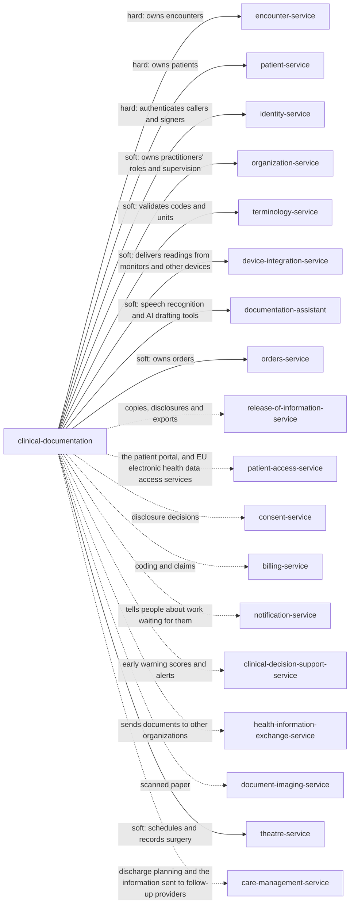

> Snapshot of healthcare/ehr/clinical-documentation version 0.4.4, saved 2026-10-09. The current version is at https://knowledge-graph-ecru.vercel.app/docs/healthcare/ehr/clinical-documentation.md.

# Clinical documentation (/docs/healthcare/ehr/clinical-documentation)

## Module identity

- module: clinical-documentation
- layer: healthcare > ehr
- based on: Clinical notes and observations (healthcare, /docs/healthcare/clinical-documentation)
- version: 0.4.4
- status: draft

## How to read this spec

- This is the complete spec for this page, with every inherited item already merged in.
- If a behaviour is not listed here, it is unspecified. Do not assume or invent it. Ask, or record it as an open question.
- Ids such as BR-1, FR-2 and AC-3 are stable. Cite them in code, tests and commit messages.
- Items that start with "US only:" or "EU only:" apply only in that jurisdiction. Skip the ones for a jurisdiction your project doesn't operate in, or add ?jurisdiction=us or ?jurisdiction=eu to this URL to leave them out. Unmarked items apply everywhere.
- Tags such as [core] or [healthcare] show which layer an item comes from. "overrides X" means it replaces the item with the same id from layer X.

## Purpose & scope

Add what a hospital must document to the clinical notes and observations rules: the history and physical before surgery and within 24 hours of admission, the operative report, the discharge summary or EU discharge report, the nursing care plan, and information sent at discharge.

**In scope**

- US hospital deadlines for the history and physical, operative report and discharge summary, and the check Theatre makes before surgery
- EU discharge reports in the European format
- Nursing care plans for inpatient stays
- Notes available to Care management at discharge

**Out of scope**

- Surgical scheduling. Theatre owns it and reports when a procedure ends.
- Sending information to follow-up providers. Care management owns it.

## Overview

### Product perspective

Solid arrows are services this module calls; dotted arrows are services it notifies.

### Actors

| Actor | Description | Layer |
| --- | --- | --- |
| Clinician | A licensed practitioner who writes and signs notes, such as a physician, advanced practice provider or therapist. | healthcare |
| Nurse | A nurse who records vital signs and assessments, validates device readings and writes nursing notes. | healthcare |
| Trainee | A resident or student whose notes need a supervising practitioner's cosignature where the deployment requires it. | healthcare |
| Scribe | A person who enters documentation for a named practitioner. A scribe never signs for them. | healthcare |
| Health information management (HIM) specialist | Tracks deficiencies, moves misfiled notes, marks entries in error and decides correction requests. | healthcare |
| Privacy officer | Reviews the access log and holds placed on releases. | healthcare |
| Patient | The patient, or a representative within the authority the Patients module records. Reads their notes and adds patient-entered information. | healthcare |
| System | Other modules and tools: Encounters, Device integration, and drafting tools such as speech recognition or AI scribes. | healthcare |

### Assumptions and dependencies

**AS-H1** Encounters reports when encounters start, are discharged, complete, move to another patient, merge, or are cancelled. _[healthcare]_
  - Why: Notes open and lock with their encounter. Encounters owns its lifecycle.
**AS-H2** Identity can confirm, at the moment of signing, that the person signing is the signed-in user, by asking for a credential again. _[healthcare]_
  - Why: A signature attests authorship. Hospitals must use an author identification system that protects the integrity of authentication (42 CFR 482.24(b)).
**AS-H3** Organization knows each practitioner's roles on a date, which roles may write which note types, and who may supervise whom. _[healthcare]_
  - Why: Scope of practice and supervision come from state law, licences and medical staff bylaws, which Organization holds.
**AS-H4** Medical staff bylaws or hospital policy set the deadlines for signing, cosigning and completing notes, within any limit the law sets. _[healthcare]_
  - Why: The law sets outer limits, such as 30 days to complete a US hospital record; providers set shorter ones in their bylaws.

## Functions

### Business rules

**BR-H1** Every note and observation belongs to one patient whose record is in use. It is recorded against an encounter of that patient that is not cancelled or entered in error, except readings the patient or their device reports from outside a visit, such as remote monitoring, and patient-entered information, which can stand without an encounter. _[healthcare]_
  - Why: FHIR makes the encounter optional on Composition and Observation (0..1). ONC describes patient-generated health data as recorded outside the clinical setting, and remote physiologic monitoring sends readings between visits. Everything recorded during care still belongs to its encounter.
**BR-H2** A draft note is seen and edited only by its author, and by the scribe or drafting tool that created it. It is not part of the record used for care, it is never released to the patient, and it can be edited freely. _[healthcare]_
  - Why: HL7 v2 allows editing a document in place only while it is unavailable for patient care (MDM T07). Until the author signs, nobody else should act on it.
**BR-H3** Signing makes a note available for care. From then on its content never changes in place: a change is a correction (BR-H10) or an addendum (BR-H9), and the previous version stays readable. _[healthcare]_
  - Why: Others may already have acted on a signed note. HL7 v2 replaces an available document instead of editing it (MDM T09), Medicare wants every change clearly and permanently identified (Program Integrity Manual chapter 3, 3.3.2.5), and HIPAA requires protection against improper alteration (45 CFR 164.312(c)(1)).
**BR-H4** Only the responsible author signs a note, with their own credential confirmed again at signing. Nobody signs for someone else, signing can't be delegated or automatic, and a stamped or typed name isn't a signature. Signing records signed_at and needs every required section of the note type to have text. _[healthcare]_
  - Why: Medicare reviewers need the person responsible for each entry identifiable by a handwritten or electronic signature (Program Integrity Manual chapter 3, 3.3.2.4), and HIPAA requires protecting information from improper alteration (45 CFR 164.312(c)(1)); US hospitals must also authenticate every entry (42 CFR 482.24(c)(1)). Medicare doesn't accept stamped signatures except for a documented disability (Program Integrity Manual chapter 3, 3.3.2.4).
**BR-H5** When cosign_rules say a note type written by an author's role needs a cosignature, the author names the cosigner when signing, signing makes it preliminary and opens an uncosigned deficiency for the cosigner. The cosigner signs it final, optionally with an attestation statement; they can't change the author's text. Changes they want are made by the author as a correction, or by the cosigner as an addendum. _[healthcare]_
  - Why: Supervising practitioners take responsibility for trainees' notes as medical staff bylaws require. The author's words stay theirs, so the record shows who said what. HL7 v2 marks such a note pre-authenticated until it is authenticated (Table 0271 PA, AU).
**BR-H6** A scribe enters a note for a named practitioner. The note records the scribe as data_enterer and the practitioner as author. Only the practitioner signs it, with their own date and time, and the scribe can never sign or cosign. _[healthcare]_
  - Why: The practitioner's signature affirms that the note documents the care (Medicare Program Integrity Manual chapter 3, 3.3.2.4). The Joint Commission expects the scribe to be identifiable and the practitioner to authenticate the entry.
**BR-H7** Content drafted by speech recognition or an AI tool starts as a draft with source and drafting_tool recorded. The author can sign it only by confirming they reviewed it, which sets review_attested, and the provenance stays with the note, including any marking the tool adds to show content is AI-generated. _[healthcare]_
  - Why: Medicare requires the practitioner's concurrence when AI technology captures medical record entries (Program Integrity Manual chapter 3, 3.3.2.4). Drafting tools can invent or misattribute findings, so nothing they write reaches the record unreviewed.
**BR-H8** Every note and observation keeps two times: when the care or measurement happened (service_at, effective_at) and when it was recorded. Neither can be later than now plus clock_tolerance. An entry recorded more than late_entry_threshold after the care is a late entry: it needs a reason and is shown as late. _[healthcare]_
  - Why: The date and author of any delayed entry must be identifiable, and a late entry must be identifiable as such (Medicare Program Integrity Manual chapter 3, 3.3.2.5). Showing both times stops a late entry passing as contemporaneous.
**BR-H9** Information found or remembered after a note is available goes in an addendum: a new note linked to it by parent_note_id, with its own author, times and signature. The parent doesn't change. An addendum can't be added to a draft, cancelled or entered-in-error note. _[healthcare]_
  - Why: HL7 v2 gives an addendum its own document id linked to the parent (MDM T05). AHIMA guidance says an addendum bears the current date, its reason and its author.
**BR-H10** Only the responsible author corrects a signed note, with a reason. The correction is a new version: status becomes corrected, the previous version stays in versions and stays readable, and the correction is signed like the original. If a cosignature was needed, the corrected version needs it again. _[healthcare]_
  - Why: A correction must keep the original and show who changed what, when and why (AHIMA amendment guidance; Medicare Program Integrity Manual chapter 3, 3.3.2.5). Only the author can say what they meant.
**BR-H11** A draft can be discarded by its author, which cancels it. A note that has been signed can never be cancelled or deleted. _[healthcare]_
  - Why: HL7 v2 cancels only documents never made available for care (MDM T11); an available one is replaced, so the record shows what others saw.
**BR-H12** A signed note created in error, such as on the wrong patient or twice, is marked entered in error by its author or an HIM specialist with a reason. It disappears from views used for care and from the patient's view, but is kept, with its content, for HIM specialists and privacy officers. _[healthcare]_
  - Why: FHIR marks such a document entered-in-error rather than deleting it. A note shown on the wrong patient may have been read, so what was shown must stay provable.
**BR-H13** An HIM specialist moves a note or observation filed under the wrong encounter of the same patient, with a reason; the earlier encounter is kept in moved_from. An entry on the wrong patient is never moved: it is marked entered in error (BR-H12) and a copy is started as a draft on the right encounter, keeping service_at and the original author, who must sign it again. _[healthcare]_
  - Why: A signature attests content about a particular patient. HL7 v2 removes a document from the wrong patient's record rather than re-pointing it (MDM T11 scenario).
**BR-H14** Text copied through the service's copy feature keeps its source note, author and date in copied_text, and is shown as copied. Copying from another patient's record is refused, and copy_paste_policy can block copying into some note types. _[healthcare]_
  - Why: The Partnership for Health IT Patient Safety recommends making copied material easily identifiable and its source readily available, because copying spreads errors and puts documentation in the wrong patient's chart (Tsou and others, 2017).
**BR-H15** Each note type in note_types can be required for some encounter classes, with a deadline. When an encounter of that class starts, or an encounter's class changes to it, a missing_note deficiency is opened for the responsible practitioner, due at the deadline counted from the start or the change. _[healthcare]_
  - Why: Providers must document certain notes, such as discharge summaries, by law, payer rules or accreditation. Tracking them per encounter is what lets a record be completed on time. When a class changes, the deadline counts from the change.
**BR-H20** A deficiency is opened for each required note missing, each draft its author hasn't signed within signature_deadline of service_at, and each preliminary note not cosigned within cosign_deadline. It resolves itself when the note is signed or cosigned. It becomes delinquent delinquency_after past due_at, and the practitioner and HIM specialists are told. When Encounters reports encounter.record_overdue, the encounter's open deficiencies are marked delinquent. When it reports encounter.amended with a changed start or discharge time, due dates counted from them are recomputed. _[healthcare]_
  - Why: Records must be completed promptly, as provider policies, payers and, for US hospitals, 42 CFR 482.24(b) require, and medical staff bylaws define delinquency. A list per practitioner is how hospitals get records completed.
**BR-H21** When an encounter is discharged and it has no draft or preliminary note, no open deficiency, and every required note signed, documentation.completed is reported to Encounters. If, before Encounters completes the encounter, a required note is marked entered in error or a new deficiency opens, documentation.reopened is reported. A cancelled discharge also reports documentation.reopened when completion was already reported. _[healthcare]_
  - Why: Encounters completes an encounter only when this module reports its documentation complete. Reporting a reopen keeps the two from drifting apart.
**BR-H22** After an encounter is completed, new notes on it are addenda, corrections or late entries with a reason, and they never reopen its documentation. _[healthcare]_
  - Why: Encounters locks a completed encounter and records later changes as amendments. Notes added later are recorded as late, not as part of the original record.
**BR-H23** When Encounters reports an encounter moved to another patient, its notes and observations follow it and their patient_id changes. When it reports two encounters merged, the duplicate's entries move to the remaining one and the old encounter id is kept in moved_from. _[healthcare]_
  - Why: Encounters gives encounter.moved and encounter.merged so linked entries follow it. An entry left on the old encounter would be filed under the wrong patient or a dead record.
**BR-H24** Patient merges reach this module through the encounters they move. When Encounters reports encounter.patient_review_needed after the Patients module undoes a merge, the notes and observations on that encounter recorded since the merge are listed for an HIM specialist to check they are on the right patient. _[healthcare]_
  - Why: After a merge, care for either person was recorded on one record. Undoing it can't tell automatically whose care each new entry described.
**BR-H25** US only: In the United States, a signed note is released to the patient's electronic access as soon as it is signed. It is held back only when a licensed professional decides the release is reasonably likely to cause harm (BR-H27), when a law requires a delay, named in the hold, when the patient asked for their own access to be delayed (the Patients module's patient_requested_delay), or when it is a psychotherapy note or was prepared for a legal proceeding. Drafts are not released. _[healthcare]_
  - Why: A delay for review is likely information blocking unless a law requires it (45 CFR 171.103(a)) or an exception applies, such as preventing harm (171.201) or the patient's own request (171.202(e)). The right of access excludes psychotherapy notes and information compiled for legal proceedings (164.524(a)(1)). Notes not yet finalized need not be released unless used to make decisions (ONC information blocking FAQ).
**BR-H26** EU only: In the European Union, a signed note is released to the patient's access as soon as it is signed. A delay is allowed only where the member state's law provides one, until a health professional can explain the information (eu_release_delay). _[healthcare]_
  - Why: Patients have the right to access their priority-category data immediately after it is registered (EHDS Article 3(1)); member states may restrict it by delaying access until a professional can explain it (Article 3(3)), and GDPR gives a right of access (Article 15).
**BR-H27** A hold names its grounds, and the law when the grounds are that a law requires it, the sections it covers, the professional who decided and when, and a review date. It covers no more than the grounds require. The patient is told what is held and can ask for the decision to be reviewed by another licensed professional who didn't make it. A hold ends at its review date unless renewed. _[healthcare]_
  - Why: HIPAA allows denial of access only on narrow grounds, with a right to review by another licensed professional (45 CFR 164.524(a)(3) and (4)), and the information blocking exception for preventing harm requires an individual decision no broader than necessary (45 CFR 171.201).
**BR-H28** US only: In the United States, note types in psychotherapy_note_types are psychotherapy notes: kept apart from the rest of the record, read only by their author, never released, copied into other notes, exported or exchanged, and never required for documentation to be complete. Disclosing one needs a specific authorization, which is Consent's concern. Medication monitoring, session times, test results and summaries of diagnosis, status, plan, symptoms and progress go in ordinary notes. _[healthcare]_
  - Why: HIPAA defines psychotherapy notes as session notes separated from the record, excluding those items (45 CFR 164.501), excludes them from the right of access (164.524(a)(1)(i)) and requires an authorization for most uses and disclosures (164.508(a)(2)).
**BR-H29** A note carries the encounter's sensitivity codes plus any its author adds, and every event about it carries them. Disclosure decisions are Consent's concern. _[healthcare]_
  - Why: Substance use, mental health and HIV information has extra legal protection, such as 42 CFR Part 2 in the United States and GDPR Article 9. Consumers can only protect what is labelled.
**BR-H30** A patient, or their representative, can add patient-entered information to their record. It is labelled as patient-entered, it can't change any professional's entry, and professionals can't edit it; they can respond in their own note. _[healthcare]_
  - Why: The EHDS gives patients a right to insert information that is clearly distinguishable, without altering professionals' entries (Article 5). The same separation keeps the record honest anywhere.
**BR-H31** A patient, or their representative, can ask for a note to be corrected. An HIM specialist decides within the Patients module's correction_deadline, extendable once by correction_extension with a written reason, after checking with the author or another health professional. An accepted request is made as a correction or addendum by the author, linked to the request. A denied one gives the reason in writing, and the patient can add a statement of disagreement, which goes with later disclosures. _[healthcare]_
  - Why: HIPAA requires a decision within 60 days, one 30-day extension, a written denial and a right to disagree (45 CFR 164.526). GDPR gives a right to rectification (Article 16), and the EHDS has the controller verify accuracy with a health professional (Article 6).
**BR-H32** When a patient who asks for a correction also asks for the data to be restricted meanwhile, accuracy_contested is set; everyone reading the note sees it marked until the request is decided. _[healthcare]_
  - Why: GDPR gives a right to restriction while accuracy is checked (Article 18(1)(a)). Marking rather than hiding keeps the note available for care.
**BR-H33** Every read and change of a note or observation is logged with who, when and what. Reading entries of a restricted patient needs a reason, as the Patients module requires. _[healthcare]_
  - Why: HIPAA requires audit controls (45 CFR 164.312(b)). Notes hold the most sensitive detail in the record.
**BR-H34** Notes and observations are kept as long as the Patients module's record_retention requires, and never erased before, even on request. Those of a patient under legal hold are never erased. _[healthcare]_
  - Why: Retention periods come from state and national law, set as the Patients module's record_retention (US hospitals: at least 5 years, 42 CFR 482.24(b)(1)). GDPR doesn't require erasure of data needed for care or to meet a legal obligation (Article 17(3)(b) and (c)).
**BR-H35** When a note that was sent outside the organization is corrected or marked entered in error, note.corrected or note.entered_in_error tells Release of information, which tells the recipients it sent it to. _[healthcare]_
  - Why: HIPAA requires telling people the amended information was shared with (45 CFR 164.526(c)(3)). A recipient acting on a wrong note can harm the patient.
**BR-H36** Vital signs use the LOINC code and the UCUM units of the FHIR vital signs profiles, except that body weight is metric only (BR-H53), and the value is kept in the unit it was entered in. A blood pressure is recorded as one observation with systolic and diastolic components. _[healthcare]_
  - Why: The FHIR vital signs profiles fix the codes and units every exchange partner expects. Converting on entry loses precision and hides what the nurse saw.
**BR-H37** A value outside the plausible limits in vital_sign_limits is refused. A value outside the normal range for the patient's age is accepted and flagged with an interpretation code. The range used is kept with the value, so a later change to the limits never changes how an earlier value reads. _[healthcare]_
  - Why: An impossible value is a typing or unit error, such as a temperature in Fahrenheit entered as Celsius. An abnormal one is clinical information that must be recorded.
**BR-H38** When device_values_need_validation is set, readings from devices are preliminary until a nurse, or the clinician monitoring the patient remotely, accepts them, which makes them final and records them as performer. Rejected readings never enter the record and are kept only in the access log. _[healthcare]_
  - Why: Monitors produce artifacts, such as a reading taken while a cuff was moving. Filing them unvalidated pollutes the record that early warning and research rely on.
**BR-H39** Derived values are computed by the service, never entered: BMI from a weight and a height measured within bmi_height_max_age, and growth percentiles from the measurement, the patient's age and sex, and growth_reference. When a source value is corrected or entered in error, the derived value is recomputed or marked entered in error. _[healthcare]_
  - Why: A BMI typed by hand can disagree with the weight and height beside it. Keeping derived_from lets a correction reach every value built on it. Percentiles depend on which growth reference is used: CDC recommends WHO charts under 2 years and CDC charts from 2 to 19 years in the United States, and other countries use WHO or national charts.
**BR-H40** A final observation is corrected by its performer or a nurse with a reason, which makes it amended and keeps the previous value in history. One recorded in error is marked entered in error with a reason, and is kept. _[healthcare]_
  - Why: FHIR marks a changed observation amended and keeps the record of what was seen before. Clinical decisions may have been made on the old value.
**BR-H41** An assessment records its instrument and version and each item's answer, and the service computes the score. An assessment missing a required item is saved without a score. _[healthcare]_
  - Why: A score computed by hand can disagree with its items. Instruments change between versions, so the version says how to read the score.
**BR-H42** The first signed note or final observation on an encounter tells Encounters that clinical data is recorded against it. _[healthcare]_
  - Why: Encounters refuses to mark an encounter entered in error once it holds clinical data.
**BR-H43** Drafts and observations are still saved when Terminology or Organization can't be reached, using the last loaded code lists, and they are checked again when it returns. Signing needs Identity and fails with an error when it is down. _[healthcare]_
  - Why: Losing a note or vital sign because a code service was slow is worse than checking it later. A signature without confirmed identity isn't a signature.
**BR-H44** Entries written on paper during an EHR downtime are entered afterwards with source downtime_back_entry and their original times, as late entries with reason downtime. The paper is kept by Document imaging. _[healthcare]_
  - Why: Downtime procedures keep care going; back-entry with original times keeps the record's order of events true.
**BR-H45** Every change sends the revision it read. If the note or observation changed since, the change fails and nothing is saved. _[healthcare]_
  - Why: An author editing one draft on two devices, or two nurses correcting the same reading, must not overwrite each other silently.
**BR-H46** A draft not signed within draft_reminder_after is listed for its author. Drafts are never deleted automatically. _[healthcare]_
  - Why: Forgotten drafts are unwritten records. Deleting them would lose care documentation.
**BR-H47** When the author can no longer sign, for example because they left the organization, an HIM specialist can close the deficiency as unresolvable with a reason. A draft is then filed preliminary with unauthenticated set and shown as unsigned; it is never shown as signed. _[healthcare]_
  - Why: The content may be the only record of care, so it is kept. Medicare reviewers accept an attestation only from the author (Program Integrity Manual chapter 3, 3.3.2.4), so nobody else may sign it.
**BR-H48** Notes can be written after a patient's death, such as a death note or an autopsy addendum. _[healthcare]_
  - Why: Care documentation continues after death; refusing it would leave the end of the record incomplete.
**BR-H49** A representative sees a note only within the authority the Patients module records for them, including its scope and exclusions. A note with withheld_from_representatives set is released to the patient but not to representatives. In the United States, the author sets it for care a minor consented to alone where the law lets them, or under a confidentiality agreement the parent agreed to. _[healthcare]_
  - Why: HIPAA doesn't treat a parent as the representative for such care (45 CFR 164.502(g)(3)), and rules on minors' confidentiality also vary by EU member state. A note reaching a parent's portal can harm the young person and deter them from care.
**BR-H50** A drafting tool that records the conversation can start a draft only with recording_consent from every party that recording_consent requires where the care takes place, given before recording. This module never keeps the recording; deleting it is the tool's concern, within the period the organization agreed with the vendor. _[healthcare]_
  - Why: US federal law lets one party consent to recording (18 U.S.C. 2511(2)(d)), but states such as California and Florida require every party's consent (California Penal Code 632(a), Florida Statutes 934.03(2)(d)). GDPR requires telling people about processing (Article 13).
**BR-H51** EU only: In the European Union, a patient can see who accessed their notes and observations and when, through the access service, including by automatic notification where the member state provides it. _[healthcare]_
  - Why: The EHDS gives a right to information on access to personal electronic health data, including through automatic notifications (Article 9), applying from 26 March 2029 or 2031 depending on the data category (Article 105).
**BR-H53** A body weight is recorded in kilograms or grams only, with weight_basis. A stated or estimated weight is used only when the patient can't be weighed, is shown as such, and the encounter is listed until a measured weight replaces it. Each admission and each outpatient or emergency encounter needs a measured weight as soon as possible. _[healthcare]_
  - Why: The National Coordinating Council for Medication Error Reporting and Prevention recommends measuring and documenting weights in metric units only, avoiding stated, estimated or historical weights, and weighing on admission and at each outpatient or emergency encounter. Pounds entered as kilograms cause serious dosing errors.
**BR-H54** Events from Encounters about one encounter are applied in revision order; an event with a lower revision than one already applied is ignored. _[healthcare]_
  - Why: Encounters sends events at least once and possibly out of order, each with the encounter's revision. Applying an older one, such as discharged after completed, would reopen a finished record.
**BR-E16** US only: In the United States, an inpatient admission or a procedure needing anesthesia needs a history and physical note signed no more than 30 days before or 24 hours after admission or registration, and before the procedure. A note from before admission needs an update note within 24 hours after admission, and before the procedure. The service answers whether an encounter has a current one. _[ehr]_
  - Why: The Medicare conditions of participation set these limits (42 CFR 482.22(c)(5) and 482.24(c)(4)(i)). Theatre needs the answer before surgery starts.
**BR-E17** US only: In the United States, a discharge summary of an inpatient stay must cover the outcome of the hospitalization, the disposition, and the provisions for follow-up care; these are its required sections. _[ehr]_
  - Why: The Medicare conditions of participation require a discharge summary with these contents (42 CFR 482.24(c)(4)(vii)).
**BR-E18** US only: In the United States, an operative report describing techniques, findings and tissues removed or altered is required immediately after surgery and is signed by the surgeon. Its deficiency is due at operative_report_deadline after Theatre reports the procedure ended. _[ehr]_
  - Why: The Medicare conditions of participation require it to be written or dictated immediately following surgery and signed by the surgeon (42 CFR 482.51(b)(6)).
**BR-E19** EU only: In the European Union, a stay ends with a discharge report registered in the EHR as soon as it is signed, and exchangeable in the European format (HL7 Europe Hospital Discharge Report) from 26 March 2031. _[ehr]_
  - Why: Discharge reports are a priority category of electronic health data (EHDS Article 14(1)(f)); healthcare providers must register them in an EHR system (Article 13), and these articles apply to discharge reports from 26 March 2031 (Article 105).
**BR-E52** US only: In the United States, each inpatient stay has a nursing care plan, written by the nursing staff and kept current. It is a required note type for inpatient stays, due at nursing_care_plan_deadline after admission, and is corrected or added to as the patient's needs change. _[ehr]_
  - Why: The Medicare conditions of participation require nursing staff to develop and keep current a nursing care plan for each patient (42 CFR 482.23(b)(4)).

### Workflows

#### Write and sign a note _[healthcare]_
Actor: Clinician
Trigger: A clinician documents care

1. Start a note on the encounter, from a template or blank, which saves a draft
2. Write and save the draft as often as needed, sending the revision each time
3. Sign it: Identity confirms the credential again, required sections are checked, and signed_at is set
4. The note becomes final, or preliminary when a cosignature is needed, and note.signed is emitted
5. The note is released to the patient unless it is held

Outcome: The note is available for care and to the patient, and any deficiency for it resolves.

#### Cosign a trainee's note _[healthcare]_
Actor: Clinician
Trigger: A trainee signs a note whose type and role need a cosignature

1. The note becomes preliminary and an uncosigned deficiency opens for the cosigner
2. The cosigner reads it and cosigns, optionally adding an attestation statement
3. The note becomes final and note.cosigned is emitted

Outcome: The supervising practitioner has taken responsibility for the note.

#### Document with a scribe or drafting tool _[healthcare]_
Actor: Clinician
Trigger: A practitioner works with a scribe, dictation, speech recognition or an AI scribe

1. The scribe or tool creates a draft naming the practitioner as author, with data_enterer or drafting_tool recorded
2. The practitioner reviews and edits the draft
3. The practitioner signs, confirming review, which sets review_attested

Outcome: The note carries the practitioner's signature and shows how it was produced.

#### Fix a signed note _[healthcare]_
Actor: Clinician
Trigger: An error or missing information is found in a signed note

1. For missing or new information, add an addendum and sign it
2. For an error, the author corrects the note with a reason and signs the new version
3. For a note on the wrong patient or a duplicate, the author or an HIM specialist marks it entered in error, and the author signs a copy on the right encounter
4. note.corrected or note.entered_in_error is emitted so Release of information can tell recipients

Outcome: The record shows what was wrong, what replaced it, who changed it and when.

#### Complete an encounter's documentation _[healthcare]_
Actor: System
Trigger: Encounters reports encounter.discharged

1. Check the encounter for drafts, preliminary notes, open deficiencies and missing required notes
2. If any remain, keep the deficiencies on the practitioners' lists and mark them delinquent when overdue
3. When none remain, report documentation.completed to Encounters

Outcome: Encounters can complete the encounter within its record completion deadline.

#### Record and validate vital signs _[healthcare]_
Actor: Nurse
Trigger: A nurse measures vital signs, or a monitor sends readings

1. Enter the values with their units and times, or open the device readings waiting for validation
2. The service checks codes, units and plausibility, flags abnormal values, and computes BMI where it can
3. The nurse accepts the representative readings and rejects artifacts
4. Accepted values become final and observation.recorded is emitted

Outcome: The chart holds validated vital signs with who measured them and when.

#### Handle a patient's correction request _[healthcare]_
Actor: Health information management (HIM) specialist
Trigger: A patient asks for a note to be corrected

1. Record the request, and set accuracy_contested if the patient asks for restriction meanwhile
2. Check the content with the author or another health professional
3. Accept it, and have the author correct the note or add an addendum, or deny it in writing
4. Emit note.correction_decided; on denial, record any statement of disagreement and rebuttal

Outcome: The decision is made within the deadline and travels with later disclosures.

### Validations

| Field | Rule | Error | Layer |
| --- | --- | --- | --- |
| note.encounter_id | Encounters confirms an encounter of a patient in use that is not cancelled or entered in error | NOTE_INVALID_ENCOUNTER | healthcare |
| note.type | One of note_types | NOTE_INVALID_TYPE | healthcare |
| note.authors | Organization confirms each author holds a role allowed to write this type on service_at | NOTE_AUTHOR_NOT_PERMITTED | healthcare |
| note.sections | Each section has a title and text of at most 200000 characters; at least one section has text | NOTE_INVALID_CONTENT | healthcare |
| note.service_at | An RFC 3339 instant not later than now plus clock_tolerance | NOTE_INVALID_TIME | healthcare |
| note.late_entry_reason | Present when recorded_at is more than late_entry_threshold after service_at | NOTE_REASON_REQUIRED | healthcare |
| note.source | speech_recognition and ai_draft name a drafting_tool listed in drafting_tools | NOTE_TOOL_NOT_APPROVED | healthcare |
| note.parent_note_id | A preliminary, final or corrected note of the same patient | NOTE_INVALID_PARENT | healthcare |
| note.copied_text | Each source is a note of the same patient, and copy_paste_policy allows copying into this type | NOTE_COPY_NOT_ALLOWED | healthcare |
| note.cosigner_id | Organization confirms the cosigner may supervise the author on service_at, and the cosigner isn't a scribe | NOTE_COSIGNER_NOT_PERMITTED | healthcare |
| note.release_hold | Grounds allowed in this jurisdiction, the law named when the grounds are a legal requirement, at least one section or the whole note, the deciding professional, and a review date no later than hold_review_after | NOTE_INVALID_HOLD | healthcare |
| note.status | Fields the service sets, such as status, signed_at, version, versions, release_status and revision, can't be written by clients | NOTE_READ_ONLY_FIELD | healthcare |
| observation.encounter_id | Encounters confirms an encounter of a patient in use that is not cancelled or entered in error | OBSERVATION_INVALID_ENCOUNTER | healthcare |
| observation.code | A LOINC code listed for vital signs, or an item of an assessment_instruments entry | OBSERVATION_INVALID_CODE | healthcare |
| observation.unit | A UCUM unit allowed for the code; kg or g for body weight | OBSERVATION_INVALID_UNIT | healthcare |
| observation.value | Within the plausible limits in vital_sign_limits for the code, after converting to its canonical unit | OBSERVATION_IMPLAUSIBLE | healthcare |
| observation.components | A blood pressure has both systolic and diastolic values, or a data_absent_reason | OBSERVATION_INCOMPLETE_PANEL | healthcare |
| observation.effective_at | An RFC 3339 instant not later than now plus clock_tolerance | OBSERVATION_INVALID_TIME | healthcare |
| observation.late_entry_reason | Present when recorded_at is more than late_entry_threshold after effective_at | OBSERVATION_REASON_REQUIRED | healthcare |
| observation.source | device needs a device_id; derived can't be sent by clients | OBSERVATION_INVALID_SOURCE | healthcare |
| observation.instrument | One of assessment_instruments, with answers only to its items | OBSERVATION_INVALID_INSTRUMENT | healthcare |
| deficiency.closed_reason | Present when closing a deficiency as unresolvable | DEFICIENCY_REASON_REQUIRED | healthcare |
| note.recording_consent | Present, from every party recording_consent requires, when the drafting tool records audio | NOTE_RECORDING_CONSENT_MISSING | healthcare |
| note.cosigner_id | Named when signing a note whose type and author role need a cosignature | NOTE_COSIGNER_REQUIRED | healthcare |
| observation.weight_basis | Present for a body weight | OBSERVATION_INVALID_UNIT | healthcare |
| observation.patient_id | Patients confirms a record in use; required when there is no encounter | OBSERVATION_INVALID_PATIENT | healthcare |

### Edge cases

**EC-H1** An author saves the same draft from two devices. _[healthcare]_
  - Required behaviour: The second save sends a stale revision and fails with NOTE_REVISION_CONFLICT; nothing is overwritten.
  - Covered by: BR-H45, AC-H30
**EC-H2** A resident's note waits for a cosigner who is on leave. _[healthcare]_
  - Required behaviour: An HIM specialist changes the cosigner; the deficiency moves to the new one.
  - Covered by: BR-H5, AC-H3
**EC-H3** A scribe tries to sign the note they entered. _[healthcare]_
  - Required behaviour: Refused with NOTE_NOT_AUTHOR; only the named practitioner signs.
  - Covered by: BR-H6, AC-H4
**EC-H4** A practitioner signs an AI-drafted note without confirming review. _[healthcare]_
  - Required behaviour: Refused with NOTE_REVIEW_NOT_ATTESTED; the draft stays a draft.
  - Covered by: BR-H7, AC-H5
**EC-H5** A nurse documents a fall three days after it happened. _[healthcare]_
  - Required behaviour: The note has service_at three days ago, needs a late_entry_reason, and shows as a late entry.
  - Covered by: BR-H8, AC-H6
**EC-H6** A vital sign is taken at 01:30 local time on the night clocks go back, when 01:30 happens twice. _[healthcare]_
  - Required behaviour: The device sends an RFC 3339 time with its offset, so the instant is unambiguous; views show the offset in the repeated hour.
  - Covered by: BR-H8, AC-H35
**EC-H7** A monitor's clock runs 10 minutes fast. _[healthcare]_
  - Required behaviour: Its readings are more than clock_tolerance in the future and are refused with OBSERVATION_INVALID_TIME until Device integration corrects the time.
  - Covered by: BR-H8, AC-H35
**EC-H8** A signed note is found on the wrong patient. _[healthcare]_
  - Required behaviour: It is marked entered in error with reason wrong_patient, removed from care views, and a draft copy is started on the right patient for the author to sign.
  - Covered by: BR-H12, BR-H13, AC-H10
**EC-H9** A note is filed under yesterday's visit instead of today's. _[healthcare]_
  - Required behaviour: An HIM specialist moves it to today's encounter; yesterday's id stays in moved_from.
  - Covered by: BR-H13, AC-H11
**EC-H10** Encounters merges two encounters while a draft is open on the duplicate. _[healthcare]_
  - Required behaviour: The draft moves with the other notes and the author keeps working on it.
  - Covered by: BR-H23, AC-H24
**EC-H11** A patient merge is undone after notes were written on the merged record. _[healthcare]_
  - Required behaviour: Encounters reports encounter.patient_review_needed; those notes are listed for an HIM specialist, who moves or marks each one and marks the review done.
  - Covered by: BR-H24, AC-H25
**EC-H12** A practitioner leaves the organization with unsigned drafts. _[healthcare]_
  - Required behaviour: An HIM specialist closes each deficiency as unresolvable; the drafts are filed preliminary and shown as unsigned, never as signed.
  - Covered by: BR-H47, AC-H19
**EC-H13** An encounter is cancelled, or marked entered in error, while a draft exists on it. _[healthcare]_
  - Required behaviour: No new entries can be started on it; the draft is listed for its author to move or discard.
  - Covered by: BR-H1, BR-H46, AC-H1
**EC-H14** A required note is marked entered in error after documentation.completed was reported but before the encounter completed. _[healthcare]_
  - Required behaviour: documentation.reopened is reported and a missing_note deficiency opens.
  - Covered by: BR-H21, AC-H17
**EC-H15** A consultant adds a note a week after the encounter completed. _[healthcare]_
  - Required behaviour: It is a late entry with a reason; the encounter's documentation isn't reopened.
  - Covered by: BR-H22, AC-H18
**EC-H16** A discharge summary sent to the patient's family doctor is corrected. _[healthcare]_
  - Required behaviour: note.corrected tells Release of information, which tells the family doctor.
  - Covered by: BR-H35, AC-H9
**EC-H17** US only: A clinician wants a biopsy note held until they can call the patient. _[healthcare]_
  - Required behaviour: In the United States a hold for review alone isn't allowed; only a licensed professional's decision that release is likely to cause harm, recorded with its review date, holds it.
  - Covered by: BR-H25, BR-H27, AC-H20
**EC-H18** US only: The patient asked for their own access to be delayed. _[healthcare]_
  - Required behaviour: Notes are held under the Patients module's patient_requested_delay until the patient lifts it.
  - Covered by: BR-H25, AC-H20
**EC-H19** EU only: A member state lets professionals delay access to a cancer diagnosis until they explain it. _[healthcare]_
  - Required behaviour: eu_release_delay holds that note type for the set time; other notes release at once.
  - Covered by: BR-H26, AC-H21
**EC-H20** US only: A patient asks for their therapist's psychotherapy notes. _[healthcare]_
  - Required behaviour: They are excluded from access; the therapist's ordinary progress notes, with diagnosis and plan, are released.
  - Covered by: BR-H28, AC-H22
**EC-H21** A patient enters that they stopped a medication, contradicting the clinician's note. _[healthcare]_
  - Required behaviour: The entry stays labelled patient-entered; the clinician responds in their own note.
  - Covered by: BR-H30, AC-H26
**EC-H22** A correction request is denied and the patient disagrees. _[healthcare]_
  - Required behaviour: The statement of disagreement and any rebuttal are linked to the note and go with later disclosures.
  - Covered by: BR-H31, AC-H27
**EC-H23** A nurse enters a temperature of 98.6 with unit Cel. _[healthcare]_
  - Required behaviour: Refused with OBSERVATION_IMPLAUSIBLE; the nurse fixes the unit.
  - Covered by: BR-H37, AC-H31
**EC-H24** A blood pressure is entered with only a systolic value. _[healthcare]_
  - Required behaviour: Refused with OBSERVATION_INCOMPLETE_PANEL, unless a data_absent_reason says why diastolic is missing.
  - Covered by: BR-H36, AC-H31
**EC-H25** A weight is corrected after a BMI was computed from it. _[healthcare]_
  - Required behaviour: The BMI is recomputed from the corrected weight.
  - Covered by: BR-H39, AC-H33
**EC-H26** A monitor sends a heart rate of 220 while the patient was moving. _[healthcare]_
  - Required behaviour: The nurse rejects the reading; it never enters the chart.
  - Covered by: BR-H38, AC-H32
**EC-H27** Terminology is down when a nurse records vital signs. _[healthcare]_
  - Required behaviour: They are saved using the last loaded code lists and checked again when it returns.
  - Covered by: BR-H43, AC-H36
**EC-H28** Identity is down when an author signs. _[healthcare]_
  - Required behaviour: Signing fails with NOTE_DEPENDENCY_UNAVAILABLE and the draft is kept.
  - Covered by: BR-H43, AC-H36
**EC-H29** The EHR was down for four hours and notes were written on paper. _[healthcare]_
  - Required behaviour: They are entered afterwards with source downtime_back_entry, their original times and reason downtime.
  - Covered by: BR-H44, AC-H37
**EC-H30** A physician writes a death note after the patient died. _[healthcare]_
  - Required behaviour: The note is accepted like any other.
  - Covered by: BR-H48, AC-H38
**EC-H31** An author tries to add an addendum to their own draft. _[healthcare]_
  - Required behaviour: Refused with NOTE_INVALID_PARENT; they edit the draft instead.
  - Covered by: BR-H9, AC-H7
**EC-H32** A clinician copies text from a note of a patient with the same name. _[healthcare]_
  - Required behaviour: Refused with NOTE_COPY_NOT_ALLOWED.
  - Covered by: BR-H14, AC-H12
**EC-H33** A resident corrects their note before the attending cosigns it. _[healthcare]_
  - Required behaviour: The note stays preliminary and the cosigner cosigns the new version.
  - Covered by: BR-H10, AC-H8
**EC-H35** A tablet retries starting a note after a timeout. _[healthcare]_
  - Required behaviour: The retry with the same Idempotency-Key returns the note created the first time.
  - Covered by: FR-H12, AC-H39
**EC-H36** A patient under legal hold asks for their notes to be erased after retention ends. _[healthcare]_
  - Required behaviour: Nothing is erased while the hold lasts.
  - Covered by: BR-H34, AC-H29
**EC-H37** A 16-year-old consents alone to care the state lets them consent to, and a parent has proxy access. _[healthcare]_
  - Required behaviour: The author sets withheld_from_representatives; the teenager sees the note, the parent doesn't.
  - Covered by: BR-H49, AC-H49
**EC-H38** An AI scribe records a visit in California and only the clinician agreed. _[healthcare]_
  - Required behaviour: The draft is refused with NOTE_RECORDING_CONSENT_MISSING; the patient's agreement is needed before recording.
  - Covered by: BR-H50, AC-H50
**EC-H41** A nurse enters a child's weight as 44 lb. _[healthcare]_
  - Required behaviour: Refused with OBSERVATION_INVALID_UNIT; the nurse weighs and enters it in kg.
  - Covered by: BR-H53, AC-H55
**EC-H42** An unconscious trauma patient can't be weighed. _[healthcare]_
  - Required behaviour: An estimated weight is recorded with weight_basis estimated, shown as estimated, and the encounter is listed until a measured weight is recorded.
  - Covered by: BR-H53, AC-H55
**EC-H43** US only: A state law requires a delay before a kind of result is shown to patients electronically. _[healthcare]_
  - Required behaviour: A hold with grounds required by law names the law; without it, the note is released.
  - Covered by: BR-H25, BR-H27, AC-H56
**EC-H44** Encounters corrects a discharge time by a day. _[healthcare]_
  - Required behaviour: Due dates of open deficiencies counted from discharge move by a day.
  - Covered by: BR-H20, AC-H57
**EC-H47** A patient's home blood pressure monitor sends readings every morning between visits. _[healthcare]_
  - Required behaviour: They are recorded against the patient with no encounter, preliminary until the monitoring clinician accepts them.
  - Covered by: BR-H1, BR-H38, AC-H61
**EC-H48** encounter.completed arrives before encounter.discharged for the same encounter. _[healthcare]_
  - Required behaviour: The completed event is applied; the later-arriving discharged event has a lower revision and is ignored.
  - Covered by: BR-H54, AC-H62
**EC-H49** A child turns 2 between two clinic visits. _[healthcare]_
  - Required behaviour: Percentiles before the birthday use the WHO standard and after it the CDC charts, as growth_reference sets; each value keeps the reference it was computed with.
  - Covered by: BR-H39, AC-H63
**EC-E34** US only: A history and physical was done 20 days before admission and no update note exists. _[ehr]_
  - Required behaviour: It isn't current; surgery is told there is no current history and physical.
  - Covered by: BR-E16, AC-E14
**EC-E45** A patient under observation is admitted on day 2. _[ehr]_
  - Required behaviour: The class change opens deficiencies for the inpatient note types, such as the history and physical, counted from the admission.
  - Covered by: BR-H15, AC-E59
**EC-E46** A discharge is cancelled after documentation.completed was reported. _[ehr]_
  - Required behaviour: documentation.reopened is reported and new notes can be required again.
  - Covered by: BR-H21, AC-E60

## Data

### Data model

| Field | Type | Required | Description | Constraints | Layer |
| --- | --- | --- | --- | --- | --- |
| note.id | string | yes | The note id. Never changes or is reused. | set by the service | healthcare |
| note.patient_id | string | yes | The patient: from the encounter, or given when there is none. | set from the encounter when there is one; follows encounter and patient merges | healthcare |
| note.encounter_id | string | no | The encounter the note documents. | an encounter of the patient that is not cancelled or entered in error; required unless the note is patient-entered | healthcare |
| note.type | code | yes | The kind of note, such as a progress note or discharge summary. | one of note_types; codes: LOINC document types, such as 11506-3 progress note, 34117-2 history and physical note, 11488-4 consult note, 28570-0 procedure note, 11504-8 surgical operation note, 18842-5 discharge summary, 34111-5 emergency department note, 34746-8 nurse note; mapped to HL7 v2 Table 0270 (PR, HP, CN, PN, OP, DS, ED) | healthcare |
| note.title | string | no | A short title, such as "Cardiology consult". | 1 to 200 characters; defaults to the type's name | healthcare |
| note.status | enum | yes | Where the note is in its lifecycle. | draft \| preliminary \| final \| corrected \| cancelled \| entered_in_error; changed only through operations; codes: FHIR R5 CompositionStatus partial, preliminary, final, corrected, cancelled, entered-in-error; HL7 v2 Table 0271 IP, PA, AU or LA, and Table 0273 UN, AV, OB, CA | healthcare |
| note.sections | section[] | yes | The content: each section has a title, an optional code and text. | at least one section with text before signing; required_sections of the note type must have text; codes: LOINC section codes where they exist, such as 10164-2 history of present illness | healthcare |
| note.service_at | instant | yes | When the care the note describes happened. | not later than recorded_at plus clock_tolerance; defaults to recorded_at | healthcare |
| note.recorded_at | instant | yes | When the note was first saved. | set by the service | healthcare |
| note.authors | author[] | yes | Who wrote the note, each with their role. The first is the responsible author, who signs. | each a practitioner Organization confirms holds a role allowed to write this type on service_at | healthcare |
| note.data_enterer | string | no | The scribe who entered the note for the author, if one did. | set when a scribe creates the note; never the author | healthcare |
| note.source | enum | yes | How the content was produced. | typed \| dictated \| speech_recognition \| ai_draft \| template \| patient_entered \| downtime_back_entry; set when the note is started; codes: none standard, local to this specification | healthcare |
| note.drafting_tool | string | no | The tool and version that drafted the content, for speech_recognition and ai_draft. | required when source is speech_recognition or ai_draft | healthcare |
| note.review_attested | boolean | no | Whether the author confirmed, when signing, that they reviewed drafted or scribed content. | set by the service when signing | healthcare |
| note.recording_consent | consent record | no | For a drafting tool that records the conversation: who agreed to the recording, when and how. | required when the tool records audio, from every party recording_consent requires | healthcare |
| note.signed_at | instant | no | When the responsible author signed. | set by the service | healthcare |
| note.cosigner_id | string | no | The practitioner who must cosign, when the note type and author role need one. | a practitioner Organization confirms may supervise the author on service_at | healthcare |
| note.cosigned_at | instant | no | When the cosigner signed. | set by the service | healthcare |
| note.attestation | text | no | The cosigner's attestation statement, such as what they saw and agreed with. | up to 10000 characters | healthcare |
| note.parent_note_id | string | no | For an addendum, the note it adds to. | a preliminary, final or corrected note of the same patient | healthcare |
| note.version | integer | yes | The content version. Starts at 1 and goes up with each correction. | set by the service | healthcare |
| note.versions | version[] | yes | Every earlier version of a corrected note, with who changed it, when and why. | append-only; set by the service | healthcare |
| note.copied_text | copy[] | no | Text copied from another note: where it sits in this note, and the source note, author and date. | set by the service when its copy feature is used; never from another patient | healthcare |
| note.template_id | string | no | The template the note started from, if any. | - | healthcare |
| note.sensitivity | code[] | no | Kinds of information needing extra protection. | the encounter's codes plus any the author adds; codes: HL7 v3 ActCode SUD, PSY, HIV, SDV | healthcare |
| note.psychotherapy | boolean | no | US only: Whether the note is a psychotherapy note kept apart from the rest of the record. | set by the service from psychotherapy_note_types; United States only | healthcare |
| note.late_entry_reason | text | no | Why the note was recorded late. | required when recorded_at is more than late_entry_threshold after service_at | healthcare |
| note.release_status | enum | yes | Whether the patient can read the note. | not_released \| released \| held; set by the service; codes: none standard, local to this specification | healthcare |
| note.release_hold | release hold | no | Why the note, or part of it, is held back from the patient: the grounds, the sections, who decided, when, and when it is reviewed. | set only through the hold operation | healthcare |
| note.withheld_from_representatives | boolean | no | Set when the note is released to the patient but not to their representatives, such as care a minor consented to alone where the law lets them. | set by the author on a draft or through the hold operation | healthcare |
| note.entered_in_error_reason | code and text | no | Why the note was marked entered in error. | set with status entered_in_error; codes: local list wrong_patient, wrong_encounter, duplicate, other | healthcare |
| note.moved_from | string[] | no | Encounters the note was earlier filed under. | append-only; set by the service | healthcare |
| note.unauthenticated | boolean | no | Set when the author can no longer sign, so the note is filed unsigned and shown as such. | set only by closing a deficiency as unresolvable | healthcare |
| note.accuracy_contested | boolean | no | Set while a correction request with a restriction is open. | set by the service through correction requests | healthcare |
| note.correction_requests | correction request[] | no | Requests to correct the note, with their decision, any statement of disagreement and any rebuttal. | append-only | healthcare |
| note.revision | integer | yes | Goes up with every change, for optimistic concurrency. | set by the service | healthcare |
| observation.id | string | yes | The observation id. | set by the service | healthcare |
| observation.patient_id | string | yes | The patient: from the encounter, or given when there is none. | set from the encounter when there is one; follows encounter and patient merges | healthcare |
| observation.encounter_id | string | no | The encounter it was measured in. | an encounter of the patient that is not cancelled or entered in error; required unless source is patient_reported, or device outside a visit | healthcare |
| observation.category | enum | yes | Vital sign or assessment. | vital_signs \| assessment; codes: FHIR observation-category vital-signs, survey | healthcare |
| observation.code | code | yes | What was measured. | codes: LOINC; vital signs as the FHIR vital signs profiles: 8867-4 heart rate, 9279-1 respiratory rate, 85354-9 blood pressure panel with 8480-6 systolic and 8462-4 diastolic, 8310-5 body temperature, 2708-6 or 59408-5 oxygen saturation, 8302-2 body height, 29463-7 body weight, 9843-4 head circumference, 39156-5 BMI, 3150-0 inhaled oxygen concentration, 96607-7 average blood pressure panel with 96608-5 mean systolic and 96609-3 mean diastolic, 59576-9 BMI percentile (2 to 20 years), 77606-2 weight-for-length percentile (birth to 24 months), 8289-1 head circumference percentile (birth to 36 months); assessments from assessment_instruments, such as 72514-3 pain severity 0 to 10 | healthcare |
| observation.value | quantity, code or integer | no | The result. | a quantity for vital signs; required unless data_absent_reason is set | healthcare |
| observation.unit | code | no | The unit of a quantity. | codes: UCUM, limited per code as the FHIR vital signs profiles: /min, mm[Hg], Cel or [degF], %, cm or [in_i], kg/m2, and % for inhaled oxygen concentration and percentiles; body weight only kg or g (BR-H53) | healthcare |
| observation.components | component[] | no | Parts recorded together, such as systolic and diastolic pressure, or an assessment's item answers. | required for panels; each has a code and a value | healthcare |
| observation.data_absent_reason | code | no | Why there is no value, such as the patient refused. | codes: HL7 FHIR data-absent-reason, such as asked-declined, not-performed, error | healthcare |
| observation.effective_at | instant | yes | When it was measured. | not later than recorded_at plus clock_tolerance | healthcare |
| observation.recorded_at | instant | yes | When it was recorded. | set by the service | healthcare |
| observation.performer_id | string | yes | Who measured it, or validated a device reading. | a practitioner; set to the validating nurse for device readings | healthcare |
| observation.source | enum | yes | Where the value came from. | manual \| device \| patient_reported \| derived; codes: none standard, local to this specification | healthcare |
| observation.device_id | string | no | The device that measured it. | required when source is device | healthcare |
| observation.method | code | no | Method, body site and position where they matter, such as an oral temperature or a standing blood pressure. | codes: SNOMED CT body site and method, as the deployment lists | healthcare |
| observation.weight_basis | enum | no | For a body weight, whether it was measured, stated by the patient or estimated. | required for body weight; measured \| stated \| estimated; codes: none standard, local to this specification | healthcare |
| observation.status | enum | yes | Where the observation is in its lifecycle. | preliminary \| final \| amended \| entered_in_error; codes: FHIR R5 ObservationStatus preliminary, final, amended, entered-in-error | healthcare |
| observation.interpretation | code | no | Whether the value is outside the normal range for the patient. | set by the service from vital_sign_limits; codes: HL7 v3 ObservationInterpretation N, L, H, LL, HH | healthcare |
| observation.reference_range | range | no | The normal range the interpretation was judged against, with the age band it applies to. | set by the service from vital_sign_limits when the value is recorded; never changed when the limits change later | healthcare |
| observation.derived_from | string[] | no | The observations a derived value was computed from, such as the weight and height behind a BMI. | set by the service when source is derived | healthcare |
| observation.instrument | string | no | For an assessment, the instrument and its version. | required when category is assessment; one of assessment_instruments | healthcare |
| observation.score | number | no | For a scored assessment, the total the service computed. | set by the service | healthcare |
| observation.order_id | string | no | The order the measurement carries out, if any, owned by Orders. | - | healthcare |
| observation.late_entry_reason | text | no | Why it was recorded late. | required when recorded_at is more than late_entry_threshold after effective_at | healthcare |
| observation.history | change[] | yes | Every earlier value, with who changed it, when and why. | append-only; set by the service | healthcare |
| observation.revision | integer | yes | Goes up with every change. | set by the service | healthcare |
| deficiency.id | string | yes | The deficiency id. | set by the service | healthcare |
| deficiency.encounter_id | string | yes | The encounter whose record is missing something. | - | healthcare |
| deficiency.practitioner_id | string | yes | Who owes it. | - | healthcare |
| deficiency.kind | enum | yes | What is owed. | missing_note \| unsigned \| uncosigned; codes: none standard, local to this specification | healthcare |
| deficiency.note_type | code | no | For a missing note, the type needed. | one of note_types; codes: LOINC document types, as note.type | healthcare |
| deficiency.note_id | string | no | For an unsigned or uncosigned note, the note. | - | healthcare |
| deficiency.due_at | instant | yes | When it must be resolved. | set by the service from the note type's deadline | healthcare |
| deficiency.status | enum | yes | Whether it is still owed. | open \| resolved \| closed_unresolvable; set by the service, or closed by an HIM specialist with a reason; codes: none standard, local to this specification | healthcare |
| deficiency.delinquent | boolean | yes | Set when it is still open delinquency_after past due_at. | set by the service | healthcare |
| deficiency.closed_reason | text | no | Why an HIM specialist closed it as unresolvable. | required with status closed_unresolvable | healthcare |

### Relationships

| Edge | Target | Note | Layer |
| --- | --- | --- | --- |
| belongs_to | encounter | every note and observation documents one encounter | healthcare |
| belongs_to | patient | through the encounter | healthcare |
| has_many | note | addenda of a note, through parent_note_id | healthcare |
| belongs_to | order | optional; the order a measurement carries out | healthcare |
| can_trigger | event:documentation.completed | - | healthcare |

## External interfaces

### API

#### Start a note: `POST /notes` _[healthcare]_
Start a draft note on an encounter, blank, from a template, as an addendum source, or from a scribe or drafting tool. Accepts a retry key.
- Success: 201
- Actor: Clinician
- Input: encounter, type, and optional title, sections, service_at, authors, source, drafting_tool, template, copied text, sensitivity, late_entry_reason, withheld_from_representatives and recording_consent
- Result: the draft note
- Errors: NOTE_INVALID_ENCOUNTER, NOTE_INVALID_TYPE, NOTE_AUTHOR_NOT_PERMITTED, NOTE_INVALID_CONTENT, NOTE_INVALID_TIME, NOTE_REASON_REQUIRED, NOTE_TOOL_NOT_APPROVED, NOTE_RECORDING_CONSENT_MISSING, NOTE_COPY_NOT_ALLOWED, NOTE_READ_ONLY_FIELD, NOTE_IDEMPOTENCY_KEY_REUSED

#### Get a note: `GET /notes/{id}` _[healthcare]_
Get a note, its addenda and its release status. Returns a FHIR R5 Composition when asked for application/fhir+json.
- Success: 200
- Actor: Clinician
- Input: note id, and a reason when the patient is restricted
- Result: the note
- Errors: NOTE_NOT_FOUND, NOTE_FORBIDDEN

#### List notes: `GET /notes` _[healthcare]_
List notes by patient, encounter, type, status, author or date.
- Success: 200
- Actor: Clinician
- Input: filters, limit and cursor
- Result: notes without their sections, and next_cursor
- Errors: NOTE_FORBIDDEN

#### Edit a draft: `PATCH /notes/{id}` _[healthcare]_
Change a draft's content, title, service time, authors or withheld_from_representatives.
- Success: 200
- Actor: Clinician
- Input: changed fields and revision
- Result: the draft
- Errors: NOTE_NOT_FOUND, NOTE_FORBIDDEN, NOTE_NOT_AUTHOR, NOTE_NOT_EDITABLE, NOTE_INVALID_CONTENT, NOTE_INVALID_TIME, NOTE_REASON_REQUIRED, NOTE_COPY_NOT_ALLOWED, NOTE_READ_ONLY_FIELD, NOTE_REVISION_CONFLICT

#### Sign a note: `POST /notes/{id}/sign` _[healthcare]_
Sign a draft as its responsible author, confirming the credential again and, for scribed or drafted content, confirming review.
- Success: 200
- Actor: Clinician
- Input: revision, the credential confirmation from Identity, the cosigner when one is needed, and review confirmation where needed
- Result: the note, final or preliminary
- Errors: NOTE_NOT_FOUND, NOTE_NOT_AUTHOR, NOTE_NOT_EDITABLE, NOTE_SECTIONS_INCOMPLETE, NOTE_REAUTHENTICATION_FAILED, NOTE_REVIEW_NOT_ATTESTED, NOTE_COSIGNER_REQUIRED, NOTE_COSIGNER_NOT_PERMITTED, NOTE_REVISION_CONFLICT, NOTE_DEPENDENCY_UNAVAILABLE

#### Cosign a note: `POST /notes/{id}/cosign` _[healthcare]_
Cosign a preliminary note as the assigned cosigner, optionally with an attestation statement.
- Success: 200
- Actor: Clinician
- Input: revision, credential confirmation and optional attestation
- Result: the final note
- Errors: NOTE_NOT_FOUND, NOTE_NOT_AWAITING_COSIGNATURE, NOTE_COSIGNER_NOT_PERMITTED, NOTE_REAUTHENTICATION_FAILED, NOTE_REVISION_CONFLICT, NOTE_DEPENDENCY_UNAVAILABLE

#### Change the cosigner: `PUT /notes/{id}/cosigner` _[healthcare]_
Assign a different cosigner, for example when the first is away. The deficiency moves to them.
- Success: 200
- Actor: Health information management (HIM) specialist
- Input: cosigner and revision
- Result: the note
- Errors: NOTE_NOT_FOUND, NOTE_NOT_AWAITING_COSIGNATURE, NOTE_COSIGNER_NOT_PERMITTED, NOTE_REVISION_CONFLICT

#### Discard a draft: `POST /notes/{id}/discard` _[healthcare]_
Cancel a draft that was never signed.
- Success: 200
- Actor: Clinician
- Input: revision
- Result: the cancelled note
- Errors: NOTE_NOT_FOUND, NOTE_NOT_AUTHOR, NOTE_NOT_EDITABLE, NOTE_REVISION_CONFLICT

#### Add an addendum: `POST /notes/{id}/addenda` _[healthcare]_
Start a draft addendum to a signed note. It is signed like any note.
- Success: 201
- Actor: Clinician
- Input: sections, and optional service_at and late_entry_reason
- Result: the draft addendum
- Errors: NOTE_NOT_FOUND, NOTE_INVALID_PARENT, NOTE_AUTHOR_NOT_PERMITTED, NOTE_INVALID_CONTENT, NOTE_REASON_REQUIRED, NOTE_IDEMPOTENCY_KEY_REUSED

#### Correct a note: `POST /notes/{id}/corrections` _[healthcare]_
Replace a signed note's content with a new version, with a reason, and sign it.
- Success: 200
- Actor: Clinician
- Input: sections, reason, revision and credential confirmation
- Result: the corrected note
- Errors: NOTE_NOT_FOUND, NOTE_NOT_AUTHOR, NOTE_NOT_EDITABLE, NOTE_INVALID_CONTENT, NOTE_SECTIONS_INCOMPLETE, NOTE_REASON_REQUIRED, NOTE_REAUTHENTICATION_FAILED, NOTE_REVISION_CONFLICT

#### List a note's versions: `GET /notes/{id}/versions` _[healthcare]_
List every version of a corrected note with who changed it, when and why.
- Success: 200
- Actor: Clinician
- Input: note id
- Result: versions, newest first
- Errors: NOTE_NOT_FOUND, NOTE_FORBIDDEN

#### Mark a note entered in error: `POST /notes/{id}/entered-in-error` _[healthcare]_
Mark a signed note entered in error with a reason. The author can do it too.
- Success: 200
- Actor: Health information management (HIM) specialist
- Input: reason code, text and revision
- Result: the note
- Errors: NOTE_NOT_FOUND, NOTE_NOT_EDITABLE, NOTE_REASON_REQUIRED, NOTE_FORBIDDEN, NOTE_REVISION_CONFLICT

#### Move a note: `POST /notes/{id}/move` _[healthcare]_
Move a note to the right encounter of the same patient, with a reason.
- Success: 200
- Actor: Health information management (HIM) specialist
- Input: target encounter, reason and revision
- Result: the note
- Errors: NOTE_NOT_FOUND, NOTE_INVALID_ENCOUNTER, NOTE_WRONG_PATIENT, NOTE_REASON_REQUIRED, NOTE_REVISION_CONFLICT

#### Hold a note's release: `POST /notes/{id}/release-hold` _[healthcare]_
Hold a note, or some of its sections, back from the patient on allowed grounds, or withhold it from representatives only.
- Success: 200
- Actor: Clinician
- Input: grounds, the law when a law requires the hold, sections, review date or withhold from representatives, and revision
- Result: the note
- Errors: NOTE_NOT_FOUND, NOTE_INVALID_HOLD, NOTE_FORBIDDEN, NOTE_REVISION_CONFLICT

#### End a release hold: `DELETE /notes/{id}/release-hold` _[healthcare]_
End a hold, which releases the note.
- Success: 200
- Actor: Clinician
- Input: revision
- Result: the note
- Errors: NOTE_NOT_FOUND, NOTE_FORBIDDEN, NOTE_REVISION_CONFLICT

#### Ask for a hold to be reviewed: `POST /notes/{id}/release-hold/review-requests` _[healthcare]_
Ask for a hold on one of the patient's notes to be reviewed.
- Success: 202
- Actor: Patient
- Input: optional statement
- Result: the request
- Errors: NOTE_NOT_FOUND, NOTE_FORBIDDEN

#### Review a hold: `POST /notes/{id}/release-hold/review` _[healthcare]_
As a licensed professional who didn't place the hold, uphold or end it.
- Success: 200
- Actor: Clinician
- Input: decision, reason and revision
- Result: the note
- Errors: NOTE_NOT_FOUND, NOTE_FORBIDDEN, NOTE_REASON_REQUIRED, NOTE_REVISION_CONFLICT

#### Add patient-entered information: `POST /patient-entries` _[healthcare]_
Add information to the patient's own record, labelled as patient-entered.
- Success: 201
- Actor: Patient
- Input: sections, and optionally the encounter they relate to
- Result: the entry, final
- Errors: NOTE_INVALID_ENCOUNTER, NOTE_INVALID_CONTENT, NOTE_FORBIDDEN, NOTE_IDEMPOTENCY_KEY_REUSED

#### Request a correction: `POST /notes/{id}/correction-requests` _[healthcare]_
Ask for a note to be corrected, optionally asking for it to be restricted meanwhile.
- Success: 201
- Actor: Patient
- Input: what is wrong, what it should say, and whether to restrict
- Result: the request with its due date
- Errors: NOTE_NOT_FOUND, NOTE_FORBIDDEN, NOTE_IDEMPOTENCY_KEY_REUSED

#### Decide a correction request: `POST /note-correction-requests/{id}/decision` _[healthcare]_
Accept or deny a correction request, or extend it once.
- Success: 200
- Actor: Health information management (HIM) specialist
- Input: accept, deny or extend, with the reason
- Result: the request
- Errors: NOTE_CORRECTION_REQUEST_NOT_FOUND, NOTE_CORRECTION_ALREADY_DECIDED, NOTE_REASON_REQUIRED

#### File a statement of disagreement: `POST /note-correction-requests/{id}/disagreement` _[healthcare]_
Add a statement of disagreement to a denied request.
- Success: 200
- Actor: Patient
- Input: statement
- Result: the request
- Errors: NOTE_CORRECTION_REQUEST_NOT_FOUND, NOTE_FORBIDDEN

#### Add a rebuttal: `POST /note-correction-requests/{id}/rebuttal` _[healthcare]_
Add the organization's rebuttal to a statement of disagreement.
- Success: 200
- Actor: Health information management (HIM) specialist
- Input: rebuttal
- Result: the request
- Errors: NOTE_CORRECTION_REQUEST_NOT_FOUND

#### Get an encounter's documentation status: `GET /documentation-status/{encounter_id}` _[healthcare]_
Whether an encounter's documentation is complete, and what is still missing.
- Success: 200
- Actor: System
- Input: encounter id
- Result: complete or not, open deficiencies, drafts, preliminary notes, and whether a measured weight is missing
- Errors: NOTE_INVALID_ENCOUNTER

#### List deficiencies: `GET /deficiencies` _[healthcare]_
List deficiencies by practitioner, department, status or delinquency.
- Success: 200
- Actor: Health information management (HIM) specialist
- Input: filters, limit and cursor
- Result: deficiencies and next_cursor
- Errors: NOTE_FORBIDDEN

#### Close a deficiency as unresolvable: `POST /deficiencies/{id}/close` _[healthcare]_
Close a deficiency the author can no longer resolve, with a reason.
- Success: 200
- Actor: Health information management (HIM) specialist
- Input: reason
- Result: the deficiency
- Errors: DEFICIENCY_NOT_FOUND, DEFICIENCY_NOT_OPEN, DEFICIENCY_REASON_REQUIRED

#### List entries to review after an unmerge: `GET /unmerge-reviews` _[healthcare]_
List notes and observations recorded on a merged patient before the merge was undone.
- Success: 200
- Actor: Health information management (HIM) specialist
- Input: patient, limit and cursor
- Result: entries and next_cursor
- Errors: NOTE_FORBIDDEN

#### Mark an unmerge review done: `POST /unmerge-reviews/{id}/done` _[healthcare]_
Confirm an entry is on the right patient, after moving or marking it in error if it wasn't.
- Success: 200
- Actor: Health information management (HIM) specialist
- Input: note or observation id
- Result: the review item
- Errors: NOTE_NOT_FOUND

#### Get a note's access log: `GET /notes/{id}/access-log` _[healthcare]_
Who read or changed a note, when and why.
- Success: 200
- Actor: Privacy officer
- Input: note id, limit and cursor
- Result: log entries
- Errors: NOTE_NOT_FOUND, NOTE_FORBIDDEN

#### Get the patient's access log: `GET /access-log` _[healthcare]_
EU only: Who accessed the patient's notes and observations, and when.
- Success: 200
- Actor: Patient
- Input: limit and cursor
- Result: log entries with role, time and action
- Errors: NOTE_FORBIDDEN

#### Record observations: `POST /observations` _[healthcare]_
Record one or more vital signs, or device readings. Accepts a retry key.
- Success: 201
- Actor: Nurse
- Input: encounter, or the patient for readings from outside a visit, and for each: code, value or data_absent_reason, unit, components, effective_at, source, device, method, weight_basis and late_entry_reason
- Result: the observations, with interpretation and any derived values
- Errors: OBSERVATION_INVALID_ENCOUNTER, OBSERVATION_INVALID_PATIENT, OBSERVATION_INVALID_CODE, OBSERVATION_INVALID_UNIT, OBSERVATION_IMPLAUSIBLE, OBSERVATION_INCOMPLETE_PANEL, OBSERVATION_INVALID_TIME, OBSERVATION_REASON_REQUIRED, OBSERVATION_INVALID_SOURCE, NOTE_IDEMPOTENCY_KEY_REUSED

#### Get an observation: `GET /observations/{id}` _[healthcare]_
Get one observation and its history. Returns a FHIR R5 Observation when asked for application/fhir+json.
- Success: 200
- Actor: Clinician
- Input: observation id
- Result: the observation
- Errors: OBSERVATION_NOT_FOUND, NOTE_FORBIDDEN

#### List observations: `GET /observations` _[healthcare]_
List observations by patient, encounter, code, status or time range.
- Success: 200
- Actor: Clinician
- Input: filters, limit and cursor
- Result: observations and next_cursor
- Errors: NOTE_FORBIDDEN

#### Validate device readings: `POST /observations/validation` _[healthcare]_
Accept or reject preliminary device readings.
- Success: 200
- Actor: Nurse
- Input: for each reading: accept or reject, and revision
- Result: the accepted observations
- Errors: OBSERVATION_NOT_FOUND, OBSERVATION_NOT_EDITABLE, OBSERVATION_REVISION_CONFLICT

#### Correct an observation: `POST /observations/{id}/corrections` _[healthcare]_
Correct a final observation's value with a reason.
- Success: 200
- Actor: Nurse
- Input: value, unit, components, reason and revision
- Result: the amended observation
- Errors: OBSERVATION_NOT_FOUND, OBSERVATION_NOT_EDITABLE, OBSERVATION_INVALID_UNIT, OBSERVATION_IMPLAUSIBLE, OBSERVATION_INCOMPLETE_PANEL, OBSERVATION_REASON_REQUIRED, OBSERVATION_DERIVED_READ_ONLY, OBSERVATION_REVISION_CONFLICT

#### Mark an observation entered in error: `POST /observations/{id}/entered-in-error` _[healthcare]_
Mark an observation entered in error with a reason.
- Success: 200
- Actor: Nurse
- Input: reason and revision
- Result: the observation
- Errors: OBSERVATION_NOT_FOUND, OBSERVATION_NOT_EDITABLE, OBSERVATION_REASON_REQUIRED, OBSERVATION_REVISION_CONFLICT

#### Move an observation: `POST /observations/{id}/move` _[healthcare]_
Move an observation to the right encounter of the same patient, with a reason.
- Success: 200
- Actor: Health information management (HIM) specialist
- Input: target encounter, reason and revision
- Result: the observation
- Errors: OBSERVATION_NOT_FOUND, OBSERVATION_INVALID_ENCOUNTER, NOTE_WRONG_PATIENT, OBSERVATION_REASON_REQUIRED, OBSERVATION_REVISION_CONFLICT

#### Record an assessment: `POST /assessments` _[healthcare]_
Record an assessment's item answers; the service computes the score.
- Success: 201
- Actor: Nurse
- Input: encounter, instrument, answers, effective_at and late_entry_reason
- Result: the assessment, with its score when complete
- Errors: OBSERVATION_INVALID_ENCOUNTER, OBSERVATION_INVALID_INSTRUMENT, OBSERVATION_INVALID_TIME, OBSERVATION_REASON_REQUIRED, NOTE_IDEMPOTENCY_KEY_REUSED

#### Check for a current history and physical: `GET /documentation-status/{encounter_id}/history-and-physical` _[ehr]_
US only: Whether an encounter has a history and physical note current under BR-E16, for Theatre before surgery.
- Success: 200
- Actor: System
- Input: encounter id
- Result: current or not, with the note ids
- Errors: NOTE_INVALID_ENCOUNTER

### API conventions

| Topic | Convention | Reference | Layer |
| --- | --- | --- | --- |
| Authentication | Every request carries the caller's identity from Identity. Permissions are checked against it (Permission matrix). Signing also needs a fresh credential confirmation (BR-H4). | - | healthcare |
| Errors | Errors use problem details (application/problem+json) with a code member, such as NOTE_NOT_EDITABLE. A request reports every failing field at once. | RFC 9457 | healthcare |
| Pagination | Lists are cursor-based: limit and an optional cursor in, next_cursor out. | - | healthcare |
| Concurrency | Every change sends the revision it read. A stale revision fails with NOTE_REVISION_CONFLICT or OBSERVATION_REVISION_CONFLICT (BR-H45). | - | healthcare |
| Retries | Every create accepts an Idempotency-Key header; a retry returns the original result (FR-H12). | IETF draft-ietf-httpapi-idempotency-key-header | healthcare |
| Times | Instants are RFC 3339 timestamps with an offset; the service stores them in UTC. | RFC 3339 | healthcare |
| FHIR | Notes are returned as HL7 FHIR R5 Composition, and observations as Observation, when the request asks for application/fhir+json (FR-H11). | - | healthcare |
| Versioning | Additive changes don't change the version. A breaking change ships as a new major version with Deprecation and Sunset headers. | RFC 9745, RFC 8594 | healthcare |

### Events

| Event | Description | Payload | Layer |
| --- | --- | --- | --- |
| note.signed | A note, addendum or patient-entered entry was signed and is available for care, final or preliminary. | note_id, encounter_id, patient_id, type, status, sensitivity, version, revision, parent_note_id, source | healthcare |
| note.cosigned | A preliminary note was cosigned and is final. | note_id, encounter_id, patient_id, type, status, sensitivity, version, revision | healthcare |
| note.corrected | A signed note has a new version. | note_id, encounter_id, patient_id, type, status, sensitivity, version, revision, reason_code | healthcare |
| note.entered_in_error | A signed note was marked entered in error. | note_id, encounter_id, patient_id, type, status, sensitivity, version, revision, reason_code | healthcare |
| note.moved | A note moved to another encounter of the same patient. | note_id, encounter_id, patient_id, type, status, sensitivity, version, revision, from_encounter_id | healthcare |
| note.released | A note became readable by the patient. | note_id, patient_id, withheld_from_representatives, revision | healthcare |
| note.release_held | A note, or part of it, is held back from the patient. | note_id, patient_id, grounds, review_at, revision | healthcare |
| note.correction_decided | A correction request was accepted or denied. | note_id, patient_id, request_id, decision, revision | healthcare |
| note.accuracy_contested | A note's accuracy is contested, or no longer is. | note_id, patient_id, contested, revision | healthcare |
| documentation.data_recorded | The first signed note or final observation was recorded on an encounter. | encounter_id, patient_id | healthcare |
| documentation.completed | An encounter's documentation is complete. | encounter_id, patient_id, completed_at | healthcare |
| documentation.reopened | An encounter reported complete has something missing again. | encounter_id, patient_id, reason | healthcare |
| deficiency.opened | A practitioner owes the record something. | deficiency_id, encounter_id, practitioner_id, kind, due_at | healthcare |
| deficiency.delinquent | A deficiency is past delinquency_after. | deficiency_id, encounter_id, practitioner_id, kind | healthcare |
| observation.recorded | An observation was recorded, preliminary from a device or final. | observation_id, encounter_id, patient_id, code, status, interpretation, revision | healthcare |
| observation.corrected | An observation's value was corrected. | observation_id, encounter_id, patient_id, code, revision | healthcare |
| observation.entered_in_error | An observation was marked entered in error. | observation_id, encounter_id, patient_id, code, revision | healthcare |

### Event delivery

**DG-H1** Events are published at least once; consumers drop one with a source and id they have seen. _[healthcare]_
  - Why: A relay can publish twice after a crash. CloudEvents defines source plus id as the duplicate check.
**DG-H2** Events about one note or observation can arrive out of order; each carries the revision, and consumers ignore a lower one. _[healthcare]_
  - Why: Brokers and retries don't guarantee order.
**DG-H3** Events carry ids, codes and sensitivity, never note text or values. Consumers read the note or observation. _[healthcare]_
  - Why: Events fan out widely. This follows the minimum necessary standard (45 CFR 164.502(b)) and GDPR data minimisation (Article 5(1)(c)).
**DG-H4** Every event carries a unique id, its type, the entry it is about, when the change happened, and the revision where the entry has one. _[healthcare]_
  - Why: Consumers order and deduplicate by these. CloudEvents defines id, type and time for every event.

### Errors

| Code | HTTP | Meaning | Layer |
| --- | --- | --- | --- |
| NOTE_NOT_FOUND | 404 | No note exists with that id, or you can't see it. | healthcare |
| NOTE_FORBIDDEN | 403 | Your role doesn't allow this on this note or patient. | healthcare |
| NOTE_INVALID_ENCOUNTER | 422 | The encounter doesn't exist, is cancelled or entered in error, or its patient isn't in use. | healthcare |
| NOTE_INVALID_TYPE | 422 | That note type isn't in use here. | healthcare |
| NOTE_AUTHOR_NOT_PERMITTED | 403 | This author's role may not write this note type. | healthcare |
| NOTE_NOT_AUTHOR | 403 | Only the note's responsible author can do this. | healthcare |
| NOTE_NOT_EDITABLE | 409 | The note isn't in a status that allows this, such as editing a signed note or discarding one. | healthcare |
| NOTE_INVALID_CONTENT | 422 | A section is missing its title, has no text, or is too long. | healthcare |
| NOTE_SECTIONS_INCOMPLETE | 422 | A required section of this note type has no text. | healthcare |
| NOTE_INVALID_TIME | 422 | The service time is in the future. | healthcare |
| NOTE_REASON_REQUIRED | 422 | This needs a reason, such as a correction, a move, a review decision or a late entry. | healthcare |
| NOTE_TOOL_NOT_APPROVED | 422 | The drafting tool isn't on the approved list. | healthcare |
| NOTE_RECORDING_CONSENT_MISSING | 422 | The drafting tool records the conversation, and the agreement this location requires isn't recorded. | healthcare |
| NOTE_REVIEW_NOT_ATTESTED | 422 | Drafted or scribed content needs the author to confirm they reviewed it. | healthcare |
| NOTE_REAUTHENTICATION_FAILED | 401 | Your credential couldn't be confirmed for signing. | healthcare |
| NOTE_COSIGNER_NOT_PERMITTED | 403 | This person can't cosign this author's note. | healthcare |
| NOTE_NOT_AWAITING_COSIGNATURE | 409 | The note isn't waiting for a cosignature. | healthcare |
| NOTE_COSIGNER_REQUIRED | 422 | This note type and role need a cosigner; name one when signing. | healthcare |
| NOTE_INVALID_PARENT | 422 | An addendum needs a signed note of the same patient that isn't entered in error. | healthcare |
| NOTE_COPY_NOT_ALLOWED | 422 | Copied text must come from the same patient, and this note type may not allow copying. | healthcare |
| NOTE_WRONG_PATIENT | 422 | The target encounter belongs to another patient; mark the entry entered in error and record it again there. | healthcare |
| NOTE_INVALID_HOLD | 422 | The hold's grounds aren't allowed here, or it has no sections, deciding professional or review date in range. | healthcare |
| NOTE_READ_ONLY_FIELD | 422 | That field is set by the service. | healthcare |
| NOTE_REVISION_CONFLICT | 409 | The note changed since you read it. Read it again. | healthcare |
| NOTE_IDEMPOTENCY_KEY_REUSED | 422 | That retry key was used with a different request. | healthcare |
| NOTE_DEPENDENCY_UNAVAILABLE | 503 | Identity or Encounters can't be reached. Try again. | healthcare |
| NOTE_CORRECTION_REQUEST_NOT_FOUND | 404 | No correction request exists with that id. | healthcare |
| NOTE_CORRECTION_ALREADY_DECIDED | 409 | The request is already decided, or was already extended once. | healthcare |
| DEFICIENCY_NOT_FOUND | 404 | No deficiency exists with that id. | healthcare |
| DEFICIENCY_NOT_OPEN | 409 | The deficiency is already resolved or closed. | healthcare |
| DEFICIENCY_REASON_REQUIRED | 422 | Closing a deficiency as unresolvable needs a reason. | healthcare |
| OBSERVATION_NOT_FOUND | 404 | No observation exists with that id. | healthcare |
| OBSERVATION_INVALID_ENCOUNTER | 422 | The encounter doesn't exist, is cancelled or entered in error, or its patient isn't in use. | healthcare |
| OBSERVATION_INVALID_PATIENT | 422 | The patient doesn't exist or the record isn't in use. | healthcare |
| OBSERVATION_INVALID_CODE | 422 | That code isn't a vital sign or assessment item in use here. | healthcare |
| OBSERVATION_INVALID_UNIT | 422 | That unit isn't allowed for this code; body weight is kg or g, with whether it was measured, stated or estimated. | healthcare |
| OBSERVATION_IMPLAUSIBLE | 422 | The value is outside the plausible limits for this code. Check the value and unit. | healthcare |
| OBSERVATION_INCOMPLETE_PANEL | 422 | A blood pressure needs both systolic and diastolic values, or a reason one is absent. | healthcare |
| OBSERVATION_INVALID_TIME | 422 | The time measured is in the future. | healthcare |
| OBSERVATION_REASON_REQUIRED | 422 | This needs a reason, such as a correction, a move or a late entry. | healthcare |
| OBSERVATION_INVALID_SOURCE | 422 | A device reading needs a device id, and derived values can't be sent. | healthcare |
| OBSERVATION_INVALID_INSTRUMENT | 422 | That instrument isn't in use, or an answer isn't one of its items. | healthcare |
| OBSERVATION_NOT_EDITABLE | 409 | The observation isn't in a status that allows this. | healthcare |
| OBSERVATION_DERIVED_READ_ONLY | 422 | A derived value is computed from its sources; correct those instead. | healthcare |
| OBSERVATION_REVISION_CONFLICT | 409 | The observation changed since you read it. Read it again. | healthcare |

### Dependencies

Each dependency lists its contract: only what this module needs from it (upstream) or gives it (downstream). How the other module works is out of scope.

| Service | Direction | Criticality | Reason | Contract | Layer |
| --- | --- | --- | --- | --- | --- |
| encounter-service | upstream | hard | owns encounters | Asks: does this encounter exist, for which patient, in which status and class, with which sensitivity codes?; Receives: encounter.started, encounter.class_changed, encounter.discharged, encounter.discharge_cancelled, encounter.completed, encounter.cancelled, encounter.entered_in_error and encounter.amended, so notes open, are required and lock with the encounter; Receives: encounter.moved and encounter.merged, so notes and observations follow the encounter; Receives: encounter.patient_review_needed, to list entries for review after an undone patient merge; Receives: encounter.record_overdue, shown on the responsible practitioner's deficiency list; Gives: documentation.data_recorded, documentation.completed and documentation.reopened; Completing and locking encounters is Encounters' concern | ehr (overrides healthcare) |
| patient-service | upstream | hard | owns patients | Asks: is this patient's record in use, and is it restricted?; Asks: may this person act for this patient, with which scope and exclusions, and has the patient asked for their own access to be delayed (patient_requested_delay)?; Asks: correction_deadline, correction_extension, record_retention and access_log_retention for this jurisdiction; Asks: is this patient under legal hold?; Receives: patient.legal_hold_changed | healthcare |
| identity-service | upstream | hard | authenticates callers and signers | Asks: who is the caller, and do they hold this permission?; Asks: confirm the signer's credential again now, before a signature | healthcare |
| organization-service | upstream | soft | owns practitioners' roles and supervision | Asks: may this practitioner write this note type on this date?; Asks: may this practitioner supervise and cosign for this author?; Practitioner roles and scope of practice are Organization's concern | healthcare |
| terminology-service | upstream | soft | validates codes and units | Asks: is this LOINC, SNOMED CT or UCUM code valid on this date?; Asks: which codes the value set bound to each coded setting allows on this date | healthcare |
| device-integration-service | upstream | soft | delivers readings from monitors and other devices | Receives: device readings with the device id, code, value, unit and measured time; Connecting devices and keeping their clocks right is Device integration's concern | healthcare |
| documentation-assistant | upstream | soft | speech recognition and AI drafting tools | Receives: drafts with the tool name and version, for the named author to review; Receives: any machine-readable marking that content is AI-generated, kept with the note's provenance; Drafting is the tool's concern; this module accepts only tools in drafting_tools; Receives: the recording consent it collected before recording, with who agreed and when; Deleting recordings is the tool's concern | healthcare |
| orders-service | upstream | soft | owns orders | Asks: does this order exist for this patient?; Gives: observation.recorded with order_id, so Orders can see ordered measurements that are overdue; Order status and tracking an order's schedule are Orders' concern | healthcare |
| release-of-information-service | downstream | soft | copies, disclosures and exports | Gives: note.corrected and note.entered_in_error, so it tells everyone it sent the note to; Gives: note.correction_decided, with any statement of disagreement and rebuttal, to include with later disclosures; Gives: note.accuracy_contested, so copies mark the note as disputed; Gives: this module's part of a copy request and of a single-patient electronic health information export, without notes kept apart from the record; Accounting of disclosures and copies are Release of information's concern | healthcare |
| patient-access-service | downstream | soft | the patient portal, and EU electronic health data access services | Gives: note.released and note.release_held, so the patient sees released notes and is told what is held; Gives: withheld_from_representatives with note.released, so representatives don't see those notes; Gives: the access log entries for a patient, where the jurisdiction gives patients that right; Presenting the record to patients is the access service's concern | healthcare |
| consent-service | downstream | soft | disclosure decisions | Gives: each note's sensitivity codes, and whether it is kept apart from the record; Disclosure decisions, authorizations and restrictions on professionals' access are Consent's concern | healthcare |
| billing-service | downstream | soft | coding and claims | Gives: note.signed, note.cosigned, note.corrected and note.moved, so coding uses the signed, current note on the right encounter; Coding is Billing's concern | healthcare |
| notification-service | downstream | soft | tells people about work waiting for them | Gives: deficiency.opened and deficiency.delinquent, for the practitioner and HIM specialists | healthcare |
| clinical-decision-support-service | downstream | soft | early warning scores and alerts | Gives: observation.recorded, observation.corrected and observation.entered_in_error; Early warning, alerts and escalation are Clinical decision support's concern | healthcare |
| health-information-exchange-service | downstream | soft | sends documents to other organizations | Gives: note.signed for discharge summaries and other documents it sends, as US Core DocumentReference or HL7 Europe Hospital Discharge Report; Choosing recipients and transport is the exchange service's concern | healthcare |
| document-imaging-service | downstream | soft | scanned paper | Gives: the note ids that scanned downtime pages belong to; Scanning and storing paper is Document imaging's concern | healthcare |
| theatre-service | upstream | soft | schedules and records surgery | Receives: procedure ended, with the encounter and the surgeon, to track the operative report; Gives: whether an encounter has a current history and physical, before surgery starts; Surgical scheduling is Theatre's concern | ehr |
| care-management-service | downstream | soft | discharge planning and the information sent to follow-up providers | Gives: the notes signed so far for a stay, at discharge, for the information sent to follow-up providers at the time of discharge; Sending discharge information and discharge planning are Care management's concern | ehr |

## Security

### Permission matrix

| Action | Clinician | Nurse | Trainee | Scribe | Health information management (HIM) specialist | Privacy officer | Patient | System | Permission | Layer |
| --- | --- | --- | --- | --- | --- | --- | --- | --- | --- | --- |
| Get or list notes, and list versions | own | own | own | none | any | none | own | any | note.read | healthcare |
| Start a note, edit a draft, discard a draft, add an addendum | own | own | own | own | none | none | none | own | note.write | healthcare |
| Sign or correct a note | own | own | own | none | none | none | none | none | note.write | healthcare |
| Cosign a note | own | none | none | none | none | none | none | none | note.cosign | healthcare |
| Change the cosigner | none | none | none | none | any | none | none | none | note.manage | healthcare |
| Mark a note entered in error | own | own | own | none | any | none | none | none | note.manage | healthcare |
| Move a note or observation | none | none | none | none | any | none | none | none | note.manage | healthcare |
| Hold, end or review a release hold | own | none | none | none | none | none | none | none | note.release | healthcare |
| Add patient-entered information, request a correction, ask for a hold review, file a disagreement | none | none | none | none | none | none | own | none | patient_entry.write | healthcare |
| Decide a correction request, add a rebuttal | none | none | none | none | any | none | none | none | note.manage | healthcare |
| Get documentation status, check for a current history and physical | own | own | own | none | any | none | none | any | note.read | healthcare |
| List deficiencies, close one as unresolvable, review unmerges | own | none | own | none | any | none | none | none | note.manage | healthcare |
| Get a note's access log | none | none | none | none | none | any | none | none | note.audit | healthcare |
| Get the patient's own access log | none | none | none | none | none | none | own | none | patient_entry.write | healthcare |
| Get or list observations | own | own | own | none | any | none | own | any | observation.read | healthcare |
| Record, validate, correct or mark observations in error, record assessments | own | own | own | none | none | none | none | own | observation.write | healthcare |

any: every appointment. own: appointments the actor takes part in. none: not allowed.

- Get or list notes, and list versions: own: patients in their care, or for a patient their own released notes. Restricted patients need a reason (BR-H33). Notes kept apart from the record, such as US psychotherapy notes, only by their author. Drafts only by their author and creator (BR-H2).

- Start a note, edit a draft, discard a draft, add an addendum: own: patients in their care; a scribe or drafting tool only for the named author (BR-H6, BR-H7).

- Sign or correct a note: own: notes they are the responsible author of (BR-H4, BR-H10).

- Cosign a note: own: notes they are assigned to cosign.

- Mark a note entered in error: own: notes they authored, with note.write.

- Hold, end or review a release hold: own: a licensed professional caring for the patient; a reviewer must not be the one who placed it (BR-H27).

- Add patient-entered information, request a correction, ask for a hold review, file a disagreement: own: their own record, or one they represent within the authority the Patients module records.

- List deficiencies, close one as unresolvable, review unmerges: own: list their own deficiencies only; closing and unmerge review need an HIM specialist.

- Get the patient's own access log: Where the jurisdiction gives patients that right.

- Get or list observations: own: patients in their care, or the patient's own.

- Record, validate, correct or mark observations in error, record assessments: own: patients in their care; System only records device readings, preliminary.

### Permissions

| Permission | Grants | Layer |
| --- | --- | --- |
| note.read | Read notes of patients in your care. | healthcare |
| note.write | Write, sign and correct your own notes. | healthcare |
| note.cosign | Cosign notes of authors you supervise. | healthcare |
| note.release | Hold a note's release, and review holds. | healthcare |
| note.manage | Move notes, mark them entered in error, manage deficiencies and decide correction requests. | healthcare |
| note.audit | Read access logs. | healthcare |
| observation.read | Read observations of patients in your care. | healthcare |
| observation.write | Record, validate and correct observations. | healthcare |
| patient_entry.write | Add patient-entered information and request corrections of your own record. | healthcare |

### Privacy and retention

| Field | Category | Purpose | Retention | Layer |
| --- | --- | --- | --- | --- |
| note.patient_id, note.encounter_id, note.type, note.title, note.sections, note.service_at, note.recorded_at | health data; special category under GDPR Article 9 | The record of care | record_retention of the Patients module | healthcare |
| note.authors, note.data_enterer, note.cosigner_id, note.signed_at, note.cosigned_at, note.attestation | personal data of staff | Showing who wrote and authenticated each entry | record_retention of the Patients module | healthcare |
| note.source, note.drafting_tool, note.review_attested, note.template_id, note.copied_text, note.version, note.versions, note.parent_note_id, note.moved_from, note.revision | health data | Provenance and integrity of the record | record_retention of the Patients module | healthcare |
| note.sensitivity | special category; reveals the kind of care | Applying extra protection | record_retention of the Patients module | healthcare |
| note.psychotherapy | special category; reveals mental health care | US only: Keeping psychotherapy notes apart | record_retention of the Patients module | healthcare |
| note.late_entry_reason, note.entered_in_error_reason, note.unauthenticated, note.status | health data | Showing how and when the record changed | record_retention of the Patients module | healthcare |
| note.release_status, note.release_hold, note.withheld_from_representatives | health data | Managing the patient's access | record_retention of the Patients module | healthcare |
| note.correction_requests, note.accuracy_contested | personal | Handling the patient's right to correction | As long as the note, and in the United States at least 6 years from the decision (45 CFR 164.530(j)(2)) | healthcare |
| observation.patient_id, observation.encounter_id, observation.category, observation.code, observation.value, observation.unit, observation.components, observation.data_absent_reason, observation.effective_at, observation.recorded_at, observation.method, observation.interpretation, observation.reference_range, observation.derived_from, observation.instrument, observation.score, observation.order_id, observation.status | health data | The record of care | record_retention of the Patients module | healthcare |
| observation.performer_id, observation.source, observation.device_id, observation.weight_basis, observation.late_entry_reason, observation.history, observation.revision | health data and staff personal data | Showing who measured what, how and when | record_retention of the Patients module | healthcare |
| deficiency.encounter_id, deficiency.practitioner_id, deficiency.kind, deficiency.note_type, deficiency.note_id, deficiency.due_at, deficiency.status, deficiency.delinquent, deficiency.closed_reason | personal data of staff | Completing records on time, and medical staff performance review | Set by the organization; at least until the encounter completes | healthcare |
| access log | personal | Showing who accessed health data | access_log_retention of the Patients module | healthcare |
| note.recording_consent | personal | Showing the conversation was recorded lawfully | record_retention of the Patients module | healthcare |

### Compliance

**CMP-H8** Medicare Program Integrity Manual, Chapter 3, 3.3.2.4: US only: Handwritten or electronic signatures, no stamps; the practitioner signs notes made by scribes or AI tools; attestations only by the author. _[healthcare]_
  - How it's met: Electronic signatures by the author only, review attestation, no signing for departed authors.
  - Status: met
  - Covered by: BR-H4, BR-H6, BR-H7, BR-H47
**CMP-H9** Medicare Program Integrity Manual, Chapter 3, 3.3.2.5: US only: The date and author of any amendment, correction or delayed entry identifiable, and the change clearly and permanently shown. _[healthcare]_
  - How it's met: Late entries, addenda and versioned corrections.
  - Status: met
  - Covered by: BR-H8, BR-H9, BR-H10
**CMP-H10** HIPAA Privacy Rule, 45 CFR 164.524: US only: Give access, except psychotherapy notes and information for legal proceedings, denying only on reviewable grounds with review by another professional. _[healthcare]_
  - How it's met: Release on signing, lawful holds with review, psychotherapy notes excluded.
  - Status: met
  - Covered by: BR-H25, BR-H27, BR-H28
**CMP-H11** HIPAA Privacy Rule, 45 CFR 164.508(a)(2): US only: Authorization for most uses and disclosures of psychotherapy notes. _[healthcare]_
  - How it's met: Notes kept apart and flagged; authorizations are Consent's.
  - Status: other module
  - Covered by: BR-H28
**CMP-H12** HIPAA Privacy Rule, 45 CFR 164.526: US only: Decide amendment requests in 60 days, with written denials, disagreement statements and telling recipients. _[healthcare]_
  - How it's met: Correction requests and events to Release of information.
  - Status: met
  - Covered by: BR-H31, BR-H35
**CMP-H13** HIPAA Privacy Rule, 45 CFR 164.530(j): US only: Keep required documentation, such as amendment requests, for 6 years. _[healthcare]_
  - How it's met: Correction requests kept as long as the note and at least 6 years.
  - Status: met
  - Covered by: BR-H31
**CMP-H14** HIPAA Privacy Rule, 45 CFR 164.502(b): US only: Use and disclose only the minimum necessary. _[healthcare]_
  - How it's met: Events carry ids, never note text.
  - Status: met
  - Covered by: DG-H3
**CMP-H15** HIPAA Security Rule, 45 CFR 164.312(b): US only: Audit controls. _[healthcare]_
  - How it's met: Every read and change logged.
  - Status: met
  - Covered by: BR-H33
**CMP-H16** HIPAA Security Rule, 45 CFR 164.312(c)(1): US only: Protect information from improper alteration or destruction. _[healthcare]_
  - How it's met: Signed content never changes in place; versions are insert-only.
  - Status: met
  - Covered by: BR-H3, CON-H3
**CMP-H17** HIPAA Security Rule, 45 CFR 164.312(a)(2)(iv) and (e): US only: Encryption at rest and in transit. _[healthcare]_
  - How it's met: Encrypted storage and connections.
  - Status: met
  - Covered by: CON-H1
**CMP-H18** HIPAA Privacy Rule, 45 CFR 164.502(e) and 164.504(e): US only: Business associate agreements with vendors that handle health information, such as AI drafting tools. _[healthcare]_
  - How it's met: Approved tools only; contracts are the organization's duty.
  - Status: deployment
  - Covered by: BR-H7
**CMP-H19** 21st Century Cures Act information blocking, 45 CFR 171.103, 171.201 and 171.202(e): US only: Don't interfere with access to electronic health information, except to prevent harm or at the patient's request. _[healthcare]_
  - How it's met: Release on signing, holds only on these grounds.
  - Status: met
  - Covered by: BR-H25, BR-H27
**CMP-H20** 42 CFR Part 2, 42 CFR 2.13 and 2.31: US only: Protect substance use disorder program records and disclose them only with the required consent. _[healthcare]_
  - How it's met: Sensitivity codes on every note and event; disclosure decisions are Consent's.
  - Status: other module
  - Covered by: BR-H29
**CMP-H21** ONC Health IT Certification, 45 CFR 170.315(b)(10): US only: Export all of one patient's electronic health information. _[healthcare]_
  - How it's met: This module gives its part; Release of information produces the export.
  - Status: other module
  - Covered by: BR-H28
**CMP-H22** GDPR (EU) 2016/679, Article 9(2)(h) and 17(3): EU only: Process health data for care, and keep it while needed for care or a legal obligation. _[healthcare]_
  - How it's met: No erasure during retention.
  - Status: met
  - Covered by: BR-H34
**CMP-H23** GDPR (EU) 2016/679, Articles 12(3) and 15: EU only: Give access within one month. _[healthcare]_
  - How it's met: Notes released when signed.
  - Status: met
  - Covered by: BR-H26
**CMP-H24** GDPR (EU) 2016/679, Articles 16 and 18: EU only: Rectification, and restriction while accuracy is checked. _[healthcare]_
  - How it's met: Correction requests and accuracy_contested.
  - Status: met
  - Covered by: BR-H31, BR-H32
**CMP-H25** GDPR (EU) 2016/679, Article 5(1)(c) and 32: EU only: Data minimisation and security appropriate to the risk. _[healthcare]_
  - How it's met: Minimal events, encryption and access logging.
  - Status: met
  - Covered by: DG-H3, CON-H1, BR-H33
**CMP-H26** GDPR (EU) 2016/679, Articles 28, 30, 35 and 37: EU only: Processor contracts (such as with AI drafting vendors), records of processing, impact assessment and a data protection officer. _[healthcare]_
  - How it's met: The organization's duties; an impact assessment covers AI drafting before use.
  - Status: deployment
  - Covered by: BR-H7
**CMP-H27** GDPR (EU) 2016/679, Article 6(1): EU only: A lawful basis under Article 6 as well as an Article 9 exception. _[healthcare]_
  - How it's met: The organization records its basis.
  - Status: deployment
  - Covered by: BR-H34
**CMP-H28** GDPR (EU) 2016/679, Articles 44 to 49: EU only: Transfers outside the EU need an adequacy decision or safeguards, such as for cloud drafting tools. _[healthcare]_
  - How it's met: The organization's duty when it approves a tool.
  - Status: deployment
  - Covered by: BR-H7
**CMP-H29** European Health Data Space (EU) 2025/327, Article 3: EU only: Immediate access through national access services, with delays only where member-state law allows. _[healthcare]_
  - How it's met: Release on signing and eu_release_delay; the access service is the member state's.
  - Status: partly met
  - Covered by: BR-H26
**CMP-H30** European Health Data Space (EU) 2025/327, Article 5: EU only: Patients can insert information, clearly distinguishable, without altering professionals' entries. _[healthcare]_
  - How it's met: Patient-entered information.
  - Status: met
  - Covered by: BR-H30
**CMP-H31** European Health Data Space (EU) 2025/327, Article 6: EU only: Online rectification requests, with accuracy checked with a health professional. _[healthcare]_
  - How it's met: Correction requests checked with the author or another professional.
  - Status: met
  - Covered by: BR-H31
**CMP-H32** European Health Data Space (EU) 2025/327, Article 8: EU only: Patients can restrict professionals' access, and the restriction is not visible to providers. _[healthcare]_
  - How it's met: Consent owns restrictions.
  - Status: other module
  - Covered by: BR-H29
**CMP-H34** HIPAA Privacy Rule, 45 CFR 164.502(g)(3): US only: A parent isn't a minor's representative for care the minor lawfully consented to alone. _[healthcare]_
  - How it's met: withheld_from_representatives and representative scope.
  - Status: met
  - Covered by: BR-H49
**CMP-H35** US federal and state recording laws, 18 U.S.C. 2511(2)(d); California Penal Code 632(a); Florida Statutes 934.03(2)(d): US only: Recording a conversation needs the consent the law of the place requires, from one or all parties. _[healthcare]_
  - How it's met: recording_consent per state, checked before a recording tool drafts.
  - Status: met
  - Covered by: BR-H50
**CMP-H36** GDPR (EU) 2016/679, Article 13: EU only: Tell people about processing, such as recording a consultation, when their data is collected. _[healthcare]_
  - How it's met: Recording consent before recording; the notice is the organization's.
  - Status: deployment
  - Covered by: BR-H50
**CMP-H37** European Health Data Space (EU) 2025/327, Article 9: EU only: Information on access to the patient's data, including automatic notifications. _[healthcare]_
  - How it's met: The patient's access log, through the access service.
  - Status: partly met
  - Covered by: BR-H51
**CMP-H40** EU AI Act (EU) 2024/1689, Article 50(2): EU only: Providers of AI systems generating text mark the output as AI-generated, in a machine-readable way, from 2 August 2026; tools already on the market before then have until 2 December 2026. _[healthcare]_
  - How it's met: The tool vendor marks output; this module keeps the marking with the note's provenance; the organization approves only compliant tools.
  - Status: deployment
  - Covered by: BR-H7
**CMP-H41** Section 504 and Section 1557 (Affordable Care Act), 45 CFR 84.84 and 92.204: US only: Patient-facing web content and mobile apps meet WCAG 2.1 Level AA from 11 May 2027 (May 2028 for providers with fewer than 15 employees). _[healthcare]_
  - How it's met: Patient-facing screens, messages and documents are built to WCAG 2.1 AA; testing them is the deployment's duty.
  - Status: deployment
  - Covered by: BR-H25, BR-H30
**CMP-H42** NIS2 Directive (EU) 2022/2555, Articles 21 and 23: EU only: Healthcare providers that are essential or important entities manage cybersecurity risk and report significant incidents within 24 hours, with an update within 72 hours and a final report within a month. _[healthcare]_
  - How it's met: Access logging and encryption here support it; risk management and reporting are the organization's.
  - Status: deployment
  - Covered by: BR-H33, CON-H1
**CMP-E1** Medicare Conditions of Participation, 42 CFR 482.24(c)(1): US only: Every entry legible, complete, dated, timed and authenticated by the person responsible. _[ehr]_
  - How it's met: Two times on every entry, and signing by the author only.
  - Status: met
  - Covered by: BR-H4, BR-H8
**CMP-E2** Medicare Conditions of Participation, 42 CFR 482.24(b): US only: An author identification system that protects the integrity of authentication; records promptly completed. _[ehr]_
  - How it's met: Credential confirmed at signing, no delegation, immutable signed versions, deficiencies.
  - Status: met
  - Covered by: BR-H4, CON-H2, CON-H3, BR-H20
**CMP-E3** Medicare Conditions of Participation, 42 CFR 482.22(c)(5) and 482.24(c)(4)(i): US only: History and physical within 30 days before or 24 hours after admission, before surgery, with an update when done before admission. _[ehr]_
  - How it's met: Required note with deadline, and a currency check for Theatre.
  - Status: met
  - Covered by: BR-E16
**CMP-E4** Medicare Conditions of Participation, 42 CFR 482.24(c)(4)(vii): US only: Discharge summary with outcome, disposition and follow-up. _[ehr]_
  - How it's met: Required note type with required sections.
  - Status: met
  - Covered by: BR-H15, BR-E17
**CMP-E5** Medicare Conditions of Participation, 42 CFR 482.24(c)(4)(viii): US only: Final diagnosis and record completion within 30 days after discharge. _[ehr]_
  - How it's met: Deficiencies and documentation.completed; Encounters holds the final diagnosis and completes the record.
  - Status: met
  - Covered by: BR-H20, BR-H21
**CMP-E6** Medicare Conditions of Participation, 42 CFR 482.51(b)(6): US only: Operative report immediately after surgery, signed by the surgeon. _[ehr]_
  - How it's met: Deficiency due at operative_report_deadline after the procedure ends.
  - Status: met
  - Covered by: BR-E18
**CMP-E7** Medicare Conditions of Participation, 42 CFR 482.24(b)(1): US only: Keep records at least 5 years. _[ehr]_
  - How it's met: Retention follows the Patients module's record_retention.
  - Status: other module
  - Covered by: BR-H34
**CMP-E33** European Health Data Space (EU) 2025/327, Articles 13, 14(1)(f) and 105: EU only: Register discharge reports in an EHR, exchangeable in the European format, from 26 March 2031. _[ehr]_
  - How it's met: Discharge reports registered when signed, available as HL7 Europe HDR.
  - Status: met
  - Covered by: BR-E19
**CMP-E38** Medicare Conditions of Participation, 42 CFR 482.23(b)(4): US only: A current nursing care plan for each patient. _[ehr]_
  - How it's met: A required note type with a deadline.
  - Status: met
  - Covered by: BR-E52
**CMP-E39** Medicare Conditions of Participation, 42 CFR 482.43(b): US only: Send the necessary medical information to follow-up providers at the time of discharge. _[ehr]_
  - How it's met: Signed notes are available at discharge; sending them is Care management's.
  - Status: other module
  - Covered by: BR-H21

## Requirements

### Functional requirements

| ID | Requirement | Priority | Verified by | Layer |
| --- | --- | --- | --- | --- |
| FR-H1 | The service must let authors start, edit, sign and discard notes, and cosigners cosign them, following the note lifecycle. | must | test | healthcare |
| FR-H2 | The service must keep every version of a corrected note and every addendum, linked to the note, readable by those who may read the note. | must | test | healthcare |
| FR-H3 | The service must let authors and HIM specialists mark notes and observations entered in error, and HIM specialists move them to the right encounter of the same patient. | must | test | healthcare |
| FR-H4 | The service must record scribes, drafting tools and the author's review for every note they produced. | must | test | healthcare |
| FR-H5 | The service must record the source of text copied through its copy feature and show it as copied. | must | test | healthcare |
| FR-H6 | The service must open, resolve and mark delinquent the deficiencies of each encounter, and list them by practitioner. | must | test | healthcare |
| FR-H7 | The service must report to Encounters when an encounter first has clinical data, when its documentation is complete, and when it is reopened. | must | test | healthcare |
| FR-H8 | The service must release signed notes to the patient's access at once, except under a hold, and let holds be reviewed. | must | test | healthcare |
| FR-H9 | The service must let patients add patient-entered information, labelled as such. | must | test | healthcare |
| FR-H10 | The service must record correction requests with their decision, any extension, statement of disagreement and rebuttal. | must | test | healthcare |
| FR-H11 | The service must return notes as HL7 FHIR R5 Composition and observations as Observation, conforming to the vital signs profiles. | must | inspection | healthcare |
| FR-H12 | The service must return the original result for a retried create with the same Idempotency-Key, and refuse a reused key with a different request. | must | test | healthcare |
| FR-H13 | The service must record vital signs with their codes, units, times and performer, refuse implausible values, flag abnormal ones and compute derived values. | must | test | healthcare |
| FR-H14 | The service must keep device readings preliminary until a nurse accepts or rejects them, when device_values_need_validation is set. | must | test | healthcare |
| FR-H15 | The service must record assessments with their instrument version and item answers, and compute their scores. | must | test | healthcare |
| FR-H16 | The service must follow encounter moves and merges, and list entries to review after a patient unmerge. | must | test | healthcare |
| FR-H17 | The service must log every read and change of a note or observation, and show the log to privacy officers. | must | test | healthcare |
| FR-E18 | US only: The service must answer whether an encounter has a current history and physical note. | must | test | ehr |
| FR-E19 | EU only: The service must make signed discharge reports available in the HL7 Europe Hospital Discharge Report format. | must | demonstration | ehr |

### Performance requirements

| Id | Indicator | Target | Measured as | Layer |
| --- | --- | --- | --- | --- |
| PERF-H1 | Notes signed on time | Set by the medical staff | Share of notes signed within signature_deadline, per month. | healthcare |
| PERF-H2 | Delinquent records | Set by the organization | Encounters with a delinquent deficiency, per month. | healthcare |
| PERF-H4 | Release delay | Set by each deployment as an SLO; the law expects no delay | 99th percentile time from signing to release, excluding held notes. | healthcare |
| PERF-H5 | Lost drafts | 0 | Drafts saved but not retrievable. Any non-zero value is a defect. | healthcare |
| PERF-H6 | Observation recording time | Set by each deployment as an SLO | 99th percentile time to record a set of vital signs. | healthcare |
| PERF-E3 | History and physical notes on time | 100% | Share of inpatient admissions with a current history and physical within 24 hours, per month. | ehr |

### Quality attributes

| Category | Requirement | Layer |
| --- | --- | --- |
| compatibility | Notes map onto HL7 FHIR R5 Composition: status to status, type to type, authors to author, cosignature and signature to attester (mode professional or legal), parent_note_id to relatesTo appends, and sections to section. Observations map onto Observation and the vital signs profiles. | healthcare |
| compatibility | Events map to HL7 v2 MDM messages for systems that use them: note.signed to T02, or T06 for an addendum; note.cosigned to T04; note.corrected to T10; note.entered_in_error to T11 with its reason. Note status maps to Table 0271 and availability to Table 0273. | healthcare |
| compatibility | US only: In the United States, notes are exchanged as US Core DocumentReference with category clinical-note, using the US Core note types. | healthcare |
| security | Only people involved in the patient's care, or with a role that needs it, can read notes and observations, and every read is logged. | healthcare |
| reliability | A change is acknowledged only after it is committed together with its events, and a saved draft is never lost. | healthcare |
| usability | Copied text, late entries, unsigned notes, corrected notes, patient-entered information and contested notes are visibly labelled wherever they are shown. | healthcare |
| availability | Saving drafts and recording observations never waits on Terminology or Organization. | healthcare |
| portability | No requirement depends on a particular database, language or framework. | healthcare |
| usability | Patient-facing screens, messages and documents meet WCAG 2.1 Level AA, and work with assistive technology. | healthcare |

### Design constraints

**CON-H1** Notes and observations are encrypted in transit and at rest. _[healthcare]_
  - Why: GDPR Article 32 lists encryption as a security measure, and HIPAA treats it as an addressable safeguard (45 CFR 164.312(a)(2)(iv) and (e)).
**CON-H2** A signature is an electronic act of the signer, bound to their identity and the version signed. Stamped, typed or scanned names are never accepted as signatures. _[healthcare]_
  - Why: HIPAA requires protecting information from improper alteration (45 CFR 164.312(c)(1)), and Medicare doesn't accept stamped signatures except for a documented disability (Program Integrity Manual chapter 3, 3.3.2.4).
**CON-H3** Stored content of a signed version is never rewritten, including by format conversion; views and exports are generated from it. _[healthcare]_
  - Why: What the author signed must be provable later (45 CFR 164.312(c)(1)).

### Configuration

| Setting | Type | Default | Description | Layer |
| --- | --- | --- | --- | --- |
| jurisdiction | us \| eu | none | Which legal regime applies. Required. | healthcare |
| note_types | list | none | The note types in use, each with its LOINC code, HL7 v2 Table 0270 code where one exists, required_sections, the encounter classes it is required for, and its deadline from encounter start, discharge or procedure end. Defaults include a history and physical note due 24 hours after admission for inpatient stays (US), a discharge summary for inpatient stays, and a nursing care plan (LOINC 18776-5 plan of care note) for inpatient stays (US). | ehr (overrides healthcare) |
| cosign_rules | list | none | Which author roles need a cosignature for which note types, and which roles may cosign. Set from the medical staff bylaws. | healthcare |
| signature_deadline | duration | none | Time after service_at to sign a note before it becomes a deficiency. Set by the medical staff bylaws. Required. | healthcare |
| cosign_deadline | duration | none | Time after signing for the cosigner to cosign. Set by the medical staff bylaws. Required. | healthcare |
| delinquency_after | duration | none | Time after a deficiency's due_at when it becomes delinquent. Set by the medical staff bylaws. Required. | healthcare |
| psychotherapy_note_types | code[] | none | US only: Note types kept as psychotherapy notes. Empty by default. | healthcare |
| eu_release_delay | rule | none | EU only: Where the member state's law allows delaying a patient's access until a professional explains the information, which note types and for how long. Empty by default, meaning no delay. Needs legal advice per member state. | healthcare |
| hold_review_after | duration | none | The longest a release hold lasts before it must be reviewed. Default 30 days. | healthcare |
| late_entry_threshold | duration | none | How long after the care an entry counts as late. Set by hospital policy; default 24 hours. | healthcare |
| clock_tolerance | duration | none | How far in the future a service or effective time may be, for clock differences between devices. Default 5 minutes. | healthcare |
| copy_paste_policy | map | none | For each note type, whether copying text into it is allowed. Default allowed with attribution for every type. | healthcare |
| drafting_tools | list | none | Speech recognition and AI drafting tools the organization has approved, with their versions, whether each records audio, and how long its vendor keeps audio. Empty by default. | healthcare |
| device_values_need_validation | boolean | none | Whether device readings need a nurse to accept them before they are final. Default true. | healthcare |
| vital_sign_limits | map | none | For each vital sign code: plausible limits, outside which a value is refused, and normal ranges by age band, outside which it is flagged. Set by the organization's clinical leadership. | healthcare |
| bmi_height_max_age | duration | none | How old a height can be for computing a BMI. Default 365 days for adults; the organization sets it for children. | healthcare |
| assessment_instruments | list | none | Assessment instruments in use, each with its version, items, LOINC codes where they exist, required items and scoring. Includes the 0 to 10 pain severity scale (LOINC 72514-3) by default. | healthcare |
| draft_reminder_after | duration | none | Time after which an unsigned draft is listed for its author. Default 24 hours. | healthcare |
| recording_consent | map | none | For each US state or EU member state where care takes place: all_parties or one_party consent to recording a conversation. Default all_parties. California and Florida require all parties (verified from statute); US federal law needs one party; the rest need legal advice. | healthcare |
| growth_reference | map | none | Which growth reference computes percentiles at each age. Default in the United States: WHO growth standards from birth to 24 months and CDC growth charts from 2 to 19 years, as CDC recommends. Set per member state in the EU. | healthcare |
| operative_report_deadline | duration | none | US only: Time after the procedure ends to sign the operative report, which the law says must be immediate. Set by hospital policy. | ehr |
| nursing_care_plan_deadline | duration | none | US only: Time after admission to start the nursing care plan. Set by hospital policy. | ehr |

## Verification

### Acceptance criteria

**AC-H1** _[healthcare]_
- Given an encounter that was cancelled, and another marked entered in error, each with a draft on it
- When a clinician starts a note on it, a nurse records a vital sign on it, and the draft author lists their drafts
- Then the note fails with NOTE_INVALID_ENCOUNTER and HTTP 422, the observation fails with OBSERVATION_INVALID_ENCOUNTER and HTTP 422, and the draft is listed for its author to move or discard
- Verifies: BR-H1, BR-H46, FR-H1

**AC-H2** _[healthcare]_
- Given a draft progress note by clinician A
- When clinician B gets it, then A signs it with a confirmed credential, then A tries to edit it
- Then B gets NOTE_NOT_FOUND and HTTP 404; after signing the note is final with signed_at set and note.signed is emitted; the edit fails with NOTE_NOT_EDITABLE and HTTP 409 and the stored content is unchanged
- Verifies: BR-H2, BR-H3, BR-H4, FR-H1, CON-H2, CON-H3

**AC-H3** _[healthcare]_
- Given a trainee's progress note whose type and role need a cosignature
- When the trainee signs without naming a cosigner, then naming one, an HIM specialist changes the cosigner, a clinician who doesn't supervise the trainee tries to cosign, the new cosigner cosigns with an attestation, and someone tries to cosign again
- Then signing without a cosigner fails with NOTE_COSIGNER_REQUIRED and HTTP 422; signing makes it preliminary and emits deficiency.opened of kind uncosigned; the deficiency moves to the new cosigner; the unrelated clinician gets NOTE_COSIGNER_NOT_PERMITTED and HTTP 403; cosigning makes it final, keeps the trainee's text and emits note.cosigned; the second attempt gets NOTE_NOT_AWAITING_COSIGNATURE and HTTP 409
- Verifies: BR-H5, FR-H1

**AC-H4** _[healthcare]_
- Given a scribe who started a note for practitioner P
- When the scribe signs it, then P signs it
- Then the scribe gets NOTE_NOT_AUTHOR and HTTP 403; P's signature makes it final, with the scribe as data_enterer and P as author
- Verifies: BR-H6, FR-H4

**AC-H5** _[healthcare]_
- Given an AI scribe that is approved and one that isn't
- When each starts a draft with source ai_draft, and the author signs the approved one without confirming review, then with it
- Then the unapproved tool gets NOTE_TOOL_NOT_APPROVED and HTTP 422; signing without review gets NOTE_REVIEW_NOT_ATTESTED and HTTP 422; signing with review succeeds with review_attested set and drafting_tool kept
- Verifies: BR-H7, FR-H4

**AC-H6** _[healthcare]_
- Given late_entry_threshold of 24 hours
- When a nurse starts a note with service_at three days ago and no reason, then with a reason, then one with service_at an hour in the future
- Then the first fails with NOTE_REASON_REQUIRED and HTTP 422; the second is saved and shown as a late entry with both times; the third fails with NOTE_INVALID_TIME and HTTP 422
- Verifies: BR-H8

**AC-H7** _[healthcare]_
- Given a final note and a draft
- When the author adds an addendum to the final note and signs it, then tries to add one to the draft
- Then the addendum is a new note with parent_note_id set and its own signature, note.signed carries the parent_note_id, and the parent is unchanged; the second fails with NOTE_INVALID_PARENT and HTTP 422
- Verifies: BR-H9, FR-H2

**AC-H8** _[healthcare]_
- Given a final note, and a preliminary trainee note
- When another clinician corrects the final note, its author corrects it without a reason, then with one, and the trainee corrects the preliminary note
- Then the other clinician gets NOTE_NOT_AUTHOR and HTTP 403; no reason gets NOTE_REASON_REQUIRED and HTTP 422; with a reason the note is corrected, version 2, version 1 is readable in versions, and note.corrected is emitted; the trainee's note stays preliminary and needs cosigning again
- Verifies: BR-H10, FR-H2

**AC-H9** _[healthcare]_
- Given a final note that Release of information sent to another hospital
- When its author corrects it
- Then note.corrected is emitted with the note id and reason code, for Release of information to tell the recipient
- Verifies: BR-H35

**AC-H10** _[healthcare]_
- Given a final note on the wrong patient
- When its author marks it entered in error without a reason, then with reason wrong_patient, and then tries to discard it
- Then no reason gets NOTE_REASON_REQUIRED and HTTP 422; with the reason it is entered_in_error, gone from care and patient views, still readable by HIM specialists, note.entered_in_error is emitted and a draft copy with the same service_at is started on the right patient; discarding gets NOTE_NOT_EDITABLE and HTTP 409
- Verifies: BR-H12, BR-H13, FR-H3

**AC-H11** _[healthcare]_
- Given a note filed under the wrong encounter
- When an HIM specialist moves it to another encounter of the same patient, then tries to move it to another patient's encounter
- Then the first move succeeds, moved_from keeps the old encounter and note.moved is emitted; the second fails with NOTE_WRONG_PATIENT and HTTP 422
- Verifies: BR-H13, FR-H3

**AC-H12** _[healthcare]_
- Given two notes of the same patient and one of another patient
- When a clinician copies text from the same patient's note, then from the other patient's
- Then the first copy is saved with copied_text naming the source note, author and date, and is shown as copied; the second fails with NOTE_COPY_NOT_ALLOWED and HTTP 422
- Verifies: BR-H14, FR-H5

**AC-H13** _[healthcare]_
- Given note_types requiring a discharge summary for inpatient stays, and a signature_deadline of 24 hours
- When an inpatient encounter starts, a progress note stays unsigned for 25 hours, and it stays open delinquency_after past due
- Then deficiency.opened is emitted for a missing discharge summary and for the unsigned note, the unsigned one becomes delinquent and deficiency.delinquent is emitted, and signing resolves it
- Verifies: BR-H15, BR-H20, FR-H6

**AC-H17** _[healthcare]_
- Given a discharged encounter with every required note final and no deficiency
- When the service checks it, then a required note is marked entered in error before the encounter completes
- Then documentation.completed is emitted; then documentation.reopened is emitted and a missing_note deficiency opens
- Verifies: BR-H21, FR-H7

**AC-H18** _[healthcare]_
- Given a completed encounter
- When a consultant starts a note on it without a late entry reason, then with one
- Then the first fails with NOTE_REASON_REQUIRED and HTTP 422; the second is saved as a late entry and no documentation.reopened is emitted
- Verifies: BR-H22

**AC-H19** _[healthcare]_
- Given an open unsigned deficiency whose author left, with a draft
- When an HIM specialist closes it without a reason, then with one, then closes it again, then closes an unknown id
- Then no reason gets DEFICIENCY_REASON_REQUIRED and HTTP 422; with one it is closed_unresolvable and the draft is preliminary with unauthenticated set and shown as unsigned; closing again gets DEFICIENCY_NOT_OPEN and HTTP 409; the unknown id gets DEFICIENCY_NOT_FOUND and HTTP 404
- Verifies: BR-H47

**AC-H20** _[healthcare]_
- Given a signed note
- When a clinician places a hold without a review date, then with grounds, sections and a review date, the patient asks for a review, the clinician who placed it tries to review it, and another licensed professional ends it
- Then the first fails with NOTE_INVALID_HOLD and HTTP 422; the second holds only those sections and emits note.release_held; the review request returns HTTP 202; the same clinician gets NOTE_FORBIDDEN and HTTP 403; ending it releases the note and emits note.released
- Verifies: BR-H27, FR-H8

**AC-H21** _[healthcare]_
- Given EU only: eu_release_delay holding a diagnosis note type for 7 days, and a progress note
- When both are signed
- Then the progress note is released at once with note.released; the diagnosis note is held until a professional releases it or 7 days pass
- Verifies: BR-H26

**AC-H22** _[healthcare]_
- Given US only: psychotherapy_note_types including a session note type, and a session note
- When another clinician gets it, the patient lists their notes, and the encounter's documentation is checked
- Then the clinician gets NOTE_FORBIDDEN and HTTP 403, the patient doesn't see it, and it isn't required for documentation to be complete
- Verifies: BR-H28

**AC-H23** _[healthcare]_
- Given an encounter with sensitivity SUD
- When a note on it is signed with PSY added
- Then the note carries SUD and PSY, and note.signed carries both
- Verifies: BR-H29

**AC-H24** _[healthcare]_
- Given notes, a draft and observations on two encounters
- When Encounters reports encounter.merged, then encounter.moved to another patient
- Then every entry, the draft included, moves to the remaining encounter with the old id in moved_from; after the move their patient_id is the new patient
- Verifies: BR-H23, FR-H16

**AC-H25** _[healthcare]_
- Given notes written on a merged patient's encounter
- When Encounters reports encounter.patient_review_needed after the merge is undone
- Then those notes are listed for review, and an HIM specialist marks each done after moving or keeping it
- Verifies: BR-H24, FR-H16

**AC-H26** _[healthcare]_
- Given a patient's own record
- When the patient adds an entry, then a clinician tries to edit it, and the patient tries to edit a clinician's note
- Then the entry is final, labelled patient-entered, and emits note.signed with source patient_entered; the clinician's edit fails with NOTE_NOT_EDITABLE and HTTP 409; the patient's edit fails with NOTE_FORBIDDEN and HTTP 403
- Verifies: BR-H30, FR-H9

**AC-H27** _[healthcare]_
- Given a correction request with restriction
- When it is recorded, denied with a reason, decided again, the patient files a disagreement, an HIM specialist adds a rebuttal, and someone decides an unknown request
- Then accuracy_contested is set and note.accuracy_contested is emitted; the denial emits note.correction_decided and clears it; deciding again gets NOTE_CORRECTION_ALREADY_DECIDED and HTTP 409; the disagreement and rebuttal are linked to the note; the unknown request gets NOTE_CORRECTION_REQUEST_NOT_FOUND and HTTP 404
- Verifies: BR-H31, BR-H32, FR-H10

**AC-H28** _[healthcare]_
- Given a restricted patient
- When a clinician reads a note without a reason, then with one, and a privacy officer reads the access log
- Then without a reason it fails with NOTE_FORBIDDEN and HTTP 403; with one it succeeds; the log shows both attempts with who, when and the reason
- Verifies: BR-H33, FR-H17

**AC-H29** _[healthcare]_
- Given a patient under legal hold whose record retention has ended
- When erasure is requested
- Then no note or observation is erased while the hold lasts
- Verifies: BR-H34

**AC-H30** _[healthcare]_
- Given a draft and an observation read at revision 3, then changed to revision 4
- When each is changed again sending revision 3
- Then the note fails with NOTE_REVISION_CONFLICT and HTTP 409, the observation with OBSERVATION_REVISION_CONFLICT and HTTP 409, and nothing is saved
- Verifies: BR-H45

**AC-H31** _[healthcare]_
- Given vital_sign_limits for an adult
- When a nurse records a heart rate of 130 /min, a heart rate in mm[Hg], an unknown code, a temperature of 98.6 Cel, and a blood pressure with only systolic
- Then the heart rate is final, flagged H, and emits observation.recorded; the unit fails with OBSERVATION_INVALID_UNIT and HTTP 422; the code with OBSERVATION_INVALID_CODE and HTTP 422; the temperature with OBSERVATION_IMPLAUSIBLE and HTTP 422; the blood pressure with OBSERVATION_INCOMPLETE_PANEL and HTTP 422
- Verifies: BR-H36, BR-H37, FR-H13

**AC-H32** _[healthcare]_
- Given device_values_need_validation set
- When a monitor sends a reading without a device id, then two readings with one, and a nurse accepts one, rejects the other, and tries to validate the accepted one again
- Then the first fails with OBSERVATION_INVALID_SOURCE and HTTP 422; the two are preliminary; the accepted one is final with the nurse as performer; the rejected one isn't in the chart; validating again fails with OBSERVATION_NOT_EDITABLE and HTTP 409
- Verifies: BR-H38, FR-H14

**AC-H33** _[healthcare]_
- Given a weight and a height measured this month
- When the BMI is computed, a client corrects the BMI directly, and the weight is corrected
- Then the BMI is derived with derived_from naming both; correcting it fails with OBSERVATION_DERIVED_READ_ONLY and HTTP 422; after the weight correction the BMI is recomputed
- Verifies: BR-H39, FR-H13

**AC-H34** _[healthcare]_
- Given a final observation
- When a nurse corrects it without a reason, then with one, marks another entered in error, corrects that one, gets an unknown id, and an HIM specialist moves one to another patient's encounter
- Then no reason fails with OBSERVATION_REASON_REQUIRED and HTTP 422; with one it is amended, the old value is in history and observation.corrected is emitted; marking emits observation.entered_in_error; correcting it fails with OBSERVATION_NOT_EDITABLE and HTTP 409; the unknown id gets OBSERVATION_NOT_FOUND and HTTP 404; the move fails with NOTE_WRONG_PATIENT and HTTP 422
- Verifies: BR-H40, FR-H3

**AC-H35** _[healthcare]_
- Given clock_tolerance of 5 minutes
- When a device sends a reading 10 minutes in the future, and one at 01:30 with offset -04:00 on the night clocks go back
- Then the first fails with OBSERVATION_INVALID_TIME and HTTP 422; the second is stored as that exact instant and shown with its offset
- Verifies: BR-H8

**AC-H36** _[healthcare]_
- Given Terminology is unreachable, and later Identity is unreachable
- When a nurse records vital signs, then an author signs a draft
- Then the vital signs are saved with the last loaded code lists and checked again later; signing fails with NOTE_DEPENDENCY_UNAVAILABLE and HTTP 503 and the draft is kept
- Verifies: BR-H43

**AC-H37** _[healthcare]_
- Given notes written on paper during a downtime
- When they are entered afterwards
- Then each has source downtime_back_entry, its original service_at, and late_entry_reason downtime
- Verifies: BR-H44

**AC-H38** _[healthcare]_
- Given a deceased patient
- When a physician signs a death note on their encounter
- Then the note is signed like any other
- Verifies: BR-H48

**AC-H39** _[healthcare]_
- Given a note started with Idempotency-Key k1
- When the same request is retried with k1, then a different request is sent with k1
- Then the retry returns the same note; the different request fails with NOTE_IDEMPOTENCY_KEY_REUSED and HTTP 422
- Verifies: FR-H12

**AC-H40** _[healthcare]_
- Given a draft whose type requires a findings section
- When its author signs with a wrong credential, then with the findings section empty, then a client sends signed_at in an edit
- Then the first fails with NOTE_REAUTHENTICATION_FAILED and HTTP 401; the second with NOTE_SECTIONS_INCOMPLETE and HTTP 422; the third with NOTE_READ_ONLY_FIELD and HTTP 422
- Verifies: BR-H4, CON-H2

**AC-H41** _[healthcare]_
- Given US only: a signed progress note and a draft
- When the patient lists their notes
- Then the signed note was released when signed and note.released was emitted; the draft isn't listed
- Verifies: BR-H25, FR-H8

**AC-H42** _[healthcare]_
- Given assessment_instruments with the 0 to 10 pain scale
- When a nurse records a pain score of 7, an assessment with an unknown instrument, and one missing a required item
- Then the first is saved with score 7; the second fails with OBSERVATION_INVALID_INSTRUMENT and HTTP 422; the third is saved without a score
- Verifies: BR-H41, FR-H15

**AC-H43** _[healthcare]_
- Given an encounter with no clinical data
- When the first note on it is signed
- Then documentation.data_recorded is emitted once with the encounter id
- Verifies: BR-H42, FR-H7

**AC-H44** _[healthcare]_
- Given a draft and a final note
- When the author discards each
- Then the draft becomes cancelled; the final note fails with NOTE_NOT_EDITABLE and HTTP 409
- Verifies: BR-H11, FR-H1

**AC-H45** _[healthcare]_
- Given a final note and a heart rate
- When each is read with Accept application/fhir+json
- Then the note is a FHIR R5 Composition with the author as attester, and the heart rate an Observation conforming to the heart rate profile
- Verifies: FR-H11

**AC-H46** _[healthcare]_
- Given a nurse, and note types in use
- When the nurse starts an operative report, a note of an unknown type, and a note with a section of 300000 characters
- Then the first fails with NOTE_AUTHOR_NOT_PERMITTED and HTTP 403, the second with NOTE_INVALID_TYPE and HTTP 422, the third with NOTE_INVALID_CONTENT and HTTP 422
- Verifies: FR-H1

**AC-H47** _[healthcare]_
- Given stored notes and observations
- When storage and connections are inspected
- Then data is encrypted at rest and every connection uses TLS
- Verifies: CON-H1

**AC-H49** _[healthcare]_
- Given a teenager's note with withheld_from_representatives set, and a parent with proxy access
- When it is signed and both list the teenager's notes
- Then note.released carries withheld_from_representatives; the teenager sees the note and the parent doesn't
- Verifies: BR-H49

**AC-H50** _[healthcare]_
- Given recording_consent all_parties for California, and an AI scribe that records audio
- When it starts a draft with only the clinician's agreement, then with the patient's too
- Then the first fails with NOTE_RECORDING_CONSENT_MISSING and HTTP 422; the second is saved with recording_consent and no recording is stored
- Verifies: BR-H50

**AC-H53** _[healthcare]_
- Given EU only: an EU patient whose notes were read by two clinicians
- When the patient gets their access log
- Then it lists both reads with role, time and action
- Verifies: BR-H51

**AC-H55** _[healthcare]_
- Given a patient in the emergency department
- When a nurse records a weight of 44 [lb_av], then 20 kg estimated, then 19.6 kg measured
- Then the first fails with OBSERVATION_INVALID_UNIT and HTTP 422; the estimated weight is saved, shown as estimated, and documentation status lists the measured weight as missing; after the measured weight it no longer does
- Verifies: BR-H53, BR-H36, FR-H13

**AC-H56** _[healthcare]_
- Given US only: a signed note
- When a clinician places a hold with grounds required by law without naming the law, then naming it
- Then the first fails with NOTE_INVALID_HOLD and HTTP 422; the second holds the note and emits note.release_held
- Verifies: BR-H25, BR-H27

**AC-H57** _[healthcare]_
- Given an open deficiency due 30 days after discharge
- When Encounters reports encounter.amended moving the discharge a day earlier, then encounter.record_overdue
- Then due_at moves a day earlier; then the deficiency is delinquent and deficiency.delinquent is emitted
- Verifies: BR-H20

**AC-H58** _[healthcare]_
- Given an AI scribe that marks its output as AI-generated
- When its draft is signed
- Then the note keeps the marking with source ai_draft and drafting_tool
- Verifies: BR-H7

**AC-H61** _[healthcare]_
- Given a patient on remote monitoring, and a patient record not in use
- When their home blood pressure monitor sends a reading with no encounter, a reading arrives for the record not in use, and a clinician starts a progress note with no encounter
- Then the first is saved against the patient, preliminary until accepted; the second fails with OBSERVATION_INVALID_PATIENT and HTTP 422; the note fails with NOTE_INVALID_ENCOUNTER and HTTP 422
- Verifies: BR-H1, BR-H38

**AC-H62** _[healthcare]_
- Given an encounter whose encounter.completed at revision 9 has been applied
- When encounter.discharged at revision 8 arrives
- Then it is ignored, and no deficiency or documentation status changes
- Verifies: BR-H54

**AC-H63** _[healthcare]_
- Given a boy aged 18 months with a recorded weight and length, and a heart rate flagged H against a normal range of 70 to 120
- When the weight-for-length percentile is computed, the normal range is later changed to 80 to 140, and an inhaled oxygen concentration of 40 % is recorded
- Then the percentile is derived from the WHO standard with derived_from naming both measurements; the heart rate keeps its H flag and the range it was judged against; the oxygen concentration is saved with unit %
- Verifies: BR-H37, BR-H39, BR-H36

**AC-E14** _[ehr]_
- Given US only: an inpatient admission with a history and physical signed 20 days before
- When Theatre checks for a current history and physical, then the attending signs an update note 3 hours after admission and Theatre checks again
- Then the first check says not current; the second says current with both note ids
- Verifies: BR-E16, FR-E18

**AC-E15** _[ehr]_
- Given US only: a discharge summary of an inpatient stay with no follow-up section
- When its author signs it
- Then signing fails with NOTE_SECTIONS_INCOMPLETE and HTTP 422 naming the follow-up section
- Verifies: BR-E17

**AC-E16** _[ehr]_
- Given US only: Theatre reports a procedure ended
- When no operative report is signed
- Then a missing_note deficiency for the operative report is open for the surgeon, due at operative_report_deadline after the end
- Verifies: BR-E18

**AC-E48** _[ehr]_
- Given EU only: a signed discharge summary of a stay
- When an exchange partner requests it
- Then it is available as an HL7 Europe Hospital Discharge Report document
- Verifies: BR-E19, FR-E19

**AC-E54** _[ehr]_
- Given US only: an inpatient admission and nursing_care_plan_deadline of 24 hours
- When no care plan is signed within 24 hours
- Then a missing_note deficiency for the nursing care plan is open and due at the deadline
- Verifies: BR-E52

**AC-E59** _[ehr]_
- Given note_types requiring a history and physical for inpatient stays, and an observation encounter
- When Encounters reports encounter.class_changed to inpatient
- Then a missing_note deficiency for the history and physical opens, due counted from the class change
- Verifies: BR-H15, FR-H6

**AC-E60** _[ehr]_
- Given an encounter whose documentation.completed was reported
- When Encounters reports encounter.discharge_cancelled
- Then documentation.reopened is reported
- Verifies: BR-H21, FR-H7

### Traceability matrix

| Id | Verified by |
| --- | --- |
| BR-H1 | AC-H1, AC-H61 |
| BR-H2 | AC-H2 |
| BR-H3 | AC-H2 |
| BR-H4 | AC-H2, AC-H40 |
| BR-H5 | AC-H3 |
| BR-H6 | AC-H4 |
| BR-H7 | AC-H5, AC-H58 |
| BR-H8 | AC-H6, AC-H35 |
| BR-H9 | AC-H7 |
| BR-H10 | AC-H8 |
| BR-H11 | AC-H44 |
| BR-H12 | AC-H10 |
| BR-H13 | AC-H10, AC-H11 |
| BR-H14 | AC-H12 |
| BR-H15 | AC-H13, AC-E59 |
| BR-H20 | AC-H13, AC-H57 |
| BR-H21 | AC-H17, AC-E60 |
| BR-H22 | AC-H18 |
| BR-H23 | AC-H24 |
| BR-H24 | AC-H25 |
| BR-H25 | AC-H41, AC-H56 |
| BR-H26 | AC-H21 |
| BR-H27 | AC-H20, AC-H56 |
| BR-H28 | AC-H22 |
| BR-H29 | AC-H23 |
| BR-H30 | AC-H26 |
| BR-H31 | AC-H27 |
| BR-H32 | AC-H27 |
| BR-H33 | AC-H28 |
| BR-H34 | AC-H29 |
| BR-H35 | AC-H9 |
| BR-H36 | AC-H31, AC-H55, AC-H63 |
| BR-H37 | AC-H31, AC-H63 |
| BR-H38 | AC-H32, AC-H61 |
| BR-H39 | AC-H33, AC-H63 |
| BR-H40 | AC-H34 |
| BR-H41 | AC-H42 |
| BR-H42 | AC-H43 |
| BR-H43 | AC-H36 |
| BR-H44 | AC-H37 |
| BR-H45 | AC-H30 |
| BR-H46 | AC-H1 |
| BR-H47 | AC-H19 |
| BR-H48 | AC-H38 |
| BR-H49 | AC-H49 |
| BR-H50 | AC-H50 |
| BR-H51 | AC-H53 |
| BR-H53 | AC-H55 |
| BR-H54 | AC-H62 |
| BR-E16 | AC-E14 |
| BR-E17 | AC-E15 |
| BR-E18 | AC-E16 |
| BR-E19 | AC-E48 |
| BR-E52 | AC-E54 |
| FR-H1 | AC-H1, AC-H2, AC-H3, AC-H44, AC-H46 |
| FR-H2 | AC-H7, AC-H8 |
| FR-H3 | AC-H10, AC-H11, AC-H34 |
| FR-H4 | AC-H4, AC-H5 |
| FR-H5 | AC-H12 |
| FR-H6 | AC-H13, AC-E59 |
| FR-H7 | AC-H17, AC-H43, AC-E60 |
| FR-H8 | AC-H20, AC-H41 |
| FR-H9 | AC-H26 |
| FR-H10 | AC-H27 |
| FR-H11 | AC-H45 |
| FR-H12 | AC-H39 |
| FR-H13 | AC-H31, AC-H33, AC-H55 |
| FR-H14 | AC-H32 |
| FR-H15 | AC-H42 |
| FR-H16 | AC-H24, AC-H25 |
| FR-H17 | AC-H28 |
| FR-E18 | AC-E14 |
| FR-E19 | AC-E48 |
| CON-H1 | AC-H47 |
| CON-H2 | AC-H2, AC-H40 |
| CON-H3 | AC-H2 |

## Reference implementation

### Storage design

Non-normative: one way to build what the requirements describe. Nothing in the requirements depends on it.

#### `notes` _[healthcare]_

One row per note. Signed content lives in note_versions.

| Column | Type | Null | Default | Notes |
| --- | --- | --- | --- | --- |
| id | uuid | no | gen_random_uuid() | - |
| patient_id | uuid | no | - | - |
| encounter_id | uuid | yes | - | - |
| type | text | no | - | - |
| title | text | yes | - | - |
| status | text | no | 'draft' | - |
| current_version | integer | no | 1 | version |
| draft_sections | jsonb | yes | - | sections while a draft; moved to note_versions on signing |
| service_at | timestamptz | no | - | - |
| recorded_at | timestamptz | no | now() | - |
| authors | jsonb | no | - | - |
| data_enterer | uuid | yes | - | - |
| source | text | no | - | - |
| drafting_tool | text | yes | - | - |
| review_attested | boolean | no | 'false' | - |
| recording_consent | jsonb | yes | - | who agreed, when and how |
| signed_at | timestamptz | yes | - | - |
| cosigner_id | uuid | yes | - | - |
| cosigned_at | timestamptz | yes | - | - |
| attestation | text | yes | - | - |
| parent_note_id | uuid | yes | - | - |
| template_id | text | yes | - | - |
| sensitivity | text[] | no | '{}' | - |
| psychotherapy | boolean | no | 'false' | - |
| late_entry_reason | text | yes | - | - |
| release_status | text | no | 'not_released' | - |
| release_hold | jsonb | yes | - | - |
| withheld_from_representatives | boolean | no | 'false' | - |
| entered_in_error_reason | jsonb | yes | - | - |
| moved_from | uuid[] | no | '{}' | - |
| unauthenticated | boolean | no | 'false' | - |
| accuracy_contested | boolean | no | 'false' | - |
| revision | integer | no | 0 | - |

Indexes:
- `CREATE INDEX ON notes (encounter_id, service_at)` An encounter's notes in order.
- `CREATE INDEX ON notes ((authors->0->>'practitioner_id'), recorded_at) WHERE status = 'draft'` An author's drafts, for reminders.
- `CREATE INDEX ON notes (parent_note_id) WHERE parent_note_id IS NOT NULL`

Constraints:
- `PRIMARY KEY (id)`
- `CHECK (status IN ('draft', 'preliminary', 'final', 'corrected', 'cancelled', 'entered_in_error'))`
- `CHECK (status IN ('draft', 'cancelled') OR signed_at IS NOT NULL OR unauthenticated)`
- `CHECK (status <> 'entered_in_error' OR entered_in_error_reason IS NOT NULL)`

#### `note_versions` _[healthcare]_

versions and sections: one row per signed version. Insert-only (TN-H1).

| Column | Type | Null | Default | Notes |
| --- | --- | --- | --- | --- |
| note_id | uuid | no | - | - |
| version | integer | no | - | - |
| sections | jsonb | no | - | - |
| copied_text | jsonb | no | '[]' | - |
| content_hash | text | no | - | SHA-256 of the canonical content, bound to the signature |
| signed_by | uuid | yes | - | - |
| signed_at | timestamptz | yes | - | - |
| reason | text | yes | - | Why this version replaced the previous one |

Constraints:
- `PRIMARY KEY (note_id, version)`

#### `note_correction_requests` _[healthcare]_

correction_requests: requests to correct a note, with their decision.

| Column | Type | Null | Default | Notes |
| --- | --- | --- | --- | --- |
| id | uuid | no | gen_random_uuid() | - |
| note_id | uuid | no | - | - |
| requested_by | uuid | no | - | - |
| requested_at | timestamptz | no | - | - |
| request | text | no | - | - |
| restrict | boolean | no | 'false' | - |
| due_at | timestamptz | no | - | - |
| extension_reason | text | yes | - | - |
| decision | text | yes | - | - |
| decision_reason | text | yes | - | - |
| decided_at | timestamptz | yes | - | - |
| disagreement | text | yes | - | - |
| rebuttal | text | yes | - | - |

Indexes:
- `CREATE INDEX ON note_correction_requests (due_at) WHERE decision IS NULL`

Constraints:
- `PRIMARY KEY (id)`

#### `observations` _[healthcare]_

One row per vital sign or assessment.

| Column | Type | Null | Default | Notes |
| --- | --- | --- | --- | --- |
| id | uuid | no | gen_random_uuid() | - |
| patient_id | uuid | no | - | - |
| encounter_id | uuid | yes | - | - |
| category | text | no | - | - |
| code | text | no | - | - |
| value | jsonb | yes | - | quantity, code or integer as entered |
| unit | text | yes | - | - |
| components | jsonb | no | '[]' | - |
| data_absent_reason | text | yes | - | - |
| effective_at | timestamptz | no | - | - |
| recorded_at | timestamptz | no | now() | - |
| performer_id | uuid | no | - | - |
| source | text | no | - | - |
| device_id | text | yes | - | - |
| method | jsonb | yes | - | - |
| weight_basis | text | yes | - | - |
| status | text | no | - | - |
| interpretation | text | yes | - | - |
| reference_range | jsonb | yes | - | - |
| derived_from | uuid[] | no | '{}' | - |
| instrument | text | yes | - | - |
| score | numeric | yes | - | - |
| order_id | uuid | yes | - | - |
| late_entry_reason | text | yes | - | - |
| revision | integer | no | 0 | - |

Indexes:
- `CREATE INDEX ON observations (patient_id, code, effective_at DESC)` Trends and the latest height for BMI.
- `CREATE INDEX ON observations (encounter_id) WHERE status = 'preliminary'` Device readings waiting for a nurse.

Constraints:
- `PRIMARY KEY (id)`
- `CHECK (value IS NOT NULL OR data_absent_reason IS NOT NULL OR components <> '[]')`
- `CHECK (source <> 'device' OR device_id IS NOT NULL)`
- `CHECK (code <> '29463-7' OR (unit IN ('kg', 'g') AND weight_basis IS NOT NULL))`

#### `observation_history` _[healthcare]_

history: every earlier value of an observation. Insert-only.

| Column | Type | Null | Default | Notes |
| --- | --- | --- | --- | --- |
| observation_id | uuid | no | - | - |
| revision | integer | no | - | - |
| previous | jsonb | no | - | - |
| reason | text | no | - | - |
| by | uuid | no | - | - |
| at | timestamptz | no | now() | - |

Constraints:
- `PRIMARY KEY (observation_id, revision)`

#### `documentation_deficiencies` _[healthcare]_

One row per deficiency.

| Column | Type | Null | Default | Notes |
| --- | --- | --- | --- | --- |
| id | uuid | no | gen_random_uuid() | - |
| encounter_id | uuid | no | - | - |
| practitioner_id | uuid | no | - | - |
| kind | text | no | - | - |
| note_type | text | yes | - | - |
| note_id | uuid | yes | - | - |
| due_at | timestamptz | no | - | - |
| status | text | no | 'open' | - |
| delinquent | boolean | no | 'false' | - |
| closed_reason | text | yes | - | - |

Indexes:
- `CREATE INDEX ON documentation_deficiencies (practitioner_id, due_at) WHERE status = 'open'` A practitioner's list.
- `CREATE INDEX ON documentation_deficiencies (encounter_id) WHERE status = 'open'` Whether documentation is complete.

Constraints:
- `PRIMARY KEY (id)`
- `CHECK (status <> 'closed_unresolvable' OR closed_reason IS NOT NULL)`

#### `unmerge_reviews` _[healthcare]_

Entries to check after a patient unmerge.

| Column | Type | Null | Default | Notes |
| --- | --- | --- | --- | --- |
| id | uuid | no | gen_random_uuid() | - |
| patient_id | uuid | no | - | - |
| entry_type | text | no | - | note or observation |
| entry_id | uuid | no | - | - |
| done_at | timestamptz | yes | - | - |
| done_by | uuid | yes | - | - |

Constraints:
- `PRIMARY KEY (id)`

#### `documentation_access_log` _[healthcare]_

Every read and change of a note or observation.

| Column | Type | Null | Default | Notes |
| --- | --- | --- | --- | --- |
| id | bigint | no | generated always as identity | - |
| entry_type | text | no | - | - |
| entry_id | uuid | no | - | - |
| actor | uuid | no | - | - |
| action | text | no | - | - |
| reason | text | yes | - | - |
| at | timestamptz | no | now() | - |

Indexes:
- `CREATE INDEX ON documentation_access_log (entry_id, at)`

### Implementation notes

Non-normative: one way to build what the requirements describe. Nothing in the requirements depends on it.

#### TN-H1: Make signed versions impossible to change _[healthcare]_

Insert signed versions into note_versions only, revoke UPDATE and DELETE on it from the application role, and store a SHA-256 hash of the canonical content with the signature, so any later change is detectable.

#### TN-H2: Confirm the signer at signing _[healthcare]_

Ask Identity for a fresh authentication before signing, for example an OpenID Connect request with prompt=login or max_age=0, and keep the authentication time with the signature.

#### TN-H3: Check limits in one unit _[healthcare]_

Convert each value to its code's canonical UCUM unit with a UCUM library before checking vital_sign_limits, but store the value as entered. A Fahrenheit temperature typed as Celsius then fails the plausibility check.

#### TN-H4: Compute deficiencies from deadlines _[healthcare]_

Run a scheduled job over open notes and required note types keyed on due_at; make it idempotent so a rerun opens no duplicate deficiency, and resolve deficiencies in the same transaction as the signature.

#### TN-H5: Never lose a draft _[healthcare]_

Autosave drafts to the server with their revision, and keep the client copy until the server acknowledges it.

## Supporting information

### Concepts

| Concept | Meaning | Layer |
| --- | --- | --- |
| Available for care | A note becomes available for care when it is signed. Before that it is a draft only its author works on; after it, others may have acted on it, so it never changes in place (HL7 v2 document availability status). | healthcare |
| Documentation complete | An encounter's documentation is complete when every required note is signed and cosigned and no deficiency is open. This module reports it; Encounters decides when the encounter completes. | healthcare |

### Glossary

| Term | Definition | Layer |
| --- | --- | --- |
| Note | A clinical document written about a patient for an encounter, such as a progress note or discharge summary (FHIR Composition, HL7 v2 MDM document). | healthcare |
| Authentication | The author's signature on an entry, which identifies them and attests that it is accurate (42 CFR 482.24(c)(1)). | healthcare |
| Cosignature | A supervising practitioner's authentication of a note written by someone who needs supervision, such as a resident. | healthcare |
| Addendum | A new entry linked to an earlier note, adding information that wasn't available or was omitted. The earlier note is unchanged. | healthcare |
| Late entry | An entry recorded well after the care it describes. It shows both times. | healthcare |
| Correction | A new version of a note fixing an error, with a reason. The previous version is kept. | healthcare |
| Deficiency | Something a practitioner still owes the record, such as a missing, unsigned or uncosigned note. | healthcare |
| Delinquent record | A record with a deficiency past the deadline the medical staff bylaws set. | healthcare |
| Psychotherapy notes | In the United States, a mental health professional's notes of a counseling session, kept apart from the rest of the record (45 CFR 164.501). | healthcare |
| Vital signs | Heart rate, respiratory rate, blood pressure, temperature, oxygen saturation, height, weight, head circumference and BMI, as in the FHIR vital signs profiles. | healthcare |
| Assessment | A structured evaluation with defined items and, often, a score, such as a pain score. | healthcare |

### Acronyms

| Acronym | Meaning | Layer |
| --- | --- | --- |
| AI | Artificial intelligence | healthcare |
| BMI | Body mass index | healthcare |
| EHDS | European Health Data Space, Regulation (EU) 2025/327 | healthcare |
| H&P | History and physical examination | healthcare |
| HDR | HL7 Europe Hospital Discharge Report | healthcare |
| HIM | Health information management | healthcare |
| LOINC | Logical Observation Identifiers Names and Codes | healthcare |
| MDM | Medical document management, the HL7 v2 message type for documents | healthcare |
| UCUM | Unified Code for Units of Measure | healthcare |

### Decisions

**ADR-H1 (2026-10-09)** Clinical notes and observations are specified at the healthcare level, with an EHR layer for hospital documentation rules. _[healthcare]_
  - Why: Notes, signing, corrections, release to patients and vital signs work the same in any care setting; only hospital deadlines and hospital note types are hospital work.
**ADR-H2 (2026-10-09)** A corrected note keeps its id and gains versions, rather than becoming a new note. _[healthcare]_
  - Why: FHIR keeps a corrected Composition's identity, so links from other modules stay valid. HL7 v2 interfaces send a replacement document (MDM T10) built from the new version.
**ADR-H3 (2026-10-09)** Vital signs and assessments live in this module, not in Orders and results. _[healthcare]_
  - Why: The care team measures them at the bedside, usually without an order, and they share notes' needs: performer, time, late entry and correction. Laboratory results come from orders and stay there.
**ADR-H4 (2026-10-09)** A draft isn't part of the record used for care and isn't released. _[healthcare]_
  - Why: HL7 v2 keeps a document unavailable until it is authenticated, and ONC says notes not yet finalized need not be released unless used to make decisions. Others act only on signed notes, so a draft is never used to make decisions.
**ADR-H5 (2026-10-09)** Device readings need validation by default. _[healthcare]_
  - Why: Artifact-laden readings filed automatically pollute the record; organizations that trust a device can turn it off.

### Risks

**RISK-H1** A note is written on the wrong patient. _[healthcare]_
  - Impact: Care decisions and disclosures based on someone else's information.
  - Mitigation: Entered in error with a copy on the right patient, no cross-patient copying, and recipients told (BR-H12, BR-H13, BR-H14, BR-H35).
**RISK-H2** Copied text carries outdated or wrong findings forward. _[healthcare]_
  - Impact: Errors spread through the record, and cloned documentation raises billing concerns.
  - Mitigation: Copied text is labelled with its source and copy_paste_policy can block it (BR-H14); monitoring is a deployment duty.
**RISK-H3** An author signs a drafted note without reading it. _[healthcare]_
  - Impact: Invented or misattributed findings enter the legal record.
  - Mitigation: Review attestation, approved tools only, and provenance kept (BR-H7); auditing review behaviour is a deployment duty.
**RISK-H4** Records stay incomplete. _[healthcare]_
  - Impact: Survey findings under the conditions of participation, and encounters that can't be completed or billed.
  - Mitigation: Deficiencies with deadlines and delinquency (BR-H20), and reporting to Encounters (BR-H21).
**RISK-H5** A patient reads bad news in a note before anyone explains it. _[healthcare]_
  - Impact: Distress, and complaints.
  - Mitigation: Holds only on lawful grounds with review (BR-H27), and the EU delay where member-state law allows it; clinicians plan conversations around release.
**RISK-H6** Device artifacts enter the chart. _[healthcare]_
  - Impact: False alerts and wrong trends.
  - Mitigation: Validation before readings are final (BR-H38), plausibility limits (BR-H37).

### References

| ID | Source | Note | Layer |
| --- | --- | --- | --- |
| REF-H1 | [HL7 FHIR R5, Composition](https://hl7.org/fhir/R5/composition.html) | Statuses, attesters, relatesTo and sections of a clinical document. | healthcare |
| REF-H2 | [HL7 FHIR R5, Vital signs profiles](https://hl7.org/fhir/R5/observation-vitalsigns.html) | LOINC codes and UCUM units for each vital sign. | healthcare |
| REF-H3 | [HL7 US Core, Clinical notes](https://hl7.org/fhir/us/core/clinical-notes.html) | The note types US servers support and the clinical-note category. | healthcare |
| REF-H4 | [HL7 Version 2.4, Chapter 9: Medical records and information management](https://www.hl7.eu/HL7v2x/v24/std24/ch09.htm) | MDM events T01 to T11: edits only while unavailable, addenda, replacement and cancel. | healthcare |
| REF-H5 | [HL7 v2 Table 0271, Document completion status](https://terminology.hl7.org/CodeSystem-v2-0271.html) | Dictated, in progress, pre-authenticated, authenticated, legally authenticated. | healthcare |
| REF-H6 | [HL7 v2 Table 0273, Document availability status](https://terminology.hl7.org/CodeSystem-v2-0273.html) | Available, obsolete, unavailable, deleted. | healthcare |
| REF-H7 | [HL7 v2 Table 0270, Document type](https://terminology.hl7.org/CodeSystem-v2-0270.html) | HL7 v2 codes for note types. | healthcare |
| REF-H8 | [42 CFR 482.24, Condition of participation: Medical record services](https://www.ecfr.gov/current/title-42/section-482.24) | Dated, timed, authenticated entries; history and physical; discharge summary; completion within 30 days; retention. | healthcare |
| REF-H11 | [Medicare Program Integrity Manual, Chapter 3](https://www.cms.gov/Regulations-and-Guidance/Guidance/Manuals/downloads/pim83c03.pdf) | Section 3.3.2.4 signatures, scribes and AI transcription; 3.3.2.5 amendments, corrections and delayed entries; 3.3.2.6 psychotherapy notes. | healthcare |
| REF-H12 | [45 CFR 164.501, Definitions](https://www.ecfr.gov/current/title-45/section-164.501) | Psychotherapy notes. | healthcare |
| REF-H13 | [45 CFR 164.508, Uses and disclosures for which an authorization is required](https://www.ecfr.gov/current/title-45/section-164.508) | Authorization for psychotherapy notes. | healthcare |
| REF-H14 | [45 CFR 164.524, Access of individuals to protected health information](https://www.ecfr.gov/current/title-45/section-164.524) | Right of access, exclusions and reviewable denials. | healthcare |
| REF-H15 | [45 CFR 164.526, Amendment of protected health information](https://www.ecfr.gov/current/title-45/section-164.526) | Decisions, denials, disagreement and telling recipients. | healthcare |
| REF-H16 | [45 CFR 164.312, Technical safeguards](https://www.ecfr.gov/current/title-45/section-164.312) | Audit controls, integrity and encryption. | healthcare |
| REF-H17 | [45 CFR 171.201, Preventing harm exception](https://www.ecfr.gov/current/title-45/section-171.201) | When a release may be held to prevent harm. | healthcare |
| REF-H18 | [45 CFR 171.202, Privacy exception](https://www.ecfr.gov/current/title-45/section-171.202) | Respecting an individual's request not to share. | healthcare |
| REF-H19 | [ONC, Information blocking FAQ on non-final clinical information](https://healthit.gov/faq/non-final-clinical-information-such-draft-clinical-notes-or-incomplete-test-results-are-pending/) | Draft notes and the designated record set. | healthcare |
| REF-H20 | [AHIMA, Amendments in the Electronic Health Record Toolkit](https://www.ahima.org/media/r2dc4xhg/amendments-in-the-electronic-health-record_axs.pdf) | Late entries, addenda and corrections. | healthcare |
| REF-H21 | [The Joint Commission, Documentation assistance provided by scribes](https://jointcommission.org/standards/standard-faqs/ambulatory/record-of-care-treatment-and-services-rc/000002210) | Scribes are identifiable and the practitioner authenticates. | healthcare |
| REF-H22 | [Tsou and others, Safe practices for copy and paste in the EHR, Applied Clinical Informatics 2017](https://doi.org/10.4338/aci-2016-09-r-0150) | Partnership for Health IT Patient Safety recommendations. | healthcare |
| REF-H24 | [Regulation (EU) 2025/327, European Health Data Space](https://eur-lex.europa.eu/eli/reg/2025/327/oj/eng) | Articles 3, 5, 6, 8, 13, 14 and 105. | healthcare |
| REF-H25 | [Regulation (EU) 2016/679, GDPR](https://eur-lex.europa.eu/eli/reg/2016/679/oj/eng) | Articles 5, 9, 15 to 18, 28, 32 and 35. | healthcare |
| REF-H26 | [OpenID Connect Core 1.0](https://openid.net/specs/openid-connect-core-1_0.html) | prompt=login and max_age for a fresh authentication before signing. | healthcare |
| REF-H27 | [IETF, The Idempotency-Key HTTP header field](https://datatracker.ietf.org/doc/draft-ietf-httpapi-idempotency-key-header/) | 422 for a reused key with a different request. | healthcare |
| REF-H28 | [RFC 9457, Problem details for HTTP APIs](https://www.rfc-editor.org/rfc/rfc9457) | Error format. | healthcare |
| REF-H29 | [45 CFR 164.502, Uses and disclosures: general rules](https://www.ecfr.gov/current/title-45/section-164.502) | Personal representatives of unemancipated minors, (g)(3). | healthcare |
| REF-H30 | [18 U.S.C. 2511, Interception of communications](https://www.law.cornell.edu/uscode/text/18/2511) | One-party consent under federal law, (2)(d). | healthcare |
| REF-H31 | [California Penal Code 632](https://leginfo.legislature.ca.gov/faces/codes_displaySection.xhtml?lawCode=PEN&sectionNum=632.) | Consent of all parties to record a confidential communication. | healthcare |
| REF-H32 | [Florida Statutes 934.03](http://www.leg.state.fl.us/statutes/index.cfm?App_mode=Display_Statute&URL=0900-0999/0934/Sections/0934.03.html) | All parties' prior consent to intercept a communication. | healthcare |
| REF-H34 | [NCC MERP, Recommendations to weigh patients and document metric weights](https://www.nccmerp.org/recommendations-weigh-patients-and-document-metric-weights-ensure-accurate-medication-dosing-adopted) | Metric weights only; avoid stated or estimated weights; weigh at each encounter. | healthcare |
| REF-H36 | [Regulation (EU) 2024/1689, Artificial Intelligence Act](https://eur-lex.europa.eu/eli/reg/2024/1689/oj/eng) | Article 50 transparency; Article 113 application from 2 August 2026. | healthcare |
| REF-H37 | [45 CFR 171.103, Information blocking](https://www.ecfr.gov/current/title-45/section-171.103) | Practices required by law aren't information blocking. | healthcare |
| REF-H38 | [Regulation (EU) 2026/1744, Digital Omnibus on AI](https://eur-lex.europa.eu/eli/reg/2026/1744/oj/eng) | Adds the 2 December 2026 deadline for AI tools on the market before 2 August 2026. | healthcare |
| REF-H39 | [ONC, Conceptualizing a data infrastructure for patient-generated health data](https://www.healthit.gov/sites/default/files/onc_pghd_final_white_paper.pdf) | Patient-generated health data recorded outside the clinical setting. | healthcare |
| REF-H40 | [ONC, United States Core Data for Interoperability, Version 5](https://www.healthit.gov/isp/sites/isp/files/2024-07/USCDI-Version-5-July-2024-Final.pdf) | Vital signs, including inhaled oxygen concentration, average blood pressure and paediatric percentiles. | healthcare |
| REF-H41 | [CDC, Using the WHO growth charts](https://www.cdc.gov/growth-chart-training/hcp/using-growth-charts/who-using.html) | WHO charts under 2 years, CDC charts from 2 to 19 years. | healthcare |
| REF-H42 | [45 CFR 84.84, Requirements for web and mobile accessibility](https://www.ecfr.gov/current/title-45/section-84.84) | WCAG 2.1 Level AA from 11 May 2027 (15 or more employees) or 10 May 2028. | healthcare |
| REF-H43 | [45 CFR 92.204, Accessibility of information and communication technology](https://www.ecfr.gov/current/title-45/section-92.204) | Health programs provided through ICT must be accessible. | healthcare |
| REF-H44 | [Directive (EU) 2022/2555 (NIS2)](https://eur-lex.europa.eu/eli/dir/2022/2555/oj/eng) | Cybersecurity risk management (Article 21) and incident reporting within 24 hours (Article 23). | healthcare |
| REF-E9 | [42 CFR 482.22, Condition of participation: Medical staff](https://www.ecfr.gov/current/title-42/section-482.22) | History and physical timing and who may perform it. | ehr |
| REF-E10 | [42 CFR 482.51, Condition of participation: Surgical services](https://www.ecfr.gov/current/title-42/section-482.51) | Operative report immediately after surgery, signed by the surgeon. | ehr |
| REF-E23 | [HL7 Europe Hospital Discharge Report](https://hl7.eu/fhir/hdr/scope.html) | The European discharge report format. | ehr |
| REF-E33 | [42 CFR 482.23, Condition of participation: Nursing services](https://www.ecfr.gov/current/title-42/section-482.23) | Nursing care plan, (b)(4). | ehr |
| REF-E35 | [42 CFR 482.43, Condition of participation: Discharge planning](https://www.ecfr.gov/current/title-42/section-482.43) | Information sent at the time of discharge, (b). | ehr |

### Version history

**v0.4.4 (2026-10-09)**
- Inherits Clinical notes and observations 0.2.3.

**v0.4.3 (2026-10-09)**
- Inherits Clinical notes and observations 0.2.2.

**v0.4.2 (2026-10-09)**
- Inherits Clinical notes and observations 0.2.1.

**v0.4.1 (2026-10-09)**
- Inherits Clinical notes and observations 0.2.0: readings from outside a visit can stand without an encounter.

**v0.4.0 (2026-10-09)** (breaking)
- Split: rules every health application shares moved to Clinical notes and observations (healthcare/clinical-documentation) with the same number and an H prefix, so BR-E7 is now BR-H7. Hospital deadlines, discharge reports, the nursing care plan and discharge information keep their E ids here.

**v0.3.1 (2026-10-09)**
- CMP-E40 gives the 2 December 2026 deadline for AI tools already on the market, from Regulation (EU) 2026/1744.

**v0.3.0 (2026-10-09)**
- Body weight is metric only, with whether it was measured, stated or estimated (BR-E53, NCC MERP).
- A note can be held because a law requires it, naming the law (BR-E25, BR-E27, 45 CFR 171.103(a)).
- encounter.record_overdue marks deficiencies delinquent and encounter.amended recomputes due dates (BR-E20).
- AI-generated markings are kept (BR-E7, EU AI Act Article 50(2)); signed notes are available to Care management at discharge (42 CFR 482.43(b)).

**v0.2.0 (2026-10-09)**
- Representatives see notes only within their authority, and notes of care a minor consented to alone can be withheld from them (BR-E49).
- Drafting tools that record the conversation need the recording consent the location requires (BR-E50, recording_consent).
- EU patients can see who accessed their notes (BR-E51); US inpatient stays need a nursing care plan (BR-E52).
- Class changes open required notes, cancelled discharges reopen documentation, encounters entered in error list their drafts, and the unmerge review follows encounter.patient_review_needed.
- The author names the cosigner when signing (NOTE_COSIGNER_REQUIRED).

**v0.1.0 (2026-10-09)**
- First draft: notes, signing and cosigning, scribes and drafting tools, addenda, corrections, deficiencies, release to patients, patient-entered information, vital signs and assessments.

Hospital documentation builds on the [clinical notes and observations rules](/docs/healthcare/clinical-documentation)
every health application shares. This layer adds the notes a hospital must
write, and when.

## In the United States, the law sets the clock for key notes [#in-the-united-states-the-law-sets-the-clock-for-key-notes]

A history and physical is due within 24 hours of admission and before
surgery, an operative report straight after surgery, and the whole record
within 30 days of discharge ([BR-E16](/docs/healthcare/ehr/clinical-documentation/functions/business-rules#br-e16), [BR-E18](/docs/healthcare/ehr/clinical-documentation/functions/business-rules#br-e18), [BR-H20](/docs/healthcare/ehr/clinical-documentation/functions/business-rules#br-h20)). Each missing or unsigned
note is a deficiency on someone's list. When an encounter has none left,
Encounters is told its documentation is complete ([BR-H21](/docs/healthcare/ehr/clinical-documentation/functions/business-rules#br-h21)).

License: "Clinical documentation" by Knowledge Graph contributors, https://knowledge-graph-ecru.vercel.app/docs/healthcare/ehr/clinical-documentation, licensed under CC BY-SA 4.0 (https://creativecommons.org/licenses/by-sa/4.0/).
