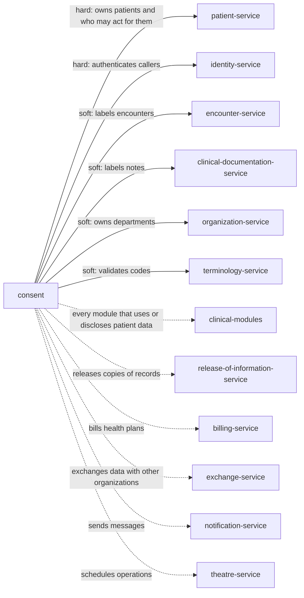

> Snapshot of healthcare/ehr/consent version 0.1.2, saved 2026-10-09. The current version is at https://knowledge-graph-ecru.vercel.app/docs/healthcare/ehr/consent.md.

# Consent (/docs/healthcare/ehr/consent)

## Module identity

- module: consent
- layer: healthcare > ehr
- based on: Consent (healthcare, /docs/healthcare/consent)
- version: 0.1.2
- status: draft

## How to read this spec

- This is the complete spec for this page, with every inherited item already merged in.
- If a behaviour is not listed here, it is unspecified. Do not assume or invent it. Ask, or record it as an open question.
- Ids such as BR-1, FR-2 and AC-3 are stable. Cite them in code, tests and commit messages.
- Items that start with "US only:" or "EU only:" apply only in that jurisdiction. Skip the ones for a jurisdiction your project doesn't operate in, or add ?jurisdiction=us or ?jurisdiction=eu to this URL to leave them out. Unmarked items apply everywhere.
- Tags such as [core] or [healthcare] show which layer an item comes from. "overrides X" means it replaces the item with the same id from layer X.

## Purpose & scope

Add what a hospital needs to the healthcare consent rules: consent before surgery, the medical staff's list of procedures that need written consent, and advance directive information when a patient is admitted.

**In scope**

- Informed consent in the chart before surgery
- The medical staff's list of procedures needing written consent
- Advance directive information at inpatient admission

**Out of scope**

- Scheduling operations and the surgical checklist. A Theatre module owns them and asks this module whether consent is on file.

## Overview

### Product perspective

Solid arrows are services this module calls; dotted arrows are services it notifies.

### Actors

| Actor | Description | Layer |
| --- | --- | --- |
| Registrar | Gives notices, records consents and authorizations at registration and admission. | healthcare |
| Clinician | Obtains informed consent for treatment and procedures, and records emergency use of restricted data. | healthcare |
| Privacy officer | Decides restriction requests and their termination, and reviews emergency uses. | healthcare |
| Patient | A patient, or a representative within their authority, using the portal or signing on paper. | healthcare |
| System | Other modules asking whether a use or disclosure is allowed. | healthcare |

### Assumptions and dependencies

**AS-H1** Each module that owns data labels it with sensitivity codes, such as substance use disorder or reproductive health. _[healthcare]_
  - Why: This module decides from labels; it can't know what a note or result is about.
**AS-H2** The Patients module records who may act for a patient, in what scope, and whether the patient is alive and a minor. _[healthcare]_
  - Why: Who may sign is decided from that record, not here.
**AS-H3** Modules ask before each use or disclosure that could need consent and state its purpose. _[healthcare]_
  - Why: A consent nobody checks protects no one.

## Functions

### Business rules

**BR-H1** Every consent is about one patient whose record is in use, is of a kind listed in consent_kinds, and names its legal basis. Each kind maps to a FHIR consent category. _[healthcare]_
  - Why: One record per decision, with its basis, is what lets every later disclosure be explained; FHIR R5 Consent models a decision with its category and regulatory basis.
**BR-H2** Consent to treatment is never used as permission to disclose, and permission to disclose is never used as consent to treatment. In the European Union, GDPR consent is recorded only for processing whose legal basis is consent, never for care itself. _[healthcare]_
  - Why: A HIPAA consent for treatment, payment and operations can't stand in for an authorization (45 CFR 164.506(b)(2)); in the EU, care data is processed under GDPR Article 9(2)(h), and calling it consent would let a withdrawal appear to stop care records.
**BR-H3** US only: In the United States, a HIPAA authorization is active only when it contains every core element: a specific description of the information, who may disclose it, who may receive it, each purpose (at the request of the individual is enough when the patient starts it), an expiration date or event, and the signature and date, with a representative's authority described. It must also state the right to revoke in writing and how, whether care can be conditioned on signing, and that disclosed information may be redisclosed, all in plain language. An authorization for marketing that a third party pays the organization for says so, and one for a sale of health information says the organization will be paid. A request missing any of them is refused, listing every missing one, and the patient gets a copy when the organization asked for the authorization. _[healthcare]_
  - Why: These are the core elements and required statements of a valid authorization (45 CFR 164.508(a)(3)(ii), (a)(4)(ii) and (c)(1) to (4)).
**BR-H4** US only: In the United States, a disclosure check never relies on an authorization that has expired, whose expiration event is known to have happened, that is incomplete, that is known to be revoked, that breaks the rules on combining or conditioning, or whose material information is known to be false. _[healthcare]_
  - Why: These are the defects that make an authorization invalid (45 CFR 164.508(b)(2)).
**BR-H5** US only: In the United States, an authorization for psychotherapy notes can be combined only with another for psychotherapy notes, and no authorization is combined with one that care was conditioned on, except research authorizations combined as the rules allow. Care, payment, enrollment or eligibility is never conditioned on signing an authorization, except research-related treatment, or care given only to create information for a third party. _[healthcare]_
  - Why: HIPAA limits compound authorizations and prohibits conditioning, with these exceptions (45 CFR 164.508(b)(3) and (4)).
**BR-H6** US only: In the United States, a Part 2 consent is active only with the patient's name; who may disclose; a specific description of the information; the recipients, which for a single consent for all future treatment, payment and operations can be described generally, and which name an intermediary and its participants; each purpose; the right to revoke in writing; an expiration date or event (end of the treatment or none is enough for treatment, payment and operations); the signature, of the minor or of a person authorized for a patient lacking capacity or deceased; the date; for treatment, payment and operations, the statements on redisclosure and on the consequences of refusing; when a recipient is a covered entity or business associate, the statement that it may redisclose as HIPAA allows except in proceedings against the patient; and, if the program will fundraise with the records, the patient's right to opt out of fundraising. _[healthcare]_
  - Why: These are the required elements of a Part 2 consent; electronic signatures are allowed where law doesn't forbid them, and the rules apply from 16 February 2026 (42 CFR 2.31(a); 89 FR 12472).
**BR-H7** US only: In the United States, a use or disclosure of SUD counseling notes needs its own consent, which can be combined only with another consent for SUD counseling notes and on which no care or payment is conditioned. _[healthcare]_
  - Why: Part 2 protects SUD counseling notes the way HIPAA protects psychotherapy notes (42 CFR 2.31(b)).
**BR-H8** US only: In the United States, a permitted disclosure of Part 2 records comes with the obligation to attach the statement 42 CFR 2.32 requires, and the answer says how the recipient may redisclose: a covered entity or business associate receiving under a consent for treatment, payment and operations may redisclose as HIPAA allows, except in proceedings against the patient. _[healthcare]_
  - Why: Every disclosure with consent must carry the Part 2 notice, and redisclosure follows the consent and HIPAA (42 CFR 2.32, 2.33).
**BR-H9** US only: In the United States, where state law lets a minor obtain SUD treatment alone, only the minor signs a Part 2 consent; where state law requires a parent's consent to treatment, both the minor and the parent or guardian sign. minor_consent_rules holds the state rules. _[healthcare]_
  - Why: Part 2 decides who signs for a minor from state law (42 CFR 2.14).
**BR-H10** A consent is signed by the patient, or by a representative acting within the scope the Patients module records, whose authority is described on the consent. Signatures are on paper or electronic as signature_methods allows; an electronic signature is accepted unless the law requires another form for that kind. _[healthcare]_
  - Why: A consent signed by someone without authority is invalid; electronic signatures have legal effect in the United States (15 U.S.C. 7001) and can't be refused in the EU only for being electronic (Regulation (EU) No 910/2014, Article 25).
**BR-H11** A patient, or a representative within their scope, can revoke a consent at any time. A HIPAA authorization or Part 2 consent is revoked in writing, which includes the portal; GDPR consent and EHDS opt-outs are withdrawn as easily as they were given. Revocation takes effect when received and stops future uses only: what was already done in reliance on it stands. The consent becomes inactive and is kept. _[healthcare]_
  - Why: HIPAA and Part 2 allow written revocation except for action already taken in reliance (45 CFR 164.508(b)(5); 42 CFR 2.31(a)(6)); GDPR requires withdrawal to be as easy as giving and not to affect earlier processing (Article 7(3)); EHDS opt-outs are reversible (Articles 10(1) and 71(1)).
**BR-H12** A consent with an expiration date becomes inactive at the end of that date in the time zone of the organization holding it, and consent.expired is emitted; one ending on an event becomes inactive when staff record the event. _[healthcare]_
  - Why: An expired authorization is invalid (45 CFR 164.508(b)(2)(i); 42 CFR 2.31(c)(1)); end dates are inclusive, as FHIR periods are.
**BR-H13** US only: In the United States, a patient can ask to restrict uses or disclosures for treatment, payment or operations, or disclosures to family and friends. The request names the services or encounters it covers. A privacy officer agrees or declines, except that a request not to tell a health plan about a service the patient paid for in full, for payment or operations and where no law requires it, must be agreed. An agreed restriction binds every disclosure check, including uses for treatment, payment and operations, except emergency treatment, disclosures required to HHS, the facility directory, and the public-interest disclosures of 45 CFR 164.512. _[healthcare]_
  - Why: Patients may request restrictions, the self-pay restriction must be agreed, and an agreed restriction doesn't block disclosures to HHS, the directory or the public-interest disclosures (45 CFR 164.522(a)(1)(i) to (vi)).
**BR-H14** US only: In the United States, an agreed restriction ends when the patient agrees in writing, or orally with that documented, or when the organization tells the patient it is ending it, which then applies only to information created or received after telling them and never to a self-pay restriction. _[healthcare]_
  - Why: These are the only ways to terminate a restriction (45 CFR 164.522(a)(2)).
**BR-H15** US only: In the United States, a patient can ask the organization not to share their electronic health information. The request is documented, applied the same way for every patient, and ended only as a restriction is (BR-H14). _[healthcare]_
  - Why: Honouring such a request isn't information blocking when these conditions are met (45 CFR 171.202(e)).
**BR-H16** US only: In the United States, when care_access_policy is set, disclosure checks withhold the reproductive health information it covers, labelled SEX, from the access, exchange or use it names, and nothing more. A patient's explicit request to share that information despite the risk, recorded as share_despite_risk, overrides it. The 2024 HIPAA attestation for reproductive health information is not applied, because a court vacated it. _[healthcare]_
  - Why: Withholding to reduce exposure to legal action isn't information blocking when tailored and based on a written policy, and the patient can nullify it (45 CFR 171.206(a) and (b)); the attestation in 45 CFR 164.509 was vacated nationwide in Purl v. HHS (N.D. Tex. 2025), and the appeal was dismissed on 10 September 2025.
**BR-H17** US only: In the United States, a patient is given the Notice of Privacy Practices by their first service, or as soon as practicable after emergency treatment, and is asked for a written acknowledgment; if it isn't obtained, the good-faith attempt and the reason are recorded. Patients of a Part 2 program are also told at admission, or when they regain capacity, that federal law protects their SUD records. _[healthcare]_
  - Why: Providers must give the notice and try to get an acknowledgment (45 CFR 164.520(c)(2)); Part 2 programs must give their notice at admission (42 CFR 2.22(a)).
**BR-H18** EU only: In the European Union, a patient gets privacy information when their data is collected from them. When it comes from someone else, such as a relative or emergency staff, they get it within privacy_information_deadline, at most one month, and in any case by the first contact with them or the first disclosure to another recipient, whichever is sooner. _[healthcare]_
  - Why: GDPR requires information at collection (Article 13) or, for data obtained elsewhere, within a reasonable period and at the latest one month, at first communication, or at first disclosure to another recipient (Article 14(3)).
**BR-H19** EU only: In the European Union, a GDPR consent is recorded with the exact text and version the patient agreed to, who agreed, when and how, is explicit for health data, is presented apart from other matters, and is never a condition of care. _[healthcare]_
  - Why: The controller must be able to show consent was given, and it must be distinguishable, explicit for special categories and freely given (GDPR Articles 7(1), 7(2), 7(4) and 9(2)(a)).
**BR-H20** EU only: In the European Union, a patient can restrict health professionals' access to all or parts of their data. They are told first that this may affect their care. Disclosure checks for health professionals then answer as if the restricted data weren't there, so the restriction itself is never visible to them, except access to protect the patient's vital interests, which is logged for the patient to see. _[healthcare]_
  - Why: EHDS gives the right to restrict access, requires the patient to be told of its effect, keeps the fact of a restriction hidden from providers, and allows vital-interest access that is logged (EHDS Articles 8 and 11(5)); these apply from 26 March 2029 (Article 105).
**BR-H21** EU only: In the European Union, where primary_use_opt_out says the member state provides it, a patient can opt out of access to their data through access services, and opt back in; vital-interest access follows the member state's rules. _[healthcare]_
  - Why: Member states may give this right, which must be reversible (EHDS Article 10).
**BR-H22** EU only: In the European Union, a patient can opt out of secondary use at any time without giving a reason, and opt back in. consent.opt_out_changed is emitted so their data is left out of datasets for permits approved after the opt-out; permits approved before it are unaffected, and so is any use member state law allows under Article 71(4). _[healthcare]_
  - Why: EHDS gives this reversible right, limits its effect to later permits, and lets member states make such data available under strict conditions (EHDS Article 71(1), (3) and (4)); Chapter IV applies from 26 March 2029 (Article 105).
**BR-H23** A disclosure check names the patient, the data (its sensitivity codes, categories or records), the purpose, the requester and the recipient, and gets permit or deny with its basis (the consents or the law relied on) and obligations, such as a notice to attach or a limit on redisclosure. A deny that applies wins over a permit, except where law requires the disclosure or a rule here names an override, such as emergency use. When a patient records a permit that conflicts with a deny they made themselves, they are asked whether to end the deny. A use the law allows without consent, such as treatment within the organization, is permitted with basis law, unless a narrower rule applies to that data. Every check and its answer is logged. _[healthcare]_
  - Why: Modules need one consistent answer instead of reading forms; the log shows what each disclosure relied on, for audits and the accounting of disclosures.
**BR-H24** Restricted data can be used or disclosed in an emergency: under an agreed restriction for emergency treatment, with a request that the receiving provider not redisclose it; for Part 2 records to medical personnel in a bona fide emergency, documented at once with the personnel and their facility, who disclosed, when and the nature of the emergency; and in the EU to protect vital interests, logged for the patient. Each is recorded as an emergency use and reviewed by a privacy officer. While break-the-glass access that the Identity and access module reported is active for a patient, a disclosure check from that user with purpose ETREAT is answered permit for restricted data, and the emergency use is recorded automatically. _[healthcare]_
  - Why: HIPAA, Part 2 and the EHDS each allow emergency use under these conditions (45 CFR 164.522(a)(1)(iii) and (iv); 42 CFR 2.51; EHDS Article 11(5)).
**BR-H25** Informed consent to a treatment or procedure records the procedure, the practitioner who obtained it, that risks, benefits and alternatives were discussed in a language the patient understands, and the signature where consent_required_procedures requires one. The patient can withdraw it until the procedure starts, or refuse it; a refusal is recorded with the risks of refusing that were explained, and consent.refused or consent.revoked tells the modules planning the procedure. In an emergency without consent, the clinician records why. _[healthcare]_
  - Why: Patients have the right to make informed decisions, including to refuse treatment (42 CFR 482.13(b)(2)); consent obtained in a language the patient doesn't understand isn't informed, and US providers must offer language assistance (45 CFR 92.201); which procedures need written consent is set by law and by the organization.
**BR-H26** Whether an adult patient has executed an advance directive is recorded, with its kind and document, at the moment advance_directive_information_at sets for the organization, after giving written information on their rights. Care is never conditioned on whether they have one, and the orders a directive leads to are the Orders module's. _[healthcare]_
  - Why: Providers must document in a prominent part of the record whether the patient has an advance directive and must not condition care on it (42 CFR 489.102(a)(2) and (a)(3)); when depends on the kind of provider (489.102(b)).
**BR-H27** A patient can opt out of a contact channel for a purpose, such as text reminders, by any reasonable means, including replying stop. The opt-out is honoured without delay and within contact_opt_out_deadline, and the Patients module is answered from it. _[healthcare]_
  - Why: In the United States, consent to calls and texts can be revoked by any reasonable means and must be honoured within ten business days (47 CFR 64.1200(a)(10)); a patient's choice of channel should be respected everywhere.
**BR-H28** When the Patients module merges two records, the consents of both move to the remaining record; where they conflict, the deny applies until a privacy officer reviews them. When it undoes a merge, consents recorded since are listed for review. When it records a death, consents stay in force until they end, and an estate representative can revoke them. When a representative's authority ends, consents they signed are listed for review and the patient is asked to confirm or revoke them. When it marks a record entered in error, its consents are listed for review. _[healthcare]_
  - Why: A consent must follow the right person; a conflict resolved toward deny protects the patient until a person decides; HIPAA protects a deceased person's information for 50 years and treats an executor as their personal representative (45 CFR 164.502(f) and (g)(4)).
**BR-H29** Consents, revocations, notices with their acknowledgments, emergency uses and checks are kept for six years from when they were created or last in effect, whichever is later, or for consent_retention if longer, and while a legal hold the Patients module reports applies. Erasure is refused until then. _[healthcare]_
  - Why: HIPAA requires documentation to be kept six years from creation or last effective date (45 CFR 164.530(j)(2)); GDPR Article 17(3)(b) and (e) exempt records needed for legal obligations and claims.
**BR-H30** A consent recorded on the wrong patient or twice is marked entered in error with a reason; it no longer counts in disclosure checks, and it is kept. _[healthcare]_
  - Why: Deleting it would leave earlier disclosures unexplained; FHIR marks such a consent entered-in-error.
**BR-H31** When this module can't be reached, modules allow use for treatment inside the organization of data whose treatment use needs no consent, and deny every other use and disclosure until it answers. _[healthcare]_
  - Why: Blocking care because a consent service is down harms the patient, while a disclosure outside the organization can't be undone.
**BR-H32** Every change sends the revision it read; a stale revision fails. _[healthcare]_
  - Why: Two staff recording on one consent must not overwrite each other.
**BR-H33** US only: In the United States, the law allows less without consent for three kinds of data. Psychotherapy notes are used without an authorization only by their author for treatment, for the organization's supervised training, to defend it in a legal action the patient brings, and for disclosures HIPAA requires or permits for them, such as to HHS, for oversight of the author, to a coroner or to avert a serious threat. SUD counseling notes follow the same pattern under Part 2. Other Part 2 records pass without consent only between staff of the Part 2 program, or of an entity with direct administrative control over it, who need them for diagnosis, treatment or referral, and under the other Part 2 exceptions, such as a medical emergency. _[healthcare]_
  - Why: HIPAA and Part 2 require consent for these records even for treatment, with these exceptions (45 CFR 164.508(a)(2); 42 CFR 2.31(b), 2.12(c)(3), 2.51).
**BR-H34** EU only: In the European Union, when a GDPR consent is given through the portal or another online service by a child under gdpr_child_consent_age, a holder of parental responsibility gives or authorises it, and the organization makes reasonable efforts to check that they did. _[healthcare]_
  - Why: For online services offered directly to a child, consent below 16, or the lower age a member state sets (not below 13), must come from a holder of parental responsibility (GDPR Article 8).
**BR-H35** US only: In the United States, a disclosure to a family member, friend or other person the patient identified, for their involvement in the patient's care or its payment, asks the Patients module whether that person is involved and whether the patient objected. It is permitted only for information directly relevant to that involvement: when the patient is present and agreed or didn't object, or, when the patient is absent, incapacitated or in an emergency, when a clinician judges it in their best interest and records that judgment. _[healthcare]_
  - Why: HIPAA allows these disclosures without an authorization only on these conditions (45 CFR 164.510(b)(1) to (3)), and an agreed restriction on them binds (BR-H13).
**BR-E1** US only: In the United States, an operation doesn't start until a properly executed informed consent for it is in the patient's record, except in an emergency, where the clinician records why there was none. _[ehr]_
  - Why: Hospitals must have a properly executed informed consent form for the operation in the chart before surgery, except in emergencies (42 CFR 482.51(b)(2)).
**BR-E2** US only: In the United States, the procedures and treatments that need written consent are those the medical staff specify, or federal or state law requires, and each one's properly executed form is kept in the record. _[ehr]_
  - Why: The medical record must contain properly executed informed consent forms for procedures and treatments the medical staff, or law, specify (42 CFR 482.24(c)(4)(v)).
**BR-E3** US only: In the United States, an adult admitted as an inpatient is given advance directive information at admission, and whether they have executed one is recorded. _[ehr]_
  - Why: Hospitals furnish the information at the time of inpatient admission (42 CFR 489.102(b)(1)).

### State machine

Initial state: `draft` or `active`. States: `draft`, `active`, `inactive`, `not-done`, `entered-in-error`. _[healthcare]_
Any transition not listed below is invalid.

| From | To | Trigger | Guard |
| --- | --- | --- | --- |
| draft | active | complete and signed, or a restriction request agreed (BR-H3, BR-H6, BR-H13) | - |
| draft | not-done | the patient refuses, or a restriction request is declined (BR-H13) | - |
| active | inactive | revoked, expired or a restriction terminated (BR-H11, BR-H12, BR-H14) | - |
| draft | entered-in-error | recorded by mistake (BR-H30) | - |
| active | entered-in-error | recorded by mistake (BR-H30) | - |
| inactive | entered-in-error | recorded by mistake (BR-H30) | - |

### Workflows

#### Sign an authorization _[healthcare]_
Actor: Registrar
Trigger: A patient asks for records to be sent to someone, or the organization asks for an authorization

1. Start a draft with the information, recipient, purpose and expiry
2. The service lists any missing element
3. The patient, or their representative, signs on paper or in the portal
4. The patient gets a copy

Outcome: An active authorization disclosure checks can rely on.

#### Revoke a consent _[healthcare]_
Actor: Patient
Trigger: The patient asks to revoke

1. The patient revokes in the portal or in writing
2. The consent becomes inactive from that moment
3. consent.revoked is emitted

Outcome: No new use or disclosure relies on it; earlier ones stand.

#### Decide a restriction request _[healthcare]_
Actor: Privacy officer
Trigger: A patient asks to restrict a use or disclosure

1. Record the request as a draft restriction
2. Agree or decline; a self-pay request to a health plan is always agreed
3. Tell the patient, and Billing for a self-pay restriction

Outcome: Disclosure checks honour every agreed restriction.

#### Check a disclosure _[healthcare]_
Actor: System
Trigger: A module is about to use or disclose data

1. Send the patient, data labels, purpose, requester and recipient
2. Get permit or deny with basis and obligations
3. Apply the obligations, such as attaching the Part 2 statement

Outcome: Every use and disclosure is backed by a logged answer.

#### Give the privacy notice _[healthcare]_
Actor: Registrar
Trigger: A patient's first service, or patient.registered with an informant in the EU

1. Give the current notice or privacy information
2. Ask for a written acknowledgment, or record the attempt and the reason

Outcome: Every patient has been given the notice, provably.

#### Use restricted data in an emergency _[healthcare]_
Actor: Clinician
Trigger: A patient needs emergency treatment and restricted data is needed

1. Use or disclose only what the emergency needs
2. Record the emergency use with the personnel, time and nature of the emergency
3. A privacy officer reviews it

Outcome: Care isn't blocked, and the exception is documented.

### Validations

| Field | Rule | Error | Layer |
| --- | --- | --- | --- |
| consent.patient_id | A patient record in use, as the Patients module answers | CONSENT_INVALID_PATIENT | healthcare |
| consent.kind | A kind listed in consent_kinds for this jurisdiction | CONSENT_INVALID_KIND | healthcare |
| consent.provisions | Every element the kind requires is present; every missing element is listed | CONSENT_INCOMPLETE | healthcare |
| consent.provisions | Purposes, actions and sensitivity labels are valid codes | CONSENT_INVALID_CODE | healthcare |
| consent.document | Not combined with another authorization or consent where the law forbids it | CONSENT_COMPOUND_NOT_ALLOWED | healthcare |
| consent.conditioned | True only under an exception the law allows | CONSENT_CONDITIONING_NOT_ALLOWED | healthcare |
| consent.signatures | Each signer is the patient or a representative within their scope, or the persons the law requires for a minor | CONSENT_SIGNER_NOT_AUTHORIZED | healthcare |
| consent.revocation | For a HIPAA authorization or Part 2 consent, written evidence of the revocation | CONSENT_REVOCATION_EVIDENCE_REQUIRED | healthcare |
| consent.status | Fields the service sets, such as status and revision, can't be written by clients | CONSENT_READ_ONLY_FIELD | healthcare |

### Edge cases

**EC-H1** A patient revokes an authorization an hour after records were sent. _[healthcare]_
  - Required behaviour: The sending stands; nothing further is sent under it.
  - Covered by: BR-H11, AC-H11
**EC-H2** US only: A teenager in a state that lets minors obtain SUD treatment alone asks that their parents not be told. _[healthcare]_
  - Required behaviour: Only the minor can sign a Part 2 consent, so a disclosure to the parents is denied without it.
  - Covered by: BR-H9, AC-H9
**EC-H3** US only: A patient paid cash for an HIV test and doesn't want the insurer to know. _[healthcare]_
  - Required behaviour: The self-pay restriction must be agreed, Billing is told, and the organization can't end it.
  - Covered by: BR-H13, BR-H14, AC-H13
**EC-H4** EU only: An EU patient restricted their mental health notes, then arrives unconscious. _[healthcare]_
  - Required behaviour: The emergency team can reach what vital interests need, which is logged for the patient; otherwise the notes stay invisible.
  - Covered by: BR-H20, BR-H24, AC-H20
**EC-H5** Two duplicate records are merged; one had permission to share with a daughter and the other a restriction against it. _[healthcare]_
  - Required behaviour: Deny applies until a privacy officer reviews both.
  - Covered by: BR-H28, AC-H28
**EC-H6** A parent signed an authorization for their child, who then turns 18. _[healthcare]_
  - Required behaviour: It is listed for review, and the now-adult patient is asked to confirm or revoke it.
  - Covered by: BR-H28
**EC-H7** A patient replies "please don't text me anymore" instead of stop. _[healthcare]_
  - Required behaviour: A reasonable person would read it as an opt-out, so it is recorded as one.
  - Covered by: BR-H27, AC-H27
**EC-H8** The consent service is down during a night shift. _[healthcare]_
  - Required behaviour: Care inside the organization continues; disclosures outside wait.
  - Covered by: BR-H31, AC-H31
**EC-H9** A patient dies and their executor asks to revoke an authorization for research. _[healthcare]_
  - Required behaviour: The executor can revoke it as the patient's estate representative.
  - Covered by: BR-H28, BR-H10
**EC-H10** A form version changes while a patient is halfway through signing in the portal. _[healthcare]_
  - Required behaviour: They sign the version they were shown, which is stored unaltered with the consent.
  - Covered by: CON-H2, FR-H1
**EC-H11** A patient opts out of text reminders but still wants phone calls. _[healthcare]_
  - Required behaviour: The opt-out covers only the channel and purpose chosen.
  - Covered by: BR-H27
**EC-H12** An authorization ends "at the end of my treatment" and the treatment ends. _[healthcare]_
  - Required behaviour: Staff record the event, and the authorization becomes inactive.
  - Covered by: BR-H12
**EC-H13** US only: A psychiatrist's psychotherapy notes are requested by the patient's new therapist. _[healthcare]_
  - Required behaviour: Without a specific authorization the request is denied; the patient's own access doesn't include them, but ordinary notes do.
  - Covered by: BR-H33, AC-H37
**EC-E1** US only: A patient signed consent for a left knee replacement and is scheduled for the right. _[ehr]_
  - Required behaviour: No consent for the right knee is on file, so the operation waits until one is.
  - Covered by: BR-E1, AC-E1

## Data

### Data model

| Field | Type | Required | Description | Constraints | Layer |
| --- | --- | --- | --- | --- | --- |
| consent.id | string | yes | The consent id. Never changes or is reused. | set by the service | healthcare |
| consent.patient_id | string | yes | The patient it is about, owned by the Patients module. | - | healthcare |
| consent.kind | enum | yes | What it is, from consent_kinds. | treatment \| procedure \| hipaa_authorization \| part2_consent \| sud_counseling_notes \| restriction \| do_not_share \| share_despite_risk \| gdpr_consent \| ehds_restriction \| ehds_primary_opt_out \| ehds_secondary_opt_out \| contact_opt_out \| advance_directive; codes: none standard, local to this specification; each kind maps to a FHIR consent category, such as acd, dnr, polst, npp or research, and to a regulatory basis | healthcare |
| consent.status | enum | yes | Where it is in its lifecycle. | draft \| active \| inactive \| not-done \| entered-in-error; codes: FHIR R5 consent-state-codes | healthcare |
| consent.decision | enum | yes | Whether it permits or denies what its provisions describe. | permit \| deny; codes: FHIR R5 consent-provision-type | healthcare |
| consent.provisions | provision[] | yes | What it covers: the data (sensitivity codes, categories or specific records), purposes, actions, who may disclose, recipients, and a period; provisions can nest, for exceptions. | codes: purpose from HL7 v3 PurposeOfUse, such as TREAT, ETREAT, HPAYMT, HOPERAT, PATRQT; data labels from HL7 v3 ActCode sensitivity, such as SUD, PSY, HIV, SDV, SEX | healthcare |
| consent.period | period | no | When it takes effect and when it expires, or the event that ends it, such as end of treatment. | - | healthcare |
| consent.signatures | signature[] | no | Who signed, as patient or as a representative with a description of their authority, how (on paper or electronically), when, and any witness or interpreter. | - | healthcare |
| consent.document | attachment | no | The signed form or the text the patient agreed to, kept unaltered, with the version of the form. | - | healthcare |
| consent.statements | code[] | no | The required statements the form contained, such as the right to revoke and the risk of redisclosure. | codes: none standard, local to this specification | healthcare |
| consent.conditioned | boolean | no | Whether care or payment was made conditional on signing, and under which exception. | - | healthcare |
| consent.request_decision | decision | no | For a restriction request: agreed or declined, by whom, when and why. | - | healthcare |
| consent.revocation | revocation | no | When the revocation was received, how, by whom, its written evidence, and what was already done in reliance. | - | healthcare |
| consent.procedure | code | no | For informed consent: the treatment or procedure, the practitioner who obtained it, and that risks, benefits and alternatives were discussed. | - | healthcare |
| consent.channel | code | no | For a contact opt-out: the channel and purpose, such as text messages for appointment reminders. | codes: FHIR ContactPointSystem for the channel | healthcare |
| consent.status_reason | text | no | Why it was refused, expired, revoked or marked entered in error. | - | healthcare |
| consent.revision | integer | yes | Goes up with every change. | set by the service | healthcare |
| notice.id | string | yes | The notice delivery id. | set by the service | healthcare |
| notice.kind | enum | yes | Which notice. | npp \| part2_notice \| privacy_information; codes: none standard, local to this specification | healthcare |
| notice.version | string | yes | Which version of the notice was given. | - | healthcare |
| notice.given_at | instant | no | When it was given, and how. | - | healthcare |
| notice.acknowledgment | acknowledgment | no | The written acknowledgment, or the good-faith attempt and why it wasn't obtained. | - | healthcare |
| notice.due_by | instant | no | When it must be given by. | - | healthcare |
| emergency_use.id | string | yes | The emergency use id. | set by the service | healthcare |
| emergency_use.details | emergency use | yes | The patient, the restricted data used or disclosed, the medical personnel and their facility, who disclosed it, when, the nature of the emergency, and the request not to redisclose. | - | healthcare |
| check.id | string | yes | The disclosure check id, with who asked, the data, purpose, recipient, the answer, its basis and when. | set by the service | healthcare |

### Relationships

| Edge | Target | Note | Layer |
| --- | --- | --- | --- |
| belongs_to | patient | 1: consent.patient_id, owned by the Patients module (FHIR Consent.subject 0..1, required here) | healthcare |
| has_many | provision | 1..*: what a consent covers, nesting for exceptions (FHIR Consent.provision 0..*) | healthcare |
| has_many | signature | 0..*: patient and representative signatures (FHIR Consent.grantor and verification) | healthcare |
| has_many | notice | 0..*: notices given to a patient, each with its acknowledgment | healthcare |
| has_many | emergency use | 0..*: emergency uses of a patient's restricted data | healthcare |
| has_many | check | 0..*: disclosure checks about a patient, each naming the consents it relied on | healthcare |
| can_trigger | event:consent.revoked | - | healthcare |

## External interfaces

### API

#### Record a consent: `POST /consents` _[healthcare]_
Record a consent, authorization, restriction request, opt-out or advance directive, as a draft or, when complete and signed, active. Accepts a retry key.
- Success: 201
- Actor: Registrar
- Input: patient, kind, decision, provisions, period, signatures, document, statements and conditioned
- Result: the consent, with any missing elements listed
- Errors: CONSENT_INVALID_PATIENT, CONSENT_INVALID_KIND, CONSENT_INCOMPLETE, CONSENT_INVALID_CODE, CONSENT_COMPOUND_NOT_ALLOWED, CONSENT_CONDITIONING_NOT_ALLOWED, CONSENT_SIGNER_NOT_AUTHORIZED, CONSENT_READ_ONLY_FIELD, CONSENT_IDEMPOTENCY_KEY_REUSED, CONSENT_FORBIDDEN, CONSENT_DEPENDENCY_UNAVAILABLE

#### Get a consent: `GET /consents/{id}` _[healthcare]_
A consent with its provisions, signatures, document and history.
- Success: 200
- Actor: Registrar
- Input: consent id
- Result: the consent
- Errors: CONSENT_NOT_FOUND, CONSENT_FORBIDDEN

#### Search consents: `GET /consents` _[healthcare]_
A patient's consents by kind and status.
- Success: 200
- Actor: Registrar
- Input: patient, kind, status, limit and cursor
- Result: consents and next_cursor
- Errors: CONSENT_FORBIDDEN

#### Change a draft: `PATCH /consents/{id}` _[healthcare]_
Change a draft consent before it is signed.
- Success: 200
- Actor: Registrar
- Input: the fields to change and revision
- Result: the consent
- Errors: CONSENT_NOT_FOUND, CONSENT_INVALID_STATUS, CONSENT_INCOMPLETE, CONSENT_INVALID_CODE, CONSENT_READ_ONLY_FIELD, CONSENT_REVISION_CONFLICT, CONSENT_FORBIDDEN

#### Sign a consent: `POST /consents/{id}/signatures` _[healthcare]_
Add a signature; a complete consent becomes active and consent.activated is emitted.
- Success: 200
- Actor: Patient
- Input: signer, their role and authority, method, and revision
- Result: the consent
- Errors: CONSENT_NOT_FOUND, CONSENT_INVALID_STATUS, CONSENT_INCOMPLETE, CONSENT_SIGNER_NOT_AUTHORIZED, CONSENT_REVISION_CONFLICT, CONSENT_FORBIDDEN, CONSENT_DEPENDENCY_UNAVAILABLE

#### Revoke a consent: `POST /consents/{id}/revocation` _[healthcare]_
Revoke an active consent from the moment the revocation is received.
- Success: 200
- Actor: Patient
- Input: who revokes, how, written evidence where required, and revision
- Result: the inactive consent
- Errors: CONSENT_NOT_FOUND, CONSENT_INVALID_STATUS, CONSENT_SIGNER_NOT_AUTHORIZED, CONSENT_REVOCATION_EVIDENCE_REQUIRED, CONSENT_REVISION_CONFLICT, CONSENT_FORBIDDEN

#### Record a refusal: `POST /consents/{id}/refusal` _[healthcare]_
Record that the patient refused a draft consent.
- Success: 200
- Actor: Registrar
- Input: reason and revision
- Result: the consent, not-done
- Errors: CONSENT_NOT_FOUND, CONSENT_INVALID_STATUS, CONSENT_REASON_REQUIRED, CONSENT_REVISION_CONFLICT, CONSENT_FORBIDDEN

#### Record an expiry event: `POST /consents/{id}/expiry` _[healthcare]_
Record that the event a consent ends on has happened, such as the end of treatment; the consent becomes inactive and consent.expired is emitted.
- Success: 200
- Actor: Registrar
- Input: the event, when it happened, and revision
- Result: the inactive consent
- Errors: CONSENT_NOT_FOUND, CONSENT_INVALID_STATUS, CONSENT_REASON_REQUIRED, CONSENT_REVISION_CONFLICT, CONSENT_FORBIDDEN

#### Mark entered in error: `POST /consents/{id}/entered-in-error` _[healthcare]_
Mark a consent recorded on the wrong patient or twice.
- Success: 200
- Actor: Registrar
- Input: reason and revision
- Result: the consent
- Errors: CONSENT_NOT_FOUND, CONSENT_INVALID_STATUS, CONSENT_REASON_REQUIRED, CONSENT_REVISION_CONFLICT, CONSENT_FORBIDDEN

#### Resolve a review: `POST /consents/{id}/review` _[healthcare]_
Resolve a consent listed for review after a merge, an unmerge, a record entered in error or a representative's authority ending: keep it, move it to the right record, or mark it entered in error.
- Success: 200
- Actor: Privacy officer
- Input: outcome, reason and revision
- Result: the consent
- Errors: CONSENT_NOT_FOUND, CONSENT_INVALID_STATUS, CONSENT_REASON_REQUIRED, CONSENT_REVISION_CONFLICT, CONSENT_FORBIDDEN

#### Decide a restriction request: `POST /consents/{id}/decision` _[healthcare]_
US only: Agree to or decline a restriction request.
- Success: 200
- Actor: Privacy officer
- Input: agreed or declined, reason and revision
- Result: the consent
- Errors: CONSENT_NOT_FOUND, CONSENT_INVALID_STATUS, CONSENT_RESTRICTION_REQUIRED, CONSENT_REASON_REQUIRED, CONSENT_REVISION_CONFLICT, CONSENT_FORBIDDEN

#### Terminate a restriction: `POST /consents/{id}/termination` _[healthcare]_
US only: End an agreed restriction, as BR-H14 allows.
- Success: 200
- Actor: Privacy officer
- Input: how it ends (patient's written or documented oral agreement, or notice to the patient), and revision
- Result: the consent
- Errors: CONSENT_NOT_FOUND, CONSENT_INVALID_STATUS, CONSENT_TERMINATION_NOT_ALLOWED, CONSENT_REASON_REQUIRED, CONSENT_REVISION_CONFLICT, CONSENT_FORBIDDEN

#### Check a use or disclosure: `POST /disclosure-checks` _[healthcare]_
Answer whether a use or disclosure is allowed, with its basis and obligations, and log the answer.
- Success: 200
- Actor: System
- Input: patient, data labels, categories or records, purpose, requester and recipient
- Result: permit or deny, basis, obligations and the check id
- Errors: CONSENT_INVALID_PATIENT, CONSENT_INVALID_CODE, CONSENT_FORBIDDEN, CONSENT_DEPENDENCY_UNAVAILABLE

#### Record an emergency use: `POST /emergency-uses` _[healthcare]_
Record that restricted data was used or disclosed in an emergency.
- Success: 201
- Actor: Clinician
- Input: patient, data, personnel and facility, nature of the emergency, and the request not to redisclose
- Result: the emergency use
- Errors: CONSENT_INVALID_PATIENT, CONSENT_REASON_REQUIRED, CONSENT_FORBIDDEN

#### Review an emergency use: `POST /emergency-uses/{id}/review` _[healthcare]_
Record whether an emergency use of restricted data was justified.
- Success: 200
- Actor: Privacy officer
- Input: justified or not, and notes
- Result: the reviewed emergency use
- Errors: CONSENT_NOT_FOUND, CONSENT_INVALID_STATUS, CONSENT_FORBIDDEN

#### List notices: `GET /patients/{patient_id}/notices` _[healthcare]_
Notices given to or owed to a patient.
- Success: 200
- Actor: Registrar
- Input: patient
- Result: notices with due dates and acknowledgments
- Errors: CONSENT_INVALID_PATIENT, CONSENT_FORBIDDEN

#### Record a notice acknowledgment: `POST /notices/{id}/acknowledgment` _[healthcare]_
Record a notice as given, with the acknowledgment or the good-faith attempt and why it wasn't obtained.
- Success: 200
- Actor: Registrar
- Input: given_at, how, and acknowledgment or attempt with reason
- Result: the notice
- Errors: CONSENT_NOT_FOUND, CONSENT_INVALID_STATUS, CONSENT_REASON_REQUIRED, CONSENT_FORBIDDEN

#### List contact opt-outs: `GET /patients/{patient_id}/contact-opt-outs` _[healthcare]_
The channels and purposes a patient opted out of.
- Success: 200
- Actor: System
- Input: patient
- Result: opt-outs with channel, purpose and when
- Errors: CONSENT_INVALID_PATIENT, CONSENT_FORBIDDEN

#### Get a consent summary: `GET /patients/{patient_id}/consent-summary` _[healthcare]_
What a clinician needs at the point of care: whether an advance directive is on file and its document, and the informed consents for upcoming procedures. Restrictions a patient made under EHDS Article 8 are never shown.
- Success: 200
- Actor: Clinician
- Input: patient
- Result: the summary
- Errors: CONSENT_INVALID_PATIENT, CONSENT_FORBIDDEN

### API conventions

| Topic | Convention | Reference | Layer |
| --- | --- | --- | --- |
| Authentication | Callers authenticate through the Identity and access module and every operation checks the permission in the access matrix. | - | healthcare |
| Errors | Errors use problem details (application/problem+json) with a code member, such as CONSENT_INCOMPLETE; a validation error lists every failing field. | RFC 9457 | healthcare |
| Pagination | Lists are cursor-based: limit and an optional cursor in, next_cursor out. | - | healthcare |
| Concurrency | Every change sends the revision it read; a stale revision fails with CONSENT_REVISION_CONFLICT (BR-H32). | - | healthcare |
| Retries | Every create accepts an Idempotency-Key header. | IETF draft-ietf-httpapi-idempotency-key-header | healthcare |
| Dates | Dates are ISO 8601 calendar dates, read as the local date where care is given, never a date converted to UTC. | ISO 8601 | healthcare |
| Times | Instants are RFC 3339 timestamps with an offset, stored in UTC; time zones are IANA names. | RFC 3339 | healthcare |
| Personal data in URLs | Names, birth dates and identifiers are sent in request bodies or query parameters over TLS, never in paths, and are never written to request logs. | - | healthcare |
| Rate limits | A caller over its limit gets 429 Too Many Requests with a Retry-After header. | RFC 6585, RFC 9110 | healthcare |
| Versioning | Additive changes don't change the version. A breaking change ships as a new major version with Deprecation and Sunset headers. | RFC 9745, RFC 8594 | healthcare |
| FHIR | Consents are exchanged as FHIR R5 Consent resources, with status, decision, provisions, grantor and verification. | HL7 FHIR R5 Consent | healthcare |

### Events

| Event | Description | Payload | Layer |
| --- | --- | --- | --- |
| consent.activated | A consent became active. | consent_id, patient_id, kind, decision, revision | healthcare |
| consent.revoked | A consent was revoked. | consent_id, patient_id, kind, revision | healthcare |
| consent.expired | A consent reached its expiry. | consent_id, patient_id, kind, revision | healthcare |
| consent.refused | The patient refused, or a restriction request was declined. | consent_id, patient_id, kind, revision | healthcare |
| consent.entered_in_error | A consent was marked entered in error. | consent_id, patient_id, kind, revision | healthcare |
| consent.restriction_decided | US only: A restriction request was agreed or declined, or a restriction terminated. | consent_id, patient_id, decision, encounter_ids, self_pay, revision | healthcare |
| consent.notice_due | A notice is owed to a patient. | notice_id, patient_id, kind, due_by | healthcare |
| consent.emergency_use_recorded | Restricted data was used or disclosed in an emergency. | emergency_use_id, patient_id, used_at | healthcare |
| consent.opt_out_changed | A patient opted out of, or back into, a contact channel or, in the EU, primary or secondary use. | consent_id, patient_id, kind, opted_out, revision | healthcare |
| consent.review_needed | Consents need a person to check them after a merge, an unmerge, a record entered in error or a representative's authority ending. | patient_id, consent_ids, reason | healthcare |

### Event delivery

**DG-H1** Events are published at least once; consumers drop one with a source and id they have seen. _[healthcare]_
  - Why: A relay can publish twice after a crash.
**DG-H2** Events about one consent can arrive out of order; each carries its revision, and consumers ignore a lower one. Notice, emergency use and review events carry their time instead. _[healthcare]_
  - Why: A revoked consent overtaken by an older activation would let a disclosure through.
**DG-H3** Events carry ids, kinds and decisions, never the consent document, its provisions or the data it covers. _[healthcare]_
  - Why: A Part 2 consent shows that a patient is in SUD treatment; events fan out widely.

### Errors

| Code | HTTP | Meaning | Layer |
| --- | --- | --- | --- |
| CONSENT_NOT_FOUND | 404 | No consent, notice or emergency use exists with that id. | healthcare |
| CONSENT_FORBIDDEN | 403 | Your role doesn't allow this. | healthcare |
| CONSENT_INVALID_PATIENT | 422 | That patient record doesn't exist or isn't in use. | healthcare |
| CONSENT_INVALID_KIND | 422 | That kind of consent isn't used here. | healthcare |
| CONSENT_INCOMPLETE | 422 | Required elements are missing; each is listed. | healthcare |
| CONSENT_INVALID_CODE | 422 | A purpose, action or label isn't a valid code. | healthcare |
| CONSENT_COMPOUND_NOT_ALLOWED | 422 | This authorization or consent can't be combined with the other one. | healthcare |
| CONSENT_CONDITIONING_NOT_ALLOWED | 422 | Care or payment can't be made conditional on this. | healthcare |
| CONSENT_SIGNER_NOT_AUTHORIZED | 422 | This person can't sign or revoke for the patient. | healthcare |
| CONSENT_REVOCATION_EVIDENCE_REQUIRED | 422 | This revocation must be in writing. | healthcare |
| CONSENT_RESTRICTION_REQUIRED | 409 | A self-pay restriction to a health plan must be agreed. | healthcare |
| CONSENT_TERMINATION_NOT_ALLOWED | 409 | This restriction can't be ended that way. | healthcare |
| CONSENT_INVALID_STATUS | 409 | The consent or notice isn't in a status that allows this. | healthcare |
| CONSENT_REASON_REQUIRED | 422 | This needs a reason. | healthcare |
| CONSENT_READ_ONLY_FIELD | 422 | That field is set by the service. | healthcare |
| CONSENT_REVISION_CONFLICT | 409 | It changed since you read it. Read it again. | healthcare |
| CONSENT_IDEMPOTENCY_KEY_REUSED | 422 | That retry key was used with a different request. | healthcare |
| CONSENT_DEPENDENCY_UNAVAILABLE | 503 | The Patients module can't be reached. Try again. | healthcare |

### Dependencies

Each dependency lists its contract: only what this module needs from it (upstream) or gives it (downstream). How the other module works is out of scope.

| Service | Direction | Criticality | Reason | Contract | Layer |
| --- | --- | --- | --- | --- | --- |
| patient-service | upstream | hard | owns patients and who may act for them | Asks: is this patient record in use, is the patient alive, and how old are they?; Asks: may this person act for this patient, with which scope?; Asks: is this person involved in the patient's care or payment, and has the patient objected to sharing with them?; Asks: is this patient under legal hold?; Receives: patient.registered (with informant), patient.merged, patient.unmerged, patient.deceased, patient.representative_changed and patient.entered_in_error; Answers: has the patient opted out of this contact channel? | healthcare |
| identity-service | upstream | hard | authenticates callers | Asks: who is the caller, and do they hold this permission?; Receives: identity.break_glass_used, so emergency access to restricted data is recorded as an emergency use | healthcare |
| encounter-service | upstream | soft | labels encounters | Asks: the sensitivity codes of an encounter; Gives: consent.restriction_decided with the encounters a self-pay restriction covers, so Encounters marks them | healthcare |
| clinical-documentation-service | upstream | soft | labels notes | Asks: the sensitivity codes of a note, and whether it is kept apart from the record | healthcare |
| organization-service | upstream | soft | owns departments | Asks: which departments are Part 2 programs?; Departments are Organization's concern | healthcare |
| terminology-service | upstream | soft | validates codes | Asks: is this purpose, action or sensitivity code valid? | healthcare |
| clinical-modules | downstream | hard | every module that uses or discloses patient data | Answers: may this data be used or disclosed, for this purpose, to this recipient, with which obligations?; Gives: consent.activated, consent.revoked, consent.expired, consent.refused and consent.entered_in_error; What each module does with an answer is its own concern | healthcare |
| release-of-information-service | downstream | soft | releases copies of records | Answers: disclosure checks, with the 42 CFR 2.32 statement to attach when Part 2 records go out; Gives: consent.emergency_use_recorded, for the accounting of disclosures | healthcare |
| billing-service | downstream | soft | bills health plans | Gives: consent.restriction_decided, so services under a self-pay restriction aren't billed to the health plan | healthcare |
| exchange-service | downstream | soft | exchanges data with other organizations | Gives: consent.opt_out_changed and requests not to share, so exchange and secondary use honour them | healthcare |
| notification-service | downstream | soft | sends messages | Gives: consent.notice_due, so notices are delivered; Gives: consent.review_needed, for privacy officers; Gives: a copy of each signed authorization for the patient | healthcare |
| theatre-service | downstream | soft | schedules operations | Answers: is a properly executed informed consent for this operation, on this patient, on file?; Gives: consent.revoked and consent.refused, so an operation whose consent was withdrawn or refused doesn't start | ehr |

## Security

### Permission matrix

| Action | Registrar | Clinician | Privacy officer | Patient | System | Permission | Layer |
| --- | --- | --- | --- | --- | --- | --- | --- |
| Record, change, refuse or mark a consent; record a notice acknowledgment | any | any | any | none | none | consent.record | healthcare |
| Read consents, notices and the consent summary | any | any | any | own | none | consent.read | healthcare |
| Sign, revoke or opt out | none | none | none | own | none | consent.self | healthcare |
| Request a restriction, ask not to share, give or refuse a GDPR consent, or record share_despite_risk, in the portal | none | none | none | own | none | consent.self | healthcare |
| Decide or terminate a restriction; resolve a review; review an emergency use | none | none | any | none | none | consent.decide | healthcare |
| Check a use or disclosure; list contact opt-outs | none | none | none | none | any | consent.check | healthcare |
| Record an emergency use | none | any | any | none | none | consent.emergency | healthcare |

any: every appointment. own: appointments the actor takes part in. none: not allowed.

- Record, change, refuse or mark a consent; record a notice acknowledgment: Clinicians record informed consent and advance directives.

- Sign, revoke or opt out: Staff record a paper signature or revocation on the patient's behalf with consent.record.

- Request a restriction, ask not to share, give or refuse a GDPR consent, or record share_despite_risk, in the portal: Uses Record a consent; staff record the same requests made on paper with consent.record.

### Permissions

| Permission | Grants | Layer |
| --- | --- | --- |
| consent.read | Read a patient's consents and notices. | healthcare |
| consent.record | Record, change, refuse and mark consents and notices. | healthcare |
| consent.decide | Decide and terminate restriction requests, and review emergency uses. | healthcare |
| consent.self | Read, sign and revoke your own consents, and opt out. | healthcare |
| consent.check | Ask whether a use or disclosure is allowed. | healthcare |
| consent.emergency | Record an emergency use of restricted data. | healthcare |

### Privacy and retention

| Field | Category | Purpose | Retention | Layer |
| --- | --- | --- | --- | --- |
| consent.patient_id, consent.kind, consent.status, consent.decision, consent.provisions, consent.period, consent.statements, consent.conditioned, consent.request_decision, consent.status_reason, consent.revision | health data; a Part 2 consent reveals SUD treatment | Showing what the patient agreed to and deciding uses and disclosures | consent_retention | healthcare |
| consent.signatures, consent.document, consent.revocation | personal and health data, with signatures | Proving the consent and its revocation were valid | consent_retention | healthcare |
| consent.procedure, consent.channel | health data | Informed consent to care, and the patient's contact choices | consent_retention | healthcare |
| notice.id, notice.kind, notice.version, notice.given_at, notice.acknowledgment, notice.due_by | personal | Proving notices were given | consent_retention | healthcare |
| emergency_use.id, emergency_use.details | health data | Documenting emergency use of restricted data | consent_retention | healthcare |
| consent.id, check.id | health data; names the patient, data and recipient | Showing what each use or disclosure relied on | consent_retention | healthcare |

### Compliance

**CMP-H1** HIPAA Privacy Rule, 45 CFR 164.508: US only: Valid authorizations with core elements and statements, no invalid compound or conditioned authorizations, and written revocation. _[healthcare]_
  - How it's met: Validation of required elements and defects, and revocation.
  - Status: met
  - Covered by: BR-H3, BR-H4, BR-H5, BR-H11, BR-H33
**CMP-H2** HIPAA Privacy Rule, 45 CFR 164.506(b): US only: A consent for treatment, payment and operations never stands in for an authorization. _[healthcare]_
  - How it's met: Consent to care and permission to disclose are separate.
  - Status: met
  - Covered by: BR-H2
**CMP-H3** HIPAA Privacy Rule, 45 CFR 164.510(b) and 164.522(a): US only: Disclose to people involved in care only as allowed, accept restriction requests, agree to self-pay restrictions, honour agreed ones, and terminate only as allowed. _[healthcare]_
  - How it's met: Restriction requests, decisions and terminations.
  - Status: met
  - Covered by: BR-H13, BR-H14, BR-H35
**CMP-H4** HIPAA Privacy Rule, 45 CFR 164.520(c)(2): US only: Give the notice by first service and seek a written acknowledgment. _[healthcare]_
  - How it's met: Notices with acknowledgments or documented attempts.
  - Status: met
  - Covered by: BR-H17
**CMP-H5** HIPAA Privacy Rule, 45 CFR 164.530(j): US only: Keep documentation six years. _[healthcare]_
  - How it's met: consent_retention.
  - Status: met
  - Covered by: BR-H29
**CMP-H6** 42 CFR Part 2, 42 CFR 2.12(c)(3), 2.14, 2.22, 2.31, 2.32, 2.33 and 2.51: US only: Valid consents, minors' consent, patient notice, the statement with each disclosure, redisclosure limits and emergency disclosure records. _[healthcare]_
  - How it's met: Part 2 consent validation, obligations in check answers, notices and emergency uses.
  - Status: met
  - Covered by: BR-H6, BR-H7, BR-H8, BR-H9, BR-H17, BR-H24, BR-H33
**CMP-H7** 21st Century Cures Act information blocking, 45 CFR 171.202(e) and 171.206: US only: Honour a patient's request not to share, and withhold reproductive health information only under a tailored written policy the patient can override. _[healthcare]_
  - How it's met: Requests not to share and care_access_policy.
  - Status: met
  - Covered by: BR-H15, BR-H16
**CMP-H8** Medicare Conditions of Participation, 42 CFR 482.13(b) and 489.102: US only: Informed decisions about care, and advance directive information and documentation without conditioning care. _[healthcare]_
  - How it's met: Informed consent and advance directives.
  - Status: met
  - Covered by: BR-H25, BR-H26
**CMP-H9** Telephone Consumer Protection Act, 47 CFR 64.1200(a)(10): US only: Honour revocation of consent to calls and texts made by any reasonable means within ten business days. _[healthcare]_
  - How it's met: Contact opt-outs.
  - Status: met
  - Covered by: BR-H27
**CMP-H10** GDPR (EU) 2016/679, Articles 7, 8 and 9(2)(a): EU only: Demonstrable, distinguishable, explicit, freely given consent that can be withdrawn as easily. _[healthcare]_
  - How it's met: GDPR consent records and withdrawal.
  - Status: met
  - Covered by: BR-H19, BR-H11, BR-H2, BR-H34
**CMP-H11** GDPR (EU) 2016/679, Articles 13 and 14: EU only: Give privacy information at collection, or within one month when data comes from someone else. _[healthcare]_
  - How it's met: Privacy information notices.
  - Status: met
  - Covered by: BR-H18
**CMP-H12** GDPR (EU) 2016/679, Article 17: EU only: Erase on request except where 17(3) applies. _[healthcare]_
  - How it's met: Erasure waits for retention.
  - Status: met
  - Covered by: BR-H29
**CMP-H13** European Health Data Space (EU) 2025/327, Articles 8, 10, 11(5) and 71: EU only: Restrictions invisible to providers, reversible opt-outs from primary and secondary use, and logged vital-interest access. Apply from 26 March 2029. _[healthcare]_
  - How it's met: EHDS restrictions and opt-outs, and emergency uses.
  - Status: met
  - Covered by: BR-H20, BR-H21, BR-H22, BR-H24
**CMP-H14** eIDAS Regulation (EU) No 910/2014, Article 25: EU only: Accept electronic signatures. _[healthcare]_
  - How it's met: signature_methods.
  - Status: met
  - Covered by: BR-H10
**CMP-E1** Medicare Conditions of Participation, 42 CFR 482.51(b)(2), 482.24(c)(4)(v) and 489.102(b)(1): US only: Informed consent in the chart before surgery, consent forms for specified procedures, and advance directive information at inpatient admission. _[ehr]_
  - How it's met: Hospital consent rules.
  - Status: met
  - Covered by: BR-E1, BR-E2, BR-E3

## Requirements

### Functional requirements

| ID | Requirement | Priority | Verified by | Layer |
| --- | --- | --- | --- | --- |
| FR-H1 | The service must record consents of every kind in consent_kinds, validate their required elements, and keep their documents unaltered. | must | test | healthcare |
| FR-H2 | The service must apply revocation, expiry, refusal and entered in error without deleting any consent. | must | test | healthcare |
| FR-H3 | The service must answer disclosure checks with permit or deny, basis and obligations, and log every answer. | must | test | healthcare |
| FR-H4 | US only: The service must handle restriction requests, their decisions and terminations, and requests not to share. | must | test | healthcare |
| FR-H5 | The service must track notices owed and given, with acknowledgments or documented attempts. | must | test | healthcare |
| FR-H6 | EU only: The service must record GDPR consents, EHDS restrictions and opt-outs, and keep EHDS restrictions invisible to health professionals. | must | test | healthcare |
| FR-H7 | The service must record emergency uses of restricted data for review. | must | test | healthcare |
| FR-H8 | The service must record informed consent to procedures and whether an advance directive exists. | must | test | healthcare |
| FR-H9 | The service must record contact opt-outs from any reasonable means and answer the Patients module from them. | must | test | healthcare |
| FR-H10 | The service must follow patient merges, unmerges, deaths, representative changes and records entered in error. | must | test | healthcare |
| FR-H11 | The service must keep consent records for their retention and refuse erasure until it ends. | must | test | healthcare |

### Performance requirements

| Id | Indicator | Target | Measured as | Layer |
| --- | --- | --- | --- | --- |
| PERF-H1 | Disclosure check latency | Set by each deployment as an SLO | 99th percentile time to answer a disclosure check. | healthcare |
| PERF-H2 | Contact opt-outs honoured on time | 100% | Share of contact opt-outs in effect within contact_opt_out_deadline. | healthcare |
| PERF-H3 | Privacy notices given | 100% | Share of first services with the notice given and an acknowledgment or a documented attempt. | healthcare |

### Quality attributes

| Category | Requirement | Layer |
| --- | --- | --- |
| security | Part 2 consents, emergency uses and disclosure checks are readable only by the roles in the access matrix, and every read is logged. | healthcare |
| availability | Disclosure checks are on the path of every disclosure, so they need high availability; deployments set an SLO, and BR-H31 says what callers do when it is missed. | healthcare |
| compatibility | Consents map to HL7 FHIR R5 Consent, with categories from the HL7 consent category code system and purposes from HL7 v3 PurposeOfUse. | healthcare |
| portability | No requirement depends on a particular database, signature product or framework. | healthcare |

### Design constraints

**CON-H1** Consent records are never deleted or overwritten before their retention ends; changes are new revisions with history. _[healthcare]_
  - Why: Every past disclosure must be explainable by the consent in force at the time (BR-H23).
**CON-H2** A signed document is stored unaltered, with a digest that shows it hasn't changed. _[healthcare]_
  - Why: A consent is evidence; an altered form proves nothing.

### Configuration

| Setting | Type | Default | Description | Layer |
| --- | --- | --- | --- | --- |
| jurisdiction | us \| eu | none | Which legal regime applies. Required. | healthcare |
| consent_kinds | catalogue | none | The kinds of consent the organization uses, each with its FHIR category, legal basis, required elements, form versions and whether it can expire. Set by the organization from law; the required elements of HIPAA authorizations and Part 2 consents are fixed by this specification's rules. | healthcare |
| minor_consent_rules | map | none | By US state or EU member state: which services a minor may consent to alone, such as SUD treatment, and who must also sign. Varies by place and needs legal advice; unset means a parent or guardian signs for every minor. | healthcare |
| signature_methods | map | none | Which signature methods each kind accepts, such as wet ink, a portal signature or, in the EU, an advanced or qualified electronic signature. | healthcare |
| consent_required_procedures | code[] | none | The treatments and procedures that need written informed consent, as the medical staff specify in their rules and as law requires; in the United States, 42 CFR 482.24(c)(4)(v) requires the forms in the record. | ehr (overrides healthcare) |
| npp_version | string | none | US only: The current version of the Notice of Privacy Practices and its effective date (United States). | healthcare |
| care_access_policy | policy | none | US only: In the United States, the organization's written policy under 45 CFR 171.206: which reproductive health information is withheld from which access, exchange or use, and why. Unset means none is withheld. | healthcare |
| privacy_information_deadline | duration | none | EU only: In the EU, how soon privacy information is given for data obtained from someone other than the patient. At most one month (GDPR Article 14(3)). | healthcare |
| primary_use_opt_out | boolean | none | EU only: In the EU, whether the member state provides the opt-out from access through access services (EHDS Article 10). Default false. | healthcare |
| advance_directive_information_at | code | none | Inpatient admission, which 42 CFR 489.102(b)(1) requires in the United States. | ehr (overrides healthcare) |
| contact_opt_out_deadline | duration | none | How soon a contact opt-out is honoured. At most ten business days in the United States (47 CFR 64.1200(a)(10)); default one business day. | healthcare |
| consent_retention | duration | none | How long consent records are kept. At least six years from creation or last effective date in the United States (45 CFR 164.530(j)(2)); longer where state or member state law requires, which needs legal advice. | healthcare |
| gdpr_child_consent_age | integer | none | EU only: In the EU, the age from which a child can give GDPR consent online alone: 16 unless the member state set a lower age, never below 13 (GDPR Article 8(1)). | healthcare |

## Verification

### Acceptance criteria

**AC-H1** _[healthcare]_
- Given a merged-away patient record, and a kind not in consent_kinds
- When a consent is recorded for each
- Then they fail with CONSENT_INVALID_PATIENT and HTTP 422, and CONSENT_INVALID_KIND and HTTP 422; a valid one is created with HTTP 201 and its FHIR category
- Verifies: BR-H1, FR-H1

**AC-H2** _[healthcare]_
- Given a signed general consent to treatment
- When a records request to an outside lawyer is checked, relying on it
- Then the answer is deny, because consent to treatment isn't permission to disclose
- Verifies: BR-H2

**AC-H3** _[healthcare]_
- Given US only: jurisdiction us and a draft HIPAA authorization with no expiry and no recipient
- When it is signed
- Then it fails with CONSENT_INCOMPLETE and HTTP 422, listing both; completed and signed, it becomes active, consent.activated is emitted and a copy is sent to the patient
- Verifies: BR-H3, FR-H1

**AC-H4** _[healthcare]_
- Given US only: jurisdiction us, an authorization that expired yesterday and one known to be revoked
- When a disclosure relying on each is checked
- Then both answers are deny with the defect named
- Verifies: BR-H4, BR-H12

**AC-H5** _[healthcare]_
- Given US only: jurisdiction us
- When a psychotherapy notes authorization combined with a general one, and an authorization marked as a condition of treatment, are recorded
- Then they fail with CONSENT_COMPOUND_NOT_ALLOWED and HTTP 422, and CONSENT_CONDITIONING_NOT_ALLOWED and HTTP 422
- Verifies: BR-H5

**AC-H6** _[healthcare]_
- Given US only: jurisdiction us and a Part 2 consent for treatment, payment and operations with recipients "my treating providers, health plans, third-party payers, and people helping to operate this program" and expiry none
- When it is signed, and another missing the redisclosure statement is signed
- Then the first becomes active; the second fails with CONSENT_INCOMPLETE and HTTP 422
- Verifies: BR-H6

**AC-H7** _[healthcare]_
- Given US only: jurisdiction us and a Part 2 consent covering all records
- When a disclosure of SUD counseling notes is checked
- Then the answer is deny until a separate consent for SUD counseling notes is active
- Verifies: BR-H7

**AC-H8** _[healthcare]_
- Given US only: jurisdiction us and an active Part 2 consent for treatment, payment and operations
- When a disclosure to a health plan is checked
- Then the answer is permit, with the obligation to attach the 42 CFR 2.32 statement and the redisclosure limit for proceedings against the patient
- Verifies: BR-H8, BR-H23

**AC-H9** _[healthcare]_
- Given US only: jurisdiction us and minor_consent_rules letting a 16-year-old obtain SUD treatment alone in their state
- When their parent signs a Part 2 consent for them
- Then it fails with CONSENT_SIGNER_NOT_AUTHORIZED and HTTP 422; signed by the minor it becomes active
- Verifies: BR-H9

**AC-H10** _[healthcare]_
- Given a representative whose scope the Patients module records as appointments only
- When they sign an authorization, and the patient signs one electronically in the portal
- Then the first fails with CONSENT_SIGNER_NOT_AUTHORIZED and HTTP 422; the second is accepted
- Verifies: BR-H10

**AC-H11** _[healthcare]_
- Given an active HIPAA authorization, a disclosure already made under it, and an EU GDPR consent
- When the first is revoked without written evidence, then in the portal, and the GDPR consent is withdrawn with one click
- Then the first attempt fails with CONSENT_REVOCATION_EVIDENCE_REQUIRED and HTTP 422; the portal revocation makes it inactive, emits consent.revoked and leaves the earlier disclosure standing; the withdrawal works as easily
- Verifies: BR-H11, FR-H2

**AC-H12** _[healthcare]_
- Given an authorization expiring on 30 June
- When the clock passes the end of 30 June in the organization's time zone
- Then it becomes inactive and consent.expired is emitted
- Verifies: BR-H12

**AC-H13** _[healthcare]_
- Given US only: jurisdiction us and a patient who paid in full for a visit
- When they ask not to tell their health plan, and a privacy officer declines
- Then the decline fails with CONSENT_RESTRICTION_REQUIRED and HTTP 409; agreed, consent.restriction_decided is emitted with self_pay true and disclosure checks to the plan answer deny
- Verifies: BR-H13, FR-H4

**AC-H14** _[healthcare]_
- Given US only: jurisdiction us, an agreed self-pay restriction and an agreed restriction to family
- When the organization terminates each by telling the patient
- Then the first fails with CONSENT_TERMINATION_NOT_ALLOWED and HTTP 409; the second ends for information created after the patient was told
- Verifies: BR-H14

**AC-H15** _[healthcare]_
- Given US only: jurisdiction us and a patient's request not to share their EHI with a health information exchange
- When it is recorded and an exchange disclosure is checked
- Then the request is documented and the answer is deny; the same request from another patient is treated the same way
- Verifies: BR-H15

**AC-H16** _[healthcare]_
- Given US only: jurisdiction us and care_access_policy withholding SEX-labelled information from requests from outside the organization
- When such a request is checked, then checked again after the patient records share_despite_risk
- Then the first answer is deny with basis care_access_policy; the second is permit; no attestation is asked for
- Verifies: BR-H16

**AC-H17** _[healthcare]_
- Given US only: jurisdiction us and a patient's first visit, and an emergency patient
- When the notice is given and the patient declines to sign, and the emergency patient is treated
- Then the first notice records the attempt and the reason, and an attempt without a reason fails with CONSENT_REASON_REQUIRED and HTTP 422; the emergency patient's notice is due as soon as practicable and consent.notice_due is emitted
- Verifies: BR-H17, FR-H5

**AC-H18** _[healthcare]_
- Given EU only: jurisdiction eu and patient.registered with an informant
- When the event arrives
- Then a privacy information notice is owed within privacy_information_deadline and consent.notice_due is emitted
- Verifies: BR-H18

**AC-H19** _[healthcare]_
- Given EU only: jurisdiction eu and a patient asked to agree to photographs for teaching
- When they agree in the portal
- Then the consent records the exact text and version, who, when and how, and it is shown apart from other matters
- Verifies: BR-H19, FR-H6

**AC-H20** _[healthcare]_
- Given EU only: jurisdiction eu and a patient who restricted access to their psychiatric notes
- When a nurse's view is checked, then a clinician's access to protect the patient's vital interests is recorded
- Then the nurse's answer omits the notes without saying they are restricted; the vital-interest access is recorded as an emergency use the patient can see
- Verifies: BR-H20

**AC-H21** _[healthcare]_
- Given EU only: jurisdiction eu, primary_use_opt_out true
- When a patient opts out and later back in
- Then each emits consent.opt_out_changed and the opt-out is reversed
- Verifies: BR-H21

**AC-H22** _[healthcare]_
- Given EU only: jurisdiction eu and a data permit approved before a patient's secondary use opt-out and one approved after
- When datasets for each are checked
- Then the earlier permit's processing continues; the later one leaves the patient out; consent.opt_out_changed was emitted
- Verifies: BR-H22

**AC-H23** _[healthcare]_
- Given a patient with an active authorization for a disclosure to an outside insurer and an agreed restriction on the same disclosure
- When the disclosure is checked, then a use for treatment inside the organization
- Then the first answer is deny with both consents named as basis; the second is permit with basis law; both are logged with a check id
- Verifies: BR-H23, FR-H3

**AC-H24** _[healthcare]_
- Given US only: jurisdiction us and a Part 2 patient unconscious in the emergency department
- When a clinician records an emergency use of their SUD records
- Then it is recorded with the personnel, facility, discloser, time and nature, consent.emergency_use_recorded is emitted, and a record without the nature fails with CONSENT_REASON_REQUIRED and HTTP 422
- Verifies: BR-H24, FR-H7

**AC-H25** _[healthcare]_
- Given consent_required_procedures including colonoscopy
- When a clinician records informed consent without the discussion of risks, then with it
- Then the first fails with CONSENT_INCOMPLETE and HTTP 422; the second is active with the practitioner named
- Verifies: BR-H25, FR-H8

**AC-H26** _[healthcare]_
- Given an adult inpatient
- When they say they have a living will and provide it
- Then the consent summary shows an advance directive on file with its document; booking care for a patient without one is never refused
- Verifies: BR-H26

**AC-H27** _[healthcare]_
- Given a patient receiving text reminders
- When they reply stop
- Then a contact opt-out for text reminders is active within contact_opt_out_deadline, consent.opt_out_changed is emitted, and the Patients module is answered from it
- Verifies: BR-H27, FR-H9

**AC-H28** _[healthcare]_
- Given two records merged, one with an active authorization and the other with a restriction on the same disclosure
- When patient.merged arrives and the disclosure is checked
- Then both consents are on the remaining record, the answer is deny, and consent.review_needed is emitted
- Verifies: BR-H28, FR-H10

**AC-H29** _[healthcare]_
- Given a revoked authorization from three years ago, and a patient asking for erasure
- When the request is made
- Then it is refused while consent_retention applies, and the authorization is still readable
- Verifies: BR-H29, FR-H11, CON-H1

**AC-H30** _[healthcare]_
- Given a consent recorded on the wrong patient
- When it is marked entered in error without a reason, then with one
- Then the first fails with CONSENT_REASON_REQUIRED and HTTP 422; then it is entered-in-error, consent.entered_in_error is emitted and checks ignore it
- Verifies: BR-H30

**AC-H31** _[healthcare]_
- Given this module unreachable
- When a module asks about a treatment use inside the organization and about a disclosure to an insurer
- Then it allows the treatment use and denies the disclosure until this module answers
- Verifies: BR-H31

**AC-H32** _[healthcare]_
- Given a consent at revision 3
- When it is changed with revision 2, a client sets status, a create is retried with one key and a different body, an unknown consent is read, and a nurse decides a restriction
- Then they fail with CONSENT_REVISION_CONFLICT and HTTP 409, CONSENT_READ_ONLY_FIELD and HTTP 422, CONSENT_IDEMPOTENCY_KEY_REUSED and HTTP 422, CONSENT_NOT_FOUND and HTTP 404, and CONSENT_FORBIDDEN and HTTP 403
- Verifies: BR-H32

**AC-H33** _[healthcare]_
- Given an active consent
- When a draft-only change is made, and a refusal is recorded on it
- Then both fail with CONSENT_INVALID_STATUS and HTTP 409; a refusal of a draft emits consent.refused
- Verifies: FR-H2

**AC-H34** _[healthcare]_
- Given a provision with purpose code XYZ
- When it is recorded
- Then it fails with CONSENT_INVALID_CODE and HTTP 422
- Verifies: FR-H1

**AC-H35** _[healthcare]_
- Given the Patients module unreachable
- When a consent is recorded
- Then it fails with CONSENT_DEPENDENCY_UNAVAILABLE and HTTP 503
- Verifies: FR-H1

**AC-H36** _[healthcare]_
- Given a signed authorization document
- When its stored copy is compared with the digest recorded at signing
- Then they match, and any change would show
- Verifies: CON-H2

**AC-H37** _[healthcare]_
- Given US only: jurisdiction us, a psychotherapy note, SUD counseling notes, and Part 2 records of a patient in a Part 2 unit the hospital has direct administrative control over, with no consents
- When another clinician's treatment use of the psychotherapy note, a hospitalist's treatment use of the counseling notes, the hospital's emergency physician's treatment use of the Part 2 records, and a request from a physician at an outside clinic are checked
- Then the psychotherapy note and the counseling notes are deny; the emergency physician is permit with basis 42 CFR 2.12(c)(3); the outside physician is deny unless a Part 2 consent is active or an emergency use under 42 CFR 2.51 is recorded
- Verifies: BR-H33, BR-H24

**AC-H38** _[healthcare]_
- Given EU only: jurisdiction eu, gdpr_child_consent_age 16, and a 14-year-old agreeing to research contact in the portal
- When they agree alone, then a parent authorises it
- Then the first isn't recorded as consent; the second is, with the parent's authorisation and the check made
- Verifies: BR-H34

**AC-H39** _[healthcare]_
- Given US only: jurisdiction us, a marketing authorization paid for by a drug maker without the remuneration statement, and a Part 2 consent naming a hospital as recipient without the HIPAA redisclosure statement
- When each is signed
- Then both fail with CONSENT_INCOMPLETE and HTTP 422, naming the missing statement
- Verifies: BR-H3, BR-H6

**AC-H40** _[healthcare]_
- Given a nurse who broke the glass for an unconscious patient with an agreed restriction on their records
- When a check with purpose ETREAT is made while the access lasts, and another after it ends
- Then the first is permit and an emergency use is recorded with consent.emergency_use_recorded; the second follows the restriction
- Verifies: BR-H24

**AC-H41** _[healthcare]_
- Given a patient offered a blood transfusion
- When they refuse after the risks are explained
- Then the consent is not-done with the risks recorded, and consent.refused is emitted
- Verifies: BR-H25

**AC-H42** _[healthcare]_
- Given US only: jurisdiction us, a patient's daughter recorded as involved in their care, and a son the patient objected to
- When a disclosure of discharge instructions to each is checked, then one to the daughter while the patient is unconscious
- Then the daughter is permit for what is relevant to her involvement, the son is deny, and the unconscious case is permit only with a clinician's recorded best-interest judgment
- Verifies: BR-H35

**AC-H43** _[healthcare]_
- Given US only: jurisdiction us and an agreed restriction on disclosures to a health plan
- When a disclosure to HHS for a compliance review and a payment disclosure to the plan are checked
- Then the HHS disclosure is permit with basis law; the plan disclosure is deny
- Verifies: BR-H13

**AC-H44** _[healthcare]_
- Given a Part 2 consent ending at the end of treatment
- When staff record that treatment ended, then try again
- Then it becomes inactive with consent.expired emitted; the second attempt fails with CONSENT_INVALID_STATUS and HTTP 409
- Verifies: BR-H12

**AC-H45** _[healthcare]_
- Given consents listed for review after a merge, and an emergency use
- When a privacy officer resolves the review by keeping one consent, and reviews the emergency use as justified
- Then the deny no longer applies to the kept consent where it doesn't conflict, and the emergency use records the review; a registrar trying either fails with CONSENT_FORBIDDEN and HTTP 403
- Verifies: BR-H28, BR-H24

**AC-H46** _[healthcare]_
- Given US only: jurisdiction us and a patient signed in to the portal
- When they request a restriction on disclosures to their employer's health plan
- Then a draft restriction is recorded for a privacy officer to decide
- Verifies: BR-H13, FR-H4

**AC-E1** _[ehr]_
- Given US only: jurisdiction us and a patient booked for a cholecystectomy with no consent on file
- When the theatre asks whether consent is on file, then an emergency laparotomy is recorded without one
- Then the answer is no, so the operation waits; the emergency is recorded with the clinician's reason
- Verifies: BR-E1

**AC-E2** _[ehr]_
- Given US only: jurisdiction us and consent_required_procedures from the medical staff rules including blood transfusion
- When a transfusion is consented with a signed form
- Then the properly executed form is kept in the record with the consent
- Verifies: BR-E2

**AC-E3** _[ehr]_
- Given US only: jurisdiction us and an adult admitted as an inpatient
- When admission completes
- Then advance directive information was given and whether they have one is recorded
- Verifies: BR-E3

### Traceability matrix

| Id | Verified by |
| --- | --- |
| BR-H1 | AC-H1 |
| BR-H2 | AC-H2 |
| BR-H3 | AC-H3, AC-H39 |
| BR-H4 | AC-H4 |
| BR-H5 | AC-H5 |
| BR-H6 | AC-H6, AC-H39 |
| BR-H7 | AC-H7 |
| BR-H8 | AC-H8 |
| BR-H9 | AC-H9 |
| BR-H10 | AC-H10 |
| BR-H11 | AC-H11 |
| BR-H12 | AC-H4, AC-H12, AC-H44 |
| BR-H13 | AC-H13, AC-H43, AC-H46 |
| BR-H14 | AC-H14 |
| BR-H15 | AC-H15 |
| BR-H16 | AC-H16 |
| BR-H17 | AC-H17 |
| BR-H18 | AC-H18 |
| BR-H19 | AC-H19 |
| BR-H20 | AC-H20 |
| BR-H21 | AC-H21 |
| BR-H22 | AC-H22 |
| BR-H23 | AC-H8, AC-H23 |
| BR-H24 | AC-H24, AC-H37, AC-H40, AC-H45 |
| BR-H25 | AC-H25, AC-H41 |
| BR-H26 | AC-H26 |
| BR-H27 | AC-H27 |
| BR-H28 | AC-H28, AC-H45 |
| BR-H29 | AC-H29 |
| BR-H30 | AC-H30 |
| BR-H31 | AC-H31 |
| BR-H32 | AC-H32 |
| BR-H33 | AC-H37 |
| BR-H34 | AC-H38 |
| BR-H35 | AC-H42 |
| BR-E1 | AC-E1 |
| BR-E2 | AC-E2 |
| BR-E3 | AC-E3 |
| FR-H1 | AC-H1, AC-H3, AC-H34, AC-H35 |
| FR-H2 | AC-H11, AC-H33 |
| FR-H3 | AC-H23 |
| FR-H4 | AC-H13, AC-H46 |
| FR-H5 | AC-H17 |
| FR-H6 | AC-H19 |
| FR-H7 | AC-H24 |
| FR-H8 | AC-H25 |
| FR-H9 | AC-H27 |
| FR-H10 | AC-H28 |
| FR-H11 | AC-H29 |
| CON-H1 | AC-H29 |
| CON-H2 | AC-H36 |

## Reference implementation

### Storage design

Non-normative: one way to build what the requirements describe. Nothing in the requirements depends on it.

#### `consents` _[healthcare]_

One row per consent, with its kind, status and decision.

| Column | Type | Null | Default | Notes |
| --- | --- | --- | --- | --- |
| id | uuid | no | gen_random_uuid() | - |
| patient_id | uuid | no | - | - |
| kind | text | no | - | - |
| status | text | no | 'draft' | - |
| decision | text | no | - | - |
| period | tstzrange | yes | - | - |
| expiry_event | text | yes | - | - |
| statements | text[] | no | '{}' | - |
| conditioned | jsonb | yes | - | - |
| request_decision | jsonb | yes | - | - |
| revocation | jsonb | yes | - | - |
| procedure | jsonb | yes | - | - |
| channel | jsonb | yes | - | - |
| status_reason | text | yes | - | - |
| revision | integer | no | 0 | - |

Indexes:
- `CREATE INDEX ON consents (patient_id, status)`

Constraints:
- `PRIMARY KEY (id)`

#### `consent_provisions` _[healthcare]_

Provisions of a consent, nested by parent.

| Column | Type | Null | Default | Notes |
| --- | --- | --- | --- | --- |
| id | uuid | no | gen_random_uuid() | - |
| consent_id | uuid | no | - | - |
| parent_id | uuid | yes | - | - |
| decision | text | yes | - | - |
| purposes | text[] | no | - | - |
| labels | text[] | no | - | - |
| data_refs | text[] | no | - | - |
| actors | jsonb | no | - | - |
| period | tstzrange | yes | - | - |

#### `consent_signatures` _[healthcare]_

Signatures, with role, authority and method.

| Column | Type | Null | Default | Notes |
| --- | --- | --- | --- | --- |
| consent_id | uuid | no | - | - |
| signer | jsonb | no | - | - |
| role | text | no | - | - |
| authority | text | yes | - | - |
| method | text | no | - | - |
| signed_at | timestamptz | no | - | - |

#### `consent_documents` _[healthcare]_

Signed documents, stored unaltered with a digest.

| Column | Type | Null | Default | Notes |
| --- | --- | --- | --- | --- |
| consent_id | uuid | no | - | - |
| form_version | text | no | - | - |
| content | bytea | no | - | - |
| sha256 | bytea | no | - | - |

#### `notices` _[healthcare]_

Notices owed and given.

| Column | Type | Null | Default | Notes |
| --- | --- | --- | --- | --- |
| id | uuid | no | gen_random_uuid() | - |
| patient_id | uuid | no | - | - |
| kind | text | no | - | - |
| version | text | no | - | - |
| due_by | timestamptz | yes | - | - |
| given_at | timestamptz | yes | - | - |
| acknowledgment | jsonb | yes | - | - |

Constraints:
- `PRIMARY KEY (id)`

#### `emergency_uses` _[healthcare]_

Emergency uses of restricted data.

| Column | Type | Null | Default | Notes |
| --- | --- | --- | --- | --- |
| id | uuid | no | gen_random_uuid() | - |
| patient_id | uuid | no | - | - |
| details | jsonb | no | - | - |
| used_at | timestamptz | no | - | - |
| review | jsonb | yes | - | - |

Constraints:
- `PRIMARY KEY (id)`

#### `disclosure_checks` _[healthcare]_

Every check and its answer. Append-only.

| Column | Type | Null | Default | Notes |
| --- | --- | --- | --- | --- |
| id | uuid | no | gen_random_uuid() | - |
| patient_id | uuid | no | - | - |
| request | jsonb | no | - | - |
| answer | text | no | - | - |
| basis | jsonb | no | - | - |
| obligations | jsonb | no | - | - |
| at | timestamptz | no | now() | - |

Indexes:
- `CREATE INDEX ON disclosure_checks (patient_id, at)`

### Implementation notes

Non-normative: one way to build what the requirements describe. Nothing in the requirements depends on it.

#### TN-H1: Evaluate deny first _[healthcare]_

Collect the active consents whose provisions match the patient, data labels, purpose and recipient; if any deny matches and no law requires the disclosure, answer deny; otherwise permit if a permit or the law allows it. Nested provisions are exceptions to their parent. Return every consent used, for the log.

#### TN-H2: Hide EU restrictions without a trace _[healthcare]_

For health professionals, filter restricted data before building any response, and never return a count, flag or empty section that reveals something was removed (EHDS Article 8).

## Supporting information

### Concepts

| Concept | Meaning | Layer |
| --- | --- | --- |
| Consent to care is not permission to share | Agreeing to a treatment says nothing about who may see the record. In the United States, sharing for treatment, payment and operations needs no consent, while other disclosures need an authorization; in the EU, care data is processed because care needs it (GDPR Article 9(2)(h)), and consent is the basis only for things such as research or marketing. | healthcare |
| The answer, not the form | Modules never read consent forms. They ask whether a use or disclosure is allowed, and get permit or deny with the basis and the obligations, such as a notice that must go with the data. | healthcare |
| Nothing is deleted | A revoked, expired or mistaken consent changes status and stays, because every past disclosure must be explainable by the consent in force at the time. | healthcare |

### Glossary

| Term | Definition | Layer |
| --- | --- | --- |
| Consent | A recorded decision by a patient, or someone acting for them, to permit or deny something, such as a treatment or a disclosure (FHIR Consent). | healthcare |
| Authorization | In the United States, the signed permission HIPAA requires for a use or disclosure the law doesn't otherwise allow (45 CFR 164.508). | healthcare |
| Part 2 program | A federally assisted program that provides substance use disorder treatment, whose records 42 CFR Part 2 protects. | healthcare |
| Restriction | A patient's request to limit uses or disclosures for treatment, payment or operations (45 CFR 164.522), or, in the EU, to limit professionals' access (EHDS Article 8). | healthcare |
| Opt-out | A patient's choice not to take part, such as in the EU from access through access services (EHDS Article 10) or from secondary use (EHDS Article 71), or from a contact channel. | healthcare |
| Disclosure check | A question from a module: may this data be used or disclosed, for this purpose, to this recipient? The answer is permit or deny, with its basis and obligations. | healthcare |
| Advance directive | A written instruction, such as a living will or a health care power of attorney, about care if the patient can't decide (42 CFR 489.100). | healthcare |
| Purpose of use | Why data is used or disclosed, such as treatment, payment or operations, from HL7 v3 PurposeOfUse. | healthcare |

### Acronyms

| Acronym | Meaning | Layer |
| --- | --- | --- |
| EHI | Electronic health information | healthcare |
| NPP | Notice of Privacy Practices | healthcare |
| SUD | Substance use disorder | healthcare |
| TPO | Treatment, payment and health care operations | healthcare |
| TCPA | Telephone Consumer Protection Act | healthcare |
| POLST | Physician orders for life-sustaining treatment | healthcare |

### Decisions

**ADR-H1 (2026-10-10)** Consent starts at the healthcare level, with an EHR layer for hospital consent rules. _[healthcare]_
  - Why: Every kind of health application records consents and must answer disclosure questions; a core page waits until a second industry needs it.
**ADR-H2 (2026-10-10)** Modules ask disclosure questions; they never read consent forms. _[healthcare]_
  - Why: One evaluation in one place gives the same answer everywhere and a log of what each disclosure relied on.
**ADR-H3 (2026-10-10)** US only: The 2024 HIPAA reproductive health attestation (45 CFR 164.509) is not implemented, although eCFR still prints it. _[healthcare]_
  - Why: It was vacated nationwide in Purl v. HHS on 18 June 2025, and the Fifth Circuit dismissed the appeal on 10 September 2025; reproductive health information is protected through 45 CFR 171.206 instead (BR-H16).
**ADR-E1 (2026-10-10)** The theatre asks whether consent is on file; this module doesn't schedule or stop operations. _[ehr]_
  - Why: Consent is this module's fact; whether an operation starts is the theatre's decision, made from that fact.

### Risks

**RISK-H1** A disclosure relies on a consent that was already revoked. _[healthcare]_
  - Impact: Unlawful disclosure of health data.
  - Mitigation: Every disclosure is checked at the moment it happens, and events carry revisions (BR-H23, DG-H2).
**RISK-H2** Restricted data is withheld in an emergency. _[healthcare]_
  - Impact: Harm to the patient.
  - Mitigation: Emergency use is allowed and recorded (BR-H24), and treatment use continues during outages (BR-H31).
**RISK-H3** EU only: An EU restriction becomes visible through a hint such as "data hidden". _[healthcare]_
  - Impact: Breach of EHDS Article 8 and of the patient's trust.
  - Mitigation: Checks for health professionals answer as if restricted data weren't there (BR-H20).

### References

| ID | Source | Note | Layer |
| --- | --- | --- | --- |
| REF-H1 | [45 CFR 164.508, Uses and disclosures for which an authorization is required](https://www.ecfr.gov/current/title-45/section-164.508) | Core elements, defects, compound authorizations, conditioning and revocation. | healthcare |
| REF-H2 | [45 CFR 164.522, Rights to request privacy protection](https://www.ecfr.gov/current/title-45/section-164.522) | Restrictions, the self-pay restriction and termination. | healthcare |
| REF-H3 | [45 CFR 164.520, Notice of privacy practices](https://www.ecfr.gov/current/title-45/section-164.520) | (c)(2), acknowledgment of the notice. | healthcare |
| REF-H4 | [42 CFR part 2, Confidentiality of substance use disorder patient records](https://www.ecfr.gov/current/title-42/part-2) | 2.14 minors, 2.22 notice, 2.31 consent, 2.32 notice with disclosures, 2.33 redisclosure, 2.51 emergencies. | healthcare |
| REF-H5 | [Confidentiality of Substance Use Disorder Patient Records, final rule (89 FR 12472)](https://www.federalregister.gov/documents/2024/02/16/2024-02544/confidentiality-of-substance-use-disorder-sud-patient-records) | Compliance required by 16 February 2026. | healthcare |
| REF-H6 | [45 CFR 171.202 and 171.206, Privacy and Protecting Care Access exceptions](https://www.ecfr.gov/current/title-45/part-171) | A patient's request not to share, and withholding to reduce exposure to legal action. | healthcare |
| REF-H7 | [Fifth Circuit dismisses the appeal in Purl v. HHS (American Bar Association)](https://www.americanbar.org/groups/health_law/news/2025/signaling-end-purl-case/) | The 2024 reproductive health privacy rule, including the attestation, stays vacated. | healthcare |
| REF-H8 | [42 CFR 482.13 and 489.102, Patient rights and advance directives](https://www.ecfr.gov/current/title-42/section-489.102) | Informed decisions, advance directive information and documentation. | healthcare |
| REF-H9 | [47 CFR 64.1200, Delivery restrictions (TCPA)](https://www.ecfr.gov/current/title-47/section-64.1200) | (a)(10), revoking consent by any reasonable means within ten business days. | healthcare |
| REF-H10 | [45 CFR 164.530, Administrative requirements](https://www.ecfr.gov/current/title-45/section-164.530) | (j)(2), six-year retention of documentation. | healthcare |
| REF-H11 | [Regulation (EU) 2016/679 (GDPR)](https://eur-lex.europa.eu/eli/reg/2016/679/oj/eng) | Articles 7, 9(2), 13, 14 and 17(3). | healthcare |
| REF-H12 | [Regulation (EU) 2025/327, European Health Data Space](https://eur-lex.europa.eu/eli/reg/2025/327/oj/eng) | Articles 8, 10, 11(5), 71 and 105. | healthcare |
| REF-H13 | [Regulation (EU) No 910/2014 (eIDAS)](https://eur-lex.europa.eu/eli/reg/2014/910/oj/eng) | Article 25, legal effect of electronic signatures. | healthcare |
| REF-H14 | [15 U.S.C. 7001, Electronic Signatures in Global and National Commerce Act](https://uscode.house.gov/view.xhtml?req=granuleid:USC-prelim-title15-section7001&num=0&edition=prelim) | Legal effect of electronic signatures and records. | healthcare |
| REF-H15 | [HL7 FHIR R5 Consent](https://hl7.org/fhir/R5/consent.html) | Status, decision, provisions, grantor and verification. | healthcare |
| REF-H16 | [HL7 Terminology, consent category codes](https://terminology.hl7.org/CodeSystem-consentcategorycodes.html) | acd, dnr, emrgonly, hcd, npp, polst, research. | healthcare |
| REF-H17 | [45 CFR 92.201, Meaningful access for individuals with limited English proficiency](https://www.ecfr.gov/current/title-45/section-92.201) | Language assistance for informed consent. | healthcare |
| REF-E1 | [42 CFR 482.51, Condition of participation: Surgical services](https://www.ecfr.gov/current/title-42/section-482.51) | (b)(2), informed consent in the chart before surgery. | ehr |
| REF-E2 | [42 CFR 482.24, Condition of participation: Medical record services](https://www.ecfr.gov/current/title-42/section-482.24) | (c)(4)(v), properly executed informed consent forms. | ehr |

### Version history

**v0.1.2 (2026-10-10)**
- Settings name US law as US law, so EU deployments aren't misled.

**v0.1.1 (2026-10-10)**
- The theatre is told when a consent is revoked or refused.

**v0.1.0 (2026-10-10)**
- First draft: consent before surgery, the medical staff's list of procedures needing written consent, and advance directives at inpatient admission.

Hospital consent builds on the [healthcare consent rules](/docs/healthcare/consent).
This layer adds the rules a hospital's Conditions of Participation set.

## No consent on file, no operation [#no-consent-on-file-no-operation]

In the United States, an operation waits until a properly executed consent for
it is in the record, unless it is an emergency ([BR-E1](/docs/healthcare/ehr/consent/functions/business-rules#br-e1)).

License: "Consent" by Knowledge Graph contributors, https://knowledge-graph-ecru.vercel.app/docs/healthcare/ehr/consent, licensed under CC BY-SA 4.0 (https://creativecommons.org/licenses/by-sa/4.0/).
