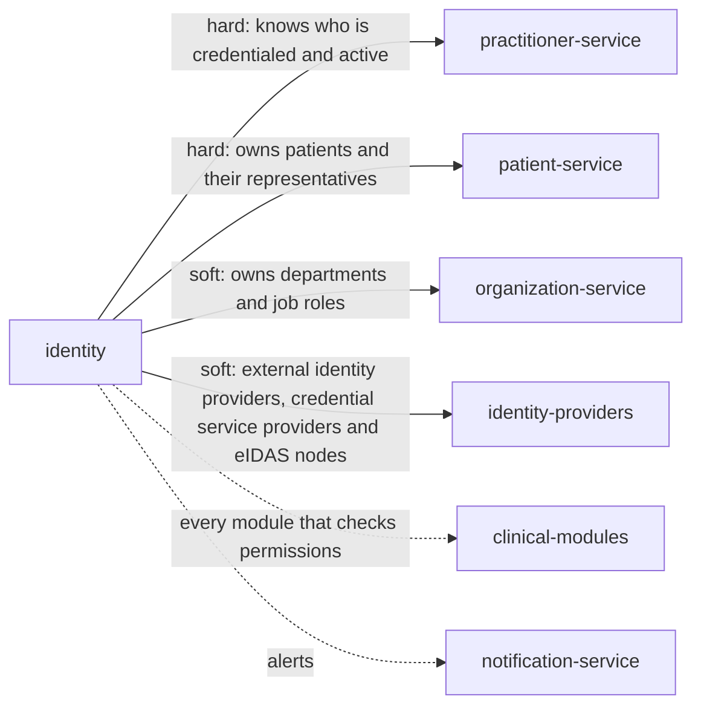

> Snapshot of healthcare/ehr/identity version 0.1.0, saved 2026-10-09. The current version is at https://knowledge-graph-ecru.vercel.app/docs/healthcare/ehr/identity.md.

# Identity and access (/docs/healthcare/ehr/identity)

## Module identity

- module: identity
- layer: healthcare > ehr
- based on: Identity and access (healthcare, /docs/healthcare/identity)
- version: 0.1.0
- status: draft

## How to read this spec

- This is the complete spec for this page, with every inherited item already merged in.
- If a behaviour is not listed here, it is unspecified. Do not assume or invent it. Ask, or record it as an open question.
- Ids such as BR-1, FR-2 and AC-3 are stable. Cite them in code, tests and commit messages.
- Items that start with "US only:" or "EU only:" apply only in that jurisdiction. Skip the ones for a jurisdiction your project doesn't operate in, or add ?jurisdiction=us or ?jurisdiction=eu to this URL to leave them out. Unmarked items apply everywhere.
- Tags such as [core] or [healthcare] show which layer an item comes from. "overrides X" means it replaces the item with the same id from layer X.

## Purpose & scope

Add what a hospital needs to the healthcare identity rules: fast, secure switching between users on shared clinical workstations, and controlled access to the read-only backup during an EHR downtime.

**In scope**

- Shared clinical workstations: badge tap with a PIN, and switching users without closing the workstation
- Shorter inactivity timeouts on shared workstations
- Access to the read-only backup during a downtime

**Out of scope**

- Badge hardware and printing. Facilities and security own them.

## Overview

### Product perspective

Solid arrows are services this module calls; dotted arrows are services it notifies.

### Actors

| Actor | Description | Layer |
| --- | --- | --- |
| Account administrator | Creates accounts, assigns roles and runs access reviews. | healthcare |
| Staff member | A clinician or other workforce member who signs in. | healthcare |
| Patient | A patient, or a representative, using the patient portal or an app. | healthcare |
| Privacy officer | Reviews emergency access and sign-in anomalies. | healthcare |
| App | A third-party application acting for a patient or user, or a backend system. | healthcare |
| System | Other modules asking about callers and permissions. | healthcare |

### Assumptions and dependencies

**AS-H1** Each module publishes the permissions its operations need. _[healthcare]_
  - Why: This module answers whether a caller holds a permission; the modules decide which permission an action needs.
**AS-H2** Practitioners and the organization's staff records say who is employed or credentialed and when they leave. _[healthcare]_
  - Why: Accounts follow people's status; they don't decide it.

## Functions

### Business rules

**BR-H1** Every person and every system has its own account, identified uniquely; accounts are never shared, and a representative never uses the patient's account. _[healthcare]_
  - Why: HIPAA requires a unique name or number for identifying and tracking each user (45 CFR 164.312(a)(2)(i)); shared accounts make it impossible to say who did what.
**BR-H2** A staff account is created only for a person the organization has authorized, such as a practitioner the Practitioners module reports or a staff member in its staff records, and gets only the roles their job needs. _[healthcare]_
  - Why: Workforce members should have only the access their work requires, through authorization and clearance procedures (45 CFR 164.308(a)(3) and (a)(4)).
**BR-H3** A role grants permissions from the modules' permission lists and applies to a department or organization. Every role assignment and change records who made it and why. Each account's roles are reviewed every access_review_interval, and roles nobody confirms are removed. _[healthcare]_
  - Why: Access must be established, reviewed and modified as people's work changes (45 CFR 164.308(a)(4)); unreviewed roles accumulate.
**BR-H4** An account is disabled within deprovision_deadline of its person leaving, or the Practitioners module reporting them inactive. When it reports a practitioner suspended, roles that need an active practitioner are suspended until reinstatement. _[healthcare]_
  - Why: Access must end when employment ends (45 CFR 164.308(a)(3)(ii)(C)); a departed or suspended clinician must not keep reaching patient data.
**BR-H5** Each role and account kind needs an authentication assurance level, set in required_aal: at least AAL2, multi-factor, for any access to patient data, with at least one phishing-resistant authenticator offered. A sign-in below the level a request needs is refused until the user steps up. _[healthcare]_
  - Why: NIST SP 800-63B-4 requires two factors at AAL2 and that verifiers offer a phishing-resistant option; NIS2 expects multi-factor authentication where appropriate (Directive (EU) 2022/2555, Article 21(2)(j)).
**BR-H6** Passwords are at least 15 characters when used alone, or 8 when used with another factor, are checked against a list of common and compromised passwords, and have no composition rules and no forced periodic change; a password is changed when there is evidence it is compromised. _[healthcare]_
  - Why: NIST SP 800-63B-4 sets these lengths, requires the blocklist check, and forbids composition rules and periodic changes, which push people to weaker, predictable passwords.
**BR-H7** Failed sign-ins are throttled and recorded. Unusual patterns, such as many failures or sign-ins from a new country, are reported to the privacy officer, and an account under attack is locked until verified. _[healthcare]_
  - Why: HIPAA expects procedures for monitoring log-in attempts and reporting discrepancies (45 CFR 164.308(a)(5)(ii)(C)), and NIST SP 800-63B requires limiting failed attempts.
**BR-H8** A session ends after session_inactivity_timeout without activity, and needs a fresh authentication after session_max_duration; ending it clears patient data from the screen. _[healthcare]_
  - Why: HIPAA expects electronic sessions to end after a set time of inactivity (45 CFR 164.312(a)(2)(iii)); NIST SP 800-63B-4 recommends at most 1 hour of inactivity and 24 hours overall at AAL2.
**BR-H9** A module can ask for a fresh authentication before a sensitive action, such as signing a note or a prescription; the answer says whether the user authenticated at the required level within the freshness it asked for. _[healthcare]_
  - Why: A signature or prescription must be made by the person themselves at that moment, not by whoever finds an open session.
**BR-H10** US only: In the United States, a practitioner can sign controlled substance prescriptions only with a two-factor credential issued after identity proofing by an approved credential service provider, and only after two designated people, one a registrant with such a credential, have granted that access. _[healthcare]_
  - Why: DEA requires two-factor authentication to sign controlled substance prescriptions, identity proofing for the credential, and logical access granted by two designated individuals (21 CFR 1311.105, 1311.115 and 1311.125).
**BR-H11** In an emergency, a user with a clinical role can break the glass to reach a patient's information they wouldn't otherwise see, giving a reason. The access lasts break_glass_duration, is logged, emits identity.break_glass_used, and is reviewed by the privacy officer within break_glass_review_deadline. _[healthcare]_
  - Why: HIPAA requires a procedure for obtaining necessary information in an emergency (45 CFR 164.312(a)(2)(ii)); review afterwards stops it becoming a back door.
**BR-H12** A patient or representative account is issued only after identity proofing at patient_identity_assurance and a match to the patient record the Patients module confirms. A representative gets their own account with the scope the Patients module records, which follows changes such as a minor reaching the age of majority. _[healthcare]_
  - Why: NIST SP 800-63A-4 sets IAL2 for remote identity proofing; a portal account linked to the wrong patient discloses someone else's record, and a parent's access must end when the law says it does.
**BR-H13** EU only: In the European Union, patients and health professionals can authenticate with electronic identification means recognised under eIDAS, including the EU Digital Identity Wallet, at the assurance the member state requires; health professionals reaching national health data access services must use them. _[healthcare]_
  - Why: The EHDS makes health professional access services available only to professionals with electronic identification recognised under the eIDAS Regulation (EHDS Article 12; Regulation (EU) No 910/2014).
**BR-H14** US only: In the United States, third-party apps can register, and a patient can authorize one with SMART App Launch 2.0.0 scopes; patient apps that ask for it get a refresh token valid for at least refresh_token_lifetime. A registration or authorization is refused only on a documented security risk. _[healthcare]_
  - Why: Certified health IT must let apps register and issue refresh tokens of at least three months (45 CFR 170.315(g)(10)); refusing an app for other reasons is likely information blocking unless the security exception applies (45 CFR 171.203).
**BR-H15** A patient sees every app they have authorized and can revoke any grant at once; revoking ends its tokens. _[healthcare]_
  - Why: Patients must stay in control of who reads their record.
**BR-H16** Backend systems, such as a population health platform using bulk export, authenticate with their own registered keys and system scopes, never with a person's account. _[healthcare]_
  - Why: SMART Backend Services and Bulk Data use system scopes so a machine's access is separate from any person's and can be revoked on its own.
**BR-H17** Every sign-in, failed attempt, step-up, role change, emergency access, app registration and grant is logged with who, when, from where and the outcome. The log can't be changed and is kept for audit_log_retention. _[healthcare]_
  - Why: HIPAA requires audit controls that record and examine activity (45 CFR 164.312(b)).
**BR-H18** When the Patients module merges two records, portal accounts linked to the source are linked to the target; when it undoes a merge, they are listed for review. When it records a patient's death, the patient's own account is disabled. _[healthcare]_
  - Why: A portal account must open the right record, and a deceased patient's account mustn't stay open for anyone to use.
**BR-H19** Recovering an account needs the same identity assurance as creating it, and every authenticator change is told to the account holder through a channel already on file. _[healthcare]_
  - Why: Account recovery is a common way to take over an account; telling the holder lets them catch it.
**BR-H20** Every change sends the revision it read; a stale revision fails. _[healthcare]_
  - Why: Two administrators changing one account must not overwrite each other.
**BR-E1** On a shared clinical workstation, a staff member signs in by tapping their badge and entering a PIN, which together are two factors, and the next user's tap ends the previous user's session on that workstation; one user's session never carries over to another. _[ehr]_
  - Why: Clinicians sign in many times an hour on shared workstations; fast switching keeps each action attributed to the right person (45 CFR 164.312(a)(2)(i)).
**BR-E2** Shared clinical workstations lock after shared_workstation_timeout of inactivity, hiding patient data, and end the session after session_inactivity_timeout. _[ehr]_
  - Why: Screens in clinical areas are seen by passers-by; HIPAA expects sessions to end after inactivity (45 CFR 164.312(a)(2)(iii)).
**BR-E3** During an EHR downtime, staff reach the read-only backup with their own accounts, and every access is logged; the backup never accepts changes. _[ehr]_
  - Why: The SAFER Contingency Planning guide expects a read-only backup during downtime; access must still be attributable to a person.

### State machine

Initial state: `pending`. States: `pending`, `active`, `locked`, `suspended`, `disabled`. _[healthcare]_
Any transition not listed below is invalid.

| From | To | Trigger | Guard |
| --- | --- | --- | --- |
| pending | active | identity proofed and first authenticator registered (BR-H12) | - |
| active | locked | too many failed sign-ins or suspected attack (BR-H7) | - |
| locked | active | unlocked after verification | - |
| active | suspended | practitioner suspended or an administrator suspends it (BR-H4) | - |
| suspended | active | reinstated | - |
| active | disabled | person left, patient died or account closed (BR-H4, BR-H18) | - |
| suspended | disabled | person left | - |
| locked | disabled | person left | - |
| pending | disabled | enrolment abandoned | - |

### Workflows

#### Give a new staff member access _[healthcare]_
Actor: Account administrator
Trigger: Practitioners reports a practitioner credentialed, or a staff member starts

1. Create the account for that person
2. Register at least two authenticators, offering a phishing-resistant one
3. Assign the roles their job needs, for their departments

Outcome: They can sign in at the assurance their roles need.

#### Enrol a patient in the portal _[healthcare]_
Actor: Patient
Trigger: A patient asks for portal access

1. Prove identity remotely or in person at patient_identity_assurance
2. The Patients module confirms the matching record
3. Register authenticators

Outcome: The patient reaches their own record, and only theirs.

#### Break the glass _[healthcare]_
Actor: Staff member
Trigger: A clinician needs a record outside their usual access in an emergency

1. Choose break the glass and give a reason
2. Access lasts break_glass_duration and is logged
3. The privacy officer reviews it within break_glass_review_deadline

Outcome: Care isn't blocked, and the access is accounted for.

#### Connect an app _[healthcare]_
Actor: Patient
Trigger: A patient opens a third-party app

1. The app sends the patient to sign in
2. The patient approves the scopes it asks for
3. The app receives tokens, and a refresh token if it asked for offline_access

Outcome: The app reads what the patient allowed until the patient revokes it.

#### Remove a leaver's access _[healthcare]_
Actor: System
Trigger: A person leaves or Practitioners reports them inactive

1. Disable the account within deprovision_deadline
2. End its sessions and revoke its tokens
3. Emit identity.account_disabled

Outcome: Nobody keeps access after leaving.

### Validations

| Field | Rule | Error | Layer |
| --- | --- | --- | --- |
| account.subject | An existing practitioner, staff record, patient or representative relationship, or a registered system, with no other active account of the same kind | IDENTITY_DUPLICATE | healthcare |
| account.username | Unique, never used before | IDENTITY_DUPLICATE | healthcare |
| account.authenticators | A password meets BR-H6; other authenticators are a supported type | IDENTITY_WEAK_PASSWORD | healthcare |
| account.roles | Each role exists and the subject's kind may hold it | IDENTITY_INVALID_ROLE | healthcare |
| grant.scopes | SMART App Launch 2.0.0 scope syntax, within what the app registered for | IDENTITY_INVALID_SCOPE | healthcare |
| break_glass.reason | Present | IDENTITY_REASON_REQUIRED | healthcare |
| account.status | Fields the service sets, such as status, last_sign_in_at, last_reviewed_at and revision, can't be written by clients | IDENTITY_READ_ONLY_FIELD | healthcare |

### Edge cases

**EC-H1** Two nurses share one login on a busy ward. _[healthcare]_
  - Required behaviour: Not possible: each has their own account; on shared workstations the EHR layer makes switching fast instead.
  - Covered by: BR-H1, AC-H1
**EC-H2** A clinician leaves on Friday afternoon. _[healthcare]_
  - Required behaviour: Their account is disabled the same day and their sessions and tokens end at once.
  - Covered by: BR-H4, AC-H4
**EC-H3** An unconscious patient arrives and the doctor on duty has no care relationship yet. _[healthcare]_
  - Required behaviour: The doctor breaks the glass with a reason; the access is logged and reviewed.
  - Covered by: BR-H11, AC-H11
**EC-H4** A teenager turns 18 and their parent still has portal access. _[healthcare]_
  - Required behaviour: The parent's access ends when the Patients module reports the change; the teenager keeps their own account.
  - Covered by: BR-H12, AC-H12
**EC-H5** A phishing site captures a password and a one-time code. _[healthcare]_
  - Required behaviour: Phishing-resistant authenticators are offered and required for administrators, so a replayed code doesn't work for them.
  - Covered by: BR-H5, AC-H5
**EC-H6** A patient's app is abandoned and the patient forgets it. _[healthcare]_
  - Required behaviour: The patient can see and revoke it at any time; its refresh token ends after its lifetime unless renewed.
  - Covered by: BR-H15, AC-H16
**EC-H7** Someone asks support to reset a doctor's authenticator by phone. _[healthcare]_
  - Required behaviour: Recovery needs the same proof as enrolment, and the doctor is told through a channel on file.
  - Covered by: BR-H19, AC-H20
**EC-E1** A nurse walks away from a workstation in a corridor during a code. _[ehr]_
  - Required behaviour: It locks after shared_workstation_timeout, and the next person's badge tap ends the nurse's session.
  - Covered by: BR-E1, BR-E2, AC-E2

## Data

### Data model

| Field | Type | Required | Description | Constraints | Layer |
| --- | --- | --- | --- | --- | --- |
| account.id | string | yes | The account id. Never changes or is reused. | set by the service | healthcare |
| account.kind | enum | yes | Whose account it is. | staff \| patient \| representative \| system; codes: none standard, local to this specification | healthcare |
| account.subject | reference | yes | The person or system it belongs to: a practitioner or staff record, a patient, a representative relationship from the Patients module, or a system. | one active account per subject and kind | healthcare |
| account.username | string | yes | The sign-in name. | unique; never reused | healthcare |
| account.status | enum | yes | Where the account is in its lifecycle. | pending \| active \| locked \| suspended \| disabled; changed only through operations; codes: none standard, local to this specification | healthcare |
| account.identity_assurance | code | no | How strongly the person's identity was proven, by whom and with what evidence. | codes: NIST SP 800-63A IAL1, IAL2, IAL3; in the EU, eIDAS assurance levels low, substantial, high | healthcare |
| account.authenticators | authenticator[] | no | Registered authenticators: type, whether phishing-resistant, the AAL it supports, when registered and last used. | codes: type from a local list, such as password, otp_app, security_key, passkey, smart_card | healthcare |
| account.roles | role assignment[] | no | Roles held, each with the department or organization it applies to, its period and who granted it. | each role from roles | healthcare |
| account.last_sign_in_at | instant | no | When the account last signed in. | set by the service | healthcare |
| account.last_reviewed_at | instant | no | When an access review last confirmed the account's roles. | set by the service | healthcare |
| account.revision | integer | yes | Goes up with every change. | set by the service | healthcare |
| role.name | string | yes | The role, such as nurse or registrar. | unique | healthcare |
| role.permissions | string[] | yes | The permissions the role grants, from the modules' permission lists. | - | healthcare |
| role.required_aal | code | yes | The authentication assurance the role needs. | codes: AAL1, AAL2, AAL3 | healthcare |
| session.id | string | yes | The session id. | set by the service | healthcare |
| session.aal | code | yes | The assurance the sign-in reached, raised by step-up. | codes: AAL1, AAL2, AAL3 | healthcare |
| session.started_at | instant | yes | When it began, and when it was last active and last reauthenticated. | - | healthcare |
| session.ended_reason | code | no | Why it ended, such as signed out, inactive, expired or account disabled. | codes: local list | healthcare |
| app.client_id | string | yes | The registered app's id. | set by the service | healthcare |
| app.kind | enum | yes | How the app authenticates. | confidential \| public \| backend; codes: SMART App Launch client types | healthcare |
| app.status | enum | yes | Whether the app may be used. | registered \| suspended \| revoked; codes: none standard, local to this specification | healthcare |
| grant.scopes | string[] | yes | What a patient or user allowed an app to do, with when it was granted, its refresh token's expiry and any revocation. | SMART App Launch 2.0.0 scope syntax | healthcare |
| break_glass.reason | text | yes | Why emergency access was used, for which patient, when, how long it lasted, and the review outcome. | - | healthcare |

### Relationships

| Edge | Target | Note | Layer |
| --- | --- | --- | --- |
| has_many | session | sessions of an account | healthcare |
| has_many | grant | apps an account has authorized | healthcare |
| can_trigger | event:identity.break_glass_used | - | healthcare |

## External interfaces

### API

#### Create an account: `POST /accounts` _[healthcare]_
Create an account for a person or system. Accepts a retry key.
- Success: 201
- Actor: Account administrator
- Input: kind, subject, username, and roles for staff
- Result: the account, pending
- Errors: IDENTITY_DUPLICATE, IDENTITY_INVALID_ROLE, IDENTITY_READ_ONLY_FIELD, IDENTITY_IDEMPOTENCY_KEY_REUSED, IDENTITY_FORBIDDEN, IDENTITY_DEPENDENCY_UNAVAILABLE

#### Get an account: `GET /accounts/{id}` _[healthcare]_
An account's kind, subject, status, roles and authenticator types.
- Success: 200
- Actor: System
- Input: account id
- Result: the account, never secrets
- Errors: IDENTITY_NOT_FOUND, IDENTITY_FORBIDDEN

#### Search accounts: `GET /accounts` _[healthcare]_
Search by name, subject, role, status or last sign-in.
- Success: 200
- Actor: Account administrator
- Input: criteria, limit and cursor
- Result: accounts and next_cursor
- Errors: IDENTITY_FORBIDDEN

#### Record identity proofing: `POST /accounts/{id}/proofing` _[healthcare]_
Record how a person's identity was proven, at what level and with what evidence.
- Success: 200
- Actor: Account administrator
- Input: assurance level, method and evidence references
- Result: the account
- Errors: IDENTITY_NOT_FOUND, IDENTITY_FORBIDDEN

#### Register an authenticator: `POST /accounts/{id}/authenticators` _[healthcare]_
Add a password, one-time-password app, security key, passkey or smart card.
- Success: 201
- Actor: Staff member
- Input: type and enrolment data
- Result: the authenticator, without its secret
- Errors: IDENTITY_NOT_FOUND, IDENTITY_WEAK_PASSWORD, IDENTITY_AAL_TOO_LOW, IDENTITY_FORBIDDEN

#### Remove an authenticator: `DELETE /accounts/{id}/authenticators/{authenticator_id}` _[healthcare]_
Remove an authenticator; the last one can't be removed.
- Success: 200
- Actor: Staff member
- Input: revision
- Result: the account
- Errors: IDENTITY_NOT_FOUND, IDENTITY_AAL_TOO_LOW, IDENTITY_REVISION_CONFLICT, IDENTITY_FORBIDDEN

#### Sign in: `POST /sessions` _[healthcare]_
Authenticate and start a session at the assurance the authenticators reach.
- Success: 201
- Actor: Staff member
- Input: username and authenticator responses
- Result: the session and its AAL
- Errors: IDENTITY_INVALID_CREDENTIAL, IDENTITY_ACCOUNT_LOCKED, IDENTITY_DEPENDENCY_UNAVAILABLE

#### Step up: `POST /sessions/{id}/step-up` _[healthcare]_
Authenticate again to raise or refresh a session's assurance before a sensitive action.
- Success: 200
- Actor: Staff member
- Input: authenticator responses
- Result: the session with its new AAL and time
- Errors: IDENTITY_NOT_FOUND, IDENTITY_INVALID_CREDENTIAL, IDENTITY_AAL_TOO_LOW

#### Sign out: `DELETE /sessions/{id}` _[healthcare]_
End a session.
- Success: 200
- Actor: Staff member
- Input: session id
- Result: the ended session
- Errors: IDENTITY_NOT_FOUND

#### Check a permission: `GET /authorization/check` _[healthcare]_
Whether the caller holds a permission, at the assurance needed, and how recently they authenticated.
- Success: 200
- Actor: System
- Input: session or token, permission, and the freshness needed
- Result: allowed or not, the AAL and authentication time
- Errors: IDENTITY_INVALID_CREDENTIAL

#### Assign a role: `POST /accounts/{id}/roles` _[healthcare]_
Give an account a role for a department or organization.
- Success: 201
- Actor: Account administrator
- Input: role, scope, period and reason
- Result: the assignment
- Errors: IDENTITY_NOT_FOUND, IDENTITY_INVALID_ROLE, IDENTITY_REASON_REQUIRED, IDENTITY_FORBIDDEN

#### Remove a role: `DELETE /accounts/{id}/roles/{assignment_id}` _[healthcare]_
End a role assignment.
- Success: 200
- Actor: Account administrator
- Input: reason
- Result: the account
- Errors: IDENTITY_NOT_FOUND, IDENTITY_REASON_REQUIRED, IDENTITY_FORBIDDEN

#### Define a role: `PUT /roles/{name}` _[healthcare]_
Create or change a role's permissions and required AAL.
- Success: 200
- Actor: Account administrator
- Input: permissions, required_aal and revision
- Result: the role
- Errors: IDENTITY_INVALID_ROLE, IDENTITY_REVISION_CONFLICT, IDENTITY_FORBIDDEN

#### List accounts due for review: `GET /access-reviews` _[healthcare]_
Accounts whose roles haven't been confirmed within access_review_interval.
- Success: 200
- Actor: Account administrator
- Input: department, limit and cursor
- Result: accounts and next_cursor
- Errors: IDENTITY_FORBIDDEN

#### Confirm an access review: `POST /access-reviews/{account_id}` _[healthcare]_
Confirm or remove each role of an account under review.
- Success: 200
- Actor: Account administrator
- Input: roles kept and removed
- Result: the account
- Errors: IDENTITY_NOT_FOUND, IDENTITY_FORBIDDEN

#### Disable an account: `POST /accounts/{id}/disable` _[healthcare]_
Disable an account, ending its sessions and tokens.
- Success: 200
- Actor: Account administrator
- Input: reason and revision
- Result: the account
- Errors: IDENTITY_NOT_FOUND, IDENTITY_REASON_REQUIRED, IDENTITY_REVISION_CONFLICT, IDENTITY_FORBIDDEN

#### Unlock an account: `POST /accounts/{id}/unlock` _[healthcare]_
Unlock a locked account after verifying the holder.
- Success: 200
- Actor: Account administrator
- Input: how the holder was verified, and revision
- Result: the account
- Errors: IDENTITY_NOT_FOUND, IDENTITY_INVALID_STATUS, IDENTITY_REASON_REQUIRED, IDENTITY_FORBIDDEN

#### Break the glass: `POST /break-glass` _[healthcare]_
Gain emergency access to a patient's information, with a reason.
- Success: 201
- Actor: Staff member
- Input: patient and reason
- Result: the emergency access and when it ends
- Errors: IDENTITY_REASON_REQUIRED, IDENTITY_FORBIDDEN

#### Review emergency access: `POST /break-glass/{id}/review` _[healthcare]_
Record whether an emergency access was justified.
- Success: 200
- Actor: Privacy officer
- Input: justified or not, and notes
- Result: the reviewed access
- Errors: IDENTITY_NOT_FOUND, IDENTITY_FORBIDDEN

#### Register an app: `POST /apps` _[healthcare]_
US only: Register a third-party or backend app.
- Success: 201
- Actor: App
- Input: name, kind, redirect URIs or public keys, and scopes it may request
- Result: the client id
- Errors: IDENTITY_INVALID_SCOPE, IDENTITY_APP_REFUSED

#### Authorize an app: `GET /oauth/authorize` _[healthcare]_
The SMART App Launch authorization request: sign in and approve scopes.
- Success: 302
- Actor: Patient
- Input: client id, scopes, redirect URI, state and PKCE challenge
- Result: a redirect to the app with an authorization code
- Errors: IDENTITY_INVALID_SCOPE, IDENTITY_APP_REFUSED

#### Issue a token: `POST /oauth/token` _[healthcare]_
Exchange an authorization code, refresh token or backend assertion for tokens.
- Success: 200
- Actor: App
- Input: grant type and credentials
- Result: access token, scopes, and a refresh token where allowed
- Errors: IDENTITY_INVALID_CREDENTIAL, IDENTITY_INVALID_SCOPE

#### List my app grants: `GET /grants` _[healthcare]_
The apps the account has authorized, with scopes and dates.
- Success: 200
- Actor: Patient
- Input: limit and cursor
- Result: grants and next_cursor

#### Revoke an app grant: `DELETE /grants/{id}` _[healthcare]_
Revoke an app's access at once.
- Success: 200
- Actor: Patient
- Input: grant id
- Result: the revoked grant
- Errors: IDENTITY_GRANT_NOT_FOUND

#### Grant controlled substance prescribing: `POST /accounts/{id}/epcs-access` _[healthcare]_
US only: Record the two designated individuals' approval for a practitioner to sign controlled substance prescriptions.
- Success: 200
- Actor: Account administrator
- Input: the two approvers and the credential's identity proofing record
- Result: the account
- Errors: IDENTITY_NOT_FOUND, IDENTITY_EPCS_REQUIREMENTS_UNMET, IDENTITY_FORBIDDEN

#### Get an account's sign-in log: `GET /accounts/{id}/sign-in-log` _[healthcare]_
Sign-ins, failures, step-ups and role changes for an account.
- Success: 200
- Actor: Privacy officer
- Input: limit and cursor
- Result: log entries
- Errors: IDENTITY_NOT_FOUND, IDENTITY_FORBIDDEN

### API conventions

| Topic | Convention | Reference | Layer |
| --- | --- | --- | --- |
| Authentication | Callers authenticate with a session or an OAuth 2.0 access token issued here; apps use SMART App Launch 2.0.0, and backend systems SMART Backend Services. | - | healthcare |
| Errors | Errors use problem details (application/problem+json) with a code member, such as IDENTITY_AAL_TOO_LOW; the OAuth endpoints use the OAuth 2.0 error responses (RFC 6749). | RFC 9457, RFC 6749 | healthcare |
| Pagination | Lists are cursor-based: limit and an optional cursor in, next_cursor out. | - | healthcare |
| Concurrency | Every change sends the revision it read; a stale revision fails with IDENTITY_REVISION_CONFLICT (BR-H20). | - | healthcare |
| Retries | Every create accepts an Idempotency-Key header. | IETF draft-ietf-httpapi-idempotency-key-header | healthcare |
| Secrets | No operation returns a password, key or token after it is issued; passwords are stored only as salted, slow hashes. | - | healthcare |

### Events

| Event | Description | Payload | Layer |
| --- | --- | --- | --- |
| identity.account_created | An account was created. | account_id, revision, kind | healthcare |
| identity.account_disabled | An account was disabled. | account_id, revision, reason | healthcare |
| identity.account_locked | An account was locked. | account_id, revision | healthcare |
| identity.role_changed | A role was assigned or removed. | account_id, revision, role | healthcare |
| identity.signin_anomaly | Unusual sign-in activity was detected. | account_id, revision, pattern | healthcare |
| identity.break_glass_used | Emergency access was used. | account_id, patient_id, ends_at | healthcare |
| identity.break_glass_reviewed | Emergency access was reviewed. | account_id, patient_id, outcome | healthcare |
| identity.app_registered | An app was registered. | client_id, kind | healthcare |
| identity.grant_revoked | A patient or user revoked an app's access. | client_id, account_id | healthcare |

### Event delivery

**DG-H1** Events are published at least once; consumers drop one with a source and id they have seen. _[healthcare]_
  - Why: A relay can publish twice after a crash.
**DG-H2** Events carry ids and reasons, never credentials, tokens or identity evidence. _[healthcare]_
  - Why: Events fan out widely; a leaked token is a stolen account.

### Errors

| Code | HTTP | Meaning | Layer |
| --- | --- | --- | --- |
| IDENTITY_NOT_FOUND | 404 | No account, session or emergency access exists with that id. | healthcare |
| IDENTITY_FORBIDDEN | 403 | Your role doesn't allow this. | healthcare |
| IDENTITY_DUPLICATE | 409 | That person or system already has an active account of this kind, or the username was used before. | healthcare |
| IDENTITY_INVALID_CREDENTIAL | 401 | The sign-in or token couldn't be verified. | healthcare |
| IDENTITY_ACCOUNT_LOCKED | 403 | The account is locked; an administrator must verify you to unlock it. | healthcare |
| IDENTITY_AAL_TOO_LOW | 401 | This needs a stronger or fresher authentication; step up and try again. | healthcare |
| IDENTITY_WEAK_PASSWORD | 422 | The password is too short or on the list of common and compromised passwords. | healthcare |
| IDENTITY_INVALID_ROLE | 422 | That role doesn't exist, or this kind of account can't hold it. | healthcare |
| IDENTITY_INVALID_SCOPE | 422 | A scope isn't valid SMART syntax or wasn't registered for this app. | healthcare |
| IDENTITY_APP_REFUSED | 403 | The app was refused for a documented security risk. | healthcare |
| IDENTITY_GRANT_NOT_FOUND | 404 | No grant exists with that id. | healthcare |
| IDENTITY_EPCS_REQUIREMENTS_UNMET | 409 | Controlled substance prescribing needs a proofed two-factor credential and two designated approvers. | healthcare |
| IDENTITY_INVALID_STATUS | 409 | The account isn't in a status that allows this. | healthcare |
| IDENTITY_REASON_REQUIRED | 422 | This needs a reason. | healthcare |
| IDENTITY_READ_ONLY_FIELD | 422 | That field is set by the service. | healthcare |
| IDENTITY_REVISION_CONFLICT | 409 | It changed since you read it. Read it again. | healthcare |
| IDENTITY_IDEMPOTENCY_KEY_REUSED | 422 | That retry key was used with a different request. | healthcare |
| IDENTITY_DEPENDENCY_UNAVAILABLE | 503 | Practitioners, Patients or an identity provider can't be reached. Try again. | healthcare |

### Dependencies

Each dependency lists its contract: only what this module needs from it (upstream) or gives it (downstream). How the other module works is out of scope.

| Service | Direction | Criticality | Reason | Contract | Layer |
| --- | --- | --- | --- | --- | --- |
| practitioner-service | upstream | hard | knows who is credentialed and active | Asks: is this practitioner active?; Receives: practitioner.credentialed, practitioner.suspended, practitioner.reinstated and practitioner.inactivated; Gives: the practitioner id an account belongs to | healthcare |
| patient-service | upstream | hard | owns patients and their representatives | Asks: does this enrolment match a patient record in use?; Asks: who represents this patient, with what scope?; Receives: patient.merged, patient.unmerged, patient.deceased and patient.representative_changed | healthcare |
| organization-service | upstream | soft | owns departments and job roles | Asks: which job roles does this person hold, in which departments?; Departments and job roles are Organization's concern | healthcare |
| identity-providers | upstream | soft | external identity providers, credential service providers and eIDAS nodes | Asks: is this sign-in or proofing result valid, and at what assurance? | healthcare |
| clinical-modules | downstream | hard | every module that checks permissions | Gives: whether the caller holds a permission, with their AAL and authentication time; Gives: identity.break_glass_used, so modules allow the emergency access and log it; Which permission each action needs is each module's concern | healthcare |
| notification-service | downstream | soft | alerts | Gives: identity.signin_anomaly, identity.account_locked and identity.break_glass_used, for the privacy officer; Gives: identity.break_glass_reviewed, so the person who broke the glass learns the outcome; Gives: identity.account_created, identity.account_disabled, identity.role_changed, identity.app_registered and identity.grant_revoked, so holders are told of changes | healthcare |

## Security

### Permission matrix

| Action | Account administrator | Staff member | Patient | Privacy officer | App | System | Permission | Layer |
| --- | --- | --- | --- | --- | --- | --- | --- | --- |
| Create, search, disable and unlock accounts, assign and define roles, run access reviews, grant controlled substance prescribing | any | none | none | none | none | none | identity.admin | healthcare |
| Register and remove own authenticators, sign in, step up, sign out, list and revoke own app grants | own | own | own | own | none | none | identity.self | healthcare |
| Break the glass | none | any | none | none | none | none | identity.break_glass | healthcare |
| Read sign-in logs, review emergency access | none | none | none | any | none | none | identity.audit | healthcare |
| Check a permission, get an account | any | own | own | any | none | any | identity.check | healthcare |
| Register an app, request tokens | none | none | none | none | own | none | identity.self | healthcare |

any: every appointment. own: appointments the actor takes part in. none: not allowed.

- Break the glass: Only staff with a clinical role.

- Register an app, request tokens: Apps act only within the scopes a person granted, or their own system scopes.

### Permissions

| Permission | Grants | Layer |
| --- | --- | --- |
| identity.admin | Create accounts, assign roles and run access reviews. | healthcare |
| identity.self | Manage your own authenticators, sessions and app grants. | healthcare |
| identity.break_glass | Break the glass for emergency access. | healthcare |
| identity.audit | Read sign-in logs and review emergency access. | healthcare |
| identity.check | Ask whether a caller holds a permission. | healthcare |

### Privacy and retention

| Field | Category | Purpose | Retention | Layer |
| --- | --- | --- | --- | --- |
| account.subject, account.username, account.kind, account.status, account.roles, account.revision | personal | Identifying who acts in the application and what they may do | As long as the account, then audit_log_retention | healthcare |
| account.identity_assurance | personal; evidence can include identity documents | Showing how identity was proven | As long as the account; evidence images are not kept once verified | healthcare |
| account.authenticators | personal; can include biometric templates on the device only | Signing in | Until removed; secrets are stored only as salted hashes or public keys | healthcare |
| account.last_sign_in_at, account.last_reviewed_at, session.id, session.aal, session.started_at, session.ended_reason | personal | Security and audit | audit_log_retention | healthcare |
| app.client_id, app.kind, app.status, grant.scopes | personal (for grants) | Showing which apps may act for whom | As long as the grant, then audit_log_retention | healthcare |
| role.name, role.permissions, role.required_aal | not personal | Defining access | As long as the role is in use | healthcare |
| break_glass.reason | health data; names the patient | Accounting for emergency access | audit_log_retention | healthcare |

### Compliance

**CMP-H1** HIPAA Security Rule, 45 CFR 164.312(a)(2)(i) to (iii): US only: Unique user identification, an emergency access procedure, and automatic logoff. _[healthcare]_
  - How it's met: One account per person, break the glass, session timeouts.
  - Status: met
  - Covered by: BR-H1, BR-H11, BR-H8
**CMP-H2** HIPAA Security Rule, 45 CFR 164.312(b) and (d): US only: Audit controls, and verifying that a person seeking access is who they claim. _[healthcare]_
  - How it's met: Every sign-in and change logged; multi-factor authentication.
  - Status: met
  - Covered by: BR-H17, BR-H5
**CMP-H3** HIPAA Security Rule, 45 CFR 164.308(a)(3), (a)(4) and (a)(5)(ii)(C) and (D): US only: Workforce access authorization and termination, access management, log-in monitoring and password management. _[healthcare]_
  - How it's met: Roles, reviews, deprovisioning, throttling and password rules.
  - Status: met
  - Covered by: BR-H2, BR-H3, BR-H4, BR-H6, BR-H7
**CMP-H4** DEA electronic prescriptions for controlled substances, 21 CFR 1311.105, 1311.115 and 1311.125: US only: Identity-proofed two-factor credentials and logical access granted by two designated individuals. _[healthcare]_
  - How it's met: Controlled substance prescribing access needs both.
  - Status: met
  - Covered by: BR-H10
**CMP-H5** ONC Health IT Certification, 45 CFR 170.315(g)(10): US only: App registration, SMART App Launch authorization and refresh tokens of at least three months. _[healthcare]_
  - How it's met: App registration and authorization server.
  - Status: met
  - Covered by: BR-H14, BR-H16
**CMP-H6** 21st Century Cures Act information blocking, 45 CFR 171.203: US only: Refuse apps only under a tailored security practice. _[healthcare]_
  - How it's met: Refusals need a documented security risk.
  - Status: met
  - Covered by: BR-H14
**CMP-H7** European Health Data Space (EU) 2025/327, Article 12: EU only: Health professionals reach access services only with eIDAS-recognised electronic identification. _[healthcare]_
  - How it's met: eIDAS sign-in for professionals.
  - Status: met
  - Covered by: BR-H13
**CMP-H8** NIS2 Directive (EU) 2022/2555, Article 21(2)(j): EU only: Multi-factor or continuous authentication where appropriate. _[healthcare]_
  - How it's met: AAL2 or higher for every account reaching patient data.
  - Status: met
  - Covered by: BR-H5
**CMP-H9** GDPR (EU) 2016/679, Article 32: EU only: Security appropriate to the risk, including access control. _[healthcare]_
  - How it's met: Unique accounts, multi-factor authentication, logging.
  - Status: met
  - Covered by: BR-H1, BR-H5, BR-H17

## Requirements

### Functional requirements

| ID | Requirement | Priority | Verified by | Layer |
| --- | --- | --- | --- | --- |
| FR-H1 | The service must create, disable and lock accounts, one per person or system. | must | test | healthcare |
| FR-H2 | The service must authenticate at the assurance each role needs, including step-up, and end sessions on inactivity. | must | test | healthcare |
| FR-H3 | The service must answer whether a caller holds a permission, with their assurance level and authentication time. | must | test | healthcare |
| FR-H4 | The service must assign roles, run access reviews, and remove access when people leave. | must | test | healthcare |
| FR-H5 | The service must provide emergency access with logging and review. | must | test | healthcare |
| FR-H6 | The service must enrol patients and representatives after identity proofing and a confirmed record match. | must | test | healthcare |
| FR-H7 | US only: The service must register apps and authorize them with SMART App Launch 2.0.0, including backend services. | must | demonstration | healthcare |
| FR-H8 | The service must log every sign-in, failure, step-up, role change, emergency access and grant. | must | test | healthcare |

### Performance requirements

| Id | Indicator | Target | Measured as | Layer |
| --- | --- | --- | --- | --- |
| PERF-H1 | Permission check latency | Set by each deployment as an SLO | 99th percentile time to answer a permission check. | healthcare |
| PERF-H2 | Leaver access | 0 | Accounts still active past deprovision_deadline after their person left. | healthcare |
| PERF-H3 | Emergency access reviewed on time | 100% | Share of emergency accesses reviewed within break_glass_review_deadline. | healthcare |

### Quality attributes

| Category | Requirement | Layer |
| --- | --- | --- |
| security | Authenticators are verified with phishing-resistant protocols where the authenticator supports them, and secrets never leave the service. | healthcare |
| compatibility | US only: In the United States, the authorization server conforms to SMART App Launch 2.0.0, OpenID Connect Core 1.0 and Bulk Data system scopes, as 45 CFR 170.215 adopts. | healthcare |
| availability | Sign-in and permission checks are on every request's path, so they need the highest availability of any module; deployments set an SLO. | healthcare |
| portability | No requirement depends on a particular identity provider, database or framework. | healthcare |

### Design constraints

**CON-H1** Passwords are stored only as salted hashes from a slow, memory-hard function, and keys only as public keys where possible. _[healthcare]_
  - Why: A stolen database must not reveal anyone's password; NIST SP 800-63B requires salted, cost-hardened storage.

### Configuration

| Setting | Type | Default | Description | Layer |
| --- | --- | --- | --- | --- |
| jurisdiction | us \| eu | none | Which legal regime applies. Required. | healthcare |
| required_aal | map | none | The authentication assurance each role and account kind needs. Default AAL2 for every account that reaches patient data, and AAL3 for administrators. | healthcare |
| session_inactivity_timeout | duration | none | Inactivity before a session ends. Default 30 minutes; NIST SP 800-63B-4 recommends no more than 1 hour at AAL2. | healthcare |
| session_max_duration | duration | none | How long before a fresh authentication is needed. Default 12 hours; NIST recommends no more than 24 hours at AAL2. | healthcare |
| patient_identity_assurance | code | none | How strongly patients and representatives are proven before getting an account. Default IAL2 in the United States; in the EU, the eIDAS level the member state requires. | healthcare |
| access_review_interval | duration | none | How often each account's roles are reviewed. Set by the organization. | healthcare |
| deprovision_deadline | duration | none | How soon after someone leaves their account is disabled. Default the same day. | healthcare |
| break_glass_duration | duration | none | How long emergency access lasts. Default 4 hours. | healthcare |
| break_glass_review_deadline | duration | none | How soon the privacy officer reviews emergency access. Set by the organization. | healthcare |
| refresh_token_lifetime | duration | none | How long a patient app's refresh token lasts. At least 3 months in the United States (45 CFR 170.315(g)(10)). | healthcare |
| audit_log_retention | duration | none | How long the sign-in and access log is kept. Set from law and policy; needs legal advice. | healthcare |
| shared_workstation_timeout | duration | none | Inactivity before a shared clinical workstation locks. Set by the organization; short, such as a few minutes. | ehr |

## Verification

### Acceptance criteria

**AC-H1** _[healthcare]_
- Given a practitioner with an active staff account
- When a second staff account is created for them, and a new account reuses a retired username
- Then both fail with IDENTITY_DUPLICATE and HTTP 409
- Verifies: BR-H1, FR-H1

**AC-H2** _[healthcare]_
- Given a person with no practitioner or staff record
- When a staff account is created for them, then for a credentialed practitioner with the role nurse
- Then the first fails with IDENTITY_DUPLICATE and HTTP 409 because the subject isn't valid; the second is created and identity.account_created is emitted
- Verifies: BR-H2

**AC-H3** _[healthcare]_
- Given an account whose roles were last confirmed past access_review_interval
- When the review list is read, a role is assigned without a reason, and the review removes an unconfirmed role
- Then the account is listed; the assignment fails with IDENTITY_REASON_REQUIRED and HTTP 422; the removal emits identity.role_changed
- Verifies: BR-H3, FR-H4

**AC-H4** _[healthcare]_
- Given a staff member who leaves, and a practitioner the Practitioners module suspends
- When deprovision_deadline passes, and practitioner.suspended arrives
- Then the first account is disabled with sessions ended and identity.account_disabled emitted; the second account's clinical roles are suspended
- Verifies: BR-H4, FR-H4

**AC-H5** _[healthcare]_
- Given a nurse role requiring AAL2, and a session at AAL1
- When the nurse opens a patient record, then steps up with a security key
- Then the request fails with IDENTITY_AAL_TOO_LOW and HTTP 401; after stepping up it succeeds at AAL2
- Verifies: BR-H5, FR-H2

**AC-H6** _[healthcare]_
- Given a user setting a single-factor password
- When they choose "Password123!" and then a 16-character passphrase not on the blocklist
- Then the first fails with IDENTITY_WEAK_PASSWORD and HTTP 422; the second is accepted with no composition rule applied
- Verifies: BR-H6

**AC-H7** _[healthcare]_
- Given repeated failed sign-ins to one account
- When they continue past the throttle
- Then sign-ins are slowed, then the account is locked with identity.account_locked and identity.signin_anomaly emitted; a later sign-in fails with IDENTITY_ACCOUNT_LOCKED and HTTP 403, and unlocking without verification fails with IDENTITY_REASON_REQUIRED and HTTP 422
- Verifies: BR-H7

**AC-H8** _[healthcare]_
- Given session_inactivity_timeout of 30 minutes
- When a session is idle for 31 minutes
- Then it ends with reason inactive and the next request fails with IDENTITY_INVALID_CREDENTIAL and HTTP 401
- Verifies: BR-H8, FR-H2

**AC-H9** _[healthcare]_
- Given a clinician who authenticated 2 hours ago
- When Clinical documentation checks the permission note.write with a freshness of 5 minutes
- Then the answer says the authentication isn't fresh enough; after a step-up it is allowed
- Verifies: BR-H9, FR-H3

**AC-H10** _[healthcare]_
- Given US only: a practitioner with a proofed two-factor credential and one designated approver
- When controlled substance prescribing is granted, then with a second approver who is a registrant
- Then the first fails with IDENTITY_EPCS_REQUIREMENTS_UNMET and HTTP 409; the second succeeds
- Verifies: BR-H10

**AC-H11** _[healthcare]_
- Given a nurse with no care relationship to a patient
- When they break the glass without a reason, then with one
- Then the first fails with IDENTITY_REASON_REQUIRED and HTTP 422; the second grants access for break_glass_duration, emits identity.break_glass_used, and the review emits identity.break_glass_reviewed
- Verifies: BR-H11, FR-H5

**AC-H12** _[healthcare]_
- Given a patient proofed at IAL2 and matched by the Patients module, and a parent representative of a minor
- When the patient enrols, and later the minor reaches the age of majority
- Then the patient's account becomes active; the parent's access to the minor's record ends
- Verifies: BR-H12, FR-H6

**AC-H13** _[healthcare]_
- Given EU only: a health professional signing in with an eIDAS-notified eID at assurance level high
- When they reach the national access service
- Then the sign-in is accepted with the eID's assurance recorded
- Verifies: BR-H13

**AC-H14** _[healthcare]_
- Given US only: a third-party app requesting patient/Observation.rs and offline_access
- When it registers, the patient approves, and it asks for a scope it didn't register
- Then identity.app_registered is emitted; the refresh token lasts at least refresh_token_lifetime; the extra scope fails with IDENTITY_INVALID_SCOPE and HTTP 422
- Verifies: BR-H14, FR-H7

**AC-H15** _[healthcare]_
- Given US only: an app registration from a client on a documented list of malicious hosts
- When it registers
- Then it fails with IDENTITY_APP_REFUSED and HTTP 403, with the security reason recorded
- Verifies: BR-H14

**AC-H16** _[healthcare]_
- Given a patient with two app grants
- When they list them and revoke one, then revoke an unknown id
- Then both are listed; the revoked app's tokens stop working and identity.grant_revoked is emitted; the unknown id fails with IDENTITY_GRANT_NOT_FOUND and HTTP 404
- Verifies: BR-H15

**AC-H17** _[healthcare]_
- Given a population health platform
- When it requests a bulk export token with its registered key and system scopes
- Then it receives a token for system scopes only, not tied to any person
- Verifies: BR-H16

**AC-H18** _[healthcare]_
- Given a day of activity
- When a privacy officer reads an account's sign-in log
- Then every sign-in, failure, step-up, role change and emergency access is listed with who, when, where and the outcome
- Verifies: BR-H17, FR-H8

**AC-H19** _[healthcare]_
- Given a portal account linked to a patient who is merged into another, and another patient who dies
- When patient.merged and patient.deceased arrive
- Then the first account opens the remaining record; the second patient's own account is disabled
- Verifies: BR-H18

**AC-H20** _[healthcare]_
- Given a user recovering their account
- When they recover with only an email link when the account was proofed at IAL2
- Then recovery is refused until identity is proven again at IAL2, and the holder is told through a channel on file
- Verifies: BR-H19

**AC-H21** _[healthcare]_
- Given an account at revision 4
- When it is changed with revision 3, a client sets status, a create is retried with one key and a different body, and an unknown account is read
- Then they fail with IDENTITY_REVISION_CONFLICT and HTTP 409, IDENTITY_READ_ONLY_FIELD and HTTP 422, IDENTITY_IDEMPOTENCY_KEY_REUSED and HTTP 422, and IDENTITY_NOT_FOUND and HTTP 404
- Verifies: BR-H20

**AC-H22** _[healthcare]_
- Given a staff member
- When they assign themselves a role, and a role with an unknown name is assigned
- Then the first fails with IDENTITY_FORBIDDEN and HTTP 403; the second with IDENTITY_INVALID_ROLE and HTTP 422
- Verifies: FR-H4

**AC-H23** _[healthcare]_
- Given an account that is active
- When it is unlocked
- Then it fails with IDENTITY_INVALID_STATUS and HTTP 409
- Verifies: FR-H1

**AC-H24** _[healthcare]_
- Given the Practitioners module unreachable
- When a staff account is created
- Then it fails with IDENTITY_DEPENDENCY_UNAVAILABLE and HTTP 503; existing sessions keep working
- Verifies: FR-H1

**AC-H25** _[healthcare]_
- Given stored passwords
- When the store is inspected
- Then each is a salted hash from a memory-hard function, never the password
- Verifies: CON-H1

**AC-E1** _[ehr]_
- Given a nurse signed in on a shared workstation
- When a doctor taps their badge and enters their PIN on the same workstation
- Then the nurse's session ends and the doctor's starts at AAL2; nothing the nurse had open is shown
- Verifies: BR-E1

**AC-E2** _[ehr]_
- Given shared_workstation_timeout of 2 minutes
- When the workstation is idle for 3 minutes
- Then the screen locks and hides patient data
- Verifies: BR-E2

**AC-E3** _[ehr]_
- Given an EHR downtime
- When a nurse opens the read-only backup and tries to save a change
- Then the access is logged under the nurse's account and the change is refused
- Verifies: BR-E3

### Traceability matrix

| Id | Verified by |
| --- | --- |
| BR-H1 | AC-H1 |
| BR-H2 | AC-H2 |
| BR-H3 | AC-H3 |
| BR-H4 | AC-H4 |
| BR-H5 | AC-H5 |
| BR-H6 | AC-H6 |
| BR-H7 | AC-H7 |
| BR-H8 | AC-H8 |
| BR-H9 | AC-H9 |
| BR-H10 | AC-H10 |
| BR-H11 | AC-H11 |
| BR-H12 | AC-H12 |
| BR-H13 | AC-H13 |
| BR-H14 | AC-H14, AC-H15 |
| BR-H15 | AC-H16 |
| BR-H16 | AC-H17 |
| BR-H17 | AC-H18 |
| BR-H18 | AC-H19 |
| BR-H19 | AC-H20 |
| BR-H20 | AC-H21 |
| BR-E1 | AC-E1 |
| BR-E2 | AC-E2 |
| BR-E3 | AC-E3 |
| FR-H1 | AC-H1, AC-H23, AC-H24 |
| FR-H2 | AC-H5, AC-H8 |
| FR-H3 | AC-H9 |
| FR-H4 | AC-H3, AC-H4, AC-H22 |
| FR-H5 | AC-H11 |
| FR-H6 | AC-H12 |
| FR-H7 | AC-H14 |
| FR-H8 | AC-H18 |
| CON-H1 | AC-H25 |

## Reference implementation

### Storage design

Non-normative: one way to build what the requirements describe. Nothing in the requirements depends on it.

#### `accounts` _[healthcare]_

One row per account.

| Column | Type | Null | Default | Notes |
| --- | --- | --- | --- | --- |
| id | uuid | no | gen_random_uuid() | - |
| kind | text | no | - | - |
| subject | jsonb | no | - | - |
| username | text | no | - | - |
| status | text | no | 'pending' | - |
| identity_assurance | jsonb | yes | - | - |
| last_sign_in_at | timestamptz | yes | - | - |
| last_reviewed_at | timestamptz | yes | - | - |
| revision | integer | no | 0 | - |

Constraints:
- `PRIMARY KEY (id)`
- `UNIQUE (username)`

#### `authenticators` _[healthcare]_

authenticators: one row per registered authenticator; secrets as hashes or public keys.

| Column | Type | Null | Default | Notes |
| --- | --- | --- | --- | --- |
| id | uuid | no | gen_random_uuid() | - |
| account_id | uuid | no | - | - |
| type | text | no | - | - |
| phishing_resistant | boolean | no | - | - |
| verifier | bytea | no | - | salted hash or public key |
| registered_at | timestamptz | no | - | - |
| last_used_at | timestamptz | yes | - | - |

Constraints:
- `PRIMARY KEY (id)`

#### `role_assignments` _[healthcare]_

roles held by each account.

| Column | Type | Null | Default | Notes |
| --- | --- | --- | --- | --- |
| account_id | uuid | no | - | - |
| role | text | no | - | - |
| scope | text | no | - | - |
| period | tstzrange | no | - | - |
| granted_by | uuid | no | - | - |
| reason | text | no | - | - |

#### `roles` _[healthcare]_

One row per role: name, permissions and required_aal.

| Column | Type | Null | Default | Notes |
| --- | --- | --- | --- | --- |
| name | text | no | - | - |
| permissions | text[] | no | - | - |
| required_aal | text | no | - | - |
| revision | integer | no | 0 | - |

Constraints:
- `PRIMARY KEY (name)`

#### `sessions` _[healthcare]_

One row per session: aal, started_at, ended_reason.

| Column | Type | Null | Default | Notes |
| --- | --- | --- | --- | --- |
| id | uuid | no | gen_random_uuid() | - |
| account_id | uuid | no | - | - |
| aal | text | no | - | - |
| started_at | timestamptz | no | - | - |
| last_active_at | timestamptz | no | - | - |
| reauthenticated_at | timestamptz | no | - | - |
| ended_reason | text | yes | - | - |

Constraints:
- `PRIMARY KEY (id)`

#### `apps` _[healthcare]_

Registered apps: client_id, kind, status.

| Column | Type | Null | Default | Notes |
| --- | --- | --- | --- | --- |
| client_id | text | no | - | - |
| name | text | no | - | - |
| kind | text | no | - | - |
| status | text | no | - | - |
| redirect_uris | text[] | no | '{}' | - |
| jwks | jsonb | yes | - | - |
| allowed_scopes | text[] | no | - | - |

Constraints:
- `PRIMARY KEY (client_id)`

#### `grants` _[healthcare]_

grant scopes: what each account authorized each app to do.

| Column | Type | Null | Default | Notes |
| --- | --- | --- | --- | --- |
| id | uuid | no | gen_random_uuid() | - |
| account_id | uuid | no | - | - |
| client_id | text | no | - | - |
| scopes | text[] | no | - | - |
| granted_at | timestamptz | no | - | - |
| refresh_expires_at | timestamptz | yes | - | - |
| revoked_at | timestamptz | yes | - | - |

Constraints:
- `PRIMARY KEY (id)`

#### `break_glass` _[healthcare]_

break_glass reason: one row per emergency access.

| Column | Type | Null | Default | Notes |
| --- | --- | --- | --- | --- |
| id | uuid | no | gen_random_uuid() | - |
| account_id | uuid | no | - | - |
| patient_id | uuid | no | - | - |
| reason | text | no | - | - |
| started_at | timestamptz | no | - | - |
| ends_at | timestamptz | no | - | - |
| review | jsonb | yes | - | - |

Indexes:
- `CREATE INDEX ON break_glass (started_at) WHERE review IS NULL`

Constraints:
- `PRIMARY KEY (id)`

#### `identity_log` _[healthcare]_

Every sign-in, failure, step-up, role change, emergency access and grant. Append-only.

| Column | Type | Null | Default | Notes |
| --- | --- | --- | --- | --- |
| id | bigint | no | generated always as identity | - |
| account_id | uuid | yes | - | - |
| event | text | no | - | - |
| outcome | text | no | - | - |
| source | inet | yes | - | - |
| at | timestamptz | no | now() | - |

### Implementation notes

Non-normative: one way to build what the requirements describe. Nothing in the requirements depends on it.

#### TN-H1: Hash passwords properly _[healthcare]_

Use a memory-hard function such as Argon2id with a per-password salt, and check new passwords against a breached-password list using a privacy-preserving range query.

#### TN-H2: Prefer passkeys _[healthcare]_

Support WebAuthn passkeys and security keys as the phishing-resistant option; they bind to the site, so a fake site can't replay them.

## Supporting information

### Concepts

| Concept | Meaning | Layer |
| --- | --- | --- |
| One person, one account | Shared accounts make it impossible to tell who did what. Every person and every system has its own account, and representatives never use the patient's. | healthcare |
| Permission here, relationship there | This module answers whether a caller holds a permission, such as note.read. Whether they may read this patient's note, because they care for them, is the module's own rule. | healthcare |

### Glossary

| Term | Definition | Layer |
| --- | --- | --- |
| Account | One person's or system's identity in the application. | healthcare |
| Identity assurance level (IAL) | How strongly a person's identity was proven before an account was issued (NIST SP 800-63A). | healthcare |
| Authentication assurance level (AAL) | How strongly a sign-in proves the person holds the account's authenticators: AAL1 one factor, AAL2 two factors, AAL3 a hardware-based phishing-resistant authenticator (NIST SP 800-63B). | healthcare |
| Phishing-resistant | An authenticator a fake site can't replay, such as a security key or passkey bound to the site. | healthcare |
| Break the glass | Emergency access to information a user wouldn't normally see, recorded and reviewed afterwards. | healthcare |
| Scope | What an app may do, in SMART App Launch syntax, such as patient/Observation.rs to read and search a patient's observations. | healthcare |

### Acronyms

| Acronym | Meaning | Layer |
| --- | --- | --- |
| AAL | Authentication assurance level | healthcare |
| EPCS | Electronic prescriptions for controlled substances | healthcare |
| IAL | Identity assurance level | healthcare |
| MFA | Multi-factor authentication | healthcare |
| OIDC | OpenID Connect | healthcare |
| SMART | Substitutable Medical Applications and Reusable Technologies, the HL7 app launch and authorization framework | healthcare |

### Decisions

**ADR-H1 (2026-10-09)** Identity starts at the healthcare level, with an EHR layer for shared clinical workstations. _[healthcare]_
  - Why: Accounts and sign-in are needed by every health application; a core page waits until a second industry needs it.
**ADR-H2 (2026-10-09)** This module answers whether a caller holds a permission; each module decides patient-level access from its own care relationship rules. _[healthcare]_
  - Why: Care relationships live in the clinical modules; centralizing them here would copy their rules.
**ADR-E1 (2026-10-09)** Badge tap with a PIN is the sign-in on shared clinical workstations. _[ehr]_
  - Why: It gives two factors with a few seconds' effort, which clinicians signing in dozens of times a shift will actually use.

### Risks

**RISK-H1** An account is taken over by phishing. _[healthcare]_
  - Impact: Mass disclosure of health data.
  - Mitigation: Multi-factor authentication, phishing-resistant options, anomaly detection (BR-H5, BR-H7).
**RISK-H2** Emergency access becomes routine. _[healthcare]_
  - Impact: Snooping hidden behind emergencies.
  - Mitigation: Reasons, time limits and review of every use (BR-H11).
**RISK-H3** Leavers keep access. _[healthcare]_
  - Impact: Unauthorized access after employment ends.
  - Mitigation: Same-day deprovisioning and access reviews (BR-H3, BR-H4).

### References

| ID | Source | Note | Layer |
| --- | --- | --- | --- |
| REF-H1 | [45 CFR 164.312, Technical safeguards](https://www.ecfr.gov/current/title-45/section-164.312) | Unique user identification, emergency access, automatic logoff, audit controls, authentication. | healthcare |
| REF-H2 | [45 CFR 164.308, Administrative safeguards](https://www.ecfr.gov/current/title-45/section-164.308) | Workforce security, access management, log-in monitoring, password management. | healthcare |
| REF-H3 | [NIST SP 800-63B-4, Authentication and authenticator management](https://pages.nist.gov/800-63-4/sp800-63b.html) | AAL2, phishing-resistant options, passwords, reauthentication. | healthcare |
| REF-H4 | [NIST SP 800-63A-4, Identity proofing](https://pages.nist.gov/800-63-4/sp800-63a/ial/) | Identity assurance levels. | healthcare |
| REF-H5 | [21 CFR part 1311, Electronic prescriptions for controlled substances](https://www.ecfr.gov/current/title-21/part-1311) | Identity proofing, two-factor authentication, logical access control. | healthcare |
| REF-H6 | [45 CFR 170.315(g)(10) and 170.215](https://www.ecfr.gov/current/title-45/section-170.315) | App registration, SMART App Launch, refresh tokens of at least three months. | healthcare |
| REF-H7 | [HL7 SMART App Launch 2.0.0, Scopes and launch context](https://hl7.org/fhir/smart-app-launch/STU2/scopes-and-launch-context.html) | Scope syntax and openid, fhirUser, offline_access. | healthcare |
| REF-H8 | [45 CFR 171.203, Security exception](https://www.ecfr.gov/current/title-45/section-171.203) | Refusing apps only on a tailored security basis. | healthcare |
| REF-H9 | [Regulation (EU) No 910/2014 (eIDAS), as amended by Regulation (EU) 2024/1183](https://eur-lex.europa.eu/eli/reg/2014/910/oj/eng) | Electronic identification and the EU Digital Identity Wallet. | healthcare |
| REF-H10 | [Regulation (EU) 2025/327, European Health Data Space](https://eur-lex.europa.eu/eli/reg/2025/327/oj/eng) | Article 12, health professional access services. | healthcare |
| REF-H11 | [Directive (EU) 2022/2555 (NIS2)](https://eur-lex.europa.eu/eli/dir/2022/2555/oj/eng) | Article 21(2)(j), multi-factor authentication. | healthcare |
| REF-E1 | [ONC, SAFER Guides (2025)](https://healthit.gov/clinical-quality-and-safety/safer-guides/) | Contingency Planning: read-only backup during downtime. | ehr |

### Version history

**v0.1.0 (2026-10-09)**
- First draft: shared clinical workstations with badge tap, workstation locking, and downtime access.

Hospital sign-in builds on the [healthcare identity rules](/docs/healthcare/identity).
This layer adds the shared clinical workstation, where a nurse and a doctor
may sign in to the same screen minutes apart.

## Switching users takes seconds, never a shared login [#switching-users-takes-seconds-never-a-shared-login]

A badge tap and a PIN sign the next person in and end the last person's
session, so nobody is tempted to keep working under someone else's name
([BR-E1](/docs/healthcare/ehr/identity/functions/business-rules#br-e1)).

License: "Identity and access" by Knowledge Graph contributors, https://knowledge-graph-ecru.vercel.app/docs/healthcare/ehr/identity, licensed under CC BY-SA 4.0 (https://creativecommons.org/licenses/by-sa/4.0/).
