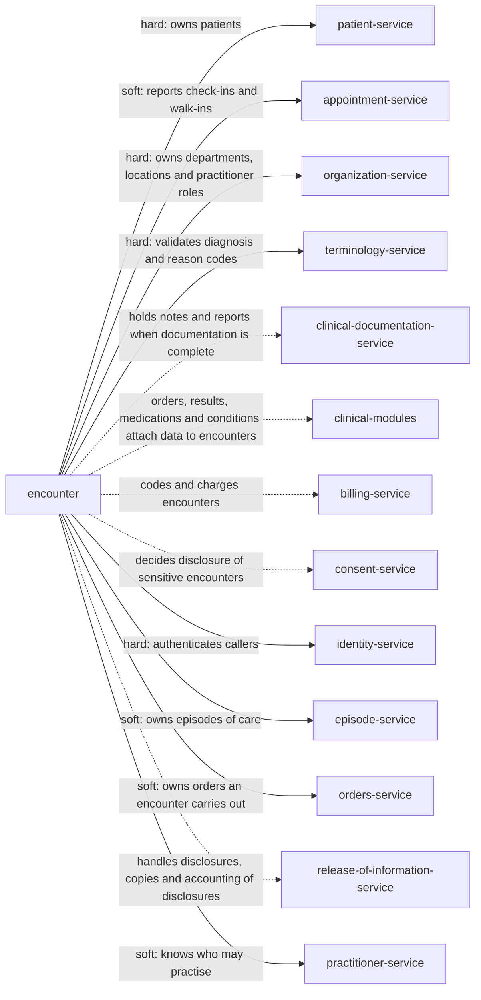

> Snapshot of healthcare/encounter version 0.1.14, saved 2026-10-09. The current version is at https://knowledge-graph-ecru.vercel.app/docs/healthcare/encounter.md.

# Clinical encounters (/docs/healthcare/encounter)

## Module identity

- module: encounter
- layer: healthcare
- extended by: Encounters (ehr, /docs/healthcare/ehr/encounter)
- version: 0.1.14
- status: draft

## How to read this spec

- This is the complete spec for this page, with every inherited item already merged in.
- If a behaviour is not listed here, it is unspecified. Do not assume or invent it. Ask, or record it as an open question.
- Ids such as BR-1, FR-2 and AC-3 are stable. Cite them in code, tests and commit messages.
- Items that start with "US only:" or "EU only:" apply only in that jurisdiction. Skip the ones for a jurisdiction your project doesn't operate in, or add ?jurisdiction=us or ?jurisdiction=eu to this URL to leave them out. Unmarked items apply everywhere.
- This is the core encounter specification: nothing is inherited, and industry and domain pages build on it.

## Purpose & scope

Keep the record of each interaction between a patient and a care provider: its class, status and period, the practitioners and locations involved, the reasons and diagnoses, and whether its record is complete. Every clinical module attaches its data to an encounter by id. Works in the United States and the European Union.

**In scope**

- Opening encounters when the module where care happens reports a check-in, walk-in, arrival or admission
- The encounter lifecycle: planned, in progress, discharged, completed, and cancelled, discontinued or entered in error
- The class of an encounter, and changes to it
- Participants with their periods
- Locations during the encounter, with their periods
- Reasons for the encounter and its diagnoses, with their role and rank
- Encounters grouped under another, such as consultations
- Record completion and locking, and amendments after locking
- Sensitive encounters, such as at a substance use disorder program
- A department's and a practitioner's open and incomplete encounters
- Links to episodes of care
- Patients' own access to their encounters, and their correction requests
- Restricting disclosure to a health plan for care paid in full
- Moving an encounter recorded on the wrong patient, and merging duplicates

**Out of scope**

- Booking. The Appointments module schedules visits; an encounter records what actually happened.
- Clinical notes, assessments, the history and physical, and discharge summaries. Clinical documentation owns them, attached to the encounter by id.
- Conditions and the problem list. The Conditions module owns them; an encounter refers to them, or carries a coded diagnosis.
- Coding for claims, diagnosis-related groups and charges. Billing owns them, using the diagnoses and class history this module gives.
- Consent to disclose sensitive records. The Consent module decides; this module flags the encounter.
- Episodes of care, such as a course of chemotherapy or a pregnancy. An Episodes module owns them; an encounter only links to them.

## Overview

### Product perspective

Solid arrows are services this module calls; dotted arrows are services it notifies.

### Actors

| Actor | Description |
| --- | --- |
| Clinician | A practitioner who cares for the patient during the encounter, such as the attending. |
| Registrar | Staff who open and correct encounters at check-in and admission. |
| Health information management (HIM) specialist | Tracks record completion, and corrects or amends locked encounters. |
| Privacy officer | Reviews who accessed encounters. |
| System | Another module, such as Appointments, reporting an event. |
| Patient | The person the encounter is about, or their personal representative within the authority the Patients module records. |

### Assumptions and dependencies

**AS-H1** The modules where care happens, such as Appointments, report check-ins, arrivals, admissions, transfers and discharges as they happen.
  - Why: An encounter records what happened. The modules where it happens tell this one.
**AS-H2** Clinical documentation reports when an encounter's documentation is complete.
  - Why: Only the module holding the notes knows whether the record is complete (BR-H7).
**AS-H3** The jurisdiction, record_completion_deadline and diagnosis_code_system settings are set with legal advice before go-live.
  - Why: Completion deadlines and code systems differ by US state, by payer and by EU member state.

## Functions

### Business rules

**BR-H1** Every encounter has one patient in use, one class and one responsible department.
  - Why: Every clinical entry is found through its encounter. An encounter without a patient or department is care nobody can find or bill.
**BR-H2** An ambulatory or virtual encounter is opened when Appointments reports a check-in or a walk-in, at the moment encounter_opens_at sets: at check-in, as planned with subject status arrived, or when a practitioner starts care, in progress. It records the appointment and reports its own id back.
  - Why: FHIR is not consistent on this: the Appointment page says the encounter "is typically created when the service starts, not when the patient arrives", and the Encounter page lets it start as arrived. Practice varies, so it is a setting; either way waiting time and care time stay separate.
**BR-H6** An encounter part of another has the same patient, except that a newborn's encounter can be part of its mother's encounter. A part's period is within its parent's, and the parent cannot be completed while a part is still open.
  - Why: FHIR groups encounters with partOf, such as a consultation during a stay, and says a child's encounter should reference the mother's encounter with partOf. A parent closed over an open part leaves care outside any complete record.
**BR-H7** A discharged encounter becomes completed only when Clinical documentation reports its documentation complete and a final diagnosis is recorded. It must happen within record_completion_deadline of actual_end; encounters past that are listed as overdue. If Clinical documentation reports documentation reopened before then, documentation_complete is cleared.
  - Why: US hospitals must record the final diagnosis and complete the medical record within 30 days after discharge (42 CFR 482.24(c)(4)(viii)). FHIR uses discharged for care that is over while the record is still being completed.
**BR-H8** A completed encounter is locked. Any later change is an amendment that records who, when, why and the previous value, and emits encounter.amended.
  - Why: Hospitals must keep record entries complete and protect their integrity (42 CFR 482.24(b)). Silent changes after completion would change a record others have relied on, including claims.
**BR-H9** A planned encounter that never starts is cancelled. An encounter that started but ended early, such as the patient leaving against advice or without being seen, is discontinued with a departure reason. Every encounter that ends records its disposition.
  - Why: FHIR separates encounters that never happened from those cut short. A patient who left is part of the record and of quality reporting, so nothing is deleted.
**BR-H10** An encounter can be marked entered in error only while no clinical data has been recorded against it (has_clinical_data unset). Otherwise its data is moved to the right encounter first.
  - Why: Discarding an encounter that holds notes or results would hide that care. Each clinical module moves its own entries.
**BR-H13** Each diagnosis has a role and a rank, and a code valid in diagnosis_code_system on the date Terminology's code_date_rule picks for diagnoses. A completed encounter has at least one discharge or billing diagnosis.
  - Why: CMS applies each fiscal year's ICD-10-CM codes to discharges and encounters from October 1 (the FY 2027 files to those from October 1, 2026). A code valid at admission may be retired by discharge.
**BR-H14** An encounter carries the sensitivity codes Organization gives for its department, such as SUD for a substance use disorder program. Data attached to it carries the same codes, and disclosure follows the Consent module.
  - Why: Records from US federally assisted substance use disorder programs have extra protection under 42 CFR Part 2, revised with a compliance date of February 16, 2026. Marking the encounter is what lets every module apply it.
**BR-H15** A virtual encounter records its connection details and where the patient is.
  - Why: In the United States a practitioner must be licensed where the patient is, as the Clinical appointments rules state.
**BR-H16** length is the time from actual_start to actual_end.
  - Why: FHIR defines length as the time the encounter lasted, less time absent. Leave counts toward neither care nor billing time.
**BR-H17** When the Patients module merges two patients, their encounters move to the remaining record; when a merge is undone, encounters recorded since the merge are listed for review.
  - Why: An encounter on a retired record disappears from the patient's history. Only a person can tell whose care a post-merge encounter was.
**BR-H18** Every view and change of an encounter is logged with who, when and what. Opening an encounter of a restricted patient needs a reason, as the Patients module requires.
  - Why: HIPAA requires audit controls (45 CFR 164.312(b)). An encounter reveals why someone was seen.
**BR-H19** Fields the service sets, such as status, class_history, length, documentation_complete, record_due_at, locked_at, amendments, has_clinical_data and revision, cannot be written by clients.
  - Why: A client writing status skips the lifecycle and its guards; one writing locked_at changes what counts as the legal record.
**BR-H20** Every change sends the revision it read, and a stale revision is rejected.
  - Why: Registrars, clinicians and HIM staff change the same encounter; without this, one silently undoes another.
**BR-H22** No encounter starts after the patient's recorded death.
  - Why: An encounter after death almost always means the wrong patient. A death recorded in error is retracted in the Patients module first.
**BR-H25** A change of responsible department keeps the encounter and adds the new department to department_history with the time it took over.
  - Why: Who was responsible at each point matters for billing, quality reporting and accountability, the same as class history.
**BR-H26** Encounters of a patient under legal hold are never erased or anonymised, even after the Patients module's retention ends.
  - Why: The Patients module stops erasure during litigation, and the encounters are the record in question.
**BR-H28** When the Patients module records a death, the patient's planned encounters are cancelled with the reason patient_deceased. Encounters in progress are ended by the module that manages them or by a clinician.
  - Why: A planned stay or visit for someone who has died would stay on lists and schedules. Encounters in progress need a person to record what happened.
**BR-H30** When Appointments undoes a check-in, the planned encounter opened for it is cancelled with the reason check_in_undone.
  - Why: The check-in was a mistake, so the visit it opened never happened.
**BR-H31** When the Patients module marks a patient entered in error, the patient's planned encounters are cancelled with the reason patient_entered_in_error.
  - Why: The record was created by mistake, so a planned visit or stay for it will never happen. Leaving it planned keeps it on lists and schedules.
**BR-H32** When the Patients module retracts a death, the encounters cancelled for it (BR-H28) are listed, and encounter.patient_review_needed is emitted for each so they can be planned again.
  - Why: A death recorded for the wrong patient must not silently cost them a planned admission. A person decides whether each one still stands.
**BR-H33** A check-in for a patient who already has an open ambulatory encounter in the same visit_grouping scope adds the appointment to that encounter instead of opening another.
  - Why: FHIR lets one encounter fulfil several appointments. A morning of blood draw, X-ray and consultation is one visit to document and bill, not three.
**BR-H34** Every encounter gets a visit number from visit_number_system when it is opened. It is never reused, and stays with the encounter through merges and amendments.
  - Why: Laboratory, radiology and billing systems match their data to a visit by its number (HL7 v2 PV1-19). A reused number would attach results to the wrong visit.
**BR-H35** An encounter records the orders it carries out, and Orders confirms each one is for the same patient.
  - Why: FHIR links an encounter to the request that initiated it (basedOn). Without the link nobody can tell whether an order was carried out.
**BR-H39** A patient, or their representative within the authority the Patients module records, can read their own encounters electronically as soon as they are recorded. No policy holds them back for review. A patient can ask for their own access to be delayed. Part of an encounter can be withheld only where a licensed professional decides access is reasonably likely to endanger life or physical safety; the decision is recorded and the patient can have it reviewed.
  - Why: HIPAA gives a right of access and allows denial on narrow reviewable grounds (45 CFR 164.524(a)(3)); a delay is likely information blocking (45 CFR 171.103); GDPR gives a right of access (Article 15), and the EHDS gives EU patients immediate access (Article 3).
**BR-H40** A patient, or their representative, can ask for an encounter to be corrected. An HIM specialist decides within the Patients module's correction_deadline, extendable once by correction_extension with a written reason. An accepted correction is made as an amendment linked to the request. A denied one gives the reason in writing, and the patient can add a statement of disagreement, which goes with later disclosures.
  - Why: HIPAA requires a decision within 60 days, with one 30-day extension, a written denial and a right to disagree (45 CFR 164.526). GDPR gives rights to rectification and to restriction while accuracy is checked (Articles 16 and 18).
**BR-H41** When the patient, or someone other than the health plan, has paid in full for the encounter's services and asks that they not be disclosed to the health plan, health_plan_restriction is set. Billing must not disclose the encounter to that plan for payment or operations unless the law requires it. The restriction is never refused.
  - Why: HIPAA requires a covered entity to agree to this restriction when the care was paid in full out of pocket and the disclosure is for payment or operations and not otherwise required by law (45 CFR 164.522(a)(1)(vi)).
**BR-H42** When a patient who requests a correction asks for the data to be restricted meanwhile, accuracy_contested is set. Everyone reading the encounter sees the contested part marked, and it is cleared when the request is decided.
  - Why: GDPR gives a right to restriction while the accuracy of personal data is checked (Article 18(1)(a)). Marking it, rather than hiding it, keeps the data available for care while warning everyone it is disputed.
**BR-H44** Each correction request is kept and linked to the encounter it concerns, with the request, any denial, any statement of disagreement and any rebuttal. It is kept for as long as the encounter, and in the United States for at least 6 years from its decision.
  - Why: HIPAA requires the request, denial, disagreement and rebuttal to be appended or linked to the record (45 CFR 164.526(d)(4)) and kept for 6 years from creation or when last in effect (45 CFR 164.530(j)(2)).
**BR-H47** An encounter recorded on the wrong patient is moved to the right patient by an HIM specialist, with a reason. It keeps its id and visit number; on a locked encounter the move is also recorded as an amendment. The move is refused if the right patient is not in use, or the move would break a rule of the module that manages a stay the encounter belongs to; such an encounter moves only with its stay.
  - Why: A visit with notes on the wrong person is a record overlay, which ONC SAFER Guide 6 counts among the most dangerous identification errors. Entered in error is refused once clinical data exists, so a move is the only fix. HL7 moves a visit between patients (A45). Clinical modules keep their entries on the encounter id, so they follow it.
**BR-H48** Two encounters of the same patient for one visit are merged by an HIM specialist, with a reason. The duplicate's appointments, locations, participants and diagnoses join the remaining encounter; the duplicate becomes entered in error with status_reason merged and merged_into set, and its visit number stays on the remaining encounter as an old identifier. encounter.merged tells clinical modules to move their entries. Encounters that belong to stays merge only when their stays merge.
  - Why: Double check-ins and patient merges create two encounters for one visit. HL7 merges visits (A42). Keeping the old visit number lets laboratory and billing messages sent with it still find the visit (BR-H34).
**BR-H49** An encounter for care given during an EHR downtime is opened afterwards with the times the care actually happened and downtime_entry set. Check-ins and arrivals replayed from other modules keep their original times, and the record due date counts from the real end of care.
  - Why: Paper records must be entered and reconciled after recovery (REF-H22); using the time of entry would misstate when care happened and shorten the time to complete the record.
**BR-H50** A practitioner is added as a participant only while the Practitioners module reports them active on the date. When it reports practitioner.suspended, their participations already recorded stay as they are, but they can't be added to encounters or start one until reinstated.
  - Why: Care by a practitioner whose licence lapsed or who is excluded is unlawful and unpaid; what they already did stays part of the record.
**BR-H51** EU only: In the European Union, a health professional reads encounters only in the categories professional_access_rules allows for their professional category, under the rules of the member state where the care takes place. Entries outside them are not shown, and the access log records that they were withheld.
  - Why: Member states must set rules on the categories of personal electronic health data accessible by different categories of health professionals or for different healthcare tasks, and the rules of the member state of treatment apply (EHDS Article 11(3) and (4)); these apply to discharge reports, results and imaging from 26 March 2031 and to patient summaries from 26 March 2029 (Article 105).

### State machine

Initial state: `planned`. States: `planned`, `in_progress`, `discharged`, `completed`, `cancelled`, `discontinued`, `entered_in_error`.
Any transition not listed below is invalid.

| From | To | Trigger | Guard |
| --- | --- | --- | --- |
| planned | in_progress | start: a practitioner begins care | - |
| planned | cancelled | cancel: the encounter never happened | - |
| in_progress | discharged | discharge or end of visit | - |
| in_progress | discontinued | the patient left before care was complete | - |
| discharged | completed | complete | documentation complete, a final diagnosis, and no open part (BR-H6, BR-H7) |
| planned | entered_in_error | mark entered in error | has_clinical_data unset |
| in_progress | entered_in_error | mark entered in error | has_clinical_data unset |
| planned | entered_in_error | merged into another encounter (BR-H48) | - |
| in_progress | entered_in_error | merged into another encounter (BR-H48) | - |
| discharged | entered_in_error | merged into another encounter (BR-H48) | - |
| completed | entered_in_error | merged into another encounter (BR-H48) | - |

### Workflows

#### Open at check-in
Actor: System
Trigger: Appointments reports appointment.checked_in

1. Create the encounter as planned, subject status arrived, with the appointment id, class and department
2. Report the encounter id to Appointments
3. Emit encounter.created

Outcome: The visit has a record before care starts, and the appointment points to it.

#### Start care
Actor: Clinician
Trigger: A practitioner begins seeing the patient

1. Set actual_start, status in progress and subject status receiving care
2. Add the practitioner as primary performer or attending
3. Report care to the Patients module
4. Emit encounter.started

Outcome: Waiting and care time are recorded separately.

#### Complete the record
Actor: Health information management (HIM) specialist
Trigger: Clinical documentation reports the documentation complete

1. Check a final diagnosis is recorded and no part is open
2. Set completed and locked_at
3. Emit encounter.completed with the diagnoses and class history for Billing

Outcome: The record is complete and locked within the deadline.

#### Amend a locked encounter
Actor: Health information management (HIM) specialist
Trigger: A locked encounter needs a correction

1. Record the new value, the previous value, who, when and why
2. Emit encounter.amended

Outcome: The record is corrected and its history kept.

### Validations

| Field | Rule | Error |
| --- | --- | --- |
| patient_id | Patients confirms a record in use | ENCOUNTER_INVALID_PATIENT |
| class | ambulatory, virtual, emergency, observation or inpatient | ENCOUNTER_INVALID_CODE |
| subject_status, priority, type, departure_reason, sensitivity | values from their code lists | ENCOUNTER_INVALID_CODE |
| department_id | Organization confirms the department exists | ENCOUNTER_INVALID_DEPARTMENT |
| appointment_ids | Appointments confirms the appointment, for the same patient | ENCOUNTER_INVALID_REFERENCE |
| part_of | an encounter for the same patient, or the mother's encounter for a newborn, whose period contains this one | ENCOUNTER_INVALID_PARENT |
| planned_start, actual_start, actual_end | RFC 3339 instants; actual_end not before actual_start; actual times not in the future | ENCOUNTER_INVALID_PERIOD |
| participants | a role code and a practitioner the Practitioners module reports active, who holds a role in the department on the date; one attending at a time for inpatient and observation | ENCOUNTER_INVALID_PARTICIPANT |
| locations | Organization confirms the location; at most one active; period within the encounter's | ENCOUNTER_INVALID_LOCATION |
| reasons, diagnoses | a code valid in its code system on the right date (BR-H13), or a Condition reference; diagnoses have a role and a rank of 1 or more | ENCOUNTER_INVALID_DIAGNOSIS |
| virtual_service, patient_location | an https URL, and a US state or EU member state; required for class virtual | ENCOUNTER_INVALID_VIRTUAL |
| id, status, class_history, length, documentation_complete, record_due_at, locked_at, amendments, has_clinical_data, revision, health_plan_restriction, access_denial, accuracy_contested, correction_requests, merged_into | never sent by clients (BR-H19) | ENCOUNTER_READ_ONLY_FIELD |
| revision | matches the current revision | ENCOUNTER_REVISION_CONFLICT |
| actual_start | not after the patient's recorded death (BR-H22) | ENCOUNTER_PATIENT_DECEASED |
| episode_of_care_ids | Episodes confirms each episode, for the same patient | ENCOUNTER_INVALID_REFERENCE |
| department_history | never sent by clients (BR-H25) | ENCOUNTER_READ_ONLY_FIELD |
| identifiers | a visit number in visit_number_system, unique and never reused | ENCOUNTER_READ_ONLY_FIELD |
| based_on | Orders confirms each order, for the same patient | ENCOUNTER_INVALID_REFERENCE |
| planned_end | an RFC 3339 instant not before actual_start or planned_start | ENCOUNTER_INVALID_PERIOD |
| account_ids | set by the service from Billing, never sent by clients | ENCOUNTER_READ_ONLY_FIELD |
| status_reason | required to cancel, mark entered in error, move or merge; a code from cancel_reasons, or a service-set code | ENCOUNTER_REASON_REQUIRED |

### Edge cases

**EC-H1** A patient checks in at 09:00 and is seen at 10:10.
  - Required behaviour: The encounter is planned with subject status arrived from 09:00, and actual_start is 10:10.
  - Covered by: BR-H2, AC-H1
**EC-H6** A discharged encounter has no final diagnosis 25 days after discharge.
  - Required behaviour: It cannot be completed, and it is listed as due in 5 days; after 30 days it is overdue.
  - Covered by: BR-H7, AC-H8
**EC-H7** A coder finds a wrong discharge diagnosis after the encounter is locked.
  - Required behaviour: The HIM specialist amends it with a reason; the previous code is kept and encounter.amended is emitted.
  - Covered by: BR-H8, AC-H9
**EC-H8** A consultation encounter part of a stay is still open when the stay is completed.
  - Required behaviour: Completing the stay fails with ENCOUNTER_OPEN_PARTS until the consultation is closed.
  - Covered by: BR-H6, AC-H6
**EC-H9** An encounter is opened for the wrong patient and a nurse has already recorded vital signs.
  - Required behaviour: Marking it entered in error fails with ENCOUNTER_HAS_CLINICAL_DATA; the vital signs are moved first.
  - Covered by: BR-H10, AC-H11
**EC-H11** A patient is seen at the organization's substance use disorder program.
  - Required behaviour: The encounter carries SUD sensitivity, and its notes and results inherit it.
  - Covered by: BR-H14, AC-H14
**EC-H12** The patient's record is merged into another while a stay is open.
  - Required behaviour: The stay moves to the remaining patient and keeps its id.
  - Covered by: BR-H17, AC-H15
**EC-H15** A baby is born during the mother's stay.
  - Required behaviour: The baby's encounter is part of the mother's encounter, though the patients differ.
  - Covered by: BR-H6, AC-H31
**EC-H17** A patient dies during an encounter.
  - Required behaviour: The module managing the encounter, or a clinician, ends it with disposition expired; the Patients module records the death. A later encounter for that patient fails with ENCOUNTER_PATIENT_DECEASED.
  - Covered by: BR-H22, AC-H33
**EC-H20** A patient moves from the medicine service to surgery.
  - Required behaviour: department_history records both, and encounter.department_changed is emitted.
  - Covered by: BR-H25, AC-H36
**EC-H21** The patient's records are under legal hold when retention ends.
  - Required behaviour: The encounters are kept.
  - Covered by: BR-H26, AC-H37
**EC-H22** A patient with a pre-admission for next week dies today.
  - Required behaviour: The planned encounter is cancelled with reason patient_deceased.
  - Covered by: BR-H28, AC-H40
**EC-H24** The front desk undoes a wrong check-in.
  - Required behaviour: The planned encounter is cancelled and encounter.cancelled is emitted.
  - Covered by: BR-H30, AC-H42
**EC-H25** A record created by mistake has a pre-admission next week.
  - Required behaviour: When Patients marks it entered in error, the planned encounter is cancelled with reason patient_entered_in_error.
  - Covered by: BR-H31, AC-H43
**EC-H26** A death recorded for the wrong patient cancelled their pre-admission, and the death is retracted.
  - Required behaviour: The cancelled encounter is listed and encounter.patient_review_needed is emitted so it can be planned again.
  - Covered by: BR-H32, AC-H44
**EC-H27** A patient has a 09:00 blood draw and a 10:30 consultation in the same department.
  - Required behaviour: With visit_grouping per_department_day, the consultation check-in joins the morning's encounter and encounter.appointment_added is emitted.
  - Covered by: BR-H33, AC-H45
**EC-H28** An MRI order is carried out in an outpatient encounter.
  - Required behaviour: The encounter records the order, and Orders learns it was done from encounter.completed.
  - Covered by: BR-H35, AC-H47
**EC-H33** A patient reads their encounter notes in the portal the evening after a clinic visit.
  - Required behaviour: They see them at once; nothing waits for clinician review.
  - Covered by: BR-H39, AC-H53
**EC-H34** A patient pays cash for a sensitive test so their employer-sponsored plan won't learn of it.
  - Required behaviour: The restriction is set and Billing never sends that encounter to the plan.
  - Covered by: BR-H41, AC-H55
**EC-H35** A patient disputes a mental health diagnosis on a past visit and asks that it be restricted while it is checked.
  - Required behaviour: The diagnosis stays available for care but is marked as disputed everywhere until the HIM specialist decides.
  - Covered by: BR-H42, AC-H56
**EC-H39** A laboratory result arrives with the visit number of an encounter that was merged yesterday.
  - Required behaviour: The old visit number is found on the remaining encounter, so the result files to the right visit.
  - Covered by: BR-H48, AC-H63
**EC-H40** A clinic visit with a signed note was registered on the patient's twin.
  - Required behaviour: The encounter is moved to the right twin; the note follows the encounter, and the move is an amendment because the encounter was locked.
  - Covered by: BR-H47, AC-H62
**EC-H41** Appointments retries appointment.checked_in after a timeout.
  - Required behaviour: The retry carries the same Idempotency-Key and returns the encounter opened the first time; no second encounter opens.
  - Covered by: FR-H12, AC-H23
**EC-H42** An encounter runs from 01:00 to 03:30 local time on the night clocks go back.
  - Required behaviour: Times are stored as UTC instants, so length is 3 hours 30 minutes of real time, not the 2 hours 30 minutes the wall clock suggests.
  - Covered by: BR-H16, CON-H3, AC-H28
**EC-H43** A consumer receives encounter.updated at revision 6 after one at revision 7.
  - Required behaviour: It ignores revision 6, because each event carries the revision and a lower one is older.
  - Covered by: DG-H2
**EC-H44** Patients are seen during a ransomware outage and the EHR returns two days later.
  - Required behaviour: Each encounter is entered with the real times of care and downtime_entry set; Appointments replays its check-ins with their original times.
  - Covered by: BR-H49, AC-H72

## Data

### Data model

| Field | Type | Required | Description | Constraints |
| --- | --- | --- | --- | --- |
| id | string | yes | The encounter id. Never changes or is reused. | set by the service |
| identifiers | identifier[] | yes | Numbers other systems use for the encounter, such as the visit number (HL7 v2 PV1-19, FHIR Encounter.identifier). | a visit number from visit_number_system assigned when opened, never reused; a merged duplicate's visit number stays on the remaining encounter as an old identifier; codes: identifier type from HL7 v2 Table 0203 (VN visit number, AN account number) |
| patient_id | string | yes | The patient, owned by the Patients module. | a record in use; follows replaced_by after a merge |
| status | enum | yes | Where the encounter is in its lifecycle. | planned \| in_progress \| discharged \| completed \| cancelled \| discontinued \| entered_in_error; changed only through operations; codes: FHIR R5 EncounterStatus (in-progress, on-hold, entered-in-error) |
| status_reason | reason | no | Why a planned encounter was cancelled, or an encounter marked entered in error: a code and optional text. Separate from reasons, which say why the encounter takes place. | required with status cancelled or entered_in_error; patient_deceased, patient_entered_in_error, check_in_undone, admission_cancelled and merged are set by the service; staff choose from cancel_reasons; codes: none standard, local to this specification (FHIR R5 Encounter has no status reason element) |
| subject_status | enum | no | Where the patient is in the encounter. | arrived \| triaged \| receiving_care \| on_leave \| departed; codes: HL7 encounter-subject-status (receiving-care, on-leave) |
| class | enum | yes | The setting. | ambulatory \| virtual \| emergency \| observation \| inpatient; codes: HL7 v3 ActCode AMB, VR, EMER, OBSENC, IMP |
| class_history | class change[] | no | Every class the encounter had, with the time each began, such as observation then inpatient (FHIR EncounterHistory). | append-only; set by the service |
| type | code | no | The specific kind of encounter, such as a follow-up or a day surgery. | codes: encounter_type_codes |
| priority | code | no | How urgent the encounter is. | codes: HL7 v3 ActPriority, such as EM emergency, R routine, UR urgent |
| department_id | string | yes | The department responsible, owned by the Organization module (FHIR serviceProvider). | - |
| department_history | department stay[] | no | Every department responsible for the encounter, with the time each took over. | append-only; set by the service (BR-H25) |
| appointment_ids | string[] | no | The appointments this encounter fulfils, owned by Appointments (FHIR Encounter.appointment). One visit can cover several same-day appointments. | set from appointment.checked_in; each for the same patient |
| part_of | string | no | The encounter this one is part of, such as the stay a consultation happened in (FHIR partOf). | same patient, or the mother's encounter for a newborn (BR-H6); its period within the parent's |
| planned_start | instant | no | When the encounter is expected to start. | - |
| planned_end | instant | no | The expected discharge or end (FHIR plannedEndDate), such as from a pending discharge. | - |
| actual_start | instant | no | When care began. | set by Start |
| actual_end | instant | no | When care ended. | set by Discharge or End |
| length | duration | no | How long the encounter lasted, less time on leave (FHIR length). | derived |
| participants | participant[] | no | Practitioners involved, each with role and period. | codes: role from HL7 v3 ParticipationType: ATND attending, ADM admitter, CON consultant, DIS discharger, REF referrer, PPRF primary performer, SPRF secondary performer |
| locations | location stay[] | no | Locations the patient has been in, each with an entry id, period and status, owned by the Organization module. The id lets a past movement be corrected. | status planned \| active \| reserved \| completed (FHIR): planned for a move that hasn't happened yet, reserved for a place held while the patient is elsewhere; at most one active |
| reasons | reason[] | no | Why the encounter takes place, coded or as a reference to a Condition. | codes: reason_code_system |
| diagnoses | diagnosis[] | no | Diagnoses relevant to the encounter, each a code or a Condition reference, with role and rank. | codes: diagnosis_code_system for the code; role from HL7 diagnosis-role: AD admission, DD discharge, CC chief complaint, CM comorbidity, pre-op, post-op, billing |
| virtual_service | connection details | no | How to join a virtual encounter. | an https URL |
| patient_location | string | no | Where the patient is during a virtual encounter: a US state or an EU member state. | required for class virtual |
| sensitivity | code[] | no | Kinds of information needing extra protection, such as a substance use disorder program. | codes: HL7 v3 ActCode SUD, PSY, HIV, SDV, SEX (sexuality and reproductive health) |
| documentation_complete | boolean | no | Set when Clinical documentation reports the documentation is complete, and cleared if it reports it reopened before the encounter completes. | set by the service |
| record_due_at | instant | no | When the record must be complete: actual_end plus record_completion_deadline. | derived |
| locked_at | instant | no | When the encounter was completed and locked. | set by the service |
| amendments | amendment[] | no | Changes after locking, with who, when, why and the previous value. | append-only; set by the service |
| disposition | code | no | Where the patient went, or the setting they left to, when the encounter ended, such as home or another facility. | set when the encounter is discharged or discontinued; codes: HL7 discharge-disposition (such as home, other-hcf, hosp, snf, aadvice, exp) |
| departure_reason | code | no | Why an encounter ended early, such as left without being seen or left against advice. | codes: local list departure_reasons, mapped to HL7 discharge-disposition aadvice where it applies |
| has_clinical_data | boolean | no | Set when another module reports data recorded against the encounter. | set by the service |
| revision | integer | yes | Increases with every change. A change sends the revision it read. | set by the service |
| episode_of_care_ids | string[] | no | Episodes of care this encounter belongs to, owned by the Episodes module (FHIR episodeOfCare). | - |
| based_on | string[] | no | Orders this encounter carries out, owned by Orders (FHIR Encounter.basedOn ServiceRequest). | - |
| account_ids | string[] | no | Billing accounts for the encounter, owned by Billing (FHIR Encounter.account). | set by the service from Billing |
| health_plan_restriction | boolean | no | Set when the patient paid in full for this encounter's services and asked that it not be disclosed to their health plan. | set by the service through its operation |
| access_denial | access denial | no | Where a licensed professional decided the patient's access to part of this encounter is reasonably likely to endanger life or physical safety: what is withheld, who decided, why, and the review. | set by the service through its operation |
| accuracy_contested | boolean | no | Set while the patient contests the accuracy of part of the encounter and asked for it to be restricted until the correction request is decided. | set by the service through correction requests |
| correction_requests | correction request[] | no | Requests to correct part of the encounter: what was asked and by whom, when, the deadline and any extension, the decision and its reason, any statement of disagreement and rebuttal, and who was told (BR-H44). | set by the service through correction requests |
| merged_into | string | no | The encounter this duplicate was merged into (BR-H48). | set by the service; set only with status entered_in_error |
| downtime_entry | boolean | no | Set when the encounter was recorded on paper during an EHR downtime and entered afterwards. | set when staff enter a record made on paper during a downtime, with its original times; never changed afterwards |

### Relationships

| Edge | Target | Note |
| --- | --- | --- |
| belongs_to | patient | 1: patient_id (FHIR Encounter.subject 0..1, required here) |
| has_many | appointment | 0..*: appointment_ids; one visit can cover several appointments (FHIR Encounter.appointment 0..*) |
| belongs_to | encounter | 0..1: part_of, such as the stay a consultation happened in (FHIR partOf 0..1) |
| has_many | encounter | 0..*: encounters part of this one |
| belongs_to | department | 1: department_id, owned by Organization (FHIR serviceProvider 0..1, required here) |
| has_many | practitioner | 0..*: participants with role and period (FHIR participant.actor) |
| has_many | location | 0..*: locations with period and status, owned by Organization (FHIR Encounter.location 0..*) |
| has_many | episode_of_care | 0..*: episode_of_care_ids, owned by Episodes (FHIR episodeOfCare 0..*) |
| has_many | order | 0..*: based_on, owned by Orders (FHIR basedOn 0..*) |
| has_many | account | 0..*: account_ids, owned by Billing (FHIR Encounter.account 0..*) |
| exposes_to | clinical-documentation | notes and results attach by encounter id |
| can_trigger | event:encounter.completed | - |

## External interfaces

### API

#### Open an encounter: `POST /encounters`
Open an encounter from a check-in, walk-in, emergency arrival or admission. Accepts a retry key.
- Success: 201
- Actor: System
- Input: patient, class, department, and optional appointments, orders, episodes, part_of, planned start, type, priority, reasons, location, virtual service and patient location, and downtime_entry with the original time when entering a paper record from a downtime
- Result: the encounter
- Errors: ENCOUNTER_INVALID_PATIENT, ENCOUNTER_INVALID_CODE, ENCOUNTER_INVALID_DEPARTMENT, ENCOUNTER_INVALID_REFERENCE, ENCOUNTER_INVALID_PARENT, ENCOUNTER_INVALID_PERIOD, ENCOUNTER_INVALID_LOCATION, ENCOUNTER_INVALID_VIRTUAL, ENCOUNTER_READ_ONLY_FIELD, ENCOUNTER_IDEMPOTENCY_KEY_REUSED, ENCOUNTER_PATIENT_DECEASED, ENCOUNTER_DEPENDENCY_UNAVAILABLE

#### Get an encounter: `GET /encounters/{id}`
Read an encounter. A restricted patient's encounter needs a reason.
- Success: 200
- Actor: Clinician
- Input: encounter id; a reason where required
- Result: the encounter, as JSON or a FHIR Encounter
- Errors: ENCOUNTER_NOT_FOUND, ENCOUNTER_NOT_AUTHORISED_FOR_PATIENT, ENCOUNTER_REASON_REQUIRED, ENCOUNTER_DEPENDENCY_UNAVAILABLE

#### List encounters: `GET /encounters`
Encounters by patient, department, practitioner, status and date.
- Success: 200
- Actor: Clinician
- Input: filters; limit and cursor
- Result: encounters in time order
- Errors: ENCOUNTER_INVALID_QUERY, ENCOUNTER_DEPENDENCY_UNAVAILABLE

#### Update an encounter: `PATCH /encounters/{id}`
Change type, priority, reasons, episodes, department or virtual details of an open encounter. A department change is added to department_history.
- Success: 200
- Actor: Registrar
- Input: encounter id, revision, the fields to change
- Result: the encounter
- Errors: ENCOUNTER_NOT_FOUND, ENCOUNTER_LOCKED, ENCOUNTER_REVISION_CONFLICT, ENCOUNTER_INVALID_CODE, ENCOUNTER_INVALID_DEPARTMENT, ENCOUNTER_INVALID_VIRTUAL, ENCOUNTER_READ_ONLY_FIELD, ENCOUNTER_DEPENDENCY_UNAVAILABLE

#### Start an encounter: `POST /encounters/{id}/start`
Record that care began.
- Success: 200
- Actor: Clinician
- Input: encounter id, revision, start time
- Result: the encounter
- Errors: ENCOUNTER_NOT_FOUND, ENCOUNTER_INVALID_TRANSITION, ENCOUNTER_INVALID_PERIOD, ENCOUNTER_REVISION_CONFLICT, ENCOUNTER_PATIENT_DECEASED, ENCOUNTER_DEPENDENCY_UNAVAILABLE

#### Record subject status: `POST /encounters/{id}/subject-status`
Record where the patient is in the encounter, such as triaged.
- Success: 200
- Actor: System
- Input: encounter id, revision, subject status
- Result: the encounter
- Errors: ENCOUNTER_NOT_FOUND, ENCOUNTER_INVALID_CODE, ENCOUNTER_LOCKED, ENCOUNTER_REVISION_CONFLICT, ENCOUNTER_DEPENDENCY_UNAVAILABLE

#### Change participants: `POST /encounters/{id}/participants`
Add a participant, or end one's period.
- Success: 200
- Actor: Clinician
- Input: encounter id, revision, practitioner, role, start or end
- Result: the encounter
- Errors: ENCOUNTER_NOT_FOUND, ENCOUNTER_INVALID_PARTICIPANT, ENCOUNTER_LOCKED, ENCOUNTER_REVISION_CONFLICT, ENCOUNTER_DEPENDENCY_UNAVAILABLE

#### Record a location: `POST /encounters/{id}/locations`
Record the patient's new location, completing the previous one.
- Success: 200
- Actor: System
- Input: encounter id, revision, location, start
- Result: the encounter
- Errors: ENCOUNTER_NOT_FOUND, ENCOUNTER_INVALID_LOCATION, ENCOUNTER_LOCKED, ENCOUNTER_REVISION_CONFLICT, ENCOUNTER_DEPENDENCY_UNAVAILABLE

#### Record diagnoses: `PUT /encounters/{id}/diagnoses`
Add, rank or remove diagnoses.
- Success: 200
- Actor: Clinician
- Input: encounter id, revision, diagnoses with role and rank
- Result: the encounter
- Errors: ENCOUNTER_NOT_FOUND, ENCOUNTER_INVALID_DIAGNOSIS, ENCOUNTER_LOCKED, ENCOUNTER_REVISION_CONFLICT, ENCOUNTER_DEPENDENCY_UNAVAILABLE

#### Discharge or end: `POST /encounters/{id}/discharge`
End care: discharge a stay or end a visit, with disposition and destination where they apply.
- Success: 200
- Actor: System
- Input: encounter id, revision, end time, disposition, destination
- Result: the encounter
- Errors: ENCOUNTER_NOT_FOUND, ENCOUNTER_INVALID_TRANSITION, ENCOUNTER_INVALID_PERIOD, ENCOUNTER_INVALID_CODE, ENCOUNTER_REVISION_CONFLICT, ENCOUNTER_DEPENDENCY_UNAVAILABLE

#### Discontinue: `POST /encounters/{id}/discontinue`
End an encounter early with a departure reason.
- Success: 200
- Actor: System
- Input: encounter id, revision, departure reason, time
- Result: the encounter
- Errors: ENCOUNTER_NOT_FOUND, ENCOUNTER_INVALID_TRANSITION, ENCOUNTER_INVALID_CODE, ENCOUNTER_REVISION_CONFLICT, ENCOUNTER_DEPENDENCY_UNAVAILABLE

#### Cancel: `POST /encounters/{id}/cancel`
Cancel a planned encounter that never started.
- Success: 200
- Actor: Registrar
- Input: encounter id, revision, status reason (a code and optional text)
- Result: the encounter
- Errors: ENCOUNTER_NOT_FOUND, ENCOUNTER_INVALID_TRANSITION, ENCOUNTER_REASON_REQUIRED, ENCOUNTER_INVALID_CODE, ENCOUNTER_REVISION_CONFLICT, ENCOUNTER_DEPENDENCY_UNAVAILABLE

#### Complete: `POST /encounters/{id}/complete`
Complete and lock an encounter whose record is complete.
- Success: 200
- Actor: Health information management (HIM) specialist
- Input: encounter id, revision
- Result: the locked encounter
- Errors: ENCOUNTER_NOT_FOUND, ENCOUNTER_INVALID_TRANSITION, ENCOUNTER_RECORD_INCOMPLETE, ENCOUNTER_OPEN_PARTS, ENCOUNTER_REVISION_CONFLICT, ENCOUNTER_DEPENDENCY_UNAVAILABLE

#### Amend: `POST /encounters/{id}/amendments`
Change a locked encounter, keeping the previous value.
- Success: 201
- Actor: Health information management (HIM) specialist
- Input: encounter id, revision, field, new value, reason
- Result: the amendment
- Errors: ENCOUNTER_NOT_FOUND, ENCOUNTER_NOT_LOCKED, ENCOUNTER_INVALID_DIAGNOSIS, ENCOUNTER_REVISION_CONFLICT, ENCOUNTER_DEPENDENCY_UNAVAILABLE

#### Mark entered in error: `POST /encounters/{id}/entered-in-error`
Retire an encounter opened by mistake with no clinical data.
- Success: 200
- Actor: Health information management (HIM) specialist
- Input: encounter id, revision, status reason (a code and optional text)
- Result: the encounter
- Errors: ENCOUNTER_NOT_FOUND, ENCOUNTER_HAS_CLINICAL_DATA, ENCOUNTER_INVALID_TRANSITION, ENCOUNTER_REASON_REQUIRED, ENCOUNTER_INVALID_CODE, ENCOUNTER_REVISION_CONFLICT, ENCOUNTER_DEPENDENCY_UNAVAILABLE

#### Move to another patient: `POST /encounters/{id}/move`
Move an encounter recorded on the wrong patient to the right one.
- Success: 200
- Actor: Health information management (HIM) specialist
- Input: encounter id, revision, the right patient, reason
- Result: the encounter
- Errors: ENCOUNTER_NOT_FOUND, ENCOUNTER_INVALID_PATIENT, ENCOUNTER_BELONGS_TO_STAY, ENCOUNTER_REASON_REQUIRED, ENCOUNTER_REVISION_CONFLICT, ENCOUNTER_DEPENDENCY_UNAVAILABLE

#### Merge duplicate encounters: `POST /encounters/{id}/merge`
Merge a duplicate encounter into the encounter that remains.
- Success: 200
- Actor: Health information management (HIM) specialist
- Input: remaining encounter id and revision, duplicate encounter id and revision, reason
- Result: the remaining encounter
- Errors: ENCOUNTER_NOT_FOUND, ENCOUNTER_INVALID_MERGE, ENCOUNTER_BELONGS_TO_STAY, ENCOUNTER_REASON_REQUIRED, ENCOUNTER_REVISION_CONFLICT, ENCOUNTER_DEPENDENCY_UNAVAILABLE

#### Report clinical data: `POST /encounters/{id}/clinical-data`
Tell this module that data was recorded against the encounter, or that documentation is complete.
- Success: 202
- Actor: System
- Input: encounter id, module, data recorded or documentation complete
- Result: accepted
- Errors: ENCOUNTER_NOT_FOUND, ENCOUNTER_DEPENDENCY_UNAVAILABLE

#### List records due: `GET /encounters/records-due`
Discharged encounters not yet completed, by due date.
- Success: 200
- Actor: Health information management (HIM) specialist
- Input: optional department, practitioner, overdue only; limit and cursor
- Result: encounters with record_due_at
- Errors: ENCOUNTER_INVALID_QUERY, ENCOUNTER_DEPENDENCY_UNAVAILABLE

#### Read the access log: `GET /encounters/{id}/access-log`
Every view and change of an encounter.
- Success: 200
- Actor: Privacy officer
- Input: encounter id; limit and cursor
- Result: entries with who, when, what and reason
- Errors: ENCOUNTER_NOT_FOUND, ENCOUNTER_DEPENDENCY_UNAVAILABLE

#### Request a correction: `POST /encounters/{id}/correction-requests`
Ask for an encounter to be corrected.
- Success: 201
- Actor: Patient
- Input: encounter id, what is wrong, the correct value, whether to restrict meanwhile
- Result: the request with its due date
- Errors: ENCOUNTER_NOT_FOUND, ENCOUNTER_NOT_AUTHORISED_FOR_PATIENT, ENCOUNTER_DEPENDENCY_UNAVAILABLE

#### Decide a correction: `POST /encounters/{id}/correction-requests/{requestId}/decision`
Accept, deny or extend a correction request, or add a statement of disagreement.
- Success: 200
- Actor: Health information management (HIM) specialist
- Input: request id, decision (accept, deny or extend), reason, statement of disagreement
- Result: the request
- Errors: ENCOUNTER_CORRECTION_NOT_FOUND, ENCOUNTER_CORRECTION_CLOSED, ENCOUNTER_EXTENSION_USED, ENCOUNTER_DEPENDENCY_UNAVAILABLE

#### Restrict disclosure to the health plan: `POST /encounters/{id}/health-plan-restriction`
Record that care was paid in full and the patient asked that it not be disclosed to their health plan.
- Success: 200
- Actor: Registrar
- Input: encounter id, revision, who paid, confirmation of payment in full
- Result: the encounter
- Errors: ENCOUNTER_NOT_FOUND, ENCOUNTER_REVISION_CONFLICT, ENCOUNTER_DEPENDENCY_UNAVAILABLE

#### Withhold part of an encounter: `POST /encounters/{id}/access-denial`
Record a licensed professional's decision that access to part of the encounter is reasonably likely to endanger life or physical safety.
- Success: 200
- Actor: Clinician
- Input: encounter id, revision, what is withheld, reason
- Result: the encounter
- Errors: ENCOUNTER_NOT_FOUND, ENCOUNTER_REVISION_CONFLICT, ENCOUNTER_DEPENDENCY_UNAVAILABLE

### API conventions

| Topic | Convention | Reference |
| --- | --- | --- |
| Authentication | Every request carries the caller's identity from Identity. Permissions are checked against it (Permission matrix). | - |
| Errors | Errors use problem details (application/problem+json) with a code member, such as ENCOUNTER_LOCKED. | RFC 9457 |
| Pagination | Lists are cursor-based: limit and an optional cursor in, next_cursor out. | - |
| Concurrency | Every change sends the revision it read. A stale revision fails with ENCOUNTER_REVISION_CONFLICT (BR-H20). | - |
| Retries | Every change accepts an Idempotency-Key header; a retry returns the original result (FR-H12). | IETF draft-ietf-httpapi-idempotency-key-header |
| Times | Instants are RFC 3339 timestamps in UTC (CON-H3). | RFC 3339 |
| FHIR | GET /encounters/{id} returns an HL7 FHIR R5 Encounter when the request asks for application/fhir+json (FR-H11). | - |
| Versioning | Additive changes don't change the version. A breaking change ships as a new major version with Deprecation and Sunset headers. | RFC 9745, RFC 8594 |

### Events

| Event | Description | Payload |
| --- | --- | --- |
| encounter.created | An encounter was opened. | encounter_id, patient_id, class, appointment_ids, revision |
| encounter.started | Care began. | encounter_id, actual_start, revision |
| encounter.updated | Details changed; names the fields, not their values. | encounter_id, changed_fields, revision |
| encounter.participant_changed | A participant was added or ended. | encounter_id, revision |
| encounter.location_changed | The patient moved. | encounter_id, location_id, revision |
| encounter.discharged | Care ended; the record is being completed. | encounter_id, actual_end, disposition, record_due_at, revision |
| encounter.discontinued | The encounter ended early. | encounter_id, departure_reason, revision |
| encounter.cancelled | A planned encounter never happened. | encounter_id, status_reason, revision |
| encounter.completed | The record is complete and locked. | encounter_id, revision |
| encounter.amended | A locked encounter was changed. | encounter_id, changed_fields, revision |
| encounter.entered_in_error | The encounter was opened by mistake. | encounter_id, status_reason, revision |
| encounter.record_overdue | The record passed record_due_at. | encounter_id, record_due_at, revision |
| encounter.patient_review_needed | Someone must check this encounter: after a patient merge was undone, or after a death that cancelled it was retracted. | encounter_id, revision |
| encounter.department_changed | Another department took over responsibility. | encounter_id, department_id, effective_at, revision |
| encounter.appointment_added | Another same-day appointment was added to the encounter. | encounter_id, appointment_id, revision |
| encounter.correction_decided | A correction request was accepted or denied, with any statement of disagreement. | encounter_id, request_id, decision, revision |
| encounter.restriction_changed | The paid-in-full health plan restriction was set. | encounter_id, health_plan_restriction, revision |
| encounter.accuracy_contested | The patient contests part of the encounter, or the contest was resolved. | encounter_id, accuracy_contested, revision |
| encounter.moved | An encounter was moved to the right patient. | encounter_id, patient_id, previous_patient_id, revision |
| encounter.merged | A duplicate encounter was merged into this one; clinical modules move their entries. | encounter_id, merged_encounter_id, revision |

### Event delivery

**DG-H1** Events are published at least once; consumers drop one with a source and id they have seen.
  - Why: A relay can publish twice after a crash. CloudEvents defines source plus id as the duplicate check.
**DG-H2** Events for one encounter can arrive out of order; each carries the revision, and consumers ignore a lower one.
  - Why: Brokers and retries don't guarantee order.
**DG-H3** Events carry ids, codes and changed field names, never diagnoses text, notes or the patient's details. Consumers read the encounter.
  - Why: Events fan out widely. This follows the minimum necessary standard (45 CFR 164.502(b)) and keeps sensitive encounters out of logs.
**DG-H4** Every event carries a unique id, its type, the encounter it is about, when the change happened, and the revision.
  - Why: Consumers order and deduplicate by these, and need the time of the change rather than the time they received it. CloudEvents defines id, type and time for every event.

### Errors

| Code | HTTP | Meaning |
| --- | --- | --- |
| ENCOUNTER_NOT_FOUND | 404 | No encounter exists with that id. |
| ENCOUNTER_INVALID_QUERY | 422 | Filter by at least a patient, department, practitioner or date. |
| ENCOUNTER_INVALID_PATIENT | 422 | The patient doesn't exist or the record isn't in use. |
| ENCOUNTER_INVALID_CODE | 422 | A code isn't in the allowed list for its field. |
| ENCOUNTER_INVALID_DEPARTMENT | 422 | That department doesn't exist. |
| ENCOUNTER_INVALID_REFERENCE | 422 | The appointment doesn't exist or is for another patient. |
| ENCOUNTER_INVALID_PARENT | 422 | The parent encounter must be for the same patient and contain this period. |
| ENCOUNTER_INVALID_PERIOD | 422 | The end must not be before the start, and actual times must not be in the future. |
| ENCOUNTER_INVALID_PARTICIPANT | 422 | The participant needs a role and a role in the department, and only one attending at a time. |
| ENCOUNTER_INVALID_LOCATION | 422 | The location doesn't exist, or its period is outside the encounter's. |
| ENCOUNTER_INVALID_DIAGNOSIS | 422 | The code isn't valid on the date that applies, or a role or rank is missing. |
| ENCOUNTER_INVALID_VIRTUAL | 422 | A virtual encounter needs an https URL and where the patient is. |
| ENCOUNTER_READ_ONLY_FIELD | 422 | That field is set by the service and can't be written. |
| ENCOUNTER_REVISION_CONFLICT | 409 | The encounter changed since you read it. Read it again and retry. |
| ENCOUNTER_IDEMPOTENCY_KEY_REUSED | 422 | That Idempotency-Key was used for a different request. |
| ENCOUNTER_INVALID_TRANSITION | 409 | The encounter's status doesn't allow that change. |
| ENCOUNTER_LOCKED | 409 | The encounter is completed and locked. Amend it instead. |
| ENCOUNTER_NOT_LOCKED | 409 | Only a completed encounter is amended; change an open one directly. |
| ENCOUNTER_RECORD_INCOMPLETE | 409 | Documentation must be complete and a final diagnosis recorded. |
| ENCOUNTER_OPEN_PARTS | 409 | Close the encounters that are part of this one first. |
| ENCOUNTER_HAS_CLINICAL_DATA | 409 | Clinical data is recorded against this encounter. Move it first. |
| ENCOUNTER_REASON_REQUIRED | 422 | Give a reason for cancelling or marking entered in error. |
| ENCOUNTER_DEPENDENCY_UNAVAILABLE | 503 | A service this request needs is unavailable. Retry later. |
| ENCOUNTER_PATIENT_DECEASED | 409 | The encounter can't start after the patient's recorded death. |
| ENCOUNTER_NOT_AUTHORISED_FOR_PATIENT | 403 | Only the patient or their personal representative can request this. |
| ENCOUNTER_CORRECTION_NOT_FOUND | 404 | No such correction request. |
| ENCOUNTER_CORRECTION_CLOSED | 409 | This correction request was already decided. |
| ENCOUNTER_EXTENSION_USED | 409 | The one allowed extension was already used. |
| ENCOUNTER_BELONGS_TO_STAY | 409 | This encounter belongs to a stay. Move or merge the stay in the module that manages it. |
| ENCOUNTER_INVALID_MERGE | 409 | Only two encounters of the same patient can be merged. |

### Dependencies

Each dependency lists its contract: only what this module needs from it (upstream) or gives it (downstream). How the other module works is out of scope.

| Service | Direction | Criticality | Reason | Contract |
| --- | --- | --- | --- | --- |
| patient-service | upstream | hard | owns patients | Asks: does this patient exist and is the record in use, following replaced_by?; Asks: may this person act for this patient, and is the patient's own access delayed at their request?; Asks: correction_deadline and correction_extension for this jurisdiction; Asks: is the patient deceased, and since when?; Asks: is this newborn's mother this patient? (for part_of); Asks: is the patient restricted, so opening needs a reason?; Gives: care reported when an encounter starts; Receives: patient.merged, patient.unmerged, patient.deceased, patient.death_retracted, patient.entered_in_error and patient.legal_hold_changed |
| appointment-service | upstream | soft | reports check-ins and walk-ins | Gives: encounter.moved and encounter.merged, so linked entries follow the encounter; Receives: appointment.checked_in; Receives: appointment.check_in_undone; Receives: appointment.encounter_linked, confirming the link Appointments recorded; Gives: encounter.appointment_added, when a check-in joins an open encounter; Gives: encounter.started, encounter.discontinued, encounter.cancelled and encounter.entered_in_error, so the appointment follows its encounter; Gives: the id of the encounter it opened; Gives: encounter.created, so Appointments links the encounter; Booking and the appointment lifecycle are Appointments' concern |
| organization-service | upstream | hard | owns departments, locations and practitioner roles | Asks: does this department or location exist?; Asks: does this practitioner hold a role in this department on this date?; Asks: which sensitivity codes apply to this department? |
| terminology-service | upstream | hard | validates diagnosis and reason codes | Asks: is this code valid in this code system on this date?; Asks: which codes the value set bound to each coded setting allows on this date |
| clinical-documentation-service | downstream | soft | holds notes and reports when documentation is complete | Gives: encounter.moved and encounter.merged, so linked entries follow the encounter; Receives: documentation.completed, documentation.reopened and documentation.data_recorded; Gives: encounter.started, encounter.discharged, encounter.completed, encounter.cancelled, encounter.entered_in_error and encounter.amended, so notes open, are required and lock with the encounter; Gives: encounter.patient_review_needed after an undone patient merge; Gives: encounter.record_overdue, for the responsible practitioner's deficiency list; Discharge summaries and reports are Clinical documentation's concern |
| clinical-modules | downstream | soft | orders, results, medications and conditions attach data to encounters | Gives: encounter.moved and encounter.merged, so linked entries follow the encounter; Gives: encounter.location_changed, so entries record where care happened; Gives: encounter.created, encounter.updated, encounter.participant_changed and encounter.entered_in_error, and the sensitivity codes to carry; Receives: data recorded against the encounter; Gives: encounter.patient_review_needed after an undone patient merge; Gives: encounter.accuracy_contested, so modules showing encounter data mark it as disputed; Moving entries to another encounter is each module's concern |
| billing-service | downstream | soft | codes and charges encounters | Gives: encounter.moved and encounter.merged, so linked entries follow the encounter; Asks: which account does this encounter belong to? (account_ids); Gives: encounter.completed with diagnoses, class history and length; Gives: encounter.amended, encounter.cancelled, encounter.discontinued, encounter.department_changed; Gives: encounter.restriction_changed; a restricted encounter is never disclosed to that health plan for payment or operations (45 CFR 164.522(a)(1)(vi)); Coding for claims and diagnosis-related groups is Billing's concern |
| consent-service | downstream | soft | decides disclosure of sensitive encounters | Gives: the sensitivity codes of each encounter; Gives: encounter.restriction_changed, so other disclosures honour it; Disclosure decisions, including under 42 CFR Part 2, are Consent's concern |
| identity-service | upstream | hard | authenticates callers | Asks: who is the caller, and do they hold this permission? |
| episode-service | upstream | soft | owns episodes of care | Asks: does this episode exist for this patient?; Managing episodes is the Episodes module's concern |
| orders-service | upstream | soft | owns orders an encounter carries out | Asks: does this order exist for this patient?; Gives: encounter.started, encounter.completed and encounter.cancelled with the orders they carry out; Order status is Orders' concern |
| release-of-information-service | downstream | soft | handles disclosures, copies and accounting of disclosures | Gives: this module's part of a copy request (45 CFR 164.524, GDPR Article 15); Gives: this module's data for a single-patient electronic health information export (45 CFR 170.315(b)(10)); producing the export is Release of information's concern; Gives: encounter.correction_decided, with any statement of disagreement, to include with later disclosures (45 CFR 164.526(d)(5)); Accounting of disclosures (45 CFR 164.528) and copies in other forms are Release of information's concern |
| practitioner-service | upstream | soft | knows who may practise | Asks: is this practitioner active on this date?; Receives: practitioner.suspended, practitioner.reinstated and practitioner.merged; Credentialing is the Practitioners module's concern |

## Security

### Permission matrix

| Action | Clinician | Registrar | Health information management (HIM) specialist | Privacy officer | System | Patient | Permission |
| --- | --- | --- | --- | --- | --- | --- | --- |
| Get or list encounters | own | any | any | none | any | own | encounter.read |
| Open an encounter | any | any | none | none | any | none | encounter.write |
| Start, update, change participants, record diagnoses | own | any | none | none | none | none | encounter.write |
| Record subject status, a location, a class change, hold, discharge or discontinue | own | none | none | none | any | none | encounter.write |
| Cancel, or cancel a discharge | none | any | none | none | any | none | encounter.write |
| Complete, amend, mark entered in error, move or merge | none | none | any | none | none | none | encounter.complete |
| Report clinical data | none | none | none | none | any | none | encounter.write |
| List records due | own | none | any | none | none | none | encounter.read |
| Read the access log | none | none | none | any | none | none | encounter.audit |
| Request a correction | none | none | none | none | none | own | encounter.read |
| Decide a correction | none | none | any | none | none | none | encounter.complete |
| Restrict disclosure to the health plan | none | any | any | none | none | none | encounter.write |
| Withhold part of an encounter | own | none | none | none | none | none | encounter.write |

any: every appointment. own: appointments the actor takes part in. none: not allowed.

- Get or list encounters: own: encounters of patients in their care. Restricted patients need a reason (BR-H18). Patients and their representatives read their own encounters, except parts withheld under BR-H39.

- Record subject status, a location, a class change, hold, discharge or discontinue: Usually reported by the module where care happens, such as Appointments.

- Report clinical data: Only modules that record clinical data.

- Restrict disclosure to the health plan: Recorded at the patient's request.

- Withhold part of an encounter: Only a licensed professional caring for the patient.

### Permissions

| Permission | Grants |
| --- | --- |
| encounter.read | Read encounters. |
| encounter.write | Open, start, update and end encounters, and change participants, locations and diagnoses. |
| encounter.complete | Complete, amend and mark encounters entered in error. |
| encounter.audit | Read the access log. |

### Privacy and retention

| Field | Category | Purpose | Retention |
| --- | --- | --- | --- |
| patient_id, class, class_history, type, priority, department_id, department_history, appointment_ids, part_of, episode_of_care_ids, identifiers, based_on, account_ids, planned_end | health data; shows the person received care, where and of what kind | The record of care | record_retention of the Patients module |
| planned_start, actual_start, actual_end, length, status, subject_status | health data | When care happened | record_retention of the Patients module |
| reasons, diagnoses | health data | Care, quality reporting and billing | record_retention of the Patients module |
| departure_reason, disposition | health data; reveals origin, destination and outcome | The stay's admission and discharge | record_retention of the Patients module |
| participants, locations | personal and health data | Who was responsible, and where the patient was | record_retention of the Patients module |
| sensitivity | special category; reveals the kind of care | Applying extra protection | record_retention of the Patients module |
| virtual_service, patient_location | personal | Joining and licensing a virtual encounter | record_retention of the Patients module |
| documentation_complete, record_due_at, locked_at, amendments, has_clinical_data, revision, status_reason, merged_into, downtime_entry | record metadata about the patient's care | Record completion and integrity | record_retention of the Patients module |
| access log | personal | Access review | access_log_retention of the Patients module |
| health_plan_restriction, access_denial, correction_requests, accuracy_contested | health data | Honouring the patient's rights over the encounter | record_retention of the Patients module; correction requests, in the United States, at least 6 years from their decision (BR-H44) |

### Compliance

**CMP-H2** HIPAA Privacy Rule, 45 CFR 164.502(b): US only: Use and disclose only the minimum necessary.
  - How it's met: Events carry ids, codes and changed field names only.
  - Status: met
  - Covered by: DG-H3
**CMP-H3** HIPAA Security Rule, 45 CFR 164.312(b): US only: Audit controls.
  - How it's met: Every view and change is logged and readable by a privacy officer.
  - Status: met
  - Covered by: BR-H18, FR-H10
**CMP-H4** HIPAA Security Rule, 45 CFR 164.312(a)(2)(iv) and (e): US only: Encryption at rest and in transit.
  - How it's met: Encounter data is encrypted in transit and at rest.
  - Status: met
  - Covered by: CON-H1
**CMP-H5** 42 CFR Part 2, 42 CFR 2.13 and 2.31: US only: Protect substance use disorder program records and disclose them only with the required consent.
  - How it's met: Sensitivity codes from Organization travel with every attached entry; Consent decides disclosure.
  - Status: met
  - Covered by: BR-H14
**CMP-H8** GDPR (EU) 2016/679, Article 5(1)(c): EU only: Data minimisation.
  - How it's met: Events carry no diagnoses text, notes or patient details.
  - Status: met
  - Covered by: DG-H3
**CMP-H9** GDPR (EU) 2016/679, Article 9(2)(h) and 17(3)(c): EU only: Process and keep health data for care.
  - How it's met: Retention and legal holds follow the Patients module.
  - Status: met
  - Covered by: BR-H26
**CMP-H10** GDPR (EU) 2016/679, Article 32: EU only: Security appropriate to the risk.
  - How it's met: Encryption, access logging and reasons for restricted patients.
  - Status: met
  - Covered by: CON-H1, BR-H18
**CMP-H11** GDPR (EU) 2016/679, Articles 30, 33 to 35 and 37: EU only: Records of processing, breach notification, impact assessment and a data protection officer.
  - How it's met: Organisational duties of the deployment.
  - Status: deployment
**CMP-H12** HIPAA Privacy Rule, 45 CFR 164.524: US only: Give patients access to their information, denying only on narrow reviewable grounds.
  - How it's met: Immediate electronic access for the patient and representatives; withheld parts recorded and reviewable.
  - Status: met
  - Covered by: BR-H39
**CMP-H13** 21st Century Cures Act information blocking, 45 CFR 171.103: US only: Don't interfere with access to electronic health information.
  - How it's met: No review delay; delays only at the patient's request.
  - Status: met
  - Covered by: BR-H39
**CMP-H14** HIPAA Privacy Rule, 45 CFR 164.526: US only: Decide amendment requests within 60 days, with written denials and statements of disagreement.
  - How it's met: Correction requests decided within the Patients module's deadlines; disagreements go with later disclosures. Requests are kept linked to the encounter with any denial, disagreement and rebuttal.
  - Status: met
  - Covered by: BR-H40, BR-H44
**CMP-H15** HIPAA Privacy Rule, 45 CFR 164.522(a)(1)(vi): US only: Agree to restrict disclosure to a health plan for care paid in full out of pocket.
  - How it's met: health_plan_restriction, honoured by Billing.
  - Status: met
  - Covered by: BR-H41
**CMP-H16** HIPAA Privacy Rule, 45 CFR 164.528: US only: Give an accounting of disclosures for six years.
  - How it's met: The Release of information module.
  - Status: other module
**CMP-H17** HIPAA Breach Notification Rule, 45 CFR 164.404: US only: Notify individuals of a breach within 60 calendar days.
  - How it's met: The Security module.
  - Status: other module
**CMP-H18** GDPR (EU) 2016/679, Articles 12(3) and 15: EU only: Give access within one month.
  - How it's met: Immediate electronic access.
  - Status: met
  - Covered by: BR-H39
**CMP-H19** GDPR (EU) 2016/679, Articles 16 and 18: EU only: Rectification, and restriction while accuracy is checked.
  - How it's met: Correction requests, and accuracy_contested while accuracy is checked.
  - Status: met
  - Covered by: BR-H40, BR-H42
**CMP-H20** GDPR (EU) 2016/679, Article 17: EU only: Erasure, except where data is needed for care (Article 17(3)(c)).
  - How it's met: Erasure follows the Patients module's retention and legal holds.
  - Status: met
  - Covered by: BR-H26
**CMP-H21** European Health Data Space (EU) 2025/327, Article 3: EU only: Immediate access to health data through national access services.
  - How it's met: Immediate access here; delivery to the national service is the Exchange module's.
  - Status: partly met
  - Covered by: BR-H39
**CMP-H22** HIPAA Privacy Rule, 45 CFR 164.530(j): US only: Keep required documentation for 6 years from its creation or when it was last in effect, whichever is later.
  - How it's met: Correction requests are kept with the encounter, and at least 6 years from their decision in the US.
  - Status: met
  - Covered by: BR-H44
**CMP-H23** ONC Health IT Certification, 45 CFR 170.315(b)(10): US only: Certified health IT lets a user export all of one patient's electronic health information at any time.
  - How it's met: This module gives its data for the export; Release of information produces it.
  - Status: other module
**CMP-H24** HIPAA Security Rule, 45 CFR 164.312(c)(1): US only: Protect electronic health information from improper alteration or destruction.
  - How it's met: Completed encounters are locked; later changes, moves and merges are amendments or recorded events, never silent edits.
  - Status: met
  - Covered by: BR-H8, BR-H47, BR-H48
**CMP-H25** GDPR (EU) 2016/679, Article 6(1): EU only: Processing health data needs a lawful basis under Article 6 as well as an exception under Article 9.
  - How it's met: The deployment states its basis with Article 9(2)(h): usually a legal obligation (6(1)(c)) or a public task (6(1)(e)) for public hospitals, or a contract (6(1)(b)) for private care.
  - Status: deployment
**CMP-H26** GDPR (EU) 2016/679, Articles 44 to 49: EU only: Transfers of personal data outside the EU need an adequacy decision or appropriate safeguards.
  - How it's met: Where data is stored and who processes it is a deployment choice.
  - Status: deployment
**CMP-H27** Section 504 and Section 1557 (Affordable Care Act), 45 CFR 84.84 and 92.204: US only: Patient-facing web content and mobile apps meet WCAG 2.1 Level AA from 11 May 2027 (May 2028 for providers with fewer than 15 employees).
  - How it's met: Patient-facing screens, messages and documents are built to WCAG 2.1 AA; testing them is the deployment's duty.
  - Status: deployment
  - Covered by: BR-H39
**CMP-H28** NIS2 Directive (EU) 2022/2555, Articles 21 and 23: EU only: Healthcare providers that are essential or important entities manage cybersecurity risk and report significant incidents within 24 hours, with an update within 72 hours and a final report within a month.
  - How it's met: Access logging and encryption here support it; risk management and reporting are the organization's.
  - Status: deployment
  - Covered by: BR-H18, CON-H1
**CMP-H29** European Health Data Space (EU) 2025/327, Article 11(3) and (4): EU only: Health professionals access only the categories of health data member-state rules allow for their professional category, under the rules of the member state of treatment.
  - How it's met: professional_access_rules applied to every read.
  - Status: met
  - Covered by: BR-H51
**CMP-H30** 21st Century Cures Act information blocking, 45 CFR 171.206: US only: A provider may limit access to, exchange of or use of reproductive health information to reduce the patient's or care providers' exposure to legal action, tailored, under a policy or case-by-case decision, and giving way to the patient's explicit request.
  - How it's met: Records are labelled with the SEX sensitivity code and every event carries it; deciding what to withhold is Consent's.
  - Status: other module
  - Covered by: BR-H14
**CMP-H31** ONC Health IT Certification, 45 CFR 170.315(g)(10) and 170.215: US only: Certified health IT serves single-patient searches and group export through a FHIR R4 API with US Core, SMART App Launch and Bulk Data.
  - How it's met: FR-H16: the US Core API for this module's resources; app registration and authorization are Identity's.
  - Status: partly met
  - Covered by: FR-H16

## Requirements

### Functional requirements

| ID | Requirement | Priority | Verified by |
| --- | --- | --- | --- |
| FR-H1 | The service must open encounters from check-ins, walk-ins, emergency arrivals and admissions, and report the encounter id back. | must | test |
| FR-H2 | The service must move encounters through their lifecycle only by the transitions in the state machine. | must | test |
| FR-H3 | The service must record participants and locations with their periods. | must | test |
| FR-H4 | The service must record reasons and diagnoses, validating codes on the right date. | must | test |
| FR-H5 | The service must complete and lock encounters only when their record is complete, and list encounters due and overdue. | must | test |
| FR-H6 | The service must record amendments to locked encounters with their history. | must | test |
| FR-H7 | The service must group encounters with part_of, and keep parts within their parent. | should | test |
| FR-H8 | The service must flag sensitive encounters and give the flags to every module that attaches data. | must | test |
| FR-H9 | The service must list encounters by patient, department, practitioner, status and date. | must | test |
| FR-H10 | The service must log every view and change, and let a privacy officer read the log. | must | test |
| FR-H11 | The service must export an encounter as an HL7 FHIR R5 Encounter resource. | must | test |
| FR-H12 | The service must accept an Idempotency-Key on every change, so a retried event never opens a second encounter. | must | test |
| FR-H13 | The service must fail fast with ENCOUNTER_DEPENDENCY_UNAVAILABLE when Patients or Organization cannot be reached. | must | test |
| FR-H14 | The service must record why an encounter was cancelled or entered in error, separately from why it took place. | must | test |
| FR-H15 | The service must move an encounter to another patient and merge duplicate encounters, keeping every visit number. | must | test |
| FR-H16 | US only: In the United States, the service must serve Encounter through a FHIR R4.0.1 API conforming to the US Core version 45 CFR 170.215(b)(1) adopts (STU 6.1.0, or a later version ONC approves): the search interactions the US Core Server CapabilityStatement marks mandatory for a single patient, and group export through FHIR Bulk Data Access 1.0.0. This API runs on FHIR R4 even though the module maps to FHIR R5 elsewhere; apps are authorized by Identity with SMART App Launch 2.0.0. | must | demonstration |

### Performance requirements

| Id | Indicator | Target | Measured as |
| --- | --- | --- | --- |
| PERF-H1 | Records completed on time | 100% | Share of discharged encounters completed before record_due_at, per month. |
| PERF-H2 | Encounter opening delay | Set by each deployment as an SLO | 99th percentile time between a check-in, arrival or admission event and the encounter id being reported back. |
| PERF-H3 | Read availability | Set by each deployment as an SLO | Share of encounter reads that succeed over a rolling 30 days. |
| PERF-H4 | Duplicate encounters | 0 | Encounters opened twice for one check-in, arrival or admission. Any non-zero value is a defect (FR-H12). |

### Quality attributes

| Category | Requirement |
| --- | --- |
| compatibility | Encounters map onto HL7 FHIR R5 Encounter: status to status, subject_status to subjectStatus, class to class, and class_history to EncounterHistory. |
| security | Only people involved in the patient's care, or with a role that needs it, can read an encounter, and every read is logged. |
| reliability | An encounter change is acknowledged only after it is committed together with its events. |
| availability | Opening an encounter never waits on Billing, Consent or Clinical documentation. |
| portability | No requirement depends on a particular database, language or framework. |
| usability | Patient-facing screens, messages and documents meet WCAG 2.1 Level AA, and work with assistive technology. |
| compatibility | US only: In the United States, a FHIR R4.0.1 API with US Core STU 6.1.0 is served alongside the FHIR R5 mapping, because certification adopts R4 (45 CFR 170.215(a)). |

### Design constraints

**CON-H1** Encounter data is encrypted in transit and at rest.
  - Why: GDPR Article 32 lists encryption as a security measure, and HIPAA treats it as an addressable safeguard (45 CFR 164.312).
**CON-H2** Coded fields use the code systems named in the data model, and local codes are mapped to them before data leaves this module.
  - Why: Billing, reporting and exchange all assume these code systems.
**CON-H3** Times are RFC 3339 instants in UTC.
  - Why: Stays cross daylight saving changes; instants keep length correct.

### Configuration

| Setting | Type | Default | Description |
| --- | --- | --- | --- |
| jurisdiction | us \| eu | none | Which legal regime applies. Required. |
| record_completion_deadline | duration | none | Time after actual_end to complete the record. 30 days for US hospitals (42 CFR 482.24(c)(4)(viii)); stricter where state law or medical staff bylaws require; set per member state in the EU. Required. |
| diagnosis_code_system | code system | none | ICD-10-CM in the United States, using the fiscal year release in effect on the date that applies (FY 2027 from October 1, 2026); ICD-10 or ICD-11 per EU member state. Required. |
| reason_code_system | code system | none | Code system for reasons, such as SNOMED CT or diagnosis_code_system. Required. |
| encounter_type_codes | code list | none | The deployment's encounter types, such as follow-up or day surgery. Required. |
| departure_reasons | code list | none | Reasons an encounter is discontinued, such as left without being seen or left against advice. Required. |
| encounter_opens_at | check_in \| care_start | check_in | When an ambulatory or virtual encounter is opened (BR-H2). FHIR sources differ, so each hospital chooses. |
| visit_grouping | per_appointment \| per_department_day \| per_facility_day | per_department_day | Which same-day appointments share one encounter. |
| visit_number_system | identifier system | none | The system visit numbers are assigned in, and their format. Required. |
| cancel_reasons | code list | patient_request, scheduled_in_error, duplicate, other | Reasons staff can give when cancelling an encounter or marking it entered in error. other needs text. |
| professional_access_rules | map | none | EU only: Which categories of health data each category of health professional may read, such as physicians, nurses or physiotherapists, as the member state of treatment sets. Empty by default, meaning every professional caring for the patient may read everything their role allows. |

## Verification

### Acceptance criteria

**AC-H1**
- Given appointment.checked_in at 09:00
- When Appointments reports it, and care starts at 10:10
- Then the encounter is created planned with subject status arrived and the appointment id, its id is reported back, encounter.created is emitted, then actual_start is 10:10, it is in progress and encounter.started is emitted
- Verifies: BR-H2, FR-H1

**AC-H6**
- Given a stay with an open consultation part
- When the stay is completed
- Then the request fails with ENCOUNTER_OPEN_PARTS and HTTP 409; a part whose period is outside its parent fails with ENCOUNTER_INVALID_PARENT and HTTP 422
- Verifies: BR-H6, FR-H7

**AC-H8**
- Given a discharged encounter without a final diagnosis
- When it is completed, then a discharge diagnosis is added and documentation reported complete, reopened and complete again
- Then the first fails with ENCOUNTER_RECORD_INCOMPLETE and HTTP 409; the reopen clears documentation_complete; then it completes, is locked and encounter.completed is emitted; past record_due_at an incomplete one emits encounter.record_overdue
- Verifies: BR-H7, FR-H5

**AC-H9**
- Given a completed encounter
- When its discharge diagnosis is changed directly, then through an amendment with a reason
- Then the direct change fails with ENCOUNTER_LOCKED and HTTP 409; the amendment keeps the previous value and emits encounter.amended
- Verifies: BR-H8, FR-H6

**AC-H11**
- Given an encounter with has_clinical_data set, and one without
- When each is marked entered in error
- Then the first fails with ENCOUNTER_HAS_CLINICAL_DATA and HTTP 409; the second becomes entered in error and encounter.entered_in_error is emitted
- Verifies: BR-H10

**AC-H14**
- Given Organization marks the addiction clinic SUD
- When an encounter opens there
- Then its sensitivity is SUD and modules attaching data receive it
- Verifies: BR-H14, FR-H8

**AC-H15**
- Given patient S with an open stay
- When Patients merges S into T, and later undoes it
- Then the stay moves to T with the same id; after the undo, encounters recorded since the merge are listed and encounter.patient_review_needed is emitted
- Verifies: BR-H17

**AC-H17**
- Given a planned encounter
- When it is cancelled, and a completed one is cancelled
- Then the first becomes cancelled with encounter.cancelled; the second fails with ENCOUNTER_INVALID_TRANSITION and HTTP 409
- Verifies: BR-H9, FR-H2

**AC-H18**
- Given no encounter E-404, and a patient that does not exist
- When E-404 is read, and an encounter is opened for the patient
- Then they fail with ENCOUNTER_NOT_FOUND (404) and ENCOUNTER_INVALID_PATIENT (422)
- Verifies: BR-H1

**AC-H19**
- Given an encounter for department D-999, an invalid class, and an appointment for another patient
- When each is sent
- Then they fail with ENCOUNTER_INVALID_DEPARTMENT and HTTP 422, ENCOUNTER_INVALID_CODE and HTTP 422 and ENCOUNTER_INVALID_REFERENCE, all HTTP 422
- Verifies: BR-H1

**AC-H21**
- Given an encounter at revision 3
- When two changes send revision 3, and one sends status
- Then one succeeds; the other fails with ENCOUNTER_REVISION_CONFLICT (409); the status change fails with ENCOUNTER_READ_ONLY_FIELD (422)
- Verifies: BR-H20, BR-H19

**AC-H22**
- Given an open encounter
- When its type is changed
- Then encounter.updated is emitted naming the changed field
- Verifies: FR-H3

**AC-H23**
- Given an encounter that opened successfully
- When the same event is retried with the same Idempotency-Key, and the key is reused with different details
- Then the first returns the same encounter; the second fails with ENCOUNTER_IDEMPOTENCY_KEY_REUSED (422)
- Verifies: FR-H12

**AC-H24**
- Given a privacy officer, and a restricted patient's encounter
- When the officer reads the access log, and a clinician opens the encounter without a reason
- Then the log lists every view and change; the clinician fails with ENCOUNTER_REASON_REQUIRED (403)
- Verifies: BR-H18, FR-H10

**AC-H25**
- Given Organization unreachable
- When a transfer is reported
- Then it fails with ENCOUNTER_DEPENDENCY_UNAVAILABLE (503)
- Verifies: FR-H13

**AC-H26**
- Given any encounter
- When it is exported
- Then the result is a valid FHIR R5 Encounter resource
- Verifies: FR-H11, CON-H2

**AC-H27**
- Given encounters across departments
- When a department's open encounters are listed for today
- Then only that department's are returned, in time order
- Verifies: FR-H9

**AC-H28**
- Given encounter data in storage and in transit, and times across a daylight saving change
- When they are inspected
- Then data is encrypted and length is correct across the change
- Verifies: CON-H1, CON-H3

**AC-H29**
- Given a list request with no patient, department, practitioner or date
- When it is sent
- Then it fails with ENCOUNTER_INVALID_QUERY and HTTP 422
- Verifies: FR-H9

**AC-H30**
- Given an open encounter
- When an amendment is sent for it
- Then it fails with ENCOUNTER_NOT_LOCKED and HTTP 409; the change is made with Update an encounter instead
- Verifies: BR-H8, FR-H6

**AC-H31**
- Given a mother's stay, and her newborn registered with mother_patient_id
- When the newborn's encounter is opened part of the mother's
- Then it is accepted; part of an unrelated patient's encounter fails with ENCOUNTER_INVALID_PARENT and HTTP 422
- Verifies: BR-H6

**AC-H33**
- Given a patient who died yesterday
- When an encounter is opened for them starting today
- Then it fails with ENCOUNTER_PATIENT_DECEASED and HTTP 409
- Verifies: BR-H22

**AC-H36**
- Given an open encounter in medicine
- When its department changes to surgery
- Then department_history holds both with their times, encounter.department_changed is emitted, and a client sending department_history fails with ENCOUNTER_READ_ONLY_FIELD and HTTP 422
- Verifies: BR-H25

**AC-H37**
- Given a patient under legal hold whose retention has ended
- When retention is applied
- Then their encounters are kept unchanged
- Verifies: BR-H26

**AC-H39**
- Given an encounter linked to an episode for another patient
- When it is saved
- Then it fails with ENCOUNTER_INVALID_REFERENCE and HTTP 422
- Verifies: FR-H3

**AC-H40**
- Given a patient with a planned encounter and one in progress
- When Patients reports their death
- Then the planned one is cancelled with reason patient_deceased; the one in progress is unchanged
- Verifies: BR-H28

**AC-H42**
- Given a planned encounter opened at check-in
- When Appointments reports appointment.check_in_undone
- Then the encounter is cancelled and encounter.cancelled is emitted
- Verifies: BR-H30

**AC-H43**
- Given a patient with a planned encounter
- When Patients marks the patient entered in error
- Then the encounter is cancelled with reason patient_entered_in_error and encounter.cancelled is emitted
- Verifies: BR-H31

**AC-H44**
- Given a planned encounter cancelled with reason patient_deceased
- When Patients retracts the death
- Then encounter.patient_review_needed is emitted for it
- Verifies: BR-H32

**AC-H45**
- Given visit_grouping per_department_day and an open encounter from a 09:00 check-in
- When the same patient checks in at 10:30 in that department
- Then no new encounter opens; the appointment is added and encounter.appointment_added is emitted
- Verifies: BR-H33

**AC-H46**
- Given any new encounter
- When it is opened
- Then it has a visit number in visit_number_system that no other encounter has had; a client sending identifiers fails with ENCOUNTER_READ_ONLY_FIELD and HTTP 422
- Verifies: BR-H34

**AC-H47**
- Given an order for another patient
- When it is linked to an encounter
- Then it fails with ENCOUNTER_INVALID_REFERENCE (422)
- Verifies: BR-H35

**AC-H51**
- Given encounter_opens_at care_start
- When an outpatient checks in, then is seen
- Then no encounter exists at check-in; it opens in progress when care starts
- Verifies: BR-H2

**AC-H53**
- Given a patient, their representative, and another patient
- When each reads the patient's discharged encounter
- Then the patient and representative see it at once; the other patient fails with ENCOUNTER_NOT_AUTHORISED_FOR_PATIENT (403); a withheld part is not shown and the patient sees that it was withheld and how to have it reviewed
- Verifies: BR-H39

**AC-H54**
- Given a correction request for a wrong discharge diagnosis
- When it is denied with a reason and the patient files a statement of disagreement; another is extended twice; an unknown request id is decided
- Then the first is decided before its due date and encounter.correction_decided is emitted; the second extension fails with ENCOUNTER_EXTENSION_USED (409); deciding the first again fails with ENCOUNTER_CORRECTION_CLOSED (409); the unknown id fails with ENCOUNTER_CORRECTION_NOT_FOUND (404)
- Verifies: BR-H40

**AC-H55**
- Given a patient who paid in full for a visit
- When they ask that it not go to their health plan
- Then health_plan_restriction is set, encounter.restriction_changed is emitted, and Billing does not send the encounter to that plan
- Verifies: BR-H41

**AC-H56**
- Given a patient contesting a discharge diagnosis
- When they request a correction and ask for restriction meanwhile, and the request is later decided
- Then accuracy_contested is set and encounter.accuracy_contested is emitted; readers see the diagnosis marked as disputed; on the decision it is cleared and encounter.accuracy_contested is emitted again; a client sending accuracy_contested fails with ENCOUNTER_READ_ONLY_FIELD and HTTP 422
- Verifies: BR-H42

**AC-H57**
- Given a planned encounter, and a patient whose check-in is undone
- When a registrar cancels the first without a reason, then with scheduled_in_error, and Appointments undoes the check-in
- Then the first attempt fails with ENCOUNTER_REASON_REQUIRED (422); the cancel records status_reason scheduled_in_error and leaves reasons unchanged; the second encounter is cancelled with check_in_undone; encounter.cancelled carries each status reason
- Verifies: BR-H30, FR-H14

**AC-H59**
- Given US only: jurisdiction us and a correction request denied with a statement of disagreement
- When the encounter is read, and retention is applied 5 years after the decision
- Then the request, denial and statement are linked to the encounter; the request is still kept
- Verifies: BR-H44

**AC-H62**
- Given a completed outpatient encounter with notes recorded on the wrong patient, and an inpatient encounter that belongs to a stay
- When an HIM specialist moves each with a reason
- Then the first keeps its id and visit number, an amendment is recorded and encounter.moved is emitted; the second fails with ENCOUNTER_BELONGS_TO_STAY (409)
- Verifies: BR-H47, FR-H15

**AC-H63**
- Given two ambulatory encounters for the same patient from a double check-in, with visit numbers V100 and V101, and an encounter of another patient
- When V101 is merged into V100, and the other patient's encounter is merged into V100
- Then V101 becomes entered in error with status_reason merged and merged_into, V100 lists V101 as an old identifier, and encounter.merged is emitted; the second fails with ENCOUNTER_INVALID_MERGE (409)
- Verifies: BR-H48, FR-H15

**AC-H65**
- Given an ambulatory encounter on 30 September and an ICD-10-CM code valid only from 1 October
- When the code is recorded as a diagnosis
- Then it fails with ENCOUNTER_INVALID_CODE and HTTP 422, because the code is checked on the encounter date
- Verifies: BR-H13, FR-H4

**AC-H66**
- Given a virtual encounter
- When it is opened without connection details or the patient's location, then with both
- Then the first fails with ENCOUNTER_INVALID_VIRTUAL and HTTP 422; the second records both
- Verifies: BR-H15

**AC-H67**
- Given an ambulatory encounter from 09:10 to 09:40
- When it ends
- Then length is 30 minutes
- Verifies: BR-H16

**AC-H68**
- Given an in-progress ambulatory encounter
- When a participant is added without a role, then with one; a location outside the encounter period is recorded, then a valid one
- Then the participant fails with ENCOUNTER_INVALID_PARTICIPANT and HTTP 422, then is added and encounter.participant_changed is emitted; the location fails with ENCOUNTER_INVALID_LOCATION and HTTP 422, then is recorded and encounter.location_changed is emitted
- Verifies: FR-H3, BR-H1

**AC-H69**
- Given an in-progress ambulatory encounter
- When it is ended with an end time before its start, then correctly, and another is discontinued because the patient left
- Then the first fails with ENCOUNTER_INVALID_PERIOD and HTTP 422; then it is discharged and encounter.discharged is emitted with record_due_at; the other is discontinued with its departure reason and encounter.discontinued is emitted
- Verifies: BR-H9, FR-H2

**AC-H70**
- Given an ambulatory encounter
- When a diagnosis is recorded without a role, then with a role, rank and valid code
- Then the first fails with ENCOUNTER_INVALID_DIAGNOSIS and HTTP 422; the second is recorded
- Verifies: BR-H13, FR-H4

**AC-H71**
- Given an ambulatory encounter
- When it is opened with a department Organization doesn't know, then a consultation is opened with part_of naming another patient's encounter
- Then the first fails with ENCOUNTER_INVALID_DEPARTMENT and HTTP 422; the second fails with ENCOUNTER_INVALID_PARENT and HTTP 422
- Verifies: BR-H1, BR-H6

**AC-H72**
- Given a visit from 09:10 to 09:40 during a downtime
- When it is entered at 14:00
- Then actual_start is 09:10, actual_end 09:40, downtime_entry is set, and record_due_at counts from 09:40
- Verifies: BR-H49

**AC-H73**
- Given an ambulatory visit where the patient is sent to the emergency department
- When it is ended with disposition hosp
- Then the encounter is discharged with disposition hosp, and encounter.discharged carries it
- Verifies: BR-H9

**AC-H74**
- Given a practitioner the Practitioners module has suspended
- When they are added to an ambulatory encounter
- Then it fails with ENCOUNTER_INVALID_PARTICIPANT and HTTP 422; their earlier participations are unchanged
- Verifies: BR-H50

**AC-H75**
- Given EU only: professional_access_rules letting physiotherapists read progress notes but not psychiatric notes
- When a physiotherapist caring for the patient lists the patient's records, then opens a psychiatric note directly
- Then the list omits the psychiatric note, and opening it fails with ENCOUNTER_NOT_FOUND and HTTP 404; the access log records the withheld read
- Verifies: BR-H51

**AC-H76**
- Given US only: a SMART app authorized for one patient, and a system client authorized for a group
- When the app searches Encounter for that patient with the US Core mandatory parameters, and the client starts a group export
- Then the searches return FHIR R4 resources conforming to the US Core profiles, and the export returns NDJSON files for the group
- Verifies: FR-H16

### Traceability matrix

| Id | Verified by |
| --- | --- |
| BR-H1 | AC-H18, AC-H19, AC-H68, AC-H71 |
| BR-H2 | AC-H1, AC-H51 |
| BR-H6 | AC-H6, AC-H31, AC-H71 |
| BR-H7 | AC-H8 |
| BR-H8 | AC-H9, AC-H30 |
| BR-H9 | AC-H17, AC-H69, AC-H73 |
| BR-H10 | AC-H11 |
| BR-H13 | AC-H65, AC-H70 |
| BR-H14 | AC-H14 |
| BR-H15 | AC-H66 |
| BR-H16 | AC-H67 |
| BR-H17 | AC-H15 |
| BR-H18 | AC-H24 |
| BR-H19 | AC-H21 |
| BR-H20 | AC-H21 |
| BR-H22 | AC-H33 |
| BR-H25 | AC-H36 |
| BR-H26 | AC-H37 |
| BR-H28 | AC-H40 |
| BR-H30 | AC-H42, AC-H57 |
| BR-H31 | AC-H43 |
| BR-H32 | AC-H44 |
| BR-H33 | AC-H45 |
| BR-H34 | AC-H46 |
| BR-H35 | AC-H47 |
| BR-H39 | AC-H53 |
| BR-H40 | AC-H54 |
| BR-H41 | AC-H55 |
| BR-H42 | AC-H56 |
| BR-H44 | AC-H59 |
| BR-H47 | AC-H62 |
| BR-H48 | AC-H63 |
| BR-H49 | AC-H72 |
| BR-H50 | AC-H74 |
| BR-H51 | AC-H75 |
| FR-H1 | AC-H1 |
| FR-H2 | AC-H17, AC-H69 |
| FR-H3 | AC-H22, AC-H39, AC-H68 |
| FR-H4 | AC-H65, AC-H70 |
| FR-H5 | AC-H8 |
| FR-H6 | AC-H9, AC-H30 |
| FR-H7 | AC-H6 |
| FR-H8 | AC-H14 |
| FR-H9 | AC-H27, AC-H29 |
| FR-H10 | AC-H24 |
| FR-H11 | AC-H26 |
| FR-H12 | AC-H23 |
| FR-H13 | AC-H25 |
| FR-H14 | AC-H57 |
| FR-H15 | AC-H62, AC-H63 |
| FR-H16 | AC-H76 |
| CON-H1 | AC-H28 |
| CON-H2 | AC-H26 |
| CON-H3 | AC-H28 |

## Reference implementation

### Storage design

Non-normative: one way to build what the requirements describe. Nothing in the requirements depends on it.

#### `encounters`

One row per encounter.

| Column | Type | Null | Default | Notes |
| --- | --- | --- | --- | --- |
| id | uuid | no | gen_random_uuid() | - |
| patient_id | uuid | no | - | - |
| status | text | no | - | - |
| status_reason | jsonb | yes | - | code and text |
| subject_status | text | yes | - | - |
| class | text | no | - | - |
| department_id | uuid | no | - | - |
| part_of | uuid | yes | - | - |
| actual_period | tstzrange | yes | - | actual_start and actual_end; length is derived from it, less time on leave |
| details | jsonb | no | - | type, priority, reasons, departure_reason, virtual_service, patient_location, sensitivity |
| documentation_complete | boolean | no | false | - |
| has_clinical_data | boolean | no | false | - |
| record_due_at | timestamptz | yes | - | - |
| locked_at | timestamptz | yes | - | - |
| revision | integer | no | 0 | - |
| visit_number | text | no | - | The visit number; other identifiers go in identifiers |
| planned_start | timestamptz | yes | - | - |
| planned_end | timestamptz | yes | - | - |
| based_on | uuid[] | no | '{}' | - |
| account_ids | uuid[] | no | '{}' | - |
| identifiers | jsonb | no | '[]' | system and value of each other identifier |
| episode_of_care_ids | uuid[] | no | '{}' | - |
| health_plan_restriction | boolean | no | 'false' | - |
| access_denial | jsonb | yes | - | - |
| accuracy_contested | boolean | no | 'false' | - |
| merged_into | uuid | yes | - | Set only when status is entered_in_error (BR-H48) |
| downtime_entry | boolean | no | 'false' | - |
| disposition | text | yes | - | - |

Indexes:
- `(patient_id, lower(actual_period))`
- `(record_due_at) WHERE status = 'discharged'`

Constraints:
- `UNIQUE (visit_number)` BR-H34
- `CHECK (merged_into IS NULL OR status = 'entered_in_error')`

#### `encounter_class_history`

Every class, with when it began.

| Column | Type | Null | Default | Notes |
| --- | --- | --- | --- | --- |
| encounter_id | uuid | no | - | - |
| class | text | no | - | - |
| from | timestamptz | no | - | - |

#### `encounter_departments`

department_history: one row each time a department takes over the encounter. Append-only (BR-H25).

| Column | Type | Null | Default | Notes |
| --- | --- | --- | --- | --- |
| encounter_id | uuid | no | - | - |
| department_id | uuid | no | - | - |
| from | timestamptz | no | - | - |

Constraints:
- `PRIMARY KEY (encounter_id, "from")`

#### `encounter_participants`

Practitioners with role and period.

| Column | Type | Null | Default | Notes |
| --- | --- | --- | --- | --- |
| encounter_id | uuid | no | - | - |
| practitioner_id | uuid | no | - | - |
| role | text | no | - | - |
| period | tstzrange | no | - | - |

#### `encounter_locations`

Locations with period and status.

| Column | Type | Null | Default | Notes |
| --- | --- | --- | --- | --- |
| id | uuid | no | - | entry id, so a movement can be corrected |
| encounter_id | uuid | no | - | - |
| location_id | uuid | no | - | - |
| status | text | no | - | - |
| period | tstzrange | no | - | - |

Constraints:
- `UNIQUE (encounter_id) WHERE status = 'active'`

#### `encounter_diagnoses`

Diagnoses with role and rank.

| Column | Type | Null | Default | Notes |
| --- | --- | --- | --- | --- |
| encounter_id | uuid | no | - | - |
| code | text | yes | - | - |
| condition_id | uuid | yes | - | - |
| role | text | no | - | - |
| rank | integer | no | - | - |

#### `encounter_amendments`

Changes after locking (BR-H8).

| Column | Type | Null | Default | Notes |
| --- | --- | --- | --- | --- |
| encounter_id | uuid | no | - | - |
| field | text | no | - | - |
| previous | jsonb | no | - | - |
| new | jsonb | no | - | - |
| by | text | no | - | - |
| reason | text | no | - | - |
| at | timestamptz | no | - | - |

#### `encounter_appointments`

appointment_ids: the appointments each encounter fulfils.

| Column | Type | Null | Default | Notes |
| --- | --- | --- | --- | --- |
| encounter_id | uuid | no | - | - |
| appointment_id | uuid | no | - | - |

Constraints:
- `UNIQUE (appointment_id)` FR-H12

#### `encounter_correction_requests`

Correction requests and their outcome (BR-H44).

| Column | Type | Null | Default | Notes |
| --- | --- | --- | --- | --- |
| id | uuid | no | gen_random_uuid() | - |
| encounter_id | uuid | no | - | - |
| requested_by | text | no | - | - |
| requested_at | timestamptz | no | - | - |
| request | jsonb | no | - | what is wrong, the correct value, restriction asked for |
| due_at | timestamptz | no | - | - |
| extension_reason | text | yes | - | - |
| decision | text | yes | - | accepted or denied |
| decision_reason | text | yes | - | - |
| decided_at | timestamptz | yes | - | - |
| disagreement | text | yes | - | - |
| rebuttal | text | yes | - | - |
| recipients_told | jsonb | no | '[]' | - |

#### `encounter_access_log`

Every view and change of an encounter, with the reason where one was required. Append-only; nobody it records can change it.

| Column | Type | Null | Default | Notes |
| --- | --- | --- | --- | --- |
| id | bigint | no | - | generated identity |
| encounter_id | uuid | no | - | - |
| actor | text | no | - | - |
| action | text | no | - | - |
| reason | text | yes | - | - |
| at | timestamptz | no | - | - |

Indexes:
- `(encounter_id, at)`

### Implementation notes

Non-normative: one way to build what the requirements describe. Nothing in the requirements depends on it.

#### TN-H1: Pick the code release by date

Load each fiscal year's ICD-10-CM release with its effective dates, and validate a diagnosis against the release in effect on the discharge date for inpatient encounters, or the encounter date otherwise.

#### TN-H2: Make event consumers idempotent

Key encounter creation on the source event (appointment id, emergency arrival id or admission id) as well as the Idempotency-Key, so a replayed event from Appointments or another module returns the existing encounter.

## Supporting information

### Concepts

| Concept | Meaning |
| --- | --- |
| Appointment, then encounter | The appointment is the plan. When the patient checks in, the appointment is fulfilled and linked to the encounter opened for it (FHIR). |
| Status is not the patient's position | status tracks the encounter; subject_status tracks the patient, such as arrived or triaged. A patient can arrive an hour before the encounter starts. |

### Glossary

| Term | Definition |
| --- | --- |
| Encounter | An interaction between a patient and healthcare providers to provide care or assess health (HL7 FHIR). An appointment records what is planned; an encounter records what happened. |
| Encounter class | The setting: ambulatory (AMB), virtual (VR), emergency (EMER), observation (OBSENC) or inpatient (IMP). |
| Subject status | Where the patient is in the encounter, such as arrived, triaged or receiving care, separate from the encounter's own status. |
| Record completion | The point where the encounter's documentation and final diagnosis are complete, after which it is locked. |
| Amendment | A change to a locked encounter, recorded with who made it, when and why, keeping what it replaced. |
| Part 2 program | A federally assisted substance use disorder program in the United States, whose records have extra protection (42 CFR Part 2). |

### Acronyms

| Acronym | Meaning |
| --- | --- |
| AMB, EMER, IMP, OBSENC, VR | HL7 encounter classes: ambulatory, emergency, inpatient, observation, virtual |
| FHIR | Fast Healthcare Interoperability Resources |
| HIM | Health information management |
| ICD-10-CM | International Classification of Diseases, 10th Revision, Clinical Modification (US) |
| SUD | Substance use disorder |

### Decisions

**ADR-H1 (2026-10-09)** Clinical encounters are specified at the healthcare level, with an EHR layer for hospital stays and emergency visits.
  - Why: Clinics, telehealth and other health applications have encounters too; only inpatient stays and emergency flow are hospital work.
**ADR-H2 (2026-10-07)** A class change keeps the same encounter, with class history.
  - Why: FHIR R5 keeps class history in EncounterHistory, and one record keeps notes and results together across the change.
  - Considered: A new encounter per class. Rejected because it splits one stay's care across records.
**ADR-H3 (2026-10-07)** One encounter per visit or stay, with part_of for consultations and sub-stays where a hospital wants them.
  - Why: FHIR notes aggregation varies between organisations and countries. A single stay record with optional parts fits both practices.
**ADR-H5 (2026-10-08)** When an ambulatory encounter opens is a setting (encounter_opens_at).
  - Why: FHIR's Appointment and Encounter pages describe different moments, and providers differ. A setting keeps both correct.

### Risks

**RISK-H1** Records stay incomplete past the deadline.
  - Impact: Survey findings under the Medicare conditions of participation, and claims that cannot be coded.
  - Mitigation: record_due_at, the records-due list and encounter.record_overdue (BR-H7, PERF-H1).
**RISK-H2** A retried check-in opens a second encounter.
  - Impact: Care split across two records.
  - Mitigation: Idempotency keys (FR-H12, PERF-H4).
**RISK-H3** Sensitive encounter data is disclosed without the required consent.
  - Impact: A Part 2 violation and harm to the patient.
  - Mitigation: Sensitivity codes propagate to every attached entry (BR-H14), and Consent decides disclosure.
**RISK-H4** A locked record is changed silently.
  - Impact: The legal record and claims no longer match.
  - Mitigation: Locking and amendments with history (BR-H8).

### References

| ID | Source | Note |
| --- | --- | --- |
| REF-H1 | [HL7 FHIR R5, Encounter](https://hl7.org/fhir/R5/encounter.html) | Statuses, subject status, the admission component, partOf, and the boundary with Appointment. |
| REF-H2 | [HL7 FHIR R5, EncounterHistory](https://hl7.org/fhir/R5/encounterhistory.html) | - |
| REF-H3 | [HL7 terminology: encounter-status, encounter-subject-status, diagnosis-role, admit-source, discharge-disposition, v3 ParticipationType, v3 ActCode, v2 Table 0003](https://terminology.hl7.org/) | - |
| REF-H5 | [CMS ICD-10 code files, FY 2027](https://www.cms.gov/medicare/coding-billing/icd-10-codes) | For discharges and encounters from October 1, 2026 to September 30, 2027. |
| REF-H6 | [HHS fact sheet, 42 CFR Part 2 final rule](https://www.hhs.gov/hipaa/for-professionals/regulatory-initiatives/fact-sheet-42-cfr-part-2-final-rule/index.html) | Compliance date February 16, 2026. |
| REF-H7 | [45 CFR 164.312, technical safeguards (audit controls)](https://www.ecfr.gov/current/title-45/section-164.312) | - |
| REF-H9 | [RFC 9457, problem details for HTTP APIs](https://www.rfc-editor.org/rfc/rfc9457) | - |
| REF-H11 | [HL7 FHIR R5, EpisodeOfCare](https://hl7.org/fhir/R5/episodeofcare.html) | - |
| REF-H12 | [HL7 FHIR R5, Patient (mother and newborn relationships)](https://hl7.org/fhir/R5/patient.html) | - |
| REF-H15 | [HL7 FHIR R5, Appointment (appointment statuses and encounters)](https://hl7.org/fhir/R5/appointment.html) | - |
| REF-H17 | [45 CFR 164.522, rights to request privacy protection](https://www.ecfr.gov/current/title-45/section-164.522) | - |
| REF-H18 | [45 CFR 164.524 and 164.526, access and amendment](https://www.ecfr.gov/current/title-45/section-164.524) | - |
| REF-H19 | [45 CFR 164.530(j), documentation and retention](https://www.ecfr.gov/current/title-45/section-164.530) | - |
| REF-H20 | [45 CFR 170.315(b)(10), electronic health information export](https://www.ecfr.gov/current/title-45/section-170.315) | - |
| REF-H21 | [HL7 v2 Table 0003, event types (A42 merge visit, A45 move visit)](https://terminology.hl7.org/CodeSystem-v2-0003.html) | - |
| REF-H22 | [ONC, SAFER Guides (2025), Contingency Planning](https://healthit.gov/clinical-quality-and-safety/safer-guides/) | Paper forms for at least 8 hours, a read-only backup updated at least hourly, and reconciling paper records after a downtime. |
| REF-H23 | [ONC, United States Core Data for Interoperability, Version 5](https://www.healthit.gov/isp/sites/isp/files/2024-07/USCDI-Version-5-July-2024-Final.pdf) | Encounter information: type, identifier, diagnosis, time, location and disposition. |
| REF-H24 | [45 CFR 84.84, Requirements for web and mobile accessibility](https://www.ecfr.gov/current/title-45/section-84.84) | WCAG 2.1 Level AA from 11 May 2027 (15 or more employees) or 10 May 2028. |
| REF-H25 | [45 CFR 92.204, Accessibility of information and communication technology](https://www.ecfr.gov/current/title-45/section-92.204) | Health programs provided through ICT must be accessible. |
| REF-H26 | [Directive (EU) 2022/2555 (NIS2)](https://eur-lex.europa.eu/eli/dir/2022/2555/oj/eng) | Cybersecurity risk management (Article 21) and incident reporting within 24 hours (Article 23). |
| REF-H27 | [Regulation (EU) 2025/327, European Health Data Space](https://eur-lex.europa.eu/eli/reg/2025/327/oj/eng) | Article 11, access by health professionals. |
| REF-H28 | [45 CFR 171.206, Protecting care access](https://www.ecfr.gov/current/title-45/section-171.206) | Information blocking exception for reproductive health care information. |
| REF-H29 | [45 CFR 170.315(g)(10), Standardized API for patient and population services](https://www.ecfr.gov/current/title-45/section-170.315) | Single-patient and group data through a standards-based API. |
| REF-H30 | [45 CFR 170.215, Application programming interface standards](https://www.ecfr.gov/current/title-45/section-170.215) | FHIR R4.0.1, US Core STU 6.1.0, SMART App Launch 2.0.0, Bulk Data 1.0.0. |

### Version history

**v0.1.14 (2026-10-09)**
- Relationships match the data model and FHIR R5 cardinalities, each with its cardinality. Fixed: encounter to appointment is 0..*, not one.

**v0.1.13 (2026-10-09)**
- Dependency contracts name the exact events given and received, matching the other module's contract.

**v0.1.12 (2026-10-09)**
- FR-H16: the US Core FHIR R4 API for certification (45 CFR 170.315(g)(10)), with group export through Bulk Data.

**v0.1.11 (2026-10-09)**
- Sensitivity codes include SEX (sexuality and reproductive health), and a US compliance entry for the Protecting Care Access exception (45 CFR 171.206), which Consent applies.

**v0.1.10 (2026-10-09)**
- BR-H51: EU access by professional category (EHDS Article 11(3)).

**v0.1.9 (2026-10-09)**
- BR-H50: only practitioners the Practitioners module reports active can take part in encounters.

**v0.1.8 (2026-10-09)**
- A disposition field for every encounter, as USCDI Encounter Disposition requires (BR-H9).
- WCAG 2.1 AA for patient-facing features and NIS2 incident reporting, as deployment duties.

**v0.1.7 (2026-10-09)**
- BR-H49: encounters for care during an EHR downtime keep the real times of care (SAFER Contingency Planning).

**v0.1.6 (2026-10-09)**
- The order relationship names based_on; edge cases for retries, daylight saving and out-of-order events.

**v0.1.5 (2026-10-09)**
- The locations field explains planned and reserved without hospital examples; the EHR layer keeps pending transfers and held beds.

**v0.1.4 (2026-10-09)**
- EC-H17 no longer names ADT; the stay acceptance criterion AC-H64 is now AC-E72 in the EHR layer.

**v0.1.3 (2026-10-09)**
- Wording names the organization rather than a hospital, so the page reads right for any kind of health application; hospital law is still cited as hospital law.
- A technical note no longer names ADT, which only the EHR has.

**v0.1.2 (2026-10-09)**
- Acceptance criteria name the HTTP status with each error code.
- AC-H71 tests ENCOUNTER_INVALID_DEPARTMENT and ENCOUNTER_INVALID_PARENT.

**v0.1.1 (2026-10-09)**
- FR-H3, the status field and BR-H16 no longer mention class changes, on_hold or leave, which only hospital stays have; the EHR layer keeps them. BR-H13 uses Terminology's code_date_rule instead of repeating it.

**v0.1.0 (2026-10-09)**
- Split from EHR Encounters 0.12.0: the rules every health application shares. Each item keeps its number with an H prefix, so BR-E7 is now BR-H7.
- Hospital-only errors and events (concurrent stays, location corrections, leave, class changes and cancelled discharges) are in the EHR layer.

Every note, order and result in the record belongs to an encounter. This
module keeps that record of each interaction between a patient and a care
provider: when it happened, who was responsible, where the patient was, why
they came and what was found.

## The appointment is the plan, the encounter is what happened [#the-appointment-is-the-plan-the-encounter-is-what-happened]

Checking in opens the encounter, but arrival is not care. The encounter waits,
planned, until a practitioner starts ([BR-H2](/docs/healthcare/encounter/functions/business-rules#br-h2)), so the record shows both how long
the patient waited and how long they were seen.

## Discharged is not done [#discharged-is-not-done]

Care can be over while the record isn't. An encounter stays discharged until
its documentation and final diagnosis are complete, within the deadline the
law or the provider sets ([BR-H7](/docs/healthcare/encounter/functions/business-rules#br-h7)). Then it locks, and later changes are
amendments that keep what they replaced ([BR-H8](/docs/healthcare/encounter/functions/business-rules#br-h8)).

## Codes are checked against the right day [#codes-are-checked-against-the-right-day]

ICD-10-CM changes every 1 October. Diagnoses are checked against the release
in effect on the right date, so a stay that crosses the change isn't rejected
for a code that was valid when it ended ([BR-H13](/docs/healthcare/encounter/functions/business-rules#br-h13)).

License: "Clinical encounters" by Knowledge Graph contributors, https://knowledge-graph-ecru.vercel.app/docs/healthcare/encounter, licensed under CC BY-SA 4.0 (https://creativecommons.org/licenses/by-sa/4.0/).
