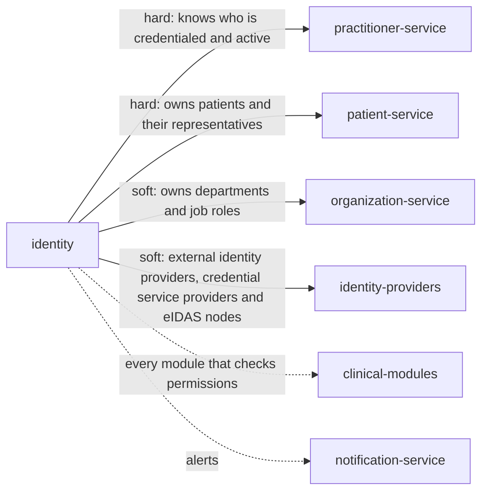

> Snapshot of healthcare/identity version 0.8.1, saved 2026-10-09. The current version is at https://knowledge-graph-ecru.vercel.app/docs/healthcare/identity.md.

# Identity and access (/docs/healthcare/identity)

## Module identity

- module: identity
- layer: healthcare
- extended by: Identity and access (ehr, /docs/healthcare/ehr/identity)
- version: 0.8.1
- status: draft

## How to read this spec

- This is the complete spec for this page, with every inherited item already merged in.
- If a behaviour is not listed here, it is unspecified. Do not assume or invent it. Ask, or record it as an open question.
- Ids such as BR-1, FR-2 and AC-3 are stable. Cite them in code, tests and commit messages.
- Items that start with "US only:" or "EU only:" apply only in that jurisdiction. Skip the ones for a jurisdiction your project doesn't operate in, or add ?jurisdiction=us or ?jurisdiction=eu to this URL to leave them out. Unmarked items apply everywhere.
- This is the core identity specification: nothing is inherited, and industry and domain pages build on it.

## Purpose & scope

Give every person and system that uses a health application one account of its own, proven and authenticated as strongly as what it can reach requires, and answer every module whether the caller holds a permission. Record every sign-in, role change and emergency access, and let patients connect the apps they choose. Works in the United States and the European Union.

**In scope**

- Accounts for staff, patients, representatives and systems, one per person or system
- Identity proofing, and authenticators such as passwords, security keys and smart cards
- Sign-in, step-up authentication, sessions and automatic sign-out
- Roles, permissions and periodic access review, and removing access when people leave
- Emergency access (break the glass) and its review
- Patient and representative portal accounts linked to the patient record
- App registration and authorization with SMART App Launch, including backend services for bulk export
- In the United States, the two-factor credentials for prescribing controlled substances
- In the EU, electronic identification recognised under eIDAS

**Out of scope**

- Who a patient's representatives are and what they may do. The Patients module records it; this module gives representatives their own accounts with that scope.
- Whether a practitioner may practise. The Practitioners module decides; this module follows it.
- Departments and job roles in the organization. Organization owns them; this module maps them to permissions.
- Whether a particular user may see a particular patient's record. Each module decides from its own care relationship rules; this module answers whether the caller holds the permission.
- Network security, device management and encryption keys. The organization's security operations own them.

## Overview

### Product perspective

Solid arrows are services this module calls; dotted arrows are services it notifies.

### Actors

| Actor | Description |
| --- | --- |
| Account administrator | Creates accounts, assigns roles and runs access reviews. |
| Staff member | A clinician or other workforce member who signs in. |
| Patient | A patient, or a representative, using the patient portal or an app. |
| Privacy officer | Reviews emergency access and sign-in anomalies. |
| App | A third-party application acting for a patient or user, or a backend system. |
| System | Other modules asking about callers and permissions. |

### Assumptions and dependencies

**AS-H1** Each module publishes the permissions its operations need.
  - Why: This module answers whether a caller holds a permission; the modules decide which permission an action needs.
**AS-H2** Practitioners and the organization's staff records say who is employed or credentialed and when they leave.
  - Why: Accounts follow people's status; they don't decide it.

## Functions

### Business rules

**BR-H1** Every person and every system has its own account, identified uniquely; accounts are never shared, and a representative never uses the patient's account.
  - Why: HIPAA requires a unique name or number for identifying and tracking each user (45 CFR 164.312(a)(2)(i)); shared accounts make it impossible to say who did what.
**BR-H2** A staff account is created only for a person the organization has authorized, such as a practitioner the Practitioners module reports or a staff member in its staff records, and gets only the roles their job needs.
  - Why: Workforce members should have only the access their work requires, through authorization and clearance procedures (45 CFR 164.308(a)(3) and (a)(4)).
**BR-H3** A role grants permissions from the modules' permission lists and applies to a department or organization. Every role assignment and change records who made it and why. Each account's roles are reviewed every access_review_interval, and roles nobody confirms are removed.
  - Why: Access must be established, reviewed and modified as people's work changes (45 CFR 164.308(a)(4)); unreviewed roles accumulate.
**BR-H4** An account is disabled within deprovision_deadline of its person leaving, or the Practitioners module reporting them inactive. When it reports a practitioner suspended, roles that need an active practitioner are suspended until reinstatement.
  - Why: Access must end when employment ends (45 CFR 164.308(a)(3)(ii)(C)); a departed or suspended clinician must not keep reaching patient data.
**BR-H5** Each role and account kind needs an authentication assurance level, set in required_aal: at least AAL2, multi-factor, for any access to patient data, and AAL3, which needs a phishing-resistant authenticator, for account administrators. At least one phishing-resistant authenticator is always offered. A sign-in below the level a request needs is refused until the user steps up.
  - Why: NIST SP 800-63B-4 requires two factors at AAL2, a phishing-resistant option offered at AAL2, and a phishing-resistant authenticator at AAL3; an administrator account can open every other account. NIS2 expects multi-factor authentication where appropriate (Directive (EU) 2022/2555, Article 21(2)(j)).
**BR-H6** Passwords are at least 15 characters when used alone, or 8 when used with another factor, are checked against a list of common and compromised passwords, and have no composition rules and no forced periodic change; a password is changed when there is evidence it is compromised.
  - Why: NIST SP 800-63B-4 sets these lengths, requires the blocklist check, and forbids composition rules and periodic changes, which push people to weaker, predictable passwords.
**BR-H7** Failed sign-ins are recorded and throttled per authenticator, with waits that grow as failures add up and a bot check where useful. After max_failed_attempts failures in a row, that authenticator is disabled and must be registered again through recovery (BR-H19); the account itself isn't locked, and a success resets the count. Unusual patterns, such as many failures or sign-ins from a new country, emit identity.signin_anomaly for the privacy officer, who, like an account administrator, can lock an account they suspect is compromised until the holder is verified.
  - Why: NIST SP 800-63B-4 caps consecutive failures at 100 by disabling the authenticator, and suggests growing waits so an attacker can't lock the real user out; locking a clinician's whole account on failed guesses would let anyone stop them working mid-shift. HIPAA expects log-in monitoring (45 CFR 164.308(a)(5)(ii)(C)).
**BR-H8** A session pauses after session_inactivity_timeout without activity and ends after session_max_duration, both set for the session's AAL; pausing or ending it clears patient data from the screen. At AAL2, a paused session may be resumed with the user's password or PIN alone, together with the session they still hold. At AAL3, and after session_max_duration, the user authenticates in full. The user is warned at least 2 minutes before a pause and can stay signed in with one simple action, at least ten times; they are prompted to save their work before session_max_duration.
  - Why: HIPAA expects sessions to end after inactivity (45 CFR 164.312(a)(2)(iii)). NIST SP 800-63B-4 sets at most 1 hour of inactivity and 24 hours overall at AAL2, allows reauthentication with a password and the session secret after an inactivity timeout, and sets 15 minutes and 12 hours at AAL3 with full reauthentication. WCAG 2.1 success criterion 2.2.1 requires a warning and at least 20 seconds to extend a time limit with a simple action, at least ten times, and NIST suggests prompting about 2 minutes ahead.
**BR-H9** A module can ask for a fresh authentication before a sensitive action, such as signing a note or a prescription, and say whether every factor of the required level must be presented at that moment. The answer says whether the user authenticated at that level within the freshness asked for; a resumption with a password or PIN alone never counts as presenting every factor.
  - Why: A signature or prescription must be made by the person themselves at that moment, not by whoever finds an open session; some signatures, such as controlled substance prescriptions in the United States, legally need the full two-factor protocol at signing (21 CFR 1311.140).
**BR-H10** US only: In the United States, a practitioner can sign controlled substance prescriptions only with a two-factor credential issued after identity proofing by an approved credential service provider, after one designated person confirms with the Practitioners module that their DEA registration and state authorization are current, and after two designated people, one a registrant using their own two-factor credential, have granted that access. Each signing completes the two-factor protocol at that moment, as the prescribing module asks (BR-H9).
  - Why: DEA requires identity-proofed two-factor credentials, a check that registration and state authorization are current, logical access set by two designated individuals, and the two-factor protocol at each signing (21 CFR 1311.105, 1311.125(a) to (c), 1311.140).
**BR-H11** In an emergency, a user with a clinical role can break the glass to reach a patient's information they wouldn't otherwise see, giving a reason. The access lasts break_glass_duration, is logged, emits identity.break_glass_used, and is reviewed by the privacy officer within break_glass_review_deadline. Breaking the glass gives a permission the user lacks; a module's own checks, such as the reason the Patients module asks for before opening a restricted record, still apply.
  - Why: HIPAA requires a procedure for obtaining necessary information in an emergency (45 CFR 164.312(a)(2)(ii)); review afterwards stops it becoming a back door.
**BR-H12** A patient or representative account is issued only after identity proofing at patient_identity_assurance and a match to the patient record the Patients module confirms. A representative gets their own account with the scope the Patients module records, which follows changes such as a minor reaching the age of majority.
  - Why: NIST SP 800-63A-4 sets IAL2 for remote identity proofing; a portal account linked to the wrong patient discloses someone else's record, and a parent's access must end when the law says it does.
**BR-H13** EU only: In the European Union, patients and health professionals can authenticate with electronic identification means recognised under eIDAS, including the EU Digital Identity Wallet, at the assurance the member state requires; health professionals reaching national health data access services must use them.
  - Why: The EHDS makes health professional access services available only to professionals with electronic identification recognised under the eIDAS Regulation (EHDS Article 12; Regulation (EU) No 910/2014). Article 12 applies from 26 March 2029 for the first priority categories (EHDS Article 105).
**BR-H14** US only: In the United States, third-party apps can register, and a patient can authorize one with SMART App Launch 2.0.0 scopes; patient apps that ask for it get a refresh token valid for at least refresh_token_lifetime. A registration or authorization is refused only on a documented security risk.
  - Why: Certified health IT must let apps register and issue refresh tokens of at least three months (45 CFR 170.315(g)(10)); refusing an app for other reasons is likely information blocking unless the security exception applies (45 CFR 171.203).
**BR-H15** A patient sees every app they have authorized and can revoke any grant at once; revoking ends its tokens immediately, and never later than 1 hour after the request.
  - Why: Patients must stay in control of who reads their data; certified US health IT must revoke an app at the patient's direction within 1 hour (45 CFR 170.315(g)(10)(vi)).
**BR-H16** Backend systems, such as a population health platform using bulk export, authenticate with their own registered keys and system scopes, never with a person's account. A backend app stays pending until an account administrator approves it and the system scopes it may use, because system scopes reach many patients at once.
  - Why: SMART Backend Services and Bulk Data use system scopes so a machine's access is separate from any person's and can be revoked on its own; SMART leaves backend registration to the organization, and a self-registered app reaching every patient would be a breach.
**BR-H17** Every sign-in, failed attempt, step-up, role change, emergency access, app registration and grant is logged with who, when, from where and the outcome. The log can't be changed and is kept for audit_log_retention.
  - Why: HIPAA requires audit controls that record and examine activity (45 CFR 164.312(b)).
**BR-H18** When the Patients module merges two records, portal accounts linked to the source are linked to the target; when it undoes a merge, they are listed for review. When it records a patient's death, the patient's own account is disabled, and representatives keep only the scope it records, such as an executor's; when it retracts the death, the account is re-enabled. When it marks a record entered in error, accounts linked to that record are disabled and listed for review. When the Practitioners module merges two practitioners, accounts follow the remaining one, and if both had an account, the source's is disabled.
  - Why: Accounts must point at the record in use and the person who is real; a portal that opens a merged-away or mistaken record shows the wrong person's data, and one account per person keeps the audit trail whole (BR-H1).
**BR-H19** Recovering an account needs the same identity assurance as creating it, and every authenticator change is told to the account holder through a channel already on file.
  - Why: Account recovery is a common way to take over an account; telling the holder lets them catch it.
**BR-H20** Every change sends the revision it read; a stale revision fails.
  - Why: Two administrators changing one account must not overwrite each other.
**BR-H21** US only: In the United States, the authorization server publishes its SMART configuration at .well-known/smart-configuration and validates tokens it issued for the modules that receive them, by token introspection.
  - Why: SMART App Launch 2.0.0 requires discovery, and certified health IT must receive and validate tokens it issued (45 CFR 170.315(g)(10)(vii), 170.215(c)).
**BR-H22** US only: In the United States, a practitioner's controlled substance prescribing access is revoked on the date any of these is discovered: an authenticator in their two-factor credential is lost, stolen or compromised (immediately when they report it, such as by removing it); their DEA registration expires unrenewed, or is terminated, revoked or suspended; or they may no longer use the application, such as on leaving. A revocation an administrator enters is confirmed by a second designated registrant with their two-factor credential.
  - Why: DEA lists these revocation triggers and requires the second designated individual for revocations as for grants (21 CFR 1311.125(c) and (d)).
**BR-H23** Active staff and system accounts with no sign-in or token request for dormant_account_period are disabled. Suspended accounts, such as during planned leave, aren't, and neither are patient and representative accounts, because patients sign in rarely.
  - Why: Unused accounts are a common way in for attackers and nobody notices their misuse; NIST SP 800-53 Rev. 5 (account management, control enhancement 3) disables accounts inactive for a set period, and HIPAA requires access management (45 CFR 164.308(a)(4)).
**BR-H24** An administrator can suspend and reinstate an account, giving a reason. A disabled staff account is re-enabled, not recreated, when its person returns, and comes back with no roles, so every role is authorized again (BR-H2, BR-H3).
  - Why: Re-enabling keeps one account per person and their history in one place (BR-H1), while clearing roles stops a returning worker getting their old access by default.
**BR-H25** An administrator can change an account's username, or relink a patient or representative account to another patient record, only after the Patients module confirms the person matches that record, giving a reason. It is how accounts listed for review after an unmerge or an entered-in-error record are put right.
  - Why: An account pointing at the wrong record shows someone else's data, so a relink needs the same match as enrolment (BR-H12); the reason keeps the change accountable.
**BR-H26** A person can enrol in the portal, and recover an account, without signing in. Neither response says whether a matching record or account exists, and both are throttled.
  - Why: Saying "no such patient" or "no such account" lets anyone test who is a patient here, which itself discloses health information; throttling stops guessing at scale (NIST SP 800-63B-4 rate limiting).
**BR-H27** An account administrator can suspend or revoke an app, giving a reason, which ends its tokens; a patient-facing app is suspended or revoked only for a documented security risk. A backend app whose key is compromised is suspended until it registers a new key.
  - Why: A compromised or misbehaving app must be stoppable at once; refusing a patient's chosen app for other reasons is likely information blocking in the United States (45 CFR 171.203).
**BR-H28** A request to erase an account is met by disabling it and deleting its authenticators, contact details and identity evidence. The sign-in and access log is kept for audit_log_retention, then deleted. A patient or representative can close their own portal account at any time.
  - Why: The log is needed to meet legal obligations such as audit controls and to establish or defend legal claims, which GDPR Article 17(3)(b) and (e) exempt from erasure; the rest isn't needed once the account is closed.
**BR-H29** Access tokens last at most access_token_lifetime, and at most 5 minutes for backend apps. A module that checks tokens itself, instead of by introspection, accepts none past its expiry, so a revocation takes effect within that lifetime.
  - Why: A revoked grant only stops working when its tokens do; certified US health IT must revoke within 1 hour (45 CFR 170.315(g)(10)(vi)), and SMART Backend Services says backend access tokens should not exceed 300 seconds.
**BR-H30** Authorization requests use PKCE with the S256 method, never plain, and a redirect URI that exactly matches one the app registered (only the port may vary for a native app's localhost address). Refresh tokens for apps that can't keep a secret are replaced at every use, and when an old one is presented again, the active one is revoked too.
  - Why: SMART App Launch 2.0.0 requires S256 and forbids plain; the OAuth 2.0 Security Best Current Practice (RFC 9700) requires exact redirect matching and refresh token rotation or binding for public clients, so a stolen code or refresh token is useless or detected.
**BR-H31** A client authenticating with a signed assertion, such as a backend app, sends one that expires no more than 5 minutes ahead, with a unique id that is refused if seen again within that time.
  - Why: SMART asymmetric client authentication sets the 5 minute limit and the replay check, so a captured assertion can't be reused.
**BR-H32** Nobody changes their own roles or access: an account administrator can't assign roles to, unlock, re-enable or grant controlled substance prescribing to their own account, and a privacy officer can't review their own emergency access.
  - Why: Separation of duties stops one person granting themselves access or clearing their own audit finding (NIST SP 800-53 Rev. 5, separation of duties).
**BR-H33** A minor may hold their own patient account from minor_own_account_age. Because many minors have no identity documents, they can be proofed with a trusted referee or an applicant reference, such as a parent or clinician who knows them, at patient_identity_assurance.
  - Why: Which minors may see their own record, and which parts, is set by state and member state law, so the age is a setting; NIST SP 800-63A-4 requires support for applicant references for people under 18 and names trusted referees for those without documents.
**BR-H34** Sign-in, enrolment, recovery, step-up and app approval screens meet WCAG 2.1 Level AA, including in the authenticators offered: at least one way to authenticate doesn't depend on remembering, transcribing or solving a puzzle.
  - Why: People with disabilities must be able to reach their own care and do their jobs; US recipients of federal funds with 15 or more employees must meet WCAG 2.1 AA from 11 May 2027 (45 CFR 84.84), and EU public sector bodies must make their websites and apps accessible (Directive (EU) 2016/2102). Passkeys and security keys need no memory or transcription.
**BR-H35** An account holder can set their own time zone and locale, which other modules read to show times and text; unset means each module uses its own default. The locale sets the language of screens and messages only, never the language a patient is cared for in.
  - Why: Showing a time in the wrong zone causes missed appointments; keeping the screen language apart from the patient's care language, which the Patients module owns, gives each fact one owner.
**BR-H36** EU only: In the European Union, each emergency access is recorded clearly enough for the patient to understand, given to the Patients module for the patient's access report, and kept at least 3 years from the access.
  - Why: EHDS Article 11(5) lets a professional reach restricted data to protect the patient's vital interests only if each case is logged clearly and is easily accessible to the patient, and Article 9(2) keeps access information available for at least three years; both apply from 26 March 2029.
**BR-H37** EU only: In the European Union, a permission check names the category of health data asked for, and the answer applies professional_access_rules for the caller's professional category, under the rules of the member state where care takes place.
  - Why: Member states set which categories of electronic health data each category of health professional may access, and the rules of the member state of treatment apply (EHDS Article 11(3) and (4)); one setting here keeps every module answering the same way.

### State machine

Initial state: `pending`. States: `pending`, `active`, `locked`, `suspended`, `disabled`.
Any transition not listed below is invalid.

| From | To | Trigger | Guard |
| --- | --- | --- | --- |
| pending | active | identity proofed and first authenticator registered (BR-H12) | - |
| active | locked | an administrator or the privacy officer suspects compromise (BR-H7) | - |
| locked | active | unlocked after the holder is verified (BR-H7) | - |
| active | suspended | an administrator suspends it (BR-H24) | - |
| suspended | active | reinstated (BR-H24) | - |
| active | disabled | person left, dormant, patient died, record entered in error, or account closed or erased (BR-H4, BR-H18, BR-H23, BR-H28) | - |
| suspended | disabled | person left, patient died, record entered in error, or account closed or erased (BR-H4, BR-H18, BR-H28) | - |
| locked | disabled | person left, patient died, record entered in error, or account closed or erased (BR-H4, BR-H18, BR-H28) | - |
| pending | disabled | enrolment abandoned | - |
| disabled | active | person returns, with no roles, or a death is retracted (BR-H24, BR-H18) | - |

### Workflows

#### Give a new staff member access
Actor: Account administrator
Trigger: Practitioners reports a practitioner credentialed, or a staff member starts

1. Create the account for that person
2. Register at least two authenticators, offering a phishing-resistant one
3. Assign the roles their job needs, for their departments

Outcome: They can sign in at the assurance their roles need.

#### Enrol a patient in the portal
Actor: Patient
Trigger: A patient asks for portal access

1. Start enrolment, proving identity remotely or in person at patient_identity_assurance
2. The Patients module confirms the matching record; otherwise the person is told to contact the organization, without saying why
3. Register authenticators

Outcome: The patient reaches their own record, and only theirs.

#### Break the glass
Actor: Staff member
Trigger: A clinician needs a record outside their usual access in an emergency

1. Choose break the glass and give a reason
2. Access lasts break_glass_duration and is logged
3. The privacy officer reviews it within break_glass_review_deadline

Outcome: Care isn't blocked, and the access is accounted for.

#### Connect an app
Actor: Patient
Trigger: A patient opens a third-party app

1. The app sends the patient to sign in
2. The patient approves the scopes it asks for
3. The app receives tokens, and a refresh token if it asked for offline_access

Outcome: The app reads what the patient allowed until the patient revokes it.

#### Remove a leaver's access
Actor: System
Trigger: A person leaves or Practitioners reports them inactive

1. Disable the account within deprovision_deadline
2. End its sessions and revoke its tokens
3. Emit identity.account_disabled

Outcome: Nobody keeps access after leaving.

#### Approve a backend app
Actor: Account administrator
Trigger: A vendor registers a backend app with system scopes

1. The app registers with its public keys and requested system scopes, and stays pending
2. The administrator checks the agreement and the security review, then approves the scopes it needs
3. The app requests 5 minute tokens with signed assertions

Outcome: Only approved systems reach many patients' data at once, each with its own keys.

### Validations

| Field | Rule | Error |
| --- | --- | --- |
| account.subject | An existing practitioner, staff record, patient, representative relationship or registered system | IDENTITY_INVALID_SUBJECT |
| account.subject | No other active account of the same kind for that subject | IDENTITY_DUPLICATE |
| account.username | Unique, never used before | IDENTITY_DUPLICATE |
| account.authenticators | A password meets BR-H6; other authenticators are a supported type | IDENTITY_WEAK_PASSWORD |
| account.roles | Each role exists and the subject's kind may hold it | IDENTITY_INVALID_ROLE |
| grant.scopes | SMART App Launch 2.0.0 scope syntax, within what the app registered for | IDENTITY_INVALID_SCOPE |
| break_glass.reason | Present | IDENTITY_REASON_REQUIRED |
| account.status | Fields the service sets, such as status, last_sign_in_at, last_reviewed_at and revision, can't be written by clients | IDENTITY_READ_ONLY_FIELD |
| authorization request | PKCE with code_challenge_method S256, and a redirect URI exactly matching one registered (BR-H30) | IDENTITY_INVALID_REQUEST |
| client assertion | Signed with a registered key, expiring no more than 5 minutes ahead, with an id not seen before (BR-H31) | IDENTITY_INVALID_CREDENTIAL |
| enrolment date of birth | For a patient's own account, at least minor_own_account_age, or age_of_majority when unset (BR-H33) | IDENTITY_UNDER_ACCOUNT_AGE |
| account.time_zone | A name in the IANA time zone database | IDENTITY_INVALID_PREFERENCE |
| account.locale | A well-formed BCP 47 tag | IDENTITY_INVALID_PREFERENCE |

### Edge cases

**EC-H1** Two nurses share one login on a busy ward.
  - Required behaviour: Not possible: each has their own account; on shared workstations the EHR layer makes switching fast instead.
  - Covered by: BR-H1, AC-H1
**EC-H2** A clinician leaves on Friday afternoon.
  - Required behaviour: Their account is disabled the same day and their sessions and tokens end at once.
  - Covered by: BR-H4, AC-H4
**EC-H3** An unconscious patient arrives and the doctor on duty has no care relationship yet.
  - Required behaviour: The doctor breaks the glass with a reason; the access is logged and reviewed.
  - Covered by: BR-H11, AC-H11
**EC-H4** A teenager turns 18 and their parent still has portal access.
  - Required behaviour: The parent's access ends when the Patients module reports the change; the teenager keeps their own account.
  - Covered by: BR-H12, AC-H12
**EC-H5** A phishing site captures a password and a one-time code.
  - Required behaviour: Phishing-resistant authenticators are offered and required for administrators, so a replayed code doesn't work for them.
  - Covered by: BR-H5, AC-H5
**EC-H6** A patient's app is abandoned and the patient forgets it.
  - Required behaviour: The patient can see and revoke it at any time; its refresh token ends after its lifetime unless renewed.
  - Covered by: BR-H15, AC-H16
**EC-H7** Someone asks support to reset a doctor's authenticator by phone.
  - Required behaviour: Recovery needs the same proof as enrolment, and the doctor is told through a channel on file.
  - Covered by: BR-H19, AC-H20
**EC-H8** US only: A patient dies and their executor asks for portal access to settle the estate.
  - Required behaviour: The patient's own account is disabled; the executor gets a representative account with the scope the Patients module records, because HIPAA treats them as a personal representative (45 CFR 164.502(g)(4)).
  - Covered by: BR-H12, BR-H18
**EC-H9** A nurse leaves and is rehired a year later.
  - Required behaviour: The old account is re-enabled with no roles, and their roles are authorized again.
  - Covered by: BR-H24, AC-H29
**EC-H10** US only: A prescriber's DEA registration lapses on a Saturday.
  - Required behaviour: Their controlled substance prescribing access ends that day; other prescribing continues.
  - Covered by: BR-H22, AC-H27
**EC-H11** A death is recorded on the wrong patient and the patient tries to sign in.
  - Required behaviour: Their account was disabled; when the Patients module retracts the death, it is re-enabled.
  - Covered by: BR-H18, AC-H30
**EC-H12** A contractor's account isn't used for months after their project ends, and nobody reported them leaving.
  - Required behaviour: It is disabled after dormant_account_period.
  - Covered by: BR-H23, AC-H28
**EC-H13** A nurse goes on six months of parental leave.
  - Required behaviour: An administrator suspends the account, so it isn't disabled as dormant, and reinstates it when they return with their roles intact.
  - Covered by: BR-H23, BR-H24
**EC-H14** Someone enters a neighbour's details on the enrolment page to find out if they are a patient.
  - Required behaviour: The answer is the same either way, and repeated tries are throttled.
  - Covered by: BR-H26, AC-H32
**EC-H15** A nurse is also a patient at the same hospital.
  - Required behaviour: They have a staff account and a separate patient account; reading their own record through the staff account is governed by each module's own access rules.
  - Covered by: BR-H1
**EC-H16** A vendor registers a backend app and asks for every patient's data.
  - Required behaviour: It stays pending until an administrator approves it and its system scopes.
  - Covered by: BR-H16, AC-H36
**EC-H17** A session started at 01:30 on the night clocks go back an hour.
  - Required behaviour: session_max_duration counts elapsed time, so a 12 hour session ends 12 real hours later, whatever the wall clock says.
  - Covered by: BR-H8
**EC-H18** An attacker steals a patient app's refresh token and uses it before the app does.
  - Required behaviour: When the app presents the old token, the reuse is detected and the active token is revoked; the patient signs in again.
  - Covered by: BR-H30, AC-H40
**EC-H19** EU only: The national eIDAS node is down.
  - Required behaviour: Professionals can't reach the national access service, but local sign-in with the organization's own authenticators keeps working.
  - Covered by: BR-H13, BR-H5
**EC-H20** A homeless patient has no identity documents and no credit history.
  - Required behaviour: They are proofed with a trusted referee, such as a social worker, as NIST allows.
  - Covered by: BR-H33
**EC-H21** Someone types a surgeon's username with wrong passwords all morning to stop them signing in.
  - Required behaviour: Waits grow and the password may be disabled, but the surgeon still signs in with their security key or badge, and the privacy officer sees the anomaly.
  - Covered by: BR-H7, AC-H7

## Data

### Data model

| Field | Type | Required | Description | Constraints |
| --- | --- | --- | --- | --- |
| account.id | string | yes | The account id. Never changes or is reused. | set by the service |
| account.kind | enum | yes | Whose account it is. | staff \| patient \| representative \| system; codes: none standard, local to this specification |
| account.subject | reference | yes | The person or system it belongs to: a practitioner or staff record, a patient, a representative relationship from the Patients module, or a system. | one active account per subject and kind; codes: in the United States, the SMART fhirUser claim names it as a FHIR Practitioner, Patient, RelatedPerson or Person resource |
| account.username | string | yes | The sign-in name. | unique; never reused |
| account.status | enum | yes | Where the account is in its lifecycle. | pending \| active \| locked \| suspended \| disabled; changed only through operations; codes: none standard, local to this specification |
| account.identity_assurance | code | no | How strongly the person's identity was proven, by whom and with what evidence. | codes: NIST SP 800-63A IAL1, IAL2, IAL3; in the EU, eIDAS assurance levels low, substantial, high |
| account.authenticators | authenticator[] | no | Registered authenticators: type, whether phishing-resistant, the AAL it supports, when registered and last used. | codes: type from a local list, such as password, otp_app, security_key, passkey, smart_card |
| account.roles | role assignment[] | no | Roles held, each with the department or organization it applies to, its period and who granted it. | each role from roles |
| account.last_sign_in_at | instant | no | When the account last signed in. | set by the service |
| account.last_reviewed_at | instant | no | When an access review last confirmed the account's roles. | set by the service |
| account.revision | integer | yes | Goes up with every change. | set by the service |
| role.name | string | yes | The role, such as nurse or registrar. | unique |
| role.permissions | string[] | yes | The permissions the role grants, from the modules' permission lists. | - |
| role.required_aal | code | yes | The authentication assurance the role needs. | codes: AAL1, AAL2, AAL3 |
| session.id | string | yes | The session id. | set by the service |
| session.aal | code | yes | The assurance the sign-in reached, raised by step-up. | codes: AAL1, AAL2, AAL3 |
| session.started_at | instant | yes | When it began, and when it was last active and last reauthenticated. | - |
| session.ended_reason | code | no | Why it ended, such as signed out, expired or account disabled. A paused session hasn't ended. | signed_out \| expired \| account_disabled \| account_suspended \| revoked; codes: none standard, local to this specification |
| app.client_id | string | yes | The registered app's id. | set by the service |
| app.kind | enum | yes | How the app authenticates, and whether it acts for a person or as a backend system. | public \| confidential-symmetric \| confidential-asymmetric, for apps acting for a person; backend, for SMART Backend Services, which authenticates with asymmetric keys; codes: SMART App Launch 2.0.0 client capabilities client-public, client-confidential-symmetric and client-confidential-asymmetric |
| app.status | enum | yes | Whether the app may be used. | pending \| registered \| suspended \| revoked; a backend app starts pending, a patient-facing app registered; codes: none standard, local to this specification |
| grant.scopes | string[] | yes | What a patient or user allowed an app to do, with when it was granted, its refresh token's expiry and any revocation. | SMART App Launch 2.0.0 scope syntax |
| break_glass.reason | text | yes | Why emergency access was used, for which patient, when, how long it lasted, and the review outcome. | - |
| account.epcs_access | object | no | US only: Whether the practitioner may sign controlled substance prescriptions, with the two approvers, when, and any revocation and its reason. | - |
| account.time_zone | code | no | The time zone the account holder wants times shown in. | codes: IANA time zone database names, such as Europe/Berlin |
| account.locale | code | no | The language and regional format of screens and messages for the account holder. A patient's languages for care and interpreters are the Patients module's. | codes: BCP 47 tags (RFC 5646) |

### Relationships

| Edge | Target | Note |
| --- | --- | --- |
| belongs_to | practitioner, staff record, patient, representative relationship or system | account.subject; one active account per subject and kind (BR-H1) |
| has_many | authenticator | authenticators of an account |
| has_many | role assignment | roles an account holds, each for a department or organization and a period |
| has_many | session | sessions of an account |
| has_many | grant | an app's grants from many accounts |
| has_many | break glass | emergency accesses an account used, each for one patient |
| can_trigger | event:identity.break_glass_used | - |

## External interfaces

### API

#### Create an account: `POST /accounts`
Create an account for a person or system. Accepts a retry key.
- Success: 201
- Actor: Account administrator
- Input: kind, subject, username, and roles for staff
- Result: the account, pending
- Errors: IDENTITY_DUPLICATE, IDENTITY_INVALID_SUBJECT, IDENTITY_INVALID_ROLE, IDENTITY_READ_ONLY_FIELD, IDENTITY_IDEMPOTENCY_KEY_REUSED, IDENTITY_FORBIDDEN, IDENTITY_DEPENDENCY_UNAVAILABLE

#### Change an account: `PATCH /accounts/{id}`
Change the username, or relink a patient or representative account to the record the Patients module confirms.
- Success: 200
- Actor: Account administrator
- Input: username or the patient record, reason and revision
- Result: the account
- Errors: IDENTITY_NOT_FOUND, IDENTITY_DUPLICATE, IDENTITY_INVALID_SUBJECT, IDENTITY_NOT_MATCHED, IDENTITY_READ_ONLY_FIELD, IDENTITY_REASON_REQUIRED, IDENTITY_REVISION_CONFLICT, IDENTITY_FORBIDDEN, IDENTITY_DEPENDENCY_UNAVAILABLE

#### Set my preferences: `PUT /accounts/{id}/preferences`
Set your own time zone and locale.
- Success: 200
- Actor: Staff member
- Input: time_zone, locale and revision
- Result: the account
- Errors: IDENTITY_NOT_FOUND, IDENTITY_INVALID_PREFERENCE, IDENTITY_REVISION_CONFLICT, IDENTITY_FORBIDDEN

#### Get an account: `GET /accounts/{id}`
An account's kind, subject, status, roles, authenticator types, time zone and locale.
- Success: 200
- Actor: System
- Input: account id
- Result: the account, never secrets
- Errors: IDENTITY_NOT_FOUND, IDENTITY_FORBIDDEN

#### Search accounts: `GET /accounts`
Search by name, subject, role, status or last sign-in.
- Success: 200
- Actor: Account administrator
- Input: criteria, limit and cursor
- Result: accounts and next_cursor
- Errors: IDENTITY_FORBIDDEN

#### Record identity proofing: `POST /accounts/{id}/proofing`
Record how a person's identity was proven, at what level and with what evidence.
- Success: 200
- Actor: Account administrator
- Input: assurance level, method and evidence references
- Result: the account
- Errors: IDENTITY_NOT_FOUND, IDENTITY_FORBIDDEN

#### Enrol in the portal: `POST /enrolments`
Start a patient or representative account: prove identity at patient_identity_assurance and ask the Patients module to confirm the record. Needs no sign-in, and accepts a retry key.
- Success: 201
- Actor: Patient
- Input: name, date of birth, contact details, identity proofing result, and for a representative the patient they act for
- Result: a pending account, or the same neutral answer whether or not a record matched
- Errors: IDENTITY_NOT_MATCHED, IDENTITY_UNDER_ACCOUNT_AGE, IDENTITY_AAL_TOO_LOW, IDENTITY_IDEMPOTENCY_KEY_REUSED, IDENTITY_DEPENDENCY_UNAVAILABLE

#### Recover an account: `POST /recoveries`
Start recovering an account whose authenticators are lost, with identity proven at the level the account was created with. Needs no sign-in.
- Success: 202
- Actor: Staff member
- Input: username or contact details, and the identity proofing result
- Result: the same answer whether or not the account exists; the holder is told through a channel on file
- Errors: IDENTITY_AAL_TOO_LOW, IDENTITY_DEPENDENCY_UNAVAILABLE

#### Register an authenticator: `POST /accounts/{id}/authenticators`
Add a password, one-time-password app, security key, passkey or smart card.
- Success: 201
- Actor: Staff member
- Input: type and enrolment data
- Result: the authenticator, without its secret
- Errors: IDENTITY_NOT_FOUND, IDENTITY_WEAK_PASSWORD, IDENTITY_AAL_TOO_LOW, IDENTITY_FORBIDDEN

#### Remove an authenticator: `DELETE /accounts/{id}/authenticators/{authenticator_id}`
Remove an authenticator; the last one can't be removed.
- Success: 200
- Actor: Staff member
- Input: revision
- Result: the account
- Errors: IDENTITY_NOT_FOUND, IDENTITY_AAL_TOO_LOW, IDENTITY_REVISION_CONFLICT, IDENTITY_FORBIDDEN

#### Sign in: `POST /sessions`
Authenticate and start a session at the assurance the authenticators reach.
- Success: 201
- Actor: Staff member
- Input: username and authenticator responses
- Result: the session and its AAL
- Errors: IDENTITY_INVALID_CREDENTIAL, IDENTITY_ACCOUNT_LOCKED, IDENTITY_DEPENDENCY_UNAVAILABLE

#### Step up: `POST /sessions/{id}/step-up`
Authenticate again to raise or refresh a session's assurance before a sensitive action.
- Success: 200
- Actor: Staff member
- Input: authenticator responses
- Result: the session with its new AAL and time
- Errors: IDENTITY_NOT_FOUND, IDENTITY_INVALID_CREDENTIAL, IDENTITY_AAL_TOO_LOW

#### Sign out: `DELETE /sessions/{id}`
End a session.
- Success: 200
- Actor: Staff member
- Input: session id
- Result: the ended session
- Errors: IDENTITY_NOT_FOUND

#### Check a permission: `GET /authorization/check`
Whether the caller holds a permission, at the assurance needed, and how recently they authenticated.
- Success: 200
- Actor: System
- Input: session or token, permission, and the freshness needed
- Result: allowed or not, the AAL and authentication time
- Errors: IDENTITY_INVALID_CREDENTIAL

#### Assign a role: `POST /accounts/{id}/roles`
Give an account a role for a department or organization.
- Success: 201
- Actor: Account administrator
- Input: role, scope, period and reason
- Result: the assignment
- Errors: IDENTITY_NOT_FOUND, IDENTITY_INVALID_ROLE, IDENTITY_REASON_REQUIRED, IDENTITY_FORBIDDEN

#### Remove a role: `DELETE /accounts/{id}/roles/{assignment_id}`
End a role assignment.
- Success: 200
- Actor: Account administrator
- Input: reason
- Result: the account
- Errors: IDENTITY_NOT_FOUND, IDENTITY_REASON_REQUIRED, IDENTITY_FORBIDDEN

#### Define a role: `PUT /roles/{name}`
Create or change a role's permissions and required AAL.
- Success: 200
- Actor: Account administrator
- Input: permissions, required_aal and revision
- Result: the role
- Errors: IDENTITY_INVALID_ROLE, IDENTITY_REVISION_CONFLICT, IDENTITY_FORBIDDEN

#### List accounts due for review: `GET /access-reviews`
Accounts whose roles haven't been confirmed within access_review_interval.
- Success: 200
- Actor: Account administrator
- Input: department, limit and cursor
- Result: accounts and next_cursor
- Errors: IDENTITY_FORBIDDEN

#### Confirm an access review: `POST /access-reviews/{account_id}`
Confirm or remove each role of an account under review.
- Success: 200
- Actor: Account administrator
- Input: roles kept and removed
- Result: the account
- Errors: IDENTITY_NOT_FOUND, IDENTITY_FORBIDDEN

#### Disable an account: `POST /accounts/{id}/disable`
Disable an account, ending its sessions and tokens. A patient or representative can close their own account this way.
- Success: 200
- Actor: Account administrator
- Input: reason and revision
- Result: the account
- Errors: IDENTITY_NOT_FOUND, IDENTITY_REASON_REQUIRED, IDENTITY_REVISION_CONFLICT, IDENTITY_FORBIDDEN

#### Unlock an account: `POST /accounts/{id}/unlock`
Unlock a locked account after verifying the holder.
- Success: 200
- Actor: Account administrator
- Input: how the holder was verified, and revision
- Result: the account
- Errors: IDENTITY_NOT_FOUND, IDENTITY_INVALID_STATUS, IDENTITY_REASON_REQUIRED, IDENTITY_FORBIDDEN

#### Lock an account: `POST /accounts/{id}/lock`
Lock an account suspected of compromise, ending its sessions and tokens, until the holder is verified.
- Success: 200
- Actor: Privacy officer
- Input: reason and revision
- Result: the account
- Errors: IDENTITY_NOT_FOUND, IDENTITY_INVALID_STATUS, IDENTITY_REASON_REQUIRED, IDENTITY_REVISION_CONFLICT, IDENTITY_FORBIDDEN

#### Suspend an account: `POST /accounts/{id}/suspend`
Suspend an account, ending its sessions.
- Success: 200
- Actor: Account administrator
- Input: account id, revision and reason
- Result: the account
- Errors: IDENTITY_NOT_FOUND, IDENTITY_INVALID_STATUS, IDENTITY_REASON_REQUIRED, IDENTITY_REVISION_CONFLICT, IDENTITY_FORBIDDEN

#### Reinstate an account: `POST /accounts/{id}/reinstate`
Reinstate a suspended account.
- Success: 200
- Actor: Account administrator
- Input: account id, revision and reason
- Result: the account
- Errors: IDENTITY_NOT_FOUND, IDENTITY_INVALID_STATUS, IDENTITY_REASON_REQUIRED, IDENTITY_REVISION_CONFLICT, IDENTITY_FORBIDDEN

#### Re-enable an account: `POST /accounts/{id}/enable`
Re-enable a disabled account for a returning person, with no roles.
- Success: 200
- Actor: Account administrator
- Input: account id, revision and reason
- Result: the account
- Errors: IDENTITY_NOT_FOUND, IDENTITY_INVALID_STATUS, IDENTITY_REASON_REQUIRED, IDENTITY_REVISION_CONFLICT, IDENTITY_FORBIDDEN

#### Break the glass: `POST /break-glass`
Gain emergency access to a patient's information, with a reason.
- Success: 201
- Actor: Staff member
- Input: patient and reason
- Result: the emergency access and when it ends
- Errors: IDENTITY_REASON_REQUIRED, IDENTITY_FORBIDDEN

#### Review emergency access: `POST /break-glass/{id}/review`
Record whether an emergency access was justified.
- Success: 200
- Actor: Privacy officer
- Input: justified or not, and notes
- Result: the reviewed access
- Errors: IDENTITY_NOT_FOUND, IDENTITY_FORBIDDEN

#### Register an app: `POST /apps`
US only: Register a third-party or backend app.
- Success: 201
- Actor: App
- Input: name, kind, redirect URIs or public keys, and scopes it may request
- Result: the client id
- Errors: IDENTITY_INVALID_SCOPE, IDENTITY_APP_REFUSED

#### Change an app's status: `PATCH /apps/{client_id}`
Approve a pending backend app and its system scopes, or suspend, reinstate or revoke an app, ending its tokens when it stops.
- Success: 200
- Actor: Account administrator
- Input: status, approved system scopes, reason and revision
- Result: the app
- Errors: IDENTITY_NOT_FOUND, IDENTITY_INVALID_STATUS, IDENTITY_INVALID_SCOPE, IDENTITY_REASON_REQUIRED, IDENTITY_APP_REFUSED, IDENTITY_REVISION_CONFLICT, IDENTITY_FORBIDDEN

#### Authorize an app: `GET /oauth/authorize`
The SMART App Launch authorization request: sign in and approve scopes.
- Success: 302
- Actor: Patient
- Input: client id, scopes, redirect URI, state and PKCE challenge
- Result: a redirect to the app with an authorization code
- Errors: IDENTITY_INVALID_REQUEST, IDENTITY_INVALID_SCOPE, IDENTITY_APP_REFUSED

#### Issue a token: `POST /oauth/token`
Exchange an authorization code, refresh token or backend assertion for tokens.
- Success: 200
- Actor: App
- Input: grant type and credentials
- Result: access token with its expiry, scopes, and a refresh token where allowed, replacing the one used
- Errors: IDENTITY_INVALID_REQUEST, IDENTITY_INVALID_CREDENTIAL, IDENTITY_INVALID_SCOPE, IDENTITY_APP_REFUSED

#### Get the SMART configuration: `GET /.well-known/smart-configuration`
US only: Publish the authorization endpoints and capabilities apps discover.
- Success: 200
- Actor: App
- Input: none
- Result: the SMART configuration as JSON

#### Introspect a token: `POST /oauth/introspect`
US only: Say whether a token this service issued is active, and for whom and which scopes (RFC 7662).
- Success: 200
- Actor: System
- Input: the token
- Result: active, and when active the scopes, client, subject and expiry
- Errors: IDENTITY_INVALID_CREDENTIAL

#### List my app grants: `GET /grants`
The apps the account has authorized, with scopes and dates.
- Success: 200
- Actor: Patient
- Input: limit and cursor
- Result: grants and next_cursor

#### Revoke an app grant: `DELETE /grants/{id}`
Revoke an app's access at once.
- Success: 200
- Actor: Patient
- Input: grant id
- Result: the revoked grant
- Errors: IDENTITY_GRANT_NOT_FOUND

#### Grant controlled substance prescribing: `POST /accounts/{id}/epcs-access`
US only: Record the two designated individuals' approval for a practitioner to sign controlled substance prescriptions.
- Success: 200
- Actor: Account administrator
- Input: the two approvers, the credential's identity proofing record, and the confirmation that DEA registration and state authorization are current
- Result: the account
- Errors: IDENTITY_NOT_FOUND, IDENTITY_EPCS_REQUIREMENTS_UNMET, IDENTITY_DEPENDENCY_UNAVAILABLE, IDENTITY_FORBIDDEN

#### Revoke controlled substance prescribing: `DELETE /accounts/{id}/epcs-access`
US only: Revoke a practitioner's controlled substance prescribing access, confirmed by a second designated registrant.
- Success: 200
- Actor: Account administrator
- Input: the reason and the confirming registrant
- Result: the account
- Errors: IDENTITY_NOT_FOUND, IDENTITY_REASON_REQUIRED, IDENTITY_EPCS_REQUIREMENTS_UNMET, IDENTITY_FORBIDDEN

#### Get an account's sign-in log: `GET /accounts/{id}/sign-in-log`
Sign-ins, failures, step-ups and role changes for an account.
- Success: 200
- Actor: Privacy officer
- Input: limit and cursor
- Result: log entries
- Errors: IDENTITY_NOT_FOUND, IDENTITY_FORBIDDEN

### API conventions

| Topic | Convention | Reference |
| --- | --- | --- |
| Authentication | Callers authenticate with a session or an OAuth 2.0 access token issued here; apps use SMART App Launch 2.0.0, and backend systems SMART Backend Services. | - |
| Errors | Errors use problem details (application/problem+json) with a code member, such as IDENTITY_AAL_TOO_LOW; the OAuth endpoints use the OAuth 2.0 error responses (RFC 6749). | RFC 9457, RFC 6749 |
| Pagination | Lists are cursor-based: limit and an optional cursor in, next_cursor out. | - |
| Concurrency | Every change sends the revision it read; a stale revision fails with IDENTITY_REVISION_CONFLICT (BR-H20). | - |
| Retries | Every create accepts an Idempotency-Key header. | IETF draft-ietf-httpapi-idempotency-key-header |
| Secrets | No operation returns a password, key or token after it is issued; passwords are stored only as salted, slow hashes. | - |
| Dates | Dates are ISO 8601 calendar dates, read as the local date where care is given, never a date converted to UTC. | ISO 8601 |
| Times | Instants are RFC 3339 timestamps with an offset, stored in UTC; time zones are IANA names. | RFC 3339 |
| Personal data in URLs | Names, birth dates and identifiers are sent in request bodies or query parameters over TLS, never in paths, and are never written to request logs. | - |
| Rate limits | A caller over its limit gets 429 Too Many Requests with a Retry-After header. | RFC 6585, RFC 9110 |
| Versioning | Additive changes don't change the version. A breaking change ships as a new major version with Deprecation and Sunset headers. | RFC 9745, RFC 8594 |

### Events

| Event | Description | Payload |
| --- | --- | --- |
| identity.account_created | An account was created. | account_id, revision, kind |
| identity.account_disabled | An account was disabled. | account_id, revision, reason |
| identity.account_locked | An account was locked. | account_id, revision, reason |
| identity.role_changed | A role was assigned or removed. | account_id, revision, role |
| identity.signin_anomaly | Unusual sign-in activity was detected. | account_id, revision, pattern |
| identity.break_glass_used | Emergency access was used. | account_id, patient_id, ends_at |
| identity.break_glass_reviewed | Emergency access was reviewed. | account_id, patient_id, outcome |
| identity.app_registered | An app was registered. | client_id, kind, status |
| identity.grant_revoked | A patient or user revoked an app's access. | client_id, account_id |
| identity.account_suspended | An account was suspended. | account_id, revision, reason |
| identity.account_reactivated | A suspended or disabled account became active again. | account_id, revision, from_status |
| identity.epcs_access_changed | US only: Controlled substance prescribing access was granted or revoked. | account_id, revision, granted, reason |
| identity.app_status_changed | An app was approved, suspended, reinstated or revoked. | client_id, revision, status, reason |

### Event delivery

**DG-H1** Events are published at least once; consumers drop one with a source and id they have seen.
  - Why: A relay can publish twice after a crash.
**DG-H2** Events carry ids and reasons, never credentials, tokens or identity evidence.
  - Why: Events fan out widely; a leaked token is a stolen account.

### Errors

| Code | HTTP | Meaning |
| --- | --- | --- |
| IDENTITY_NOT_FOUND | 404 | No account, session, app or emergency access exists with that id. |
| IDENTITY_FORBIDDEN | 403 | Your role doesn't allow this, or you can't do it to your own account. |
| IDENTITY_DUPLICATE | 409 | That person or system already has an active account of this kind, or the username was used before. |
| IDENTITY_INVALID_SUBJECT | 422 | The account's subject isn't a practitioner, staff record, patient, representative relationship or registered system this organization holds. |
| IDENTITY_INVALID_CREDENTIAL | 401 | The sign-in or token couldn't be verified. |
| IDENTITY_INVALID_REQUEST | 400 | The authorization request is missing PKCE with S256, or its redirect URI isn't registered. |
| IDENTITY_ACCOUNT_LOCKED | 403 | The account is locked because it may be compromised; an administrator must verify you to unlock it. |
| IDENTITY_AAL_TOO_LOW | 401 | This needs a stronger or fresher authentication, or stronger identity proofing; step up and try again. |
| IDENTITY_WEAK_PASSWORD | 422 | The password is too short or on the list of common and compromised passwords. |
| IDENTITY_INVALID_ROLE | 422 | That role doesn't exist, or this kind of account can't hold it. |
| IDENTITY_INVALID_SCOPE | 422 | A scope isn't valid SMART syntax or wasn't registered for this app. |
| IDENTITY_APP_REFUSED | 403 | The app was refused, suspended or revoked without a documented security risk, or is pending approval. |
| IDENTITY_GRANT_NOT_FOUND | 404 | No grant exists with that id. |
| IDENTITY_EPCS_REQUIREMENTS_UNMET | 409 | Controlled substance prescribing needs a proofed two-factor credential, a current DEA registration and state authorization, and two designated people, one a registrant. |
| IDENTITY_INVALID_STATUS | 409 | The account isn't in a status that allows this. |
| IDENTITY_REASON_REQUIRED | 422 | This needs a reason. |
| IDENTITY_READ_ONLY_FIELD | 422 | That field is set by the service. |
| IDENTITY_REVISION_CONFLICT | 409 | It changed since you read it. Read it again. |
| IDENTITY_IDEMPOTENCY_KEY_REUSED | 422 | That retry key was used with a different request. |
| IDENTITY_DEPENDENCY_UNAVAILABLE | 503 | Practitioners, Patients or an identity provider can't be reached. Try again. |
| IDENTITY_NOT_MATCHED | 422 | We couldn't confirm your record. Contact the organization to finish enrolment. |
| IDENTITY_UNDER_ACCOUNT_AGE | 422 | You can have your own account from a later age; a parent or guardian can ask for access for you. |
| IDENTITY_INVALID_PREFERENCE | 422 | The time zone isn't an IANA name, or the locale isn't a BCP 47 tag. |

### Dependencies

Each dependency lists its contract: only what this module needs from it (upstream) or gives it (downstream). How the other module works is out of scope.

| Service | Direction | Criticality | Reason | Contract |
| --- | --- | --- | --- | --- |
| practitioner-service | upstream | hard | knows who is credentialed and active | Asks: is this practitioner active?; Receives: practitioner.credentialed, practitioner.suspended, practitioner.reinstated and practitioner.inactivated; Gives: the practitioner id an account belongs to; Asks: are this practitioner's DEA registration and state authorization current?; Receives: practitioner.credential_expired and practitioner.merged |
| patient-service | upstream | hard | owns patients and their representatives | Asks: does this enrolment or relink match a patient record in use?; Asks: who represents this patient, with what scope?; Receives: patient.merged, patient.unmerged, patient.deceased and patient.representative_changed; Receives: patient.death_retracted and patient.entered_in_error; Asks: what is age_of_majority here?; Gives: identity.break_glass_used, so the patient's access report shows each emergency access |
| organization-service | upstream | soft | owns departments and job roles | Asks: which job roles does this person hold, in which departments?; Departments and job roles are Organization's concern |
| identity-providers | upstream | soft | external identity providers, credential service providers and eIDAS nodes | Asks: is this sign-in or proofing result valid, and at what assurance? |
| clinical-modules | downstream | hard | every module that checks permissions | Gives: whether the caller holds a permission, with their AAL and authentication time; Gives: identity.break_glass_used, so modules allow the emergency access and log it; Which permission each action needs is each module's concern; Gives: identity.epcs_access_changed, so prescribing stops offering controlled substance signing at once; Gives: token introspection, so a module can check a token it received; Gives: identity.app_status_changed, so modules stop serving a suspended or revoked app at once; Gives: whether an account exists and is active, and its time zone and locale; Gives: in the EU, whether a professional category may read a category of health data (professional_access_rules) |
| notification-service | downstream | soft | alerts | Gives: identity.signin_anomaly, identity.account_locked and identity.break_glass_used, for the privacy officer; Gives: identity.break_glass_reviewed, so the person who broke the glass learns the outcome; Gives: identity.account_created, identity.account_disabled, identity.role_changed, identity.app_registered and identity.grant_revoked, so holders are told of changes; Gives: identity.account_suspended, identity.account_reactivated and identity.epcs_access_changed, so holders are told of changes; Gives: identity.app_status_changed, so app owners and affected patients are told |

## Security

### Permission matrix

| Action | Account administrator | Staff member | Patient | Privacy officer | App | System | Permission |
| --- | --- | --- | --- | --- | --- | --- | --- |
| Create, change, search, suspend, reinstate, re-enable, disable and unlock accounts, assign and define roles, run access reviews, grant and revoke controlled substance prescribing, approve, suspend and revoke apps | any | none | none | none | none | none | identity.admin |
| Register and remove own authenticators, sign in, step up, sign out, list and revoke own app grants, close own patient or representative account, set own time zone and locale | own | own | own | own | none | none | identity.self |
| Enrol in the portal, recover an account | own | own | own | own | none | none | none |
| Break the glass | none | any | none | none | none | none | identity.break_glass |
| Read sign-in logs, review emergency access | none | none | none | any | none | none | identity.audit |
| Check a permission, get an account | any | own | own | any | none | any | identity.check |
| Register an app, request tokens | none | none | none | none | own | none | identity.self |
| Introspect tokens | none | none | none | none | none | any | identity.check |
| Read the SMART configuration | any | any | any | any | any | any | none |
| Lock an account suspected of compromise | any | none | none | any | none | none | identity.audit |

any: every appointment. own: appointments the actor takes part in. none: not allowed.

- Enrol in the portal, recover an account: Needs no sign-in; "own" means the person enrolling or recovering.

- Break the glass: Only staff with a clinical role.

- Register an app, request tokens: Apps act only within the scopes a person granted, or their own system scopes.

- Introspect tokens: Only the modules that receive tokens.

- Read the SMART configuration: Public, needs no token.

- Lock an account suspected of compromise: Account administrators lock under identity.admin.

### Permissions

| Permission | Grants |
| --- | --- |
| identity.admin | Create accounts, assign roles and run access reviews. |
| identity.self | Manage your own authenticators, sessions and app grants. |
| identity.break_glass | Break the glass for emergency access. |
| identity.audit | Read sign-in logs and review emergency access. |
| identity.check | Ask whether a caller holds a permission. |

### Privacy and retention

| Field | Category | Purpose | Retention |
| --- | --- | --- | --- |
| account.subject, account.username, account.kind, account.status, account.roles, account.revision | personal | Identifying who acts in the application and what they may do | As long as the account, then audit_log_retention |
| account.identity_assurance | personal; evidence can include identity documents | Showing how identity was proven | As long as the account; evidence images are not kept once verified |
| account.authenticators | personal; can include biometric templates on the device only | Signing in | Until removed; secrets are stored only as salted hashes or public keys |
| account.last_sign_in_at, account.last_reviewed_at, session.id, session.aal, session.started_at, session.ended_reason | personal | Security and audit | audit_log_retention |
| app.client_id, app.kind, app.status, grant.scopes | personal (for grants) | Showing which apps may act for whom | As long as the grant, then audit_log_retention |
| role.name, role.permissions, role.required_aal | not personal | Defining access | As long as the role is in use |
| break_glass.reason | health data; names the patient | Accounting for emergency access | audit_log_retention |
| account.epcs_access | personal | US only: Showing who may sign controlled substance prescriptions and who approved it | As long as the account, then audit_log_retention |
| account.time_zone, account.locale | personal | Showing times and text the way the holder wants | As long as the account |

### Compliance

**CMP-H1** HIPAA Security Rule, 45 CFR 164.312(a)(2)(i) to (iii): US only: Unique user identification, an emergency access procedure, and automatic logoff.
  - How it's met: One account per person, break the glass, session timeouts.
  - Status: met
  - Covered by: BR-H1, BR-H11, BR-H8
**CMP-H2** HIPAA Security Rule, 45 CFR 164.312(b) and (d): US only: Audit controls, and verifying that a person seeking access is who they claim.
  - How it's met: Every sign-in and change logged; multi-factor authentication.
  - Status: met
  - Covered by: BR-H17, BR-H5
**CMP-H3** HIPAA Security Rule, 45 CFR 164.308(a)(3), (a)(4) and (a)(5)(ii)(C) and (D): US only: Workforce access authorization and termination, access management, log-in monitoring and password management.
  - How it's met: Roles, reviews, deprovisioning, throttling and password rules.
  - Status: met
  - Covered by: BR-H2, BR-H3, BR-H4, BR-H6, BR-H7
**CMP-H4** DEA electronic prescriptions for controlled substances, 21 CFR 1311.105 and 1311.125: US only: Identity-proofed two-factor credentials, a check that registration and state authorization are current, logical access granted and revoked by two designated individuals, and revocation on the date a trigger is discovered.
  - How it's met: Controlled substance prescribing access needs all of these, and ends on each trigger.
  - Status: met
  - Covered by: BR-H10, BR-H22
**CMP-H5** ONC Health IT Certification, 45 CFR 170.315(g)(10)(v) to (vii): US only: SMART App Launch authorization, refresh tokens of at least three months, revocation at the patient's direction within 1 hour, and token introspection.
  - How it's met: App registration and authorization server.
  - Status: met
  - Covered by: BR-H14, BR-H15, BR-H16, BR-H21
**CMP-H6** 21st Century Cures Act information blocking, 45 CFR 171.203: US only: Refuse apps only under a tailored security practice.
  - How it's met: Refusals need a documented security risk.
  - Status: met
  - Covered by: BR-H14
**CMP-H7** European Health Data Space (EU) 2025/327, Article 12: EU only: Health professionals reach access services only with eIDAS-recognised electronic identification. Applies from 26 March 2029 for the first priority categories (Article 105).
  - How it's met: eIDAS sign-in for professionals.
  - Status: met
  - Covered by: BR-H13
**CMP-H8** NIS2 Directive (EU) 2022/2555, Article 21(2)(j): EU only: Multi-factor or continuous authentication where appropriate.
  - How it's met: AAL2 or higher for every account reaching patient data.
  - Status: met
  - Covered by: BR-H5
**CMP-H9** GDPR (EU) 2016/679, Article 32: EU only: Security appropriate to the risk, including access control.
  - How it's met: Unique accounts, multi-factor authentication, logging.
  - Status: met
  - Covered by: BR-H1, BR-H5, BR-H17
**CMP-H10** GDPR (EU) 2016/679, Article 17: EU only: Erase personal data on request, except where 17(3) applies.
  - How it's met: Authenticators, contact details and evidence are deleted; the log is kept for its retention.
  - Status: met
  - Covered by: BR-H28
**CMP-H11** Section 504 of the Rehabilitation Act, 45 CFR 84.84: US only: Web content and mobile apps meet WCAG 2.1 Level AA from 11 May 2027 for recipients with 15 or more employees.
  - How it's met: Accessible sign-in, enrolment and recovery, with timeouts that warn and extend.
  - Status: met
  - Covered by: BR-H34, BR-H8
**CMP-H12** Web Accessibility Directive (EU) 2016/2102, Articles 1, 4 and 6: EU only: Public sector bodies' websites and mobile apps are accessible; harmonised standards give a presumption of conformity.
  - How it's met: Accessible sign-in, enrolment and recovery. Applies when the organization is a public sector body.
  - Status: met
  - Covered by: BR-H34, BR-H8
**CMP-H13** European Health Data Space (EU) 2025/327, Article 4(5): EU only: Electronic health data access services and proxy services are easily accessible for persons with disabilities, vulnerable groups and persons with low digital literacy. Applies from 26 March 2029.
  - How it's met: Accessible sign-in, enrolment and recovery, with a way to authenticate that needs no remembering or transcription.
  - Status: met
  - Covered by: BR-H34
**CMP-H14** ONC Health IT Certification, 45 CFR 170.315(d)(1), (d)(5), (d)(6), (d)(12) and (d)(13): US only: Unique user authentication and access control, automatic access time-out, emergency access, attesting to encrypted stored credentials, and attesting to multi-factor authentication.
  - How it's met: One account per person with roles, session pauses, break the glass, credential storage, and multi-factor authentication.
  - Status: met
  - Covered by: BR-H1, BR-H3, BR-H8, BR-H11, BR-H5, CON-H1
**CMP-H15** European Health Data Space (EU) 2025/327, Articles 9(2) and 11(5): EU only: Log emergency access to restricted data clearly and make it easily accessible to the patient, for at least three years. Applies from 26 March 2029.
  - How it's met: Emergency access records kept and given to the patient's access report.
  - Status: met
  - Covered by: BR-H36, BR-H11

## Requirements

### Functional requirements

| ID | Requirement | Priority | Verified by |
| --- | --- | --- | --- |
| FR-H1 | The service must create, disable and lock accounts, one per person or system. | must | test |
| FR-H2 | The service must authenticate at the assurance each role needs, including step-up, and end sessions on inactivity. | must | test |
| FR-H3 | The service must answer whether a caller holds a permission, with their assurance level and authentication time. | must | test |
| FR-H4 | The service must assign roles, run access reviews, and remove access when people leave. | must | test |
| FR-H5 | The service must provide emergency access with logging and review. | must | test |
| FR-H6 | The service must enrol patients and representatives after identity proofing and a confirmed record match. | must | test |
| FR-H7 | US only: The service must register apps and authorize them with SMART App Launch 2.0.0, including backend services. | must | demonstration |
| FR-H8 | The service must log every sign-in, failure, step-up, role change, emergency access and grant. | must | test |
| FR-H9 | The service must suspend, reinstate and re-enable accounts, and disable dormant staff and system accounts. | must | test |
| FR-H10 | US only: The service must publish its SMART configuration and introspect the tokens it issued. | must | test |
| FR-H11 | The service must let people enrol and recover accounts without signing in, without revealing whether a record or account exists. | must | test |
| FR-H12 | The service must let administrators change usernames and relink patient accounts after a confirmed match. | must | test |
| FR-H13 | The service must approve backend apps before use, suspend and revoke apps, and erase accounts while keeping the audit log for its retention. | must | test |
| FR-H14 | The service must enforce token lifetimes, PKCE, exact redirect matching, refresh token rotation and assertion replay checks. | must | test |
| FR-H15 | The service must throttle and disable authenticators after repeated failures without locking the account, warn before timeouts, and keep its screens accessible. | must | test |
| FR-H16 | The service must hold each account holder's time zone and locale and give them to other modules. | must | test |

### Performance requirements

| Id | Indicator | Target | Measured as |
| --- | --- | --- | --- |
| PERF-H1 | Permission check latency | Set by each deployment as an SLO | 99th percentile time to answer a permission check. |
| PERF-H2 | Leaver access | 0 | Accounts still active past deprovision_deadline after their person left. |
| PERF-H3 | Emergency access reviewed on time | 100% | Share of emergency accesses reviewed within break_glass_review_deadline. |
| PERF-H4 | App revocation time | At most 1 hour; immediate is the goal | Time from a patient revoking a grant to the app's last accepted request. |

### Quality attributes

| Category | Requirement |
| --- | --- |
| security | Authenticators are verified with phishing-resistant protocols where the authenticator supports them, and secrets never leave the service. |
| compatibility | US only: In the United States, the authorization server conforms to SMART App Launch 2.0.0, OpenID Connect Core 1.0 and Bulk Data system scopes, as 45 CFR 170.215 adopts. |
| availability | Sign-in and permission checks are on every request's path, so they need the highest availability of any module; deployments set an SLO. |
| portability | No requirement depends on a particular identity provider, database or framework. |

### Design constraints

**CON-H1** Passwords are stored only as salted hashes from a slow, memory-hard function, keys only as public keys where possible, and any other stored secret, such as a one-time-password seed, encrypted with an algorithm NIST approves.
  - Why: A stolen database must not reveal anyone's credentials; NIST SP 800-63B requires salted, cost-hardened password storage, and US certified health IT attests whether it encrypts stored credentials with a NIST-approved algorithm (45 CFR 170.315(d)(12), 170.210(a)(2)).

### Configuration

| Setting | Type | Default | Description |
| --- | --- | --- | --- |
| jurisdiction | us \| eu | none | Which legal regime applies. Required. |
| required_aal | map | none | The authentication assurance each role and account kind needs. Default AAL2 for every account that reaches patient data, and AAL3 for administrators. |
| session_inactivity_timeout | duration | none | Inactivity before a session pauses, per AAL. Default 30 minutes at AAL2 (NIST SP 800-63B-4: no more than 1 hour) and 15 minutes at AAL3 (no more than 15 minutes). |
| session_max_duration | duration | none | How long before a full authentication is needed, per AAL. Default 12 hours at AAL2 (NIST: no more than 24 hours) and 12 hours at AAL3 (no more than 12 hours). |
| patient_identity_assurance | code | none | How strongly patients and representatives are proven before getting an account. Default IAL2 in the United States; in the EU, the eIDAS level the member state requires. |
| access_review_interval | duration | none | How often each account's roles are reviewed. Set by the organization. |
| deprovision_deadline | duration | none | How soon after someone leaves their account is disabled. Default the same day. |
| break_glass_duration | duration | none | How long emergency access lasts. Default 4 hours. |
| break_glass_review_deadline | duration | none | How soon the privacy officer reviews emergency access. Set by the organization. |
| refresh_token_lifetime | duration | none | How long a patient app's refresh token lasts. At least 3 months in the United States (45 CFR 170.315(g)(10)). |
| audit_log_retention | duration | none | How long the sign-in and access log is kept. Set from law and policy; in the EU, emergency access records at least 3 years (EHDS Article 9(2)). Other periods need legal advice. |
| dormant_account_period | duration | none | How long a staff or system account can go without a sign-in before it is disabled. Set by the organization, such as 90 days. |
| access_token_lifetime | duration | none | How long an access token lasts for people and patient apps. Default 1 hour, which keeps revocation within the US 1 hour limit; backend tokens last at most 5 minutes. |
| minor_own_account_age | integer | none | The age from which a minor may hold their own patient account. Set from state or member state law and organization policy; it varies by place and needs legal advice. Unset means only from age_of_majority, which the Patients module holds. |
| max_failed_attempts | integer | none | Consecutive failures before an authenticator is disabled. At most 100 (NIST SP 800-63B-4); default 100, because lower values make it easier for an attacker to lock a real user out. |
| professional_access_rules | map | none | Which categories of health data each category of health professional may read, such as physicians, nurses or physiotherapists, as the EU member state of treatment sets. Empty by default, meaning every professional caring for the patient may read everything their role allows. |

## Verification

### Acceptance criteria

**AC-H1**
- Given a practitioner with an active staff account
- When a second staff account is created for them, and a new account reuses a retired username
- Then both fail with IDENTITY_DUPLICATE and HTTP 409
- Verifies: BR-H1, FR-H1

**AC-H2**
- Given a person with no practitioner or staff record
- When a staff account is created for them, then for a credentialed practitioner with the role nurse
- Then the first fails with IDENTITY_INVALID_SUBJECT and HTTP 422; the second is created and identity.account_created is emitted
- Verifies: BR-H2

**AC-H3**
- Given an account whose roles were last confirmed past access_review_interval
- When the review list is read, a role is assigned without a reason, and the review removes an unconfirmed role
- Then the account is listed; the assignment fails with IDENTITY_REASON_REQUIRED and HTTP 422; the removal emits identity.role_changed
- Verifies: BR-H3, FR-H4

**AC-H4**
- Given a staff member who leaves, and a practitioner the Practitioners module suspends
- When deprovision_deadline passes, and practitioner.suspended arrives
- Then the first account is disabled with sessions ended and identity.account_disabled emitted; the second account's clinical roles are suspended
- Verifies: BR-H4, FR-H4

**AC-H5**
- Given a nurse role requiring AAL2, and a session at AAL1
- When the nurse opens a patient record, then steps up with a security key
- Then the request fails with IDENTITY_AAL_TOO_LOW and HTTP 401; after stepping up it succeeds at AAL2
- Verifies: BR-H5, FR-H2

**AC-H6**
- Given a user setting a single-factor password
- When they choose "Password123!" and then a 16-character passphrase not on the blocklist
- Then the first fails with IDENTITY_WEAK_PASSWORD and HTTP 422; the second is accepted with no composition rule applied
- Verifies: BR-H6

**AC-H7**
- Given max_failed_attempts of 100, and an attacker guessing a nurse's password
- When the guesses continue past the throttle, then the nurse signs in with their security key, then the privacy officer locks the account
- Then waits grow, identity.signin_anomaly is emitted, and after 100 failures the password is disabled but the account isn't; the nurse signs in with the key and is told to register a new password; the lock emits identity.account_locked, sign-in then fails with IDENTITY_ACCOUNT_LOCKED and HTTP 403, and unlocking without a verification record fails with IDENTITY_REASON_REQUIRED and HTTP 422
- Verifies: BR-H7, FR-H15

**AC-H8**
- Given session_inactivity_timeout of 30 minutes and session_max_duration of 12 hours at AAL2
- When a session is idle for 31 minutes, and another reaches 12 hours
- Then the first pauses and its next request fails with IDENTITY_AAL_TOO_LOW and HTTP 401 until it is resumed; the second ends with reason expired and its next request fails with IDENTITY_INVALID_CREDENTIAL and HTTP 401
- Verifies: BR-H8, FR-H2

**AC-H9**
- Given a clinician who authenticated 2 hours ago
- When Clinical documentation checks the permission note.write with a freshness of 5 minutes, and a prescribing module asks for every factor at that moment from a user who just resumed with a PIN
- Then the first answer says the authentication isn't fresh enough, and after a step-up it is allowed; the second says every factor is needed, and is allowed only after the user presents both
- Verifies: BR-H9, FR-H3

**AC-H10**
- Given US only: a practitioner with a proofed two-factor credential and one designated approver
- When controlled substance prescribing is granted, then with a second approver who is a registrant, and for another practitioner whose DEA registration the Practitioners module reports expired
- Then the first fails with IDENTITY_EPCS_REQUIREMENTS_UNMET and HTTP 409; the second succeeds; the third fails with IDENTITY_EPCS_REQUIREMENTS_UNMET and HTTP 409
- Verifies: BR-H10

**AC-H11**
- Given a nurse with no care relationship to a patient
- When they break the glass without a reason, then with one
- Then the first fails with IDENTITY_REASON_REQUIRED and HTTP 422; the second grants access for break_glass_duration, emits identity.break_glass_used, and the review emits identity.break_glass_reviewed
- Verifies: BR-H11, FR-H5

**AC-H12**
- Given a patient proofed at IAL2 and matched by the Patients module, and a parent representative of a minor
- When the patient enrols, and later the minor reaches the age of majority
- Then the patient's account becomes active; the parent's access to the minor's record ends
- Verifies: BR-H12, FR-H6

**AC-H13**
- Given EU only: a health professional signing in with an eIDAS-notified eID at assurance level high
- When they reach the national access service
- Then the sign-in is accepted with the eID's assurance recorded
- Verifies: BR-H13

**AC-H14**
- Given US only: a third-party app requesting patient/Observation.rs and offline_access
- When it registers, the patient approves, and it asks for a scope it didn't register
- Then identity.app_registered is emitted; the refresh token lasts at least refresh_token_lifetime; the extra scope fails with IDENTITY_INVALID_SCOPE and HTTP 422
- Verifies: BR-H14, FR-H7

**AC-H15**
- Given US only: an app registration from a client on a documented list of malicious hosts
- When it registers
- Then it fails with IDENTITY_APP_REFUSED and HTTP 403, with the security reason recorded
- Verifies: BR-H14

**AC-H16**
- Given a patient with two app grants
- When they list them and revoke one, then revoke an unknown id
- Then both are listed; the revoked app's tokens stop working and identity.grant_revoked is emitted; the unknown id fails with IDENTITY_GRANT_NOT_FOUND and HTTP 404
- Verifies: BR-H15

**AC-H17**
- Given a population health platform
- When it requests a bulk export token with its registered key and system scopes
- Then it receives a token for system scopes only, not tied to any person
- Verifies: BR-H16

**AC-H18**
- Given a day of activity
- When a privacy officer reads an account's sign-in log
- Then every sign-in, failure, step-up, role change and emergency access is listed with who, when, where and the outcome
- Verifies: BR-H17, FR-H8

**AC-H19**
- Given a portal account linked to a patient who is merged into another, and another patient who dies
- When patient.merged and patient.deceased arrive
- Then the first account opens the remaining record; the second patient's own account is disabled
- Verifies: BR-H18

**AC-H20**
- Given a user recovering their account
- When they recover with only an email link when the account was proofed at IAL2
- Then recovery is refused until identity is proven again at IAL2, and the holder is told through a channel on file
- Verifies: BR-H19

**AC-H21**
- Given an account at revision 4
- When it is changed with revision 3, a client sets status, a create is retried with one key and a different body, and an unknown account is read
- Then they fail with IDENTITY_REVISION_CONFLICT and HTTP 409, IDENTITY_READ_ONLY_FIELD and HTTP 422, IDENTITY_IDEMPOTENCY_KEY_REUSED and HTTP 422, and IDENTITY_NOT_FOUND and HTTP 404
- Verifies: BR-H20

**AC-H22**
- Given a staff member
- When they assign themselves a role, and a role with an unknown name is assigned
- Then the first fails with IDENTITY_FORBIDDEN and HTTP 403; the second with IDENTITY_INVALID_ROLE and HTTP 422
- Verifies: FR-H4

**AC-H23**
- Given an account that is active
- When it is unlocked
- Then it fails with IDENTITY_INVALID_STATUS and HTTP 409
- Verifies: FR-H1

**AC-H24**
- Given the Practitioners module unreachable
- When a staff account is created
- Then it fails with IDENTITY_DEPENDENCY_UNAVAILABLE and HTTP 503; existing sessions keep working
- Verifies: FR-H1

**AC-H25**
- Given stored passwords
- When the store is inspected
- Then each password is a salted hash from a memory-hard function, never the password, and each one-time-password seed is encrypted
- Verifies: CON-H1

**AC-H26**
- Given US only: the authorization server
- When an app reads .well-known/smart-configuration, and a module introspects an active token and a revoked one
- Then the configuration is JSON with the authorization and token endpoints; the first token is active with its scopes and subject, the second inactive
- Verifies: BR-H21, FR-H10

**AC-H27**
- Given US only: a practitioner with controlled substance prescribing access
- When they report a lost security key, and another's DEA registration expires unrenewed (practitioner.credential_expired), and an administrator revokes a third's access without a second registrant
- Then the first two lose access that day with identity.epcs_access_changed emitted; the third fails with IDENTITY_EPCS_REQUIREMENTS_UNMET and HTTP 409
- Verifies: BR-H22, BR-H10

**AC-H28**
- Given a staff account and a patient account, neither used for longer than dormant_account_period
- When the dormancy check runs
- Then the staff account is disabled with identity.account_disabled emitted; the patient account stays active
- Verifies: BR-H23, FR-H9

**AC-H29**
- Given an active account, and a disabled account of a nurse who returns
- When the first is suspended and reinstated, the second re-enabled, and an active account is re-enabled
- Then identity.account_suspended then identity.account_reactivated are emitted; the nurse's account is active with no roles; the last fails with IDENTITY_INVALID_STATUS and HTTP 409
- Verifies: BR-H24, FR-H9

**AC-H30**
- Given a patient whose death was recorded, a record marked entered in error, and two merged practitioners with an account each
- When patient.death_retracted, patient.entered_in_error and practitioner.merged arrive
- Then the patient's account is re-enabled; accounts linked to the mistaken record are disabled and listed; the source practitioner's account is disabled and the other remains
- Verifies: BR-H18

**AC-H31**
- Given a patient who revokes an app grant
- When the app sends a request with its old access token and tries its refresh token
- Then both are refused at once, and in any case within 1 hour
- Verifies: BR-H15

**AC-H32**
- Given a person whose details match a patient record, and one whose details match none
- When each enrols with an IAL2 proofing result, and a third enrols with an IAL1 result
- Then the first gets a pending account; the second fails with IDENTITY_NOT_MATCHED and HTTP 422 in a message that doesn't say whether a record exists; the third fails with IDENTITY_AAL_TOO_LOW and HTTP 401
- Verifies: BR-H26, BR-H12, FR-H11

**AC-H33**
- Given a portal account listed for review after an unmerge
- When an administrator relinks it to a record the Patients module confirms, then tries another record it doesn't confirm, then changes a username to one used before
- Then the first succeeds with the reason recorded; the second fails with IDENTITY_NOT_MATCHED and HTTP 422; the third with IDENTITY_DUPLICATE and HTTP 409
- Verifies: BR-H25, FR-H12

**AC-H34**
- Given a username that exists and one that doesn't
- When recovery is started for each
- Then both get the same 202 answer; only the real holder is contacted, through a channel on file
- Verifies: BR-H26, BR-H19, FR-H11

**AC-H35**
- Given an AAL2 session idle past session_inactivity_timeout but within session_max_duration, and an AAL3 administrator session idle for 16 minutes
- When the first user enters their PIN, and the administrator enters a password
- Then the first session resumes at AAL2; the administrator must authenticate in full with their phishing-resistant authenticator
- Verifies: BR-H8, BR-H5

**AC-H36**
- Given a backend app that just registered with system/Patient.rs
- When it requests a token, then an administrator approves it, then a patient-facing app is suspended with no security reason
- Then the first fails with IDENTITY_APP_REFUSED and HTTP 403; after approval it gets a token and identity.app_status_changed is emitted; the suspension fails with IDENTITY_APP_REFUSED and HTTP 403
- Verifies: BR-H16, BR-H27, FR-H13

**AC-H37**
- Given a backend app whose private key leaked
- When an administrator suspends it with the reason
- Then its tokens stop working and identity.app_status_changed is emitted; it works again only after a new key is registered and it is reinstated
- Verifies: BR-H27

**AC-H38**
- Given a patient who closes their portal account and asks for erasure
- When the request is carried out
- Then the account is disabled, authenticators, contact details and identity evidence are deleted, and the sign-in log stays until audit_log_retention ends
- Verifies: BR-H28, FR-H13

**AC-H39**
- Given access_token_lifetime of 1 hour, and a backend app
- When a patient app gets a token, and the backend app gets one
- Then the first expires within 1 hour and the second within 5 minutes, and neither is accepted after
- Verifies: BR-H29

**AC-H40**
- Given a registered app with redirect URI https://app.example/cb
- When it sends an authorization request with code_challenge_method plain, then one with https://app.example/cb2, then a valid one; later its old refresh token is replayed after rotation
- Then the first two fail with IDENTITY_INVALID_REQUEST and HTTP 400; the third succeeds; the replay is refused and the active refresh token is revoked
- Verifies: BR-H30, FR-H14

**AC-H41**
- Given a backend app
- When it sends an assertion expiring 10 minutes ahead, then a valid one twice
- Then the first and the repeat fail with IDENTITY_INVALID_CREDENTIAL and HTTP 401; the valid one gets a token
- Verifies: BR-H31

**AC-H42**
- Given an account administrator, and a privacy officer who broke the glass
- When the administrator assigns a role to themselves, and the privacy officer reviews their own emergency access
- Then both fail with IDENTITY_FORBIDDEN and HTTP 403
- Verifies: BR-H32

**AC-H43**
- Given minor_own_account_age of 13, a 12-year-old and a 14-year-old with no identity documents
- When each enrols with a parent as applicant reference
- Then the 12-year-old's enrolment fails with IDENTITY_UNDER_ACCOUNT_AGE and HTTP 422; the 14-year-old gets a pending account
- Verifies: BR-H33

**AC-H44**
- Given session_inactivity_timeout of 30 minutes
- When a user is idle for 28 minutes, then presses a key on the warning, ten times over
- Then each time they are warned at least 2 minutes before the pause and stay signed in
- Verifies: BR-H8, FR-H15

**AC-H45**
- Given the sign-in, enrolment and recovery screens
- When they are tested against WCAG 2.1 Level AA, and a user signs in with a passkey
- Then they conform, and the passkey sign-in needs no remembering or transcription
- Verifies: BR-H34, FR-H15

**AC-H46**
- Given a staff member
- When they set time zone Europe/Berlin and locale de-DE, then time zone Berlin
- Then the first is saved and returned when another module reads the account; the second fails with IDENTITY_INVALID_PREFERENCE and HTTP 422
- Verifies: BR-H35, FR-H16

**AC-H47**
- Given EU only: jurisdiction eu and a clinician who broke the glass to reach a patient's restricted data
- When the patient reads their access report 2 years later
- Then the emergency access is listed with who, when, which data and the reason, in plain language
- Verifies: BR-H36

**AC-H48**
- Given EU only: jurisdiction eu and professional_access_rules letting physiotherapists read progress notes but not psychiatric notes
- When a physiotherapist's permission is checked for each category
- Then progress notes are allowed and psychiatric notes refused
- Verifies: BR-H37

### Traceability matrix

| Id | Verified by |
| --- | --- |
| BR-H1 | AC-H1 |
| BR-H2 | AC-H2 |
| BR-H3 | AC-H3 |
| BR-H4 | AC-H4 |
| BR-H5 | AC-H5, AC-H35 |
| BR-H6 | AC-H6 |
| BR-H7 | AC-H7 |
| BR-H8 | AC-H8, AC-H35, AC-H44 |
| BR-H9 | AC-H9 |
| BR-H10 | AC-H10, AC-H27 |
| BR-H11 | AC-H11 |
| BR-H12 | AC-H12, AC-H32 |
| BR-H13 | AC-H13 |
| BR-H14 | AC-H14, AC-H15 |
| BR-H15 | AC-H16, AC-H31 |
| BR-H16 | AC-H17, AC-H36 |
| BR-H17 | AC-H18 |
| BR-H18 | AC-H19, AC-H30 |
| BR-H19 | AC-H20, AC-H34 |
| BR-H20 | AC-H21 |
| BR-H21 | AC-H26 |
| BR-H22 | AC-H27 |
| BR-H23 | AC-H28 |
| BR-H24 | AC-H29 |
| BR-H25 | AC-H33 |
| BR-H26 | AC-H32, AC-H34 |
| BR-H27 | AC-H36, AC-H37 |
| BR-H28 | AC-H38 |
| BR-H29 | AC-H39 |
| BR-H30 | AC-H40 |
| BR-H31 | AC-H41 |
| BR-H32 | AC-H42 |
| BR-H33 | AC-H43 |
| BR-H34 | AC-H45 |
| BR-H35 | AC-H46 |
| BR-H36 | AC-H47 |
| BR-H37 | AC-H48 |
| FR-H1 | AC-H1, AC-H23, AC-H24 |
| FR-H2 | AC-H5, AC-H8 |
| FR-H3 | AC-H9 |
| FR-H4 | AC-H3, AC-H4, AC-H22 |
| FR-H5 | AC-H11 |
| FR-H6 | AC-H12 |
| FR-H7 | AC-H14 |
| FR-H8 | AC-H18 |
| FR-H9 | AC-H28, AC-H29 |
| FR-H10 | AC-H26 |
| FR-H11 | AC-H32, AC-H34 |
| FR-H12 | AC-H33 |
| FR-H13 | AC-H36, AC-H38 |
| FR-H14 | AC-H40 |
| FR-H15 | AC-H7, AC-H44, AC-H45 |
| FR-H16 | AC-H46 |
| CON-H1 | AC-H25 |

## Reference implementation

### Storage design

Non-normative: one way to build what the requirements describe. Nothing in the requirements depends on it.

#### `accounts`

One row per account.

| Column | Type | Null | Default | Notes |
| --- | --- | --- | --- | --- |
| id | uuid | no | gen_random_uuid() | - |
| kind | text | no | - | - |
| subject | jsonb | no | - | - |
| username | text | no | - | - |
| status | text | no | 'pending' | - |
| identity_assurance | jsonb | yes | - | - |
| last_sign_in_at | timestamptz | yes | - | - |
| last_reviewed_at | timestamptz | yes | - | - |
| revision | integer | no | 0 | - |
| epcs_access | jsonb | yes | - | United States only |
| locked_reason | text | yes | - | - |
| time_zone | text | yes | - | - |
| locale | text | yes | - | - |

Constraints:
- `PRIMARY KEY (id)`
- `UNIQUE (username)`

#### `authenticators`

authenticators: one row per registered authenticator; secrets as hashes or public keys.

| Column | Type | Null | Default | Notes |
| --- | --- | --- | --- | --- |
| id | uuid | no | gen_random_uuid() | - |
| account_id | uuid | no | - | - |
| type | text | no | - | - |
| phishing_resistant | boolean | no | - | - |
| verifier | bytea | no | - | salted hash or public key |
| registered_at | timestamptz | no | - | - |
| last_used_at | timestamptz | yes | - | - |
| failed_count | integer | no | 0 | - |
| disabled_at | timestamptz | yes | - | - |

Constraints:
- `PRIMARY KEY (id)`

#### `role_assignments`

roles held by each account.

| Column | Type | Null | Default | Notes |
| --- | --- | --- | --- | --- |
| account_id | uuid | no | - | - |
| role | text | no | - | - |
| scope | text | no | - | - |
| period | tstzrange | no | - | - |
| granted_by | uuid | no | - | - |
| reason | text | no | - | - |

#### `roles`

One row per role: name, permissions and required_aal.

| Column | Type | Null | Default | Notes |
| --- | --- | --- | --- | --- |
| name | text | no | - | - |
| permissions | text[] | no | - | - |
| required_aal | text | no | - | - |
| revision | integer | no | 0 | - |

Constraints:
- `PRIMARY KEY (name)`

#### `sessions`

One row per session: aal, started_at, ended_reason.

| Column | Type | Null | Default | Notes |
| --- | --- | --- | --- | --- |
| id | uuid | no | gen_random_uuid() | - |
| account_id | uuid | no | - | - |
| aal | text | no | - | - |
| started_at | timestamptz | no | - | - |
| last_active_at | timestamptz | no | - | - |
| reauthenticated_at | timestamptz | no | - | - |
| ended_reason | text | yes | - | - |

Constraints:
- `PRIMARY KEY (id)`

#### `apps`

Registered apps: client_id, kind, status.

| Column | Type | Null | Default | Notes |
| --- | --- | --- | --- | --- |
| client_id | text | no | - | - |
| name | text | no | - | - |
| kind | text | no | - | - |
| status | text | no | 'pending' | registered for patient-facing apps |
| redirect_uris | text[] | no | '{}' | - |
| jwks | jsonb | yes | - | - |
| allowed_scopes | text[] | no | - | - |
| revision | integer | no | 0 | - |

Constraints:
- `PRIMARY KEY (client_id)`

#### `grants`

grant scopes: what each account authorized each app to do.

| Column | Type | Null | Default | Notes |
| --- | --- | --- | --- | --- |
| id | uuid | no | gen_random_uuid() | - |
| account_id | uuid | no | - | - |
| client_id | text | no | - | - |
| scopes | text[] | no | - | - |
| granted_at | timestamptz | no | - | - |
| refresh_expires_at | timestamptz | yes | - | - |
| revoked_at | timestamptz | yes | - | - |
| refresh_token_hash | bytea | yes | - | - |
| refresh_family | uuid | yes | - | links rotated refresh tokens so a reuse revokes the family |

Constraints:
- `PRIMARY KEY (id)`

#### `break_glass`

break_glass reason: one row per emergency access.

| Column | Type | Null | Default | Notes |
| --- | --- | --- | --- | --- |
| id | uuid | no | gen_random_uuid() | - |
| account_id | uuid | no | - | - |
| patient_id | uuid | no | - | - |
| reason | text | no | - | - |
| started_at | timestamptz | no | - | - |
| ends_at | timestamptz | no | - | - |
| review | jsonb | yes | - | - |

Indexes:
- `CREATE INDEX ON break_glass (started_at) WHERE review IS NULL`

Constraints:
- `PRIMARY KEY (id)`

#### `identity_log`

Every sign-in, failure, step-up, role change, emergency access and grant. Append-only.

| Column | Type | Null | Default | Notes |
| --- | --- | --- | --- | --- |
| id | bigint | no | generated always as identity | - |
| account_id | uuid | yes | - | - |
| event | text | no | - | - |
| outcome | text | no | - | - |
| source | inet | yes | - | - |
| at | timestamptz | no | now() | - |

#### `assertion_ids`

Recently seen client assertion ids, kept 5 minutes, to refuse replays.

| Column | Type | Null | Default | Notes |
| --- | --- | --- | --- | --- |
| client_id | text | no | - | - |
| jti | text | no | - | - |
| expires_at | timestamptz | no | - | - |

Constraints:
- `PRIMARY KEY (client_id, jti)`

### Implementation notes

Non-normative: one way to build what the requirements describe. Nothing in the requirements depends on it.

#### TN-H1: Hash passwords properly

Use a memory-hard function such as Argon2id with a per-password salt, and check new passwords against a breached-password list using a privacy-preserving range query.

#### TN-H2: Prefer passkeys

Support WebAuthn passkeys and security keys as the phishing-resistant option; they bind to the site, so a fake site can't replay them.

## Supporting information

### Concepts

| Concept | Meaning |
| --- | --- |
| One person, one account | Shared accounts make it impossible to tell who did what. Every person and every system has its own account, and representatives never use the patient's. |
| Permission here, relationship there | This module answers whether a caller holds a permission, such as note.read. Whether they may read this patient's note, because they care for them, is the module's own rule. |

### Glossary

| Term | Definition |
| --- | --- |
| Account | One person's or system's identity in the application. |
| Identity assurance level (IAL) | How strongly a person's identity was proven before an account was issued (NIST SP 800-63A). |
| Authentication assurance level (AAL) | How strongly a sign-in proves the person holds the account's authenticators: AAL1 one factor, AAL2 two factors, AAL3 a hardware-based phishing-resistant authenticator (NIST SP 800-63B). |
| Phishing-resistant | An authenticator a fake site can't replay, such as a security key or passkey bound to the site. |
| Break the glass | Emergency access to information a user wouldn't normally see, recorded and reviewed afterwards. |
| Scope | What an app may do, in SMART App Launch syntax, such as patient/Observation.rs to read and search a patient's observations. |
| Paused session | A session past its inactivity timeout but not its maximum duration, which the user resumes by authenticating again (BR-H8). |
| Dormant account | A staff or system account with no sign-in or token request for dormant_account_period (BR-H23). |
| Trusted referee | A trained person who helps proof someone who can't meet the usual evidence requirements (NIST SP 800-63A-4). |
| Applicant reference | A person who vouches for an applicant's identity or circumstances, such as a parent for a minor, without acting for them (NIST SP 800-63A-4). |
| Refresh token rotation | Issuing a new refresh token at every use and invalidating the old one, so a stolen one is detected (RFC 9700). |

### Acronyms

| Acronym | Meaning |
| --- | --- |
| AAL | Authentication assurance level |
| EPCS | Electronic prescriptions for controlled substances |
| IAL | Identity assurance level |
| MFA | Multi-factor authentication |
| OIDC | OpenID Connect |
| SMART | Substitutable Medical Applications and Reusable Technologies, the HL7 app launch and authorization framework |
| PKCE | Proof Key for Code Exchange (RFC 7636) |

### Decisions

**ADR-H1 (2026-10-09)** Identity starts at the healthcare level, with an EHR layer for shared clinical workstations.
  - Why: Accounts and sign-in are needed by every health application; a core page waits until a second industry needs it.
**ADR-H2 (2026-10-09)** This module answers whether a caller holds a permission; each module decides patient-level access from its own care relationship rules.
  - Why: Care relationships live in the clinical modules; centralizing them here would copy their rules.
**ADR-H3 (2026-10-09)** Multi-factor authentication is required for every account that reaches patient data, in every jurisdiction.
  - Why: NIST SP 800-63B-4 AAL2 and NIS2 already expect it, and the proposed HIPAA Security Rule update (published 6 January 2025, not final as of October 2026) would make it mandatory for US covered entities; building it in now avoids a rework.

### Risks

**RISK-H1** An account is taken over by phishing.
  - Impact: Mass disclosure of health data.
  - Mitigation: Multi-factor authentication, phishing-resistant options, anomaly detection (BR-H5, BR-H7).
**RISK-H2** Emergency access becomes routine.
  - Impact: Snooping hidden behind emergencies.
  - Mitigation: Reasons, time limits and review of every use (BR-H11).
**RISK-H3** Leavers keep access.
  - Impact: Unauthorized access after employment ends.
  - Mitigation: Same-day deprovisioning and access reviews (BR-H3, BR-H4).

### References

| ID | Source | Note |
| --- | --- | --- |
| REF-H1 | [45 CFR 164.312, Technical safeguards](https://www.ecfr.gov/current/title-45/section-164.312) | Unique user identification, emergency access, automatic logoff, audit controls, authentication. |
| REF-H2 | [45 CFR 164.308, Administrative safeguards](https://www.ecfr.gov/current/title-45/section-164.308) | Workforce security, access management, log-in monitoring, password management. |
| REF-H3 | [NIST SP 800-63B-4, Authentication and authenticator management](https://pages.nist.gov/800-63-4/sp800-63b.html) | AAL2, phishing-resistant options, passwords, reauthentication. |
| REF-H4 | [NIST SP 800-63A-4, Identity proofing](https://pages.nist.gov/800-63-4/sp800-63a/ial/) | Identity assurance levels. |
| REF-H5 | [21 CFR part 1311, Electronic prescriptions for controlled substances](https://www.ecfr.gov/current/title-21/part-1311) | Identity proofing, two-factor authentication, logical access control. |
| REF-H6 | [45 CFR 170.315(g)(10) and 170.215](https://www.ecfr.gov/current/title-45/section-170.315) | App registration, SMART App Launch, refresh tokens of at least three months. |
| REF-H7 | [HL7 SMART App Launch 2.0.0, Scopes and launch context](https://hl7.org/fhir/smart-app-launch/STU2/scopes-and-launch-context.html) | Scope syntax and openid, fhirUser, offline_access. |
| REF-H8 | [45 CFR 171.203, Security exception](https://www.ecfr.gov/current/title-45/section-171.203) | Refusing apps only on a tailored security basis. |
| REF-H9 | [Regulation (EU) No 910/2014 (eIDAS), as amended by Regulation (EU) 2024/1183](https://eur-lex.europa.eu/eli/reg/2014/910/oj/eng) | Electronic identification and the EU Digital Identity Wallet. |
| REF-H10 | [Regulation (EU) 2025/327, European Health Data Space](https://eur-lex.europa.eu/eli/reg/2025/327/oj/eng) | Article 12, health professional access services. |
| REF-H11 | [Directive (EU) 2022/2555 (NIS2)](https://eur-lex.europa.eu/eli/dir/2022/2555/oj/eng) | Article 21(2)(j), multi-factor authentication. |
| REF-H12 | [NIST SP 800-53 Rev. 5, Security and privacy controls](https://csrc.nist.gov/pubs/sp/800/53/r5/upd1/final) | Account management, control enhancement 3, disable inactive accounts. |
| REF-H13 | [RFC 7662, OAuth 2.0 Token Introspection](https://www.rfc-editor.org/rfc/rfc7662) | Token introspection, as SMART App Launch 2.0.0 profiles it. |
| REF-H14 | [45 CFR 164.502, Uses and disclosures of protected health information](https://www.ecfr.gov/current/title-45/section-164.502) | (g)(4), executors of a deceased individual as personal representatives. |
| REF-H15 | [HIPAA Security Rule To Strengthen the Cybersecurity of Electronic Protected Health Information (proposed rule)](https://www.federalregister.gov/documents/2025/01/06/2024-30983/hipaa-security-rule-to-strengthen-the-cybersecurity-of-electronic-protected-health-information) | Proposed mandatory multi-factor authentication; not final. |
| REF-H16 | [Regulation (EU) 2016/679 (GDPR)](https://eur-lex.europa.eu/eli/reg/2016/679/oj/eng) | Article 17(3), exemptions from erasure; Article 32, security of processing. |
| REF-H17 | [RFC 9700, Best Current Practice for OAuth 2.0 Security](https://www.rfc-editor.org/rfc/rfc9700) | Exact redirect matching, refresh token rotation or binding for public clients. |
| REF-H18 | [HL7 SMART App Launch 2.0.0, Backend Services and asymmetric client authentication](https://hl7.org/fhir/smart-app-launch/STU2/backend-services.html) | Backend tokens of at most 300 seconds; assertions at most 5 minutes ahead with unique ids. |
| REF-H19 | [W3C, Web Content Accessibility Guidelines (WCAG) 2.1](https://www.w3.org/TR/WCAG21/) | Success criterion 2.2.1, Timing Adjustable. |
| REF-H20 | [45 CFR 84.84, Requirements for web and mobile accessibility](https://www.ecfr.gov/current/title-45/section-84.84) | WCAG 2.1 Level AA from 11 May 2027. |
| REF-H21 | [Directive (EU) 2016/2102, accessibility of public sector websites and mobile applications](https://eur-lex.europa.eu/eli/dir/2016/2102/oj/eng) | Articles 1, 4 and 6. |
| REF-H22 | [45 CFR 170.210, Standards for health information technology to protect electronic health information](https://www.ecfr.gov/current/title-45/section-170.210) | (a)(2), NIST-approved encryption algorithms. |

### Version history

**v0.8.1 (2026-10-10)**
- API convention for versioning, matching the other modules.

**v0.8.0 (2026-10-09)**
- BR-H37: professional_access_rules moves here from Encounters and Clinical documentation, so one setting decides it (EHDS Article 11(3)).
- API conventions for dates, times, personal data in URLs and rate limits.

**v0.7.2 (2026-10-09)**
- EU: emergency access records are clear, given to the patient's access report and kept at least 3 years (BR-H36, EHDS Articles 9(2) and 11(5)).
- CON-H1 encrypts other stored secrets such as one-time-password seeds; CMP-H14 for ONC 170.315(d)(1), (d)(5), (d)(6), (d)(12) and (d)(13).

**v0.7.1 (2026-10-09)**
- EHDS items state their application date, 26 March 2029 (Article 105); CMP-H13 for EHDS Article 4(5) accessibility.

**v0.7.0 (2026-10-09)**
- Accounts hold a time zone and locale that other modules read (BR-H35, PUT /accounts/{id}/preferences); the Appointments specification already relied on them. The patient's care language stays the Patients module's.

**v0.6.1 (2026-10-09)**
- app.kind uses the SMART App Launch 2.0.0 client capabilities (public, confidential-symmetric, confidential-asymmetric) plus backend; account.subject names the SMART fhirUser resource types.
- Suspended and locked accounts also follow a death, an entered-in-error record and a closed or erased account.
- identity.account_locked carries a reason and identity.app_registered a status; relationships, glossary, a backend app approval workflow and storage columns for throttling and token rotation.

**v0.6.0 (2026-10-09)** (breaking)
- Breaking: repeated failed sign-ins disable the authenticator after max_failed_attempts, not the whole account; only an administrator or the privacy officer locks an account (BR-H7, NIST SP 800-63B-4, new POST /accounts/{id}/lock).
- Timeouts warn at least 2 minutes ahead and can be extended (BR-H8, WCAG 2.1 2.2.1).
- Accessible sign-in, enrolment and recovery (BR-H34, 45 CFR 84.84, Directive (EU) 2016/2102).

**v0.5.0 (2026-10-09)** (breaking)
- Breaking: authorization requests need PKCE S256 and exact redirect matching, and refresh tokens for public apps rotate (BR-H30, RFC 9700, IDENTITY_INVALID_REQUEST).
- Access tokens last at most access_token_lifetime, 5 minutes for backend apps, so revocation lands within the US 1 hour limit (BR-H29).
- Assertion expiry and replay checks (BR-H31); separation of duties (BR-H32).
- Minors' own accounts from minor_own_account_age, with trusted referees and applicant references (BR-H33, NIST SP 800-63A-4).
- New error IDENTITY_UNDER_ACCOUNT_AGE for enrolment below minor_own_account_age.

**v0.4.0 (2026-10-09)** (breaking)
- Breaking: backend apps start pending and need an administrator's approval before getting tokens (BR-H16); app.status gains pending.
- Suspend, reinstate and revoke apps (BR-H27, PATCH /apps/{client_id}, identity.app_status_changed).
- Erasure keeps the log for audit_log_retention under GDPR Article 17(3) (BR-H28); patients can close their own account.
- ADR-H3: multi-factor authentication ahead of the proposed HIPAA Security Rule update.

**v0.3.0 (2026-10-09)** (breaking)
- Breaking: an invalid subject fails with the new IDENTITY_INVALID_SUBJECT (422), not IDENTITY_DUPLICATE.
- Account administrators need AAL3 (BR-H5); session limits are set per AAL, and an AAL2 session can be resumed with a password or PIN after inactivity (BR-H8, NIST SP 800-63B-4).
- A module can require every factor at the moment of signing; US controlled substance signing does (BR-H9, BR-H10, 21 CFR 1311.140).
- A practitioner's suspension suspends roles, not the account; the state machine said otherwise.
- Dormancy skips suspended accounts (BR-H23).
- New operations: enrol in the portal, recover an account, and change an account, with BR-H25, BR-H26 and IDENTITY_NOT_MATCHED.
- A session pauses after inactivity and ends after session_max_duration; a paused session fails with IDENTITY_AAL_TOO_LOW until resumed (BR-H8).
- BR-H11: breaking the glass adds a permission; other modules' reason prompts still apply.

**v0.2.0 (2026-10-09)**
- Suspend, reinstate and re-enable accounts (BR-H24), and dormant staff and system accounts disabled (BR-H23, dormant_account_period).
- US: SMART configuration discovery and token introspection (BR-H21, 45 CFR 170.315(g)(10)(vii)); revocation within 1 hour (BR-H15, (g)(10)(vi)).
- US: controlled substance prescribing checks DEA registration and state authorization, and is revoked on each 21 CFR 1311.125(d) trigger (BR-H10, BR-H22).
- Accounts follow patient.death_retracted, patient.entered_in_error and practitioner.merged (BR-H18).
- New events identity.account_suspended, identity.account_reactivated and identity.epcs_access_changed.

**v0.1.0 (2026-10-09)**
- First draft: accounts, identity proofing, authentication assurance, passwords, sessions, roles and access reviews, emergency access, patient and representative accounts, apps with SMART App Launch, controlled substance prescribing credentials, and eIDAS.

Every request any module receives starts here: who is this, how sure are we,
and may they do this? This module gives each person and system its own
account, proves and authenticates them as strongly as what they can reach
requires, and answers the permission question for every other module.

## One person, one account [#one-person-one-account]

A shared login makes every audit trail useless, so nobody shares one: not two
nurses on a ward, and not a parent using a child's portal account ([BR-H1](/docs/healthcare/identity/functions/business-rules#br-h1)).
Representatives get their own accounts with the scope the Patients module
records ([BR-H12](/docs/healthcare/identity/functions/business-rules#br-h12)).

## Passwords alone don't protect health data [#passwords-alone-dont-protect-health-data]

Anything that reaches patient data needs two factors, and a phishing-resistant
option is always offered, because a captured password and code are replayed
within minutes ([BR-H5](/docs/healthcare/identity/functions/business-rules#br-h5)). Passwords follow NIST's current advice: long, checked
against breached lists, and never forced to change on a schedule ([BR-H6](/docs/healthcare/identity/functions/business-rules#br-h6)).

## Emergencies don't wait for permissions [#emergencies-dont-wait-for-permissions]

A clinician can break the glass to reach a record in an emergency. It is
fast, but it is logged and every use is reviewed ([BR-H11](/docs/healthcare/identity/functions/business-rules#br-h11)).

## Patients choose their apps [#patients-choose-their-apps]

In the United States, patients can connect the apps they choose through SMART
App Launch, see every app they connected, and revoke any at once ([BR-H14](/docs/healthcare/identity/functions/business-rules#br-h14),
[BR-H15](/docs/healthcare/identity/functions/business-rules#br-h15)).

License: "Identity and access" by Knowledge Graph contributors, https://knowledge-graph-ecru.vercel.app/docs/healthcare/identity, licensed under CC BY-SA 4.0 (https://creativecommons.org/licenses/by-sa/4.0/).
