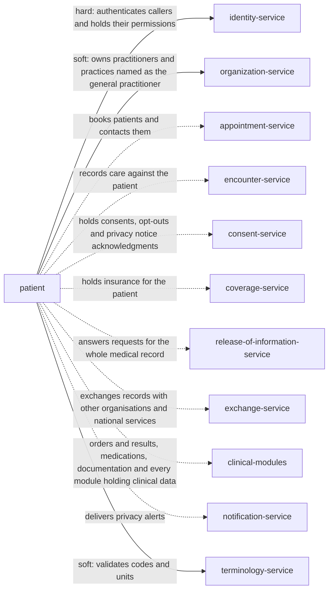

> Snapshot of healthcare/patient version 0.13.1, saved 2026-10-09. The current version is at https://knowledge-graph-ecru.vercel.app/docs/healthcare/patient.md.

# Patient records (/docs/healthcare/patient)

## Module identity

- module: patient
- layer: healthcare
- extended by: Patients (ehr, /docs/healthcare/ehr/patient)
- version: 0.13.1
- status: draft

## How to read this spec

- This is the complete spec for this page, with every inherited item already merged in.
- If a behaviour is not listed here, it is unspecified. Do not assume or invent it. Ask, or record it as an open question.
- Ids such as BR-1, FR-2 and AC-3 are stable. Cite them in code, tests and commit messages.
- Items that start with "US only:" or "EU only:" apply only in that jurisdiction. Skip the ones for a jurisdiction your project doesn't operate in, or add ?jurisdiction=us or ?jurisdiction=eu to this URL to leave them out. Unmarked items apply everywhere.
- This is the core patient specification: nothing is inherited, and industry and domain pages build on it.

## Purpose & scope

Keep one accurate record of who each patient is, so every clinical and administrative module attaches its data to the right person: register patients without creating duplicates, keep demographics and identifiers with their history, find and resolve duplicate records, record death, record who may act for the patient, and honour the patient's rights over their data. Works in the United States and the European Union.

**In scope**

- Searching for a patient, and registering one only when no existing record matches
- Names, birth date, administrative gender, addresses, phone numbers and email, with their history
- Identifiers, such as medical record numbers and national health identifiers
- Optional demographics a deployment chooses to collect, such as race and ethnicity or gender identity
- Contacts, including emergency contacts
- Personal representatives and proxies, and whether one may act for the patient
- Confidential communication preferences
- Finding duplicate records, merging them, and undoing a wrong merge
- Recording and retracting death
- Restricted records, such as for staff or public figures
- Requests to correct, restrict or erase patient data
- A log of who viewed or changed each record
- Validating every field a patient record holds
- How identity was checked at registration, and confirming details on return visits
- Patient photographs for identification, where the deployment collects them
- Warnings for patients with the same or similar names
- Representatives of minors ending at the age of majority or emancipation
- Patients updating their own contact details
- Requests for a copy of patient data
- Legal holds that stop a record being erased
- Bulk imports, such as from a legacy system
- Names in more than one script or language
- Recorded sex, kept apart from administrative gender
- Limits and alerts on patient searches
- Passing accepted corrections on to those who received the data
- Address confidentiality program addresses
- Patients' immediate electronic access to their own record

**Out of scope**

- Clinical facts about the patient, such as allergies, problems, sex for clinical use or care plans. Clinical modules own them.
- Insurance and coverage. They belong to the Coverage module, which refers to the patient by id.
- Consent to treatment, to sharing and to research, and EU opt-outs and access restrictions on health data. They belong to the Consent module.
- Logins, passwords and patient portal accounts. They belong to Identity, which links an account to a patient id.
- Printing documents and sending messages. Other modules ask this one where to send them.
- Biometric identification, such as palm or face scans.
- Exchanging records with other organisations or national services. An Exchange module does that, using the patient id and identifiers.
- Moving entries recorded on the wrong patient (overlays). Each clinical module moves its own entries; this module only reports merges and unmerges.
- Accounting of disclosures and copies of the whole medical record. They belong to the Release of information module.
- The Notice of Privacy Practices and its acknowledgment. They belong to the Consent module.

## Overview

### Product perspective

Solid arrows are services this module calls; dotted arrows are services it notifies.

### Actors

| Actor | Description |
| --- | --- |
| Registrar | Staff who register patients and keep their details up to date, such as front desk or admissions staff. |
| Health information management (HIM) specialist | Resolves duplicate records, merges and unmerges them, and decides correction requests. |
| Clinician | Reads patient details to provide care. |
| Patient | The person the record is about. |
| Personal representative | A person allowed to act for the patient: a parent, guardian or other legal representative, or a proxy the patient chose. |
| Privacy officer | Reviews who accessed patient records, and handles requests about patient data. |
| System | Another module, or this one acting on its own, such as when it proposes duplicates. |

### Assumptions and dependencies

**AS-H1** Identity authenticates every caller and says which permissions they hold.
  - Why: Who someone is as a user is a different question from who a patient is. Keeping them apart lets a patient exist with no account.
**AS-H2** The deployment has a lawful basis to process health data for care: treatment under HIPAA in the United States, and GDPR Article 9(2)(h) in the European Union.
  - Why: Without it, no patient record could be held at all. The legal basis is the deployment's responsibility, not this module's.
**AS-H3** The jurisdiction, record_retention, identifier_systems and collected_fields settings are set with legal advice before go-live.
  - Why: Retention, national identifiers and which demographics may be collected differ by US state and EU member state.
**AS-H4** Modules that record care tell this one when they do, so it knows when a patient was last cared for.
  - Why: Retention runs from the last care (BR-H18), and a record with care on it must be merged, not discarded (BR-H11).
**AS-H5** Encounters can say whether a patient has an open encounter.
  - Why: A merge during care needs extra care (BR-H31), and Encounters knows whose care is in progress.
**AS-H6** The organization has one MRN system for each scope set in mrn_scope, and this module is the only one that assigns numbers in it.
  - Why: Two systems assigning MRNs from the same range would give two patients one number.

## Functions

### Business rules

**BR-H1** Before a new patient is registered, existing records are searched with at least the name and birth date. If the search finds a probable match, the registrar either picks that record or registers a new one with a reason.
  - Why: HL7 FHIR notes that around 2% of registrations are in error, mostly duplicate records. A duplicate splits one person's history in two, so allergies and results on one are missed on the other.
**BR-H2** A record's id never changes and is never reused. Numbers people use, such as medical record numbers, are identifiers on the record, not its id.
  - Why: Other modules hold the id for years. FHIR warns that medical record numbers change, for example when duplicates are merged, so they must not be the id.
**BR-H3** An identifier's system and value belong to at most one record that is active or inactive.
  - Why: Two people with the same medical record number means a scan or a lookup can open the wrong person's record.
**BR-H4** A record has at least one usual or official name, a birth date and an administrative gender. The birth date can be partial or estimated, and the gender can be unknown, when that is all anyone knows.
  - Why: Name and birth date are what every search and every two-identifier check rely on (BR-H1). Allowing partial and estimated values records what is known instead of inventing it.
**BR-H5** A change to a name, address, phone number, email or identifier keeps the old value, marked old, with the period it was in use. Nothing is overwritten.
  - Why: USCDI includes previous name and previous address because documents and other systems still use them. Matching a referral letter in a maiden name needs the old name.
**BR-H6** Fields listed in collected_fields are optional for the patient. Race and ethnicity and gender identity are recorded as the patient reports them, with declined as an answer, and are never inferred by staff.
  - Why: OMB SPD 15 says race and ethnicity data should be self-reported wherever possible, and allows several categories. USCDI v3.1 removed sexual orientation and gender identity in 2025 while EU law treats racial or ethnic origin as special category data (GDPR Article 9), so each deployment decides what it collects.
**BR-H7** A merge retires the source record in favour of the target: the source becomes merged and points to the target with replaced_by, its identifiers are copied to the target and marked old, and patient.merged tells every module to move its data to the target. A merge always records who did it, why, and how the two records differed.
  - Why: This is the FHIR $merge behaviour. Keeping the source, rather than deleting it, lets anyone holding the old id find the right record, and makes a wrong merge reversible.
**BR-H8** Two records are merged only by an HIM specialist. Matching proposes duplicates; it never merges on its own.
  - Why: A wrong merge puts two people's care in one record, which is a worse failure than a duplicate. A person confirms every merge.
**BR-H9** Reading a merged record returns it with status merged and replaced_by, following the chain to the record in use. A change to a merged record is rejected.
  - Why: FHIR notes the record pointed to may itself have been merged later. Writing to a retired record would put new data where nobody looks.
**BR-H10** An unmerge restores the source record to active with the identifiers it had, and emits patient.unmerged. Data recorded on the target since the merge stays there, and every module is told to review it.
  - Why: A wrong merge mixes two people's care. Only the people who recorded care since the merge can tell whose it is, so nothing is moved back automatically.
**BR-H11** A record can be marked entered in error only while no care has been recorded for it (last_care_at unset). Once care exists, the record is merged instead.
  - Why: FHIR marks a record created in error as not in use. If care was recorded, discarding the record would hide that care; merging keeps it with the right person.
**BR-H12** Recording a death sets deceased, deceased_at and death_source, and emits patient.deceased. The record stays active. A death recorded in error can be retracted only by an HIM specialist, with a reason, which emits patient.death_retracted.
  - Why: FHIR notes a deceased patient's record may stay in use for some time, for results, billing and family. A wrong death record stops care and messages, so retracting it is a controlled correction.
**BR-H13** US only: A deceased patient's record keeps the same protection as a living patient's for as long as the law requires: 50 years after death in the United States.
  - Why: HIPAA protects a deceased person's health information for 50 years after death (45 CFR 164.502(f)). GDPR does not apply to the dead, but member states may set rules (Recital 27), and medical confidentiality continues.
**BR-H14** A representative is recorded with their kind (parent, guardian, other legal representative, or a proxy the patient chose), the scope of their authority, any exclusions, a period, and the evidence seen. They may act for the patient only within that scope and period, and not for an excluded service.
  - Why: HIPAA treats a personal representative as the patient (45 CFR 164.502(g)), and the EHDS lets patients authorise proxies for a limited period and purpose (Article 4(2)). Recording the scope makes every module's question "may this person act?" answerable the same way.
**BR-H15** Staff can exclude services or episodes from a representative's authority where the law lets the patient act alone, or where treating someone as the representative could endanger the patient. The exclusion is not shown to that representative.
  - Why: Under HIPAA a parent is not the representative for care a minor could consent to themselves (164.502(g)(3)), and a provider may refuse to treat someone as the representative where there is abuse or danger (164.502(g)(5)). Which care qualifies is set by state or member state law, so staff record it.
**BR-H16** A patient can ask to be contacted by other means or at another address, without giving a reason. Every module that contacts the patient asks this one where to.
  - Why: US providers must accommodate reasonable requests for confidential communications and may not ask why (45 CFR 164.522(b)). For some patients an ordinary letter home could be unsafe.
**BR-H17** A patient can ask for their data to be corrected. The request is decided within correction_deadline, extendable once by correction_extension with a written reason. An accepted correction is made and linked to the request. A denied one gives the reason in writing, and the patient can add a statement of disagreement, which stays with the record. While the patient contests accuracy, they can ask for the data to be restricted, which sets accuracy_contested. The patient can name people who received their data and need the correction.
  - Why: HIPAA gives 60 days with one 30-day extension, and requires a written denial and a right to disagree (45 CFR 164.526). GDPR gives a right to rectification (Article 16) answered within one month, extendable by two (Article 12(3)), and to restriction while accuracy is checked (Article 18(1)(a)). The EHDS adds online requests (Article 6).
**BR-H18** A request to erase a patient record is refused while record_retention applies, counted from last_care_at or the date of death, and for a patient who was a minor at their last care, not before they reach minor_retention_until_age. When it ends, and no legal hold applies, identifying fields are removed and the id is kept.
  - Why: HIPAA gives no right to erasure, and US hospitals must keep records for at least 5 years (42 CFR 482.24(b)(1)), longer in many states. Some states count minors' records from a birthday: Texas lets hospitals dispose of them only after the patient's 20th birthday or 10 years after last treatment, whichever is later (Health and Safety Code 241.103). GDPR Article 17(3)(c) lets health data be kept for care. Keeping the id keeps every other module's references valid.
**BR-H19** Every view and every change of a patient record is logged with who, when, what, and the reason given. Patients can get a report of who accessed their record where the jurisdiction gives that right.
  - Why: HIPAA requires audit controls (45 CFR 164.312(b)). The EHDS gives EU patients information on every access to their health data, kept for at least three years (Article 9).
**BR-H20** Opening a restricted or very restricted record needs a reason, coded as HL7 v3 ActReason (such as TREAT treatment, ETREAT emergency treatment or BTG break the glass), which is logged. Every opening of a very restricted record is reported to the privacy officer with patient.restricted_access.
  - Why: Staff and public figures' records are the ones colleagues are tempted to look at. A stated reason and a report deter snooping without stopping care.
**BR-H21** Every change sends the revision it read, and a stale revision is rejected.
  - Why: Registrars and HIM specialists edit the same record at once, such as during a merge. Without this, one silently undoes the other.
**BR-H22** Search and matching compare every name, address, phone number and identifier the patient has had, including old ones.
  - Why: A patient returning after years, or a referral in a former name, must still find the existing record (BR-H1).
**BR-H23** Social security numbers are not used as patient identifiers. Where one is stored, such as for a payer that needs it, it and any national identifier are shown in full only to roles that need them, and otherwise masked.
  - Why: US Core says social security numbers SHOULD NOT be used as patient identifiers because of identity theft. GDPR lets member states set conditions for national identification numbers (Article 87), and HIPAA limits use to the minimum necessary (45 CFR 164.502(b)).
**BR-H24** A record under legal hold is never erased or anonymised, even after record_retention ends. Other modules are told when a hold starts or ends.
  - Why: Texas forbids destroying records involved in unresolved litigation (Health and Safety Code 241.103(c)), and GDPR lets data be kept for legal claims (Article 17(3)(e)).
**BR-H25** A parent's or guardian's authority over a minor ends when the patient reaches age_of_majority, or earlier when emancipation is recorded. patient.representative_changed is emitted when it ends.
  - Why: HIPAA treats a parent as the personal representative of an unemancipated minor, and an adult or emancipated minor as acting for themselves (45 CFR 164.502(g)(2) and (3)). The age differs by state: 19 in Nebraska (Revised Statutes 43-2101). A parent who keeps access to an adult's record is a privacy breach.
**BR-H26** Every field is validated as listed in Validations before it is saved. A request with several invalid fields reports all of them at once.
  - Why: Bad data at registration is what creates duplicates later. Reporting every problem at once saves registrars a round trip per field.
**BR-H27** At a new patient's first registration, identity is checked against a government photo ID where the patient has one, and the kind of evidence is recorded. A patient without ID, such as a child or someone who lost it, is still registered, with the evidence recorded as none available.
  - Why: The ONC SAFER Guide recommends a picture ID for new patients, with alternatives for minors and others without one. Refusing care for lack of ID is never acceptable.
**BR-H28** Returning patients are asked to confirm their details at registration or check-in, and demographics_confirmed_at is recorded.
  - Why: The SAFER Guide recommends asking returning patients to verify their demographic data. Stale phone numbers and addresses make matching and contact fail.
**BR-H29** When collect_photo is on, a colour photograph is taken at registration with the patient's agreement, and shown wherever the patient is identified. A patient can decline.
  - Why: The SAFER Guide strongly recommends collecting photographs at registration and showing them across the EHR, and an emergency department study found fewer wrong-patient orders when a photo was shown. GDPR treats a photo as biometric data only when processed by specific technical means to identify someone (Recital 51).
**BR-H30** When another record in use has the same given and family name, both records carry similar_name_alert. Search results flag patients with the same or similar names.
  - Why: The SAFER Guide recommends warning users when a new record shares a name with another patient, or a search returns several patients with the same or similar names.
**BR-H31** A merge is allowed while either record has care in progress (an open encounter), but it is marked during_care so the care team is told, and identification labels are reprinted with the record in use.
  - Why: The SAFER Guide says that when temporary or duplicate ids are merged during care, the name must be updated in every system with safeguards against confusion.
**BR-H32** Unknown values are left blank, partial or marked estimated. Placeholders such as UNKNOWN, a made-up birth date or a dummy phone number are never stored, and matching ignores blank and estimated values.
  - Why: Project US@ says unknown address parts should be left blank and matching should not match on UNKNOWN. A placeholder makes unrelated patients look alike.
**BR-H33** Two records both marked as part of a multiple birth, with the same birth date, are proposed as possible duplicates only with a warning that they may be siblings. A pair marked not a duplicate is not proposed again unless one of the compared fields changes.
  - Why: The SAFER Guide recommends a multiple birth indicator to prevent merging twins' charts because their details are so similar.
**BR-H34** Bulk imports go through matching like any registration. An imported record with a probable match is held for review, never merged automatically, and every record is tagged with its import_batch.
  - Why: Imports and health system mergers bring large numbers of duplicates at once. The SAFER Guide asks for such charts to be flagged and resolved on a time-bound plan.
**BR-H35** An inactive record is still found by search and can be read. Any change to it, or care reported for it, makes it active again and emits patient.reactivated.
  - Why: A patient returning after years must find their old record, not get a new one (BR-H1).
**BR-H36** A patient, or their representative, can change their own phone numbers, email, addresses, languages and contacts directly. A change to their name, birth date, administrative gender or identifiers goes through a correction request (BR-H17).
  - Why: The EHDS lets EU patients request rectification online (Article 6). Contact details change often and only the patient knows them. Names, birth dates and identifiers drive identification, so staff check them against evidence.
**BR-H37** A patient, or their representative, can ask for a copy of the data this module holds about them. The request is answered within access_request_deadline. A copy of the whole medical record is the Release of information module's job.
  - Why: HIPAA gives a right of access answered within 30 days (45 CFR 164.524), and GDPR a right to a copy (Article 15) answered within one month (Article 12(3)).
**BR-H38** A merge request states which value to keep for every field where the two records differ. A merge that leaves a difference unresolved is rejected. Names, addresses, phone numbers and identifiers not kept become old values on the target; any other value not kept is stored with the merge record.
  - Why: FHIR $merge lets the caller send the expected result patient, because only a person comparing the records can tell which birth date or address is right. Picking silently, such as newest wins, can keep a typo and drop the true value.
**BR-H39** A very restricted record appears in search results only when the search includes one of its identifiers, or its full name and birth date. It is marked restricted, and shows nothing more until opened with a reason (BR-H20).
  - Why: A broad search such as a surname should not reveal that a staff member or public figure is a patient here. Someone who already has the exact details can still find the record for care.
**BR-H40** A search returns at most search_result_limit records, and asks for more detail when there are more. Every search is logged with its criteria. A user whose searches in search_alert_window exceed search_alert_threshold is reported to the privacy officer.
  - Why: HIPAA requires mechanisms that record and examine activity in systems holding health information (45 CFR 164.312(b)). Without limits, one account can list every patient.
**BR-H41** A name can be recorded in more than one script or language, such as Arabic and its Latin spelling, each tagged with its BCP 47 language and whether it is alphabetic, ideographic or syllabic. Search and matching compare every form.
  - Why: FHIR tags a name with its language and its representation (ISO 21090 alphabetic, ideographic or syllabic). Staff in different places type different spellings of the same name, and each one must still find the patient.
**BR-H42** Sex is recorded apart from administrative gender, each value with its kind: assigned at birth, legal, or other recorded. It is recorded as the patient or their documents report it, never inferred from name or appearance. Sex for clinical use belongs to clinical modules.
  - Why: FHIR separates administrative gender from recorded sex, legal sex and sex assigned at birth, and a patient can have different legal sex values in different jurisdictions. USCDI v3 names the element Sex (Assigned at Birth), and US certification rules for it changed in 2025, so the values come from the sex_codes setting.
**BR-H43** When a correction is accepted, or data is erased or restricted at the patient's request, patient.corrected is emitted. The Release of information and Exchange modules pass the change to everyone the patient named and everyone they know received the data. The patient can ask who was told.
  - Why: HIPAA requires reasonable efforts to inform people who received the data and may rely on it (45 CFR 164.526(c)(3)). GDPR requires telling each recipient of a rectification, erasure or restriction, and telling the patient who they are on request (Article 19).
**BR-H44** A denied correction, and any statement of disagreement, is given to the Release of information and Exchange modules to include, or summarise, with every later disclosure of that data.
  - Why: HIPAA requires the statement of disagreement, or an accurate summary, with any later disclosure of the information it relates to (45 CFR 164.526(d)(5)).
**BR-H45** When a patient dies, their existing representatives' authority ends. After death, a person acts for the patient only as an estate representative (an executor, administrator or other person with authority over the estate), recorded with evidence.
  - Why: HIPAA treats the executor, administrator or other person with authority over the deceased person or their estate as the personal representative (45 CFR 164.502(g)(4)).
**BR-H46** US only: An address confidentiality program substitute address is recorded as the patient's address with its program and participant number, and is never used for matching. Whether the organization must accept it is set by acp_acceptance. The real address is not required.
  - Why: States such as Washington and California give survivors of abuse a substitute address that state and local agencies must accept, while private businesses may choose to. Many participants share one substitute address, so matching on it would link strangers.
**BR-H47** Fields the service sets, such as replaced_by, last_care_at, revision, similar_name_alert, import_batch, external_links, legal_hold, accuracy_contested, correction_requests and demographics_confirmed_at, cannot be written by clients. Each changes only through its own operation.
  - Why: A client writing replaced_by could hide a record behind another one, and a forged last_care_at would change retention.
**BR-H48** A patient, or their representative within their scope, can read their own record electronically as soon as it is saved. No policy holds data back for review first. A patient can ask for their own access to be delayed (patient_requested_delay). access_request_deadline applies only to copies in another form.
  - Why: In the United States, patient demographics in the record are electronic health information (45 CFR 171.102), and ONC says a delay in making it available through a portal, for any period, is likely an interference under the information blocking rule (45 CFR 171.103), while following a patient's own request to delay is not.
**BR-H49** EU only: In the European Union, from 26 March 2029, the Exchange module gives the patient's personal details to the national electronic health data access service whenever they change, so the patient can see them at once.
  - Why: The EHDS gives patients access to their patient summary, which includes personal details and contact information, immediately after it is registered, through the access services (Articles 3 and 4, Annex I), applying to patient summaries from 26 March 2029 (Article 105).
**BR-H50** A record is not inactivated automatically while the patient has an appointment that has not started or an encounter that is open.
  - Why: inactive_after looks back at care. A patient booked for next month, or in care now, is in active use whatever their history.
**BR-H51** Each correction request is kept and linked to the record it concerns, with the request, any denial, any statement of disagreement and any rebuttal. It is kept for as long as the record, and in the United States for at least 6 years from its decision. It moves with the record in a merge.
  - Why: HIPAA requires the request, denial, disagreement and rebuttal to be appended or linked to the record (45 CFR 164.526(d)(4)) and kept for 6 years from creation or when last in effect (45 CFR 164.530(j)(2)). A merge must not lose a disagreement that has to go with later disclosures (BR-H44).
**BR-H52** The record notes who gave the registration details. In the European Union, when they came from someone other than the patient, such as a relative, emergency staff or the mother of a newborn, the Consent module is told, so the patient gets the privacy information at their first contact and in any case within one month.
  - Why: GDPR Article 14 applies when personal data is not obtained from the person, and Article 14(3) sets the deadline: within a reasonable period and at the latest one month, or at the first communication. Unidentified, unconscious and newborn patients are always registered by someone else.
**BR-H53** A contact can be marked as involved in the patient's care, and the patient can object to sharing with any contact. Staff may share with an involved contact only what is relevant to that involvement, and may tell family the patient's location, general condition or death, unless the patient objected. When the patient can't agree or object, because they are incapacitated or it is an emergency, staff decide in the patient's best interest and the decision is recorded.
  - Why: HIPAA permits these disclosures when the patient agrees, doesn't object, or, if they can't, when professional judgment finds it in their best interest (45 CFR 164.510(b)). In the EU, informing family of someone who can't consent rests on vital interests (GDPR Article 9(2)(c)). Recording objections stops staff telling an estranged relative where a patient is.
**BR-H54** Every patient gets an MRN from mrn_system at registration, including its check digit. An MRN is never reused, including after a merge, where it stays on the target marked old.
  - Why: The Joint Commission lists an assigned identification number, such as the MRN, as a patient identifier (NPG.01.01.01), and the ONC SAFER Guide recommends a check digit to catch typing errors. Reusing an MRN would make old documents and labels point at the wrong person.
**BR-H55** A patient can be registered under a privacy alias, recorded as a name with use anonymous, with confidentiality restricted or very restricted. Lists, boards and labels show the alias; the official name is shown only when the record is opened with a reason.
  - Why: FHIR defines the anonymous name use to protect a person's identity for privacy reasons. Public figures and people at risk of harm are found through boards and lists, not only through records.
**BR-H56** Where mrn_scope is facility, each facility's MRN is an identifier on the one patient record. Registering at another facility of the organization searches the whole organization and adds that facility's MRN to the existing record instead of creating another. Records found for the same person at two facilities are merged like duplicates.
  - Why: The ONC SAFER Guide calls more than one id for the same person across facilities an overlap, usually after institutions merge, and expects an enterprise index that holds every MRN with one primary key.
**BR-H57** An adult patient acting for themselves can authorise a proxy of their choice through the portal, setting the scope, period and, if they want, a purpose, and can withdraw it at any time; the proxy is recorded with kind proxy and patient.representative_changed is emitted. Parents, guardians and other legal representatives are still recorded by staff with evidence (BR-H14).
  - Why: Patients should be able to share access with a carer without visiting the organization, and take it back as easily. In the EU, access services must let people authorise people of their choice, for a limited or unlimited period and a specific purpose, and manage those authorisations (EHDS Article 4(2)(a)).

### State machine

Initial state: `active`. States: `active`, `inactive`, `merged`, `entered_in_error`.
Any transition not listed below is invalid.

| From | To | Trigger | Guard |
| --- | --- | --- | --- |
| active | inactive | inactivate, or inactive_after passes with no care | - |
| inactive | active | reactivate, or care is reported | - |
| active | merged | merge, as the source | target is active or inactive and is another record |
| inactive | merged | merge, as the source | target is active or inactive and is another record |
| merged | active | unmerge | - |
| active | entered_in_error | mark entered in error | last_care_at unset |
| inactive | entered_in_error | mark entered in error | last_care_at unset |

### Workflows

#### Register a patient
Actor: Registrar
Trigger: A person needs care and may not have a record

1. Search with name and birth date, plus any identifier, phone or address the patient gives
2. If a record matches, use it, and ask the patient to confirm their details
3. Otherwise check identity against a government photo ID where the patient has one, and record the kind of evidence
4. Register a new record, with a reason if the search found a probable match, after every field passes validation
5. Take a photograph if collect_photo is on and the patient agrees
6. Emit patient.registered
7. Propose duplicates for review if matching finds any after saving

Outcome: The patient has exactly one record, or a possible duplicate is waiting for review.

#### Review a possible duplicate
Actor: Health information management (HIM) specialist
Trigger: Matching proposes two records that may be the same person

1. Compare the two records side by side, including old names and identifiers
2. Decide: the same person, or not
3. If the same, preview the merge, then merge the newer or less complete record into the other
4. If not, mark the pair not a duplicate so it is not proposed again

Outcome: The pair is resolved, and the decision is recorded.

#### Merge two records
Actor: Health information management (HIM) specialist
Trigger: An HIM specialist confirms a duplicate

1. Check the revisions and that both records are in use
2. Ask Encounters whether either record has an open encounter, and mark the merge during_care if so
3. For every field where the records differ, record the value to keep
4. Mark the source merged with replaced_by, and copy its identifiers to the target marked old
5. Record who merged, why and how the records differed
6. Emit patient.merged; each module moves its data to the target

Outcome: One record remains, and anyone holding the old id is pointed to it.

#### Undo a wrong merge
Actor: Health information management (HIM) specialist
Trigger: An HIM specialist finds a merge joined two different people

1. Restore the source to active with its identifiers, and remove them from the target
2. Emit patient.unmerged
3. Each module reviews data recorded on the target since the merge and moves what belongs to the source

Outcome: Two records again, with care recorded since the merge checked by the people who recorded it.

#### Record a death
Actor: Registrar
Trigger: A patient dies in hospital, or a death is reported

1. Record deceased_at as precisely as known, and death_source
2. End every existing representative's authority
3. Emit patient.deceased
4. Other modules stop reminders and review future plans

Outcome: Nobody is contacted or booked as if the patient were alive.

#### Decide a correction request
Actor: Health information management (HIM) specialist
Trigger: A patient asks for their data to be corrected

1. Record the request and its due date from correction_deadline
2. If the patient asks, set accuracy_contested while it is checked
3. Accept: make the change, link it to the request, tell the patient, and emit patient.corrected so recipients are told
4. Deny: give the reason in writing, and record any statement of disagreement, which goes with later disclosures
5. Clear accuracy_contested

Outcome: Every request is answered in time, and a disagreement stays with the record.

#### End a representative at majority
Actor: System
Trigger: A minor patient reaches age_of_majority, or emancipation is recorded

1. Find parent and guardian representatives of the patient
2. End each one's period today
3. Emit patient.representative_changed for each

Outcome: The new adult controls their own record.

#### Import patients
Actor: Health information management (HIM) specialist
Trigger: A legacy system or acquired hospital sends its patient records

1. Validate every record
2. Match each against existing records
3. Create records with no probable match, tagged with the import batch
4. Hold the rest for duplicate review
5. Report the batch: created, held and rejected

Outcome: An import adds no unreviewed duplicates.

#### End retention
Actor: System
Trigger: record_retention ends for a record

1. Skip the record if it has a legal hold
2. Remove identifying fields and keep the id
3. Emit patient.updated

Outcome: Data is kept as long as the law requires and no longer.

### Validations

| Field | Rule | Error |
| --- | --- | --- |
| names | at least one usual, official or temp name; a name may have only a given name or only a family name | PATIENT_INVALID_NAME |
| names | each part holds Unicode letters and combining marks, spaces, hyphens, apostrophes and periods; digits and other symbols only in temp names | PATIENT_INVALID_NAME |
| names | case and spelling are stored exactly as given; leading and trailing spaces are removed; a single letter is a valid name | PATIENT_INVALID_NAME |
| names | a value longer than the storage allows is rejected, never truncated | PATIENT_INVALID_NAME |
| names | not a placeholder such as UNKNOWN, TEST or a string of one repeated character (BR-H32) | PATIENT_INVALID_NAME |
| birth_date | a valid ISO 8601 date, year and month, or year; not in the future; implies an age no greater than max_age | PATIENT_INVALID_BIRTH_DATE |
| administrative_gender | male, female, other or unknown | PATIENT_INVALID_CODE |
| identifiers | system listed in identifier_systems, and value matching that system's format and check digit | PATIENT_INVALID_IDENTIFIER |
| identifiers | US only: a US social security number has 9 digits and an area number other than 000, 666 or 900 to 999 | PATIENT_INVALID_IDENTIFIER |
| identifiers | system and value not held by another record in use | PATIENT_DUPLICATE_IDENTIFIER |
| telecoms | a phone number in E.164 form: a plus sign, a country code, and at most 15 digits in total | PATIENT_INVALID_TELECOM |
| telecoms | an email address with one @, a local part of at most 64 octets, and at most 254 octets in total | PATIENT_INVALID_TELECOM |
| addresses | country is an ISO 3166-1 alpha-2 code; in the US, state is a USPS two-letter code and the postal code is a 5-digit ZIP or ZIP+4 | PATIENT_INVALID_ADDRESS |
| addresses | US only: unknown parts are blank, not UNKNOWN; a general delivery address uses the words GENERAL DELIVERY (Project US@) | PATIENT_INVALID_ADDRESS |
| languages | well-formed BCP 47 tags, at most one preferred | PATIENT_INVALID_CODE |
| contacts | each contact has a name, phone, address or organisation (FHIR pat-1), and a relationship | PATIENT_INVALID_CONTACT |
| multiple_birth | true, false, or a birth order of 1 or more | PATIENT_INVALID_CODE |
| race_ethnicity | codes from race_ethnicity_categories; declined cannot be combined with a category | PATIENT_INVALID_CODE |
| race_ethnicity, tribal_affiliation, gender_identity, pronouns, marital_status, occupation, photo | accepted only when the deployment collects them (collected_fields, collect_photo) | PATIENT_FIELD_NOT_COLLECTED |
| confidentiality | normal, restricted or very_restricted | PATIENT_INVALID_CODE |
| deceased_at, death_source | not before birth_date and not in the future; death_source present | PATIENT_INVALID_DEATH_DATE |
| representatives | kind, scope and period present; period end after start; kind parent only while the patient is under age_of_majority and not emancipated | PATIENT_INVALID_REPRESENTATIVE |
| general_practitioner | Organization confirms the practitioner or practice exists | PATIENT_INVALID_CONTACT |
| any change by a patient or representative | only telecoms, addresses, languages and contacts (BR-H36) | PATIENT_SELF_SERVICE_NOT_ALLOWED |
| names | a language tag is a well-formed BCP 47 tag; a representation is alphabetic, ideographic or syllabic | PATIENT_INVALID_NAME |
| recorded_sex | kind is assigned at birth, legal or other recorded; value is in sex_codes; legal sex names its jurisdiction | PATIENT_INVALID_CODE |
| merge | a value chosen for every field where the source and target differ | PATIENT_MERGE_CONFLICT_UNRESOLVED |
| confidential_communication | a phone number, email or address that passes the same rules as telecoms and addresses | PATIENT_INVALID_TELECOM |
| identity_evidence | government photo ID, other document, known to staff, or none available | PATIENT_INVALID_CODE |
| emancipated | true only with the evidence seen recorded | PATIENT_INVALID_REPRESENTATIVE |
| interpreter_needed | yes, no or unknown | PATIENT_INVALID_CODE |
| birth_date_estimated | only together with a birth date | PATIENT_INVALID_BIRTH_DATE |
| addresses | a confidentiality program address names its program and participant number | PATIENT_INVALID_ADDRESS |
| representatives | kind estate representative only for a deceased patient; other kinds only for a living one | PATIENT_INVALID_REPRESENTATIVE |
| replaced_by, last_care_at, revision, similar_name_alert, import_batch, external_links, legal_hold, accuracy_contested, demographics_confirmed_at, correction_requests | never sent by clients (BR-H47) | PATIENT_READ_ONLY_FIELD |
| informant | one of patient, representative, relative, staff, other_organisation or unknown | PATIENT_INVALID_CODE |

### Edge cases

**EC-H1** Twins born the same day share a family name and birth date, and their mother registers both.
  - Required behaviour: The search proposes the first twin when registering the second. The registrar registers a new record with the reason "twin", and multiple_birth records the birth order.
  - Covered by: BR-H1, AC-H1
**EC-H2** A patient registered under her maiden name returns married, with a new family name.
  - Required behaviour: The search finds her through the old name. The new name is added as official and the maiden name is kept with use maiden.
  - Covered by: BR-H5, BR-H22, AC-H4
**EC-H3** A registrar types the birth date with day and month swapped.
  - Required behaviour: The search may not find the record. If a duplicate is created, matching later proposes the pair, and an HIM specialist merges them.
  - Covered by: BR-H1, BR-H8, AC-H6
**EC-H4** A patient knows only their age, not their birth date.
  - Required behaviour: birth_date is set to the estimated year, with birth_date_estimated true.
  - Covered by: BR-H4, AC-H3
**EC-H5** A patient has no fixed address.
  - Required behaviour: The record is registered with no address. Addresses are optional.
  - Covered by: BR-H4, AC-H3
**EC-H6** Two registrars update the same record at once.
  - Required behaviour: The second change fails with PATIENT_REVISION_CONFLICT and is retried on the latest revision.
  - Covered by: BR-H21, AC-H16
**EC-H7** A medical record number is entered for a second patient.
  - Required behaviour: Rejected with PATIENT_DUPLICATE_IDENTIFIER.
  - Covered by: BR-H3, AC-H2
**EC-H8** A record is merged while the source patient has an appointment booked.
  - Required behaviour: Appointments receives patient.merged and moves the appointment to the target. Reading the source returns replaced_by.
  - Covered by: BR-H7, BR-H9, AC-H7
**EC-H9** Record A was merged into B, and B was later merged into C.
  - Required behaviour: Reading A returns replaced_by C, following the chain.
  - Covered by: BR-H9, AC-H8
**EC-H10** A merge turns out to have joined two different people, and a lab result was recorded on the target since.
  - Required behaviour: The unmerge restores the source. The result stays on the target and the lab module is told to review it.
  - Covered by: BR-H10, AC-H9
**EC-H11** A record created by mistake already has a completed appointment.
  - Required behaviour: Marking it entered in error fails with PATIENT_HAS_CARE. It is merged into the right record instead.
  - Covered by: BR-H11, AC-H10
**EC-H12** A death is recorded for the wrong patient.
  - Required behaviour: An HIM specialist retracts it with a reason, and patient.death_retracted lets other modules restore reminders and plans.
  - Covered by: BR-H12, AC-H11
**EC-H13** Only the year of death is known, from a family member.
  - Required behaviour: deceased_at holds the year, with death_source family.
  - Covered by: BR-H12, AC-H11
**EC-H14** A parent asks about an appointment their 16-year-old consented to alone, where state law allows it.
  - Required behaviour: The service is excluded from the parent's authority, so the answer to "may this person act?" is no.
  - Covered by: BR-H15, AC-H13
**EC-H15** A proxy's authorisation ended last month.
  - Required behaviour: They can no longer act for the patient. The answer to "may this person act?" is no.
  - Covered by: BR-H14, AC-H12
**EC-H16** EU only: A patient asks for erasure of their record in the European Union.
  - Required behaviour: Refused with PATIENT_RETENTION_REQUIRED while record_retention applies, with the reason given.
  - Covered by: BR-H18, AC-H15
**EC-H17** A colleague opens a nurse's very restricted record without a reason.
  - Required behaviour: Rejected with PATIENT_REASON_REQUIRED. With a reason, it opens, and the privacy officer is told.
  - Covered by: BR-H20, AC-H14
**EC-H18** A registrar submits gender identity where collected_fields does not list it.
  - Required behaviour: Rejected with PATIENT_FIELD_NOT_COLLECTED.
  - Covered by: BR-H6, AC-H5
**EC-H19** A registration is retried after a timeout with the same Idempotency-Key.
  - Required behaviour: The first result is returned and no second record is created.
  - Covered by: FR-H1, AC-H17
**EC-H20** patient.updated at revision 5 arrives before revision 4.
  - Required behaviour: Consumers apply revision 5 and ignore revision 4 (DG-H2).
  - Covered by: DG-H2
**EC-H21** Identity is down.
  - Required behaviour: Every request fails with PATIENT_DEPENDENCY_UNAVAILABLE, because callers cannot be authorised.
  - Covered by: FR-H14
**EC-H22** A patient contests their birth date and asks for restriction while it is checked.
  - Required behaviour: accuracy_contested is set, so other modules see the date is disputed, until the request is decided.
  - Covered by: BR-H17
**EC-H23** A patient's name is a single word, such as a mononym common in parts of Indonesia.
  - Required behaviour: Accepted as a given name with no family name.
  - Covered by: AC-H31
**EC-H24** A registrar types "Unknown" as the family name, or 01/01/1900 as the birth date, for a patient who does not know theirs.
  - Required behaviour: Rejected. The birth date is entered as an estimated year instead, and the name left as what is known.
  - Covered by: BR-H32, AC-H32
**EC-H25** A phone number is entered as 555-1234, without a country code.
  - Required behaviour: Rejected with PATIENT_INVALID_TELECOM. Clients add the country code before sending.
  - Covered by: AC-H33
**EC-H26** A patient in Nebraska turns 18, and their parent is a representative.
  - Required behaviour: With age_of_majority 19 for Nebraska, the parent keeps authority until the 19th birthday, then it ends.
  - Covered by: BR-H25, AC-H34
**EC-H27** A 16-year-old is legally emancipated.
  - Required behaviour: Emancipation is recorded with evidence, and the parent's authority ends at once.
  - Covered by: BR-H25, AC-H34
**EC-H28** A record's retention ends while a lawsuit about the patient's care is open.
  - Required behaviour: The record is kept unchanged while the legal hold is on.
  - Covered by: BR-H24, AC-H35
**EC-H29** Two patients named Maria Garcia are registered.
  - Required behaviour: Both records carry similar_name_alert, so every screen showing either warns staff.
  - Covered by: BR-H30, AC-H36
**EC-H30** A duplicate is found for a patient who is on a ward today.
  - Required behaviour: The merge goes ahead marked during_care; the care team is told and the band is reprinted.
  - Covered by: BR-H31, AC-H37
**EC-H31** Twins are proposed as duplicates of each other.
  - Required behaviour: The proposal warns they may be siblings. Once marked not a duplicate, they are not proposed again.
  - Covered by: BR-H33, AC-H38
**EC-H32** An acquired hospital's 200,000 patients are imported.
  - Required behaviour: Records with probable matches are held for review in the batch report; none are merged automatically.
  - Covered by: BR-H34, AC-H39
**EC-H33** A patient changes their address in the portal, then tries to change their birth date.
  - Required behaviour: The address changes at once. The birth date fails with PATIENT_SELF_SERVICE_NOT_ALLOWED and the patient is offered a correction request.
  - Covered by: BR-H36, AC-H40
**EC-H34** A patient has no government ID.
  - Required behaviour: They are registered, with identity_evidence none available.
  - Covered by: BR-H27, AC-H41
**EC-H35** An inactive patient returns after 12 years.
  - Required behaviour: Search finds the inactive record; registering their visit reactivates it.
  - Covered by: BR-H35, AC-H22
**EC-H36** A patient's address is a homeless shelter.
  - Required behaviour: Recorded as a business address with the homeless flag, and matching does not treat other shelter residents as the same person.
  - Covered by: AC-H33
**EC-H37** Two duplicate records have birth dates 1980-03-04 and 1980-04-03.
  - Required behaviour: The merge is rejected until the HIM specialist chooses one; the other is stored with the merge record.
  - Covered by: BR-H38, AC-H45
**EC-H38** A registrar searches the surname of an executive of the organization who is a patient with a very restricted record.
  - Required behaviour: The record does not appear. A search with the executive's MRN shows it marked restricted.
  - Covered by: BR-H39, AC-H46
**EC-H39** An account runs hundreds of patient searches in an hour.
  - Required behaviour: Each search is logged, and the privacy officer is alerted when the threshold is passed.
  - Covered by: BR-H40, AC-H47
**EC-H40** A patient's name is recorded in Arabic, and a referral arrives with a Latin spelling.
  - Required behaviour: The search finds the record through the Latin form recorded as the same name.
  - Covered by: BR-H41, AC-H48
**EC-H41** A patient's legal sex differs between two countries' documents.
  - Required behaviour: Both are recorded as legal sex, each with its jurisdiction; administrative gender stays as registered.
  - Covered by: BR-H42, AC-H49
**EC-H42** A patient's corrected birth date was sent to a specialist last month.
  - Required behaviour: patient.corrected lets Exchange send the correction to the specialist, and the patient can ask who was told.
  - Covered by: BR-H43, AC-H51
**EC-H43** A denied correction with a statement of disagreement is followed by a records request from an insurer.
  - Required behaviour: Release of information includes the statement, or a summary, with the disclosure.
  - Covered by: BR-H44, AC-H52
**EC-H44** A patient dies; their adult daughter was their proxy, and their son is executor of the estate.
  - Required behaviour: The daughter's proxy authority ends at death. The son is recorded as estate representative with evidence and can act.
  - Covered by: BR-H45, AC-H53
**EC-H45** US only: Two unrelated patients give the same address confidentiality program PO box.
  - Required behaviour: Both are recorded with it, and matching ignores it, so they are not proposed as duplicates.
  - Covered by: BR-H46, AC-H54
**EC-H46** An integration sends replaced_by in an update.
  - Required behaviour: Rejected with PATIENT_READ_ONLY_FIELD.
  - Covered by: BR-H47, AC-H55
**EC-H47** The privacy officer's alert channel is down when a very restricted record is opened.
  - Required behaviour: The record still opens; patient.restricted_access is delivered when Notification recovers (DG-H1).
  - Covered by: BR-H20, DG-H1
**EC-H48** A patient updates their address at the desk and opens the portal a minute later.
  - Required behaviour: The new address is already visible to them.
  - Covered by: BR-H48, AC-H57
**EC-H49** EU only: An EU patient corrects their phone number in 2030.
  - Required behaviour: Exchange gives the change to the national access service, where the patient sees it at once.
  - Covered by: BR-H49, AC-H58
**EC-H50** A patient not seen for 11 years is booked for next month.
  - Required behaviour: The record is not inactivated.
  - Covered by: BR-H50, AC-H77
**EC-H51** A patient whose correction was denied is later found to be a duplicate and merged.
  - Required behaviour: The request and statement of disagreement move to the remaining record, so they still go with later disclosures.
  - Covered by: BR-H51
**EC-H52** EU only: A newborn is registered from the mother's details.
  - Required behaviour: informant is relative, and the privacy information is given to the parents as the baby's representatives.
  - Covered by: BR-H52, AC-H79
**EC-H53** An estranged parent phones the care team asking whether their adult son was admitted.
  - Required behaviour: The son objected to sharing with them, so nothing is confirmed.
  - Covered by: BR-H53, AC-H80
**EC-H54** A merge moves MRN 100234 to the target as old.
  - Required behaviour: MRN 100234 is never assigned again, and searching for it finds the target.
  - Covered by: BR-H54, AC-H81
**EC-H55** An MRN is mistyped by one digit.
  - Required behaviour: The check digit fails, so the lookup is rejected rather than opening another patient.
  - Covered by: BR-H54, AC-H82
**EC-H56** A patient known at facility A arrives at facility B of the same organization, which assigns its own MRNs.
  - Required behaviour: The enterprise search finds them, and facility B's MRN is added to the same record.
  - Covered by: BR-H56, AC-H83
**EC-H57** A patient born on 1 March is registered by a clinic in another time zone, and later viewed from a third.
  - Required behaviour: birth_date is a date with no time or zone, so it reads 1 March everywhere; it is never stored as an instant and converted.
  - Covered by: BR-H4

## Data

### Data model

| Field | Type | Required | Description | Constraints |
| --- | --- | --- | --- | --- |
| id | string | yes | The record id. It never changes and is never reused (BR-H2). | - |
| status | enum | yes | Whether the record is in use. | active \| inactive \| merged \| entered_in_error; codes: FHIR Patient.active is true only for active, and merged adds FHIR LinkType replaced-by |
| identifiers | identifier[] | no | Each with system, value, type (such as MRN or national health identifier), use (usual, official, temp, secondary or old) and period (FHIR Identifier). | system must be in identifier_systems; system plus value unique among records in use (BR-H3); codes: type from HL7 v2 Table 0203 (MR medical record number, SS social security number, PPN passport, DL driver's license, NI national identifier, JHN jurisdictional health number, PI and PT patient identifiers); use from FHIR IdentifierUse |
| names | name[] | yes | Each with use (usual, official, temp, nickname, anonymous, old or maiden), family name, given names, prefix, suffix and period (FHIR HumanName), and optionally the language and script it is written in (BR-H41). | at least one usual or official name, or a temp name (BR-H4); each part validated as in Validations; codes: use from FHIR NameUse; representation from ISO 21090 (ABC alphabetic, IDE ideographic, SYL syllabic); language as BCP 47 |
| birth_date | date | yes | Full date, or year and month, or year only when only that is known. | not in the future |
| birth_date_estimated | boolean | no | Whether birth_date is an estimate, such as from the patient's stated age. | - |
| administrative_gender | enum | yes | For administration and record keeping (FHIR Patient.gender). | male \| female \| other \| unknown; codes: FHIR AdministrativeGender: male \| female \| other \| unknown |
| recorded_sex | recorded sex[] | no | Sex as recorded for a purpose, each with its kind (assigned at birth, legal, or other recorded), value from sex_codes, the source, and the jurisdiction for legal sex (BR-H42). | codes: values from sex_codes; in the US, US Core binds sex to its Federal Administrative Sex value set, and C-CDA records it as LOINC 46098-0 Sex |
| addresses | address[] | no | Each with use (home, work, temp, old or billing), lines, city, district, state, postal code, country and period, and flags for homeless and multi-unit housing (Project US@). Unknown parts are left blank. In the United States, an address can be marked as an address confidentiality program substitute, with the program and participant number. | codes: use and type from FHIR AddressUse and AddressType; country ISO 3166-1 alpha-2; US state USPS two-letter code |
| telecoms | contact point[] | no | Phone numbers in E.164 form and email addresses, each with use (home, work, mobile, temp or old), rank and period. | codes: system and use from FHIR ContactPointSystem and ContactPointUse |
| languages | language[] | no | BCP 47 tags, one marked preferred. | codes: BCP 47 tags (RFC 5646) |
| interpreter_needed | boolean | no | Whether the patient needs an interpreter (USCDI v6). | codes: yes, no or unknown, as the US Core Interpreter Needed extension |
| multiple_birth | boolean or integer | no | Whether the patient is one of twins, triplets and so on, or their birth order (FHIR Patient.multipleBirth). | - |
| deceased | boolean | no | Whether the patient has died (BR-H12). | - |
| deceased_at | date or instant | no | When the patient died, as precisely as known. | not before birth_date |
| death_source | string | no | Who reported the death, such as a pronouncement in this hospital or a family member. | required with deceased |
| contacts | contact[] | no | People to contact about the patient, each with relationship, name, phone, address, whether they are the emergency contact, whether they are involved in the patient's care, and whether the patient objected to sharing with them (FHIR Patient.contact, BR-H53). | codes: role from HL7 v2 Table 0131 (C emergency contact, N next of kin); relationship from HL7 v3 RoleCode (MTH mother, FTH father, SPS spouse, CHILD child) |
| representatives | representative[] | no | People allowed to act for the patient, each with kind (parent, guardian, other legal representative, proxy, or estate representative), scope, exclusions, period and the evidence seen (BR-H14). A parent's authority ends at the age of majority (BR-H25). | codes: kind from HL7 v3 RoleCode: PRN parent, GUARD guardian, POWATT power of attorney, HPOWATT healthcare power of attorney, EXCEST executor of estate |
| confidential_communication | contact point or address | no | Where the patient asked to be contacted instead of their usual details (BR-H16). | - |
| general_practitioner | string | no | The patient's nominated primary care practitioner or practice, owned by the Organization module (FHIR Patient.generalPractitioner). | - |
| marital_status | code | no | Collected only when listed in collected_fields. | codes: HL7 v3 MaritalStatus: A, C, D, I, L, M, P, S, T, U, W |
| race_ethnicity | code[] | no | Self-reported, one or more categories, or declined (BR-H6). Collected only when listed in collected_fields. | codes: CDC Race and Ethnicity code set (CDCREC) 1.3, at least one OMB category; declined as HL7 NullFlavor ASKU, unknown as UNK |
| gender_identity | code | no | The gender the patient identifies with, or declined. Collected only when listed in collected_fields. | codes: SNOMED CT, as LOINC 76691-5 Gender identity; values set by the deployment |
| pronouns | code | no | How the patient asks to be referred to. Collected only when listed in collected_fields. | codes: LOINC 90778-2 Personal pronouns - Reported, as the FHIR Individual Pronouns extension |
| occupation | text | no | Current job and industry (USCDI). Collected only when listed in collected_fields. | codes: CDC Occupational Data for Health (ODH), version 20201030 in USCDI v3; LOINC 11341-5 History of Occupation |
| tribal_affiliation | code[] | no | US only: Tribes or bands the patient associates with, enrolled or not (USCDI). Collected only when listed in collected_fields. | codes: as the US Core Tribal Affiliation extension |
| confidentiality | enum | yes | How much protection the record needs (HL7 confidentiality codes N, R and V). | normal \| restricted \| very_restricted; default normal; codes: HL7 v3 Confidentiality: N normal, R restricted, V very restricted |
| accuracy_contested | boolean | no | Set while the patient contests the accuracy of their data and asked for restriction (BR-H17). | - |
| correction_requests | correction request[] | no | Requests to correct the record: what was asked and by whom, when, the deadline and any extension, the decision and its reason, any statement of disagreement and rebuttal, and the people the patient named to be told (BR-H51). | set by the service through correction requests |
| replaced_by | string | no | The record that replaced this one in a merge (FHIR link replaced-by). | set only when status = merged; codes: FHIR LinkType replaced-by, with replaces on the target; set by the service only (BR-H47) |
| last_care_at | instant | no | When another module last reported care for the patient (AS-H4). | set by the service only (BR-H47) |
| revision | integer | yes | Increases with every change. A change must send the revision it read (BR-H21). | set by the service only (BR-H47) |
| emancipated | boolean | no | Whether a minor is legally an adult, with the evidence seen. | - |
| identity_evidence | string | no | How identity was checked at registration: government photo ID, other document, known to staff, or none available. Records the kind of evidence only, never a copy. | - |
| informant | code | no | Who gave the registration details: the patient, their representative, a relative or friend, staff, or another organisation (BR-H52). | patient \| representative \| relative \| staff \| other_organisation \| unknown; codes: none standard, local to this specification |
| demographics_confirmed_at | instant | no | When the patient last confirmed their details were correct (BR-H28). | - |
| photo | image | no | A colour photograph for identification. Collected only when collect_photo is on (BR-H29). | - |
| similar_name_alert | boolean | no | Set when another record in use has the same given and family name (BR-H30). Derived, never written by clients. | set by the service only (BR-H47) |
| legal_hold | boolean | no | Set while the record is involved in litigation or another legal matter (BR-H24). | - |
| external_links | link[] | no | Records of this patient held by other organisations, as reported by the Exchange module (FHIR link type refer). | codes: FHIR LinkType refer or seealso; set by the service only (BR-H47) |
| import_batch | string | no | The import that created the record, if any (BR-H34). | set by the service only (BR-H47) |

### Relationships

| Edge | Target | Note |
| --- | --- | --- |
| has_many | identifier | current and old |
| has_many | representative | people who may act for the patient |
| has_many | duplicate-candidate | pairs of records that may be the same person |
| has_many | correction-request | requests to correct the patient's data |
| has_one | patient | replaced_by, after a merge |
| exposes_to | appointment | patient details, confidential communications and representative authority |
| can_trigger | event:patient.merged | - |

## External interfaces

### API

#### Search patients: `GET /patients`
Find patients by name, birth date, identifier, phone or address, including old values.
- Success: 200
- Actor: Registrar
- Input: any of name, birth date, identifier, phone, address; limit and cursor
- Result: at most search_result_limit records with enough detail to tell them apart, masked where BR-H23 applies, and very restricted records only as BR-H39 allows
- Errors: PATIENT_INVALID_QUERY, PATIENT_SEARCH_TOO_BROAD, PATIENT_DEPENDENCY_UNAVAILABLE

#### Match patient details: `POST /patients/match`
Score a set of patient details against existing records, like FHIR Patient $match.
- Success: 200
- Actor: System
- Input: patient details, possibly incomplete; optional count
- Result: candidates best first, each with a grade: certain, probable or possible
- Errors: PATIENT_INVALID_QUERY, PATIENT_DEPENDENCY_UNAVAILABLE

#### Register a patient: `POST /patients`
Create a patient record after a search. Accepts a retry key.
- Success: 201
- Actor: Registrar
- Input: names, birth date and whether estimated, administrative gender, and optional identifiers, addresses, telecoms, languages, contacts, confidentiality and collected fields; the search id; a reason if the search found a probable match
- Result: the record
- Errors: PATIENT_SEARCH_REQUIRED, PATIENT_POSSIBLE_DUPLICATE, PATIENT_INVALID_NAME, PATIENT_INVALID_BIRTH_DATE, PATIENT_INVALID_CODE, PATIENT_INVALID_TELECOM, PATIENT_INVALID_ADDRESS, PATIENT_INVALID_CONTACT, PATIENT_INVALID_IDENTIFIER, PATIENT_DUPLICATE_IDENTIFIER, PATIENT_FIELD_NOT_COLLECTED, PATIENT_IDEMPOTENCY_KEY_REUSED, PATIENT_READ_ONLY_FIELD, PATIENT_DEPENDENCY_UNAVAILABLE

#### Get a patient: `GET /patients/{id}`
Read a record. A merged record returns replaced_by. A restricted record needs a reason.
- Success: 200
- Actor: Clinician
- Input: patient id; a reason for restricted records
- Result: the record, as JSON or as a FHIR Patient resource, with similar_name_alert, deceased and photo where present
- Errors: PATIENT_NOT_FOUND, PATIENT_INVALID_CODE, PATIENT_REASON_REQUIRED, PATIENT_DEPENDENCY_UNAVAILABLE

#### Update a patient: `PATCH /patients/{id}`
Change demographics, identifiers, contacts, confidential communication or confidentiality. Old values are kept. Patients and representatives can change only their contact details (BR-H36).
- Success: 200
- Actor: Registrar
- Input: patient id, revision, the fields to change
- Result: the updated record
- Errors: PATIENT_NOT_FOUND, PATIENT_MERGED, PATIENT_NOT_IN_USE, PATIENT_REVISION_CONFLICT, PATIENT_INVALID_NAME, PATIENT_INVALID_BIRTH_DATE, PATIENT_INVALID_CODE, PATIENT_INVALID_TELECOM, PATIENT_INVALID_ADDRESS, PATIENT_INVALID_CONTACT, PATIENT_INVALID_IDENTIFIER, PATIENT_DUPLICATE_IDENTIFIER, PATIENT_FIELD_NOT_COLLECTED, PATIENT_SELF_SERVICE_NOT_ALLOWED, PATIENT_READ_ONLY_FIELD, PATIENT_DEPENDENCY_UNAVAILABLE

#### List possible duplicates: `GET /patient-duplicates`
Pairs of records proposed by matching, waiting for review.
- Success: 200
- Actor: Health information management (HIM) specialist
- Input: optional grade and status; limit and cursor
- Result: pairs with their grade and when they were proposed
- Errors: PATIENT_DEPENDENCY_UNAVAILABLE

#### Mark not a duplicate: `POST /patient-duplicates/{id}/not-duplicate`
Close a proposed pair as two different people.
- Success: 200
- Actor: Health information management (HIM) specialist
- Input: pair id, reason
- Result: the closed pair
- Errors: PATIENT_DUPLICATE_PAIR_NOT_FOUND, PATIENT_DUPLICATE_PAIR_CLOSED, PATIENT_DEPENDENCY_UNAVAILABLE

#### Merge patients: `POST /patients/merge`
Merge a source record into a target, or preview the result without saving.
- Success: 200
- Actor: Health information management (HIM) specialist
- Input: source id and revision, target id and revision, the value to keep for each differing field (like FHIR result-patient), reason, optional preview
- Result: the target record, with the differences found and whether the merge was during care; a preview saves nothing
- Errors: PATIENT_NOT_FOUND, PATIENT_MERGE_SAME_RECORD, PATIENT_MERGE_CONFLICT_UNRESOLVED, PATIENT_NOT_IN_USE, PATIENT_MERGED, PATIENT_REVISION_CONFLICT, PATIENT_DEPENDENCY_UNAVAILABLE

#### Undo a merge: `POST /patients/{id}/unmerge`
Restore a merged source record.
- Success: 200
- Actor: Health information management (HIM) specialist
- Input: source id, revision, reason
- Result: the restored source and the updated target
- Errors: PATIENT_NOT_FOUND, PATIENT_NOT_MERGED, PATIENT_REVISION_CONFLICT, PATIENT_DEPENDENCY_UNAVAILABLE

#### Mark entered in error: `POST /patients/{id}/entered-in-error`
Retire a record created by mistake that has no care on it.
- Success: 200
- Actor: Health information management (HIM) specialist
- Input: patient id, revision, reason
- Result: the record
- Errors: PATIENT_NOT_FOUND, PATIENT_HAS_CARE, PATIENT_MERGED, PATIENT_NOT_IN_USE, PATIENT_REVISION_CONFLICT, PATIENT_DEPENDENCY_UNAVAILABLE

#### Inactivate a patient: `POST /patients/{id}/inactivate`
Mark a record not in active use, such as a patient not seen for years.
- Success: 200
- Actor: Health information management (HIM) specialist
- Input: patient id, revision
- Result: the record
- Errors: PATIENT_NOT_FOUND, PATIENT_NOT_IN_USE, PATIENT_MERGED, PATIENT_REVISION_CONFLICT, PATIENT_DEPENDENCY_UNAVAILABLE

#### Reactivate a patient: `POST /patients/{id}/reactivate`
Return an inactive record to active use.
- Success: 200
- Actor: Registrar
- Input: patient id, revision
- Result: the record
- Errors: PATIENT_NOT_FOUND, PATIENT_NOT_IN_USE, PATIENT_MERGED, PATIENT_REVISION_CONFLICT, PATIENT_DEPENDENCY_UNAVAILABLE

#### Record a death: `POST /patients/{id}/death`
Record that the patient died.
- Success: 200
- Actor: Registrar
- Input: patient id, revision, deceased_at, death_source
- Result: the record
- Errors: PATIENT_NOT_FOUND, PATIENT_MERGED, PATIENT_ALREADY_DECEASED, PATIENT_INVALID_DEATH_DATE, PATIENT_REVISION_CONFLICT, PATIENT_DEPENDENCY_UNAVAILABLE

#### Retract a death: `POST /patients/{id}/death/retract`
Correct a death recorded in error.
- Success: 200
- Actor: Health information management (HIM) specialist
- Input: patient id, revision, reason
- Result: the record
- Errors: PATIENT_NOT_FOUND, PATIENT_NOT_DECEASED, PATIENT_REVISION_CONFLICT, PATIENT_DEPENDENCY_UNAVAILABLE

#### Add a representative: `POST /patients/{id}/representatives`
Record a person allowed to act for the patient.
- Success: 201
- Actor: Registrar
- Input: patient id, revision, person, kind, scope, exclusions, period, evidence seen
- Result: the representative
- Errors: PATIENT_NOT_FOUND, PATIENT_MERGED, PATIENT_INVALID_REPRESENTATIVE, PATIENT_REVISION_CONFLICT, PATIENT_DEPENDENCY_UNAVAILABLE

#### Change a representative: `PATCH /patients/{id}/representatives/{representativeId}`
Change a representative's scope, exclusions or period, or end their authority.
- Success: 200
- Actor: Registrar
- Input: patient id, representative id, revision, the fields to change
- Result: the representative
- Errors: PATIENT_NOT_FOUND, PATIENT_REPRESENTATIVE_NOT_FOUND, PATIENT_INVALID_REPRESENTATIVE, PATIENT_REVISION_CONFLICT, PATIENT_DEPENDENCY_UNAVAILABLE

#### Authorise a proxy: `POST /patients/{id}/proxies`
Authorise a person of the patient's choice to act for them, within a scope and period they choose.
- Success: 201
- Actor: Patient
- Input: patient id, revision, person, scope, period, purpose
- Result: the representative, kind proxy
- Errors: PATIENT_NOT_FOUND, PATIENT_MERGED, PATIENT_INVALID_REPRESENTATIVE, PATIENT_REVISION_CONFLICT

#### Withdraw a proxy: `DELETE /patients/{id}/proxies/{representativeId}`
End a proxy the patient authorised.
- Success: 200
- Actor: Patient
- Input: patient id, representative id, revision
- Result: the ended authorisation
- Errors: PATIENT_NOT_FOUND, PATIENT_REPRESENTATIVE_NOT_FOUND, PATIENT_REVISION_CONFLICT

#### Check authority to act: `GET /patients/{id}/authority`
Answer whether a person may act for the patient for a purpose, such as booking an appointment.
- Success: 200
- Actor: System
- Input: patient id, person, purpose, optional service
- Result: yes or no; never the reason for an exclusion
- Errors: PATIENT_NOT_FOUND, PATIENT_DEPENDENCY_UNAVAILABLE

#### Get contact details: `GET /patients/{id}/contact-details`
Where to contact the patient, honouring a confidential communication preference.
- Success: 200
- Actor: System
- Input: patient id, channel
- Result: the address or contact point to use, and the preferred language
- Errors: PATIENT_NOT_FOUND, PATIENT_DEPENDENCY_UNAVAILABLE

#### Report care: `POST /patients/{id}/care-reported`
Tell this module that care was recorded for the patient. Updates last_care_at.
- Success: 202
- Actor: System
- Input: patient id, when, the reporting module
- Result: accepted
- Errors: PATIENT_NOT_FOUND, PATIENT_DEPENDENCY_UNAVAILABLE

#### Request a correction: `POST /patients/{id}/correction-requests`
Ask for patient data to be corrected, and optionally restricted while it is checked.
- Success: 201
- Actor: Patient
- Input: patient id, what is wrong, the correct value, whether to restrict meanwhile, and people who received the data and need the correction
- Result: the request with its due date
- Errors: PATIENT_NOT_FOUND, PATIENT_NOT_AUTHORISED_FOR_PATIENT, PATIENT_DEPENDENCY_UNAVAILABLE

#### Decide a correction: `POST /patients/{id}/correction-requests/{requestId}/decision`
Accept, deny or extend a correction request, or add a statement of disagreement.
- Success: 200
- Actor: Health information management (HIM) specialist
- Input: request id, decision (accept, deny or extend), reason, statement of disagreement
- Result: the request
- Errors: PATIENT_CORRECTION_NOT_FOUND, PATIENT_CORRECTION_CLOSED, PATIENT_EXTENSION_USED, PATIENT_DEPENDENCY_UNAVAILABLE

#### Request erasure: `POST /patients/{id}/erasure-requests`
Ask for the patient record to be erased.
- Success: 202
- Actor: Patient
- Input: patient id
- Result: accepted, or refused while record_retention applies
- Errors: PATIENT_NOT_FOUND, PATIENT_RETENTION_REQUIRED, PATIENT_LEGAL_HOLD, PATIENT_NOT_AUTHORISED_FOR_PATIENT, PATIENT_DEPENDENCY_UNAVAILABLE

#### Read the access log: `GET /patients/{id}/access-log`
Every view and change of a record. A patient gets their own access report where the jurisdiction gives that right.
- Success: 200
- Actor: Privacy officer
- Input: patient id, optional period; limit and cursor
- Result: entries with who, when, what and reason
- Errors: PATIENT_NOT_FOUND, PATIENT_NOT_AUTHORISED_FOR_PATIENT, PATIENT_DEPENDENCY_UNAVAILABLE

#### Confirm details: `POST /patients/{id}/details-confirmed`
Record that a returning patient confirmed their details.
- Success: 200
- Actor: Registrar
- Input: patient id, revision
- Result: the record
- Errors: PATIENT_NOT_FOUND, PATIENT_MERGED, PATIENT_REVISION_CONFLICT, PATIENT_DEPENDENCY_UNAVAILABLE

#### Set a photo: `PUT /patients/{id}/photo`
Store or replace the patient's photograph.
- Success: 200
- Actor: Registrar
- Input: patient id, revision, image
- Result: the record
- Errors: PATIENT_NOT_FOUND, PATIENT_MERGED, PATIENT_FIELD_NOT_COLLECTED, PATIENT_REVISION_CONFLICT, PATIENT_DEPENDENCY_UNAVAILABLE

#### Place or release a legal hold: `POST /patients/{id}/legal-hold`
Stop or allow erasure of a record because of a legal matter.
- Success: 200
- Actor: Privacy officer
- Input: patient id, revision, on or off, reason
- Result: the record
- Errors: PATIENT_NOT_FOUND, PATIENT_REVISION_CONFLICT, PATIENT_DEPENDENCY_UNAVAILABLE

#### Request a copy: `POST /patients/{id}/copy-requests`
Ask for a copy of the data this module holds about the patient.
- Success: 201
- Actor: Patient
- Input: patient id, format
- Result: the request with its due date
- Errors: PATIENT_NOT_FOUND, PATIENT_NOT_AUTHORISED_FOR_PATIENT, PATIENT_DEPENDENCY_UNAVAILABLE

#### Import patients: `POST /patient-imports`
Import a batch of patient records through validation and matching.
- Success: 202
- Actor: Health information management (HIM) specialist
- Input: records and the source system
- Result: the batch id; the report when it finishes
- Errors: PATIENT_IMPORT_TOO_LARGE, PATIENT_DEPENDENCY_UNAVAILABLE

### API conventions

| Topic | Convention | Reference |
| --- | --- | --- |
| Authentication | Every request carries the caller's identity from Identity. Permissions are checked against it (Permission matrix). | - |
| Errors | Errors use problem details with the media type application/problem+json, with a code member carrying the error code, such as PATIENT_DUPLICATE_IDENTIFIER. | RFC 9457 |
| Pagination | Lists are cursor-based: a request sends limit and an optional cursor, and the response returns next_cursor until there are no more results. | - |
| Concurrency | Every change sends the revision it read. A stale revision fails with PATIENT_REVISION_CONFLICT (BR-H21). | - |
| Retries | Every change accepts an Idempotency-Key header. A retry with the same key returns the original result (FR-H1). | IETF draft-ietf-httpapi-idempotency-key-header |
| Rate limits | A caller over its limit gets 429 Too Many Requests with a Retry-After header. | RFC 6585, RFC 9110 |
| Dates | Dates are ISO 8601 and may be partial (year, or year and month). Instants are RFC 3339 timestamps in UTC (CON-H3). | RFC 3339 |
| FHIR | GET /patients/{id} returns an HL7 FHIR R5 Patient resource when the request asks for application/fhir+json (FR-H12). | - |
| Personal data in URLs | Names, birth dates and identifiers are sent in request bodies or query parameters over TLS, never in paths, and are never written to request logs. | - |
| Versioning | Additive changes don't change the version. A breaking change ships as a new major version, announced with Deprecation and Sunset headers. | RFC 9745, RFC 8594 |

### Events

| Event | Description | Payload |
| --- | --- | --- |
| patient.registered | A new record was created. | patient_id, informant, revision |
| patient.updated | Details changed. Lists the fields that changed, not their values. | patient_id, changed_fields, revision |
| patient.merged | The source was merged into the target. Move data to the target. | source_patient_id, target_patient_id, during_care, revision |
| patient.unmerged | A merge was undone. Review data recorded on the target since the merge. | source_patient_id, target_patient_id, merged_at, revision |
| patient.deceased | The patient died. | patient_id, deceased_at, revision |
| patient.death_retracted | A death was recorded in error. | patient_id, revision |
| patient.entered_in_error | The record was created by mistake. | patient_id, revision |
| patient.inactivated | The record is no longer in active use. | patient_id, revision |
| patient.reactivated | The record is in use again. | patient_id, revision |
| patient.representative_changed | A representative was added, changed or ended. | patient_id, representative_id, revision |
| patient.restricted_access | A very restricted record was opened. For the privacy officer. | patient_id, accessed_by, reason, accessed_at |
| patient.legal_hold_changed | A legal hold started or ended. Other modules keep or release their own data for the patient. | patient_id, legal_hold, revision |
| patient.search_volume_alert | A user's searches passed search_alert_threshold. For the privacy officer. | user, search_count, window_start |
| patient.corrected | An accepted correction, erasure or restriction to pass on to recipients. | patient_id, request_id, changed_fields, named_recipients, revision |
| patient.disagreement_filed | A correction was denied and the patient filed a statement of disagreement, to go with later disclosures. | patient_id, request_id, revision |

### Event delivery

**DG-H1** Events are published at least once. Consumers treat an event with a source and id they have already seen as a duplicate.
  - Why: A relay can publish twice if it crashes after publishing. CloudEvents defines source plus id as the duplicate check.
**DG-H2** Events for one patient can arrive out of order. Each carries the revision, and consumers ignore one lower than a revision they have applied.
  - Why: Brokers and retries don't guarantee order. The revision orders every change to a record.
**DG-H3** Events carry ids and the names of changed fields, never names, birth dates, addresses or identifiers. Consumers read the record for details.
  - Why: Events fan out to many modules and logs. Keeping demographics out of them follows the minimum necessary standard (45 CFR 164.502(b)) and GDPR data minimisation (Article 5(1)(c)).
**DG-H4** Every event carries a unique id, its type, the patient it is about and when the change happened.
  - Why: The id lets consumers drop duplicates (DG-H1). CloudEvents requires id, type and source on every event.

### Errors

| Code | HTTP | Meaning |
| --- | --- | --- |
| PATIENT_NOT_FOUND | 404 | No patient exists with that id. |
| PATIENT_INVALID_QUERY | 422 | Search with at least a name and birth date, or an identifier, phone number or address. |
| PATIENT_SEARCH_REQUIRED | 422 | Search for the patient before registering them, and send the search id. |
| PATIENT_POSSIBLE_DUPLICATE | 409 | A probable match exists. Use that record, or register with a reason. |
| PATIENT_INVALID_NAME | 422 | Give at least one usual, official or temporary name, using letters, spaces, hyphens, apostrophes or periods. |
| PATIENT_INVALID_BIRTH_DATE | 422 | The birth date must be a full or partial date, not in the future, and not older than max_age. |
| PATIENT_INVALID_CODE | 422 | A code isn't in the allowed list for its field. |
| PATIENT_INVALID_IDENTIFIER | 422 | The identifier system isn't accepted, or the value isn't in its format. |
| PATIENT_DUPLICATE_IDENTIFIER | 409 | Another patient already has that identifier. |
| PATIENT_FIELD_NOT_COLLECTED | 422 | This deployment doesn't collect that field. |
| PATIENT_IDEMPOTENCY_KEY_REUSED | 422 | That Idempotency-Key was used for a different request. |
| PATIENT_REVISION_CONFLICT | 409 | The record changed since you read it. Read it again and retry. |
| PATIENT_MERGED | 409 | This record was merged. Use the record in replaced_by. |
| PATIENT_NOT_IN_USE | 409 | This record is entered in error, or not in the state this change needs. |
| PATIENT_MERGE_SAME_RECORD | 422 | The source and target must be different records. |
| PATIENT_NOT_MERGED | 409 | Only a merged record can be unmerged. |
| PATIENT_HAS_CARE | 409 | Care is recorded for this patient. Merge the record instead. |
| PATIENT_ALREADY_DECEASED | 409 | A death is already recorded. Retract it first to change it. |
| PATIENT_NOT_DECEASED | 409 | No death is recorded for this patient. |
| PATIENT_INVALID_DEATH_DATE | 422 | The date of death can't be before birth or in the future. |
| PATIENT_INVALID_REPRESENTATIVE | 422 | A representative needs a kind, a scope and a valid period. |
| PATIENT_REPRESENTATIVE_NOT_FOUND | 404 | No such representative for this patient. |
| PATIENT_REASON_REQUIRED | 403 | This record is restricted. Give a reason to open it. |
| PATIENT_NOT_AUTHORISED_FOR_PATIENT | 403 | Only the patient or their personal representative can request this. |
| PATIENT_RETENTION_REQUIRED | 409 | This record must be kept until record_retention ends. |
| PATIENT_DUPLICATE_PAIR_NOT_FOUND | 404 | No such possible duplicate. |
| PATIENT_DUPLICATE_PAIR_CLOSED | 409 | This pair was already resolved. |
| PATIENT_CORRECTION_NOT_FOUND | 404 | No such correction request. |
| PATIENT_CORRECTION_CLOSED | 409 | This correction request was already decided. |
| PATIENT_EXTENSION_USED | 409 | The one allowed extension was already used. |
| PATIENT_DEPENDENCY_UNAVAILABLE | 503 | A service this request needs is unavailable. Retry later. |
| PATIENT_INVALID_TELECOM | 422 | Phone numbers need E.164 form with a country code; email addresses must be valid and at most 254 characters. |
| PATIENT_INVALID_ADDRESS | 422 | The address has an invalid country, state or postal code, or a placeholder instead of a blank. |
| PATIENT_INVALID_CONTACT | 422 | A contact needs a relationship and a name, phone, address or organisation. |
| PATIENT_SELF_SERVICE_NOT_ALLOWED | 403 | Patients can change only their contact details here. Ask for a correction to change this. |
| PATIENT_LEGAL_HOLD | 409 | This record is under a legal hold and must be kept. |
| PATIENT_IMPORT_TOO_LARGE | 413 | The import batch is larger than max_import_batch. Split it. |
| PATIENT_MERGE_CONFLICT_UNRESOLVED | 422 | Choose which value to keep for every field where the records differ. |
| PATIENT_SEARCH_TOO_BROAD | 422 | Too many patients match. Add a birth date, identifier or more of the name. |
| PATIENT_READ_ONLY_FIELD | 422 | That field is set by the service and can't be written. |

### Dependencies

Each dependency lists its contract: only what this module needs from it (upstream) or gives it (downstream). How the other module works is out of scope.

| Service | Direction | Criticality | Reason | Contract |
| --- | --- | --- | --- | --- |
| identity-service | upstream | hard | authenticates callers and holds their permissions | Asks: who is the caller, and do they hold this permission?; Gives: the patient id to link to a portal account, once Identity has proofed the person; Logins, accounts and identity proofing for the portal are Identity's concern; Answers: does this enrolment match a patient record in use?; Answers: who represents this patient, with what scope?; Gives: patient.merged, patient.unmerged, patient.deceased and patient.representative_changed, so portal and representative accounts follow; Gives: patient.death_retracted and patient.entered_in_error, so portal accounts follow; Receives: identity.break_glass_used, so the access report shows each emergency access |
| organization-service | upstream | soft | owns practitioners and practices named as the general practitioner | Asks: does this practitioner or practice exist? |
| appointment-service | downstream | soft | books patients and contacts them | Gives: whether a patient exists and is in use, following replaced_by; Gives: the identifiers to verify at check-in, and where to contact the patient; Gives: the patient's preferred language and whether they need an interpreter; Gives: whether a person may act for the patient for an appointment; Gives: patient.merged, patient.unmerged, patient.deceased, patient.death_retracted and patient.entered_in_error; Asks: does this patient have an appointment that has not started?; Receives: details confirmed at check-in; Gives: whether and when the patient confirmed their details, for pre-registration; Receives: care reported at check-in |
| encounter-service | downstream | soft | records care against the patient | Gives: patient.merged (with during_care), patient.unmerged and patient.deceased; Receives: care reported when an encounter starts; Asks: does this patient have an open encounter?; Moving clinical data between records after a merge is Encounter's concern |
| consent-service | downstream | soft | holds consents, opt-outs and privacy notice acknowledgments | Gives: patient.registered with informant, so the privacy notice is given when the data came from someone else (GDPR Article 14); Gives: patient.registered, so the Notice of Privacy Practices acknowledgment can be sought at first service (45 CFR 164.520(c)(2)(ii)); Gives: patient.merged, patient.unmerged, patient.deceased and patient.representative_changed; Asks: has the patient opted out of a contact channel? (used when answering where to contact them); Restriction requests and EU opt-outs are Consent's concern |
| coverage-service | downstream | soft | holds insurance for the patient | Gives: patient.merged, patient.unmerged, patient.deceased and patient.entered_in_error; Registration never waits for Coverage |
| release-of-information-service | downstream | soft | answers requests for the whole medical record | Gives: this module's part of a copy request; Gives: this module's data for a single-patient electronic health information export (45 CFR 170.315(b)(10)); producing the export is Release of information's concern; Accounting of disclosures (45 CFR 164.528) is its concern; Receives: patient.corrected, to pass the correction to recipients (45 CFR 164.526(c)(3), GDPR Article 19); Receives: patient.disagreement_filed, to include with later disclosures (45 CFR 164.526(d)(5)); Telling the patient who received their data is Release of information's concern |
| exchange-service | downstream | soft | exchanges records with other organisations and national services | Gives: identifiers and patient.* events for outside patient indexes; Receives: links to this patient's records elsewhere (external_links); Receives: deaths reported from outside, recorded with their source; Cross-border identification under EHDS Article 16 is Exchange's concern; Uses IHE PIXm (identifier cross-referencing), PDQm (demographics query) or PMIR (master identity registry) with outside patient indexes; Receives: patient.corrected and patient.disagreement_filed, for records it has sent elsewhere; Gives: the patient's personal details to the EU national electronic health data access service on every change, from 26 March 2029 (EHDS Article 3) |
| clinical-modules | downstream | soft | orders and results, medications, documentation and every module holding clinical data | Gives: patient.merged, patient.unmerged, patient.deceased, patient.death_retracted, patient.entered_in_error, patient.inactivated, patient.reactivated and patient.legal_hold_changed; Gives: patient.updated, so modules showing patient details refresh them; Gives: the patient banner details: names, birth date, identifiers, photo, deceased and similar_name_alert; Moving entries recorded on the wrong patient is each module's concern |
| notification-service | downstream | soft | delivers privacy alerts | Gives: patient.restricted_access and patient.search_volume_alert, to deliver to the privacy officer; Delivery channels and on-call rotas are Notification's concern |
| terminology-service | upstream | soft | validates codes and units | Asks: is this code valid in this code system on this date?; Asks: which codes the value set bound to each coded setting allows on this date; Receives: terminology.release_activated and terminology.value_set_activated, to refresh cached code lists |

## Security

### Permission matrix

| Action | Registrar | Health information management (HIM) specialist | Clinician | Patient | Privacy officer | System | Permission |
| --- | --- | --- | --- | --- | --- | --- | --- |
| Search and read a patient | any | any | any | own | any | none | patient.read |
| Register or update a patient | any | any | none | own | none | none | patient.register |
| Record a death | any | any | any | none | none | none | patient.register |
| Add or change a representative | any | any | none | none | none | none | patient.register |
| Review duplicates, merge and unmerge | none | any | none | none | none | none | patient.merge |
| Mark entered in error, or retract a death | none | any | none | none | none | none | patient.merge |
| Request a correction or erasure | none | none | none | own | none | none | patient.read |
| Decide a correction | none | any | none | none | none | none | patient.merge |
| Read the access log | none | none | none | own | any | none | patient.audit |
| See identifiers unmasked | none | any | none | own | none | none | patient.identifiers_unmasked |
| Match patient details | any | any | none | none | none | any | patient.read |
| Check authority to act, or get contact details | any | any | none | none | none | any | patient.read |
| Report care | none | none | none | none | none | any | patient.read |
| Inactivate or reactivate a patient | own | any | none | none | none | any | patient.merge |
| Confirm details, or set a photo | any | any | none | none | none | none | patient.register |
| Request a copy | none | none | none | own | none | none | patient.read |
| Place or release a legal hold | none | any | none | none | any | none | patient.legal_hold |
| Import patients | none | any | none | none | none | none | patient.import |
| Authorise or withdraw a proxy | none | none | none | own | none | none | patient.self |

any: every appointment. own: appointments the actor takes part in. none: not allowed.

- Search and read a patient: A restricted record needs a reason (BR-H20). A personal representative reads within their scope (BR-H14).

- Register or update a patient: Patients and representatives change only their own contact details (BR-H36); other changes go through a correction request.

- Request a correction or erasure: A personal representative can request for the patient they represent.

- Read the access log: Patients get their own access report where the jurisdiction gives that right (FR-H11).

- See identifiers unmasked: Deployments grant it to other roles that need it, such as billing.

- Report care: Only modules that record care.

- Inactivate or reactivate a patient: Registrars reactivate only, when a patient returns (BR-H35).

- Request a copy: A personal representative can request for the patient they represent.

- Authorise or withdraw a proxy: An adult patient acting for themselves; representatives can't authorise proxies.

### Permissions

| Permission | Grants |
| --- | --- |
| patient.read | Read patient records. |
| patient.register | Search, register and update patients, and record deaths and representatives. |
| patient.merge | Review duplicates, merge and unmerge, mark records entered in error, retract deaths and decide corrections. |
| patient.identifiers_unmasked | See national identifiers and social security numbers in full (BR-H23). |
| patient.audit | Read the access log of any record. |
| patient.legal_hold | Place and release legal holds. |
| patient.import | Import patient records in bulk. |
| patient.self | Act on your own patient record through the portal. |

### Privacy and retention

| Field | Category | Purpose | Retention |
| --- | --- | --- | --- |
| names, birth_date, birth_date_estimated, administrative_gender | personal | Identifying the patient | record_retention |
| identifiers | personal; national identifiers are identifiers of general application (GDPR Article 87) | Identifying the patient across systems | record_retention |
| addresses, telecoms, contacts | personal | Contacting the patient and their emergency contacts | record_retention |
| confidential_communication | personal; can reveal a risk to the patient | Contacting the patient safely | record_retention |
| race_ethnicity | special category (GDPR Article 9) | Reporting and equity monitoring, where collected | record_retention |
| gender_identity, pronouns | special category where it reveals sex life or sexual orientation | Addressing the patient as they ask, where collected | record_retention |
| deceased_at, death_source | health data | Stopping contact and closing care | record_retention |
| representatives | personal, about the representative too | Deciding who may act for the patient | record_retention |
| access log | personal | Showing who accessed the record | access_log_retention |
| languages, interpreter_needed | personal; can suggest ethnic origin | Communicating with the patient | record_retention |
| marital_status, occupation, multiple_birth | personal | Identification and the patient's context, where collected | record_retention |
| general_practitioner | personal; reveals a care relationship | Sharing care with the patient's own doctor | record_retention |
| last_care_at | health data; reveals when care happened | Counting retention, and inactivating records | record_retention |
| accuracy_contested | personal | Showing a dispute about the patient's data | Until the correction request is decided |
| photo | personal; biometric only if processed to identify by technical means (GDPR Recital 51) | Identifying the patient before care | record_retention |
| identity_evidence, emancipated | personal | Showing how identity and legal status were checked | record_retention |
| external_links | personal; reveals other care providers | Finding the patient's records elsewhere | record_retention |
| recorded_sex | personal; can reveal sex life or gender history, a special category in the EU | Identification and records required by law | record_retention |
| demographics_confirmed_at | personal | Knowing how current the details are | record_retention |
| search log | personal, about the user and the patients searched | Detecting snooping and enumeration | access_log_retention |
| tribal_affiliation | personal; can reveal ethnic origin, a special category in the EU | Reporting and care that depends on it, where collected | record_retention |
| address confidentiality program number | personal; reveals the patient is in a protection program | Using the substitute address lawfully | record_retention |
| correction_requests | personal, and health data where the request concerns it | Honouring the patient's right to correction, and showing it was honoured | record_retention; in the United States, at least 6 years from the decision (BR-H51) |
| informant | personal | Knowing whether the patient was told about the processing (GDPR Article 14) | record_retention |

### Compliance

**CMP-H1** HIPAA Privacy Rule, 45 CFR 164.502(b): US only: Use and disclose only the minimum necessary.
  - How it's met: Events carry ids only; national identifiers are masked for roles that don't need them.
  - Status: met
  - Covered by: BR-H23, DG-H3
**CMP-H2** HIPAA Privacy Rule, 45 CFR 164.502(f): US only: Protect a deceased person's information for 50 years after death.
  - How it's met: The record keeps the same protection after death.
  - Status: met
  - Covered by: BR-H13
**CMP-H3** HIPAA Privacy Rule, 45 CFR 164.502(g): US only: Treat personal representatives as the patient, within their authority, with the exceptions for minors and danger.
  - How it's met: Representatives have a kind, scope, exclusions and period; authority ends at majority, emancipation or death, and estate representatives act after death.
  - Status: met
  - Covered by: BR-H14, BR-H15, BR-H25, BR-H45
**CMP-H4** HIPAA Privacy Rule, 45 CFR 164.520: US only: Give the Notice of Privacy Practices and seek acknowledgment at first service.
  - How it's met: The Consent module, which receives patient.registered.
  - Status: other module
**CMP-H5** HIPAA Privacy Rule, 45 CFR 164.522(b): US only: Accommodate confidential communications without asking why.
  - How it's met: Every module asks this one where to contact the patient.
  - Status: met
  - Covered by: BR-H16
**CMP-H6** HIPAA Privacy Rule, 45 CFR 164.524: US only: Give individuals access to their information.
  - How it's met: Patients read their own record electronically at once, and copies in other forms are tracked against access_request_deadline.
  - Status: met
  - Covered by: BR-H37, BR-H48
**CMP-H7** HIPAA Privacy Rule, 45 CFR 164.526: US only: Decide amendment requests within 60 days, inform recipients, and keep statements of disagreement with later disclosures.
  - How it's met: Correction requests, patient.corrected and patient.disagreement_filed. Requests are kept linked to the record with any denial, disagreement and rebuttal.
  - Status: met
  - Covered by: BR-H17, BR-H43, BR-H44, BR-H51
**CMP-H8** HIPAA Privacy Rule, 45 CFR 164.528: US only: Give an accounting of disclosures for six years.
  - How it's met: The Release of information module.
  - Status: other module
**CMP-H9** HIPAA Security Rule, 45 CFR 164.308(a)(1)(ii)(D): US only: Regularly review information system activity, such as audit logs and access reports.
  - How it's met: Searches are logged and unusual volume is reported; very restricted openings are reported.
  - Status: met
  - Covered by: BR-H40, BR-H20
**CMP-H10** HIPAA Security Rule, 45 CFR 164.312(a)(1): US only: Access control, including an emergency access procedure.
  - How it's met: Accounts, roles and the emergency access procedure are the Identity and access module's; this module adds a coded reason for opening restricted records (BR-H20).
  - Status: partly met
  - Covered by: BR-H20
**CMP-H11** HIPAA Security Rule, 45 CFR 164.312(b): US only: Audit controls.
  - How it's met: Every view and change is logged with who, when, what and why.
  - Status: met
  - Covered by: BR-H19, FR-H10, CON-H2
**CMP-H12** HIPAA Security Rule, 45 CFR 164.312(a)(2)(iv) and (e): US only: Encryption at rest and in transit (addressable; the 2025 proposed rule would make it required).
  - How it's met: Patient data is encrypted in transit and at rest.
  - Status: met
  - Covered by: CON-H1
**CMP-H13** HIPAA Security Rule, 45 CFR 164.308(a)(1)(ii)(A): US only: Risk analysis.
  - How it's met: An organisational duty of the deployment.
  - Status: deployment
**CMP-H14** HIPAA Breach Notification Rule, 45 CFR 164.404: US only: Notify individuals of a breach within 60 calendar days of discovery.
  - How it's met: The Security module.
  - Status: other module
**CMP-H15** 21st Century Cures Act information blocking, 45 CFR 171.103: US only: Don't interfere with access to electronic health information.
  - How it's met: No review delay on patients' own access; delays only at the patient's request.
  - Status: met
  - Covered by: BR-H48
**CMP-H16** GDPR (EU) 2016/679, Article 5(1)(c): EU only: Data minimisation.
  - How it's met: Optional demographics are off by default and events carry no details.
  - Status: met
  - Covered by: BR-H6, DG-H3
**CMP-H17** GDPR (EU) 2016/679, Article 5(1)(d): EU only: Accuracy.
  - How it's met: Returning patients confirm their details; corrections and placeholders are handled.
  - Status: met
  - Covered by: BR-H28, BR-H17, BR-H32
**CMP-H18** GDPR (EU) 2016/679, Articles 5(1)(e), 17 and 17(3): EU only: Storage limitation and erasure, except for care and legal claims.
  - How it's met: Erasure is refused during retention and legal holds, then identifying fields are removed.
  - Status: met
  - Covered by: BR-H18, BR-H24, FR-H16
**CMP-H19** GDPR (EU) 2016/679, Article 9: EU only: Special category data needs a basis, and racial or ethnic origin is special category.
  - How it's met: Basis set by the deployment; race, ethnicity and gender identity collected only where configured, self-reported.
  - Status: met
  - Covered by: AS-H2, BR-H6
**CMP-H20** GDPR (EU) 2016/679, Articles 12(3) and 15: EU only: Give access and a copy within one month, extendable by two.
  - How it's met: Immediate electronic access and tracked copy requests.
  - Status: met
  - Covered by: BR-H37, BR-H48
**CMP-H21** GDPR (EU) 2016/679, Article 13: EU only: Inform the patient about the processing when data is collected.
  - How it's met: The Consent module gives the privacy notice at registration.
  - Status: other module
**CMP-H22** GDPR (EU) 2016/679, Articles 16 and 18: EU only: Rectification, and restriction while accuracy is contested.
  - How it's met: Correction requests and accuracy_contested.
  - Status: met
  - Covered by: BR-H17
**CMP-H23** GDPR (EU) 2016/679, Article 19: EU only: Tell recipients of rectification, erasure or restriction.
  - How it's met: patient.corrected, passed on by Release of information and Exchange.
  - Status: met
  - Covered by: BR-H43
**CMP-H24** GDPR (EU) 2016/679, Article 20: EU only: Data portability, where processing is based on consent or contract.
  - How it's met: Care is usually based on Article 9(2)(h), so Article 20 rarely applies; EU patients get portability of health data through the EHDS (Article 7), handled by Exchange.
  - Status: other module
**CMP-H25** GDPR (EU) 2016/679, Article 25: EU only: Data protection by design and by default.
  - How it's met: Read-only service fields, optional fields off by default, very restricted records hidden from broad search.
  - Status: met
  - Covered by: BR-H47, BR-H39
**CMP-H26** GDPR (EU) 2016/679, Article 32: EU only: Security appropriate to the risk.
  - How it's met: Encryption, access logging, reasons for restricted records and search monitoring.
  - Status: met
  - Covered by: CON-H1, BR-H19, BR-H20, BR-H40
**CMP-H27** GDPR (EU) 2016/679, Article 87: EU only: Conditions for national identification numbers.
  - How it's met: Shown in full only to roles that need them.
  - Status: met
  - Covered by: BR-H23
**CMP-H28** GDPR (EU) 2016/679, Articles 30, 33 to 35 and 37: EU only: Records of processing, breach notification within 72 hours, impact assessment for large-scale health data, and a data protection officer.
  - How it's met: Organisational duties of the deployment.
  - Status: deployment
**CMP-H29** European Health Data Space (EU) 2025/327, Articles 3, 4 and 9: EU only: Immediate access through national access services, and information on who accessed the data.
  - How it's met: Personal details go to the national access service on change from 2029; access reports.
  - Status: met
  - Covered by: BR-H49, BR-H19
**CMP-H30** GDPR (EU) 2016/679, Article 21: EU only: A right to object where processing is based on a public task or legitimate interests (Article 6(1)(e) or (f)), as at many public hospitals.
  - How it's met: Whether it applies depends on the organization's lawful basis; the deployment decides how objections are handled, and medical records needed for care usually remain compelling grounds.
  - Status: deployment
  - Covered by: AS-H2
**CMP-H31** HIPAA Privacy Rule, 45 CFR 164.530(j): US only: Keep required documentation for 6 years from its creation or when it was last in effect, whichever is later.
  - How it's met: Correction requests are kept with the record, and at least 6 years from their decision in the US.
  - Status: met
  - Covered by: BR-H51
**CMP-H32** ONC Health IT Certification, 45 CFR 170.315(b)(10): US only: Certified health IT lets a user export all of one patient's electronic health information at any time.
  - How it's met: This module gives its data for the export; Release of information produces it.
  - Status: other module
**CMP-H33** GDPR (EU) 2016/679, Article 6(1): EU only: Processing health data needs a lawful basis under Article 6 as well as an exception under Article 9.
  - How it's met: The deployment states its basis with Article 9(2)(h): usually a legal obligation (6(1)(c)) or a public task (6(1)(e)) for public hospitals, or a contract (6(1)(b)) for private care.
  - Status: deployment
  - Covered by: AS-H2
**CMP-H34** GDPR (EU) 2016/679, Article 14: EU only: Inform the person when their data was obtained from someone else, within one month or at the first communication.
  - How it's met: The record notes the informant and tells the Consent module, which gives the notice.
  - Status: other module
  - Covered by: BR-H52
**CMP-H35** HIPAA Privacy Rule, 45 CFR 164.510(b): US only: Disclose to family and others involved in care, or notify them of location, condition or death, only with agreement, no objection, or professional judgment of best interest.
  - How it's met: Contacts are marked involved in care, objections are recorded, and best-interest decisions are logged.
  - Status: met
  - Covered by: BR-H53
**CMP-H36** GDPR (EU) 2016/679, Articles 44 to 49: EU only: Transfers of personal data outside the EU need an adequacy decision or appropriate safeguards.
  - How it's met: Where data is stored and who processes it is a deployment choice.
  - Status: deployment
**CMP-H37** Section 504 and Section 1557 (Affordable Care Act), 45 CFR 84.84 and 92.204: US only: Patient-facing web content and mobile apps meet WCAG 2.1 Level AA from 11 May 2027 (May 2028 for providers with fewer than 15 employees).
  - How it's met: Patient-facing screens, messages and documents are built to WCAG 2.1 AA; testing them is the deployment's duty.
  - Status: deployment
  - Covered by: BR-H36
**CMP-H38** NIS2 Directive (EU) 2022/2555, Articles 21 and 23: EU only: Healthcare providers that are essential or important entities manage cybersecurity risk and report significant incidents within 24 hours, with an update within 72 hours and a final report within a month.
  - How it's met: Access logging and encryption here support it; risk management and reporting are the organization's.
  - Status: deployment
  - Covered by: CON-H1
**CMP-H39** ONC Health IT Certification, 45 CFR 170.315(g)(10) and 170.215: US only: Certified health IT serves single-patient searches and group export through a FHIR R4 API with US Core, SMART App Launch and Bulk Data.
  - How it's met: FR-H30: the US Core API for this module's resources; app registration and authorization are Identity's.
  - Status: partly met
  - Covered by: FR-H30
**CMP-H40** European Health Data Space (EU) 2025/327, Article 4(2)(a): EU only: Let natural persons authorise people of their choice, for a limited or unlimited period and a specific purpose, and manage those authorisations. Applies from 26 March 2029 (Article 105).
  - How it's met: Patients authorise and withdraw proxies in the portal.
  - Status: met
  - Covered by: BR-H57

## Requirements

### Functional requirements

| ID | Requirement | Priority | Verified by |
| --- | --- | --- | --- |
| FR-H1 | The service must register patients, accepting an Idempotency-Key so a retry never creates a second record. | must | test |
| FR-H2 | The service must search patients by any current or old name, birth date, identifier, phone number or address. | must | test |
| FR-H3 | The service must match a set of patient details against existing records and return candidates graded certain, probable or possible, best first. | must | test |
| FR-H4 | The service must keep a list of possible duplicates graded at or above match_review_grade for review, and let an HIM specialist mark a pair not a duplicate. | must | test |
| FR-H5 | The service must let an HIM specialist preview and perform a merge, and undo one. | must | test |
| FR-H6 | The service must record and retract a death. | must | test |
| FR-H7 | The service must record representatives and answer whether a person may act for a patient for a given purpose. | must | test |
| FR-H8 | The service must tell any module where to contact a patient, honouring confidential communication preferences. | must | test |
| FR-H9 | The service must track correction requests to a decision within correction_deadline. | must | test |
| FR-H10 | The service must log every view and change of a patient record, and let a privacy officer read the log. | must | test |
| FR-H11 | The service must give a patient a report of who accessed their record, where the jurisdiction gives that right. | should | test |
| FR-H12 | The service must export a patient record as an HL7 FHIR R5 Patient resource. | must | test |
| FR-H13 | The service must update last_care_at when a module reports care. | must | test |
| FR-H14 | The service must fail fast with PATIENT_DEPENDENCY_UNAVAILABLE when Identity cannot be reached. | must | test |
| FR-H15 | The service must inactivate records with no care for inactive_after, when that setting is set. | could | test |
| FR-H16 | The service must anonymise records whose retention has ended and that have no legal hold. | must | test |
| FR-H17 | The service must validate every field as listed in Validations and report every failure in one response. | must | test |
| FR-H18 | The service must end parent and guardian authority at age_of_majority or emancipation. | must | test |
| FR-H19 | The service must import patient records in batches through matching, and report each batch. | should | test |
| FR-H20 | The service must let a patient or representative update their own contact details, and request a copy of their data. | must | test |
| FR-H21 | The service must store a patient photograph and return it with the record, when collect_photo is on. | should | test |
| FR-H22 | The service must require a chosen value for every differing field before a merge, and return the differences in a preview. | must | test |
| FR-H23 | The service must limit search results, log every search, and alert the privacy officer to unusual search volume. | must | test |
| FR-H24 | The service must store names in several scripts and languages, and match across them. | should | test |
| FR-H25 | The service must emit patient.corrected for every accepted correction, erasure or restriction, and accept the people the patient names to inform. | must | test |
| FR-H26 | The service must reject client writes to fields only the service sets. | must | test |
| FR-H27 | The service must let a patient and their representatives read the patient's own record electronically with no review delay, and honour a patient's request to delay their own access. | must | test |
| FR-H28 | The service must assign an MRN to every new patient, unique in mrn_system and never reused. | must | test |
| FR-H29 | The service must search across every facility and add a facility MRN to an existing record when mrn_scope is facility. | must | test |
| FR-H30 | US only: In the United States, the service must serve Patient through a FHIR R4.0.1 API conforming to the US Core version 45 CFR 170.215(b)(1) adopts (STU 6.1.0, or a later version ONC approves): the search interactions the US Core Server CapabilityStatement marks mandatory for a single patient, and group export through FHIR Bulk Data Access 1.0.0. This API runs on FHIR R4 even though the module maps to FHIR R5 elsewhere; apps are authorized by Identity with SMART App Launch 2.0.0. | must | demonstration |
| FR-H31 | The service must let an adult patient authorise and withdraw proxies of their choice. | must | test |

### Performance requirements

| Id | Indicator | Target | Measured as |
| --- | --- | --- | --- |
| PERF-H1 | Duplicate rate | Set by each deployment, and tracked over time | Confirmed duplicates (merges) as a share of new registrations, per month. |
| PERF-H2 | Wrong merges | 0 | Unmerges per month. Any non-zero value is a defect to investigate. |
| PERF-H3 | Search latency | Set by each deployment as an SLO | 95th and 99th percentile time to return search results. |
| PERF-H4 | Duplicate review backlog | Set by each deployment | Possible duplicates open for longer than the deployment's review target. |
| PERF-H5 | Correction requests answered on time | 100% | Share of correction requests decided before their due date, including any extension. |
| PERF-H6 | Event publishing delay | Set by each deployment as an SLO | 99th percentile time between a change being saved and its event being published. |
| PERF-H7 | Matching quality | Set by each deployment, and tracked over time | On a sample of pairs reviewed by HIM specialists, the share of true duplicates matching proposed, and the share of proposals that were true duplicates. |
| PERF-H8 | Registration availability | Set by each deployment as an SLO | Share of registration and search requests that succeed, over a rolling 30 days, excluding planned downtime. Registration is on the emergency department's critical path. |

### Quality attributes

| Category | Requirement |
| --- | --- |
| security | Only roles that need it can read a patient record, and every read is logged (BR-H19). |
| compliance | The jurisdiction setting decides retention, correction deadlines and access reports. United States and European Union are supported. |
| compatibility | Patient records map onto HL7 FHIR R5 Patient: names to HumanName, identifiers to Identifier, merged records to link replaced-by, and status inactive to active false. |
| availability | Search stays available during a merge. Records being merged read as they were until the merge completes. |
| reliability | A change is acknowledged only after it is committed together with its events. |
| usability | Search results show enough to tell candidates apart, such as birth date, address and identifiers, masked where BR-H23 applies. |
| portability | No requirement depends on a particular database, matching algorithm, language or framework. |
| compatibility | Events map to HL7 v2 ADT messages for systems that use them: patient.registered to A28, patient.updated to A31, patient.merged to A40, an identifier change to A47. Neither HL7 v2 nor FHIR defines an unmerge, so patient.unmerged is sent as A31 for both records. |
| compatibility | Where the organization shares an enterprise or regional patient index, it is reached through IHE PIXm, PDQm or PMIR (by the Exchange module). |
| usability | Patient-facing screens, messages and documents meet WCAG 2.1 Level AA, and work with assistive technology. |
| compatibility | US only: In the United States, a FHIR R4.0.1 API with US Core STU 6.1.0 is served alongside the FHIR R5 mapping, because certification adopts R4 (45 CFR 170.215(a)). |

### Design constraints

**CON-H1** Patient data is encrypted in transit and at rest.
  - Why: GDPR Article 32 lists encryption as a security measure, and HIPAA treats it as an addressable safeguard (45 CFR 164.312).
**CON-H2** The access log cannot be changed or deleted by the people it records.
  - Why: A log its subjects can edit cannot show who accessed what.
**CON-H3** Language tags follow BCP 47, and dates follow ISO 8601, allowing year or year and month alone.
  - Why: FHIR uses both, and a partial birth date must not be padded into a false full date.
**CON-H4** Coded fields use the code systems named in the data model. A deployment's local codes are mapped to them before data leaves this module.
  - Why: Exchange with other systems, reporting and certification all assume these code systems. A local code with no mapping is lost at the boundary.
**CON-H5** Patients are exchanged as FHIR R5 Patient resources conforming to US Core Patient (9.0.0) in the United States and to the HL7 Europe Base and Core guide (2.0.1) in the European Union.
  - Why: US Core is what ONC certification tests, and US Core requires Project US@ addresses for certifying systems. HL7 Europe Base is the shared EU starting point.

### Configuration

| Setting | Type | Default | Description |
| --- | --- | --- | --- |
| jurisdiction | us \| eu | none | Which legal regime applies. Decides defaults for correction deadlines and access reports. Required. |
| record_retention | duration | none | How long a record is kept after last_care_at or death. At least 5 years for US hospitals (42 CFR 482.24(b)(1)); set per state or member state law, such as 10 years in Texas. Required. |
| identifier_systems | list of identifier systems | none | The identifier systems accepted, with their format and which roles see them unmasked, such as the organization's medical record number or a national health identifier. Required. |
| collected_fields | list | [] | Which optional demographics are collected: race_ethnicity, tribal_affiliation, gender_identity, pronouns, marital_status, occupation. Set with legal advice (BR-H6). |
| race_ethnicity_categories | code list | none | Categories offered when race_ethnicity is collected. In the United States, the OMB SPD 15 minimum categories, required for federal reporting by March 28, 2029. |
| correction_deadline | duration | none | Time to decide a correction request. Defaults by jurisdiction: 60 days in the US (45 CFR 164.526(b)(2)), one month in the EU (GDPR Article 12(3)). |
| correction_extension | duration | none | One extension allowed, with a written reason. Defaults by jurisdiction: 30 days in the US, two months in the EU. |
| access_log_retention | duration | none | How long the access log is kept. At least three years in the EU (EHDS Article 9(2)); set with legal advice in the US. Required. |
| match_review_grade | certain \| probable \| possible | probable | The lowest match grade that is proposed for duplicate review. |
| inactive_after | duration | none | Inactivate records with no care for this long. Unset means records are never inactivated automatically. |
| minor_retention_until_age | integer | none | For a patient who was a minor at their last care, the age before which the record is never erased, such as 20 in Texas (verified from Health and Safety Code 241.103(b)). Other states must be checked with legal advice. Unset means no age rule. |
| age_of_majority | integer | none | When a parent's authority ends (BR-H25). 18 in most US states; 19 in Nebraska (verified from Revised Statutes 43-2101). Other states and EU member states must be checked with legal advice. Required. |
| max_age | integer | 122 | The oldest age a birth date may imply. The oldest verified human lived 122 years. |
| collect_photo | boolean | false | Whether patient photographs are collected (BR-H29). |
| access_request_deadline | duration | none | Time to answer a request for a copy in another form, such as paper. Electronic access to the patient's own record is immediate (BR-H48). Defaults by jurisdiction: 30 days in the US (45 CFR 164.524), one month in the EU (GDPR Article 12(3)). |
| max_import_batch | integer | none | The most records one import accepts. Set by each deployment. |
| sex_codes | code list | none | Values allowed for recorded sex. In the United States, ONC accepted SNOMED CT 248152002 Female and 248153007 Male for certification in 2025; check current ONC rules. Required. |
| search_result_limit | integer | none | The most records one search returns. Set by each deployment. Required. |
| search_alert_threshold | integer | none | Searches by one user in search_alert_window that trigger a privacy alert. Set from the deployment's normal volumes. Required. |
| search_alert_window | duration | none | The period search_alert_threshold is counted over. Required. |
| acp_acceptance | required \| voluntary | none | US only: Whether this hospital must accept address confidentiality program addresses. Washington and California require state and local agencies to accept them; private businesses may choose to. Set with legal advice per state. Required in the United States. |
| patient_requested_delay | duration per patient | none | A delay the patient asked for before their own data is shown to them. Unset by default: no delay. |
| mrn_system | identifier system | none | The system MRNs are assigned in, their format and check digit scheme. MRNs carry the HL7 v2 Table 0203 type MR. Required. |
| mrn_scope | enterprise \| facility | none | Whether one MRN covers every facility in the organization or each facility assigns its own. Practice varies, so each organisation chooses. Required. |

## Verification

### Acceptance criteria

**AC-H1**
- Given an existing record for Ana Silva, born 1990-04-02
- When a registrar registers Ana Silva, born 1990-04-02, without a reason
- Then the request fails with PATIENT_POSSIBLE_DUPLICATE and HTTP 409 and returns the existing record; with a reason it succeeds
- Verifies: BR-H1, FR-H1

**AC-H2**
- Given a record holding MRN 100234
- When another record is given MRN 100234
- Then the request fails with PATIENT_DUPLICATE_IDENTIFIER and HTTP 409
- Verifies: BR-H3

**AC-H3**
- Given a registration with only an estimated birth year and no address
- When it is submitted
- Then the record is created with birth_date_estimated true; a registration with no name fails with PATIENT_INVALID_NAME and HTTP 422
- Verifies: BR-H4

**AC-H4**
- Given a patient whose official name changes from Ana Silva to Ana Costa
- When the change is saved
- Then Ana Silva is kept with use old and its period, and a search for Ana Silva finds the record
- Verifies: BR-H5, BR-H22, FR-H2

**AC-H5**
- Given collected_fields without gender_identity
- When a registrar submits a gender identity, then a patient declines race and ethnicity where it is collected
- Then the first fails with PATIENT_FIELD_NOT_COLLECTED and HTTP 422; the second is recorded as declined
- Verifies: BR-H6

**AC-H6**
- Given two records that match as probable
- When matching runs
- Then the pair is proposed for review and neither record changes until an HIM specialist decides
- Verifies: BR-H8, FR-H3, FR-H4

**AC-H7**
- Given source record S with MRN 1 and target T with MRN 2
- When an HIM specialist merges S into T
- Then S is merged with replaced_by T, T holds MRN 1 marked old, the merge records who, why and the differences, and patient.merged is emitted
- Verifies: BR-H7, FR-H5

**AC-H8**
- Given A merged into B, then B merged into C
- When A is read, then a change is sent to A
- Then A keeps its id and the read returns replaced_by C; the change fails with PATIENT_MERGED and HTTP 409
- Verifies: BR-H9, BR-H2

**AC-H9**
- Given S merged into T, and a result recorded on T afterwards
- When the merge is undone
- Then S is active with MRN 1 again, T no longer holds it, the result stays on T, and patient.unmerged is emitted
- Verifies: BR-H10, FR-H5

**AC-H10**
- Given a record with last_care_at set
- When it is marked entered in error
- Then the request fails with PATIENT_HAS_CARE and HTTP 409; a record with no care becomes entered_in_error
- Verifies: BR-H11

**AC-H11**
- Given an active patient
- When a death is recorded with only a year and death_source family, then retracted with a reason
- Then the record stays active, patient.deceased then patient.death_retracted are emitted, and a death before birth_date fails with PATIENT_INVALID_DEATH_DATE and HTTP 422
- Verifies: BR-H12, FR-H6

**AC-H12**
- Given a proxy authorised until 2026-09-30 for appointments only
- When the proxy asks to act on 2026-10-06, and earlier to read the whole record
- Then both answers are no
- Verifies: BR-H14, FR-H7

**AC-H13**
- Given a parent representative with one service excluded
- When the parent asks to act for that service, and for another
- Then the first answer is no, the second is yes, and the exclusion is not shown to the parent
- Verifies: BR-H15, FR-H7

**AC-H14**
- Given a very restricted record
- When a clinician opens it without a reason, then with one
- Then the first fails with PATIENT_REASON_REQUIRED and HTTP 403; the second succeeds, is logged with the reason, and emits patient.restricted_access
- Verifies: BR-H20, BR-H19, FR-H10

**AC-H15**
- Given a record whose last_care_at is within record_retention
- When the patient asks for erasure
- Then the request fails with PATIENT_RETENTION_REQUIRED and HTTP 409; after retention, identifying fields are removed and the id remains
- Verifies: BR-H18

**AC-H16**
- Given a record at revision 3
- When two updates send revision 3
- Then one succeeds; the other fails with PATIENT_REVISION_CONFLICT and HTTP 409
- Verifies: BR-H21

**AC-H17**
- Given a registration that succeeded
- When it is retried with the same Idempotency-Key, then with the same key and a different body
- Then the first retry returns the original record; the second fails with PATIENT_IDEMPOTENCY_KEY_REUSED and HTTP 422
- Verifies: FR-H1

**AC-H18**
- Given a patient with a confidential communication address
- When Appointments asks where to send a reminder
- Then the confidential address is returned
- Verifies: BR-H16, FR-H8

**AC-H19**
- Given US only: a correction request received with jurisdiction us
- When it is denied with a reason and the patient files a statement of disagreement
- Then the decision is recorded within 60 days, the statement stays with the record, and accuracy_contested is cleared
- Verifies: BR-H17, FR-H9

**AC-H20**
- Given EU only: a patient with three accesses to their record
- When they ask who accessed it, with jurisdiction eu
- Then the report lists each access with who, when and what
- Verifies: BR-H19, FR-H11

**AC-H21**
- Given any patient
- When it is exported
- Then the result is a valid HL7 FHIR R5 Patient resource that validates against US Core Patient for jurisdiction us and HL7 Europe Base for jurisdiction eu
- Verifies: FR-H12, CON-H5

**AC-H22**
- Given an inactive record
- When Appointments reports a check-in for the patient
- Then last_care_at is updated, the record becomes active and patient.reactivated is emitted
- Verifies: FR-H13, BR-H35

**AC-H23**
- Given Identity unreachable
- When any request arrives
- Then it fails with PATIENT_DEPENDENCY_UNAVAILABLE and HTTP 503
- Verifies: FR-H14

**AC-H24**
- Given inactive_after of 10 years and a record with no care for 11
- When the inactivation job runs
- Then the record is inactive and patient.inactivated is emitted
- Verifies: FR-H15

**AC-H25**
- Given a social security number and a registrar without the role to see it
- When the registrar reads the record
- Then the number is masked
- Verifies: BR-H23

**AC-H26**
- Given US only: a deceased patient who died 10 years ago in the United States
- When a registrar without a care reason reads the record
- Then the same access rules and logging apply as for a living patient
- Verifies: BR-H13

**AC-H27**
- Given two records proposed as a duplicate
- When an HIM specialist marks them not a duplicate
- Then the pair is closed and not proposed again
- Verifies: FR-H4

**AC-H28**
- Given a privacy officer
- When they read a record's access log
- Then they see every view and change with who, when and what
- Verifies: FR-H10, CON-H2

**AC-H29**
- Given patient data in storage and in transit
- When it is inspected
- Then it is encrypted
- Verifies: CON-H1

**AC-H30**
- Given a birth date of 1990-04
- When it is saved and exported
- Then it stays year and month, never padded to a full date
- Verifies: CON-H3

**AC-H31**
- Given names "Sukarno" (given only), "O'Brien-Smith", "van der Waals", "José" and "X"
- When each is registered
- Then all are accepted and stored exactly as given; "R2D2" as an official name fails with PATIENT_INVALID_NAME and HTTP 422
- Verifies: BR-H26, FR-H17

**AC-H32**
- Given a family name of UNKNOWN, a birth date 2 years in the future, and a birth date implying an age above max_age
- When each is submitted in one registration
- Then the response lists all three failures at once
- Verifies: BR-H32, BR-H26, FR-H17

**AC-H33**
- Given a phone 555-1234, an email with a 65-character local part, a US address with state "Calif", and an SSN starting 666
- When they are submitted
- Then they fail with PATIENT_INVALID_TELECOM and HTTP 422, PATIENT_INVALID_TELECOM and HTTP 422, PATIENT_INVALID_ADDRESS and HTTP 422 and PATIENT_INVALID_IDENTIFIER and HTTP 422, reported together
- Verifies: FR-H17

**AC-H34**
- Given age_of_majority 19 and a parent representative of a patient turning 19 today, and another minor whose emancipation is recorded
- When the day starts, and the emancipation is saved
- Then both parents' authority ends and patient.representative_changed is emitted for each
- Verifies: BR-H25, FR-H18

**AC-H35**
- Given a record whose retention ended, one with a legal hold, and one without
- When the retention job runs
- Then the one without a hold is anonymised with its id kept; the held one is unchanged, and erasure requests for it fail with PATIENT_LEGAL_HOLD and HTTP 409
- Verifies: BR-H24, BR-H18, FR-H16

**AC-H36**
- Given a record for Maria Garcia
- When another Maria Garcia is registered with a reason
- Then both records have similar_name_alert set
- Verifies: BR-H30

**AC-H37**
- Given a source record with an active stay
- When it is merged
- Then the merge succeeds and patient.merged carries during_care true
- Verifies: BR-H31

**AC-H38**
- Given two records with multiple_birth 1 and 2 and the same birth date
- When matching proposes them, and they are marked not a duplicate
- Then the proposal carries a sibling warning, and they are not proposed again until a compared field changes
- Verifies: BR-H33, FR-H4

**AC-H39**
- Given an import batch of 3 records, one matching an existing patient as probable and one invalid
- When it runs
- Then one is created with import_batch set, one is held for review, one is rejected, and the batch report says so
- Verifies: BR-H34, FR-H19

**AC-H40**
- Given a patient signed in to the portal
- When they change their phone number, then their birth date
- Then the phone number changes; the birth date fails with PATIENT_SELF_SERVICE_NOT_ALLOWED and HTTP 403
- Verifies: BR-H36, FR-H20

**AC-H41**
- Given a new patient with a passport, and another with no ID
- When each is registered
- Then identity_evidence is government photo ID for the first and none available for the second; both are registered
- Verifies: BR-H27

**AC-H42**
- Given a returning patient
- When they confirm their details at registration
- Then demographics_confirmed_at is set to now
- Verifies: BR-H28

**AC-H43**
- Given collect_photo on, and a patient who agrees
- When a photo is taken, and then the record is read
- Then the photo is returned with the record; with collect_photo off, uploading fails with PATIENT_FIELD_NOT_COLLECTED and HTTP 422
- Verifies: BR-H29, FR-H21

**AC-H44**
- Given US only: a patient asks for a copy of their data with jurisdiction us
- When the request is recorded
- Then its due date is 30 days later and the copy holds every field this module stores about them
- Verifies: BR-H37, FR-H20

**AC-H45**
- Given source and target records with different birth dates
- When a merge is sent without choosing one, then with one chosen
- Then the first fails with PATIENT_MERGE_CONFLICT_UNRESOLVED and HTTP 422; the second succeeds and the other birth date is stored with the merge record
- Verifies: BR-H38, FR-H22

**AC-H46**
- Given a very restricted record for Lee Park, born 1975-02-01, MRN 900100
- When searches run for "Park", for MRN 900100, and for Lee Park born 1975-02-01
- Then the first returns nothing for it; the other two return it marked restricted, with no other details
- Verifies: BR-H39

**AC-H47**
- Given search_result_limit 50 and search_alert_threshold 200 per hour
- When a search matches 80 records, and a user runs 201 searches in an hour
- Then the first fails with PATIENT_SEARCH_TOO_BROAD and HTTP 422; the user is reported with patient.search_volume_alert; every search is in the log
- Verifies: BR-H40, FR-H23

**AC-H48**
- Given a name recorded in Arabic and in Latin script as the same name
- When a search uses the Latin spelling
- Then the record is found, and an invalid language tag on a name fails with PATIENT_INVALID_NAME and HTTP 422
- Verifies: BR-H41, FR-H24

**AC-H49**
- Given a patient with administrative gender recorded
- When a sex assigned at birth and a legal sex for one jurisdiction are added
- Then both are stored with their kinds, administrative gender is unchanged, and a legal sex without a jurisdiction fails with PATIENT_INVALID_CODE and HTTP 422
- Verifies: BR-H42

**AC-H50**
- Given a deployment with local marital status codes
- When a record is exported
- Then marital status is sent as an HL7 v3 MaritalStatus code; a local code with no mapping fails the export with PATIENT_INVALID_CODE and HTTP 422
- Verifies: CON-H4

**AC-H51**
- Given a correction request naming a specialist who received the data
- When it is accepted
- Then patient.corrected is emitted with the changed fields and the named people
- Verifies: BR-H43, FR-H25

**AC-H52**
- Given a denied correction with a statement of disagreement
- When the decision is saved
- Then patient.disagreement_filed is emitted with the request id for Release of information and Exchange
- Verifies: BR-H44

**AC-H53**
- Given a patient with a proxy
- When their death is recorded, and an executor is added with evidence
- Then the proxy has ended and the executor is an estate representative; adding a parent representative now fails with PATIENT_INVALID_REPRESENTATIVE and HTTP 422
- Verifies: BR-H45

**AC-H54**
- Given US only: acp_acceptance required and an address marked as a confidentiality program address without a participant number
- When it is saved, then saved with one
- Then the first fails with PATIENT_INVALID_ADDRESS and HTTP 422; the second is stored and excluded from matching
- Verifies: BR-H46

**AC-H55**
- Given any patient
- When an update sends last_care_at
- Then it fails with PATIENT_READ_ONLY_FIELD and HTTP 422
- Verifies: BR-H47, FR-H26

**AC-H56**
- Given a record with identity_evidence "passport scan", which isn't an allowed value
- When it is saved
- Then it fails with PATIENT_INVALID_CODE and HTTP 422
- Verifies: BR-H26

**AC-H57**
- Given a patient who can sign in
- When their record changes and they read it, and later they ask for a 3-day delay before new data is shown to them
- Then the change is visible at once; after the request, new data appears to them only after 3 days
- Verifies: BR-H48, FR-H27

**AC-H58**
- Given EU only: jurisdiction eu and a date after 26 March 2029
- When the patient's phone number changes
- Then Exchange receives the change for the national access service
- Verifies: BR-H49

**AC-H59**
- Given no patient with id P-404
- When it is read
- Then the request fails with PATIENT_NOT_FOUND and HTTP 404
- Verifies: FR-H2

**AC-H60**
- Given a search with only a given name
- When it is sent
- Then it fails with PATIENT_INVALID_QUERY and HTTP 422
- Verifies: FR-H2

**AC-H61**
- Given a registration without a search id
- When it is sent
- Then it fails with PATIENT_SEARCH_REQUIRED and HTTP 422
- Verifies: BR-H1, FR-H1

**AC-H62**
- Given a registration with a birth date next year
- When it is sent
- Then it fails with PATIENT_INVALID_BIRTH_DATE and HTTP 422
- Verifies: BR-H26

**AC-H63**
- Given a record marked entered in error
- When an update is sent
- Then it fails with PATIENT_NOT_IN_USE and HTTP 409
- Verifies: BR-H11

**AC-H64**
- Given record A
- When A is merged into A
- Then it fails with PATIENT_MERGE_SAME_RECORD and HTTP 422
- Verifies: BR-H7, FR-H5

**AC-H65**
- Given an active record that was never merged
- When an unmerge is sent
- Then it fails with PATIENT_NOT_MERGED and HTTP 409
- Verifies: BR-H10, FR-H5

**AC-H66**
- Given a patient with a recorded death
- When a second death is recorded, and a death is retracted for another patient with none
- Then the first fails with PATIENT_ALREADY_DECEASED and HTTP 409 and the second with PATIENT_NOT_DECEASED, both HTTP 409
- Verifies: BR-H12, FR-H6

**AC-H67**
- Given a patient with no representative R-9
- When R-9 is changed
- Then it fails with PATIENT_REPRESENTATIVE_NOT_FOUND and HTTP 404
- Verifies: FR-H7

**AC-H68**
- Given patient A signed in
- When they request a correction to patient B's record
- Then it fails with PATIENT_NOT_AUTHORISED_FOR_PATIENT and HTTP 403
- Verifies: BR-H17, FR-H9

**AC-H69**
- Given a duplicate pair already marked not a duplicate, and an id with no pair
- When each is marked not a duplicate
- Then the first fails with PATIENT_DUPLICATE_PAIR_CLOSED (409), the second with PATIENT_DUPLICATE_PAIR_NOT_FOUND (404)
- Verifies: FR-H4

**AC-H70**
- Given a decided correction request, an extended one, and an unknown request id
- When each is decided again, extended again, or decided
- Then they fail with PATIENT_CORRECTION_CLOSED (409), PATIENT_EXTENSION_USED (409) and PATIENT_CORRECTION_NOT_FOUND (404)
- Verifies: BR-H17, FR-H9

**AC-H71**
- Given a contact with a relationship and nothing else
- When it is saved
- Then it fails with PATIENT_INVALID_CONTACT and HTTP 422
- Verifies: BR-H26

**AC-H72**
- Given max_import_batch 10000
- When a batch of 10001 records is imported
- Then it fails with PATIENT_IMPORT_TOO_LARGE and HTTP 413
- Verifies: BR-H34, FR-H19

**AC-H73**
- Given a valid registration
- When it succeeds
- Then patient.registered is emitted with the patient id and revision, and no demographics
- Verifies: FR-H1, DG-H3

**AC-H74**
- Given a patient whose address changes
- When the update succeeds
- Then patient.updated is emitted naming the changed field, never its old or new value
- Verifies: DG-H3

**AC-H75**
- Given a record with no care
- When it is marked entered in error
- Then patient.entered_in_error is emitted
- Verifies: BR-H11

**AC-H76**
- Given a record
- When a legal hold is placed and later released
- Then patient.legal_hold_changed is emitted each time with the hold state
- Verifies: BR-H24

**AC-H77**
- Given inactive_after of 10 years, and a patient with no care for 11 years but an appointment next month
- When the inactivation job runs
- Then the record stays active
- Verifies: BR-H50, FR-H15

**AC-H78**
- Given US only: jurisdiction us, a correction request denied with a statement of disagreement, and a duplicate record
- When the record is read, the two records are merged, and retention is applied 5 years after the decision
- Then the request, denial and statement are linked to the record, move to the remaining record in the merge, and are still kept
- Verifies: BR-H51

**AC-H79**
- Given EU only: jurisdiction eu and an unconscious patient registered from details their daughter gives
- When the record is created
- Then informant is relative, patient.registered carries it, and the Consent module is told the privacy notice is owed
- Verifies: BR-H52

**AC-H80**
- Given a patient with a sister marked involved in care and a brother the patient objected to, and an unconscious patient with no recorded wishes
- When each relative asks how the patient is, and staff share with the unconscious patient's spouse
- Then the sister is told the general condition; the brother is told nothing; the decision to tell the spouse is recorded as made in the patient's best interest
- Verifies: BR-H53

**AC-H81**
- Given MRN 100234 moved to a target as old after a merge
- When new patients are registered
- Then none is assigned 100234, and a search for it finds the target
- Verifies: BR-H54, FR-H28

**AC-H82**
- Given an MRN with a wrong check digit
- When it is entered on a record
- Then it fails with PATIENT_INVALID_IDENTIFIER and HTTP 422
- Verifies: BR-H54

**AC-H83**
- Given mrn_scope facility and a patient with MRN A-1 at facility A
- When they register at facility B
- Then the record holds A-1 and a new facility B MRN, and no second record exists
- Verifies: BR-H56, FR-H29

**AC-H84**
- Given a patient with a privacy alias
- When a list of patients and the opened record are viewed
- Then the list shows the alias; the opened record shows the official name after a reason is given
- Verifies: BR-H55

**AC-H85**
- Given US only: a SMART app authorized for one patient, and a system client authorized for a group
- When the app searches Patient for that patient with the US Core mandatory parameters, and the client starts a group export
- Then the searches return FHIR R4 resources conforming to the US Core profiles, and the export returns NDJSON files for the group
- Verifies: FR-H30

**AC-H86**
- Given an adult patient signed in to the portal
- When they authorise their daughter as a proxy for appointments for 6 months, then withdraw it, then a representative tries to authorise a proxy
- Then the proxy is recorded with that scope and period and patient.representative_changed is emitted twice; the representative's attempt fails with PATIENT_INVALID_REPRESENTATIVE
- Verifies: BR-H57, FR-H31

### Traceability matrix

| Id | Verified by |
| --- | --- |
| BR-H1 | AC-H1, AC-H61 |
| BR-H2 | AC-H8 |
| BR-H3 | AC-H2 |
| BR-H4 | AC-H3 |
| BR-H5 | AC-H4 |
| BR-H6 | AC-H5 |
| BR-H7 | AC-H7, AC-H64 |
| BR-H8 | AC-H6 |
| BR-H9 | AC-H8 |
| BR-H10 | AC-H9, AC-H65 |
| BR-H11 | AC-H10, AC-H63, AC-H75 |
| BR-H12 | AC-H11, AC-H66 |
| BR-H13 | AC-H26 |
| BR-H14 | AC-H12 |
| BR-H15 | AC-H13 |
| BR-H16 | AC-H18 |
| BR-H17 | AC-H19, AC-H68, AC-H70 |
| BR-H18 | AC-H15, AC-H35 |
| BR-H19 | AC-H14, AC-H20 |
| BR-H20 | AC-H14 |
| BR-H21 | AC-H16 |
| BR-H22 | AC-H4 |
| BR-H23 | AC-H25 |
| BR-H24 | AC-H35, AC-H76 |
| BR-H25 | AC-H34 |
| BR-H26 | AC-H31, AC-H32, AC-H56, AC-H62, AC-H71 |
| BR-H27 | AC-H41 |
| BR-H28 | AC-H42 |
| BR-H29 | AC-H43 |
| BR-H30 | AC-H36 |
| BR-H31 | AC-H37 |
| BR-H32 | AC-H32 |
| BR-H33 | AC-H38 |
| BR-H34 | AC-H39, AC-H72 |
| BR-H35 | AC-H22 |
| BR-H36 | AC-H40 |
| BR-H37 | AC-H44 |
| BR-H38 | AC-H45 |
| BR-H39 | AC-H46 |
| BR-H40 | AC-H47 |
| BR-H41 | AC-H48 |
| BR-H42 | AC-H49 |
| BR-H43 | AC-H51 |
| BR-H44 | AC-H52 |
| BR-H45 | AC-H53 |
| BR-H46 | AC-H54 |
| BR-H47 | AC-H55 |
| BR-H48 | AC-H57 |
| BR-H49 | AC-H58 |
| BR-H50 | AC-H77 |
| BR-H51 | AC-H78 |
| BR-H52 | AC-H79 |
| BR-H53 | AC-H80 |
| BR-H54 | AC-H81, AC-H82 |
| BR-H55 | AC-H84 |
| BR-H56 | AC-H83 |
| BR-H57 | AC-H86 |
| FR-H1 | AC-H1, AC-H17, AC-H61, AC-H73 |
| FR-H2 | AC-H4, AC-H59, AC-H60 |
| FR-H3 | AC-H6 |
| FR-H4 | AC-H6, AC-H27, AC-H38, AC-H69 |
| FR-H5 | AC-H7, AC-H9, AC-H64, AC-H65 |
| FR-H6 | AC-H11, AC-H66 |
| FR-H7 | AC-H12, AC-H13, AC-H67 |
| FR-H8 | AC-H18 |
| FR-H9 | AC-H19, AC-H68, AC-H70 |
| FR-H10 | AC-H14, AC-H28 |
| FR-H11 | AC-H20 |
| FR-H12 | AC-H21 |
| FR-H13 | AC-H22 |
| FR-H14 | AC-H23 |
| FR-H15 | AC-H24, AC-H77 |
| FR-H16 | AC-H35 |
| FR-H17 | AC-H31, AC-H32, AC-H33 |
| FR-H18 | AC-H34 |
| FR-H19 | AC-H39, AC-H72 |
| FR-H20 | AC-H40, AC-H44 |
| FR-H21 | AC-H43 |
| FR-H22 | AC-H45 |
| FR-H23 | AC-H47 |
| FR-H24 | AC-H48 |
| FR-H25 | AC-H51 |
| FR-H26 | AC-H55 |
| FR-H27 | AC-H57 |
| FR-H28 | AC-H81 |
| FR-H29 | AC-H83 |
| FR-H30 | AC-H85 |
| FR-H31 | AC-H86 |
| CON-H1 | AC-H29 |
| CON-H2 | AC-H28 |
| CON-H3 | AC-H30 |
| CON-H4 | AC-H50 |
| CON-H5 | AC-H21 |

## Reference implementation

### Storage design

Non-normative: one way to build what the requirements describe. Nothing in the requirements depends on it.

#### `patients`

One row per record.

| Column | Type | Null | Default | Notes |
| --- | --- | --- | --- | --- |
| id | uuid | no | gen_random_uuid() | - |
| status | text | no | - | active, inactive, merged or entered_in_error |
| birth_date | text | no | - | ISO 8601, possibly partial (CON-H3) |
| birth_date_estimated | boolean | no | false | - |
| administrative_gender | text | no | - | - |
| deceased_at | text | yes | - | - |
| death_source | text | yes | - | - |
| confidentiality | text | no | 'normal' | - |
| replaced_by | uuid | yes | - | references patients(id) |
| last_care_at | timestamptz | yes | - | - |
| revision | integer | no | 0 | - |
| details | jsonb | no | - | telecoms, addresses, languages, interpreter_needed, contacts, confidential_communication, general_practitioner, multiple_birth, recorded_sex, external_links, and the fields collected where the deployment allows: marital_status, occupation, race_ethnicity, gender_identity, pronouns, tribal_affiliation |
| deceased | boolean | no | false | - |
| emancipated | boolean | no | false | - |
| identity_evidence | text | yes | - | - |
| informant | text | yes | - | - |
| demographics_confirmed_at | timestamptz | yes | - | - |
| photo_ref | text | yes | - | reference to the image in object storage |
| similar_name_alert | boolean | no | false | derived |
| accuracy_contested | boolean | no | false | - |
| legal_hold | boolean | no | false | - |
| import_batch | text | yes | - | - |

Constraints:
- `CHECK ((status = 'merged') = (replaced_by IS NOT NULL))`

#### `patient_names`

Every name a patient has had, so search finds old ones (BR-H22).

| Column | Type | Null | Default | Notes |
| --- | --- | --- | --- | --- |
| patient_id | uuid | no | - | - |
| use | text | no | - | - |
| family | text | yes | - | - |
| given | text[] | yes | - | - |
| valid_from | date | yes | - | - |
| valid_to | date | yes | - | - |
| language | text | yes | - | BCP 47 |
| representation | text | yes | - | alphabetic, ideographic or syllabic |

Indexes:
- `USING gin (family gin_trgm_ops)` trigram index for misspelled names; needs pg_trgm

#### `patient_identifiers`

Current and old identifiers.

| Column | Type | Null | Default | Notes |
| --- | --- | --- | --- | --- |
| patient_id | uuid | no | - | - |
| system | text | no | - | - |
| value | text | no | - | - |
| use | text | no | - | old after a merge |
| in_use | boolean | no | - | false when the patient is merged or entered in error |

Indexes:
- `UNIQUE (system, value) WHERE in_use AND use <> 'old'` BR-H3

#### `patient_representatives`

People who may act for a patient.

| Column | Type | Null | Default | Notes |
| --- | --- | --- | --- | --- |
| id | uuid | no | - | - |
| patient_id | uuid | no | - | - |
| person | text | no | - | - |
| kind | text | no | - | - |
| scope | text[] | no | - | - |
| exclusions | text[] | no | '{}' | - |
| period | daterange | no | - | - |
| evidence | text | no | - | - |

#### `patient_duplicate_candidates`

Pairs proposed by matching.

| Column | Type | Null | Default | Notes |
| --- | --- | --- | --- | --- |
| id | uuid | no | - | - |
| patient_a | uuid | no | - | - |
| patient_b | uuid | no | - | - |
| grade | text | no | - | - |
| status | text | no | - | open, merged or not_duplicate |
| resolved_by | text | yes | - | - |

Constraints:
- `CHECK (patient_a < patient_b)` one row per pair

#### `patient_merges`

Every merge, so it can be undone (BR-H10).

| Column | Type | Null | Default | Notes |
| --- | --- | --- | --- | --- |
| id | uuid | no | - | - |
| source_id | uuid | no | - | - |
| target_id | uuid | no | - | - |
| merged_by | text | no | - | - |
| reason | text | no | - | - |
| differences | jsonb | no | - | - |
| moved_identifiers | jsonb | no | - | - |
| merged_at | timestamptz | no | - | - |
| unmerged_at | timestamptz | yes | - | - |
| during_care | boolean | no | false | - |

#### `patient_search_log`

Every search, for BR-H40.

| Column | Type | Null | Default | Notes |
| --- | --- | --- | --- | --- |
| id | uuid | no | - | - |
| user_id | text | no | - | - |
| criteria | jsonb | no | - | - |
| result_count | integer | no | - | - |
| searched_at | timestamptz | no | - | - |

Indexes:
- `(user_id, searched_at)` counting searches per window

#### `patient_correction_requests`

Correction requests and their outcome (BR-H51).

| Column | Type | Null | Default | Notes |
| --- | --- | --- | --- | --- |
| id | uuid | no | gen_random_uuid() | - |
| patient_id | uuid | no | - | - |
| requested_by | text | no | - | - |
| requested_at | timestamptz | no | - | - |
| request | jsonb | no | - | what is wrong, the correct value, restriction asked for, named recipients |
| due_at | timestamptz | no | - | - |
| extension_reason | text | yes | - | - |
| decision | text | yes | - | accepted or denied |
| decision_reason | text | yes | - | - |
| decided_at | timestamptz | yes | - | - |
| disagreement | text | yes | - | - |
| rebuttal | text | yes | - | - |
| recipients_told | jsonb | no | '[]' | - |

Indexes:
- `(patient_id)`
- `(due_at) WHERE decision IS NULL`

#### `patient_access_log`

Every view and change of a record, with the reason given for restricted records. Append-only; nobody it records can change it.

| Column | Type | Null | Default | Notes |
| --- | --- | --- | --- | --- |
| id | bigint | no | - | generated identity |
| patient_id | uuid | no | - | - |
| actor | text | no | - | - |
| action | text | no | - | - |
| reason | text | yes | - | - |
| at | timestamptz | no | - | - |

Indexes:
- `(patient_id, at)`

### Implementation notes

Non-normative: one way to build what the requirements describe. Nothing in the requirements depends on it.

#### TN-H1: Match in two steps

Find candidates cheaply first (blocking), for example records sharing a birth date or a phonetic code of the family name, then score each candidate on name, birth date, gender, address, phone and identifiers. Normalise addresses to Project US@ in the United States before comparing. Tune thresholds on the deployment's own data and map scores to certain, probable and possible.

#### TN-H2: Run large merges in the background

FHIR $merge allows 202 Accepted with a task to track. Mark the source merged and publish patient.merged in the same transaction, then let each module move its own data. Until consumers finish, reads of their data may show either record.

#### TN-H3: Map to FHIR

status active and inactive map to Patient.active true and false. merged maps to active false with link type replaced-by, and the target gets link type replaces. entered_in_error maps to active false with no link. identifiers marked old use Identifier.use old.

#### TN-H4: Validate phone numbers with libphonenumber

Parse numbers with the caller's default region, reject ones that are not possible numbers, and store the E.164 form. Google's libphonenumber has ports for most languages.

#### TN-H5: Normalise before comparing names

Store names exactly as given, but compare them after Unicode NFC normalisation and case folding, so composed and decomposed accents match. For cross-script matching, compare a transliteration, such as from ICU transforms, alongside the recorded Latin form.

#### TN-H6: Standardise US addresses before matching

US only: Apply Project US@ (uppercase, standard suffix and state abbreviations, no punctuation except the ZIP+4 hyphen) to a comparison copy, and keep the address as entered for display.

## Supporting information

### Concepts

| Concept | Meaning |
| --- | --- |
| One record per person | Every other module refers to a patient only by id. When two records turn out to be the same person, the merge tells every module to point at the one that remains. |
| History, not overwrite | Names, addresses, phone numbers and identifiers change. The old values are kept and marked old, because documents and other systems still use them. |

### Glossary

| Term | Definition |
| --- | --- |
| Patient record | The one record of who a patient is. Clinical data lives in other modules and points to it by id. |
| Duplicate record | A second record for a person who already has one. Around 2% of registrations are in error, mostly duplicates (HL7 FHIR). |
| Merge | Retiring a duplicate (the source) in favour of the record to keep (the target). The source stays, marked merged, and points to the target. |
| Unmerge | Undoing a merge that joined two different people. |
| Identifier | A number assigned to the patient by an organisation or government, such as a medical record number or a national health identifier, with the system that issued it. |
| Administrative gender | The gender used for administration and record keeping (FHIR Patient.gender). It has no clinical meaning. |
| Personal representative | Someone the law treats as the patient for their health information, such as a parent or guardian (45 CFR 164.502(g)), or a proxy the patient authorised (EHDS Article 4(2)). |
| Restricted record | A record that needs extra protection, such as a staff member's or a public figure's (HL7 confidentiality R or V). |
| Statement of disagreement | A patient's written statement disagreeing with a denied correction. In the United States it is kept with the record (45 CFR 164.526(d)). |

### Acronyms

| Acronym | Meaning |
| --- | --- |
| ADT | Admission, discharge and transfer; also the HL7 v2 message type for patient events |
| CDCREC | CDC Race and Ethnicity code set |
| EHDS | European Health Data Space, Regulation (EU) 2025/327 |
| FHIR | Fast Healthcare Interoperability Resources, HL7's standard for exchanging health data |
| GDPR | General Data Protection Regulation (EU) 2016/679 |
| HIM | Health information management |
| HIPAA | Health Insurance Portability and Accountability Act |
| IHE | Integrating the Healthcare Enterprise, which publishes PIXm, PDQm and PMIR |
| LOINC | Logical Observation Identifiers Names and Codes |
| MRN | Medical record number |
| ODH | Occupational Data for Health, CDC |
| OMB | US Office of Management and Budget |
| SNOMED CT | Systematized Nomenclature of Medicine Clinical Terms |
| SPD 15 | OMB Statistical Policy Directive No. 15, the US race and ethnicity standard |
| USCDI | United States Core Data for Interoperability |

### Decisions

**ADR-H1 (2026-10-06)** Patients start at the healthcare level, with no core page.
  - Why: Patient identity in healthcare carries rules no other industry needs: two-identifier checks, merges of clinical records, personal representatives and medical record retention.
  - Considered: A neutral core Person module. Not needed until another industry has a person module to share it with.
**ADR-H2 (2026-10-06)** Merging keeps the source record, marked merged with replaced_by, instead of deleting it.
  - Why: It matches FHIR $merge and Patient.link, lets anyone holding the old id find the right record, and makes a wrong merge reversible.
  - Considered: Delete the source. Rejected because old ids in other systems and documents would point nowhere.
**ADR-H3 (2026-10-06)** Matching only proposes; a person merges.
  - Why: Matching algorithms and their thresholds differ by deployment, and a false merge costs more than a duplicate.
  - Considered: Merge automatically above a threshold. Rejected for now; a deployment that wants it can override BR-H8.
**ADR-H4 (2026-10-06)** Optional demographics are switched on per deployment with collected_fields, with none collected by default.
  - Why: US federal standards removed sexual orientation and gender identity in 2025, while EU law treats racial or ethnic origin as special category data. One default would be wrong somewhere.
**ADR-H5 (2026-10-06)** Whether a person may act for a patient is answered here, from the representatives recorded on the patient.
  - Why: Every module asks the same question. Answering it in one place keeps the answer consistent and the exclusions private.
**ADR-H6 (2026-10-06)** The matching algorithm is not specified.
  - Why: Deterministic, probabilistic and referential matching all exist, and they change with the data. The requirement is the behaviour: grades, review and measurement (FR-H3, PERF-H1).
**ADR-H7 (2026-10-06)** Names are validated loosely: any letters, marks, spaces, hyphens, apostrophes and periods, with case kept as given.
  - Why: The W3C warns that strict name rules reject real names, such as single names and names with particles. A rejected real name forces a registrar to invent one, which breaks matching.
**ADR-H8 (2026-10-06)** Photographs and identity checks are deployment settings, on the recommended side, never conditions for care.
  - Why: The SAFER Guide recommends both, but a patient without ID or who declines a photo must still be treated.
**ADR-H9 (2026-10-06)** Very restricted records are hidden from broad searches but found by exact details.
  - Why: Hiding them completely would block care for staff and public figures; showing them in every surname search would reveal they are patients.
**ADR-H10 (2026-10-06)** Merge conflicts are resolved by a person field by field, never by a rule such as newest wins.
  - Why: The newest value is often the duplicate's typo. FHIR $merge leaves the result to the caller.
**ADR-H11 (2026-10-06)** Patients announces corrections; Release of information and Exchange tell recipients.
  - Why: Only the modules that disclose data know who received it. This module knows what changed.
**ADR-H12 (2026-10-06)** MRN scope is a setting, enterprise or facility.
  - Why: Organizations differ: some give one number across every facility, others one per facility. Neither is wrong.

### Risks

**RISK-H1** Duplicate records split one person's history.
  - Impact: Allergies, results and medicines on one record are missed on the other.
  - Mitigation: Search before registering (BR-H1), matching on old values (BR-H22), and a duplicate review queue (FR-H4).
**RISK-H2** Two different people are merged.
  - Impact: One person's care is given or recorded against another.
  - Mitigation: Only a person merges (BR-H8), with a preview, and merges can be undone (BR-H10). Track unmerges (PERF-H2).
**RISK-H3** A wrong death record.
  - Impact: Care, reminders and benefits stop for a living patient.
  - Mitigation: Death needs a source, and can be retracted with a reason (BR-H12).
**RISK-H4** Staff look up colleagues or public figures.
  - Impact: A privacy breach and loss of trust.
  - Mitigation: Restricted records need a reason and are reported (BR-H20), and every access is logged (BR-H19).
**RISK-H5** Someone acts for a patient without authority.
  - Impact: Health information reaches the wrong person, possibly an abuser.
  - Mitigation: Representatives have a scope, period and exclusions (BR-H14, BR-H15).
**RISK-H6** Demographics leak through events and logs.
  - Impact: Personal data spreads beyond the systems that need it.
  - Mitigation: Events carry ids only (DG-H3), and personal data is kept out of URLs.
**RISK-H7** A parent keeps access after the patient becomes an adult.
  - Impact: An adult's health information reaches someone without the right to it.
  - Mitigation: Authority ends at age_of_majority or emancipation (BR-H25).
**RISK-H8** A legacy import floods the record with duplicates.
  - Impact: Split histories for thousands of patients at once.
  - Mitigation: Imports go through matching and review (BR-H34).
**RISK-H9** Someone receives care under another person's identity.
  - Impact: False data in the real patient's record, and bills in their name.
  - Mitigation: Photo ID at first registration (BR-H27), confirmation on return (BR-H28) and photos (BR-H29).

### References

| ID | Source | Note |
| --- | --- | --- |
| REF-H1 | [HL7 FHIR R5, Patient](https://hl7.org/fhir/R5/patient.html) | Elements, link types, merging and linking, gender and sex, and the 2% registration error figure. |
| REF-H2 | [HL7 FHIR R5, Patient $merge](https://hl7.org/fhir/R5/patient-operation-merge.html) | - |
| REF-H3 | [HL7 FHIR R5, Patient $match](https://hl7.org/fhir/R5/patient-operation-match.html) | - |
| REF-H4 | [HL7 FHIR R5, NameUse code system](https://hl7.org/fhir/R5/codesystem-name-use.html) | - |
| REF-H5 | [HL7 v3 Confidentiality code system](https://terminology.hl7.org/CodeSystem-v3-Confidentiality.html) | - |
| REF-H6 | [45 CFR 164.502, uses and disclosures (minimum necessary, deceased individuals, personal representatives)](https://www.ecfr.gov/current/title-45/section-164.502) | - |
| REF-H7 | [45 CFR 164.522, confidential communications](https://www.ecfr.gov/current/title-45/section-164.522) | - |
| REF-H8 | [45 CFR 164.526, amendment of protected health information](https://www.ecfr.gov/current/title-45/section-164.526) | - |
| REF-H9 | [45 CFR 164.312, technical safeguards (audit controls)](https://www.ecfr.gov/current/title-45/section-164.312) | - |
| REF-H10 | [42 CFR 482.24, hospital medical record services](https://www.ecfr.gov/current/title-42/section-482.24) | - |
| REF-H11 | [GDPR (EU) 2016/679, Articles 9, 12, 16, 17, 18 and 87, and Recital 27](https://eur-lex.europa.eu/eli/reg/2016/679/oj) | - |
| REF-H12 | [European Health Data Space Regulation (EU) 2025/327, Articles 3 to 10](https://eur-lex.europa.eu/eli/reg/2025/327/oj) | Patient rights apply to patient summaries from 26 March 2029 (Article 105). |
| REF-H13 | [USCDI, versions 3, 3.1 and 6](https://isp.healthit.gov/united-states-core-data-interoperability-uscdi) | Patient demographics data elements, and the 2025 removal of sexual orientation and gender identity in v3.1. |
| REF-H14 | [OMB Statistical Policy Directive No. 15, 2024 revisions](https://www.federalregister.gov/documents/2024/03/29/2024-06469/revisions-to-ombs-statistical-policy-directive-no-15-standards-for-maintaining-collecting-and) | - |
| REF-H15 | [Evolving availability and standardization of patient attributes for matching (Deng et al., Health Affairs Scholar, 2023)](https://doi.org/10.1093/haschl/qxad047) | All 38 organisations studied collect name, birth date, address and phone number for matching. |
| REF-H16 | [Project US@ technical specification for patient addresses (ONC)](https://oncprojectracking.healthit.gov/wiki/download/attachments/180486153/Project%20US@%20FINAL%20Technical%20Specification%20Version%201.0.pdf) | Uppercase, punctuation, unknown parts left blank and not matched, general delivery, and homeless and multi-unit flags. |
| REF-H17 | [CloudEvents specification](https://github.com/cloudevents/spec/blob/main/cloudevents/spec.md) | - |
| REF-H18 | [RFC 9457, problem details for HTTP APIs](https://www.rfc-editor.org/rfc/rfc9457) | - |
| REF-H19 | [ONC SAFER Guide: Patient Identification (2025)](https://healthit.gov/wp-content/uploads/2025/01/Safer-Guide-6.-Patient-Identification-Final.pdf) | Photo ID, photographs, similar-name warnings, multiple births, temporary ids and duplicate monitoring. |
| REF-H20 | [Association of Display of Patient Photographs in the EHR With Wrong-Patient Order Entry Errors (JAMA Network Open, 2020)](https://doi.org/10.1001/jamanetworkopen.2020.19652) | - |
| REF-H21 | [W3C, Personal names around the world](https://www.w3.org/International/questions/qa-personal-names) | - |
| REF-H22 | [ITU-T E.164, the international public telecommunication numbering plan](https://www.itu.int/rec/T-REC-E.164/en) | - |
| REF-H23 | [RFC 5321, SMTP (address length limits), and RFC 3696 erratum 1690 (254 characters)](https://www.rfc-editor.org/errata/eid1690) | - |
| REF-H24 | [RFC 5646, tags for identifying languages (BCP 47)](https://www.rfc-editor.org/rfc/rfc5646) | - |
| REF-H25 | [Social Security Administration, SSN randomization](https://www.ssa.gov/employer/randomization.html) | Area numbers 000, 666 and 900 to 999 are never assigned. |
| REF-H26 | [Texas Health and Safety Code 241.103, preservation of hospital records](https://statutes.capitol.texas.gov/Docs/HS/htm/HS.241.htm) | - |
| REF-H27 | [Nebraska Revised Statutes 43-2101, age of majority](https://nebraskalegislature.gov/laws/statutes.php?statute=43-2101) | - |
| REF-H28 | [45 CFR 164.524, access of individuals to protected health information](https://www.ecfr.gov/current/title-45/section-164.524) | - |
| REF-H29 | [45 CFR 164.520, notice of privacy practices](https://www.ecfr.gov/current/title-45/section-164.520) | - |
| REF-H30 | [FHIR extensions, Name Representation (iso21090-EN-representation)](https://hl7.org/fhir/extensions/StructureDefinition-iso21090-EN-representation.html) | - |
| REF-H31 | [FHIR extensions, Human Language](https://hl7.org/fhir/extensions/StructureDefinition-language.html) | - |
| REF-H32 | [ONC enforcement discretion notice for USCDI v3 data elements (March 21, 2025)](https://www.healthit.gov/topic/uscdi-v3-data-elements-enforcement-discretion) | - |
| REF-H33 | [US Core Implementation Guide 9.0.0, Patient profile](https://hl7.org/fhir/us/core/StructureDefinition-us-core-patient.html) | - |
| REF-H34 | [HL7 Europe Base and Core FHIR IG 2.0.1](https://hl7.eu/fhir/base/) | - |
| REF-H35 | [HL7 v2 tables 0203 (identifier type), 0131 (contact role) and 0003 (event type)](https://terminology.hl7.org/CodeSystem-v2-0203.html) | - |
| REF-H36 | [HL7 v3 code systems: RoleCode, MaritalStatus, ActReason and NullFlavor](https://terminology.hl7.org/CodeSystem-v3-RoleCode.html) | - |
| REF-H37 | [CDC Race and Ethnicity code set (CDCREC) 1.3](https://terminology.hl7.org/CodeSystem-PHRaceAndEthnicityCDC.html) | - |
| REF-H38 | [CDC NIOSH, Occupational Data for Health](https://www.cdc.gov/niosh/ehr/odh/index.html) | - |
| REF-H39 | [IHE ITI profiles PIXm 3.1.0, PDQm 3.2.0 and PMIR 1.6.0](https://profiles.ihe.net/ITI/PMIR/) | - |
| REF-H40 | [Washington Secretary of State, Address Confidentiality Program for agencies and businesses](https://www.sos.wa.gov/statewide-programs/address-confidentiality-program-acp/agencies-and-businesses) | - |
| REF-H41 | [California Secretary of State, Safe at Home](https://www.sos.ca.gov/registries/safe-home) | - |
| REF-H42 | [GDPR Article 19, notification of rectification, erasure or restriction](https://eur-lex.europa.eu/eli/reg/2016/679/oj) | - |
| REF-H43 | [45 CFR 171.102 and 171.103, electronic health information and information blocking](https://www.ecfr.gov/current/title-45/part-171) | - |
| REF-H44 | [ONC FAQ: when a delay in fulfilling a request for EHI is an interference](https://healthit.gov/faq/when-would-delay-fulfilling-request-access-exchange-or-use-ehi-be-considered-interference-under/) | - |
| REF-H45 | [45 CFR 164.530(j), documentation and retention](https://www.ecfr.gov/current/title-45/section-164.530) | - |
| REF-H46 | [45 CFR 170.315(b)(10), electronic health information export](https://www.ecfr.gov/current/title-45/section-170.315) | - |
| REF-H47 | [45 CFR 164.510, uses and disclosures requiring an opportunity to agree or object](https://www.ecfr.gov/current/title-45/section-164.510) | - |
| REF-H48 | [45 CFR 84.84, Requirements for web and mobile accessibility](https://www.ecfr.gov/current/title-45/section-84.84) | WCAG 2.1 Level AA from 11 May 2027 (15 or more employees) or 10 May 2028. |
| REF-H49 | [45 CFR 92.204, Accessibility of information and communication technology](https://www.ecfr.gov/current/title-45/section-92.204) | Health programs provided through ICT must be accessible. |
| REF-H50 | [Directive (EU) 2022/2555 (NIS2)](https://eur-lex.europa.eu/eli/dir/2022/2555/oj/eng) | Cybersecurity risk management (Article 21) and incident reporting within 24 hours (Article 23). |
| REF-H51 | [45 CFR 170.315(g)(10), Standardized API for patient and population services](https://www.ecfr.gov/current/title-45/section-170.315) | Single-patient and group data through a standards-based API. |
| REF-H52 | [45 CFR 170.215, Application programming interface standards](https://www.ecfr.gov/current/title-45/section-170.215) | FHIR R4.0.1, US Core STU 6.1.0, SMART App Launch 2.0.0, Bulk Data 1.0.0. |

### Version history

**v0.13.1 (2026-10-09)**
- The access report includes emergency access from Identity (identity.break_glass_used).

**v0.13.0 (2026-10-09)**
- Patients authorise and withdraw their own proxies in the portal (BR-H57, POST /patients/{id}/proxies, DELETE /patients/{id}/proxies/{representativeId}; EHDS Article 4(2)(a)).

**v0.12.8 (2026-10-09)**
- CMP-H10: the emergency access procedure is the Identity and access module's; this module adds reasons for restricted records.

**v0.12.7 (2026-10-09)**
- The Identity dependency also gives retracted deaths and records entered in error.

**v0.12.6 (2026-10-09)**
- The Identity dependency now answers enrolment matches and representatives, and gives the events portal accounts follow.

**v0.12.5 (2026-10-09)**
- FR-H30: the US Core FHIR R4 API for certification (45 CFR 170.315(g)(10)), with group export through Bulk Data.

**v0.12.4 (2026-10-09)**
- WCAG 2.1 AA for patient self-service (45 CFR 84.84, 92.204) and NIS2 incident reporting, as deployment duties.

**v0.12.3 (2026-10-09)**
- EC-H57: a birth date reads the same in every time zone.

**v0.12.2 (2026-10-09)**
- A merge during care asks Encounters for an open encounter, so it works without a hospital ADT module (BR-H31); the ADT dependency is in the EHR layer.

**v0.12.1 (2026-10-09)**
- Wording names the organization rather than a hospital, so the page reads right for any kind of health application; hospital law is still cited as hospital law.

**v0.12.0 (2026-10-09)**
- The medical record number, privacy aliases and record numbers across facilities moved up from EHR Patients, because any provider needs them: BR-E1 is now BR-H54, BR-E7 is now BR-H55, BR-E13 is now BR-H56, FR-E1 is now FR-H28, FR-E9 is now FR-H29.
- Acceptance criteria name the HTTP status with each error code.
- patient.updated has a consumer.

**v0.11.1 (2026-10-09)**
- Asks Terminology to validate codes and expand the value sets bound to coded settings.

**v0.11.0 (2026-10-09)** (breaking)
- A retry key reused with a different request now returns HTTP 422, not 409, as the IETF Idempotency-Key draft says.

**v0.10.2 (2026-10-09)**
- Privacy and retention covers birth_date_estimated; the storage design names each optional demographic field.

**v0.10.1 (2026-10-09)**
- Items that apply in one jurisdiction are tagged and labelled "US only" or "EU only", and the spec can be filtered by jurisdiction.
- BR-H46, AC-H54 and EC-H45 apply in the United States only, and EC-H52 in the EU only.
- BR-H52 names the European Union in its text; EC-H22 and EC-H51 no longer cite US-only items.

**v0.10.0 (2026-10-08)**
- The record notes who gave the details, so privacy notices follow GDPR Article 14 (BR-H52).
- Contacts involved in care, objections to sharing, and best-interest decisions (BR-H53, 45 CFR 164.510(b)).
- GDPR lawful basis (Article 6) and international transfers (Articles 44 to 49) as deployment duties.

**v0.9.0 (2026-10-08)**
- Gives its data for the EHI export to Release of information.

**v0.8.0 (2026-10-08)**
- Correction requests are kept with the record, move with it in a merge, and are kept at least 6 years in the US (BR-H51, 45 CFR 164.530(j)).
- Reference tables for correction requests and the access log.

**v0.7.1 (2026-10-08)**
- Compliance adds the GDPR right to object (Article 21).

**v0.7.0 (2026-10-08)**
- A Compliance section maps every HIPAA, GDPR, information blocking and EHDS obligation to the rules that meet it, or names who meets it.

**v0.6.1 (2026-10-08)**
- Appointments can ask whether the patient confirmed their details since booking, for pre-registration.

**v0.6.0 (2026-10-08)**
- Records with upcoming appointments or open encounters are not inactivated (BR-H50).
- Appointments report details confirmed at check-in.

**v0.5.1 (2026-10-07)**
- legal_hold, accuracy_contested and demographics_confirmed_at are read-only; they change only through their operations.

**v0.5.0 (2026-10-07)**
- Patients read their own record electronically at once, as the US information blocking rule expects (BR-H48), and EU personal details reach the national access service from 2029 (BR-H49).
- Acceptance criteria for every error code and event, each with its HTTP status.

**v0.4.0 (2026-10-06)**
- Accepted corrections, erasures and restrictions are passed on to recipients (BR-H43), and statements of disagreement go with later disclosures (BR-H44).
- Representatives end at death, and estate representatives act after it (BR-H45).
- Address confidentiality program addresses (BR-H46), read-only fields (BR-H47), validations for the remaining fields, a registration availability target (PERF-H8), and privacy alerts delivered by Notification.

**v0.3.0 (2026-10-06)**
- Merges choose a value for every differing field, as FHIR $merge result-patient allows (BR-H38).
- Very restricted records are hidden from broad searches (BR-H39); searches are limited, logged and monitored (BR-H40).
- Names in several scripts and languages (BR-H41), and recorded sex apart from administrative gender (BR-H42).
- Matching quality is measured (PERF-H7); the storage design covers every field; implementation notes for phones, names and addresses.
- Every coded field names its code system: HL7 v2 and v3, FHIR, CDCREC 1.3, LOINC, SNOMED CT, CDC ODH (CON-H4). Exchange conforms to US Core 9.0.0 and HL7 Europe Base 2.0.1 (CON-H5), with HL7 v2 ADT and IHE PIXm, PDQm and PMIR mappings.
- Added tribal affiliation (USCDI). Social security numbers are no longer used as identifiers, following US Core (BR-H23). Restricted-access reasons use HL7 ActReason codes.

**v0.2.0 (2026-10-06)**
- Added a full validation layer: names (W3C), birth dates, identifiers, phone numbers (E.164), email (RFC 5321), addresses (Project US@), languages (BCP 47), contacts and representatives, with every failure reported at once (BR-H26).
- Added identity evidence (BR-H27), confirming details (BR-H28), photographs (BR-H29), similar-name alerts (BR-H30), merges during care (BR-H31), no placeholders (BR-H32), twins in matching (BR-H33), imports (BR-H34) and inactive records (BR-H35), from the ONC SAFER Guide.
- Representatives of minors end at the age of majority or emancipation (BR-H25). Patients update their own contact details (BR-H36) and can get a copy of their data (BR-H37).
- Legal holds stop erasure (BR-H24), and retention can run to a minimum age for minors.
- Contracts with ADT, Consent, Coverage, Release of information, Exchange and the clinical modules, and Appointments now asks here for the patient's language.

**v0.1.0 (2026-10-06)**
- First healthcare layer for patient records, for the United States and the European Union.

Every clinical module refers to a patient by id. This module keeps that id
pointing at one person, and keeps who that person is accurate over the years.

## One person, one record [#one-person-one-record]

A duplicate record splits a patient's history: an allergy on one record isn't
seen on the other. So registration starts with a search ([BR-H1](/docs/healthcare/patient/functions/business-rules#br-h1)), and search
looks at old names and addresses as well as current ones ([BR-H22](/docs/healthcare/patient/functions/business-rules#br-h22)). When a
duplicate still gets through, matching proposes it and an HIM specialist
decides ([BR-H8](/docs/healthcare/patient/functions/business-rules#br-h8)).

## A merge can be undone [#a-merge-can-be-undone]

Merging keeps the retired record and points it at the one that remains
([BR-H7](/docs/healthcare/patient/functions/business-rules#br-h7)), so old ids still lead somewhere. If the merge joined two different
people, it can be undone, and every module is told to check what was recorded
since ([BR-H10](/docs/healthcare/patient/functions/business-rules#br-h10)).

## Nothing about a person is overwritten [#nothing-about-a-person-is-overwritten]

Names, addresses and identifiers change. The old values stay, marked old,
because referral letters, insurers and other hospitals still use them ([BR-H5](/docs/healthcare/patient/functions/business-rules#br-h5)).

## Death is recorded, not assumed [#death-is-recorded-not-assumed]

A death needs a date and a source, and a wrong one can be retracted ([BR-H12](/docs/healthcare/patient/functions/business-rules#br-h12)).
The record stays in use, and stays protected for as long as the law requires
([BR-H13](/docs/healthcare/patient/functions/business-rules#br-h13)).

## Who may act for the patient is answered in one place [#who-may-act-for-the-patient-is-answered-in-one-place]

Parents, guardians and proxies are recorded with what they may do and until
when ([BR-H14](/docs/healthcare/patient/functions/business-rules#br-h14)). Where the law lets a patient act alone, such as a minor
consenting to their own care, staff exclude that care from the parent's
authority ([BR-H15](/docs/healthcare/patient/functions/business-rules#br-h15)). Every module asks this one, so the answer is the same
everywhere.

## Validation is strict about format, loose about names [#validation-is-strict-about-format-loose-about-names]

Phone numbers, emails, postal codes and identifiers follow their standards
exactly, because a wrong one fails silently later. Names don't: single names,
particles such as "van der", and unusual capitals are all real, and a rejected
real name forces a registrar to invent one ([ADR-H7](/docs/healthcare/patient/supporting/decisions#adr-h7)). Unknown values stay
blank rather than filled with placeholders, so they never make two patients
look alike ([BR-H32](/docs/healthcare/patient/functions/business-rules#br-h32)).

License: "Patient records" by Knowledge Graph contributors, https://knowledge-graph-ecru.vercel.app/docs/healthcare/patient, licensed under CC BY-SA 4.0 (https://creativecommons.org/licenses/by-sa/4.0/).
