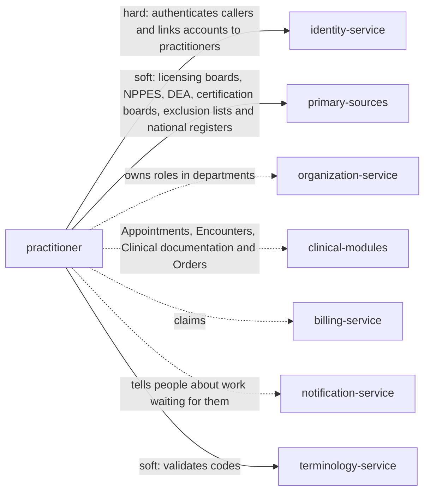

> Snapshot of healthcare/practitioner version 0.3.4, saved 2026-10-09. The current version is at https://knowledge-graph-ecru.vercel.app/docs/healthcare/practitioner.md.

# Practitioners (/docs/healthcare/practitioner)

## Module identity

- module: practitioner
- layer: healthcare
- extended by: Medical staff and privileges (ehr, /docs/healthcare/ehr/practitioner)
- version: 0.3.4
- status: draft

## How to read this spec

- This is the complete spec for this page, with every inherited item already merged in.
- If a behaviour is not listed here, it is unspecified. Do not assume or invent it. Ask, or record it as an open question.
- Ids such as BR-1, FR-2 and AC-3 are stable. Cite them in code, tests and commit messages.
- Items that start with "US only:" or "EU only:" apply only in that jurisdiction. Skip the ones for a jurisdiction your project doesn't operate in, or add ?jurisdiction=us or ?jurisdiction=eu to this URL to leave them out. Unmarked items apply everywhere.
- This is the core practitioner specification: nothing is inherited, and industry and domain pages build on it.

## Purpose & scope

Keep one trustworthy record of each practitioner: who they are, the identifiers and qualifications they hold, and whether each has been verified at its source. Decide, through a person, whether they are credentialed; watch what expires and who is excluded; and answer every other module whether a practitioner may practise, where and on what date. Works in the United States and the European Union.

**In scope**

- Practitioner records: names, identifiers such as the NPI, contact details, languages, specialties and qualifications
- Applications, primary-source verification and credentialing decisions, and recredentialing
- Expiring licences, registrations and certifications
- Exclusion and sanction screening in the United States, and national register checks in the EU
- Whether a practitioner is licensed to practise in a place on a date, and DEA registration by state
- Suspension, reinstatement and leaving
- Trainees who need supervision
- Practitioners' access to and correction of their own data

**Out of scope**

- Departments and which practitioners work in which department. Organization owns roles.
- Medical staff appointment and clinical privileges, which hospitals grant on top of these rules.
- User accounts, sign-in and permissions. Identity owns them and links an account to a practitioner.
- Payer enrollment, such as Medicare enrollment, and billing numbers. Billing owns them.
- Employment, payroll and rostering. Human resources and scheduling systems own them.
- Issuing licences or deciding on professional conduct. Licensing boards and competent authorities do.

## Overview

### Product perspective

Solid arrows are services this module calls; dotted arrows are services it notifies.

### Actors

| Actor | Description |
| --- | --- |
| Credentialing specialist | Collects applications, verifies qualifications at their source, and prepares files for decision. |
| Credentials committee | The people the organization authorizes to decide credentialing, such as a committee or medical director. |
| Practitioner | A person who provides care, applying, keeping their details current, and seeing their own file. |
| Privacy officer | Reviews access to credential files. |
| System | Other modules asking whether a practitioner may practise, and screening sources. |

### Assumptions and dependencies

**AS-H1** Licensing boards, the NPPES registry, DEA, certification boards and exclusion lists can be checked online or through a verification service.
  - Why: Primary-source verification means checking with the issuer or an approved source, not a copy the applicant provides.
**AS-H2** Organization owns which practitioners hold which roles in which departments, and asks this module whether a practitioner may practise.
  - Why: A role is about the organization; a licence is about the person.
**AS-H3** Identity links each user account to at most one practitioner record.
  - Why: Signatures and access decisions in other modules depend on knowing which practitioner is acting.

## Functions

### Business rules

**BR-H1** One practitioner has one record. Before a record is created, existing records are searched by identifier, such as the NPI or a registration number, and by name with birth date; a probable match is picked or a new record is created with a reason. Duplicates found later are merged by a credentialing specialist, keeping every identifier and qualification.
  - Why: Two records for one person split their qualifications and screening history, so an exclusion found on one is missed on the other.
**BR-H2** US only: In the United States, a practitioner who is a covered health care provider has an NPI: ten digits whose check digit passes the Luhn check with the prefix 80840, and which NPPES shows as active.
  - Why: HIPAA requires covered providers to obtain and use an NPI (45 CFR 162.410). The check digit is computed as if the 80840 prefix were present, and NPPES says whether a number is assigned and active.
**BR-H3** A qualification counts only when verified at the primary source primary_sources names for its type, such as the licensing board, NPPES, DEA or the certification board, with the source and verified_at recorded. A copy provided by the applicant is never treated as verification.
  - Why: Accreditors require primary-source verification because copies can be altered and licences can be restricted after they are issued.
**BR-H4** A credentialing review is decided by the credentials committee, never by the system. It can be approved only when every qualification the practitioner's type requires is verified, and each verification is no older than verification_window. A denial gives a reason, and the practitioner is told.
  - Why: Credentialing is a judgment the organization is accountable for. A stale verification may miss a recent restriction.
**BR-H5** Approving the initial review makes the practitioner active and sets credentialed_until from recredential_interval. A recredentialing review opens recredential_lead_time before that date; if it isn't approved by then, the practitioner is suspended with reason credentialing_lapsed.
  - Why: Credentials must be renewed at a fixed interval; letting them lapse silently means care by someone nobody has rechecked.
**BR-H6** Qualifications with an end date are listed expiry_warning before they end, and practitioner.credential_expiring is emitted. When one ends unrenewed, practitioner.credential_expired is emitted; if it was the practitioner's only valid licence, they are suspended with reason licence_expired.
  - Why: An expired licence means the person may no longer practise; catching it before the date keeps care going without breaking the law.
**BR-H7** US only: In the United States, every practitioner is screened against each list in screening_sources, including the OIG LEIE and SAM, when they apply and every screening_interval after. A possible match is resolved by a person using identifiers such as the NPI and birth date, never automatically. A confirmed match suspends the practitioner with reason excluded, and Billing is told.
  - Why: Federal health care programs pay nothing for items or services furnished, ordered or prescribed by an excluded individual (42 CFR 1001.1901(b)). OIG recommends screening at hire and monthly, because the LEIE is updated monthly; name matches alone are often false.
**BR-H8** EU only: In the European Union, a practitioner's registration with the national competent authority is verified when they apply and every screening_interval after, and a qualification obtained in another member state counts only once that authority has recognised it.
  - Why: Member states regulate health professions through competent authorities and recognise qualifications from other member states under Directive 2005/36/EC; a restriction is recorded by the authority, not the employer.
**BR-H9** A practitioner is licensed in a jurisdiction on a date when an active, verified licence or legal permission for that jurisdiction covers the date, such as a state licence, a licence issued through an interstate compact, or a national registration. Other modules ask this before a virtual visit with a patient in another place.
  - Why: In the United States a practitioner must be licensed or permitted where the patient is located, as the Clinical appointments rules state; licences are issued per state.
**BR-H10** US only: In the United States, a practitioner may prescribe controlled substances in a state only with a DEA registration for that state, active on the date.
  - Why: DEA requires a separate registration for each principal place of practice where controlled substances are dispensed (21 CFR 1301.12).
**BR-H11** A suspended practitioner can't be booked for new appointments, start encounters, or sign or cosign notes, and practitioner.suspended tells the modules that check. Records they made before stay as they are.
  - Why: Care by someone without a valid licence or while excluded is unlawful and unpaid; the earlier record of care stays accurate.
**BR-H12** A suspended practitioner is reinstated only when the reason is resolved, such as a renewed licence verified at its source or an exclusion lifted, with a reason, and practitioner.reinstated is emitted.
  - Why: Reinstatement on the practitioner's word would undo the protection the suspension gave.
**BR-H13** A practitioner who leaves is made inactive with the date. Their record, qualifications, reviews and screening history are kept for credential_retention.
  - Why: Records they made remain, and auditors and courts may need to know what was verified when they practised.
**BR-H14** A trainee, such as a resident or student, has requires_supervision set; other modules use it to require a cosignature or a supervising practitioner.
  - Why: Trainees practise under supervision as training programmes and medical staff bylaws require.
**BR-H15** A practitioner can see their own record, reviews and screening results, update their contact details and languages, and upload documents. Changes to names, identifiers or qualifications are made by a credentialing specialist after verification.
  - Why: Practitioners have a right of access and rectification over their personal data (GDPR Articles 15 and 16), but qualifications must be verified, not self-declared.
**BR-H16** Every view and change of a credential file is logged with who, when and why, and credential files are shown only to credentialing staff, the credentials committee and the practitioner.
  - Why: Credential files hold malpractice history, sanctions and sometimes health information about the practitioner; peer review is sensitive.
**BR-H17** EU only: In the European Union, criminal record checks on practitioners are made only where member-state law authorizes them, and their results are kept only as that law allows.
  - Why: Personal data about criminal convictions can be processed only under official authority or when authorized by Union or member-state law (GDPR Article 10).
**BR-H18** When a primary source can't be reached, the verification stays pending; it is never marked verified from cached or applicant data. Answers to other modules use the last verified state.
  - Why: A verification nobody completed is not a verification, but care must not stop because a board's website is down.
**BR-H19** Every change sends the revision it read; a stale revision fails.
  - Why: Two specialists updating one file must not overwrite each other.
**BR-H20** Names and identifiers keep their history with periods, so a search by a former name or number still finds the practitioner.
  - Why: Licences and screening lists may show a name or number the practitioner no longer uses.
**BR-H21** A qualification, privilege or registration with an end date is valid through the whole of that date, and "active on a date" is decided on the local calendar date where the care is given, never a date converted to UTC.
  - Why: Licences and registrations are issued with end dates that include the last day, as FHIR periods do; a UTC date would end an evening shift's licence early or late depending on the time zone.
**BR-H22** A request to erase a practitioner's data is refused while credential_retention applies after they leave, or while a legal hold or an open review needs it. When it ends, identifying fields are removed and the id is kept, so records that name the practitioner stay linked.
  - Why: Credential files show the organization checked who it let practise, which law and accreditation require and which may be needed to defend a malpractice claim; GDPR Article 17(3)(b) and (e) exempt that processing from erasure.

### State machine

Initial state: `applicant`. States: `applicant`, `active`, `suspended`, `inactive`, `denied`.
Any transition not listed below is invalid.

| From | To | Trigger | Guard |
| --- | --- | --- | --- |
| applicant | active | initial review approved (BR-H4, BR-H5) | - |
| applicant | denied | initial review denied (BR-H4) | - |
| active | suspended | licence expired, exclusion confirmed, credentialing lapsed, or suspended by the committee (BR-H5, BR-H6, BR-H7) | - |
| suspended | active | reinstate (BR-H12) | - |
| active | inactive | leaves (BR-H13) | - |
| suspended | inactive | leaves (BR-H13) | - |
| inactive | applicant | returns and applies again | - |
| denied | applicant | applies again | - |

### Workflows

#### Credential a new practitioner
Actor: Credentialing specialist
Trigger: A practitioner applies

1. Search for an existing record, then create one as applicant
2. Record each qualification from the application
3. Verify each at its primary source, recording the source and date
4. Screen against each list in screening_sources
5. Open an initial review and send it to the credentials committee
6. The committee approves or denies with a reason

Outcome: An approved practitioner is active and can be given roles in Organization.

#### Watch expiring credentials
Actor: System
Trigger: A qualification nears its end date

1. List it expiry_warning ahead and emit practitioner.credential_expiring
2. The specialist verifies the renewal at its source
3. If it ends unrenewed, emit practitioner.credential_expired and suspend when it was the only valid licence

Outcome: No one practises on an expired licence.

#### Screen monthly
Actor: System
Trigger: screening_interval passes

1. Check each active practitioner against each source
2. Record each result
3. Send possible matches to a specialist, who confirms or rejects them using identifiers
4. Suspend on a confirmed exclusion and tell Billing

Outcome: Exclusions are found within a month of being listed.

#### Recredential
Actor: Credentialing specialist
Trigger: recredential_lead_time before credentialed_until

1. Open a recredentialing review
2. Re-verify the required qualifications and screen again
3. The committee decides; approval moves credentialed_until on

Outcome: Credentials never lapse unnoticed.

### Validations

| Field | Rule | Error |
| --- | --- | --- |
| practitioner.identifiers | US only: An NPI is ten digits whose check digit passes the Luhn check with the prefix 80840 | PRACTITIONER_INVALID_IDENTIFIER |
| practitioner.identifiers | Each identifier has a system and value, and is not already on another active record | PRACTITIONER_DUPLICATE |
| practitioner.names | At least one official name, validated as the Patients module validates names | PRACTITIONER_INVALID_NAME |
| practitioner.qualifications | Each has a type from qualification_types, a number, an issuer, a jurisdiction where it applies, and a period whose end is after its start | PRACTITIONER_INVALID_QUALIFICATION |
| practitioner.status | Fields the service sets, such as status, credentialed_until, merged_into and revision, can't be written by clients | PRACTITIONER_READ_ONLY_FIELD |
| review.reason | Present when a review is denied | PRACTITIONER_REASON_REQUIRED |

### Edge cases

**EC-H1** A practitioner applies with a photocopy of a licence that the board shows as restricted.
  - Required behaviour: The board's record wins: the verification records the restriction, and the review shows it.
  - Covered by: BR-H3, AC-H3
**EC-H2** A doctor's licence lapses on a Saturday while they are on call.
  - Required behaviour: They were listed 90 days ahead; on expiry they are suspended and can't be booked or sign until the renewal is verified.
  - Covered by: BR-H6, BR-H11, AC-H7
**EC-H3** US only: Two practitioners named John Smith appear in a screening list match.
  - Required behaviour: A specialist compares NPI and birth date before anything changes; a namesake is marked not_a_match.
  - Covered by: BR-H7, AC-H8
**EC-H4** A telehealth psychiatrist licensed through an interstate compact sees a patient in another state.
  - Required behaviour: The compact licence for that state counts like any other licence for that state.
  - Covered by: BR-H9, AC-H11
**EC-H5** US only: A surgeon moves to a new state and keeps prescribing.
  - Required behaviour: Licensure for the new state shows no DEA registration there until one is verified.
  - Covered by: BR-H10, AC-H12
**EC-H6** A practitioner marries and changes their surname.
  - Required behaviour: The former name stays with its period, and searches by either name find them.
  - Covered by: BR-H20, AC-H21
**EC-H7** A practitioner leaves and returns two years later.
  - Required behaviour: The same record becomes applicant again and goes through initial credentialing.
  - Covered by: BR-H13, AC-H14
**EC-H8** A licensing board's site is down on the day a review is due.
  - Required behaviour: The verification stays pending and the review waits; nothing is marked verified from cached data.
  - Covered by: BR-H18, AC-H19
**EC-H9** EU only: A nurse trained in another EU member state applies.
  - Required behaviour: Her qualification counts once the national competent authority has recognised it.
  - Covered by: BR-H8, AC-H10
**EC-H10** Two credentialing specialists update one file at once.
  - Required behaviour: The second save fails with PRACTITIONER_REVISION_CONFLICT.
  - Covered by: BR-H19, AC-H20
**EC-H11** A hospitalist works a night shift that starts on the last day of their licence.
  - Required behaviour: They are licensed until midnight local time; after midnight they can't start new care until the renewal is verified.
  - Covered by: BR-H21, AC-H27

## Data

### Data model

| Field | Type | Required | Description | Constraints |
| --- | --- | --- | --- | --- |
| practitioner.id | string | yes | The practitioner record id. Never changes or is reused. | set by the service |
| practitioner.identifiers | identifier[] | yes | Numbers that identify the practitioner, such as the NPI, a national registration number or a staff number, each with its system and period. | at least one; codes: identifier type from HL7 v2 Table 0203, such as NPI, MD (medical license number), DEA (Drug Enforcement Administration registration number); NPI system http://hl7.org/fhir/sid/us-npi |
| practitioner.names | name[] | yes | Names, with use and period, validated as the Patients module validates names. | at least one official name; codes: use from FHIR NameUse |
| practitioner.birth_date | date | no | Used to tell practitioners with the same name apart when screening. | - |
| practitioner.telecoms | telecom[] | no | Work phone numbers and email addresses. | phone in E.164, email per RFC 5321 |
| practitioner.addresses | address[] | no | Practice or correspondence addresses. | - |
| practitioner.languages | language[] | no | Languages they can use with patients. | codes: BCP 47 |
| practitioner.photo | image reference | no | A photo, for identification. | - |
| practitioner.specialties | code[] | no | Their specialties. | codes: NUCC Health Care Provider Taxonomy in the United States; national specialty codes or SNOMED CT elsewhere |
| practitioner.qualifications | qualification[] | no | Licences, registrations, certifications and degrees: type, code, number, issuer, jurisdiction, period, status, and how and when each was verified. | each verified qualification names its primary source and verified_at; codes: type from qualification_types |
| practitioner.requires_supervision | boolean | no | Set for trainees, such as residents or students, who practise under supervision. | - |
| practitioner.status | enum | yes | Where the practitioner is in their lifecycle. | applicant \| active \| suspended \| inactive \| denied; changed only through operations; codes: none standard, local to this specification |
| practitioner.status_reason | code and text | no | Why the status changed, such as licence expired or excluded. | codes: local list |
| practitioner.credentialed_until | date | no | When recredentialing is due. | set by the service from recredential_interval |
| practitioner.merged_into | string | no | For a duplicate record, the record it was merged into. | set by the service |
| practitioner.revision | integer | yes | Goes up with every change. | set by the service |
| review.id | string | yes | The credentialing review id. | set by the service |
| review.kind | enum | yes | Initial credentialing or recredentialing. | initial \| recredentialing; codes: none standard, local to this specification |
| review.status | enum | yes | Where the review is. | open \| approved \| denied \| withdrawn; codes: none standard, local to this specification |
| review.decided_by | string | no | Who decided, and when. | - |
| review.reason | text | no | Why it was denied, or conditions on approval. | required when denied |
| screening.id | string | yes | The screening result id. | set by the service |
| screening.source | code | yes | The list checked, such as the OIG LEIE, SAM or a national register. | one of screening_sources; codes: local list |
| screening.checked_at | instant | yes | When it was checked. | - |
| screening.result | enum | yes | What the check found. | clear \| possible_match \| confirmed \| not_a_match; codes: none standard, local to this specification |
| screening.resolved_by | string | no | Who resolved a possible match, and how. | - |

### Relationships

| Edge | Target | Note |
| --- | --- | --- |
| has_many | review | credentialing reviews over time |
| has_many | screening | screening results |
| can_trigger | event:practitioner.suspended | - |
| has_many | qualification | 0..*: licences, registrations, certifications and degrees (FHIR Practitioner.qualification 0..*) |
| has_many | identifier | 0..*: NPI, national registration or staff numbers (FHIR Practitioner.identifier 0..*) |
| exposes_to | identity | the practitioner id an account belongs to |

## External interfaces

### API

#### Create a practitioner: `POST /practitioners`
Create a record as applicant after searching for an existing one. Accepts a retry key.
- Success: 201
- Actor: Credentialing specialist
- Input: names, identifiers, birth date, contact details, languages, specialties, requires_supervision, and a reason when a probable match was found
- Result: the practitioner
- Errors: PRACTITIONER_INVALID_NAME, PRACTITIONER_INVALID_IDENTIFIER, PRACTITIONER_DUPLICATE, PRACTITIONER_POSSIBLE_DUPLICATE, PRACTITIONER_READ_ONLY_FIELD, PRACTITIONER_IDEMPOTENCY_KEY_REUSED, PRACTITIONER_FORBIDDEN

#### Get a practitioner: `GET /practitioners/{id}`
A practitioner record. Returns a FHIR R5 Practitioner when asked for application/fhir+json.
- Success: 200
- Actor: System
- Input: practitioner id
- Result: the practitioner
- Errors: PRACTITIONER_NOT_FOUND, PRACTITIONER_FORBIDDEN

#### Search practitioners: `GET /practitioners`
Search by name, identifier, specialty or status, including former names and identifiers.
- Success: 200
- Actor: System
- Input: criteria, limit and cursor
- Result: practitioners and next_cursor
- Errors: PRACTITIONER_FORBIDDEN

#### Update a practitioner: `PATCH /practitioners/{id}`
Change names, identifiers, contact details, languages or specialties. A practitioner may change their own contact details and languages.
- Success: 200
- Actor: Credentialing specialist
- Input: changed fields and revision
- Result: the practitioner
- Errors: PRACTITIONER_NOT_FOUND, PRACTITIONER_INVALID_NAME, PRACTITIONER_INVALID_IDENTIFIER, PRACTITIONER_DUPLICATE, PRACTITIONER_READ_ONLY_FIELD, PRACTITIONER_REVISION_CONFLICT, PRACTITIONER_FORBIDDEN

#### Add a qualification: `POST /practitioners/{id}/qualifications`
Record a licence, registration, certification or degree, unverified.
- Success: 201
- Actor: Credentialing specialist
- Input: type, code, number, issuer, jurisdiction, period
- Result: the qualification
- Errors: PRACTITIONER_NOT_FOUND, PRACTITIONER_INVALID_QUALIFICATION, PRACTITIONER_FORBIDDEN

#### Record a verification: `POST /practitioners/{id}/qualifications/{qualification_id}/verification`
Record that a qualification was verified at its primary source, or that the source showed a problem.
- Success: 200
- Actor: Credentialing specialist
- Input: source, result, date, and any restriction found
- Result: the qualification
- Errors: PRACTITIONER_NOT_FOUND, PRACTITIONER_INVALID_QUALIFICATION, PRACTITIONER_REVISION_CONFLICT, PRACTITIONER_FORBIDDEN, PRACTITIONER_DEPENDENCY_UNAVAILABLE

#### Open a review: `POST /practitioners/{id}/reviews`
Open an initial or recredentialing review.
- Success: 201
- Actor: Credentialing specialist
- Input: kind
- Result: the review
- Errors: PRACTITIONER_NOT_FOUND, PRACTITIONER_INVALID_STATUS, PRACTITIONER_FORBIDDEN

#### Decide a review: `POST /reviews/{id}/decision`
Approve or deny a review, with a reason when denying.
- Success: 200
- Actor: Credentials committee
- Input: approve or deny, reason, conditions
- Result: the review and the practitioner
- Errors: PRACTITIONER_REVIEW_NOT_FOUND, PRACTITIONER_NOT_VERIFIED, PRACTITIONER_INVALID_STATUS, PRACTITIONER_REASON_REQUIRED, PRACTITIONER_FORBIDDEN

#### Record a screening result: `POST /practitioners/{id}/screenings`
Record the result of checking a practitioner against a list.
- Success: 201
- Actor: System
- Input: source, checked_at, result and the matching entry
- Result: the screening
- Errors: PRACTITIONER_NOT_FOUND, PRACTITIONER_FORBIDDEN

#### Resolve a possible match: `POST /screenings/{id}/resolution`
Confirm or reject a possible match, giving the identifiers compared.
- Success: 200
- Actor: Credentialing specialist
- Input: confirmed or not_a_match, and the identifiers compared
- Result: the screening
- Errors: PRACTITIONER_SCREENING_NOT_FOUND, PRACTITIONER_INVALID_STATUS, PRACTITIONER_REASON_REQUIRED, PRACTITIONER_FORBIDDEN

#### Suspend a practitioner: `POST /practitioners/{id}/suspend`
Suspend with a reason.
- Success: 200
- Actor: Credentials committee
- Input: reason and revision
- Result: the practitioner
- Errors: PRACTITIONER_NOT_FOUND, PRACTITIONER_INVALID_STATUS, PRACTITIONER_REASON_REQUIRED, PRACTITIONER_REVISION_CONFLICT, PRACTITIONER_FORBIDDEN

#### Reinstate a practitioner: `POST /practitioners/{id}/reinstate`
Reinstate once the reason for suspension is resolved and verified.
- Success: 200
- Actor: Credentials committee
- Input: reason and revision
- Result: the practitioner
- Errors: PRACTITIONER_NOT_FOUND, PRACTITIONER_INVALID_STATUS, PRACTITIONER_NOT_VERIFIED, PRACTITIONER_REASON_REQUIRED, PRACTITIONER_REVISION_CONFLICT, PRACTITIONER_FORBIDDEN

#### Make a practitioner inactive: `POST /practitioners/{id}/inactivate`
Record that a practitioner left, with the date.
- Success: 200
- Actor: Credentialing specialist
- Input: date, reason and revision
- Result: the practitioner
- Errors: PRACTITIONER_NOT_FOUND, PRACTITIONER_INVALID_STATUS, PRACTITIONER_REASON_REQUIRED, PRACTITIONER_REVISION_CONFLICT, PRACTITIONER_FORBIDDEN

#### Merge duplicate practitioners: `POST /practitioners/{id}/merge`
Merge a duplicate record into another, keeping every identifier, qualification, review and screening.
- Success: 200
- Actor: Credentialing specialist
- Input: target id, reason and revisions
- Result: the remaining practitioner
- Errors: PRACTITIONER_NOT_FOUND, PRACTITIONER_REASON_REQUIRED, PRACTITIONER_REVISION_CONFLICT, PRACTITIONER_FORBIDDEN

#### Check licensure: `GET /practitioners/{id}/licensure`
Whether the practitioner may practise in a jurisdiction on a date, and, in the United States, may prescribe controlled substances there.
- Success: 200
- Actor: System
- Input: jurisdiction and date
- Result: licensed or not, the qualification that covers it, and DEA registration where it applies
- Errors: PRACTITIONER_NOT_FOUND, PRACTITIONER_INVALID_JURISDICTION

#### List expiring qualifications: `GET /expiring-qualifications`
Qualifications ending within a period, by practitioner.
- Success: 200
- Actor: Credentialing specialist
- Input: period, limit and cursor
- Result: qualifications and next_cursor
- Errors: PRACTITIONER_FORBIDDEN

#### Get a credential file's access log: `GET /practitioners/{id}/access-log`
Who viewed or changed a practitioner's file, when and why.
- Success: 200
- Actor: Privacy officer
- Input: limit and cursor
- Result: log entries
- Errors: PRACTITIONER_NOT_FOUND, PRACTITIONER_FORBIDDEN

### API conventions

| Topic | Convention | Reference |
| --- | --- | --- |
| Authentication | Every request carries the caller's identity from Identity. Permissions are checked against it (Permission matrix). | - |
| Errors | Errors use problem details (application/problem+json) with a code member, such as PRACTITIONER_NOT_VERIFIED. | RFC 9457 |
| Pagination | Lists are cursor-based: limit and an optional cursor in, next_cursor out. | - |
| Concurrency | Every change sends the revision it read. A stale revision fails with PRACTITIONER_REVISION_CONFLICT (BR-H19). | - |
| Retries | Every create accepts an Idempotency-Key header; a retry returns the original result. | IETF draft-ietf-httpapi-idempotency-key-header |
| FHIR | Practitioners are returned as HL7 FHIR R5 Practitioner, with the US Core Practitioner R4.0.1 API in the United States, when the request asks for application/fhir+json (FR-H9). | - |
| Dates | Dates are ISO 8601 calendar dates, read as the local date where care is given, never a date converted to UTC. | ISO 8601 |
| Times | Instants are RFC 3339 timestamps with an offset, stored in UTC; time zones are IANA names. | RFC 3339 |
| Personal data in URLs | Names, birth dates and identifiers are sent in request bodies or query parameters over TLS, never in paths, and are never written to request logs. | - |
| Rate limits | A caller over its limit gets 429 Too Many Requests with a Retry-After header. | RFC 6585, RFC 9110 |
| Versioning | Additive changes don't change the version. A breaking change ships as a new major version with Deprecation and Sunset headers. | RFC 9745, RFC 8594 |

### Events

| Event | Description | Payload |
| --- | --- | --- |
| practitioner.created | A practitioner record was created. | practitioner_id, revision |
| practitioner.updated | Names, identifiers, contact details or specialties changed. | practitioner_id, revision, changed_fields |
| practitioner.credentialed | A review was approved; the practitioner is active until credentialed_until. | practitioner_id, revision, credentialed_until |
| practitioner.suspended | The practitioner was suspended. | practitioner_id, revision, reason |
| practitioner.reinstated | The practitioner was reinstated. | practitioner_id, revision |
| practitioner.inactivated | The practitioner left. | practitioner_id, revision, date |
| practitioner.credential_expiring | A qualification ends within expiry_warning. | practitioner_id, revision, qualification_type, ends_on |
| practitioner.credential_expired | A qualification ended unrenewed. | practitioner_id, revision, qualification_type, jurisdiction |
| practitioner.screening_match | A screening found a possible or confirmed match. | practitioner_id, revision, source, result |
| practitioner.merged | A duplicate record was merged into another. | practitioner_id, revision, merged_into |

### Event delivery

**DG-H1** Events are published at least once; consumers drop one with a source and id they have seen.
  - Why: A relay can publish twice after a crash.
**DG-H2** Events about one practitioner can arrive out of order; each carries the revision, and consumers ignore a lower one.
  - Why: Brokers and retries don't guarantee order.
**DG-H3** Events carry ids and reasons, never verification details, screening entries or review notes.
  - Why: Credential files are sensitive; consumers need only whether the practitioner may practise.

### Errors

| Code | HTTP | Meaning |
| --- | --- | --- |
| PRACTITIONER_NOT_FOUND | 404 | No practitioner exists with that id. |
| PRACTITIONER_FORBIDDEN | 403 | Your role doesn't allow this. |
| PRACTITIONER_INVALID_NAME | 422 | A name is missing or isn't valid. |
| PRACTITIONER_INVALID_IDENTIFIER | 422 | The identifier isn't valid, such as an NPI that fails its check digit. |
| PRACTITIONER_DUPLICATE | 409 | That identifier is already on another practitioner's record. |
| PRACTITIONER_POSSIBLE_DUPLICATE | 409 | A probable match exists; pick it, or give a reason to create a new record. |
| PRACTITIONER_INVALID_QUALIFICATION | 422 | The qualification needs a known type, number, issuer and a valid period. |
| PRACTITIONER_NOT_VERIFIED | 409 | A required qualification isn't verified at its source, or its verification is older than verification_window. |
| PRACTITIONER_INVALID_STATUS | 409 | The practitioner, review or screening isn't in a status that allows this. |
| PRACTITIONER_REASON_REQUIRED | 422 | This needs a reason. |
| PRACTITIONER_READ_ONLY_FIELD | 422 | That field is set by the service. |
| PRACTITIONER_REVISION_CONFLICT | 409 | The record changed since you read it. Read it again. |
| PRACTITIONER_IDEMPOTENCY_KEY_REUSED | 422 | That retry key was used with a different request. |
| PRACTITIONER_INVALID_JURISDICTION | 422 | That jurisdiction isn't a known US state or EU member state code. |
| PRACTITIONER_REVIEW_NOT_FOUND | 404 | No review exists with that id. |
| PRACTITIONER_SCREENING_NOT_FOUND | 404 | No screening result exists with that id. |
| PRACTITIONER_DEPENDENCY_UNAVAILABLE | 503 | The primary source can't be reached. The verification stays pending; try again. |

### Dependencies

Each dependency lists its contract: only what this module needs from it (upstream) or gives it (downstream). How the other module works is out of scope.

| Service | Direction | Criticality | Reason | Contract |
| --- | --- | --- | --- | --- |
| identity-service | upstream | hard | authenticates callers and links accounts to practitioners | Asks: who is the caller, and do they hold this permission?; Gives: the practitioner id an account belongs to; Gives: practitioner.credentialed, practitioner.suspended, practitioner.reinstated and practitioner.inactivated, so accounts and roles follow; Gives: practitioner.credential_expired and practitioner.merged, so controlled substance prescribing and accounts follow; Answers: are this practitioner's DEA registration and state authorization current?; Accounts, sign-in and permissions are Identity's concern |
| primary-sources | upstream | soft | licensing boards, NPPES, DEA, certification boards, exclusion lists and national registers | Asks: is this qualification valid, and with what restrictions?; Asks: is this person on the list? |
| organization-service | downstream | soft | owns roles in departments | Gives: practitioner.created, practitioner.credentialed, practitioner.suspended, practitioner.reinstated and practitioner.inactivated, so roles follow the practitioner's status; Gives: whether a practitioner may practise on a date, and requires_supervision; Roles and departments are Organization's concern |
| clinical-modules | downstream | soft | Appointments, Encounters, Clinical documentation and Orders | Gives: whether a practitioner is licensed in a jurisdiction on a date, and may prescribe controlled substances there; Gives: practitioner.suspended, practitioner.reinstated and practitioner.inactivated, so modules stop and resume booking, starting care and signing; Gives: practitioner.updated and practitioner.merged, so displayed names and links stay right; What each module allows a suspended practitioner to do is that module's concern |
| billing-service | downstream | soft | claims | Gives: the NPI and practitioner.screening_match with confirmed exclusions, so no claim is made for services an excluded practitioner furnished; Payer enrollment is Billing's concern |
| notification-service | downstream | soft | tells people about work waiting for them | Gives: practitioner.credential_expiring and practitioner.credential_expired, for the practitioner and credentialing staff |
| terminology-service | upstream | soft | validates codes | Asks: is this specialty or qualification code valid on this date?; Asks: which codes the value set bound to each coded setting allows on this date |

## Security

### Permission matrix

| Action | Credentialing specialist | Credentials committee | Practitioner | Privacy officer | System | Permission |
| --- | --- | --- | --- | --- | --- | --- |
| Get, search and check licensure | any | any | own | none | any | practitioner.read |
| Create, update, add qualifications, record verifications, open reviews, merge, make inactive | any | none | none | none | none | practitioner.manage |
| Update own contact details and languages | none | none | own | none | none | practitioner.self |
| Decide reviews, suspend, reinstate | none | any | none | none | none | practitioner.decide |
| Record screening results, resolve possible matches | any | none | none | none | any | practitioner.manage |
| List expiring qualifications | any | any | own | none | none | practitioner.manage |
| Get a credential file's access log | none | none | none | any | none | practitioner.audit |

any: every appointment. own: appointments the actor takes part in. none: not allowed.

- Get, search and check licensure: System and other modules see identity, status, specialties and licensure, never verification details or screening results (BR-H16).

- Record screening results, resolve possible matches: System records results; only a specialist resolves a possible match.

### Permissions

| Permission | Grants |
| --- | --- |
| practitioner.read | Read practitioner records and check licensure. |
| practitioner.manage | Create and change records, record verifications and screenings, and open reviews. |
| practitioner.decide | Decide reviews, suspend and reinstate. |
| practitioner.audit | Read access logs. |
| practitioner.self | A practitioner reads their own file and updates their own contact details. |

### Privacy and retention

| Field | Category | Purpose | Retention |
| --- | --- | --- | --- |
| practitioner.names, practitioner.identifiers, practitioner.birth_date, practitioner.photo | personal data of staff | Identifying the practitioner and telling namesakes apart | credential_retention |
| practitioner.telecoms, practitioner.addresses, practitioner.languages, practitioner.specialties | personal data of staff | Contacting and matching the practitioner to patients and services | credential_retention |
| practitioner.qualifications, practitioner.requires_supervision, practitioner.status, practitioner.status_reason, practitioner.credentialed_until, practitioner.merged_into, practitioner.revision | personal data of staff | Showing whether the practitioner may practise | credential_retention |
| review.kind, review.status, review.decided_by, review.reason | personal data of staff; can include sensitive peer review information | Credentialing decisions | credential_retention |
| screening.source, screening.checked_at, screening.result, screening.resolved_by | personal data of staff; can include sanctions | Showing exclusion and register checks were made | credential_retention |
| access log | personal | Showing who accessed credential files | credential_retention |

### Compliance

**CMP-H1** HIPAA Administrative Simplification, 45 CFR 162.410: US only: Covered providers obtain and use an NPI, and report changes to NPPES within 30 days.
  - How it's met: NPI validated and checked active; reporting changes is the practitioner's or organization's duty.
  - Status: met
  - Covered by: BR-H2
**CMP-H2** Medicare and Medicaid exclusion authorities, 42 CFR 1001.1901: US only: No federal program payment for items or services furnished, ordered or prescribed by an excluded person.
  - How it's met: Screening and suspension; Billing stops claims.
  - Status: met
  - Covered by: BR-H7
**CMP-H3** Controlled Substances Act regulations, 21 CFR 1301.12: US only: A separate DEA registration for each principal place of practice.
  - How it's met: DEA registration checked by state.
  - Status: met
  - Covered by: BR-H10
**CMP-H4** Professional Qualifications Directive (EU) 2005/36/EC, Articles 4 and 56a: EU only: Qualifications from another member state are recognised by the host competent authority; authorities alert each other to restrictions.
  - How it's met: Registration and recognition verified with the national authority.
  - Status: met
  - Covered by: BR-H8
**CMP-H5** GDPR (EU) 2016/679, Article 10: EU only: Criminal conviction data only under official authority or where law authorizes it.
  - How it's met: Criminal record checks only where member-state law allows.
  - Status: met
  - Covered by: BR-H17
**CMP-H6** GDPR (EU) 2016/679, Articles 15, 16 and 32: EU only: Access, rectification and security of personal data.
  - How it's met: Practitioners see their file and correct contact details; files encrypted and logged.
  - Status: met
  - Covered by: BR-H15, BR-H16, CON-H1
**CMP-H7** GDPR (EU) 2016/679, Articles 6 and 88: EU only: A lawful basis for processing staff data, and member-state employment rules.
  - How it's met: The organization records its basis.
  - Status: deployment
  - Covered by: BR-H16
**CMP-H8** ONC Health IT Certification, 45 CFR 170.315(g)(10) and 170.215: US only: Certified health IT serves single-patient searches and group export through a FHIR R4 API with US Core, SMART App Launch and Bulk Data.
  - How it's met: FR-H10: the US Core API for this module's resources; app registration and authorization are Identity's.
  - Status: partly met
  - Covered by: FR-H10
**CMP-H9** GDPR (EU) 2016/679, Article 17: EU only: Erase personal data on request, except where 17(3) applies.
  - How it's met: Erasure waits for credential_retention, then removes identifying fields.
  - Status: met
  - Covered by: BR-H22

## Requirements

### Functional requirements

| ID | Requirement | Priority | Verified by |
| --- | --- | --- | --- |
| FR-H1 | The service must keep one record per practitioner, search by current and former names and identifiers, and merge duplicates. | must | test |
| FR-H2 | The service must record qualifications and their primary-source verifications. | must | test |
| FR-H3 | The service must hold credentialing reviews and refuse approval while a required qualification is unverified or its verification too old. | must | test |
| FR-H4 | The service must list expiring qualifications and suspend on expiry of the only valid licence. | must | test |
| FR-H5 | The service must screen practitioners against screening_sources at screening_interval and record each result. | must | test |
| FR-H6 | The service must answer whether a practitioner may practise in a jurisdiction on a date. | must | test |
| FR-H7 | The service must suspend, reinstate and make practitioners inactive, emitting events for each. | must | test |
| FR-H8 | The service must log every view and change of a credential file. | must | test |
| FR-H9 | The service must return practitioners as HL7 FHIR R5 Practitioner resources; in the United States, the R4.0.1 API conforms to US Core Practitioner. | must | inspection |
| FR-H10 | US only: In the United States, the service must serve Practitioner through a FHIR R4.0.1 API conforming to the US Core version 45 CFR 170.215(b)(1) adopts (STU 6.1.0, or a later version ONC approves): the search interactions the US Core Server CapabilityStatement marks mandatory for a single patient, and group export through FHIR Bulk Data Access 1.0.0. This API runs on FHIR R4 even though the module maps to FHIR R5 elsewhere; apps are authorized by Identity with SMART App Launch 2.0.0. | must | demonstration |

### Performance requirements

| Id | Indicator | Target | Measured as |
| --- | --- | --- | --- |
| PERF-H1 | Lapsed credentials | 0 | Active practitioners with an expired required qualification or past credentialed_until. |
| PERF-H2 | Screening timeliness | 100% | Share of active practitioners screened within screening_interval. |
| PERF-H3 | Licensure check latency | Set by each deployment as an SLO | 99th percentile time to answer a licensure check. |

### Quality attributes

| Category | Requirement |
| --- | --- |
| compatibility | Practitioners map onto FHIR R5 Practitioner: names to name, identifiers to identifier, qualifications to qualification (code, period, issuer), languages to communication. |
| security | Verification details, review notes and screening results are visible only to credentialing staff, the credentials committee and the practitioner. |
| availability | Licensure checks answer from the last verified state when primary sources are down (BR-H18). |
| portability | No requirement depends on a particular database, language or framework. |
| compatibility | US only: In the United States, a FHIR R4.0.1 API with US Core STU 6.1.0 is served alongside the FHIR R5 mapping, because certification adopts R4 (45 CFR 170.215(a)). |

### Design constraints

**CON-H1** Practitioner data is encrypted in transit and at rest.
  - Why: Credential files hold sanctions and malpractice history; GDPR Article 32 lists encryption as a security measure.

### Configuration

| Setting | Type | Default | Description |
| --- | --- | --- | --- |
| jurisdiction | us \| eu | none | Which legal regime applies. Required. |
| qualification_types | list | none | The kinds of qualification in use, such as state licence, national registration, DEA registration, board certification and degree, and which practitioner types must hold which. |
| primary_sources | map | none | For each qualification type, the source that verifies it, such as each state's licensing board, NPPES, DEA or a certification board. |
| verification_window | duration | none | How old a verification may be when a review is decided. Set by the organization or its accreditor. |
| recredential_interval | duration | none | How often practitioners are recredentialed. Set by the organization or its accreditor; health plans accredited by NCQA recredential at least every 36 months. |
| recredential_lead_time | duration | none | How long before credentialed_until a recredentialing review opens. Default 120 days. |
| expiry_warning | duration | none | How long before a qualification ends it is listed. Default 90 days. |
| screening_sources | list | none | Lists checked: in the United States the OIG LEIE, SAM and the state Medicaid exclusion lists where the organization operates; in the EU the national registers of the competent authorities. |
| screening_interval | duration | none | How often active practitioners are screened again. Default 1 month, as OIG recommends for the LEIE. |
| credential_retention | duration | none | How long records are kept after a practitioner leaves. Set from state or national law; needs legal advice. |

## Verification

### Acceptance criteria

**AC-H1**
- Given a practitioner with NPI 1234567893 and another named Jane Doe born 1980-02-01
- When a record is created with the same NPI, then one for Jane Doe born 1980-02-01 without a reason, then with a reason
- Then the first fails with PRACTITIONER_DUPLICATE and HTTP 409; the second fails with PRACTITIONER_POSSIBLE_DUPLICATE and HTTP 409; the third is created and practitioner.created is emitted
- Verifies: BR-H1, FR-H1

**AC-H2**
- Given US only: an NPI of 1234567890
- When it is entered
- Then it fails with PRACTITIONER_INVALID_IDENTIFIER and HTTP 422, because the check digit fails the Luhn check with prefix 80840
- Verifies: BR-H2

**AC-H3**
- Given a licence copied from the applicant and not yet verified
- When a review requiring that licence is approved, then the licence is verified with the state board and the review approved
- Then the first fails with PRACTITIONER_NOT_VERIFIED and HTTP 409; the second makes the practitioner active, sets credentialed_until and emits practitioner.credentialed
- Verifies: BR-H3, BR-H4, BR-H5, FR-H2, FR-H3

**AC-H4**
- Given a verification 200 days old and verification_window of 120 days
- When the review is approved
- Then it fails with PRACTITIONER_NOT_VERIFIED and HTTP 409
- Verifies: BR-H4

**AC-H5**
- Given an open review
- When it is denied without a reason, then with one
- Then the first fails with PRACTITIONER_REASON_REQUIRED and HTTP 422; the second makes the practitioner denied and they are told
- Verifies: BR-H4

**AC-H6**
- Given credentialed_until in 100 days and recredential_lead_time of 120 days, and another practitioner whose date passed with no approval
- When the daily check runs
- Then a recredentialing review is open for the first; the second is suspended with reason credentialing_lapsed and practitioner.suspended is emitted
- Verifies: BR-H5

**AC-H7**
- Given a practitioner's only licence ending in 60 days and expiry_warning of 90 days
- When the daily check runs, and later the licence ends unrenewed
- Then practitioner.credential_expiring is emitted and it is listed; then practitioner.credential_expired is emitted and the practitioner is suspended with reason licence_expired
- Verifies: BR-H6, FR-H4

**AC-H8**
- Given US only: monthly screening and an LEIE entry with the same name but a different birth date
- When screening runs and a specialist compares identifiers
- Then practitioner.screening_match is emitted as possible_match; the specialist records not_a_match and the practitioner stays active
- Verifies: BR-H7, FR-H5

**AC-H9**
- Given US only: a confirmed LEIE match
- When the specialist confirms it
- Then the practitioner is suspended with reason excluded, practitioner.suspended is emitted, and Billing is told
- Verifies: BR-H7, BR-H11

**AC-H10**
- Given EU only: a nurse whose qualification from another member state isn't yet recognised by the national authority
- When a review requiring national registration is approved
- Then it fails with PRACTITIONER_NOT_VERIFIED and HTTP 409
- Verifies: BR-H8

**AC-H11**
- Given a practitioner licensed in New York only, from 2024 to 2027
- When licensure is checked for NY on 2026-05-01, NJ on that date, NY on 2028-01-01, and an unknown jurisdiction code
- Then NY 2026 is licensed with the licence named; NJ and NY 2028 are not; the unknown code fails with PRACTITIONER_INVALID_JURISDICTION and HTTP 422
- Verifies: BR-H9, FR-H6

**AC-H12**
- Given US only: a DEA registration for New York only
- When licensure is checked for New Jersey
- Then it says the practitioner may not prescribe controlled substances there
- Verifies: BR-H10

**AC-H13**
- Given a suspended practitioner whose licence is renewed
- When they are reinstated before the renewal is verified, then after
- Then the first fails with PRACTITIONER_NOT_VERIFIED and HTTP 409; the second makes them active and emits practitioner.reinstated
- Verifies: BR-H12, BR-H11, FR-H7

**AC-H14**
- Given a practitioner who leaves
- When they are made inactive, then made inactive again
- Then the first records the date and emits practitioner.inactivated, and their file is kept; the second fails with PRACTITIONER_INVALID_STATUS and HTTP 409
- Verifies: BR-H13, FR-H7

**AC-H15**
- Given a resident
- When their record is read by Clinical documentation
- Then requires_supervision is set
- Verifies: BR-H14

**AC-H16**
- Given a practitioner signed in
- When they update their phone number, then their licence number, then read another practitioner's file
- Then the phone changes and practitioner.updated is emitted; the licence change fails with PRACTITIONER_FORBIDDEN and HTTP 403; reading the other file fails with PRACTITIONER_FORBIDDEN and HTTP 403
- Verifies: BR-H15

**AC-H17**
- Given a credential file opened by a specialist and by a scheduler
- When a privacy officer reads the access log
- Then both reads are listed with who, when and why, and the scheduler saw no verification details
- Verifies: BR-H16, FR-H8

**AC-H18**
- Given EU only: a member state whose law doesn't authorize criminal record checks for this role, so qualification_types has none
- When a specialist adds a criminal record check as a qualification
- Then it fails with PRACTITIONER_INVALID_QUALIFICATION and HTTP 422
- Verifies: BR-H17

**AC-H19**
- Given a state board's site down
- When a verification is attempted
- Then it fails with PRACTITIONER_DEPENDENCY_UNAVAILABLE and HTTP 503 and stays pending; licensure checks still answer from the last verified state
- Verifies: BR-H18

**AC-H20**
- Given a record at revision 4
- When it is changed with revision 3, a client sets status, and a create is retried with one key and a different body
- Then the first fails with PRACTITIONER_REVISION_CONFLICT and HTTP 409; the second with PRACTITIONER_READ_ONLY_FIELD and HTTP 422; the third with PRACTITIONER_IDEMPOTENCY_KEY_REUSED and HTTP 422
- Verifies: BR-H19

**AC-H21**
- Given a practitioner who changed their surname and two duplicate records
- When they are searched by the former surname, then the duplicates are merged
- Then the search finds them; the merge keeps every identifier and qualification, and practitioner.merged is emitted
- Verifies: BR-H20, BR-H1, FR-H1

**AC-H22**
- Given unknown ids
- When a practitioner, a review and a screening are fetched or acted on
- Then they fail with PRACTITIONER_NOT_FOUND and HTTP 404, PRACTITIONER_REVIEW_NOT_FOUND and HTTP 404, and PRACTITIONER_SCREENING_NOT_FOUND and HTTP 404
- Verifies: FR-H1

**AC-H23**
- Given a qualification with an end date before its start, and one without a name on a new record
- When each is entered
- Then the qualification fails with PRACTITIONER_INVALID_QUALIFICATION and HTTP 422; the record fails with PRACTITIONER_INVALID_NAME and HTTP 422
- Verifies: FR-H2

**AC-H24**
- Given a practitioner
- When they are read with Accept application/fhir+json
- Then the response is a FHIR R5 Practitioner with the NPI in identifier
- Verifies: FR-H9

**AC-H25**
- Given stored practitioner data
- When storage and connections are inspected
- Then data is encrypted at rest and connections use TLS
- Verifies: CON-H1

**AC-H26**
- Given US only: a SMART app authorized for one patient, and a system client authorized for a group
- When the app searches Practitioner for that patient with the US Core mandatory parameters, and the client starts a group export
- Then the searches return FHIR R4 resources conforming to the US Core profiles, and the export returns NDJSON files for the group
- Verifies: FR-H10

**AC-H27**
- Given a licence ending 30 June in a state on Mountain time
- When a practitioner is checked at 23:30 local time on 30 June, which is already 1 July in UTC, and again at 00:10 on 1 July
- Then the first answer is active and the second not
- Verifies: BR-H21

**AC-H28**
- Given a practitioner who left a year ago, with credential_retention of 10 years
- When they ask for their data to be erased
- Then the request is refused with the retention end date; after retention ends, identifying fields are removed and the id kept
- Verifies: BR-H22

### Traceability matrix

| Id | Verified by |
| --- | --- |
| BR-H1 | AC-H1, AC-H21 |
| BR-H2 | AC-H2 |
| BR-H3 | AC-H3 |
| BR-H4 | AC-H3, AC-H4, AC-H5 |
| BR-H5 | AC-H3, AC-H6 |
| BR-H6 | AC-H7 |
| BR-H7 | AC-H8, AC-H9 |
| BR-H8 | AC-H10 |
| BR-H9 | AC-H11 |
| BR-H10 | AC-H12 |
| BR-H11 | AC-H9, AC-H13 |
| BR-H12 | AC-H13 |
| BR-H13 | AC-H14 |
| BR-H14 | AC-H15 |
| BR-H15 | AC-H16 |
| BR-H16 | AC-H17 |
| BR-H17 | AC-H18 |
| BR-H18 | AC-H19 |
| BR-H19 | AC-H20 |
| BR-H20 | AC-H21 |
| BR-H21 | AC-H27 |
| BR-H22 | AC-H28 |
| FR-H1 | AC-H1, AC-H21, AC-H22 |
| FR-H2 | AC-H3, AC-H23 |
| FR-H3 | AC-H3 |
| FR-H4 | AC-H7 |
| FR-H5 | AC-H8 |
| FR-H6 | AC-H11 |
| FR-H7 | AC-H13, AC-H14 |
| FR-H8 | AC-H17 |
| FR-H9 | AC-H24 |
| FR-H10 | AC-H26 |
| CON-H1 | AC-H25 |

## Reference implementation

### Storage design

Non-normative: one way to build what the requirements describe. Nothing in the requirements depends on it.

#### `practitioners`

One row per practitioner.

| Column | Type | Null | Default | Notes |
| --- | --- | --- | --- | --- |
| id | uuid | no | gen_random_uuid() | - |
| identifiers | jsonb | no | - | - |
| names | jsonb | no | - | - |
| birth_date | date | yes | - | - |
| telecoms | jsonb | no | '[]' | - |
| addresses | jsonb | no | '[]' | - |
| languages | text[] | no | '{}' | - |
| photo | text | yes | - | - |
| specialties | text[] | no | '{}' | - |
| requires_supervision | boolean | no | 'false' | - |
| status | text | no | 'applicant' | - |
| status_reason | jsonb | yes | - | - |
| credentialed_until | date | yes | - | - |
| merged_into | uuid | yes | - | - |
| revision | integer | no | 0 | - |

Indexes:
- `CREATE INDEX ON practitioners USING gin (identifiers jsonb_path_ops)` Duplicate checks by NPI or registration number.

Constraints:
- `PRIMARY KEY (id)`

#### `qualifications`

qualifications: one row per licence, registration, certification or degree.

| Column | Type | Null | Default | Notes |
| --- | --- | --- | --- | --- |
| id | uuid | no | gen_random_uuid() | - |
| practitioner_id | uuid | no | - | - |
| type | text | no | - | - |
| code | text | yes | - | - |
| number | text | no | - | - |
| issuer | text | no | - | - |
| jurisdiction | text | yes | - | - |
| period | daterange | no | - | - |
| status | text | no | - | - |
| verified_at | timestamptz | yes | - | - |
| verified_with | text | yes | - | - |
| restriction | text | yes | - | - |

Indexes:
- `CREATE INDEX ON qualifications (upper(period)) WHERE status = 'verified'` Expiry watch.

Constraints:
- `PRIMARY KEY (id)`

#### `reviews`

One row per credentialing review.

| Column | Type | Null | Default | Notes |
| --- | --- | --- | --- | --- |
| id | uuid | no | gen_random_uuid() | - |
| practitioner_id | uuid | no | - | - |
| kind | text | no | - | - |
| status | text | no | 'open' | - |
| decided_by | uuid | yes | - | - |
| decided_at | timestamptz | yes | - | - |
| reason | text | yes | - | - |

Constraints:
- `PRIMARY KEY (id)`

#### `screenings`

One row per screening check.

| Column | Type | Null | Default | Notes |
| --- | --- | --- | --- | --- |
| id | uuid | no | gen_random_uuid() | - |
| practitioner_id | uuid | no | - | - |
| source | text | no | - | - |
| checked_at | timestamptz | no | - | - |
| result | text | no | - | - |
| resolved_by | uuid | yes | - | - |
| entry | jsonb | yes | - | - |

Indexes:
- `CREATE INDEX ON screenings (checked_at) WHERE result = 'possible_match'`

Constraints:
- `PRIMARY KEY (id)`

#### `practitioner_access_log`

Every view and change of a credential file.

| Column | Type | Null | Default | Notes |
| --- | --- | --- | --- | --- |
| id | bigint | no | generated always as identity | - |
| practitioner_id | uuid | no | - | - |
| actor | uuid | no | - | - |
| action | text | no | - | - |
| reason | text | yes | - | - |
| at | timestamptz | no | now() | - |

### Implementation notes

Non-normative: one way to build what the requirements describe. Nothing in the requirements depends on it.

#### TN-H1: Validate an NPI

Prefix the first nine digits with 80840, compute the Luhn check digit over the fourteen digits, and compare it with the tenth digit.

#### TN-H2: Screen in bulk

Download each list when it is published, match on name first, then compare NPI and birth date before recording a possible match, so specialists review only candidates.

## Supporting information

### Concepts

| Concept | Meaning |
| --- | --- |
| Verified, not declared | An applicant's copy of a licence is a lead, not proof. Each qualification counts only once verified at its source, and only for as long as its verification is current. |
| The person, not the job | This module holds what belongs to the person wherever they work. Organization holds the roles they hold in each department. |

### Glossary

| Term | Definition |
| --- | --- |
| Practitioner | A person with a formal responsibility in providing care, such as a physician, nurse or therapist (FHIR Practitioner). |
| Qualification | A licence, registration, certification or degree, with its issuer and period (FHIR Practitioner.qualification). |
| Primary-source verification | Confirming a qualification with the body that issued it, or an approved source, rather than from a copy. |
| Credentialing | Collecting and verifying a practitioner's qualifications and deciding whether they meet the organization's requirements. |
| Recredentialing | Repeating credentialing at a set interval. |
| Exclusion | In the United States, a ban on payment from federal health care programs for anything an excluded person furnishes, orders or prescribes (42 CFR 1001.1901). |
| Expirable | A qualification with an end date, such as a licence or DEA registration. |

### Acronyms

| Acronym | Meaning |
| --- | --- |
| DEA | US Drug Enforcement Administration |
| LEIE | List of Excluded Individuals/Entities, kept by the HHS Office of Inspector General |
| NPI | National Provider Identifier |
| NPPES | National Plan and Provider Enumeration System, which issues NPIs |
| NUCC | National Uniform Claim Committee, which maintains the provider taxonomy code set |
| OIG | HHS Office of Inspector General |
| SAM | System for Award Management, which lists federal exclusions |

### Decisions

**ADR-H1 (2026-10-09)** Practitioners is a healthcare-level module, with an EHR layer for hospital medical staff and privileges.
  - Why: Every kind of health application needs to know who may practise; only hospitals appoint a medical staff and grant privileges.
**ADR-H2 (2026-10-09)** Roles in departments belong to Organization; this module holds what belongs to the person.
  - Why: A licence follows the person everywhere; a role belongs to one organization (FHIR Practitioner and PractitionerRole).
**ADR-H3 (2026-10-09)** Recredentialing interval and verification window are settings.
  - Why: Accreditors differ: NCQA sets 36 months for health plans, while hospitals follow their accreditor and medical staff bylaws.

### Risks

**RISK-H1** Someone practises on an expired or restricted licence.
  - Impact: Unlawful care and unpaid claims.
  - Mitigation: Primary-source verification, expiry watch and suspension (BR-H3, BR-H6, BR-H11).
**RISK-H2** US only: An excluded practitioner is employed unnoticed.
  - Impact: Repayment and civil monetary penalties.
  - Mitigation: Screening at application and monthly (BR-H7).
**RISK-H3** US only: A namesake is wrongly suspended.
  - Impact: A practitioner kept from work without cause.
  - Mitigation: Possible matches are resolved by a person using identifiers (BR-H7).

### References

| ID | Source | Note |
| --- | --- | --- |
| REF-H1 | [HL7 FHIR R5, Practitioner](https://hl7.org/fhir/R5/practitioner.html) | Identifiers, names, qualifications and communication. |
| REF-H2 | [HL7 FHIR R5, PractitionerRole](https://hl7.org/fhir/R5/practitionerrole.html) | Roles at organizations, which Organization owns. |
| REF-H3 | [HL7 US Core, Practitioner](https://hl7.org/fhir/us/core/StructureDefinition-us-core-practitioner.html) | NPI identifier with its Luhn check. |
| REF-H4 | [45 CFR 162.410, NPI implementation specifications for health care providers](https://www.ecfr.gov/current/title-45/section-162.410) | Obtain and use an NPI; report changes within 30 days. |
| REF-H5 | [42 CFR 1001.1901, Scope and effect of exclusion](https://www.ecfr.gov/current/title-42/section-1001.1901) | No federal program payment for items or services by excluded individuals. |
| REF-H6 | [HHS OIG, Exclusions](https://oig.hhs.gov/exclusions/) | The LEIE and the recommendation to screen monthly. |
| REF-H7 | [21 CFR 1301.12, Separate registrations for separate locations](https://www.ecfr.gov/current/title-21/section-1301.12) | A DEA registration per principal place of practice. |
| REF-H8 | [Directive 2005/36/EC on the recognition of professional qualifications](https://eur-lex.europa.eu/eli/dir/2005/36/oj/eng) | Recognition by competent authorities, and alerts between them (Article 56a). |
| REF-H9 | [Regulation (EU) 2016/679, GDPR](https://eur-lex.europa.eu/eli/reg/2016/679/oj/eng) | Articles 10, 15, 16 and 32. |
| REF-H10 | [NUCC, Health Care Provider Taxonomy code set](https://www.nucc.org/index.php/code-sets-mainmenu-41/provider-taxonomy-mainmenu-40) | Specialty codes used with the NPI. |
| REF-H11 | [45 CFR 170.315(g)(10), Standardized API for patient and population services](https://www.ecfr.gov/current/title-45/section-170.315) | Single-patient and group data through a standards-based API. |
| REF-H12 | [45 CFR 170.215, Application programming interface standards](https://www.ecfr.gov/current/title-45/section-170.215) | FHIR R4.0.1, US Core STU 6.1.0, SMART App Launch 2.0.0, Bulk Data 1.0.0. |

### Version history

**v0.3.4 (2026-10-10)**
- API convention for versioning, matching the other modules.

**v0.3.3 (2026-10-09)**
- practitioner.merged carries the revision, as DG-H2 promises.

**v0.3.2 (2026-10-09)**
- FR-H9: R5 Practitioner resources aren't claimed to conform to US Core, an R4.0.1 guide; the US Core API is FR-H10.

**v0.3.1 (2026-10-09)**
- API conventions for dates, times, personal data in urls, rate limits, matching the other modules.

**v0.3.0 (2026-10-09)**
- BR-H21: end dates are inclusive and read on the local date where care is given.
- BR-H22: erasure after credential_retention, under GDPR Article 17(3).

**v0.2.1 (2026-10-09)**
- Relationships match the data model and FHIR R5 cardinalities, each with its cardinality.

**v0.2.0 (2026-10-09)**
- The clinical-modules contract also gives practitioner.inactivated.

**v0.1.3 (2026-10-09)**
- The Identity dependency also gives credential expiry and merges, and answers whether DEA registration and state authorization are current.

**v0.1.2 (2026-10-09)**
- The Identity dependency now gives the practitioner events that accounts and roles follow.

**v0.1.1 (2026-10-09)**
- FR-H10: the US Core FHIR R4 API for certification (45 CFR 170.315(g)(10)), with group export through Bulk Data.

**v0.1.0 (2026-10-09)**
- First draft: practitioner records, NPI, primary-source verification, credentialing reviews, expiring qualifications, exclusion screening, national register checks, licensure by place and date, suspension and reinstatement.

Every module that books, treats or signs asks one question about a
practitioner: may this person practise here, now? This module answers it, from
a record of who they are and what they hold, each item verified at its
source.

## A copy is a lead, not proof [#a-copy-is-a-lead-not-proof]

An applicant's licence copy says where to look. The licensing board's record
is what counts, and it can show a restriction the copy doesn't ([BR-H3](/docs/healthcare/practitioner/functions/business-rules#br-h3)). A
review can't be approved on anything less, or on a verification gone stale
([BR-H4](/docs/healthcare/practitioner/functions/business-rules#br-h4)).

## Licences expire on a date, not when someone notices [#licences-expire-on-a-date-not-when-someone-notices]

Every licence and registration with an end date is listed months ahead, and a
practitioner whose only licence lapses is suspended that day, so they can't be
booked or sign until the renewal is verified ([BR-H6](/docs/healthcare/practitioner/functions/business-rules#br-h6), [BR-H11](/docs/healthcare/practitioner/functions/business-rules#br-h11)).

## In the United States, exclusion is checked every month [#in-the-united-states-exclusion-is-checked-every-month]

Federal programs pay nothing for care an excluded person gives. Practitioners
are screened when they apply and monthly after, and a person, not a name
match, decides whether a hit is really them ([BR-H7](/docs/healthcare/practitioner/functions/business-rules#br-h7)).

## The person, not the job [#the-person-not-the-job]

A licence follows the practitioner everywhere. Which department they work in,
and in what role, belongs to Organization ([ADR-H2](/docs/healthcare/practitioner/supporting/decisions#adr-h2)).

License: "Practitioners" by Knowledge Graph contributors, https://knowledge-graph-ecru.vercel.app/docs/healthcare/practitioner, licensed under CC BY-SA 4.0 (https://creativecommons.org/licenses/by-sa/4.0/).
