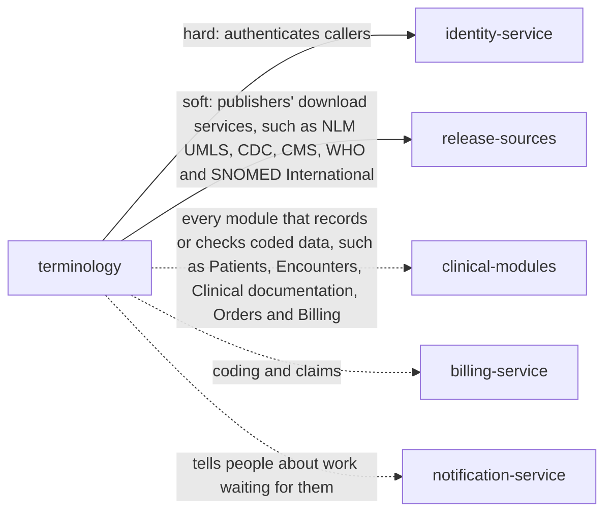

> Snapshot of healthcare/terminology version 0.1.4, saved 2026-10-09. The current version is at https://knowledge-graph-ecru.vercel.app/docs/healthcare/terminology.md.

# Terminology (/docs/healthcare/terminology)

## Module identity

- module: terminology
- layer: healthcare
- extended by: Terminology (ehr, /docs/healthcare/ehr/terminology)
- version: 0.1.4
- status: draft

## How to read this spec

- This is the complete spec for this page, with every inherited item already merged in.
- If a behaviour is not listed here, it is unspecified. Do not assume or invent it. Ask, or record it as an open question.
- Ids such as BR-1, FR-2 and AC-3 are stable. Cite them in code, tests and commit messages.
- Items that start with "US only:" or "EU only:" apply only in that jurisdiction. Skip the ones for a jurisdiction your project doesn't operate in, or add ?jurisdiction=us or ?jurisdiction=eu to this URL to leave them out. Unmarked items apply everywhere.
- This is the core terminology specification: nothing is inherited, and industry and domain pages build on it.

## Purpose & scope

Give every module one place to ask whether a code is valid on a date, what it means, which codes a field allows, and what it maps to. Load each release of each code system with its effective dates, check it before use, and keep every release ever used, so records coded years ago stay readable. Works in the United States and the European Union.

**In scope**

- A catalogue of the code systems in use, with their identifiers, publishers, licences and editions
- Loading, checking, activating and withdrawing releases, with the dates each one is in effect
- Checking a code on a date against the release in effect then, including whether it is valid for reporting
- Looking up displays in each language, properties, parents and children
- Inactive and replaced codes, with the replacements their publishers name
- Value sets: the codes a field allows, versioned and bound to the module settings that use them
- Maps between code systems, including rule-based maps that need the patient's age or sex, and translation
- ICD-11 postcoordination clusters
- Local codes in the organization's own code systems
- Dual coding while moving from one classification to another, such as ICD-10 to ICD-11
- Licences: loading and showing licensed content only where the organization holds the licence
- Watching for releases that are due

**Out of scope**

- The content of code systems. Their publishers own it: WHO, CDC and CMS, SNOMED International, Regenstrief, NLM, the AMA and national bodies.
- Choosing codes for a claim, payer code edits and grouping. Billing owns coding.
- Recording diagnoses, results or medications. Each module records its own codes and asks this module whether they are valid.
- Automatic coding from free text, including by AI.
- Negotiating licences. The organization holds them; this module records them.
- Clinical decision rules built on codes. Clinical decision support owns them.

## Overview

### Product perspective

Solid arrows are services this module calls; dotted arrows are services it notifies.

### Actors

| Actor | Description |
| --- | --- |
| Terminology manager | Loads and activates releases, and builds value sets, maps and local codes. |
| Clinician | Searches for codes when recording care, through other modules. |
| Coder | An HIM specialist who codes for reporting and claims, and uses maps and lookups. |
| System | Other modules that validate codes, expand value sets and translate codes. |

### Assumptions and dependencies

**AS-H1** Publishers distribute releases as files the organization can download, with dates of effect, and checksums or record counts to check them against.
  - Why: CDC, CMS, NLM, SNOMED International, Regenstrief and WHO publish release files and notes with each release.
**AS-H2** Callers send the date a code applies to, and the patient context a rule-based map needs.
  - Why: Which release applies depends on the date of care, and map rules depend on the patient's age and sex. This module holds no patient data.
**AS-H3** The organization holds the licences for the code systems it uses, such as the AMA's for CPT.
  - Why: Some code systems can't be used without a licence; others are free with attribution.

## Functions

### Business rules

**BR-H1** A code is identified by its code system URI and code, never by its display. Every module records the system, the code and the release version it validated against. The code systems and editions in use are those in code_systems_in_use.
  - Why: Displays change between releases and languages; the code doesn't. With the release recorded, a record reads the same years later.
**BR-H2** A code is checked against the release of its code system in effect on the date the caller gives. At most one release of a code system and edition is in effect on any date.
  - Why: HIPAA code sets are valid only within the dates their maintainers set (45 CFR 162.1011), and CDC states the range of dates of care each ICD-10-CM release applies to.
**BR-H3** Callers choose the date by code_date_rule: by default the date of service. For ICD-10-CM and ICD-10-PCS on US inpatient claims, the discharge date.
  - Why: CDC states its releases by date of service, while CMS has institutional claims use the code set in effect on the discharge or through date (MLN Matters SE1408). The sources differ by use, so it is a setting.
**BR-H4** A new release is staged, then verified: its checksum or record counts match what the publisher states, its files parse, and the changes from the previous release are listed. Only a verified release can be activated.
  - Why: A truncated or corrupt release would silently reject valid codes or accept invalid ones in every module at once.
**BR-H5** A Terminology manager activates a verified release, which takes effect on its effective_from date and sets the previous release's effective_to to the day before. A release can be activated before its date, so it is ready in time. Activation is all or nothing.
  - Why: ICD-10-CM releases are published ahead of 1 October and any 1 April update. Loading ahead means validation switches over on the right day without anyone working at midnight.
**BR-H6** Releases are never deleted or changed once active. A release its publisher recalls is withdrawn: dates it covered fall back to the previous release, and codes recorded against it stay readable.
  - Why: Records coded against a release must stay readable for as long as they are kept.
**BR-H7** When no release covers the date given, validation answers unknown rather than invalid, and names the dates the loaded releases cover.
  - Why: A record from before the organization loaded a code system isn't wrong; the caller decides whether to accept it.
**BR-H8** An inactive code is never valid for new use on a date it is inactive, but stays readable with its last display. Validation returns the replacements its publisher names. Recorded codes are never rewritten automatically.
  - Why: SNOMED CT links inactive concepts to active ones through historical associations, and LOINC names a replacement in MAP_TO. Which replacement is right depends on the record, so a person or the owning module decides.
**BR-H9** Codes are matched exactly as the code system defines: by case only where it is case-sensitive, as UCUM is. Input is normalized only by a code system's own documented rules.
  - Why: UCUM defines case-sensitive symbols, and mg and Mg are different. Guessing at normalization turns a typo into a different code.
**BR-H10** A code that fails its code system's check digit (SNOMED CT Verhoeff, LOINC mod 10) and isn't in the release is reported as a likely typing error. Presence in the release decides validity.
  - Why: SNOMED CT identifiers end in a Verhoeff check digit and LOINC codes in a mod 10 check digit; LOINC lists a few terms whose check digits are known to be wrong, so the digit alone mustn't reject a code.
**BR-H11** Validation says separately whether a code exists, is active, and is valid for reporting. ICD-10-CM and ICD-10-PCS header codes exist but aren't valid for reporting.
  - Why: The ICD-10-CM and ICD-10-PCS order files flag header codes as not valid for HIPAA-covered transactions. A diagnosis can be recorded clinically before it is coded fully for a claim.
**BR-H12** An ICD-11 cluster is valid only when each part is valid in the release, stem codes are joined by a slash and extension codes by an ampersand, and no extension code is first or alone.
  - Why: The ICD-11 reference guide defines clusters this way and says extension codes can never be used without a stem code or first in a cluster.
**BR-H13** A module's coded setting, such as encounter_type_codes, is bound to a value set here. Each change makes a new version; an active version never changes.
  - Why: Records validated against a value set must be explainable later. FHIR versions value sets for the same reason.
**BR-H14** A value set is expanded on a date, using for each rule the release named or the release in effect on that date. With a required binding, codes outside it are refused; with an extensible one, a code outside it is allowed only when no code in it fits, with text.
  - Why: FHIR defines required and extensible bindings this way. Expanding on the date keeps a value set over ICD-10-CM in step with each year's release.
**BR-H15** Translating a code returns candidate targets with their relationship and never replaces the source code in any record.
  - Why: Maps are rarely one to one. FHIR ConceptMap says how closely each target matches; the record keeps what the clinician chose.
**BR-H16** A rule-based map, such as SNOMED CT to ICD-10-CM, evaluates its rules with the patient context the caller sends, such as age and sex. When the context is missing, every candidate is returned, flagged for a person to choose. The context is never stored.
  - Why: NLM's SNOMED CT to ICD-10-CM map uses rules on age and sex; for example, sleep apnea maps to a newborn code or another depending on age. Keeping no context means this module holds no patient data.
**BR-H17** Year-to-year ICD-10-CM changes are followed with the CDC conversion table. CMS GEMs, last updated for fiscal year 2018, are used only for ICD-9 history.
  - Why: CDC publishes a conversion table with each ICD-10-CM release, and CMS stopped updating GEMs after fiscal year 2018.
**BR-H18** ICD-10 to ICD-11 translation uses the transition tables WHO publishes with each ICD-11 version, and ICD-11 releases are loaded with their version identifiers.
  - Why: WHO releases ICD-11 in versions with identifiers used when reporting, and provides transition tables with every version.
**BR-H19** During a transition set in dual_coding, a field can hold a code from each classification in the pair, each validated against its own release.
  - Why: WHO describes dual coding for transitions and comparison. Countries move from ICD-10 to ICD-11 at different times, and statistics need both during the change.
**BR-H20** Local codes live only in local code systems under local_namespace, never added to a standard code system. A local code used in a field that is exchanged must map to a standard code, or it is flagged.
  - Why: A local code under a standard URI would be read as a standard code by every receiver. SNOMED CT extensions need a namespace from SNOMED International.
**BR-H21** A release can be activated only when its code system's licence is recorded as held or the content is free. Licensed content, such as CPT descriptions, is shown only to callers within the licence, and every display carries the attribution the licence requires.
  - Why: The AMA requires a licence to use or display CPT content; SNOMED CT is free in member countries such as the United States under the affiliate licence; LOINC and ICD-11 are free with conditions, ICD-11 under CC BY-ND 3.0 IGO.
**BR-H22** Displays are returned in the language asked for when the release has one, and otherwise in default_language, or the code system's preferred display, marked as a fallback.
  - Why: National editions and translations carry their own displays; a patient or clinician must never see a blank where a code's meaning should be.
**BR-H23** Search by text looks in displays and synonyms of a value set's expansion on a date, returns active codes only unless asked, and never returns content the caller's licence excludes.
  - Why: Clinicians find codes by words. Returning inactive codes for new entries would bring retired codes back.
**BR-H24** For each code system in release_watch, a release not loaded by its warning date is listed, and terminology.release_overdue is emitted.
  - Why: ICD-10-CM changes every 1 October and sometimes 1 April, LOINC publishes in February and August, and SNOMED CT's International Edition and RxNorm publish monthly. A missed release means valid new codes are refused.
**BR-H25** Activating, withdrawing or retiring a release, a value set or a map emits an event with the changes, so modules can re-check settings and open records that use them.
  - Why: Modules cache code lists. Without an event they keep refusing new codes or accepting retired ones.
**BR-H26** Every load, verification, activation, withdrawal and change to a value set, map or local code is logged with who, when and why.
  - Why: Coding drives claims and statistics; an auditor must be able to see why a code was accepted on a date.
**BR-H27** Every answer names the releases and value set versions it used.
  - Why: A caller caching an answer, or explaining a decision later, needs to know which release it came from.
**BR-H28** Requests are never refused for another module's reasons: validation answers on the codes and dates given.
  - Why: Each module owns its own rules about which codes it accepts; this module only says what a code means and whether it is valid.
**BR-H29** US only: In the United States, the code sets for HIPAA transactions are loaded: ICD-10-CM for diagnoses, ICD-10-PCS for inpatient procedures, HCPCS and CPT for other services, CDT for dental services and NDC for retail pharmacy drugs. For certified health IT, SNOMED CT US Edition and LOINC are loaded at the versions ONC names.
  - Why: HIPAA names these code sets (45 CFR 162.1002), and ONC names vocabulary standards for certified health IT (45 CFR 170.207).
**BR-H30** EU only: In the European Union, value sets for fields exchanged in the European electronic health record exchange format use the coding systems its implementing acts name, as they are updated.
  - Why: The EHDS exchange format includes coding systems and values, laid down and updated by implementing acts (Article 15).
**BR-H31** Concurrent changes to a value set, map or local code send the revision they read; a stale revision fails.
  - Why: Two Terminology managers editing one value set must not overwrite each other.
**BR-H32** Validation, lookup and expansion keep working from the active releases when release sources or downloads are unreachable; only loading needs them.
  - Why: Every module depends on validation. A publisher's site being down must never stop care being recorded.
**BR-H33** A trial code is valid with a warning that it may change. A discouraged code is valid, so existing records and mappings keep working, but validation warns against new use and returns the replacement its publisher names. A deprecated code is inactive.
  - Why: LOINC marks terms ACTIVE, TRIAL, DISCOURAGED or DEPRECATED: trial terms may change, discouraged terms are not recommended for new mappings though existing ones may remain valid, and deprecated terms should not be used, with MAP_TO naming a replacement.

### State machine

Initial state: `staged`. States: `staged`, `verified`, `active`, `retired`, `withdrawn`.
Any transition not listed below is invalid.

| From | To | Trigger | Guard |
| --- | --- | --- | --- |
| staged | verified | verify (BR-H4) | checksum or counts match and files parse |
| staged | withdrawn | discard a staged release | - |
| verified | active | activate (BR-H5) | licence held or free (BR-H21) |
| verified | withdrawn | discard a verified release | - |
| active | retired | a later release takes over and its effective date passes | - |
| active | withdrawn | the publisher recalls it (BR-H6) | - |

### Workflows

#### Load a new release
Actor: Terminology manager
Trigger: A publisher releases a new version, or release_watch lists one as due

1. Stage the release from the publisher's files
2. Verify it: checksums or counts, parsing, and the list of changes
3. Review the changes, especially codes inactivated that value sets or settings use
4. Activate it, effective on the publisher's date
5. terminology.release_activated is emitted with the changes

Outcome: Validation uses the new release from its effective date, and modules know what changed.

#### Validate a code
Actor: System
Trigger: A module records a coded value

1. Send the system, code, date and optionally a value set
2. The service finds the release in effect on the date, and the value set expansion
3. It answers valid, invalid, inactive or unknown, with valid_for_reporting, the display and any replacements

Outcome: The module accepts or refuses the code with a reason, and records the release used.

#### Change a value set
Actor: Terminology manager
Trigger: A module's setting needs other codes

1. Create a new draft version with the changed rules
2. Expand it on today's date and review it
3. Activate it; terminology.value_set_activated is emitted

Outcome: The setting uses the new version; records validated against the old one keep its version.

#### Move to ICD-11
Actor: Terminology manager
Trigger: A country adopts ICD-11 for a use

1. Load the ICD-11 MMS release and WHO's transition tables
2. Set dual_coding for the period
3. Bind the value sets to ICD-11 from the adoption date

Outcome: Both classifications are coded during the transition, and ICD-11 alone after it.

### Validations

| Field | Rule | Error |
| --- | --- | --- |
| code_system.uri | An absolute URI; local systems start with local_namespace; not already registered | TERMINOLOGY_INVALID_CODE_SYSTEM |
| code_system.licence | Names the licence and whether it is held, or that the content is free | TERMINOLOGY_INVALID_CODE_SYSTEM |
| release.version | Unique for its code system | TERMINOLOGY_RELEASE_EXISTS |
| release.effective_from | A date; not inside an active release's period of the same edition unless that release is superseded by it | TERMINOLOGY_RELEASE_OVERLAP |
| release.source | Files whose checksum or record counts match the publisher's, and that parse | TERMINOLOGY_RELEASE_VERIFICATION_FAILED |
| value_set.rules | Each rule names a registered code system and a valid filter or listed codes present in the release it names | TERMINOLOGY_INVALID_VALUE_SET |
| map.entries | Each source and target code exists in the releases the map names, and each relationship is a ConceptMap relationship code | TERMINOLOGY_INVALID_MAP |
| concept.code | Added only to local code systems, unique in them | TERMINOLOGY_LOCAL_CODE_NOT_ALLOWED |
| release.status | Fields the service sets, such as status, effective_to, changes and releases, can't be written by clients | TERMINOLOGY_READ_ONLY_FIELD |

### Edge cases

**EC-H1** A diagnosis dated 30 September is validated on 2 October, after the new ICD-10-CM release took effect on 1 October.
  - Required behaviour: It is checked against the release in effect on 30 September, the date given, not today's.
  - Covered by: BR-H2, AC-H1
**EC-H2** An inpatient stay runs from 28 September to 3 October across an ICD-10-CM release change.
  - Required behaviour: For the claim, Billing validates with the discharge date, 3 October, under code_date_rule.
  - Covered by: BR-H3, AC-H2
**EC-H3** The April ICD-10-CM update is activated in March.
  - Required behaviour: It takes effect on 1 April; the October release ends 31 March.
  - Covered by: BR-H5, AC-H4
**EC-H4** A release download is cut off halfway.
  - Required behaviour: Verification fails on the counts and the release can't be activated.
  - Covered by: BR-H4, AC-H3
**EC-H5** A publisher recalls a release after it took effect.
  - Required behaviour: It is withdrawn, its dates fall back to the previous release, and codes recorded with it still read.
  - Covered by: BR-H6, AC-H5
**EC-H6** A record from 2009 is checked, before the organization loaded any ICD-10-CM release.
  - Required behaviour: Validation answers unknown and names the dates covered.
  - Covered by: BR-H7, AC-H6
**EC-H7** A SNOMED CT concept used in a value set is inactivated with a REPLACED BY association.
  - Required behaviour: The release's changes list the value set; validation of the old code for new dates returns inactive with the replacement; recorded codes stay as they are.
  - Covered by: BR-H8, BR-H25, AC-H7
**EC-H8** A unit is sent as MG instead of mg.
  - Required behaviour: It isn't matched, because UCUM is case-sensitive, and validation returns invalid.
  - Covered by: BR-H9, AC-H8
**EC-H9** A SNOMED CT code is mistyped and fails its check digit.
  - Required behaviour: Validation returns invalid with a likely typing error.
  - Covered by: BR-H10, AC-H8
**EC-H10** A coder picks E11, a header code, for a claim.
  - Required behaviour: Validation says it exists and is active but isn't valid for reporting.
  - Covered by: BR-H11, AC-H9
**EC-H11** An ICD-11 cluster starts with an extension code.
  - Required behaviour: It is invalid.
  - Covered by: BR-H12, AC-H10
**EC-H12** A sleep apnea concept is translated to ICD-10-CM without the patient's age.
  - Required behaviour: Both the newborn and the general code are returned, flagged for a coder to choose.
  - Covered by: BR-H16, AC-H12
**EC-H13** A Terminology manager adds a local code to the LOINC code system.
  - Required behaviour: Refused; local codes go in a local code system.
  - Covered by: BR-H20, AC-H14
**EC-H14** The CPT licence lapses.
  - Required behaviour: New CPT releases can't be activated and CPT descriptions are hidden from callers outside the licence.
  - Covered by: BR-H21, AC-H15
**EC-H15** The ICD-10-CM release isn't loaded by 1 September.
  - Required behaviour: It is listed as overdue and terminology.release_overdue is emitted.
  - Covered by: BR-H24, AC-H16
**EC-H16** The publisher's site is down when a release is due.
  - Required behaviour: Validation goes on with the active releases; loading waits.
  - Covered by: BR-H32, AC-H17
**EC-H17** Two Terminology managers edit one draft value set.
  - Required behaviour: The second save fails with TERMINOLOGY_REVISION_CONFLICT.
  - Covered by: BR-H31, AC-H18
**EC-H18** A country starts ICD-11 for mortality but keeps ICD-10 for payment.
  - Required behaviour: dual_coding holds both for the uses set; each code is validated against its own release.
  - Covered by: BR-H19, AC-H11
**EC-H19** A Terminology manager stages the same release twice, once by retrying after a timeout.
  - Required behaviour: The retry with the same Idempotency-Key returns the release staged first; staging the same version again without the key fails with TERMINOLOGY_RELEASE_EXISTS.
  - Covered by: BR-H4, AC-H3, AC-H19
**EC-H20** A visit happens at 23:30 Pacific time on 30 September, which is already 1 October in UTC.
  - Required behaviour: The caller sends the local date of care, 30 September, so the September release applies.
  - Covered by: BR-H2, BR-H3
**EC-H21** terminology.release_activated for the April update arrives before the one for the October release.
  - Required behaviour: Consumers rely on each release's effective dates and the release named in every answer, not on the order of events.
  - Covered by: BR-H25, BR-H27
**EC-H22** A laboratory interface still sends a LOINC term that the new release marks DISCOURAGED.
  - Required behaviour: It is accepted, so results keep flowing, and the warning with the replacement is shown to the Terminology manager to update the mapping.
  - Covered by: BR-H33, AC-H31

## Data

### Data model

| Field | Type | Required | Description | Constraints |
| --- | --- | --- | --- | --- |
| code_system.uri | uri | yes | The code system's canonical identifier, such as http://snomed.info/sct or http://hl7.org/fhir/sid/icd-10-cm. | the publisher's or HL7's registered URI; local systems use local_namespace |
| code_system.name | string | yes | Its name, such as ICD-10-CM. | - |
| code_system.publisher | string | yes | Who maintains it, such as CDC NCHS or SNOMED International. | - |
| code_system.kind | enum | yes | What sort of code system it is. | classification \| terminology \| units \| code_set \| local; codes: none standard, local to this specification |
| code_system.edition | string | no | The edition used, where a code system has several, such as SNOMED CT US Edition or a national edition, or ICD-10-GM. | one per code system in use |
| code_system.case_sensitive | boolean | yes | Whether codes differ by case, as UCUM codes do. | - |
| code_system.check_digit | enum | yes | The check digit scheme its codes use. | none \| mod10 \| verhoeff; codes: none standard; LOINC uses mod 10, SNOMED CT uses Verhoeff |
| code_system.licence | licence | yes | The licence its content needs, whether the organization holds it, and the attribution it requires. | licence_held must be true before a release is activated, unless the licence is free |
| release.id | string | yes | The release id. | set by the service |
| release.code_system | uri | yes | The code system. | - |
| release.version | string | yes | The publisher's version, such as FY2026 April for ICD-10-CM, 2.81 for LOINC, or a SNOMED CT edition date. | unique per code system |
| release.effective_from | date | yes | The first date of care the release applies to, as the publisher states. | - |
| release.effective_to | date | no | The last date it applies to; set when a later release takes over. | set by the service |
| release.status | enum | yes | Where the release is in its lifecycle. | staged \| verified \| active \| retired \| withdrawn; codes: none standard, local to this specification |
| release.source | string | yes | Where the files came from, and their checksum. | - |
| release.changes | change summary | no | What changed from the previous release: codes added, inactivated, and displays changed. | set by the service when verified |
| release.loaded_by | string | yes | The Terminology manager who loaded it, and who activated it. | - |
| concept.code | string | yes | The code, exactly as the code system writes it. | unique in its code system; compared by case only where the code system is case-sensitive |
| concept.display | string | yes | The publisher's display in the release. | - |
| concept.designations | designation[] | no | Other displays, by language and use, such as synonyms and translations. | - |
| concept.status | enum | yes | The concept's status in a release. | active \| trial \| discouraged \| inactive; codes: FHIR concept-properties status; LOINC ACTIVE, TRIAL, DISCOURAGED, DEPRECATED (DEPRECATED maps to inactive) |
| concept.valid_for_reporting | boolean | no | Whether the code can be reported, rather than only heading a group. | from the release; for ICD-10-CM and ICD-10-PCS the order file's header flag |
| concept.parents | string[] | no | Codes directly above it, for subsumption. | - |
| concept.replaced_by | association[] | no | For an inactive code, the codes its publisher names instead and how they relate. | codes: SNOMED CT historical associations such as REPLACED BY, SAME AS, POSSIBLY EQUIVALENT TO, ALTERNATIVE; LOINC MAP_TO |
| concept.releases | string[] | yes | The releases the concept appears in, and whether it is active in each. | set by the service |
| value_set.url | uri | yes | The value set's identifier. | - |
| value_set.version | string | yes | Its version. A new version is made for every change. | - |
| value_set.name | string | yes | A short name, such as encounter types. | - |
| value_set.used_by | string[] | no | The module settings bound to it, such as Encounters' encounter_type_codes. | - |
| value_set.rules | rule[] | yes | Which codes it includes and excludes: whole code systems, codes under a parent, codes with a property, or listed codes. | each names a code system and either a release or the release in effect |
| value_set.binding | enum | yes | How strictly a field must use it. | required \| extensible; codes: FHIR binding-strength required, extensible |
| value_set.status | enum | yes | Where it is in its lifecycle. | draft \| active \| retired; codes: FHIR publication-status draft, active, retired |
| map.id | string | yes | The map id. | - |
| map.source | string | yes | The source code system and release. | - |
| map.target | string | yes | The target code system and release. | - |
| map.kind | enum | yes | How the map was made. | publisher \| transition_table \| local; codes: none standard, local to this specification |
| map.entries | map entry[] | yes | Each source code's targets, with relationship, and for rule-based maps the rule, group and priority. | codes: FHIR R5 ConceptMap relationship: equivalent, source-is-narrower-than-target, source-is-broader-than-target, related-to, not-related-to |
| map.status | enum | yes | Where it is in its lifecycle. | draft \| active \| retired; codes: FHIR publication-status |
| dual_coding.pairs | pair[] | no | Classifications coded side by side during a transition, and the period. | from the dual_coding setting |

### Relationships

| Edge | Target | Note |
| --- | --- | --- |
| has_many | release | a code system has many releases, at most one in effect on a date |
| has_many | concept | a release has many concepts |
| belongs_to | code_system | a value set rule and a map side each name a code system |
| can_trigger | event:terminology.release_activated | - |

## External interfaces

### API

#### Validate a code: `GET /validate-code`
Check a code, optionally in a value set, on a date (FHIR $validate-code).
- Success: 200
- Actor: System
- Input: system, code, date, and optional value set, display and edition
- Result: valid, invalid, inactive or unknown; active; valid_for_reporting; display; replacements; releases used
- Errors: TERMINOLOGY_INVALID_REQUEST, TERMINOLOGY_UNKNOWN_CODE_SYSTEM, TERMINOLOGY_NOT_FOUND, TERMINOLOGY_LICENCE_REQUIRED

#### Look up a code: `GET /lookup`
A code's displays, properties, parents and history on a date (FHIR $lookup).
- Success: 200
- Actor: System
- Input: system, code, date and optional language
- Result: the concept as of that date, and the release used
- Errors: TERMINOLOGY_INVALID_REQUEST, TERMINOLOGY_UNKNOWN_CODE_SYSTEM, TERMINOLOGY_LICENCE_REQUIRED

#### Expand a value set: `GET /expand`
The codes a value set allows on a date, optionally filtered by text (FHIR $expand).
- Success: 200
- Actor: System
- Input: value set url and optional version, date, text filter, language, limit and cursor
- Result: codes with displays, the releases used, and next_cursor
- Errors: TERMINOLOGY_INVALID_REQUEST, TERMINOLOGY_NOT_FOUND, TERMINOLOGY_LICENCE_REQUIRED

#### Check subsumption: `GET /subsumes`
Whether one code is the same as, above or below another on a date (FHIR $subsumes).
- Success: 200
- Actor: System
- Input: system, two codes, date
- Result: equivalent, subsumes, subsumed-by or not-subsumed
- Errors: TERMINOLOGY_INVALID_REQUEST, TERMINOLOGY_UNKNOWN_CODE_SYSTEM

#### Translate a code: `POST /translate`
Candidate codes in another code system (FHIR $translate).
- Success: 200
- Actor: Coder
- Input: system, code, date, target system, and optional map and patient context such as age and sex
- Result: candidates with relationship and, when context was missing, a flag to choose
- Errors: TERMINOLOGY_INVALID_REQUEST, TERMINOLOGY_UNKNOWN_CODE_SYSTEM, TERMINOLOGY_NOT_FOUND

#### Validate an ICD-11 cluster: `GET /validate-cluster`
Check a postcoordinated ICD-11 cluster on a date.
- Success: 200
- Actor: Coder
- Input: cluster and date
- Result: valid or not, each part checked, and the release used
- Errors: TERMINOLOGY_INVALID_REQUEST, TERMINOLOGY_NOT_FOUND

#### List code systems: `GET /code-systems`
The code systems in use, with editions, licences and the releases in effect.
- Success: 200
- Actor: System
- Input: limit and cursor
- Result: code systems

#### Register a code system: `POST /code-systems`
Add a code system, with its licence.
- Success: 201
- Actor: Terminology manager
- Input: uri, name, publisher, kind, edition, case sensitivity, check digit and licence
- Result: the code system
- Errors: TERMINOLOGY_INVALID_CODE_SYSTEM, TERMINOLOGY_FORBIDDEN, TERMINOLOGY_IDEMPOTENCY_KEY_REUSED

#### Update a code system's licence: `PUT /code-systems/{id}/licence`
Record that a licence is held, ends, or changes.
- Success: 200
- Actor: Terminology manager
- Input: licence and revision
- Result: the code system
- Errors: TERMINOLOGY_NOT_FOUND, TERMINOLOGY_INVALID_CODE_SYSTEM, TERMINOLOGY_FORBIDDEN, TERMINOLOGY_REVISION_CONFLICT

#### Stage a release: `POST /releases`
Load a release's files from the publisher. Accepts a retry key.
- Success: 201
- Actor: Terminology manager
- Input: code system, version, effective_from, files and the publisher's checksum or counts
- Result: the staged release
- Errors: TERMINOLOGY_UNKNOWN_CODE_SYSTEM, TERMINOLOGY_RELEASE_EXISTS, TERMINOLOGY_RELEASE_OVERLAP, TERMINOLOGY_READ_ONLY_FIELD, TERMINOLOGY_FORBIDDEN, TERMINOLOGY_IDEMPOTENCY_KEY_REUSED, TERMINOLOGY_DEPENDENCY_UNAVAILABLE

#### Verify a release: `POST /releases/{id}/verify`
Check a staged release and list what changed.
- Success: 200
- Actor: Terminology manager
- Input: release id
- Result: the verified release with its changes
- Errors: TERMINOLOGY_NOT_FOUND, TERMINOLOGY_RELEASE_VERIFICATION_FAILED, TERMINOLOGY_INVALID_STATUS, TERMINOLOGY_FORBIDDEN

#### Activate a release: `POST /releases/{id}/activate`
Put a verified release into effect from its date.
- Success: 200
- Actor: Terminology manager
- Input: reason
- Result: the active release
- Errors: TERMINOLOGY_NOT_FOUND, TERMINOLOGY_INVALID_STATUS, TERMINOLOGY_LICENCE_NOT_HELD, TERMINOLOGY_RELEASE_OVERLAP, TERMINOLOGY_FORBIDDEN

#### Withdraw a release: `POST /releases/{id}/withdraw`
Withdraw a staged, verified or recalled active release, with a reason.
- Success: 200
- Actor: Terminology manager
- Input: reason
- Result: the withdrawn release
- Errors: TERMINOLOGY_NOT_FOUND, TERMINOLOGY_INVALID_STATUS, TERMINOLOGY_REASON_REQUIRED, TERMINOLOGY_FORBIDDEN

#### List releases: `GET /releases`
Releases by code system and status, with their periods.
- Success: 200
- Actor: System
- Input: filters, limit and cursor
- Result: releases

#### Get a release's changes: `GET /releases/{id}/changes`
Codes added, inactivated and with changed displays, and the value sets that use them.
- Success: 200
- Actor: Terminology manager
- Input: release id, limit and cursor
- Result: changes
- Errors: TERMINOLOGY_NOT_FOUND

#### Create a value set version: `POST /value-sets`
Create a value set, or a new draft version of one.
- Success: 201
- Actor: Terminology manager
- Input: url, name, rules, binding and used_by
- Result: the draft version
- Errors: TERMINOLOGY_INVALID_VALUE_SET, TERMINOLOGY_FORBIDDEN, TERMINOLOGY_IDEMPOTENCY_KEY_REUSED

#### Edit a draft value set: `PATCH /value-sets/{id}`
Change a draft version's rules.
- Success: 200
- Actor: Terminology manager
- Input: changed fields and revision
- Result: the draft
- Errors: TERMINOLOGY_NOT_FOUND, TERMINOLOGY_INVALID_VALUE_SET, TERMINOLOGY_IMMUTABLE, TERMINOLOGY_REVISION_CONFLICT, TERMINOLOGY_FORBIDDEN

#### Activate a value set version: `POST /value-sets/{id}/activate`
Make a draft version active, retiring the previous one.
- Success: 200
- Actor: Terminology manager
- Input: revision
- Result: the active version
- Errors: TERMINOLOGY_NOT_FOUND, TERMINOLOGY_INVALID_STATUS, TERMINOLOGY_REVISION_CONFLICT, TERMINOLOGY_FORBIDDEN

#### Get a value set: `GET /value-sets/{id}`
A value set version and its rules.
- Success: 200
- Actor: System
- Input: id or url and version
- Result: the value set
- Errors: TERMINOLOGY_NOT_FOUND

#### Load a map: `POST /maps`
Load a map from a publisher, a transition table, or the organization's own.
- Success: 201
- Actor: Terminology manager
- Input: source and target releases, kind, entries
- Result: the draft map
- Errors: TERMINOLOGY_INVALID_MAP, TERMINOLOGY_FORBIDDEN, TERMINOLOGY_IDEMPOTENCY_KEY_REUSED

#### Activate a map: `POST /maps/{id}/activate`
Make a map active for translation.
- Success: 200
- Actor: Terminology manager
- Input: revision
- Result: the active map
- Errors: TERMINOLOGY_NOT_FOUND, TERMINOLOGY_INVALID_STATUS, TERMINOLOGY_REVISION_CONFLICT, TERMINOLOGY_FORBIDDEN

#### Add a local code: `POST /code-systems/{id}/concepts`
Add a code to one of the organization's local code systems, optionally mapped to a standard code.
- Success: 201
- Actor: Terminology manager
- Input: code, display, designations and optional standard code
- Result: the concept
- Errors: TERMINOLOGY_NOT_FOUND, TERMINOLOGY_LOCAL_CODE_NOT_ALLOWED, TERMINOLOGY_FORBIDDEN, TERMINOLOGY_IDEMPOTENCY_KEY_REUSED

#### List overdue releases: `GET /releases/overdue`
Code systems whose expected release isn't loaded by its warning date.
- Success: 200
- Actor: Terminology manager
- Input: none
- Result: code systems with the release expected

#### Get the change log: `GET /change-log`
Who loaded, activated, withdrew or changed what, when and why.
- Success: 200
- Actor: Terminology manager
- Input: filters, limit and cursor
- Result: log entries
- Errors: TERMINOLOGY_FORBIDDEN

### API conventions

| Topic | Convention | Reference |
| --- | --- | --- |
| Authentication | Every request carries the caller's identity from Identity. Permissions are checked against it (Permission matrix). | - |
| Errors | Errors use problem details (application/problem+json) with a code member, such as TERMINOLOGY_RELEASE_OVERLAP. A validation that finds a code invalid is a 200 with the result, not an error. | RFC 9457 |
| Pagination | Lists and expansions are cursor-based: limit and an optional cursor in, next_cursor out. | - |
| Concurrency | Every change sends the revision it read. A stale revision fails with TERMINOLOGY_REVISION_CONFLICT (BR-H31). | - |
| Retries | Every create accepts an Idempotency-Key header; a retry returns the original result. | IETF draft-ietf-httpapi-idempotency-key-header |
| FHIR | Validate, look up, expand, subsumes and translate are also served as the FHIR R5 operations $validate-code, $lookup, $expand, $subsumes and $translate on CodeSystem, ValueSet and ConceptMap (FR-H9). | - |
| Caching | Answers carry the releases used and an ETag; callers may cache them until terminology.release_activated or terminology.value_set_activated (BR-H25, BR-H27). | - |

### Events

| Event | Description | Payload |
| --- | --- | --- |
| terminology.release_activated | A release was activated, effective from its date. | code_system, version, effective_from, codes_added, codes_inactivated, value_sets_affected |
| terminology.release_withdrawn | A release was withdrawn; dates it covered fall back to the previous release. | code_system, version, reason |
| terminology.value_set_activated | A value set version became active. | url, version, used_by |
| terminology.map_activated | A map became active. | map_id, source, target |
| terminology.release_overdue | An expected release isn't loaded by its warning date. | code_system, expected |

### Event delivery

**DG-H1** Events are published at least once; consumers drop one with a source and id they have seen.
  - Why: A relay can publish twice after a crash. CloudEvents defines source plus id as the duplicate check.
**DG-H2** Every event carries a unique id, its type, when the change happened, and the code system or value set it is about.
  - Why: Consumers order and deduplicate by these.
**DG-H3** A release_activated event is published before its effective date when the release is activated ahead.
  - Why: Modules need time to refresh caches before the release takes effect.

### Errors

| Code | HTTP | Meaning |
| --- | --- | --- |
| TERMINOLOGY_NOT_FOUND | 404 | No release, value set, map or code system exists with that id. |
| TERMINOLOGY_FORBIDDEN | 403 | Your role doesn't allow this. |
| TERMINOLOGY_INVALID_REQUEST | 422 | A required parameter is missing or malformed, such as the date. |
| TERMINOLOGY_UNKNOWN_CODE_SYSTEM | 422 | That code system isn't registered here. |
| TERMINOLOGY_LICENCE_REQUIRED | 403 | This content needs a licence you aren't covered by. |
| TERMINOLOGY_LICENCE_NOT_HELD | 409 | The code system's licence isn't recorded as held, so its release can't be activated. |
| TERMINOLOGY_INVALID_CODE_SYSTEM | 422 | The code system's URI or licence is missing or invalid, or it is already registered. |
| TERMINOLOGY_RELEASE_EXISTS | 409 | That version of this code system is already loaded. |
| TERMINOLOGY_RELEASE_OVERLAP | 409 | The release's period overlaps an active release it doesn't supersede. |
| TERMINOLOGY_RELEASE_VERIFICATION_FAILED | 422 | The files don't match the publisher's checksum or counts, or don't parse. |
| TERMINOLOGY_INVALID_STATUS | 409 | The release, value set or map isn't in a status that allows this. |
| TERMINOLOGY_IMMUTABLE | 409 | An active or retired version can't change; create a new version. |
| TERMINOLOGY_INVALID_VALUE_SET | 422 | A rule names an unknown code system, an invalid filter, or a code not in the release. |
| TERMINOLOGY_INVALID_MAP | 422 | An entry names a code not in the map's releases, or an unknown relationship. |
| TERMINOLOGY_LOCAL_CODE_NOT_ALLOWED | 422 | Codes can only be added to local code systems, and must be unique there. |
| TERMINOLOGY_REASON_REQUIRED | 422 | This needs a reason. |
| TERMINOLOGY_READ_ONLY_FIELD | 422 | That field is set by the service. |
| TERMINOLOGY_REVISION_CONFLICT | 409 | It changed since you read it. Read it again. |
| TERMINOLOGY_IDEMPOTENCY_KEY_REUSED | 422 | That retry key was used with a different request. |
| TERMINOLOGY_DEPENDENCY_UNAVAILABLE | 503 | The release source or Identity can't be reached. Try again. |

### Dependencies

Each dependency lists its contract: only what this module needs from it (upstream) or gives it (downstream). How the other module works is out of scope.

| Service | Direction | Criticality | Reason | Contract |
| --- | --- | --- | --- | --- |
| identity-service | upstream | hard | authenticates callers | Asks: who is the caller, and do they hold this permission? |
| release-sources | upstream | soft | publishers' download services, such as NLM UMLS, CDC, CMS, WHO and SNOMED International | Receives: release files, with their checksums or counts and dates of effect; Content and its publication are the publishers' concern |
| clinical-modules | downstream | soft | every module that records or checks coded data, such as Patients, Encounters, Clinical documentation, Orders and Billing | Gives: whether a code is valid on a date, its display and replacements, and the releases used; Gives: value set expansions for the settings bound to them; Gives: terminology.release_activated, terminology.release_withdrawn, terminology.value_set_activated and terminology.map_activated, to refresh caches and re-check settings; Which codes each module accepts is that module's concern |
| billing-service | downstream | soft | coding and claims | Gives: valid_for_reporting, and translations with map rules for coders; Gives: code_date_rule, so claims use the right release; Choosing codes for claims is Billing's concern |
| notification-service | downstream | soft | tells people about work waiting for them | Gives: terminology.release_overdue, for the Terminology manager |

## Security

### Permission matrix

| Action | Terminology manager | Clinician | Coder | System | Permission |
| --- | --- | --- | --- | --- | --- |
| Validate, look up, expand, check subsumption, validate clusters, list code systems and releases, get value sets | any | any | any | any | terminology.read |
| Translate a code | any | none | any | any | terminology.read |
| Register code systems, update licences, stage, verify, activate and withdraw releases | any | none | none | none | terminology.manage |
| Create, edit and activate value sets and maps, add local codes | any | none | none | none | terminology.manage |
| Get release changes, overdue releases and the change log | any | none | any | none | terminology.manage |
| See licensed content, such as CPT descriptions | any | any | any | any | terminology.licensed |

any: every appointment. own: appointments the actor takes part in. none: not allowed.

- Validate, look up, expand, check subsumption, validate clusters, list code systems and releases, get value sets: Licensed content needs terminology.licensed (BR-H21).

- See licensed content, such as CPT descriptions: any: only users and systems the organization's licence covers hold this permission (BR-H21).

### Permissions

| Permission | Grants |
| --- | --- |
| terminology.read | Validate, look up, expand, translate and search. |
| terminology.manage | Register code systems, load and activate releases, and manage value sets, maps and local codes. |
| terminology.licensed | See licensed content, such as CPT descriptions, within the organization's licence. |

### Privacy and retention

| Field | Category | Purpose | Retention |
| --- | --- | --- | --- |
| release.loaded_by | personal data of staff | Showing who loaded and activated each release | As long as the release |
| change log | personal data of staff | Auditing changes to terminology | As long as any record coded with the releases it concerns |
| patient context sent to translation | health data | Evaluating map rules | Not kept; used only for the request (BR-H16) |

### Compliance

**CMP-H1** HIPAA Transactions and Code Sets, 45 CFR 162.1002: US only: Use ICD-10-CM, ICD-10-PCS, HCPCS and CPT, CDT and NDC in transactions.
  - How it's met: These code sets are registered and loaded.
  - Status: met
  - Covered by: BR-H29
**CMP-H2** HIPAA Transactions and Code Sets, 45 CFR 162.1011: US only: Code sets are valid within the dates their maintainers set.
  - How it's met: Validation by the release in effect on the date.
  - Status: met
  - Covered by: BR-H2, BR-H5
**CMP-H3** ONC Health IT Certification, 45 CFR 170.207: US only: Use the named vocabulary standards, such as SNOMED CT US Edition and LOINC.
  - How it's met: Loaded at the versions named.
  - Status: met
  - Covered by: BR-H29
**CMP-H4** European Health Data Space (EU) 2025/327, Article 15: EU only: Use the coding systems the European exchange format's implementing acts name.
  - How it's met: Value sets for exchanged fields follow the implementing acts as they are adopted.
  - Status: partly met
  - Covered by: BR-H30
**CMP-H5** GDPR (EU) 2016/679, Article 5(1)(c): EU only: Data minimisation.
  - How it's met: No patient data stored; map context is used only for the request.
  - Status: met
  - Covered by: CON-H1, BR-H16

## Requirements

### Functional requirements

| ID | Requirement | Priority | Verified by |
| --- | --- | --- | --- |
| FR-H1 | The service must validate a code on a date against the release in effect, saying whether it exists, is active and is valid for reporting. | must | test |
| FR-H2 | The service must stage, verify, activate and withdraw releases, keeping every release ever activated. | must | test |
| FR-H3 | The service must return displays, properties, parents and replacements of a code on a date. | must | test |
| FR-H4 | The service must version value sets and expand them on a date. | must | test |
| FR-H5 | The service must translate codes with maps, evaluating map rules from the context given. | must | test |
| FR-H6 | The service must validate ICD-11 clusters. | should | test |
| FR-H7 | The service must hold local code systems apart from standard ones. | must | test |
| FR-H8 | The service must refuse to activate unlicensed content and hide licensed content from callers outside the licence. | must | test |
| FR-H9 | The service must serve the FHIR R5 terminology operations $validate-code, $lookup, $expand, $subsumes and $translate. | must | inspection |
| FR-H10 | The service must list releases that are overdue against release_watch. | should | test |
| FR-H11 | The service must log every change to releases, value sets, maps and local codes. | must | test |

### Performance requirements

| Id | Indicator | Target | Measured as |
| --- | --- | --- | --- |
| PERF-H1 | Validation latency | Set by each deployment as an SLO | 99th percentile time to answer a validation. |
| PERF-H2 | Releases in time | 100% | Share of releases in release_watch active before their effective date. |
| PERF-H3 | Validation availability | Set by each deployment as an SLO | Share of validations answered over a rolling 30 days. |

### Quality attributes

| Category | Requirement |
| --- | --- |
| compatibility | Code systems, value sets and maps map onto FHIR R5 CodeSystem, ValueSet and ConceptMap, with versions as the publishers define them. |
| availability | Validation, lookup and expansion stay available when release sources can't be reached (BR-H32). |
| reliability | A release becomes active completely or not at all. |
| security | Only Terminology managers change terminology, and every change is logged. |
| portability | No requirement depends on a particular database, language or framework. |

### Design constraints

**CON-H1** This module stores no patient data.
  - Why: It answers questions about codes; keeping patient context would make it a store of health data for no purpose (GDPR Article 5(1)(c)).
**CON-H2** Licensed content is loaded and shown only within the licences the organization holds.
  - Why: The AMA requires a licence for CPT, and SNOMED CT is free only under the affiliate licence in member countries.

### Configuration

| Setting | Type | Default | Description |
| --- | --- | --- | --- |
| jurisdiction | us \| eu | none | Which legal regime applies. Required. |
| code_systems_in_use | list | none | The code systems and editions loaded, such as ICD-10-CM, ICD-10-PCS, SNOMED CT US Edition, LOINC, UCUM, RxNorm and CPT in the United States, or WHO ICD-10, a national version such as ICD-10-GM, ICD-11 MMS and a national SNOMED CT edition in the EU. |
| code_date_rule | map | none | Which date picks the release, per code system and use. Default date of service; for ICD-10-CM and ICD-10-PCS on US inpatient claims, the discharge date. |
| dual_coding | list | none | Pairs of classifications coded side by side, such as ICD-10 and ICD-11, with the period. Empty by default. |
| local_namespace | uri | none | The URI base for the organization's local code systems, and its SNOMED CT namespace if it has one. Required. |
| release_watch | list | none | For each code system, when the next release is expected and how long before to warn. Defaults: ICD-10-CM and ICD-10-PCS each 1 October, with possible 1 April updates; LOINC February and August; SNOMED CT International Edition and RxNorm monthly; ICD-11 yearly. |
| default_language | BCP 47 tag | none | The language displays fall back to. Default en. |
| search_result_limit | integer | none | The most results a search returns. Default 50. |

## Verification

### Acceptance criteria

**AC-H1**
- Given ICD-10-CM releases in effect to 30 September and from 1 October, and a code added on 1 October
- When the new code is validated for 30 September and for 1 October, and a request is sent with no date
- Then it is invalid for 30 September and valid for 1 October, each answer names the release used, and the request without a date fails with TERMINOLOGY_INVALID_REQUEST and HTTP 422
- Verifies: BR-H1, BR-H2, BR-H27, FR-H1

**AC-H2**
- Given code_date_rule with the discharge date for inpatient claims
- When Billing asks which date to use for a stay from 28 September to 3 October
- Then the rule gives 3 October
- Verifies: BR-H3

**AC-H3**
- Given a staged release whose record count doesn't match the publisher's, and an unknown code system
- When it is verified, a release of the unknown code system is staged, and a second copy of a loaded version is staged
- Then verification fails with TERMINOLOGY_RELEASE_VERIFICATION_FAILED and HTTP 422 and activation fails with TERMINOLOGY_INVALID_STATUS and HTTP 409; the unknown system fails with TERMINOLOGY_UNKNOWN_CODE_SYSTEM and HTTP 422; the copy fails with TERMINOLOGY_RELEASE_EXISTS and HTTP 409
- Verifies: BR-H4, FR-H2

**AC-H4**
- Given the October ICD-10-CM release active, and the April update verified
- When the April update is activated in March, and another release overlapping it without superseding it is staged
- Then it is active from 1 April, the October release ends 31 March, terminology.release_activated is emitted before 1 April with the changes; the overlap fails with TERMINOLOGY_RELEASE_OVERLAP and HTTP 409
- Verifies: BR-H5, BR-H25, FR-H2

**AC-H5**
- Given an active release recalled by its publisher
- When it is withdrawn without a reason, then with one
- Then without a reason it fails with TERMINOLOGY_REASON_REQUIRED and HTTP 422; then it is withdrawn, terminology.release_withdrawn is emitted, its dates use the previous release, and lookups of codes recorded with it still return their displays
- Verifies: BR-H6, FR-H2

**AC-H6**
- Given ICD-10-CM releases loaded from fiscal year 2016
- When a code is validated for a date in 2009
- Then the answer is unknown and names the dates covered
- Verifies: BR-H7

**AC-H7**
- Given a SNOMED CT concept inactivated with a REPLACED BY association
- When it is validated for a date after the inactivation, and looked up
- Then validation returns inactive with the replacement; lookup returns its last display and history
- Verifies: BR-H8, FR-H3

**AC-H8**
- Given UCUM and SNOMED CT releases
- When MG is validated as a unit, and a SNOMED CT code with a wrong check digit is validated
- Then MG is invalid; the SNOMED CT code is invalid and reported as a likely typing error
- Verifies: BR-H9, BR-H10

**AC-H9**
- Given the ICD-10-CM release
- When E11 and E11.9 are validated
- Then E11 exists and is active but isn't valid for reporting; E11.9 is valid for reporting
- Verifies: BR-H11, FR-H1

**AC-H10**
- Given an ICD-11 MMS release
- When DA63.Z/ME24.90 is validated, and a cluster starting with an extension code
- Then the first is valid with each part checked; the second is invalid
- Verifies: BR-H12, FR-H6

**AC-H11**
- Given dual_coding of ICD-10 and ICD-11 for a period
- When a field is given a code from each
- Then each is validated against its own release and both are accepted
- Verifies: BR-H19

**AC-H12**
- Given the SNOMED CT to ICD-10-CM map
- When sleep apnea is translated with age 2 days, then with no age
- Then with the age it returns the newborn code; without it, both candidates flagged to choose, and no context is stored; the source code isn't changed anywhere
- Verifies: BR-H15, BR-H16, FR-H5, CON-H1

**AC-H13**
- Given a value set for encounter types bound to Encounters' encounter_type_codes, active at version 1
- When a manager edits version 1, creates version 2 with a rule naming an unknown code system, then a valid version 2, and activates it
- Then editing version 1 fails with TERMINOLOGY_IMMUTABLE and HTTP 409; the invalid rule fails with TERMINOLOGY_INVALID_VALUE_SET and HTTP 422; version 2 becomes active and terminology.value_set_activated is emitted; expanding on a date uses the releases in effect then
- Verifies: BR-H13, BR-H14, BR-H25, FR-H4

**AC-H14**
- Given a local code system under local_namespace
- When a manager adds a local code, then adds one to LOINC, then loads a map whose entry names a code not in its releases, and a valid map, and activates it
- Then the local code is added; LOINC fails with TERMINOLOGY_LOCAL_CODE_NOT_ALLOWED and HTTP 422; the bad map fails with TERMINOLOGY_INVALID_MAP and HTTP 422; the valid map becomes active and terminology.map_activated is emitted
- Verifies: BR-H20, FR-H7

**AC-H15**
- Given CPT with no licence recorded
- When a verified CPT release is activated, and a caller without terminology.licensed looks up a CPT code
- Then activation fails with TERMINOLOGY_LICENCE_NOT_HELD and HTTP 409; the lookup fails with TERMINOLOGY_LICENCE_REQUIRED and HTTP 403
- Verifies: BR-H21, FR-H8, CON-H2

**AC-H16**
- Given release_watch expecting ICD-10-CM on 1 October with a warning on 1 September
- When nothing is loaded by 1 September
- Then it is listed as overdue and terminology.release_overdue is emitted
- Verifies: BR-H24, FR-H10

**AC-H17**
- Given the release source unreachable
- When codes are validated, and a release is staged from it
- Then validation answers from the active releases; staging fails with TERMINOLOGY_DEPENDENCY_UNAVAILABLE and HTTP 503
- Verifies: BR-H32

**AC-H18**
- Given a draft value set at revision 3, changed to revision 4
- When a manager saves with revision 3
- Then it fails with TERMINOLOGY_REVISION_CONFLICT and HTTP 409
- Verifies: BR-H31

**AC-H19**
- Given a clinician
- When they register a code system, and a manager registers one without a licence, stages a release with effective_to set, and registers twice with one retry key but different bodies
- Then the clinician gets TERMINOLOGY_FORBIDDEN and HTTP 403; no licence fails with TERMINOLOGY_INVALID_CODE_SYSTEM and HTTP 422; effective_to fails with TERMINOLOGY_READ_ONLY_FIELD and HTTP 422; the reused key fails with TERMINOLOGY_IDEMPOTENCY_KEY_REUSED and HTTP 422
- Verifies: BR-H26, FR-H11

**AC-H20**
- Given a release activated by a manager
- When the change log is read
- Then it shows who staged, verified and activated it, when and why
- Verifies: BR-H26, FR-H11

**AC-H21**
- Given an unknown value set id
- When it is fetched
- Then it fails with TERMINOLOGY_NOT_FOUND and HTTP 404
- Verifies: FR-H4

**AC-H22**
- Given a code with a German designation and one without
- When both are looked up in German
- Then the first returns the German display; the second the preferred display marked as a fallback
- Verifies: BR-H22, FR-H3

**AC-H23**
- Given a value set with an inactive code
- When it is searched for text matching both
- Then only the active code is returned, within search_result_limit
- Verifies: BR-H23

**AC-H24**
- Given an Encounters validation of a code no value set rule of Encounters allows
- When it is validated without a value set
- Then it is answered on the code and date only
- Verifies: BR-H28

**AC-H25**
- Given the ICD-10-CM conversion table
- When a code renamed in a new fiscal year is translated to the new release
- Then the target from the CDC conversion table is returned; GEMs aren't used
- Verifies: BR-H17

**AC-H26**
- Given WHO transition tables for an ICD-11 version
- When an ICD-10 code is translated to ICD-11
- Then candidates from the transition table are returned with the ICD-11 version
- Verifies: BR-H18

**AC-H27**
- Given US only: a US deployment
- When the code systems in use are listed
- Then ICD-10-CM, ICD-10-PCS, HCPCS, CPT, CDT, NDC, SNOMED CT US Edition and LOINC are registered with their licences
- Verifies: BR-H29

**AC-H28**
- Given EU only: an implementing act naming coding systems for a field in the European exchange format
- When the value set for that field is reviewed
- Then its rules use those coding systems
- Verifies: BR-H30

**AC-H29**
- Given a validation answer
- When it is read with Accept application/fhir+json through $validate-code
- Then it is a FHIR R5 Parameters resource with result, display and the code system version
- Verifies: FR-H9

**AC-H30**
- Given release activation
- When a failure happens halfway
- Then no concept of the release is active and the previous release still answers
- Verifies: BR-H5

**AC-H31**
- Given a LOINC release with a trial, a discouraged and a deprecated term
- When each is validated
- Then the trial term is valid with a warning; the discouraged term is valid with a warning and its MAP_TO replacement; the deprecated term is inactive with its replacement
- Verifies: BR-H33

### Traceability matrix

| Id | Verified by |
| --- | --- |
| BR-H1 | AC-H1 |
| BR-H2 | AC-H1 |
| BR-H3 | AC-H2 |
| BR-H4 | AC-H3 |
| BR-H5 | AC-H4, AC-H30 |
| BR-H6 | AC-H5 |
| BR-H7 | AC-H6 |
| BR-H8 | AC-H7 |
| BR-H9 | AC-H8 |
| BR-H10 | AC-H8 |
| BR-H11 | AC-H9 |
| BR-H12 | AC-H10 |
| BR-H13 | AC-H13 |
| BR-H14 | AC-H13 |
| BR-H15 | AC-H12 |
| BR-H16 | AC-H12 |
| BR-H17 | AC-H25 |
| BR-H18 | AC-H26 |
| BR-H19 | AC-H11 |
| BR-H20 | AC-H14 |
| BR-H21 | AC-H15 |
| BR-H22 | AC-H22 |
| BR-H23 | AC-H23 |
| BR-H24 | AC-H16 |
| BR-H25 | AC-H4, AC-H13 |
| BR-H26 | AC-H19, AC-H20 |
| BR-H27 | AC-H1 |
| BR-H28 | AC-H24 |
| BR-H29 | AC-H27 |
| BR-H30 | AC-H28 |
| BR-H31 | AC-H18 |
| BR-H32 | AC-H17 |
| BR-H33 | AC-H31 |
| FR-H1 | AC-H1, AC-H9 |
| FR-H2 | AC-H3, AC-H4, AC-H5 |
| FR-H3 | AC-H7, AC-H22 |
| FR-H4 | AC-H13, AC-H21 |
| FR-H5 | AC-H12 |
| FR-H6 | AC-H10 |
| FR-H7 | AC-H14 |
| FR-H8 | AC-H15 |
| FR-H9 | AC-H29 |
| FR-H10 | AC-H16 |
| FR-H11 | AC-H19, AC-H20 |
| CON-H1 | AC-H12 |
| CON-H2 | AC-H15 |

## Reference implementation

### Storage design

Non-normative: one way to build what the requirements describe. Nothing in the requirements depends on it.

#### `code_systems`

One row per code system and edition.

| Column | Type | Null | Default | Notes |
| --- | --- | --- | --- | --- |
| uri | text | no | - | - |
| edition | text | no | '' | - |
| name | text | no | - | - |
| publisher | text | no | - | - |
| kind | text | no | - | - |
| case_sensitive | boolean | no | - | - |
| check_digit | text | no | - | - |
| licence | jsonb | no | - | - |
| revision | integer | no | 0 | - |

Constraints:
- `PRIMARY KEY (uri, edition)`

#### `releases`

One row per release.

| Column | Type | Null | Default | Notes |
| --- | --- | --- | --- | --- |
| id | uuid | no | gen_random_uuid() | - |
| code_system | text | no | - | - |
| edition | text | no | '' | - |
| version | text | no | - | - |
| effective | daterange | no | - | effective_from and effective_to |
| status | text | no | - | - |
| source | jsonb | no | - | - |
| changes | jsonb | yes | - | - |
| loaded_by | uuid | no | - | - |
| activated_by | uuid | yes | - | - |

Indexes:
- `CREATE INDEX ON releases USING gist (code_system, edition, effective) WHERE status = 'active'` The release in effect on a date.

Constraints:
- `PRIMARY KEY (id)`
- `UNIQUE (code_system, edition, version)`
- `EXCLUDE USING gist (code_system WITH =, edition WITH =, effective WITH &&) WHERE (status = 'active')` BR-H2; needs the btree_gist extension

#### `concepts`

One row per concept per release in which it appears.

| Column | Type | Null | Default | Notes |
| --- | --- | --- | --- | --- |
| release_id | uuid | no | - | - |
| code | text | no | - | - |
| display | text | no | - | - |
| designations | jsonb | no | '[]' | - |
| status | text | no | - | - |
| valid_for_reporting | boolean | yes | - | - |
| parents | text[] | no | '{}' | - |
| replaced_by | jsonb | no | '[]' | - |

Indexes:
- `CREATE INDEX ON concepts USING gin (to_tsvector('simple', display))` Text search; a real deployment also indexes designations per language.

Constraints:
- `PRIMARY KEY (release_id, code)`

#### `value_sets`

One row per value set version.

| Column | Type | Null | Default | Notes |
| --- | --- | --- | --- | --- |
| url | text | no | - | - |
| version | text | no | - | - |
| name | text | no | - | - |
| used_by | text[] | no | '{}' | - |
| rules | jsonb | no | - | - |
| binding | text | no | - | - |
| status | text | no | 'draft' | - |
| revision | integer | no | 0 | - |

Constraints:
- `PRIMARY KEY (url, version)`

#### `maps`

One row per map.

| Column | Type | Null | Default | Notes |
| --- | --- | --- | --- | --- |
| id | uuid | no | gen_random_uuid() | - |
| source | jsonb | no | - | - |
| target | jsonb | no | - | - |
| kind | text | no | - | - |
| entries | jsonb | no | - | - |
| status | text | no | 'draft' | - |
| revision | integer | no | 0 | - |

Constraints:
- `PRIMARY KEY (id)`

#### `dual_coding`

dual_coding.pairs: classifications coded side by side, and when.

| Column | Type | Null | Default | Notes |
| --- | --- | --- | --- | --- |
| first_system | text | no | - | - |
| second_system | text | no | - | - |
| uses | text[] | no | - | - |
| period | daterange | no | - | - |

Constraints:
- `PRIMARY KEY (first_system, second_system, period)`

#### `terminology_change_log`

Every change, with who, when and why.

| Column | Type | Null | Default | Notes |
| --- | --- | --- | --- | --- |
| id | bigint | no | generated always as identity | - |
| subject | text | no | - | - |
| action | text | no | - | - |
| actor | uuid | no | - | - |
| reason | text | yes | - | - |
| at | timestamptz | no | now() | - |

### Implementation notes

Non-normative: one way to build what the requirements describe. Nothing in the requirements depends on it.

#### TN-H1: Activate in one transaction

Load concepts into staging tables keyed by release id, then flip the release status and the previous release's effective_to in one transaction, so readers see the old or the new release, never a mix.

#### TN-H2: Pick the release by date

Store each release's period as a date range and find the release in effect with a range containment query; an exclusion constraint stops overlaps.

#### TN-H3: Cache safely

Key cached answers by code system, edition, release version and value set version, and drop them on terminology.release_activated and terminology.value_set_activated.

## Supporting information

### Concepts

| Concept | Meaning |
| --- | --- |
| A code means what its release says | A code is checked against the release in effect on the date it applies to. A record keeps the system, code and release, so it reads the same years later even after the code is inactivated. |
| Translation suggests, never replaces | A map returns candidate codes and how closely they match. The original code always stays in the record. |

### Glossary

| Term | Definition |
| --- | --- |
| Code system | A set of codes with meanings, such as ICD-10-CM or LOINC, identified by a URI (FHIR CodeSystem). |
| Release | One version of a code system, in effect from one date to another. |
| Classification | A code system that groups conditions into mutually exclusive categories for statistics and payment, such as ICD. |
| Value set | The codes a field allows, defined by rules over one or more code systems (FHIR ValueSet). |
| Map | Links from codes in one code system to codes in another, with how closely each matches (FHIR ConceptMap). |
| Stem code | An ICD-11 code that can be used alone. |
| Extension code | An ICD-11 code that adds detail, such as laterality or severity, to a stem code and is never used alone. |
| Cluster | ICD-11 codes joined into one: stem codes with a slash (/), extension codes with an ampersand (&). |
| Dual coding | Coding the same thing in two classifications or versions, for example during a transition (WHO). |
| Header code | An ICD-10-CM or ICD-10-PCS code that heads a group and isn't valid for reporting. |

### Acronyms

| Acronym | Meaning |
| --- | --- |
| CPT | Current Procedural Terminology, maintained by the American Medical Association |
| GEMs | General Equivalence Mappings between ICD-9 and ICD-10, last updated by CMS for fiscal year 2018 |
| HCPCS | Healthcare Common Procedure Coding System |
| ICD-10-CM | ICD-10 Clinical Modification, the US diagnosis classification |
| ICD-10-PCS | ICD-10 Procedure Coding System, for US inpatient procedures |
| ICD-11 MMS | ICD-11 for Mortality and Morbidity Statistics |
| LOINC | Logical Observation Identifiers Names and Codes |
| NDC | National Drug Code |
| SCTID | SNOMED CT identifier |
| UCUM | Unified Code for Units of Measure |

### Decisions

**ADR-H1 (2026-10-09)** Terminology starts at the healthcare level, with an EHR layer that adds nothing.
  - Why: Every healthcare application uses the same code systems, so they are specified once for every healthcare domain.
**ADR-H2 (2026-10-09)** Which date picks a release is a setting.
  - Why: CDC states ICD-10-CM releases by date of service; CMS uses the discharge or through date for institutional claims.
**ADR-H3 (2026-10-09)** The service holds no patient data; map rules use context passed in the request.
  - Why: It keeps terminology shareable across the organization without health data protection duties.

### Risks

**RISK-H1** A new release isn't loaded in time.
  - Impact: Valid new codes are refused and claims are rejected from the first day.
  - Mitigation: release_watch and overdue alerts (BR-H24), loading ahead (BR-H5).
**RISK-H2** A corrupt release is activated.
  - Impact: Every module accepts or refuses the wrong codes at once.
  - Mitigation: Verification before activation, and atomic activation (BR-H4, BR-H5).
**RISK-H3** Unlicensed content is used.
  - Impact: Licence breach and fees.
  - Mitigation: Activation needs the licence recorded; licensed content is hidden outside it (BR-H21).
**RISK-H4** A map is trusted as one to one.
  - Impact: Wrong codes on claims or statistics.
  - Mitigation: Translation returns candidates with relationships and never replaces the source (BR-H15, BR-H16).

### References

| ID | Source | Note |
| --- | --- | --- |
| REF-H1 | [45 CFR 162.1002, Medical data code sets](https://www.ecfr.gov/current/title-45/section-162.1002) | HIPAA code sets for transactions. |
| REF-H2 | [45 CFR 162.1011, Valid code sets](https://www.ecfr.gov/current/title-45/section-162.1011) | Valid within the dates their maintainers set. |
| REF-H3 | [45 CFR 170.207, Vocabulary standards for representing electronic health information](https://www.ecfr.gov/current/title-45/section-170.207) | SNOMED CT US Edition and LOINC for certified health IT. |
| REF-H4 | [CDC, ICD-10-CM files](https://www.cdc.gov/nchs/icd/icd-10-cm/files.html) | Releases and the dates of service each applies to; conversion table. |
| REF-H5 | [CDC, ICD-10-CM and ICD-10-PCS order files (FY2021 description)](https://ftp.cdc.gov/pub/Health_Statistics/NCHS/publications/ICD10CM/2021/icd10OrderFiles-p-2021.pdf) | Header codes flagged as not valid for HIPAA-covered transactions. |
| REF-H6 | [CMS, MLN Matters SE1408 (archived)](https://web.archive.org/web/2016/https://www.cms.gov/Outreach-and-Education/Medicare-Learning-Network-MLN/MLNMattersArticles/downloads/SE1408.pdf) | Institutional claims use the code set by discharge or through date. |
| REF-H7 | [CMS, ICD-10 files and GEMs archive](https://www.cms.gov/medicare/coding/icd10/archive-icd-10-cm-icd-10-pcs-gems) | GEMs last updated for fiscal year 2018. |
| REF-H8 | [WHO, ICD-11 Reference Guide](https://icdcdn.who.int/icd11referenceguide/en/refguide.pdf) | Stem and extension codes, clusters, dual coding, versions and transition tables; ICD-11 in effect from 1 January 2022. |
| REF-H9 | [SNOMED International, SNOMED CT identifiers](https://docs.snomed.org/snomed-ct-specifications/snomed-ct-release-file-specification/snomed-ct-identifiers/6.4-check-digit) | Verhoeff check digit; 6 to 18 digits. |
| REF-H10 | [SNOMED International, Historical association reference sets](https://docs.snomed.org/snomed-ct-specifications/snomed-ct-release-file-specification/reference-set-release-file-specification/5.2-reference-set-types/5.2.1-content-reference-sets/5.2.1.4-association-reference-set/5.2.5.1-historical-association-reference-sets) | REPLACED BY, SAME AS, POSSIBLY EQUIVALENT TO and others. |
| REF-H11 | [LOINC, Calculating mod 10 check digits](https://loinc.org/kb/users-guide/calculating-mod-10-check-digits) | The algorithm and terms with known wrong check digits. |
| REF-H12 | [LOINC, Updating to new versions of LOINC](https://loinc.org/kb/users-guide/recommendations-for-best-practices-in-using-and-mapping-to-loinc/updating-to-new-versions-of-loinc) | Deprecated terms and MAP_TO. |
| REF-H13 | [The Unified Code for Units of Measure](https://ucum.org/ucum) | Case-sensitive symbols. |
| REF-H14 | [HL7 FHIR R5, Terminology service](https://hl7.org/fhir/R5/terminology-service.html) | $validate-code, $lookup, $expand, $subsumes, $translate. |
| REF-H15 | [HL7 FHIR R5, ConceptMap](https://hl7.org/fhir/R5/conceptmap.html) | Relationship codes. |
| REF-H16 | [NLM, SNOMED CT to ICD-10-CM map](https://www.nlm.nih.gov/research/umls/mapping_projects/snomedct_to_icd10cm.html) | Rule-based map using age and sex. |
| REF-H17 | [NLM, SNOMED CT United States Edition](https://www.nlm.nih.gov/healthit/snomedct/us_edition.html) | Distribution through UMLS; free in member countries. |
| REF-H18 | [AMA, CPT licensing](https://www.ama-assn.org/practice-management/cpt-licensing) | A licence is needed to use or display CPT. |
| REF-H19 | [SNOMED International, February 2022 International Edition release notes](https://conf.spaces.snomed.org/wiki/spaces/RMT/pages/131958082) | The first monthly International Edition. |
| REF-H20 | [Regulation (EU) 2025/327, European Health Data Space](https://eur-lex.europa.eu/eli/reg/2025/327/oj/eng) | Article 15, the European exchange format and its coding systems. |
| REF-H21 | [Regulation (EU) 2016/679, GDPR](https://eur-lex.europa.eu/eli/reg/2016/679/oj/eng) | Article 5(1)(c), data minimisation. |
| REF-H22 | [LOINC, Classification of LOINC term status](https://loinc.org/kb/users-guide/editorial-policies-and-procedures/classification-of-loinc-term-status) | ACTIVE, TRIAL, DISCOURAGED and DEPRECATED. |

### Version history

**v0.1.4 (2026-10-09)**
- BR-H33: LOINC trial and discouraged terms are valid with warnings; deprecated terms are inactive.

**v0.1.3 (2026-10-09)**
- Edge cases for retries, the local date of care, and out-of-order release events.

**v0.1.2 (2026-10-09)**
- Wording names the organization rather than a hospital, so the page reads right for any kind of health application; hospital law is still cited as hospital law.

**v0.1.1 (2026-10-09)**
- An access row for terminology.licensed.

**v0.1.0 (2026-10-09)**
- First draft: code systems, releases by date, validation, value sets, maps, ICD-11 clusters, local codes, dual coding, licences and release watch.

Every module that records a diagnosis, a test or a unit asks this one what
the code means and whether it is allowed. It holds each release of each code
system with the dates it applies to, so the answer depends on when the care
happened, not on when someone asks.

## A code is checked against the release in effect on the day [#a-code-is-checked-against-the-release-in-effect-on-the-day]

ICD-10-CM changes every 1 October and sometimes on 1 April, LOINC twice a
year, and SNOMED CT's International Edition every month. A code valid last
September may not be valid now, and the reverse. So every validation names a
date, and the answer names the release it used ([BR-H2](/docs/healthcare/terminology/functions/business-rules#br-h2), [BR-H27](/docs/healthcare/terminology/functions/business-rules#br-h27)). Which date to
use is a setting, because CDC states releases by date of service while CMS
uses the discharge date for inpatient claims ([BR-H3](/docs/healthcare/terminology/functions/business-rules#br-h3)).

## Nothing is ever deleted [#nothing-is-ever-deleted]

Releases are added, never changed or removed, and inactive codes keep their
meaning. A record coded in 2016 reads the same today, and the publisher's
suggested replacement is offered without rewriting it ([BR-H6](/docs/healthcare/terminology/functions/business-rules#br-h6), [BR-H8](/docs/healthcare/terminology/functions/business-rules#br-h8)).

## A map suggests, a person decides [#a-map-suggests-a-person-decides]

Maps between code systems are rarely one to one. A translation returns
candidates and how closely each matches, uses the patient's age or sex only
for the request, and never replaces the code a clinician chose ([BR-H15](/docs/healthcare/terminology/functions/business-rules#br-h15),
[BR-H16](/docs/healthcare/terminology/functions/business-rules#br-h16)).

## A late release is everyone's problem [#a-late-release-is-everyones-problem]

When a new release isn't loaded on time, valid new codes are refused in every
module at once. The service watches for releases that are due, and a release
can be loaded weeks ahead to take effect on its own date ([BR-H5](/docs/healthcare/terminology/functions/business-rules#br-h5), [BR-H24](/docs/healthcare/terminology/functions/business-rules#br-h24)).

License: "Terminology" by Knowledge Graph contributors, https://knowledge-graph-ecru.vercel.app/docs/healthcare/terminology, licensed under CC BY-SA 4.0 (https://creativecommons.org/licenses/by-sa/4.0/).
